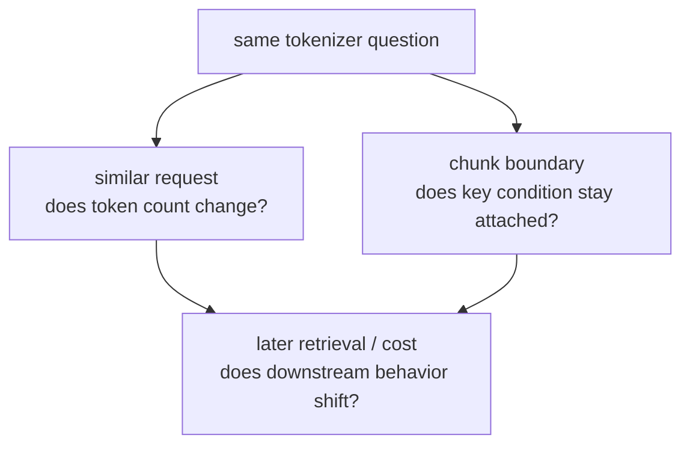

# P6-1.3 보충학습: BPE, WordPiece, SentencePiece를 처음 구분하는 법

> Section ID: `P6-1.3`
> Version: `v2026.07.07`

P6-1.1과 P6-1.2에서는 토큰과 토큰화가 왜 중요한지 보았습니다. 여기서는 본문에서 잠시 넘긴 대표 토크나이저 계열을 입문 기준으로 다시 정리합니다.

Part 6에서 `BPE`, `WordPiece`, `SentencePiece`, `토큰 수 감각과 분절 방식 차이의 연결`에 대한 첫 상세 설명은 이 절에서 잡습니다. 뒤 절에서는 현재 맥락에 필요한 최소 설명만 남기고, 대표 토크나이저 계열의 구분은 이 절과 개념사전을 기준으로 다시 연결합니다.

이 보충학습의 목적은 알고리즘 구현을 외우는 것이 아니라, `왜 같은 문장도 서로 다르게 잘릴 수 있는가`를 읽을 수 있게 만드는 데 있습니다.

## 이 보충학습의 범위

- BPE, WordPiece, SentencePiece는 무엇을 다르게 보는가?
- 왜 한국어 사용자에게 토큰 감각이 더 낯설 수 있는가?
- 토큰화 차이가 비용, 문맥 길이, 검색 품질에 어떻게 이어지는가?

이 절에서는 다음 내용을 깊게 다루지 않습니다.

- 토크나이저 학습 코드 구현
- 대규모 vocabulary 최적화 실험
- 멀티모달 토큰의 세부 직렬화 형식

이 보충학습에서는 대표 토크나이저가 문장을 어떻게 다르게 자르는지에만 집중합니다. 토크나이저 학습 코드 구현과 대규모 vocabulary 최적화 실험은 현재 보충학습 범위 밖으로 두고, 먼저 P6-1.1과 P6-1.2에서 잡은 `토큰 수`, `길이`, `비용` 감각을 대표 계열 비교에 연결하는 데 집중합니다. 멀티모달 토큰의 세부 직렬화 형식과 내부 포맷 전체도 이 책의 현재 본편 범위 밖에 둡니다.

지금 읽는 층위는 `분절 방식의 보강 층위`입니다. 앞 절의 토큰과 토큰화가 `모델은 텍스트를 어떤 계산 조각으로 읽는가`를 다뤘다면, 여기서는 그 조각을 만드는 대표 방식들이 왜 서로 다르게 느껴지는지 보강합니다. 뒤의 임베딩, RAG, 벡터 검색 절에서는 이 분절 차이가 실제 표현 학습, 청크 경계, 검색 품질로 어떻게 이어지는지 다시 회수합니다.

이 보충학습은 `토큰 수 감각`과 `토크나이저 계열 차이`를 연결하는 손잡이로 읽으면 충분하고, 구현 세부는 본편 바깥으로 넘겨 두는 편이 가장 안전합니다.

| 지금 단계의 손잡이 | 바로 다음에 이어질 질문 | 뒤에서 본격적으로 다시 읽는 위치 |
| --- | --- | --- |
| 토큰 수와 길이 감각 | 같은 문장도 왜 계산 조각 수가 달라질 수 있는가? | P6-1.1, P6-1.2 |
| 토크나이저 계열 차이 | 어떤 분절 방식이 어떤 언어 감각과 비용 차이를 만드는가? | P6-1.3 |
| 검색과 표현 연결 | 이 분절 차이가 청크 경계, 임베딩, 검색 품질에 어떻게 이어지는가? | P6-2.1, P6-10.1, P6-10.2, P6-11.1, P6-11.2 |

이 보충학습의 핵심은 `같은 뜻`과 `같은 토큰 조각`이 자동으로 같은 것이 아니며, 그 차이가 뒤의 비용과 검색 판단까지 밀고 내려간다는 점입니다.

## 이 보충학습의 목표

- 대표 토크나이저 이름을 보고 큰 차이를 설명할 수 있습니다.
- 토큰이 `단어 그대로`가 아닐 수 있다는 점을 더 구체적으로 말할 수 있습니다.
- 한국어와 영어가 토큰 수에서 다르게 느껴질 수 있는 이유를 설명할 수 있습니다.

## 대표 토크나이저는 무엇이 다른가

입문 단계에서는 다음 정도로 구분하면 충분합니다.

| 방식 | 입문용 직관 |
| --- | --- |
| BPE | 자주 함께 나오는 조각을 점점 묶어 간다 |
| WordPiece | 확률적 효율을 보며 더 좋은 조각 사전을 만든다 |
| SentencePiece | 공백 처리까지 포함해 문자열 자체를 더 직접 다룬다 |

중요한 점은 셋 모두 `문장을 계산하기 좋은 조각으로 바꾸려는 시도`라는 것입니다. 이름이 다르다고 목적이 완전히 달라지는 것은 아닙니다.

## 왜 한국어에서는 더 낯설게 느껴지나

영어는 공백 기준 단어 감각이 비교적 강합니다. 반면 한국어는 조사, 어미, 띄어쓰기 변형, 외래어 혼용 때문에 `표면상 한 단어`와 `실제 토큰 조각`이 더 쉽게 어긋날 수 있습니다.

그래서 한국어 사용자는 종종 다음처럼 느낍니다.

- 문장이 짧아 보이는데 토큰 수가 많다
- 같은 뜻인데 표현만 바꿔도 토큰 수가 달라진다
- 검색용 청크(chunk)를 자를 때 의미가 쉽게 끊긴다

이 감각은 이상한 것이 아니라, 토큰화가 언어 표면과 계산 단위를 다르게 보기 때문입니다.

## 왜 이 차이가 실제로 중요한가

토크나이저 차이는 단지 전처리 취향 문제가 아닙니다.

- 입력 비용이 달라질 수 있고
- context window 소모량이 달라질 수 있으며
- RAG에서 문서를 자르는 위치가 달라질 수 있고
- 임베딩 검색에서 의미가 끊기는 정도도 달라질 수 있습니다

즉, 토큰화 차이는 뒤의 P6-10.1 RAG의 필요성, P6-10.2 검색 결과와 생성의 결합, P6-11.1 벡터 데이터베이스, P6-11.2 인덱스와 검색 품질을 읽을 때도 계속 남아 있습니다.

## 작은 예시로 보기

같은 의미라도 다음 두 문장은 토큰 수가 다르게 나올 수 있습니다.

- `환불 정책을 알려줘`
- `환불 관련 정책을 간단히 설명해 줘`

사람은 둘을 비슷한 요청으로 읽지만, 모델은 서로 다른 조각 분할과 길이로 읽을 수 있습니다. 이 차이가 비용, 길이 제한, 검색 청크 단위에 영향을 줍니다. 그래서 실제로는 같은 의도의 질문 몇 개를 토크나이저로 나눠 보고, `같은 뜻인데 왜 더 비싸졌는가`, `어디서 더 잘 끊기는가`를 함께 확인해야 합니다.

## 사례로 보기

아래 도식은 이 보충학습의 사례를 `토크나이저 이름이 무엇인가`보다 `어떻게 자르느냐가 어떤 결과 차이로 이어지는가`라는 공통 질문으로 다시 묶은 것입니다.

이 도식에서 확인해야 할 점은 토크나이저 차이가 `이름 차이`로만 끝나지 않는다는 것입니다. 같은 뜻의 문장도 자르는 방식이 달라지면 토큰 수, 청크 경계, 이후 검색과 비용 판단까지 함께 달라질 수 있습니다.

### 사례 1. 같은 뜻인데 비용이 달라지는 요청

사용자가 `환불 정책을 알려줘`라고 짧게 묻는 장면과 `환불 관련 정책을 간단히 설명해 줘`라고 묻는 장면을 비교해 보겠습니다. 사람은 둘 다 거의 같은 요청이라고 느끼지만, 토크나이저는 조사와 보조 표현을 서로 다른 조각으로 자를 수 있습니다. 그 결과 겉보기 문장 길이는 비슷해도 실제 토큰 수는 다르게 나올 수 있고, 입력 비용과 context window 사용량도 달라집니다. 여기서 바뀌는 점은 `뜻이 같은가`만 보는 것에서 끝나지 않고, 그 뜻을 표현한 문장이 계산 단위에서 얼마나 다르게 쪼개지는지도 함께 보게 된다는 것입니다. 그래서 이 사례에서 확인해야 할 결과는 `뜻이 비슷한 질문 묶음에서도 토큰 수 차이가 반복해서 나타나는가`입니다.

### 사례 2. 검색 청크가 어색하게 끊기는 경우

긴 한국어 문서를 검색용 청크로 나눌 때를 생각해 보겠습니다. 사람은 문단 단위로 끊으면 자연스럽다고 느끼지만, 토큰화 기준에서는 조사나 어미가 중간에서 잘리며 의미 흐름이 어색해질 수 있습니다. 예를 들어 정책 문장의 핵심 조건이 뒤 어미 쪽에 붙어 있는데 청크 경계가 그 앞에서 끊기면, 검색 단계에서 중요한 제약이 떨어져 나갈 수 있습니다. 여기서 바뀌는 점은 `문단이 예쁘게 나뉘는가`보다 `핵심 조건이 토큰 경계 때문에 잘리지 않는가`를 먼저 보게 된다는 것입니다. 그래서 이 사례에서 확인해야 할 결과는 `청크 경계가 바뀌었을 때 검색으로 돌아오는 문장과 조건 정보가 실제로 달라지는가`입니다.

두 사례를 비교 기준으로 다시 묶으면 다음과 같습니다.

| 상황 | 겉으로는 비슷해 보이는 것 | 실제로 달라지는 계산 기준 | 뒤에서 흔들리는 작업 |
| --- | --- | --- | --- |
| 같은 뜻의 요청 비교 | 사용자 의도 | 토큰 수, 토큰 조각 경계 | 비용 추정, 입력 길이 관리 |
| 검색 청크 분할 | 문단 모양, 줄 수 | 핵심 조건이 붙어 있는 토큰 경계 | 검색 품질, RAG 회수 정확도 |

여기서 한 번 멈추고, `언제 토큰화 일반론만으로는 부족하고 BPE·WordPiece·SentencePiece 같은 계열 차이를 따로 떠올려야 하는가`를 짧게 고정해 두면 뒤 임베딩·검색 절에서 토크나이저 차이를 더 자연스럽게 읽을 수 있습니다.

| 먼저 떠올릴 질문 | 토크나이저 계열 비교 관점이 먼저 필요한 이유 | 뒤 절에서 이어질 것 |
| --- | --- | --- |
| 왜 같은 의미 요청도 토큰 수 차이가 계속 반복되나 | 조각 사전을 만드는 방식 자체가 다르면 분절 경계가 달라질 수 있기 때문 | 비용, 임베딩, 검색 입력 길이 |
| 왜 한국어에서는 토큰 감각이 더 낯설게 느껴지나 | 조사, 어미, 복합어가 분절 방식 차이를 더 크게 체감하게 만들기 때문 | 한국어 청크 설계와 검색 품질 |
| 왜 검색 청크 경계가 토크나이저에 따라 다르게 흔들리나 | 문단 경계보다 내부 토큰 조각 경계가 회수 품질에 더 직접 영향을 주기 때문 | RAG 청크와 벡터 검색 설계 |

## 다음 절과의 연결

이 보충학습은 토큰을 `잘게 나누는 감각`을 정리하는 역할을 합니다. 다음 장의 P6-2.1 임베딩은 이 토큰 조각들이 어떻게 벡터로 바뀌는지로 넘어가므로, 여기서 잡은 `조각 단위의 차이`는 이후 벡터 표현 차이로 이어집니다.

## 이 절에서 기억할 관점

- 토크나이저 이름은 달라도 목적은 `계산하기 좋은 조각 만들기`입니다.
- 토큰은 단어와 다를 수 있고, 한국어에서는 그 차이가 더 크게 느껴질 수 있습니다.
- 토큰화 차이는 비용, 문맥 길이, 검색 품질까지 이어집니다.

## 짧은 점검

- BPE, WordPiece, SentencePiece를 `완전히 다른 목적`이 아니라 `계산하기 좋은 조각을 만드는 서로 다른 방식`으로 설명할 수 있는가?
- 같은 뜻과 같은 토큰 조각이 자동으로 같지 않다는 점을 사례로 말할 수 있는가?
- 뒤 장을 읽을 때도 먼저 `분절 방식 차이가 임베딩과 검색 품질에 어떻게 내려오는가`를 떠올릴 준비가 되어 있는가?

## 언제 이 관점을 먼저 떠올려야 하는가

- BPE, WordPiece, SentencePiece를 한 문장씩 구분할 수 있는가?
- 왜 같은 뜻의 문장도 토큰 수가 달라질 수 있는지 설명할 수 있는가?
- 한국어에서 토큰 감각이 더 낯설 수 있는 이유를 말할 수 있는가?

## 출처와 참고 자료

- Rico Sennrich, Barry Haddow, Alexandra Birch, `Neural Machine Translation of Rare Words with Subword Units`, ACL, 2016, 확인 날짜: 2026-06-29.
- Taku Kudo, John Richardson, `SentencePiece: A simple and language independent subword tokenizer and detokenizer for Neural Text Processing`, EMNLP, 2018, 확인 날짜: 2026-06-29.
- Hugging Face, tokenization 관련 문서, 확인 날짜: 2026-06-29.
