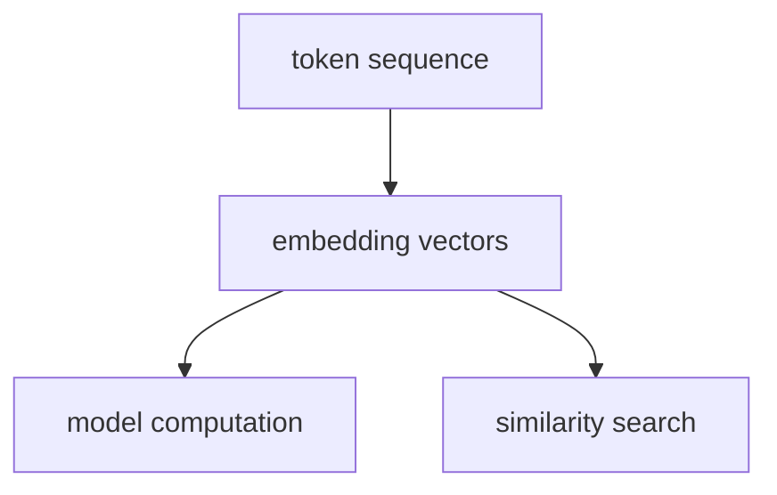
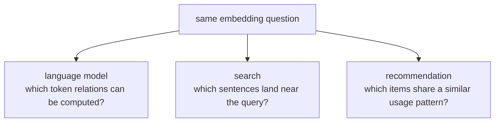

# P6-2.1 임베딩(embedding)의 직관

> Section ID: `P6-2.1`
> Version: `v2026.07.07`

P6-1장에서는 LLM이 텍스트를 토큰(token) 단위로 읽고, 그 토큰 길이가 비용과 문맥 길이에 직접 연결된다는 점을 보았습니다. 그러면 다음 질문이 생깁니다.

Part 6에서 `임베딩(embedding)`, `토큰 ID와 임베딩 벡터의 차이`, `LLM 내부 계산과 검색이 공유하는 표현 기반`에 대한 첫 상세 설명은 이 절에서 잡습니다. 뒤 절에서는 현재 맥락에 필요한 최소 설명만 남기고, 벡터 표현의 기본 뜻은 이 절과 개념사전을 기준으로 다시 연결합니다.

토큰으로 나뉜 입력은 모델 안에서 어떤 숫자 표현으로 바뀌는가?

이 절은 그 질문에 답합니다. 임베딩(embedding)은 토큰이나 문장을 모델이 계산할 수 있는 벡터(vector)로 바꾸는 표현 방식입니다.

## 이 절의 범위

이 절은 다음 질문을 정리합니다.

- 임베딩은 무엇을 위한 표현인가?
- 토큰 ID와 임베딩 벡터는 어떻게 다른가?
- `비슷한 의미가 가까워진다`는 말은 어떤 직관으로 설명할 수 있는가?
- 왜 임베딩이 LLM과 검색 서비스의 공통 기반처럼 보이는가?

이 절에서는 다음 내용을 깊게 다루지 않습니다.

- 임베딩 학습 알고리즘의 세부 수식
- word2vec, GloVe, sentence embedding의 상세 비교
- contrastive learning의 구현 세부

이 가운데 임베딩 계열을 어떻게 구분해 읽어야 하는지는 같은 장의 P6-2.3 보충학습에서 다시 회수합니다. 이후 검색과 연결되는 실제 사용 맥락은 P6-11.1 벡터 데이터베이스와 P6-11.2 인덱스와 검색 품질에서 이어집니다.

즉, 이 절은 임베딩을 RAG 구현 절로 바로 옮기기보다, `모델 내부 계산`과 `검색 비교`가 공통으로 기대는 앞쪽 기반으로 먼저 둡니다. 뒤 장에서는 이 기반 위에 검색 저장소와 retrieval 흐름이 어떻게 붙는지를 다시 읽습니다.

이 절에서는 임베딩을 `마법 같은 의미 저장소`가 아니라, 모델이 텍스트를 계산 가능한 공간에 놓는 표현 방식으로 이해합니다.

지금 읽는 층위는 다음처럼 잡을 수 있습니다.

| 지금 읽는 층위 | 앞 절에서 가져온 것 | 뒤 절로 넘길 것 |
| --- | --- | --- |
| 모델 내부 표현 층위 | 토큰과 토큰화 | 의미 거리, 벡터 검색, RAG의 기반 |

## 이 절의 목표

- 임베딩을 `토큰이나 문장을 벡터로 바꾸는 표현`으로 설명할 수 있습니다.
- 토큰 ID와 임베딩 벡터를 구분할 수 있습니다.
- 가까운 벡터가 비슷한 쓰임이나 문맥을 뜻할 수 있다는 직관을 설명할 수 있습니다.
- 다음 절의 `의미와 거리` 설명으로 자연스럽게 넘어갈 수 있습니다.

## 토큰 ID와 임베딩은 무엇이 다른가

토큰화(tokenization)가 끝나면 텍스트는 먼저 토큰 ID 같은 이산적인 번호(discrete index)로 바뀔 수 있습니다.

예를 들어:

- `"AI"` -> `1042`
- `"model"` -> `3881`

이 숫자 자체에는 의미가 거의 없습니다. 단지 사전(vocabulary) 안에서 항목을 가리키는 번호일 뿐입니다.

임베딩은 여기서 한 단계 더 나아갑니다. 각 토큰을 여러 숫자로 이루어진 벡터로 바꿉니다.

예를 들어 직관적으로는 다음처럼 생각할 수 있습니다.

```text
token id 1042 -> [0.12, -0.08, 0.44, ...]
token id 3881 -> [0.09, -0.02, 0.39, ...]
```

즉:

- 토큰 ID는 `무엇인지 가리키는 번호`
- 임베딩 벡터는 `계산에 쓰는 수치 표현`

입니다.

## 왜 벡터로 바꾸는가

Part 5에서 본 Transformer는 토큰들 사이 관계를 계산합니다. 하지만 관계 계산은 텍스트 문자열 자체가 아니라 숫자 벡터 위에서 이루어집니다.

임베딩이 필요한 이유는 다음과 같습니다.

- 숫자 연산을 할 수 있어야 하고
- 토큰들 사이 유사한 쓰임을 어느 정도 비슷한 위치에 놓을 수 있어야 하며
- attention, similarity search, classification head 같은 후속 계산으로 연결되어야 하기 때문입니다

다음처럼 이해할 수 있습니다.

`임베딩은 토큰을 모델 계산이 가능한 좌표처럼 바꾸는 단계다.`

## `비슷한 의미가 가까워진다`는 말은 무슨 뜻인가

이 표현은 자주 들리지만 쉽게 오해됩니다.

더 안전한 설명은 다음과 같습니다.

`비슷한 문맥에서 자주 쓰이거나 비슷한 역할을 하는 표현은, 학습된 임베딩 공간에서 더 가까운 벡터가 될 수 있다.`

예를 들어:

- `car` 와 `automobile`
- `문서 요약` 과 `요약 생성`

같은 표현은 완전히 동일하지 않아도 비슷한 문맥에서 쓰였다면 가까워질 수 있습니다.

하지만 이것은 절대 규칙이 아닙니다. 임베딩은 학습 데이터, 모델 구조, 목적 함수에 따라 달라집니다. 그래서 `가깝다 = 의미를 완벽히 안다`로 읽으면 위험합니다.

## LLM과 검색에서 왜 모두 중요해 보이나

임베딩은 LLM 내부 계산과 검색 서비스 양쪽에서 모두 중요한 역할을 합니다.

### LLM 내부

- 토큰을 벡터로 바꾸고
- 그 벡터를 attention과 feed-forward 계산에 사용합니다

### 검색과 RAG

- 질문과 문서를 벡터로 바꾸고
- 가까운 문서를 찾아 LLM에 다시 제공합니다

즉, 임베딩은 `생성 모델의 내부 표현`이면서 동시에 `검색 시스템의 비교 표현`이기도 합니다.

## 아주 단순하게 그리면



이 도식에서 확인해야 할 결과는 임베딩이 최종 답을 직접 내는 기능이 아니라, 이후 유사도 검색과 표현 비교 같은 계산이 가능해지도록 입력을 벡터 공간으로 옮기는 출발점이라는 점입니다.

## 사례로 보기

아래 도식은 이 절의 세 사례를 `문자열을 그대로 읽는가`보다 `표현을 어떤 비교 좌표로 바꾸는가`라는 공통 질문으로 다시 묶은 것입니다.



이 도식에서 확인해야 할 점은 과업이 달라도 먼저 필요한 단계가 같다는 것입니다. 모두 문자열 자체를 바로 계산하는 대신, 토큰이나 문장을 `비교 가능한 벡터 좌표`로 옮긴 뒤 다음 계산이 시작됩니다.

### 사례 1. 언어 모델 내부 표현

사용자가 `foundation model`과 `model card`가 들어 있는 문서를 읽는 장면을 떠올려 보겠습니다. 사람은 `model`이라는 같은 철자를 보자마자 뜻이 이미 정해져 있다고 느끼기 쉽습니다. 하지만 실제 문맥에서는 하나는 모델 계열 전체를 가리키고, 다른 하나는 모델 설명 문서를 가리키므로 바로 옆 단어에 따라 역할이 달라집니다. 반대로 `system`이나 `architecture`처럼 철자는 다른데도 비슷한 설명 문맥에 함께 등장하는 표현도 있을 수 있습니다. 문자열만 붙잡으면 이런 관계를 수치 계산으로 다루기 어렵습니다. 모델은 먼저 토큰을 임베딩 벡터로 바꿔 같은 문맥에서 함께 나타나는 정도, 다른 토큰과의 거리, attention 계산에 필요한 비교 기준을 만들고 나서야 다음 단계를 진행합니다. 여기서 바뀌는 점은 `단어를 읽는다`가 아니라 `단어를 계산 가능한 좌표에 놓는다`는 것이고, 그 결과 이후 층에서는 문자 모양이 아니라 벡터 관계를 기준으로 다음 계산이 이어집니다. 그래서 이 사례에서 확인해야 할 결과는 철자가 비슷한가보다, 같은 문맥에서 함께 쓰이는 단어들이 실제로 더 가까운 계산 좌표에 놓이는가입니다.

### 사례 2. 문장 검색

사용자가 `프롬프트의 한계는 무엇인가`라고 묻는데 문서에는 `프롬프트만으로 사실성을 보장할 수 있는가`라고 적혀 있을 수 있습니다. 사람은 보통 같은 단어가 반복되어야 같은 주제라고 느끼기 쉽습니다. 그래서 문자열 일치만 쓰면 질문에 없는 단어가 많은 문서는 뒤로 밀리기 쉽습니다. 하지만 이 두 문장은 모두 `프롬프트만으로 충분한가`라는 같은 문제 장면을 다루고 있습니다. 여기서 바뀌는 점은 단어가 똑같이 보이는가보다, 같은 설명 흐름과 문제 장면을 가리키는가를 먼저 비교하게 된다는 것입니다. 임베딩 기반 검색은 질문과 문서를 같은 벡터 공간에 놓아 표면 단어가 달라도 비슷한 방향의 문장을 가깝게 찾게 만듭니다. 그 결과 검색기는 `한계`라는 단어가 없더라도 실제로는 같은 설명 흐름을 가진 문서를 후보로 올릴 수 있습니다. 그래서 이 사례에서 확인해야 할 결과는 질문 단어가 그대로 없더라도 같은 문제를 다루는 문서가 실제 상위 후보로 올라오는가입니다.

### 사례 3. 추천과 유사도 비교

동영상 서비스에서 비슷한 강의를 추천하고 싶다고 해 보겠습니다. 사람은 제목에 같은 단어가 많으면 비슷한 강의라고 판단하기 쉽습니다. 하지만 제목이 둘 다 `입문`이어도 하나는 수식 중심, 다른 하나는 실습 중심일 수 있고, 반대로 제목은 달라도 시청자가 실제로는 같은 유형의 강의를 이어서 볼 수 있습니다. 제목 문자열만 비교하면 이런 차이를 놓쳐 추천이 어긋나기 쉽습니다. 여기서 바뀌는 점은 제목 글자 수를 세는 것보다, 실제 소비 흐름과 강의 성격을 같은 비교 좌표계에 함께 올려 본다는 것입니다. 이때 강의 설명, 시청 패턴, 썸네일 특징 같은 정보를 임베딩 공간에 함께 올리면 서로 다른 신호를 한 비교 좌표계에서 다룰 수 있습니다. 그 결과 추천기는 `글자만 비슷한 강의`보다 `실제로 함께 소비되는 강의`를 더 앞에 둘 수 있습니다. 그래서 이 사례에서 확인해야 할 결과는 제목 단어 일치보다 실제 학습 흐름이 비슷한 강의가 추천 상단에 더 모이는가입니다.

세 사례를 표현 좌표 관점으로 다시 묶으면 다음과 같습니다.

| 상황 | 표면 문자열만 보면 놓치기 쉬운 것 | 임베딩 좌표에서 더 보고 싶은 것 |
| --- | --- | --- |
| 언어 모델 내부 표현 | 같은 철자라도 문맥에 따라 다른 역할 | 같은 문맥에서 함께 쓰이는 관계 |
| 문장 검색 | 질문 단어가 그대로 없으면 관련 문서를 놓침 | 같은 문제 장면을 다루는 문장 근접성 |
| 추천과 유사도 비교 | 제목 단어가 같아도 실제 소비 흐름은 다를 수 있음 | 실제 사용 패턴과 성격의 유사성 |

## 실행 가능한 Python 예제로 보기

이번 예제의 목표는 `토큰 ID는 단지 번호이고, 실제 비교는 임베딩 벡터 위에서 일어난다`는 점을 눈으로 확인하는 것입니다. 단순히 ID와 벡터를 나란히 찍는 대신, 질의 벡터와 각 후보 벡터 사이 거리를 계산하고 가까운 후보 순서까지 함께 확인해 왜 ID만으로는 검색이나 비교가 불가능한지도 보겠습니다.

입력:

- 세 개의 토큰 ID
- 각 토큰에 대응하는 장난감 임베딩 벡터
- 하나의 질의 벡터

출력:

- 토큰 ID와 벡터 표현의 차이
- 질의와 각 후보 벡터 사이 거리
- 거리 기준 후보 순서

문제 상황:

- 벡터 검색은 토큰 ID 자체를 비교하는 것이 아니라 임베딩 공간에서 가까움을 비교한다는 점을 직접 볼 필요가 있다

입력(input):

위에 정리한 토큰 ID 예시, 문서 임베딩 후보, 질의 벡터를 사용합니다.

확인할 개념:

- 임베딩 기반 검색은 토큰 ID 일치가 아니라 벡터 공간에서의 거리와 방향을 비교해 후보를 고른다

```python
token_ids = {
    "prompt_limit_doc": 1042,
    "hallucination_doc": 3881,
    "vector_search_doc": 2210,
}

toy_embeddings = {
    "prompt_limit_doc": [0.12, -0.08, 0.44],
    "hallucination_doc": [0.09, -0.02, 0.39],
    "vector_search_doc": [-0.30, 0.11, 0.15],
}


def squared_distance(a, b):
    return sum((x - y) ** 2 for x, y in zip(a, b))


query_embedding = [0.10, -0.01, 0.41]

ranked = []
print("query_embedding =", query_embedding)
for name in token_ids:
    distance = squared_distance(query_embedding, toy_embeddings[name])
    ranked.append((name, distance))
    print(
        name,
        "-> id:", token_ids[name],
        "embedding:", toy_embeddings[name],
        "distance:", round(distance, 3),
    )

print("[ranked candidates]")
for rank, (name, distance) in enumerate(sorted(ranked, key=lambda item: item[1]), start=1):
    print("rank", rank, "=", name, "distance =", round(distance, 3))
```

실행 결과 예시는 다음처럼 읽을 수 있습니다.

```text
query_embedding = [0.1, -0.01, 0.41]
prompt_limit_doc -> id: 1042 embedding: [0.12, -0.08, 0.44] distance: 0.006
hallucination_doc -> id: 3881 embedding: [0.09, -0.02, 0.39] distance: 0.001
vector_search_doc -> id: 2210 embedding: [-0.3, 0.11, 0.15] distance: 0.242
[ranked candidates]
rank 1 = hallucination_doc distance = 0.001
rank 2 = prompt_limit_doc distance = 0.006
rank 3 = vector_search_doc distance = 0.242
```

## 이 예제를 표현 공간 관점으로 다시 보면

앞의 예제는 임베딩을 학습하는 코드가 아니라, `번호를 붙이는 일`과 `비교 가능한 수치 표현으로 바꾸는 일`이 다르다는 점을 가장 짧게 보여 주는 장면입니다. 여기서 읽어야 할 핵심은 `1042`와 `3881`의 숫자 차이 자체는 아무 뜻이 없지만, 벡터 공간에서는 질의와 `hallucination_doc`이 `vector_search_doc`보다 더 가깝다는 비교가 가능해진다는 점입니다. 즉, ID는 식별용이라면 임베딩은 이후 유사도 비교와 문맥 계산을 가능하게 하는 표현 공간의 출발점입니다.

이 예제에서 읽어야 할 핵심은 다음입니다.

- ID는 항목을 구분하는 번호입니다.
- 임베딩은 계산을 위한 수치 표현입니다.
- 이후 비교와 생성은 임베딩 같은 벡터 표현 위에서 이루어집니다.
- 검색이나 추천에서는 `어느 벡터가 더 가까운가`를 실제로 계산할 수 있어야 합니다.

임베딩은 LLM 시대에만 등장한 개념이 아닙니다. 자연어 처리에서는 오래전부터 단어를 분산 표현(distributed representation)으로 바꾸는 연구가 이어졌고, word2vec 같은 연구가 `비슷한 문맥의 단어는 비슷한 벡터가 될 수 있다`는 감각을 널리 퍼뜨렸습니다.

LLM 시대에는 이 개념이 더 넓어졌습니다.

- 단어뿐 아니라 토큰, 문장, 문서가 임베딩 대상이 되었고
- 생성 모델 내부 표현과 검색 서비스의 표현이 더 직접 연결되었기 때문입니다

커리큘럼 관점에서 이 절은 Part 6의 핵심 분기점입니다. 바로 앞의 P6-1.1, P6-1.2에서 `토큰이 무엇인가`와 `길이와 비용이 왜 중요한가`를 잡았다면, 이제 그 토큰이 어떻게 벡터가 되어 모델 계산과 검색으로 이어지는지를 알아야 합니다.

## 다음 절과의 연결

여기까지 오면 다음 질문이 생깁니다.

- 임베딩 벡터는 어떻게 비교하는가?
- `가깝다`, `멀다`, `비슷하다`는 말은 실제로 무엇을 뜻하는가?

이 질문은 P6-2.2 의미와 거리로 이어집니다.

## 언제 임베딩 관점을 먼저 떠올려야 하는가

| 먼저 떠올릴 질문 | 임베딩 관점이 먼저 필요한 이유 | 바로 다음 절에서 이어질 것 |
| --- | --- | --- |
| 토큰 ID만 알면 검색이나 비교를 설명할 수 있을까? | ID는 식별자일 뿐이고, 비교 가능한 계산 공간은 임베딩 벡터가 제공합니다. | 벡터 사이의 거리와 유사도를 비교하는 방법 |
| 같은 단어 조각이 비슷한 맥락에서 쓰인다는 말을 어떻게 계산으로 옮길까? | 임베딩은 토큰이나 문장을 좌표처럼 배치해 비슷함을 수치적으로 다루게 합니다. | 가까운 벡터와 먼 벡터를 읽는 직관 |
| LLM 내부 계산과 검색 시스템이 왜 같은 언어로 설명될까? | 둘 다 결국 벡터 표현 위에서 비교와 조합을 수행하기 때문입니다. | RAG와 벡터 검색으로 이어지는 공통 기반 |

## 이 절에서 기억할 관점

- 임베딩은 토큰이나 문장을 벡터로 바꾸는 표현 방식입니다.
- 토큰 ID는 번호이고, 임베딩은 계산 표현입니다.
- 비슷한 쓰임의 표현은 임베딩 공간에서 가까워질 수 있습니다.
- 임베딩은 LLM 내부 계산과 검색 서비스 양쪽의 공통 기반입니다.

## 짧은 점검

- 임베딩을 `계산이 가능한 좌표 표현`이라는 말로 다시 설명할 수 있는가?
- 토큰 ID와 임베딩 벡터가 맡는 역할 차이를 구분할 수 있는가?
- 다음 절을 `벡터를 어떻게 비교하는가`의 관점으로 읽을 준비가 되었는가?

## 언제 이 관점을 먼저 떠올려야 하는가

- 임베딩을 토큰이나 문장의 벡터 표현으로 설명할 수 있는가?
- 토큰 ID와 임베딩 벡터를 구분할 수 있는가?
- `가까운 벡터`를 어떤 직관으로 이해할 수 있는지 말할 수 있는가?
- 임베딩이 LLM과 검색 서비스에 모두 중요하다는 점을 설명할 수 있는가?

## 출처와 참고 자료

- Yoshua Bengio et al., `A Neural Probabilistic Language Model`, Journal of Machine Learning Research, 2003, 확인 날짜: 2026-06-29.
- Tomas Mikolov et al., `Efficient Estimation of Word Representations in Vector Space`, arXiv, 2013, 확인 날짜: 2026-06-29.
- Daniel Jurafsky, James H. Martin, `Speech and Language Processing` draft materials, 확인 날짜: 2026-06-29.
