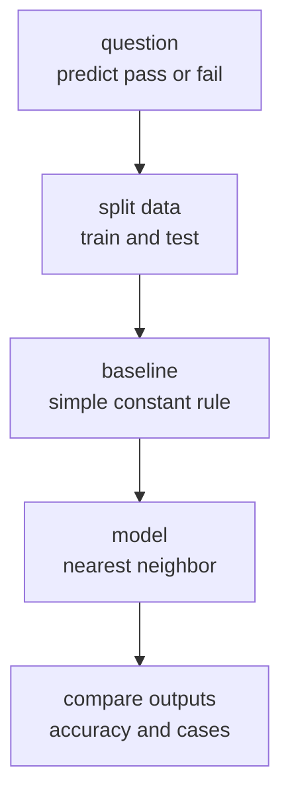

# P6-2.1 전통 머신러닝 예측 모델 목표

P6-1에서는 모델 없이도 프로젝트를 시작할 수 있다는 점을 확인했습니다. 이제 Part 6의 두 번째 프로젝트에서는 정말로 `예측 모델`을 하나 붙여 봅니다.

하지만 여기서도 출발점은 모델 이름이 아닙니다.

문제 정의, 데이터 분리, 기준점(baseline), 비교 가능한 출력

이 네 가지가 먼저입니다.

예측 프로젝트의 첫 목표는 높은 점수를 내는 것이 아니라, 비교 가능한 방식으로 baseline과 모델을 나란히 놓는 것이다.

## 이 절의 범위

이 절은 다음 질문에 답합니다.

- 작은 예측 모델 프로젝트는 어떤 구조로 시작하면 좋은가?
- 학습(train)과 평가(test)를 분리해 기록하는 이유는 무엇인가?
- baseline 없이 모델 정확도(accuracy)만 보면 왜 위험한가?
- 외부 라이브러리에 의존하지 않고도 작은 분류 실습 흐름을 어떻게 확인할 수 있는가?

이 절은 다음 내용은 깊게 다루지 않습니다.

- scikit-learn의 전체 API 사용법
- 교차검증(cross-validation)
- 하이퍼파라미터 자동 탐색
- 대규모 데이터셋 성능 비교

이 절은 작은 분류 프로젝트의 최소 기록 구조를 잡는 데 집중하고, baseline 이후의 개선 비교는 바로 다음 P6-2.2 기준 모델과 개선에서 다시 회수합니다. 라이브러리 전반 사용법과 대규모 성능 비교는 현재 본편 범위 밖으로 둡니다.

## 이 절의 목표

- 예측 프로젝트를 `문제 -> 데이터 분리 -> baseline -> 모델 -> 비교` 흐름으로 설명할 수 있습니다.
- baseline과 모델 성능을 함께 기록해야 하는 이유를 말할 수 있습니다.
- 작은 NumPy 실습으로 train/test 흐름을 눈으로 확인할 수 있습니다.

## 프로젝트 질문 설정

이번 실습의 질문은 다음처럼 단순하게 잡겠습니다.

> 공부 시간(hours)과 출석률(attendance rate)로 합격 여부(pass/fail)를 예측할 수 있는가?

이 질문이 좋은 이유는 다음과 같습니다.

- 입력(input) 두 개와 라벨(label) 하나로 구조가 단순합니다.
- 분류(classification) 문제의 기본 틀을 보여 주기에 적합합니다.
- baseline과 개선 모델을 비교하기 쉽습니다.

먼저 다음 세 질문으로 읽으면 좋습니다.

| 질문 | 짧은 답 |
| --- | --- |
| 이 프로젝트에서 먼저 정할 것은 무엇인가? | 입력, 라벨, 분리 방식 |
| 왜 baseline이 먼저인가? | 모델 점수의 의미를 비교하기 위해 |
| 최소 산출물은 무엇인가? | baseline 예측, 모델 예측, test 결과 비교 |

## 프로젝트 흐름



이 흐름은 Part 3에서 반복해 본 머신러닝 공통 구조를 프로젝트 문서로 다시 옮긴 것입니다.

## 예제 데이터

이번 절에서는 작은 장난감 데이터를 직접 배열(array)로 넣습니다.

- 특징(feature) 1: 주당 공부 시간
- 특징(feature) 2: 출석률(%)
- 라벨(label): 합격(1) / 불합격(0)

학습용 데이터(train):

| hours | attendance | label |
| ---: | ---: | ---: |
| 2.0 | 60.0 | 0 |
| 3.0 | 65.0 | 0 |
| 4.0 | 70.0 | 0 |
| 5.0 | 72.0 | 0 |
| 6.0 | 80.0 | 1 |
| 7.0 | 85.0 | 1 |
| 8.0 | 88.0 | 1 |
| 9.0 | 92.0 | 1 |

평가용 데이터(test):

| hours | attendance | label |
| ---: | ---: | ---: |
| 4.5 | 68.0 | 0 |
| 5.5 | 78.0 | 1 |
| 7.5 | 87.0 | 1 |
| 3.5 | 66.0 | 0 |

## baseline은 왜 먼저 두는가

이번 절의 baseline은 아주 단순합니다.

`학습 데이터에서 더 자주 나온 라벨을 평가 데이터에도 그대로 예측한다.`

이 baseline은 똑똑하지 않지만, 다음 질문에 답하게 해 줍니다.

`내가 만든 모델이 최소한 이 단순한 기준보다 나은가?`

이 기준이 없으면 모델 정확도가 0.75든 0.90이든 그것이 얼마나 의미 있는지 판단하기 어렵습니다.

프로젝트 문서 관점에서는 baseline이 `모델 없는 기준선` 역할을 합니다. 이 기준선이 있어야 뒤 절에서 `개선`이라는 말을 써도 과장이 줄어듭니다.

## Python 예제

이번 예제의 목적은 train/test 분리, baseline, 간단한 분류 모델 비교를 한 화면에서 보는 것입니다. 이번에는 단순히 정확도 숫자만 출력하지 않고, 실제 프로젝트 메모처럼 `샘플별 비교 결과`와 `틀린 사례 목록`까지 함께 남겨 보겠습니다. 여기서 `project_run`은 이번 실행의 질문, 데이터 크기, baseline 대비 결과를 한 번에 묶는 표지이고, `comparison_rows`는 어떤 샘플에서 예측이 갈렸는지 다음 회고로 넘기는 근거가 됩니다.

- 문제 상황: 합격 여부를 예측한다.
- 입력(input): 공부 시간, 출석률
- 정답(label): 합격(1) / 불합격(0)
- 확인할 개념:
  - baseline과 모델을 나란히 비교해야 한다
  - 평가 데이터는 따로 두어야 한다
  - 작은 모델이어도 예측 결과를 직접 읽을 수 있어야 한다
  - 나중에 회고할 수 있도록 샘플별 결과를 기록해야 한다

```python
import numpy as np

train_rows = [
    {"student_id": "train-01", "hours": 2.0, "attendance": 60.0, "label": 0},
    {"student_id": "train-02", "hours": 3.0, "attendance": 65.0, "label": 0},
    {"student_id": "train-03", "hours": 4.0, "attendance": 70.0, "label": 0},
    {"student_id": "train-04", "hours": 5.0, "attendance": 72.0, "label": 0},
    {"student_id": "train-05", "hours": 6.0, "attendance": 80.0, "label": 1},
    {"student_id": "train-06", "hours": 7.0, "attendance": 85.0, "label": 1},
    {"student_id": "train-07", "hours": 8.0, "attendance": 88.0, "label": 1},
    {"student_id": "train-08", "hours": 9.0, "attendance": 92.0, "label": 1},
]

test_rows = [
    {"student_id": "test-01", "hours": 4.5, "attendance": 68.0, "label": 0},
    {"student_id": "test-02", "hours": 5.5, "attendance": 78.0, "label": 1},
    {"student_id": "test-03", "hours": 7.5, "attendance": 87.0, "label": 1},
    {"student_id": "test-04", "hours": 3.5, "attendance": 66.0, "label": 0},
]

X_train = np.array([[row["hours"], row["attendance"]] for row in train_rows])
y_train = np.array([row["label"] for row in train_rows])

X_test = np.array([[row["hours"], row["attendance"]] for row in test_rows])
y_test = np.array([row["label"] for row in test_rows])

# baseline: train에서 가장 많은 라벨 하나만 계속 예측
baseline_class = int(np.bincount(y_train).argmax())
baseline_pred = np.full_like(y_test, baseline_class)

# 1-NN: 가장 가까운 train 샘플의 라벨을 사용
knn_pred = []
nearest_train_ids = []
for x in X_test:
    distances = np.linalg.norm(X_train - x, axis=1)
    nearest_index = int(np.argmin(distances))
    knn_pred.append(int(y_train[nearest_index]))
    nearest_train_ids.append(train_rows[nearest_index]["student_id"])

knn_pred = np.array(knn_pred)

comparison_rows = []
for index, row in enumerate(test_rows):
    comparison_rows.append({
        "student_id": row["student_id"],
        "hours": row["hours"],
        "attendance": row["attendance"],
        "true_label": row["label"],
        "baseline_pred": int(baseline_pred[index]),
        "baseline_correct": bool(baseline_pred[index] == y_test[index]),
        "knn_pred": int(knn_pred[index]),
        "knn_correct": bool(knn_pred[index] == y_test[index]),
        "nearest_train_id": nearest_train_ids[index],
    })

baseline_errors = [
    row["student_id"] for row in comparison_rows if not row["baseline_correct"]
]
knn_errors = [
    row["student_id"] for row in comparison_rows if not row["knn_correct"]
]

project_run = {
    "question": "Can study hours and attendance predict pass or fail?",
    "train_size": len(train_rows),
    "test_size": len(test_rows),
    "baseline_class": baseline_class,
    "baseline_accuracy": round(
        sum(row["baseline_correct"] for row in comparison_rows) / len(comparison_rows), 3
    ),
    "knn_accuracy": round(
        sum(row["knn_correct"] for row in comparison_rows) / len(comparison_rows), 3
    ),
    "baseline_error_ids": baseline_errors,
    "knn_error_ids": knn_errors,
}

print("project_run =", project_run)
print("comparison_rows =")
for row in comparison_rows:
    print(row)
```

실행 결과 예시는 다음과 같습니다.

```text
project_run = {'question': 'Can study hours and attendance predict pass or fail?', 'train_size': 8, 'test_size': 4, 'baseline_class': 0, 'baseline_accuracy': 0.5, 'knn_accuracy': 1.0, 'baseline_error_ids': ['test-02', 'test-03'], 'knn_error_ids': []}
comparison_rows =
{'student_id': 'test-01', 'hours': 4.5, 'attendance': 68.0, 'true_label': 0, 'baseline_pred': 0, 'baseline_correct': True, 'knn_pred': 0, 'knn_correct': True, 'nearest_train_id': 'train-03'}
{'student_id': 'test-02', 'hours': 5.5, 'attendance': 78.0, 'true_label': 1, 'baseline_pred': 0, 'baseline_correct': False, 'knn_pred': 1, 'knn_correct': True, 'nearest_train_id': 'train-05'}
{'student_id': 'test-03', 'hours': 7.5, 'attendance': 87.0, 'true_label': 1, 'baseline_pred': 0, 'baseline_correct': False, 'knn_pred': 1, 'knn_correct': True, 'nearest_train_id': 'train-07'}
{'student_id': 'test-04', 'hours': 3.5, 'attendance': 66.0, 'true_label': 0, 'baseline_pred': 0, 'baseline_correct': True, 'knn_pred': 0, 'knn_correct': True, 'nearest_train_id': 'train-02'}
```

## 결과를 어떻게 읽는가

이 결과에서 핵심은 `1.0`이라는 숫자 자체보다 비교 구조입니다.

- `project_run`은 baseline과 모델을 한 번에 비교할 최소 기록입니다.
- baseline은 네 샘플 중 절반만 맞췄고, 실패한 샘플은 `test-02`, `test-03`입니다.
- 1-NN 모델은 네 샘플을 모두 맞췄고, 각 test 샘플이 어떤 train 샘플과 가장 가까웠는지도 함께 남겼습니다.
- 따라서 이번 작은 데이터에서는 `특징을 실제로 사용한 모델`이 `아무 특징도 보지 않는 baseline`보다 낫다고 말할 수 있습니다.

하지만 동시에 조심해야 할 점도 있습니다.

- 테스트 샘플이 4개뿐이라 너무 작습니다.
- 우연히 쉬운 분할이었을 수 있습니다.
- 다른 데이터에서는 같은 결과가 나오지 않을 수 있습니다.

즉, 프로젝트 문서에는 성과와 한계를 함께 남겨야 합니다. 특히 `baseline_error_ids`처럼 틀린 샘플 ID를 바로 볼 수 있어야 다음 반복에서 `왜 그 샘플을 틀렸는가`를 다시 추적하기 쉽습니다.

이 결과를 다음 세 줄로 요약할 수 있으면 충분합니다.

- baseline은 단순히 다수 라벨만 예측했다
- 1-NN은 특징을 실제로 사용해 더 나은 예측을 보였다
- 샘플별 비교와 실패 목록이 있어야 다음 회고와 개선으로 이어질 수 있다
- 하지만 test 샘플이 매우 작아 일반화는 아직 단정할 수 없다

## 실무 감각으로 번역하면

이 작은 실습은 현실의 다음 질문과 연결됩니다.

- 단순 규칙보다 실제 특징을 쓰는 모델이 나은가?
- 그 개선이 우연이 아닌가?
- 더 많은 데이터나 다른 분할에서도 유지되는가?
- 잘 맞춘 사례뿐 아니라 틀린 사례는 어떤가?

이 감각이 바로 다음 절 P6-2.2에서 다룰 `기준 모델과 개선`의 핵심입니다.

즉, 이 절은 알고리즘 수업이라기보다 `프로젝트에서 baseline을 문서화하는 연습`으로 읽는 편이 더 정확합니다.

## 이 절에서 기억할 관점

- 예측 프로젝트는 baseline 없이 시작하면 안 됩니다.
- train과 test를 분리해야 비교가 의미를 가집니다.
- 모델 점수는 단독 숫자보다 baseline 대비 차이로 읽어야 합니다.
- 작은 데이터 실습이라도 예측값 자체를 직접 읽을 수 있어야 합니다.

## 체크리스트

- 문제를 분류(classification) 문제로 한 문장으로 설명할 수 있는가?
- 학습용 데이터와 평가용 데이터를 구분할 수 있는가?
- baseline과 모델 예측을 나란히 적을 수 있는가?
- 정확도 숫자와 함께 샘플별 예측값도 읽을 수 있는가?

## 출처와 참고 자료

- NumPy Developers, `NumPy documentation`, 확인 날짜: 2026-06-29. [https://numpy.org/doc/stable/](https://numpy.org/doc/stable/){: target="_blank" rel="noopener noreferrer" }

이 절의 데이터는 프로젝트 실습을 위해 만든 자체 장난감 데이터입니다.
