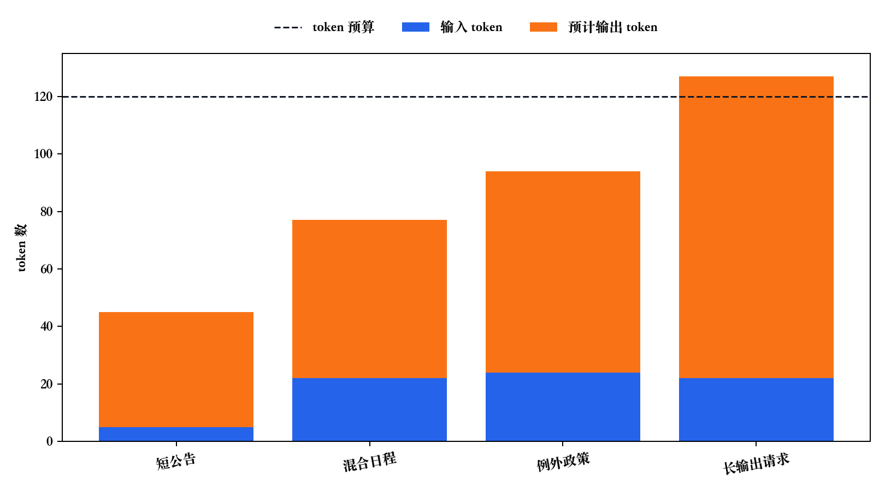

# P6-2.3 改变长度、成本与 chunk 的 tokenization

> Section ID: `P6-2.3`
> Version: `v2026.07.24`

在 P6-2.2 中，我们区分了 tokenizer 输出里的 token 字符串、token 数、token ID、token ID 顺序列。现在要从 `怎样阅读` 再往前走一步，看 tokenization 结果怎样改变实际判断。

这一节的中心不是再次判读 tokenizer 输出值。它要抓住的是，原文字符串一旦变成某种边界和 ID 顺序，输入长度、成本、chunk 边界、输出保留判断就会一起改变。

## tokenization 是什么程序

如果已经知道 token 是计算单位，现在就要看字符串实际怎样变成这种计算单位。tokenization 是把原文文本转换成模型读取的 token 序列的程序。

人看到的字符不会原样进入计算。必须先看 tokenizer 怎样确定边界，怎样从 vocabulary 中选择片段，又怎样把这些片段转换成 ID。

## 为什么需要单独的 tokenization

人会把句子看成字符、单词、句子。但模型不会直接用这些单位计算。输入必须先变成可计算的片段，这些片段再被编号，才能交给计算。

也就是说，tokenization 不是附加功能，而是从 `原文字符串 -> token 序列 -> token ID` 走向模型输入的第一道关口。

这里重要的是，tokenization 不是简单的按空格切分。tokenizer 会看原文，制造可能的片段边界，确认这些片段是否在 vocabulary 中，最后制造模型要接收的 ID 顺序。因此，阅读 tokenization 结果时，按下面三个问题依次确认会更安全。

| 判读问题 | 要确认的值 | 容易漏掉的误解 |
| --- | --- | --- |
| 在哪里切开？ | token 字符串的边界 | 以为它和人看到的词边界相同 |
| 被认作什么片段？ | 连接到 vocabulary 的 token 片段 | 以为可见文字片段都会以同样方式处理 |
| 附上了什么编号？ | token ID 顺序 | 把 ID 数字解释成意义或重要度 |

## tokenization 实际做什么

tokenization 中通常会同时发生下面这些事。

- 决定原文字符串要从哪里切开。
- 把切出的片段连接到 token vocabulary。
- 把每个片段转换成 token ID，交给模型计算。

在人看来像一个词的东西，可能会被切得更细；空格或标点这类人不强烈当作意义单位的部分，也可能影响 token 边界。

把同一个过程写得更分步一些，可以如下所示。

| 阶段 | 这里发生的事 | 人常见的误解 |
| --- | --- | --- |
| 1. 读取字符串 | 决定原文从哪里切开 | 以为字符或单词边界会原样保留 |
| 2. 选择片段 | 连接到 token vocabulary 中的片段 | 以为一定存在和人感觉到的词相同的片段 |
| 3. 转换成 ID | 为每个片段制造对应的 token ID | 以为模型直接理解了句子 |

也就是说，tokenization 不会停在 `切开字符串`。它还包括 `把哪个片段看成 vocabulary 项目`，以及 `这个片段要以什么 ID 交给模型`。

用很小的例子看同一程序，会更清楚。下面的值不是实际 tokenizer 输出，而是为了展示判读顺序而设置的说明用例。

| 原文字符串 | 可能的 token 字符串 | 可能的 token ID | 这里要读什么 |
| --- | --- | --- | --- |
| `退款政策` | `["退款", "政策"]` | `[4012, 8830]` | 看起来像一个词组的表达，也可能连接成两个片段。 |
| `10点时` | `["10", "点", "时"]` | `[110, 740, 812]` | 数字和中文时间表达可能成为不同边界。 |
| `Authorization` | `["Author", "ization"]` | `[6201, 14627]` | 较长英文表达可能连接成部分片段。 |

这张表要确认的不是数字本身。它要说明的是，在 `原文 -> token 字符串 -> token ID` 的转换中，人感觉到的词边界会被 tokenizer 重新定为计算边界。

## 把 tokenization 程序画成一行

```mermaid
--8<-- "assets/part-06/chapter-02/p6-c02-s03-tokenization-flow-zh.mmd"
```

在这条流程中，tokenization 负责的是 `把字符串转换成 token 序列和 token ID`。之后 ID 才会被查成向量表示，并接到计算中。

## tokenization 程序案例与示例

### 案例 1. 直接相信看起来像词的东西时

假设客户支持文档中反复出现 `退款政策` 这个表达。人会很快把它读成一个有意义的词组。因此，很容易以为 tokenizer 也会把这个字符串原样作为一个片段交过去。

这个标准的局限在于，它把人感觉到的词边界看成 tokenizer 边界。tokenization 阶段中，`退款政策` 可能保留为一个 vocabulary 项目，也可能切成 `退款`、`政策`，或更小的片段。

这个案例要确认的结果不是 `是否看起来像词`，而是 `原文从什么边界切开，这个片段连接到 vocabulary 的哪个项目，最后变成什么 ID 顺序`。数字是说明用例。

| 原文 | 人快速看的标准 | tokenization 程序 | 要确认的结果 |
| --- | --- | --- | --- |
| `退款政策` | 看起来像一个词组 | 边界：`退款` / `政策` -> vocabulary 片段：`["退款", "政策"]` -> ID：`[4012, 8830]` | 人感觉的一个词组可能变成两个 token ID。 |
| `Authorization` | 看起来像一个英文单词 | 边界：`Author` / `ization` -> vocabulary 片段：`["Author", "ization"]` -> ID：`[6201, 14627]` | 较长英文表达也可能变成部分片段的 ID 顺序。 |

因此，更安全的判断不是看见原文后立刻猜 token 数或 ID，而是依次确认 tokenizer 制造的边界、vocabulary 片段和 ID 顺序。

### 案例 2. 以为空格存在，单位也就相同

看到 `会议明天上午 10 点开始` 这样的句子时，人会先按空格或语义块思考单位。因此，很容易觉得按空格或短语数出的数量会接近 token 数。

这个标准的局限在于，tokenizer 不只看空格切分。数字、助词、词尾、时间表达会根据 vocabulary 和切分规则制造不同片段边界。`10点时` 可能保留成一束，也可能切成 `10`、`点`、`时`。

这个案例要确认的结果是，tokenization 不是 `空格分离`，而是把空格之外的数字、助词、词尾边界也重新定下来的程序。

| 原文一部分 | 人快速看的标准 | tokenization 程序 | 要确认的结果 |
| --- | --- | --- | --- |
| `明天上午` | 一个时间短语 | 边界：`明天` / `上午` -> vocabulary 片段：`["明天", "上午"]` -> ID：`[5920, 7710]` | 空格或短语边界怎样附着或分离，也是 tokenizer 结果的一部分。 |
| `10点时` | 一个时间表达 | 边界：`10` / `点` / `时` -> vocabulary 片段：`["10", "点", "时"]` -> ID：`[110, 740, 812]` | 数字和中文时间表达可能被切成不同片段。 |

因此，更安全的判断不是把空格词数直接换算成 token 数，而是看 tokenizer 实际制造的片段边界，以及这些边界对应的 ID 顺序。

### 案例 3. 感觉模型会直接计算句子时

用户输入 `请总结退款政策` 时，人容易想象模型把这句话整句读进去并马上抓住意义。但从 tokenization 视角看，字符串会先被切成片段，每个片段连接到 vocabulary 项目，然后变成 token ID 顺序。

这个标准的局限在于，它抹掉了 `句子输入` 与 `计算输入` 之间的转换阶段。如果跳过 tokenization，就无法区分模型实际接收的是原文字符串、token 片段，还是 token ID。

这个案例要确认的结果是，tokenization 不是辅助工作，而是把字符串交给实际计算输入的起始阶段。这个起始阶段不是只包含 `收到一句话`，而是包含 `选择片段并转换成 ID 顺序`。

| 阶段 | 输入中看到的东西 | tokenization 程序 | 要确认的结果 |
| --- | --- | --- | --- |
| 原文字符串 | `请总结退款政策` | tokenizer 接收整个字符串 | 还不是计算输入。 |
| 边界选择 | 看起来像 `请总结`, `退款政策` | 制造 `请` / `总结` / `退款` / `政策` 这样的候选边界 | 人看到的短语边界可能再次被切开。 |
| vocabulary 连接 | 片段候选出现 | 匹配 `["请", "总结", "退款", "政策"]` 这样的 token 片段 | 计算单位被制造出来。 |
| ID 转换 | 片段列表出现 | 变成 `[4012, 8830, 812, 6200]` 这样的 ID 顺序 | 产生要交给模型输入的编号列。 |

## 程序说明需要到哪里为止

第一次读 tokenization 时，只要像下面这样把 `人看到的单位` 和 `模型交给计算的单位` 分开就足够。

| 输入表达 | 人先看到的单位 | 模型侧要重新确认的事 |
| --- | --- | --- |
| `退款政策` | 一个词组 | 实际是否切得更细 |
| `会议明天上午 10 点开始` | 词组和数字时间表达 | 数字与时间表达会变成什么片段 |
| 整整一行句子 | 一个句子 | 是否变成 token 序列和 token ID |

如果停在这里，tokenization 可能只变成要背的程序。这一节更重要的问题是下一步：片段和 ID 这样改变后，成本预算、chunk 边界、输出保留判断中，哪一个必须重新看？

看到实际 tokenizer 输出或日志时，也要把程序本身和之后的判断变化一起读。

| 日志中看到的东西 | 先问的问题 | 接着改变的判断 |
| --- | --- | --- |
| `tokens: ["退款", "政策"]` | 原文在哪里被切开？ | 还能原样使用按词感觉到的长度吗？ |
| `ids: [4012, 8830]` | 每个片段变成了什么编号？ | 输入作为几个计算片段交过去？ |
| `tokens` 与 `ids` 的个数相同 | 片段和编号按什么顺序对应？ | 后面的成本、chunk、输出判断中如何使用这个个数？ |

## 要区分什么和什么

理解 tokenization 时，安全的做法是区分下面三层。

| 层级 | 这里做的事 |
| --- | --- |
| 原文字符串 | 人阅读的文字和标记 |
| tokenization | 把字符串切成计算片段的过程 |
| 模型计算 | 用 token ID 和向量执行实际计算的阶段 |

没有这个区分，`token 是否就是单词`、`模型是否原样阅读句子` 这样的混淆会反复出现。

这里重要的不是背 tokenizer 系列名称。重要的是读出这条流程：原文字符串不会直接被计算，而是在 tokenization 阶段变成片段和 ID 后，再进入模型输入。抓住这个流程，后面才能理解成本、chunk、输出长度为什么会一起摇晃。

## tokenization 结果会改变什么

知道 tokenization 是什么以后，现在要看它的结果实际会摇动什么。核心很简单。

`tokenization 不是单纯分离，而是同时改变长度、成本、chunk、输出解释的过程。`

比 tokenization 规则本身更先要看的值，是 tokenization 后显露出来的观察值。同一个原文也可能出现 token 数变化、上下文被切开的位置变化、输出可保留余量变化。因此，看完 `怎样切开` 后，马上要问 `因为这个结果，哪一个判断必须重新做？`

## 为什么同一句也会不同

即使意思相同，只要写法不同，token 边界和 token 数也可能一起改变。

- 使用缩写
- 数字写法
- 是否包含特殊字符
- 中英文混用

人眼中相似的句子，在模型侧可能被读成不同长度和不同成本，原因就在这里。

把同义请求中差异出现的位置很小地拆开，可以这样看。

| 人看来几乎相同的请求 | 说明用 tokenization 观察值 | 后面立刻摇晃的判断 |
| --- | --- | --- |
| `明天上午 10 点会议` | 6 tokens | 输入长度和成本 |
| `10:00 AM meeting tomorrow` | 8 tokens | 输入长度和成本 |
| `会议明天上午 10 点开始。Zoom 链接已发送到 mail@example.com` | 22 tokens | 成本估计和输出余量 |

数字不是实际 tokenizer 结果，而是展示判断流程的说明值。核心不是比较句子意义，而是先看 `哪些标记元素会增加计算片段`。缺少这一步，就很容易过快地进入 `句子差不多，成本也差不多吧` 这种直觉。

## token 边界接到运营判断时

```mermaid
--8<-- "assets/part-06/chapter-02/p6-c02-s03-tokenization-impact-zh.mmd"
```

这张图要确认的结果只有一个。token 边界一旦改变，后面的服务判断也会一起改变。

## 实际改变的事 1. 成本

看起来很短的句子，只要混入数字、符号、邮箱、URL，实际 token 数就可能很快增加。因此，`只是短咨询，成本也应该小` 这种直觉经常失准。

## 实际改变的事 2. 上下文长度和 chunk

切分文档时，人会先看段落数或大致视觉长度。但按 tokenization 标准，`原则` 和 `例外`、`问题` 和 `条件` 可能被切到不同片段中。这样搜索可能只拿回原则，错过重要例外。

## 实际改变的事 3. 输出长度

回答格式越长，输出 token 也会越多。表格、列表、代码块、附加说明变多时，最后的核心句子被截断的风险也会一起增大。

## 运营判断立刻摇晃的场景

tokenization 看起来像预处理细节，但在实际中会直接摇动运营判断。

- 看起来短的句子，实际可能更贵。
- 视觉上整齐的段落切分，可能不利于搜索。
- 亲切的输出格式，可能截断最后的核心句子。

也就是说，tokenization 差异不会停在 `字符串怎样切开`，而会接到 `留下什么、放弃什么` 这样的运营选择。

## 运营判断案例与示例

下面的图先把反复看到的三个场景放在一起。判读流程是 `表面上为什么看起来没问题 -> tokenization 视角下什么改变 -> 运营判断在哪里改变`。

```mermaid
--8<-- "assets/part-06/chapter-02/p6-c02-s03-tokenization-operation-cases-zh.mmd"
```

只看图时，`所以实际会发生什么失败` 仍可能有些抽象，因此下面三个案例会更慢地读同一场景。

把同一场景非常短地重新整理，可以如下所示。

| 场景 | tokenization 改变的东西 | 先重新看的值 |
| --- | --- | --- |
| 短句成本计算 | 实际 token 数和成本 | 输入 token 数 |
| RAG chunk 切分 | 上下文是否保留 | chunk size, overlap |
| 长回答格式 | 最后的核心句是否保留 | max output tokens |

### 案例 1. 短咨询改变成本判断时

`会议明天 10:00 AM 举行。Zoom 链接已发送到 mail@example.com。` 这样的句子在画面上看起来很短。但数字、冒号、英文、邮箱地址混在一起时，实际 token 数可能比预期更快增加。

这个案例的问题场景是判断 `只是短日程通知，成本也会小` 的瞬间。人先用的标准是画面上可见的行数和字数。这个标准的局限在于，它漏掉了数字、特殊字符、英文、邮箱这类 tokenizer 可能切得更细的元素。因此，这里 tokenization 改变的判断，会从 `字数是否短` 移到 `实际计算片段有几个`。

把它换成小的观察值，判断差异会更明显。数字是说明用例。

| 案例阶段 | 这个场景中的值 | 要确认的结果 |
| --- | --- | --- |
| 人先看到的标准 | 简短日程通知一句 | 预期成本也小 |
| 这个标准的局限 | 简单通知 6 tokens, 中英符号混合通知 22 tokens | 不能只靠画面行数判断输入成本 |
| tokenization 后观察值 | 输入 22 tokens, 预计输出 55 tokens | 整个请求读作 77 tokens |
| 改变的运营判断 | 120 token 预算中余量 43 tokens | 余量小就要缩短回答格式或输入表达 |

因此，这个案例要收束的句子是：如果不看 tokenization 结果，`看起来短` 这个第一判断可能把成本判断也一起带偏。

### 案例 2. 搜索结果改变 chunk 判断时

在规定文档中，`年假需提前 3 天申请` 和 `紧急病假可以事后报告` 如果被切到不同 chunk，搜索可能只拿回原则，错过重要例外。

这个案例的问题场景是判断 `搜索结果拿到了原则文档，所以搜索成功` 的瞬间。人先用的标准是搜索结果中是否包含相关文档。这个标准的局限在于，它没有检查回答所需的原则和例外是否留在同一个 token 束中。因此，这里 tokenization 改变的判断，会从 `搜索结果是否相关` 移到 `必须一起留下的上下文是否在同一个 chunk 中`。

把同一场景换成观察值，可以这样读。

| 案例阶段 | 这个场景中的值 | 要确认的结果 |
| --- | --- | --- |
| 人先看到的标准 | 搜索结果拿回原则文档 | 判断搜索成功 |
| 这个标准的局限 | 原则句 42 tokens, 例外句 18 tokens | 两者一起保留至少需要 60 tokens |
| tokenization 后观察值 | chunk size 50, overlap 0 | 原则后的例外无法全部留在同一 chunk |
| 改变的运营判断 | 例外条件可能从搜索上下文中消失 | 重新设定 chunk size 和 overlap |

因此，这个案例要收束的句子是：如果不看 tokenization 后的 chunk 边界，`搜索到了` 这个判断可能遮住例外条件遗漏。

### 案例 3. 亲切格式改变输出保留判断时

本来一个段落就能结束的配送延迟说明，如果不断加上表格和注意事项列表，最后的退款条件句可能被输出限制截断。因此，必须区分 `亲切的格式` 和 `必须留到最后的核心`。

这个案例的问题场景是判断 `加上表格和列表，回答会更亲切` 的瞬间。人先用的标准是回答是否好看、是否足够详细。这个标准的局限在于，表头、分隔符、重复句式也都会使用输出 token。因此，这里 tokenization 改变的判断，会从 `格式是否更亲切` 移到 `必须留下的句子是否还在输出限制内`。

输出侧也会以观察值显示 tokenization 结果。

| 案例阶段 | 这个场景中的值 | 要确认的结果 |
| --- | --- | --- |
| 人先看到的标准 | 表格和列表让回答更亲切 | 判断格式增加也没问题 |
| 这个标准的局限 | 表头和分隔符先使用 35 tokens | 格式也会消耗输出预算 |
| tokenization 后观察值 | 一般说明 32 tokens, 必留条件 18 tokens, max output tokens 80 | 总需求 85 tokens，超过限制 |
| 改变的运营判断 | 最后条件可能被截断 | 把核心条件移到前面，或减少格式 |

因此，这个案例要收束的句子是：如果不看 tokenization 后输出 token 用在哪里，`亲切格式` 反而可能把最后的核心条件挤出去。

现在可以把 tokenization 结果读成会改变成本、chunk、输出保留这三个判断的观察值。

## tokenization 后改变的判断

要抓住 tokenization 实际改变什么，最好像下面这样把 `表面变化` 和 `运营判断变化` 放在一起看。

| 表面变化 | tokenization 视角下实际改变的东西 | 立刻要改变的判断 |
| --- | --- | --- |
| 短句中数字和英文变多 | 实际输入 token 数比预期更大 | 是否要重新设定输入预算和成本？ |
| 把规定句子整齐地分成两段 | 原则和例外可能没有留在同一个 chunk | 是否要重新设定 chunk size 或 overlap？ |
| 回答格式中不断添加表格和列表 | 输出 token 先被格式使用，最后句子可能被截断 | 是否要重新确定必须留到最后的优先级？ |

这一节的核心应用，是不要把 `tokenization 差异` 当作预处理细节结束，而是立刻连接到成本、chunk、输出选择问题。

为了让读者能手动应用同样判断，可以再写成下面这样。

| 现在看到的观察值 | 先放下的判断 | 重新抓住的判断 |
| --- | --- | --- |
| token 数比预期多 | 只觉得 tokenizer 很奇怪 | 看数字、URL、代码、混合标记是否增加了输入成本 |
| chunk 切得很整齐 | 段落形状自然就足够 | 看回答所需的原则和例外是否留在同一个 token 束里 |
| 输出很长也很亲切 | 越详细越好 | 看核心条件是否能在 max output tokens 内留到最后 |

如果没有这个中间应用表，tokenization 说明很容易停在 `字符串怎样切开`。但这个 Section 的目标不是背切分规则，而是看到切分结果后，改变输入预算、chunk 边界、输出保留判断。

## 练习与示例

下面的练习不是准确猜 token 数的问题。先用实际 tokenizer SDK 确认输入会变成多少 token，再把这个值移到成本、chunk、输出保留判断中。每个问题先自己回答，再和下面的解说比较。

### 示例. 用 `tiktoken` 确认输入预算和输出余量

这个示例用 OpenAI 的 `tiktoken` 库，在同一种 encoding 下直接数输入 token。它不是为了背某个模型的最新上下文长度，而是为了看输入 token 和预计输出 token 相加时，运营判断怎样改变。这里使用 `o200k_base` encoding。

这里实际 tokenizer 计算出的值是 `input_tokens`。`expected_output_tokens`、`token_budget`、`chunk_size` 是服务设计者设定的运营假设值。必须区分这两者，才不会误以为 `SDK 会自动给出所有判断`。tokenizer 告诉我们输入变成了几个片段，人要把这个值连接到输出余量和 chunk 余量判断。

直接操作的值是 `samples` 中的 `text`、`expected_output_tokens`、`token_budget`、`chunk_size`。执行结果中先看的值是 `input_tokens`、`remaining_tokens`、`chunk_margin`。

```python
# 用 tiktoken 计算实际输入 token 数，并连接到成本、chunk、输出余量判断。
import tiktoken

encoding = tiktoken.get_encoding("o200k_base")

samples = [
    {
        "case": "plain_notice",
        "text": "会议明天举行。",
        "expected_output_tokens": 40,
        "token_budget": 120,
        "chunk_size": 80,
    },
    {
        "case": "mixed_schedule",
        "text": "会议明天 10:00 AM 举行。Zoom 链接已发送到 mail@example.com。",
        "expected_output_tokens": 55,
        "token_budget": 120,
        "chunk_size": 80,
    },
    {
        "case": "policy_with_exception",
        "text": "年假需提前 3 天申请。但紧急病假可以事后报告，并且必须附上证明。",
        "expected_output_tokens": 70,
        "token_budget": 120,
        "chunk_size": 20,
    },
    {
        "case": "verbose_output_request",
        "text": "请用表格整理配送延迟原因，并在最后补充注意事项列表和退款限制条件。",
        "expected_output_tokens": 105,
        "token_budget": 120,
        "chunk_size": 80,
    },
]

for sample in samples:
    input_tokens = len(encoding.encode(sample["text"]))
    total_tokens = input_tokens + sample["expected_output_tokens"]
    remaining_tokens = sample["token_budget"] - total_tokens
    chunk_margin = sample["chunk_size"] - input_tokens
    print(
        sample["case"],
        "input_tokens=", input_tokens,
        "expected_output_tokens=", sample["expected_output_tokens"],
        "total_tokens=", total_tokens,
        "remaining_tokens=", remaining_tokens,
        "chunk_margin=", chunk_margin,
    )
```

执行结果示例可以这样读。下面的输出是在本地 `.venv` 中用 `tiktoken==0.13.0` 确认的。

```text
plain_notice input_tokens= 5 expected_output_tokens= 40 total_tokens= 45 remaining_tokens= 75 chunk_margin= 75
mixed_schedule input_tokens= 22 expected_output_tokens= 55 total_tokens= 77 remaining_tokens= 43 chunk_margin= 58
policy_with_exception input_tokens= 24 expected_output_tokens= 70 total_tokens= 94 remaining_tokens= 26 chunk_margin= -4
verbose_output_request input_tokens= 22 expected_output_tokens= 105 total_tokens= 127 remaining_tokens= -7 chunk_margin= 58
```

这个结果中要读的核心不是某一个数字，而是判断的移动。输入 token 是实际 tokenizer 结果，输出 token、预算、chunk size 是读者可以改变的条件。

| 案例 | 先看到的值 | 改变的判断 |
| --- | ---: | --- |
| `plain_notice` | 输入 5 tokens, 全部 45 tokens | 短公告有足够的输入和输出余量。 |
| `mixed_schedule` | 输入 22 tokens, 全部 77 tokens | 数字、英文、邮箱加入后，即使画面上短，输入 token 也会增加。 |
| `policy_with_exception` | 输入 24 tokens, `chunk_margin` -4 tokens | 如果 chunk size 设为 20，这个输入无法留在一个束里。 |
| `verbose_output_request` | 全部 127 tokens, 剩余余量 -7 tokens | 亲切输出格式可能超过预算，把核心条件挤出去。 |

把数值移动画成图，可以看到比长输入更快侵蚀总体预算的，可能是 `预计输出格式`。



这个示例的目的不是背 tokenizer 的内部规则。它是先确认实际 token count，再把 `看起来是否短`、`段落是否自然`、`输出是否亲切` 这些人的标准，换成输入预算、chunk 余量、输出保留标准。

### 练习 1. 选择短公告的判断值

观察值：

| 项目 | 值 |
| --- | --- |
| 画面长度 | 1 段 |
| 原文特征 | 1 个 URL, 2 个优惠券代码, 1 个日期范围 |
| tokenizer 日志 | 一般通知 12 tokens, URL/代码/日期标记 31 tokens |
| 预计输出 | 50 tokens |

先自己回答。

- 这个场景中首先要重新看的值是什么？
- `短公告` 这个画面标准足够吗？
- 输入和预计输出相加后，应按多少 token 判断？
- 这个判断首先连接到成本、chunk、输出中的哪一个？

解说：首先要重新看的值是输入 token 数以及由此产生的成本。输入是 `12 + 31 = 43 tokens`，加上预计输出 50 tokens 后，整体判断值是 93 tokens。即使画面上只有 1 段，URL、优惠券代码、日期标记也会快速增加 token 片段。因此，这个场景要先确认 `看起来短的输入实际变成了多少 token`，再看 chunk 或输出。

### 练习 2. 找出搜索结果漏掉例外的原因

观察值：

| 项目 | 值 |
| --- | --- |
| 原则句 | 42 tokens |
| 例外句 | 18 tokens |
| 当前 chunk size | 50 tokens |
| overlap | 0 tokens |

先自己回答。

- 这个场景中首先要重新看的值是什么？
- 要把原则和例外一起放进一个 chunk，至少需要多少 tokens？
- 搜索器找到了原则句，为什么答案仍可能出错？
- 这个判断首先连接到成本、chunk、输出中的哪一个？

解说：首先要重新看的值是 chunk size 和 overlap。原则 42 tokens 加上例外 18 tokens，要一起保留至少需要 60 tokens。当前 chunk size 是 50，overlap 也是 0，所以两者很容易分开。即使搜索器找到了原则句，只要例外句不在同一个 token 束里，答案就可能漏掉重要条件。因此，这个场景要先确认 `必须一起留下的上下文是否在同一个 chunk 中`，而不是先看成本。

### 练习 3. 找出最后结论被截断的原因

观察值：

| 项目 | 值 |
| --- | --- |
| max output tokens | 80 tokens |
| 表格和列表格式 | 35 tokens |
| 一般说明 | 32 tokens |
| 必须保留的限制条件 | 18 tokens |

先自己回答。

- 这个场景中首先要重新看的值是什么？
- 当前输出构成是否放得进限制？
- 亲切格式为什么可能成为失败原因？
- 这个判断首先连接到成本、chunk、输出中的哪一个？

解说：首先要重新看的值是 max output tokens 和输出格式。当前构成是 `35 + 32 + 18 = 85 tokens`，所以超过 80 token 限制。表格和列表看起来亲切，但分隔符和重复句式会先使用输出 token。因此，这个场景不该按 `回答是否更漂亮` 判断，而要按 `核心限制条件是否能留到最后` 来缩减输出格式。

完成三个练习后，应该能用下面一句话整理。

`tokenization 结果不是预处理细节，而是让我们重新检查输入成本、chunk 上下文、输出保留的观察值。`

## 检查清单

- 能说明同一意义的句子也会因写法不同而有不同 token 数吗？
- 能说明 tokenization 会同时摇动成本、chunk 设计、输出长度限制吗？
- 是否理解 tokenization 的变化不会停在 `字符串分离`，而会继续影响运营判断？

## 来源与参考资料

- OpenAI Help Center, [What are tokens and how to count them?](https://help.openai.com/en/articles/4936856-what-are-tokens-and-how-to-count-them){: target="_blank" rel="noopener noreferrer" }, 确认日期：2026-07-19。用于确认输入·输出 token 数会连接到使用量、成本和请求长度判断。
- OpenAI Help Center, [Controlling the length of OpenAI model responses](https://help.openai.com/en/articles/5072518-controlling-the-length-of-openai-model-responses){: target="_blank" rel="noopener noreferrer" }, 确认日期：2026-07-19。用于确认回答长度通过 `max_output_tokens` 或 `max_completion_tokens` 这类输出 token 限制控制。
- OpenAI, [tiktoken README](https://github.com/openai/tiktoken/blob/main/README.md){: target="_blank" rel="noopener noreferrer" }, 确认日期：2026-07-19。用于说明同一文本的 tokenizer encoding 结果也会成为服务判断的观察值。
- Rico Sennrich, Barry Haddow, Alexandra Birch, [Neural Machine Translation of Rare Words with Subword Units](https://aclanthology.org/P16-1162/){: target="_blank" rel="noopener noreferrer" }, ACL 2016, 确认日期：2026-07-19。用于说明部分词单位会用于罕见词和未登录词处理的背景。
- Daniel Jurafsky, James H. Martin, [Speech and Language Processing, 3rd ed. draft](https://web.stanford.edu/~jurafsky/slp3/){: target="_blank" rel="noopener noreferrer" }, online manuscript released January 6, 2026, 确认日期：2026-07-19。用于将 `Words and Tokens` 章节作为 tokenization 和词边界说明的一般 NLP 背景依据。
