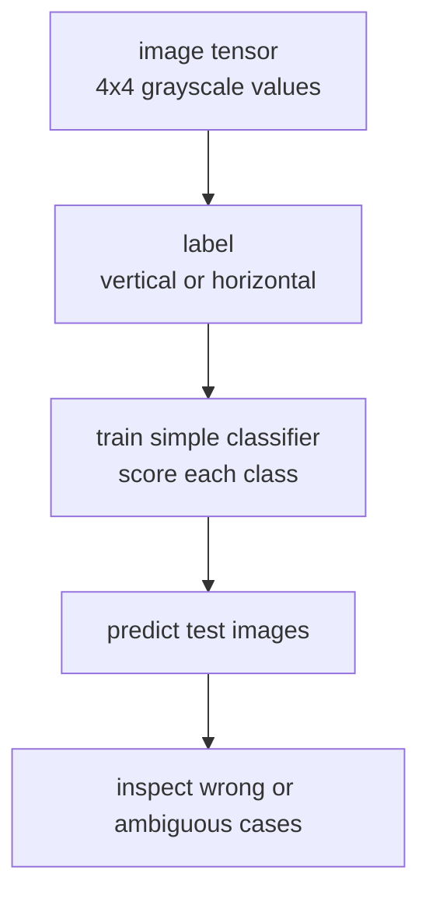

# P6-3.1 이미지 분류 모델 목표

P6-2까지는 표 데이터와 작은 분류 문제를 다뤘습니다. 이제 입력이 `표의 행(row)`이 아니라 `이미지 텐서(tensor)`일 때 프로젝트 문서가 어떻게 바뀌는지 확인합니다.

하지만 여기서도 먼저 분명히 해야 할 점이 있습니다.

이미지 분류 프로젝트의 핵심은 멋진 CNN 코드를 길게 쓰는 것이 아니라, 입력 모양(shape), 라벨(label), 예측 출력(prediction), 오류 사례를 함께 기록하는 것이다.

이 절의 목적은 딥러닝 성능 경쟁이 아니라, 이미지 분류 프로젝트 문서에 무엇을 먼저 적어야 하는지 익히는 것이다.

## 이 절의 범위

이 절은 다음 질문에 답합니다.

- 이미지 분류 프로젝트는 표 데이터 프로젝트와 무엇이 다른가?
- 작은 이미지 텐서를 분류 문제로 바꾸려면 무엇을 먼저 적어야 하는가?
- 딥러닝 프로젝트의 가장 작은 실습 단위는 어떻게 만들 수 있는가?

이 절은 다음 내용은 깊게 다루지 않습니다.

- 실제 CNN(convolutional neural network) 아키텍처 구현
- PyTorch나 TensorFlow 전체 사용법
- 대규모 이미지 데이터셋 훈련
- GPU 최적화

이 절은 이미지 프로젝트의 입력, 라벨, 예측, 오류 기록 구조를 먼저 잡는 데 집중합니다. 실제 오류 사례를 어떻게 읽고 다음 개선으로 넘길지는 바로 다음 P6-3.2 오류 사례 분석에서 다시 회수하고, 프레임워크 전반 사용법과 대규모 훈련은 현재 본편 범위 밖으로 둡니다.

## 이 절의 목표

- 이미지 분류 프로젝트를 `입력 모양 -> 라벨 -> 학습 -> 예측 -> 오류` 흐름으로 설명할 수 있습니다.
- 이미지도 결국 숫자 배열(array)이라는 점을 다시 확인할 수 있습니다.
- 작은 실습으로 train/test 예측 흐름을 직접 기록할 수 있습니다.

## 왜 작은 이미지 프로젝트가 필요한가

독자는 이미지 분류를 들으면 곧바로 복잡한 모델 구조부터 떠올리기 쉽습니다. 하지만 프로젝트 문서에서 먼저 필요한 것은 다음입니다.

- 이미지 한 장은 어떤 숫자 배열인가?
- 분류 클래스(class)는 몇 개인가?
- 학습용 샘플과 평가용 샘플은 어떻게 구분되는가?
- 잘 맞춘 사례와 애매한 사례는 무엇인가?

즉, Part 6의 이미지 프로젝트는 `딥러닝 프레임워크 훈련법`을 전부 배우는 자리가 아니라, Part 4에서 본 신경망 감각을 실제 프로젝트 기록 형태로 바꾸는 자리입니다.

먼저 다음 세 질문으로 읽으면 좋습니다.

| 질문 | 짧은 답 |
| --- | --- |
| 이 프로젝트에서 먼저 적을 것은 무엇인가? | 입력 모양, 클래스 라벨, train/test 분리 |
| 왜 작은 패턴 이미지로 시작하는가? | 픽셀 배열과 예측 흐름을 눈으로 확인하기 위해 |
| 최소 산출물은 무엇인가? | 예측값, 정확도, 애매한 샘플 기록 |

## 프로젝트 질문 설정

이번 절의 질문은 일부러 아주 작게 잡겠습니다.

> 4x4 흑백 패턴 이미지에서 `세로 막대(vertical bar)`와 `가로 막대(horizontal bar)`를 구분할 수 있는가?

이 질문이 좋은 이유는 다음과 같습니다.

- 픽셀(pixel) 배열을 직접 눈으로 볼 수 있습니다.
- 라벨이 명확합니다.
- 애매한 혼합 패턴을 일부러 넣어 오류 분석까지 이어 갈 수 있습니다.

## 프로젝트 흐름



이 도식은 이미지 분류 프로젝트를 `복잡한 CNN 구현`이 아니라 `입력 배열과 예측 기록의 흐름`으로 다시 보여 줍니다. 이미지도 결국 숫자 텐서이고, 프로젝트 문서에서는 그 텐서가 라벨과 예측으로 어떻게 이어지는지를 먼저 남겨야 합니다.

프로젝트 문서 관점으로 다시 쓰면 다음 순서입니다.

| 단계 | 문서에 남길 것 |
| --- | --- |
| 입력 | 이미지 shape와 픽셀 예시 |
| 라벨 | 클래스 정의 |
| 학습 | 어떤 작은 분류기를 썼는가 |
| 결과 | train/test 예측과 정확도 |
| 오류 | 애매하거나 틀린 샘플 |

## 예제 데이터

이번 절에서는 흑백 4x4 이미지를 직접 배열로 넣습니다.

- class 0: 세로 막대(vertical bar)
- class 1: 가로 막대(horizontal bar)

예시 이미지를 글자로 보면 다음과 같습니다.

### 세로 막대(class 0)

```text
0 1 1 0
0 1 1 0
0 1 1 0
0 1 1 0
```

### 가로 막대(class 1)

```text
0 0 0 0
1 1 1 1
1 1 1 1
0 0 0 0
```

이 데이터는 실제 사진이 아니라 `이미지 텐서와 라벨의 관계`를 설명하기 위한 장난감 데이터입니다.

## Python 예제

이번 예제의 목적은 4x4 이미지를 펼쳐 16차원 입력으로 바꾸고, 매우 작은 softmax 분류기를 학습해 test 예측을 확인하는 것입니다. 이번에는 `정확도`만 보는 대신, 어떤 test 이미지가 애매했는지 바로 추적할 수 있도록 `sample_id`, `pattern_name`, `confidence_margin`도 함께 남기겠습니다.

- 문제 상황: 세로 막대와 가로 막대를 구분한다.
- 입력(input): 4x4 흑백 이미지 4장(train), 3장(test)
- 정답(label): vertical = 0, horizontal = 1
- 확인할 개념:
  - 이미지도 숫자 배열이다
  - 분류기는 클래스 점수(score)를 비교해 예측을 만든다
  - test 데이터에서 애매한 이미지가 틀릴 수 있다
  - 오류 사례로 이어질 수 있게 샘플별 예측 기록을 남겨야 한다

```python
import numpy as np

train_rows = [
    {
        "sample_id": "train-vertical-01",
        "pattern_name": "vertical_bar",
        "image": [[0, 1, 1, 0], [0, 1, 1, 0], [0, 1, 1, 0], [0, 1, 1, 0]],
        "label": 0,
    },
    {
        "sample_id": "train-vertical-02",
        "pattern_name": "vertical_bar",
        "image": [[0, 1, 1, 0], [0, 1, 1, 0], [0, 1, 1, 0], [0, 1, 1, 0]],
        "label": 0,
    },
    {
        "sample_id": "train-horizontal-01",
        "pattern_name": "horizontal_bar",
        "image": [[0, 0, 0, 0], [1, 1, 1, 1], [1, 1, 1, 1], [0, 0, 0, 0]],
        "label": 1,
    },
    {
        "sample_id": "train-horizontal-02",
        "pattern_name": "horizontal_bar",
        "image": [[0, 0, 0, 0], [1, 1, 1, 1], [1, 1, 1, 1], [0, 0, 0, 0]],
        "label": 1,
    },
]

test_rows = [
    {
        "sample_id": "test-vertical-clear",
        "pattern_name": "vertical_bar",
        "image": [[0, 1, 1, 0], [0, 1, 1, 0], [0, 1, 1, 0], [0, 1, 1, 0]],
        "label": 0,
    },
    {
        "sample_id": "test-horizontal-clear",
        "pattern_name": "horizontal_bar",
        "image": [[0, 0, 0, 0], [1, 1, 1, 1], [1, 1, 1, 1], [0, 0, 0, 0]],
        "label": 1,
    },
    {
        "sample_id": "test-mixed-pattern",
        "pattern_name": "mixed_bar",
        "image": [[0, 1, 1, 0], [0, 1, 1, 0], [1, 1, 1, 1], [0, 0, 0, 0]],
        "label": 1,
    },
]

X_train = np.array([row["image"] for row in train_rows], dtype=float)
y_train = np.array([row["label"] for row in train_rows])
X_test = np.array([row["image"] for row in test_rows], dtype=float)
y_test = np.array([row["label"] for row in test_rows])

original_train_shape = X_train.shape
original_test_shape = X_test.shape

X_train = X_train.reshape(len(X_train), -1)
X_test = X_test.reshape(len(X_test), -1)

W = np.zeros((16, 2))
b = np.zeros(2)

def softmax(z):
    z = z - z.max(axis=1, keepdims=True)
    exp_z = np.exp(z)
    return exp_z / exp_z.sum(axis=1, keepdims=True)

def one_hot(y, num_classes=2):
    out = np.zeros((len(y), num_classes))
    out[np.arange(len(y)), y] = 1
    return out

Y_train = one_hot(y_train)
learning_rate = 0.2

for _ in range(400):
    logits = X_train @ W + b
    probs = softmax(logits)
    grad_W = X_train.T @ (probs - Y_train) / len(X_train)
    grad_b = (probs - Y_train).mean(axis=0)
    W -= learning_rate * grad_W
    b -= learning_rate * grad_b

train_probs = softmax(X_train @ W + b)
train_pred = train_probs.argmax(axis=1)
test_probs = softmax(X_test @ W + b)
test_pred = test_probs.argmax(axis=1)

test_records = []
for index, row in enumerate(test_rows):
    probs = np.round(test_probs[index], 3)
    confidence_margin = round(
        float(np.sort(test_probs[index])[-1] - np.sort(test_probs[index])[-2]), 3
    )
    test_records.append({
        "sample_id": row["sample_id"],
        "pattern_name": row["pattern_name"],
        "true_label": row["label"],
        "pred_label": int(test_pred[index]),
        "correct": bool(test_pred[index] == y_test[index]),
        "probs": probs.tolist(),
        "confidence_margin": confidence_margin,
        "needs_error_review": bool(confidence_margin <= 0.1),
    })

project_run = {
    "original_train_shape": original_train_shape,
    "original_test_shape": original_test_shape,
    "flattened_train_shape": X_train.shape,
    "flattened_test_shape": X_test.shape,
    "train_accuracy": round(float((train_pred == y_train).mean()), 3),
    "test_accuracy": round(float((test_pred == y_test).mean()), 3),
    "uncertain_sample_ids": [
        row["sample_id"] for row in test_records if row["needs_error_review"]
    ],
}

print("project_run =", project_run)
print("test_records =")
for row in test_records:
    print(row)
```

실행 결과 예시는 다음과 같습니다.

```text
project_run = {'original_train_shape': (4, 4, 4), 'original_test_shape': (3, 4, 4), 'flattened_train_shape': (4, 16), 'flattened_test_shape': (3, 16), 'train_accuracy': 1.0, 'test_accuracy': 0.667, 'uncertain_sample_ids': ['test-mixed-pattern']}
test_records =
{'sample_id': 'test-vertical-clear', 'pattern_name': 'vertical_bar', 'true_label': 0, 'pred_label': 0, 'correct': True, 'probs': [0.997, 0.003], 'confidence_margin': 0.994, 'needs_error_review': False}
{'sample_id': 'test-horizontal-clear', 'pattern_name': 'horizontal_bar', 'true_label': 1, 'pred_label': 1, 'correct': True, 'probs': [0.003, 0.997], 'confidence_margin': 0.994, 'needs_error_review': False}
{'sample_id': 'test-mixed-pattern', 'pattern_name': 'mixed_bar', 'true_label': 1, 'pred_label': 0, 'correct': False, 'probs': [0.5, 0.5], 'confidence_margin': 0.0, 'needs_error_review': True}
```

## 결과를 어떻게 읽는가

이 결과에서 읽어야 할 핵심은 세 가지입니다.

1. 입력 모양  
   `project_run`에는 원래 shape `(4, 4, 4)`와 펼친 뒤 shape `(4, 16)`이 함께 남습니다. 즉, 이미지가 원래는 4x4 픽셀 묶음이었고, 학습 직전에는 16개 숫자 입력으로 바뀌었다는 점을 한 번에 확인할 수 있습니다.

2. 학습 데이터와 평가 데이터 분리  
   train에서는 모두 맞았지만, test에서는 `test-mixed-pattern`을 틀렸습니다. 즉, 학습 성공과 일반화 성공은 같은 말이 아닙니다.

3. 확률 분포의 애매함  
   세 번째 샘플의 확률이 `[0.5, 0.5]`로 나온 것은 모델이 이 이미지를 거의 구분하지 못했다는 뜻입니다. `confidence_margin = 0.0`과 `needs_error_review = True`를 함께 남겼기 때문에, 다음 절에서 어떤 샘플을 우선 분석해야 하는지도 바로 정할 수 있습니다.

이 결과를 다음 세 줄로 요약할 수 있으면 충분합니다.

- 이미지는 결국 16개 숫자 입력으로 바뀌었다
- train에서는 맞아도 test에서는 애매한 샘플이 틀릴 수 있다
- 샘플 ID와 불확실성 기록이 있어야 다음 오류 분석으로 자연스럽게 이어진다
- 애매한 확률 출력은 다음 절 오류 분석의 출발점이다

이 작은 실습은 Part 4와 Part 6을 연결합니다.

- Part 4에서는 입력층(input layer), 출력층(output layer), 손실(loss), 학습(learning)을 개념으로 설명했습니다.
- Part 6에서는 그 흐름을 아주 작은 이미지 프로젝트 문서로 바꿉니다.

즉, 이번 절은 `CNN을 배웠다`가 아니라 `이미지 분류 프로젝트를 어떤 구조로 기록해야 하는가`를 익히는 자리입니다.

이 절은 Part 6 전체 흐름에서 `입력 표현이 표가 아니라 이미지가 되었을 때도 프로젝트 문서의 뼈대는 유지된다`는 점을 보여 줍니다.

## 다음 절과의 연결

P6-3.2에서는 방금 틀린 세 번째 샘플을 중심으로 `오류 사례 분석`을 합니다. 이미지 프로젝트에서는 점수보다 `어떤 이미지에서 왜 흔들렸는가`를 남기는 일이 더 중요할 때가 많기 때문입니다.

## 이 절에서 기억할 관점

- 이미지도 숫자 배열(array)입니다.
- 이미지 분류 프로젝트는 입력 모양, 라벨, 예측값, 오류 사례를 함께 남겨야 합니다.
- train 정확도와 test 정확도는 반드시 분리해서 읽어야 합니다.
- 애매한 확률 출력은 오류 분석의 출발점이 됩니다.

## 체크리스트

- 이미지 입력이 어떤 shape으로 모델에 들어가는지 설명할 수 있는가?
- 클래스 라벨이 무엇인지 분명히 적을 수 있는가?
- train과 test 결과를 분리해 기록했는가?
- 애매하거나 틀린 샘플을 다음 절 분석 대상으로 남겼는가?

## 출처와 참고 자료

- NumPy Developers, `NumPy documentation`, 확인 날짜: 2026-06-29. [https://numpy.org/doc/stable/](https://numpy.org/doc/stable/){: target="_blank" rel="noopener noreferrer" }

이 절의 이미지 데이터는 프로젝트 실습을 위해 만든 자체 장난감 데이터입니다.
