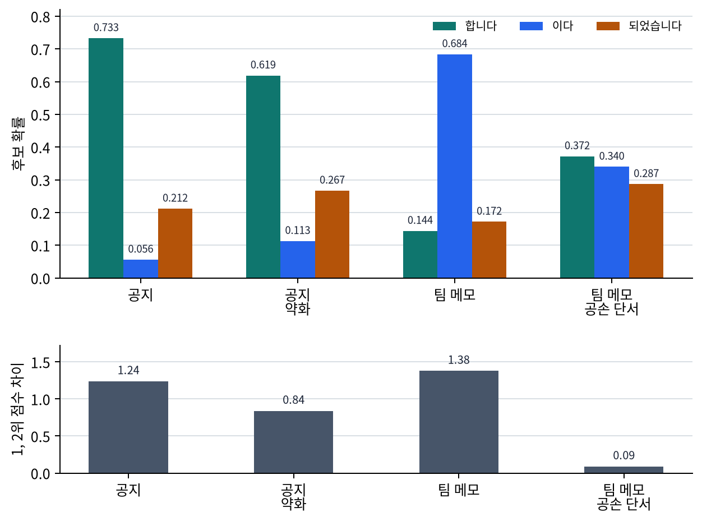

# P6-3.1 Transformer를 LLM 관점에서 다시 읽기

> Section ID: `P6-3.1`
> Version: `v2026.07.19`

Part 5에서 본 Transformer 구조를 이제 Part 6의 생성형 언어 모델 본류 안으로 다시 가져와야 합니다.

Part 6에서 `Transformer를 LLM 관점에서 다시 읽는 기준`, `토큰 -> 임베딩 -> attention 블록 -> 다음 토큰 점수 흐름`, `LLM의 기본 계산 엔진으로서의 Transformer`에 대한 첫 상세 설명은 이 절에서 잡습니다. Part 5가 블록 구조 자체를 설명했다면, 이 절은 그 구조가 LLM 생성 흐름 안에서 어디에 놓이는지를 다시 연결하는 Part 6의 대표 절입니다. 뒤 절에서는 현재 맥락에 필요한 최소 설명만 남기고, Transformer의 기본 뜻은 개념사전과 앞 Part의 중심 Section을 기준으로 다시 연결합니다.

LLM 관점에서 Transformer를 다시 보면, 무엇이 정말 핵심인가? LLM에서 Transformer는 토큰들을 임베딩으로 바꾸고, self-attention으로 서로의 관계를 읽고, feed-forward와 반복 블록으로 표현을 정제하며, 최종적으로 다음 토큰을 예측하는 기본 구조입니다.

## 생성 계산 엔진이 다루는 질문

생성 계산 엔진을 다시 읽을 때 핵심 질문은 다음 세 가지입니다.

- 이미 본 Transformer를 LLM 관점으로 다시 보면 무엇이 달라지는가?
- 토큰, 임베딩, self-attention, 다음 토큰 예측은 어떻게 이어지는가?
- 왜 Transformer는 생성형 언어 모델의 기본 구조가 되었는가?

Transformer 블록의 큰 구조는 여기서 잡고, multi-head attention과 위치 표현은 같은 장의 P6-3.3 보충학습에서, KV cache는 P6-3.4에서, sparse attention과 long-context 주변 구현 감각은 P6-3.5에서 다시 읽습니다. 서비스 운영 관점의 지연 시간과 비용 제약은 뒤의 P6-16.1 서비스 운영 제약에서 연결합니다.

Transformer 공식을 다시 전개하는 것보다 중요한 것은 Part 6에서 다룰 GPT, pretraining, next-token prediction, RAG, agent 설명을 모두 떠받치는 `LLM 기준의 구조 지도`입니다. 세부 블록 이름보다 먼저 붙잡아야 할 것은 `입력 토큰이 어떤 계산 흐름을 거쳐 다음 토큰 점수로 이어지는가`입니다.

| 지금 이 절에서 읽는 것 | 바로 다음 절이나 뒤 장으로 넘기는 것 |
| --- | --- |
| 토큰, 임베딩, attention 블록, 다음 토큰 점수가 어떤 한 흐름을 이루는가 | context window가 어디까지 입력을 담을 수 있는가 |
| Transformer가 LLM의 기본 계산 엔진이라는 점 | GPT 계열 분화, pretraining, 운영 비용 제약이 각각 무엇을 더 바꾸는가 |

이 절이 Part 6 본류 요청 흐름에서 맡는 위치를 가장 짧게 붙잡으면 다음과 같습니다.

| 지금 절의 역할 | 바로 다음에 붙는 질문 | 이어서 읽을 절 |
| --- | --- | --- |
| 입력 토큰이 어떤 계산 엔진을 통과하는가 | 이 엔진이 왜 `다음 토큰 생성`으로 이어지는가 | P6-4.1 GPT 계열의 위치, P6-5.1 다음 토큰 예측 |

여기서 확인해야 할 결과는 Transformer를 `다음 토큰을 한 번 맞히는 장치`가 아니라, 문맥 전체를 반영해 다음 후보 분포를 갱신하는 중심 엔진으로 읽게 되는가입니다. 이 구분이 잡혀야 Part 5의 딥러닝 구조 설명이 Part 6의 생성 모델 구조, context window, prompt, RAG 설명으로 자연스럽게 이어집니다.

## 같은 Transformer를 왜 다시 읽어야 하는가

Part 5에서는 Transformer를 딥러닝 구조로 설명했습니다. 즉:

- self-attention
- feed-forward
- residual connection
- layer normalization

같은 블록 요소를 중심에 두었습니다.

Part 6에서는 같은 구조를 보되 질문이 달라집니다.

- 이 구조가 텍스트를 어떻게 읽는가?
- 이 구조가 왜 다음 토큰 예측(next-token prediction)에 잘 맞는가?
- 이 구조가 왜 LLM 서비스의 기본 계산 단위가 되었는가?

즉, 구조는 같지만 `읽는 관점`이 달라집니다.

P5-14를 읽었다고 해서 곧바로 P6-3.1이 자동으로 이해되는 것은 아닙니다. P5-14는 `Transformer 블록 안에 무엇이 들어 있는가`를 닫는 절이고, P6-3.1은 그 블록이 `LLM 요청을 받아 다음 토큰 후보 점수로 닫히는 흐름`을 새로 연결해야 하는 절입니다.

따라서 Part 5에서 바로 넘어올 때는 다음 빈칸을 먼저 메워야 합니다.

| P5-14에서 이미 잡은 것 | P6-3.1에서 새로 연결해야 하는 것 | 왜 그냥 넘어가면 부족한가 |
| --- | --- | --- |
| self-attention은 토큰 사이 관계를 읽는다 | 현재 생성 위치가 앞 문맥에서 어떤 단서를 끌어와 다음 후보를 바꾸는가 | 관계 읽기 자체와 생성 후보 변화가 아직 연결되지 않았기 때문 |
| feed-forward와 반복 블록은 표현을 가공한다 | 여러 층을 지난 마지막 위치 표현이 다음 토큰 점수표로 바뀐다 | 표현이 좋아진다는 말만으로는 실제 출력 형식이 보이지 않기 때문 |
| residual connection과 layer normalization은 블록을 안정적으로 이어 준다 | 긴 생성 흐름에서도 같은 블록 계산을 반복해 후보 분포를 계속 갱신한다 | 블록 안정화와 생성 루프의 역할이 서로 다른 층위이기 때문 |
| Transformer는 RNN보다 병렬 계산과 긴 문맥 참조에 유리하다 | LLM에서는 그 장점이 prompt, context window, GPT, RAG 설명의 기반이 된다 | 계산 구조의 장점과 Part 6의 서비스·생성 질문이 아직 이어지지 않았기 때문 |

이 표에서 확인해야 할 결과는 `P5-14를 다시 설명할 수 있는가`가 아닙니다. P5-14의 블록 설명을 발판으로 삼되, 이제는 `문맥을 반영한 표현이 어떻게 다음 토큰 후보 분포로 바뀌는가`를 설명할 수 있어야 합니다. 이 다리가 없으면 P6-3.1의 사례와 예제는 갑자기 `다음 토큰 점수표`로 뛰어드는 것처럼 읽힙니다.

## LLM에서는 토큰이 출발점이다

LLM은 문장을 통째로 계산하지 않습니다. 먼저 토큰(token) 시퀀스로 읽습니다.

예를 들어 다음처럼 생각할 수 있습니다.

```text
raw text
-> tokens
-> token ids
-> embeddings
-> Transformer blocks
-> next-token scores
```

여기서 Transformer는 토큰을 이미 쪼갠 뒤의 계산 구조입니다. 즉, Transformer는 텍스트를 직접 해석하는 첫 단계가 아니라, `토큰 표현을 반복적으로 가공하는 중심 엔진`에 가깝습니다.

## 임베딩은 계산 가능한 출발 표현을 만든다

P6-2장에서 본 것처럼 토큰 ID는 단순 번호입니다. Transformer는 이 번호를 직접 다루지 않고, 먼저 임베딩(embedding) 벡터로 바꿉니다.

이 임베딩 벡터는 이후 모든 계산의 출발점이 됩니다.

다음처럼 이해할 수 있습니다.

`임베딩은 토큰을 Transformer가 계산할 수 있는 숫자 좌표로 바꾸는 단계다.`

즉, Transformer는 텍스트를 문자열로 읽는 것이 아니라, 임베딩된 토큰 표현 위에서 작동합니다.

## self-attention은 왜 LLM에 특히 중요했나

생성형 언어 모델은 현재 위치의 다음 토큰을 예측해야 합니다. 이때 지금까지 등장한 이전 토큰들이 모두 힌트가 될 수 있습니다.

예를 들어:

- 앞에서 등장한 주어
- 코드 블록의 함수 이름
- 문서 초반의 핵심 조건

같은 정보가 뒤쪽 생성에 영향을 줄 수 있습니다.

self-attention은 각 토큰이 다른 토큰들과의 관련도를 계산하게 합니다. 그래서 현재 토큰 표현은 주변과 멀리 있는 이전 토큰들의 정보를 함께 반영할 수 있습니다.

`LLM에서 self-attention은 지금까지 나온 토큰들 중 무엇이 현재 생성에 더 중요한지 계산하는 구조다.`

## feed-forward와 반복 블록은 왜 필요한가

self-attention만으로는 토큰 간 관계를 섞을 수 있지만, 그 정보가 바로 충분히 좋은 표현이 되는 것은 아닙니다.

feed-forward network는 각 위치에서 그 표현을 더 가공합니다. 그리고 이 블록이 여러 층 반복되면 표현은 더 풍부해질 수 있습니다.

즉:

- attention은 관계를 읽고
- feed-forward는 각 위치 표현을 다시 다듬고
- 여러 층 반복은 표현을 점점 더 정제합니다

이 흐름은 Part 5의 표현 학습(representation learning) 설명과 그대로 이어집니다.

## 왜 마지막에는 다음 토큰 점수가 나오는가

LLM 설명에서 중요한 차이는 마지막 출력 해석입니다.

분류 모델은 마지막에 클래스(class) 점수를 내는 경우가 많습니다. 하지만 생성형 언어 모델은 보통 `다음에 올 수 있는 토큰 후보들`에 대한 점수를 냅니다.

즉, Transformer 블록을 지나면 마지막에는 대략 이런 질문이 됩니다.

- 다음 위치에 어떤 토큰이 올 가능성이 큰가?

이 점수는 이후 softmax와 sampling 같은 절차를 거쳐 실제 출력 토큰 선택으로 이어집니다.

따라서 Part 5의 구조 설명은 Part 6에서 다음과 같이 다시 읽힙니다.

> 표현 학습 구조
> -> 다음 토큰 분포 계산 구조

이 차이를 작은 입력 하나로 다시 압축해 보면 다음과 같습니다.

| 입력 조각 | P5-14식으로 먼저 보는 것 | P6-3.1에서 추가로 봐야 하는 것 |
| --- | --- | --- |
| `고객사와 오늘 회의는 오후 2시에 진행` | 토큰 표현들이 self-attention과 feed-forward를 거쳐 갱신된다 | 마지막 위치 표현이 `합니다`, `됩니다`, `이다` 같은 다음 후보 점수 차이로 이어진다 |
| `팀 내부 메모다. 오늘 회의는 오후 2시에 진행` | 같은 Transformer 블록이 토큰 관계를 다시 계산한다 | 앞 문맥의 말투 단서 때문에 후보 점수표가 공지형보다 대화형 표현 쪽으로 달라진다 |

즉, P6-3.1의 학습 목표는 Transformer 부품 이름을 다시 외우는 것이 아니라, 같은 부품들이 LLM 안에서 `문맥 반영 -> 표현 갱신 -> 다음 후보 점수`라는 생성 흐름을 만든다는 점을 붙잡는 것입니다.

## 아주 단순하게 그리면

```mermaid
--8<-- "assets/part-06/chapter-03/p6-c03-s01-diagram-01-ko.mmd"
```

이 도식은 Part 6에서 Transformer를 읽을 때 가장 자주 떠올려야 하는 최소 구조입니다.

## 사례 및 예시

아래 도식은 이 절의 세 사례를 `다음 한 토큰을 고른다`보다 `앞 문맥 전체가 다음 후보 분포를 어떻게 바꾸는가`라는 공통 질문으로 다시 묶은 것입니다.

```mermaid
--8<-- "assets/part-06/chapter-03/p6-c03-s01-diagram-02-ko.mmd"
```

이 도식에서 확인해야 할 점은 과업이 달라도 마지막 단계는 비슷하다는 것입니다. 모두 `다음 토큰 하나를 찍는다`가 아니라, 앞에서 들어온 문맥 전체를 반영해 `지금 어떤 후보 분포가 만들어지는가`를 먼저 봐야 합니다.

### 사례 1. 문장 자동완성

운영자가 메신저 초안을 쓰다가 `오늘 회의는 오후`까지만 입력한 장면을 떠올려 보겠습니다. 마지막 단어 바로 뒤만 보고 `2시`, `3시`처럼 다음 말을 찍어 보려 하기 쉽습니다. 하지만 실제 자동완성은 마지막 단어 하나만 보는 문제가 아닙니다. Transformer는 앞 토큰들을 보고 다음 후보 분포를 계산하면서, `회의`와 `오후`처럼 앞에 나온 단서들을 함께 반영해 다음 표현을 고르게 됩니다. 예를 들어 같은 문장이라도 앞부분에 `고객사와`가 있으면 공손한 공지형 표현이, `팀 내부`가 앞에 있으면 짧은 협업형 표현이 더 자연스럽게 떠오를 수 있습니다. 여기서 바뀌는 점은 `마지막 단어 뒤를 찍는가`를 보던 기준에서 `앞 문맥 전체가 다음 후보를 어떻게 바꾸는가`를 보는 기준으로 이동한다는 것입니다.

같은 `오늘 회의는 오후`라는 끝부분도 앞 문맥이 다르면 다음 후보가 달라집니다.

| 앞 문맥 | 마지막 단어만 보고 떠올리기 쉬운 것 | 실제로 더 자연스러워지기 쉬운 후보 |
| --- | --- | --- |
| `고객사와` | 그냥 `2시`나 `3시` 같은 시간 후보 | `2시에 진행됩니다` 같은 공지형 표현 |
| `팀 내부` | 시간 숫자만 맞으면 된다고 보기 쉬움 | `2시에 하자` 같은 짧은 협업형 표현 |
| `공지 메일입니다` | 시각 정보만 채우면 끝날 것 같음 | 시간 + 안내 문장 구조까지 함께 정해짐 |

이 표가 바로잡는 오해는 `마지막 단어만 같으면 다음 후보도 거의 같다`는 기대입니다. 자동완성 사례는 바로 이 오해를 깨면서, Transformer가 앞 문맥 전체를 보는 구조라는 점을 가장 쉽게 보여 줍니다.

### 사례 2. 코드 생성

함수 정의와 변수 선언이 앞에 있고, 뒤에서 구현을 이어 쓸 때, 바로 앞줄만 보면 변수 이름을 놓치기 쉽습니다. 앞부분에서 `user_id`를 선언했는데 뒤에서 갑자기 `userId`나 `account_id`로 미끄러지면 문법은 맞아 보여도 구현 일관성은 깨집니다. 함수 이름이 `calculate_total`인데 할인 단계나 세금 반영 순서가 빠져도, 앞에서 세운 목적과 뒤 구현이 어긋납니다.

같은 코드 생성도 앞 문맥을 얼마나 붙잡느냐에 따라 흔들리는 지점이 다릅니다.

| 앞 문맥에서 이미 열린 것 | 바로 앞줄만 볼 때 생기기 쉬운 문제 | 앞 문맥을 계속 볼 때 더 유지되는 것 |
| --- | --- | --- |
| `user_id` 같은 변수 선언 | 비슷한 다른 이름으로 미끄러짐 | 변수명 일관성 |
| `calculate_total` 같은 함수 목적 | 할인/세금 단계 누락 | 구현 목적과 처리 순서 유지 |
| 조건문/반복문 블록 구조 | 들여쓰기와 반환 위치가 어긋남 | 블록 구조와 반환 흐름 일관성 |

이 사례에서 확인할 결과는 `지금 줄 근처만 맞는가`가 아니라 `앞에서 선언한 이름과 목적이 뒤 구현의 다음 후보에도 계속 반영되는가`입니다. 코드 생성에서 Transformer 구조가 중요한 이유는 바로 앞 문맥뿐 아니라 이미 열린 이름, 목적, 블록 구조를 바탕으로 다음 후보 분포를 바꾸기 때문입니다.

### 사례 3. 긴 문서 요약

긴 문서를 요약할 때도 다음 문장 후보는 눈에 띄는 결론 한 줄만으로 정해지지 않습니다. 앞부분의 정의가 뒤 결론의 적용 범위를 제한하거나, 뒤쪽 예외 조건이 앞의 일반 설명을 좁힐 수 있습니다. 예를 들어 결론 문장은 짧지만 그 결론이 성립하는 범위가 앞 단락에 묶여 있다면, 요약 문장의 다음 후보도 그 범위를 반영해야 자연스럽습니다.

이 사례에서 확인할 결과는 `눈에 띄는 앞이나 뒤 한 부분만 붙잡는가`가 아니라 `앞의 조건과 뒤의 예외가 다음 요약 후보에 함께 반영되는가`입니다. 긴 문서 전체를 얼마나 오래 유지할지는 P6-3.2와 P6-3.5에서 더 직접 다루고, 여기서는 Transformer가 문맥 단서를 다음 후보 분포로 연결한다는 점만 붙잡으면 됩니다.

세 사례를 문맥 반영 관점으로 다시 묶으면 다음과 같습니다.

| 상황 | 바로 앞만 보면 놓치기 쉬운 것 | 앞 문맥 전체를 반영할 때 더 유지되는 것 |
| --- | --- | --- |
| 문장 자동완성 | 마지막 단어 뒤 후보만 보는 선택 | 앞 문맥에 맞는 말투와 후속 표현 |
| 코드 생성 | 현재 줄 근처의 토큰만 보는 선택 | 선언한 변수명과 함수 목적의 일관성 |
| 긴 문서 요약 | 눈에 띄는 결론 한 줄만 보는 선택 | 앞 조건과 뒤 예외를 반영한 다음 요약 후보 |

## 실패 장면에서 다시 보는 기준

이 절에서 자주 하는 실수는, Transformer를 `어려운 내부 구조 이름 모음`으로만 읽고 실제 장면에서 언제 이 관점을 다시 꺼내야 하는지 놓치는 일입니다. 이때는 수식이나 블록 이름을 다시 외우기보다, 지금 문제가 `앞 문맥 전체를 반영해 다음 후보를 고르는가`의 문제인지 먼저 가르는 편이 안전합니다.

| 지금 먼저 보이는 장면 | 먼저 던질 질문 | 먼저 다시 볼 축 |
| --- | --- | --- |
| 자동완성이 마지막 단어 뒤 숫자만 기계적으로 붙는 것처럼 보인다 | `앞 문맥 전체가 말투와 다음 후보 분포를 실제로 바꾸고 있는가?` | Transformer의 문맥 반영 구조 |
| 코드 생성이 바로 앞줄은 자연스럽지만 변수명·함수 목적은 자꾸 흐트러진다 | `앞에서 열린 이름과 목적이 뒤 구현까지 계속 반영되고 있는가?` | Transformer의 장거리 문맥 연결 |
| 긴 문서 요약이 결론 한 줄만 남기고 조건이나 예외를 자꾸 놓친다 | `눈에 띄는 한 부분이 아니라 앞뒤 단서를 함께 반영하고 있는가?` | Transformer의 문맥 통합 구조 |

이 표의 목적은 Transformer를 다시 정의하는 데 있지 않습니다. 실제 실패 장면을 봤을 때 `바로 앞 조각만 붙이면 되는 문제`인지, 아니면 `앞 문맥 전체를 반영하는 구조`로 다시 읽어야 하는 문제인지 먼저 분기하게 만드는 데 있습니다.

## 연습 및 예제

이번 예제의 목표는 실제 Transformer 전체를 구현하는 것이 아니라, 앞에서 정리한 `문맥 반영 -> 표현 갱신 -> 다음 후보 점수` 흐름을 작은 점수표로 확인하는 것입니다. 두 개의 업무 문맥을 두고, 각 문맥에 들어 있는 단서가 후보 표현 점수와 확률 분포에 얼마나 기여하는지 함께 출력해 보겠습니다.

입력:

- 두 개의 서로 다른 문맥
- 문맥에서 읽어 낸 단서(feature)
- 같은 후보 표현 집합
- 단서별 후보 가중치

출력:

- 문맥별 활성 단서
- 후보별 점수, 확률, 핵심 기여도
- 상위 후보와 1, 2위 점수 차이
- 문맥 단서를 바꿨을 때 후보 순위가 어떻게 달라지는지

문제 상황:

- 다음 토큰 예측은 문맥에서 어떤 단서가 켜졌는지에 따라 후보 점수와 확률 분포가 달라지는 과정으로 읽는 편이 직관적이다

입력(input):

위에 정리한 문맥별 특징값과 후보 점수 규칙을 사용합니다.

확인할 개념:

- 다음 토큰 선택은 문맥에서 켜진 단서들이 후보 점수에 다르게 기여한 결과로 읽을 수 있다
- `notice_style`, `casual_tone` 같은 값을 바꾸면 가장 높은 후보와 후보 간 격차가 달라질 수 있다

아래 확률은 실제 LLM의 내부 확률이 아니라, 점수 차이가 후보 분포로 어떻게 바뀌는지 보기 위한 단순 softmax 변환입니다.

아래 도식은 이 예제가 확인하려는 흐름을 먼저 압축한 것입니다. 같은 끝부분이 있어도 앞 문맥 단서가 Transformer 블록 안에서 표현을 바꾸고, 그 차이가 후보 점수표와 후보 간 격차로 이어집니다.

```mermaid
--8<-- "assets/part-06/chapter-03/p6-c03-s01-diagram-03-ko.mmd"
```

```python
from math import exp

contexts = {
    "formal_notice": {
        "text": "고객사 공지 메일입니다. 오늘 회의는 오후 2시에 진행",
        "features": {
            "formal_tone": 1.0,
            "casual_tone": 0.0,
            "notice_style": 1.0,
            "meeting_context": 0.8,
            "past_tense": 0.0,
        },
    },
    "casual_team_chat": {
        "text": "팀 내부 메모다. 오늘 회의는 오후 2시에 진행",
        "features": {
            "formal_tone": 0.0,
            "casual_tone": 1.0,
            "notice_style": 0.0,
            "meeting_context": 0.4,
            "past_tense": 0.0,
        },
    },
}

experiments = [
    {
        "name": "formal_notice",
        "context": "formal_notice",
        "changes": {},
    },
    {
        "name": "formal_notice_weaker_notice_style",
        "context": "formal_notice",
        "changes": {"notice_style": 0.2},
    },
    {
        "name": "casual_team_chat",
        "context": "casual_team_chat",
        "changes": {},
    },
    {
        "name": "casual_team_chat_more_formal",
        "context": "casual_team_chat",
        "changes": {"formal_tone": 0.5, "casual_tone": 0.4},
    },
]

candidates = {
    "합니다": {
        "base": 0.2,
        "weights": {
            "formal_tone": 1.2,
            "casual_tone": -0.8,
            "notice_style": 0.9,
            "meeting_context": 0.2,
            "past_tense": -0.6,
        },
    },
    "이다": {
        "base": 0.3,
        "weights": {
            "formal_tone": -0.3,
            "casual_tone": 0.7,
            "notice_style": -0.2,
            "meeting_context": 0.1,
            "past_tense": -0.5,
        },
    },
    "되었습니다": {
        "base": 0.1,
        "weights": {
            "formal_tone": 0.8,
            "casual_tone": -0.4,
            "notice_style": 0.4,
            "meeting_context": -0.1,
            "past_tense": 1.3,
        },
    },
}

def apply_changes(features, changes):
    updated = features.copy()
    updated.update(changes)
    return updated

def score_candidates(feature_values):
    scored = []
    for token, config in candidates.items():
        contributions = {}
        total = config["base"]
        for feature_name, feature_value in feature_values.items():
            contribution = feature_value * config["weights"][feature_name]
            contributions[feature_name] = round(contribution, 2)
            total += contribution
        scored.append(
            {
                "token": token,
                "score": round(total, 2),
                "contributions": contributions,
            }
        )
    exp_scores = [exp(item["score"]) for item in scored]
    total_exp_score = sum(exp_scores)
    for item, exp_score in zip(scored, exp_scores):
        item["probability"] = round(exp_score / total_exp_score, 3)
    return sorted(scored, key=lambda item: item["score"], reverse=True)

def top_contributions(item):
    ranked = sorted(
        item["contributions"].items(),
        key=lambda pair: abs(pair[1]),
        reverse=True,
    )
    return dict(ranked[:2])

for experiment in experiments:
    context = contexts[experiment["context"]]
    features = apply_changes(context["features"], experiment["changes"])
    ranking = score_candidates(features)
    margin = round(ranking[0]["score"] - ranking[1]["score"], 2)

    print(f"[{experiment['name']}]")
    print("text =", context["text"])
    print("changes =", experiment["changes"])
    print("active_features =", features)
    for item in ranking:
        print(
            f"- candidate={item['token']}, score={item['score']}, "
            f"probability={item['probability']}, "
            f"top_contributions={top_contributions(item)}"
        )
    print("chosen_next_token =", ranking[0]["token"])
    print("top_2_margin =", margin)
    print("---")
```

실행 결과 예시는 다음처럼 읽을 수 있습니다.

```text
[formal_notice]
text = 고객사 공지 메일입니다. 오늘 회의는 오후 2시에 진행
changes = {}
active_features = {'formal_tone': 1.0, 'casual_tone': 0.0, 'notice_style': 1.0, 'meeting_context': 0.8, 'past_tense': 0.0}
- candidate=합니다, score=2.46, probability=0.733, top_contributions={'formal_tone': 1.2, 'notice_style': 0.9}
- candidate=되었습니다, score=1.22, probability=0.212, top_contributions={'formal_tone': 0.8, 'notice_style': 0.4}
- candidate=이다, score=-0.12, probability=0.056, top_contributions={'formal_tone': -0.3, 'notice_style': -0.2}
chosen_next_token = 합니다
top_2_margin = 1.24
---
[formal_notice_weaker_notice_style]
text = 고객사 공지 메일입니다. 오늘 회의는 오후 2시에 진행
changes = {'notice_style': 0.2}
active_features = {'formal_tone': 1.0, 'casual_tone': 0.0, 'notice_style': 0.2, 'meeting_context': 0.8, 'past_tense': 0.0}
- candidate=합니다, score=1.74, probability=0.619, top_contributions={'formal_tone': 1.2, 'notice_style': 0.18}
- candidate=되었습니다, score=0.9, probability=0.267, top_contributions={'formal_tone': 0.8, 'notice_style': 0.08}
- candidate=이다, score=0.04, probability=0.113, top_contributions={'formal_tone': -0.3, 'meeting_context': 0.08}
chosen_next_token = 합니다
top_2_margin = 0.84
---
[casual_team_chat]
text = 팀 내부 메모다. 오늘 회의는 오후 2시에 진행
changes = {}
active_features = {'formal_tone': 0.0, 'casual_tone': 1.0, 'notice_style': 0.0, 'meeting_context': 0.4, 'past_tense': 0.0}
- candidate=이다, score=1.04, probability=0.684, top_contributions={'casual_tone': 0.7, 'meeting_context': 0.04}
- candidate=되었습니다, score=-0.34, probability=0.172, top_contributions={'casual_tone': -0.4, 'meeting_context': -0.04}
- candidate=합니다, score=-0.52, probability=0.144, top_contributions={'casual_tone': -0.8, 'meeting_context': 0.08}
chosen_next_token = 이다
top_2_margin = 1.38
---
[casual_team_chat_more_formal]
text = 팀 내부 메모다. 오늘 회의는 오후 2시에 진행
changes = {'formal_tone': 0.5, 'casual_tone': 0.4}
active_features = {'formal_tone': 0.5, 'casual_tone': 0.4, 'notice_style': 0.0, 'meeting_context': 0.4, 'past_tense': 0.0}
- candidate=합니다, score=0.56, probability=0.372, top_contributions={'formal_tone': 0.6, 'casual_tone': -0.32}
- candidate=이다, score=0.47, probability=0.34, top_contributions={'casual_tone': 0.28, 'formal_tone': -0.15}
- candidate=되었습니다, score=0.3, probability=0.287, top_contributions={'formal_tone': 0.4, 'casual_tone': -0.16}
chosen_next_token = 합니다
top_2_margin = 0.09
---
```

위 출력은 같은 `오늘 회의는 오후 2시에 진행` 구간을 공유하더라도, 앞 문맥에서 읽힌 `formal_tone`, `casual_tone`, `notice_style` 같은 단서가 후보 점수표를 다르게 밀어 올린다는 점을 보여 줍니다. `formal_notice`에서 `notice_style`을 낮추면 1위는 그대로 `합니다`지만 1, 2위 격차가 `1.24`에서 `0.84`로 줄어듭니다. `casual_team_chat`에 공손한 말투 단서를 일부 섞으면 1위 후보가 `이다`에서 `합니다`로 바뀌고, 격차도 `1.38`에서 `0.09`로 줄어 매우 불안정한 선택처럼 읽힙니다.



독자는 여기서 `formal_notice_weaker_notice_style`의 `notice_style`을 더 낮추거나, `casual_team_chat_more_formal`의 `formal_tone`과 `casual_tone`을 바꿔 보면서 1위 후보와 `top_2_margin`이 어떻게 움직이는지 실험할 수 있습니다. 이렇게 보면 중요한 것은 `정답 토큰 하나를 외우는 것`이 아니라, `문맥에서 어떤 단서가 후보 분포를 어떻게 밀어 올리거나 끌어내리는가`입니다.

이 예제에서 확인해야 할 핵심은 다음입니다.

- 같은 후보 집합이라도 앞 문맥에서 읽은 단서가 다르면 점수표가 달라집니다.
- Transformer의 마지막 계산은 완성 문장 자체보다 `다음 후보들에 대한 점수 분포`에 가깝습니다.
- 실제 출력 토큰은 그 점수표에서 가장 높은 후보를 고르거나, sampling 같은 규칙을 거쳐 선택됩니다.
- 즉, 생성은 `한 단어를 바로 맞힌다`보다 `문맥을 반영해 후보 분포를 계속 갱신한다`는 관점으로 보는 편이 정확합니다.

## 다음 토큰 선택 관점으로 다시 보면

앞의 예제는 Transformer 전체를 구현하는 코드가 아니라, 긴 문맥 계산이 마지막에는 `후보 점수 비교`와 `다음 토큰 선택`으로 닫힌다는 점을 더 실제적인 점수표 형태로 보여 주는 장면입니다. 여기서 읽어야 할 핵심은 복잡한 내부 블록을 모두 외우는 것이 아니라, 그 계산이 결국 `앞 문맥에 따라 달라지는 다음 토큰 분포`를 만든다는 점입니다. 즉, Transformer를 읽을 때는 `정답 단어 하나를 바로 맞힌다`보다 `문맥 전체가 다음 후보 분포를 어떻게 바꾸는가`를 보는 편이 더 정확합니다.

## 왜 LLM의 중심 엔진이 되었는가

Transformer가 언어 모델의 중심 구조가 된 이유는 단순히 성능이 좋았기 때문만은 아닙니다.

- 긴 문맥을 더 잘 다룰 수 있었고
- 병렬 처리와 잘 맞았으며
- 같은 기본 구조가 번역, 요약, 질의응답, 코드 생성 같은 여러 언어 작업에 넓게 재사용될 수 있었기 때문입니다

## 체크리스트
- Transformer를 `문맥 전체를 반영해 다음 후보 분포를 갱신하는 엔진`으로 설명할 수 있는가?
- Part 5의 구조 설명과 Part 6의 생성 설명이 어디서 갈라지는지 구분할 수 있는가?
- 다음 절을 `이 엔진이 실제로 어디까지 볼 수 있는가`의 문제로 읽을 준비가 되었는가?

## 출처와 참고 자료

- Ashish Vaswani et al., `Attention Is All You Need`, NeurIPS 2017, 확인 날짜: 2026-06-29.
- Alec Radford et al., `Language Models are Unsupervised Multitask Learners`, OpenAI, 2019, 확인 날짜: 2026-06-29.
- Tom B. Brown et al., `Language Models are Few-Shot Learners`, arXiv, 2020, 확인 날짜: 2026-06-29.
- Jay Alammar, `The Illustrated Transformer`, 확인 날짜: 2026-06-29. [https://jalammar.github.io/illustrated-transformer/](https://jalammar.github.io/illustrated-transformer/){: target="_blank" rel="noopener noreferrer" }
