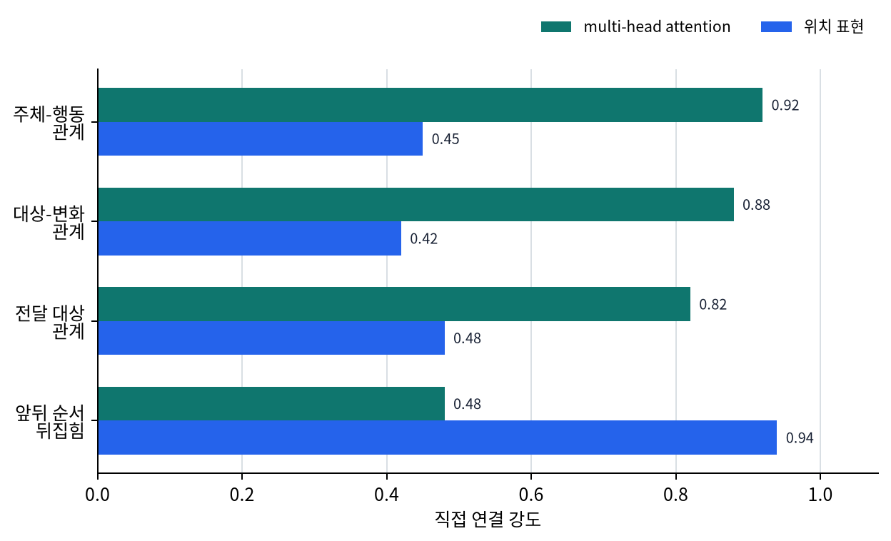

# P6-3.3 보충학습: 위치 표현과 multi-head attention은 문맥 읽기에 무엇을 더하는가

> Section ID: `P6-3.3`
> Version: `v2026.07.19`

P6-3.1에서는 Transformer 블록의 큰 구조를 보았고, P6-3.2에서는 attention이 context window 안에서만 작동한다는 점을 보았습니다. 그런데 여기서 자주 다시 막히는 이름이 두 개 있습니다.

Transformer는 토큰 사이 관계와 순서를 어떻게 함께 읽는가?

이 질문을 풀기 위해 먼저 붙잡아야 하는 이름이 `multi-head attention`과 `위치 표현(position encoding)`입니다.

여기서는 이 둘을 `문맥을 읽는 방식 보강`이라는 한 묶음으로 설명합니다. 반복 생성 속도는 다음 P6-3.4에서, 긴 문맥 계산 부담과 long-context 설계는 P6-3.5에서 따로 이어집니다.

## 문맥 읽기 보강이 다루는 질문

- multi-head attention은 왜 head를 여러 개 두는가?
- 위치 표현은 왜 필요한가?
- 두 이름은 왜 같은 층위처럼 보이지만 실제로는 서로 다른 역할을 하는가?

여기서 먼저 닫을 문제는 `모델이 문맥을 읽을 때 무엇을 보강하는가`입니다.

| 지금 다루는 것 | 바로 다음 보충학습이나 뒤 장으로 넘기는 것 |
| --- | --- |
| 여러 관계를 한 시선으로만 보지 않게 하는 multi-head attention | 긴 대화에서 왜 속도가 느려지는가 |
| 순서를 따로 알려 주는 위치 표현 | sparse attention, long-context, 서빙 최적화 |
| `관계 읽기`와 `순서 읽기`를 구분하는 최소 기준 | 실제 모델별 구현 차이와 장문맥 최적화 비교 |

이 구분이 잡혀야 다음 P6-3.4의 KV cache와 P6-3.5의 sparse attention, long-context를 `문맥 읽기 자체`가 아니라 `반복 생성 속도`, `계산 부담`, `긴 입력 유지` 문제로 따로 읽을 수 있습니다.

## 왜 이 둘을 먼저 같이 보나

처음 읽으면 `multi-head attention`과 `위치 표현`이 모두 Transformer의 내부 부품 이름처럼 보입니다. 이때는 둘을 다음처럼 구분하는 편이 가장 안전합니다.

- multi-head attention은 `무슨 관계를 여러 시선으로 볼 것인가`에 가깝습니다.
- 위치 표현은 `그 관계가 어느 순서에서 일어났는가`를 알려 주는 쪽에 가깝습니다.

즉, 하나는 `관계 읽기 방식`, 다른 하나는 `순서 정보 공급 방식`입니다.

이 기준이 없으면 `여러 head가 있으니 순서도 자동으로 알겠지` 같은 오해가 생기기 쉽습니다. 하지만 순서를 알려 주는 문제와 관계를 여러 각도에서 읽는 문제는 다릅니다.

## 왜 head를 여러 개 두나

attention 하나만 있다고 생각하면, 모델은 모든 관계를 한 가지 비교 규칙으로만 보게 됩니다. 하지만 실제 문장에서는 한 시선만으로는 부족한 관계가 자주 동시에 나타납니다.

예를 들어:

`그는 보고서를 읽고, 수정한 뒤, 팀장에게 다시 보냈다.`

이 문장을 읽을 때는 적어도 다음 관계가 함께 중요해집니다.

- `그`가 한 행동은 무엇인가
- `보고서`에 어떤 변화가 일어났는가
- `팀장에게`라는 전달 대상은 어디와 연결되는가
- `읽고 -> 수정한 뒤 -> 보냈다`의 순서는 어떻게 이어지는가

multi-head attention은 매우 단순화하면 이런 관계를 `한 바구니에 섞지 않고 여러 시선으로 나누어 본다`고 이해할 수 있습니다.

| 문장 안의 관계 | 한 기준으로만 보면 생기기 쉬운 혼선 | 여러 시선이 필요하다고 느끼게 하는 점 |
| --- | --- | --- |
| `그`와 `읽고/보냈다`의 행동 주체 관계 | 행동 순서와 대상이 섞일 수 있음 | 누가 무엇을 했는지 따로 따라가야 함 |
| `보고서를 읽고, 수정한 뒤`의 대상/수정 관계 | `수정한`이 사람 행동인지 보고서 상태인지 흐려짐 | 대상 변화와 행동 순서를 분리해야 함 |
| `팀장에게 다시 보냈다`의 전달 관계 | 앞 행동과 수신 대상이 한 덩어리로 섞임 | 전달 대상과 이전 행위를 동시에 유지해야 함 |

여기서 독자가 붙잡아야 할 핵심은 `head 하나가 문장 전체의 모든 관계를 완벽히 읽는다`가 아니라, `서로 다른 관계 축을 여러 시선으로 나누어 볼 필요가 있다`는 점입니다.

## 위치 표현은 왜 필요한가

토큰을 벡터로만 두면, 모델은 `이 토큰이 앞에 있었는지 뒤에 있었는지`를 저절로 알지 못합니다. 그래서 순서 정보를 따로 공급하는 장치가 필요합니다.

이 점은 아주 짧은 예에서도 드러납니다.

- `고양이가 개를 쫓는다`
- `개가 고양이를 쫓는다`

등장하는 단어는 거의 비슷하지만, 순서가 바뀌면 뜻도 달라집니다. 그런데 순서 정보를 따로 주지 않으면 모델은 `어떤 토큰이 먼저 왔는가`를 안정적으로 구분하기 어렵습니다.

그래서 위치 표현(position encoding 또는 positional information)이 붙습니다.

이 단계에서 먼저 남기면 좋은 기준은 다음입니다.

- attention은 관련도를 계산하지만
- 위치 표현은 그 관련도가 어느 순서 위에서 일어나는지 알려 줍니다

RoPE, ALiBi 같은 이름은 이 위치 정보를 다루는 서로 다른 방식입니다. 지금은 이름을 다 외우기보다, `Transformer가 순서를 저절로 아는 것은 아니다`라는 사실을 먼저 잡으면 충분합니다.

## 둘을 함께 보면 무엇이 달라지나

multi-head attention과 위치 표현을 같이 놓고 보면, 모델이 문맥을 읽는 데 필요한 보강이 두 종류라는 점이 더 분명해집니다.

| 지금 붙잡을 이름 | 먼저 떠올릴 질문 | 역할 |
| --- | --- | --- |
| multi-head attention | `무슨 관계를 여러 각도에서 읽어야 하나?` | 관계를 한 시선으로만 보지 않게 함 |
| 위치 표현 | `이 토큰이 앞인지 뒤인지 어떻게 아나?` | 순서 정보를 따로 공급함 |

즉, multi-head attention은 `무엇과 무엇이 관련 있는가`를 더 풍부하게 보게 하고, 위치 표현은 `그 관계가 어떤 순서에서 일어나는가`를 놓치지 않게 합니다.

아래 도식은 이 두 보강이 같은 Transformer 흐름 안에서 어디에 붙는지 압축한 것입니다. 위치 정보는 토큰의 순서 단서를 공급하고, multi-head attention은 여러 관계 축을 나누어 읽게 하며, 둘은 함께 문맥 표현을 더 안정적으로 만듭니다.

```mermaid
--8<-- "assets/part-06/chapter-03/p6-c03-s03-diagram-01-ko.mmd"
```

이 차이는 `둘 다 중요하다`는 말만으로는 잘 남지 않을 수 있습니다. `하나가 빠지면 어떤 종류의 오해가 남는가`까지 같이 보는 편이 더 직접적입니다.

| 빠진 쪽을 먼저 떠올려 보면 | 문장을 읽을 때 남는 빈칸 | 실제로 생기기 쉬운 오해 |
| --- | --- | --- |
| multi-head attention 감각이 약하다 | 누가 누구와 연결되는지 여러 관계 축을 나눠 보기 어려움 | 주체, 대상, 전달 관계가 한 덩어리로 섞여 `누가 무엇을 했는지`가 흐려질 수 있습니다. |
| 위치 표현 감각이 약하다 | 같은 단어가 어떤 앞뒤 순서로 놓였는지 안정적으로 구분하기 어려움 | 단어 집합은 비슷한데 사건 순서나 역할이 달라지는 문장을 같은 뜻처럼 읽기 쉽습니다. |
| 둘을 같은 문제처럼 섞어 본다 | 관계 분리 문제와 순서 정보 문제를 따로 고치기 어려움 | `head가 여러 개면 순서도 저절로 알겠지` 같은 오해가 남아, 무엇을 왜 보강하는지 설명이 다시 압축됩니다. |

## 사례 및 예시

### 사례 1. 여러 관계가 한 문장에 겹치는 경우

긴 문장을 읽을 때 사람은 주어-행동 관계, 대상 변화, 전달 대상, 시간 순서를 한꺼번에 봅니다. 하지만 이를 한 종류의 관련도만으로 읽으려 하면, 무엇이 누구에게 연결되는지가 쉽게 섞입니다.

예를 들어 `그는 보고서를 읽고, 수정한 뒤, 팀장에게 다시 보냈다`에서는 `그`가 한 행동, `보고서`의 상태 변화, `팀장에게`라는 전달 대상이 동시에 중요합니다. 이 관계들을 한 시선으로만 보면 주체, 대상, 전달 관계가 한 덩어리로 압축됩니다.

이 사례에서 확인할 결과는 한 문장 안에서도 서로 다른 관계 축을 나눠 읽어야 할 필요가 실제로 보이는가입니다. 이 필요가 보이면 multi-head attention을 `부품 이름`이 아니라 `서로 다른 관계 축을 여러 시선으로 나누어 읽게 하는 보강`으로 이해할 수 있습니다.

### 사례 2. 단어는 비슷한데 순서가 달라지는 경우

`고양이가 개를 쫓는다`와 `개가 고양이를 쫓는다`는 등장 단어가 비슷하지만 뜻은 다릅니다. 사람은 단어 자체보다 순서를 함께 읽기 때문에 둘을 구분합니다.

같은 토큰들이 있어도 `어떤 토큰이 앞에 있었는가`를 따로 알지 못하면, 주체와 대상이 뒤집힌 문장을 안정적으로 구분하기 어렵습니다. 이 사례에서 확인할 결과는 같은 단어 집합이라도 순서 정보가 빠지면 의미가 흔들린다는 점입니다.

두 사례를 함께 놓으면 흔한 오해도 정리됩니다. `head가 여러 개면 순서도 자동으로 잘 읽겠지`라고 느끼기 쉽지만, 여러 시선과 순서 정보는 같은 문제가 아닙니다. 문장 안의 관계를 여러 각도에서 봐도, 그 관계가 어느 순서에서 발생했는지를 따로 알지 못하면 해석은 여전히 흔들릴 수 있습니다.

반대로 순서 정보가 있어도 모든 관계를 한 기준으로만 보면, 주체 관계와 전달 대상 관계가 섞일 수 있습니다. 그래서 이 절에서는 `multi-head attention은 관계 축을 나누는 쪽`, `위치 표현은 순서 정보를 공급하는 쪽`으로 분리해 읽어야 합니다. 여기서 확인할 결과는 `관계 읽기`와 `순서 읽기`를 별도의 보강 문제로 구분할 수 있는가입니다.

## 막힌 장면에서 다시 보는 기준

처음에는 두 이름이 모두 Transformer 내부 부품처럼 보여서 한 덩어리로 외우기 쉽습니다. 이때는 정의를 더 길게 외우기보다, 지금 막힌 질문이 `관계 읽기` 쪽인지 `순서 읽기` 쪽인지 먼저 가르는 편이 안전합니다.

| 지금 막힌 장면 | 먼저 던질 질문 | 더 직접 연결되는 것 |
| --- | --- | --- |
| 한 문장 안에서 `누가`, `무엇을`, `누구에게`가 여러 겹으로 얽혀 보인다 | `이 관계들을 한 시선으로만 보면 무엇이 섞이는가?` | multi-head attention |
| 같은 단어가 거의 같은데 앞뒤가 바뀌며 뜻이 달라진다 | `이 차이는 결국 순서가 바뀐 것인가?` | 위치 표현 |
| 긴 문장에서 주체 관계도 놓치지 말아야 하고 사건 순서도 틀리면 안 된다 | `지금 필요한 것은 관계 분리인가, 순서 정보인가, 아니면 둘 다인가?` | 둘 다 |

이 표의 목적은 두 용어를 더 빨리 외우게 하는 데 있지 않습니다. 실제 문장을 읽을 때 `지금 모델이 여러 관계를 갈라 읽지 못하는 문제인가`, `아니면 순서를 따로 모르기 쉬운 문제인가`를 먼저 구분하게 만드는 데 있습니다.



## 연습 및 예제

아래 두 문장을 보고, 먼저 표의 빈칸을 직접 채워 보십시오.

- `민수가 보고서를 고친 뒤 지연에게 보냈다`
- `지연이 보고서를 고친 뒤 민수에게 보냈다`

| 직접 표시할 것 | 1번 문장 | 2번 문장 |
| --- | --- | --- |
| 행동 주체 |  |  |
| 대상 |  |  |
| 전달 대상 |  |  |
| 공통 행동 흐름 |  |  |
| 뜻이 달라진 결정적 위치 |  |  |

확인해 보면 1번 문장의 행동 주체는 `민수`, 전달 대상은 `지연`입니다. 2번 문장은 반대로 행동 주체가 `지연`, 전달 대상이 `민수`입니다. 두 문장 모두 대상은 `보고서`이고, 공통 행동 흐름은 `고친 뒤 -> 보냈다`입니다.

여기서 multi-head attention 감각은 `행동 주체`, `대상`, `전달 대상`, `행동 흐름`처럼 여러 관계 축을 나누어 보는 데 필요합니다. 위치 표현 감각은 `민수`와 `지연`이 문장 안에서 어디에 놓였는지에 따라 주체와 수신자가 바뀐다는 점을 잡는 데 필요합니다. 이 연습의 목적은 정답 암기가 아니라, 실제 문장을 볼 때 `무엇이 관계 축 문제인가`와 `무엇이 순서 정보 문제인가`를 손으로 분리해 보는 것입니다.

## 체크리스트

- multi-head attention은 관계를 여러 시선으로 나누어 읽게 하는 장치입니다.
- 위치 표현은 순서 정보를 따로 공급하는 장치입니다.
- 관계를 여러 각도에서 보는 일과 순서를 아는 일은 같은 문제가 아닙니다.
- Transformer가 순서를 저절로 안다고 생각하면 안 됩니다.
- 다음 P6-3.4와 P6-3.5에서는 이 문맥 읽기 구조 위에서 `반복 생성 속도`, `계산 부담`, `긴 입력 유지` 문제가 어떻게 따로 등장하는지 읽습니다.

## 출처와 참고 자료

- Ashish Vaswani et al., `Attention Is All You Need`, NeurIPS, 2017, 확인 날짜: 2026-06-29.
