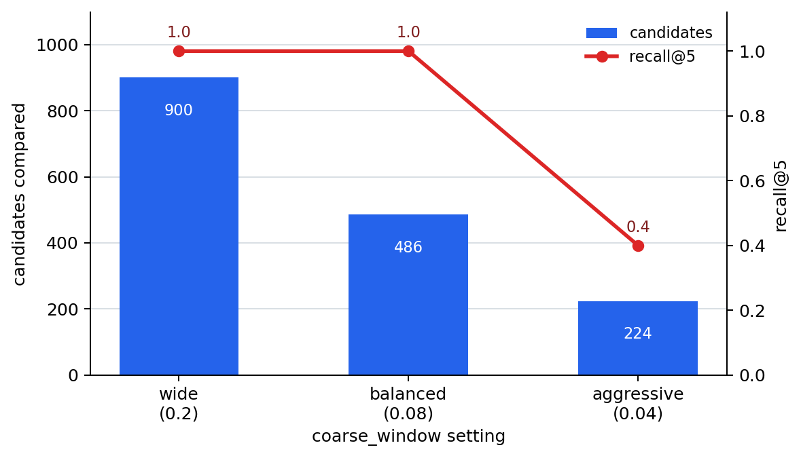

# P6-3.4 Supplement: Speed and Candidate-Missing Tradeoff in ANN Search

> Section ID: `P6-3.4`
> Version: `v2026.07.24`

In P6-3.2, we held onto the comparison standard of `finding nearby candidates`, and in P6-3.3, we saw how to learn a representation space so that comparison works. Now one question remains.

`How do we quickly find nearby candidates among so many vectors at real service speed?`

Just separating `the problem of making good vectors` from `the problem of finding those vectors quickly` already organizes half of the issue.

## Cost and Missing Candidates in Fast Candidate Search

- How are nearest neighbor and ANN(approximate nearest neighbor) different?
- Why does full scan become hard to sustain at service speed?
- What does ANN give up a little, and what does it gain?
- By what signals can quality problems and speed problems be separated first?

Here, first hold onto `the problem of narrowing nearby candidates fast enough`. Actual vector data storage structures, index selection, and search-quality adjustment will be handled more broadly later in the search-system sections.

| Current focus | Where to read it broadly again |
| --- | --- |
| Fast candidate search | P6-3.4, P6-12.1, P6-12.2 |
| Storage and index structure | P6-12.1, P6-12.2 |

So the central question is `why nearby candidates must be narrowed faster, even approximately`.

## Separating Good Representation Space from Fast Search

- You can explain the difference between nearest neighbor and ANN.
- You can say why full comparison becomes slower as candidate count grows.
- You can explain ANN as `a method that gains speed while accepting the possibility of missing some candidates`.
- You can distinguish representation-quality problems from search-speed problems by signal.

## Why Is ANN Needed Separately?

If there are only a few dozen documents, comparing every vector may be fine. If you take only this experience as the standard, it is easy to feel that `to be most accurate, it is right to compare everything to the end`.

But when documents grow to hundreds of thousands or millions, the question stays the same while comparison cost grows sharply. Then `finding good enough top candidates quickly at practical speed` rises ahead of `exact comparison` as the operating question.

## How Are Nearest Neighbor and ANN Different?

| Method | Shortest intuition | What improves first | What to accept together |
| --- | --- | --- | --- |
| Nearest neighbor full comparison | Looks at all candidates and finds the closest one | Low risk of missing candidates | Can become slow |
| ANN search | Narrows sufficiently nearby candidates faster | Response speed and comparison cost | Some candidates can be missed |

What matters here is not reading `ANN = rough search`. A safer explanation is this.

`ANN is a tradeoff for finding usable top candidates faster in practice, instead of perfect full comparison.`

## Where Do Speed Problems First Appear?

Speed problems usually appear first in the scenes below.

| Phenomenon first seen | What to suspect first in practice |
| --- | --- |
| Candidate quality looks plausible, but the response is too late | Are there too many candidates to compare? |
| Latency increases sharply as document count grows | Is full comparison the bottleneck? |
| After applying ANN aggressively, speed improves but documents disappear | Did speed gain and candidate missing both increase? |

Even here, avoid lumping everything together as `search is strange`; first read whether `quality is shaking` or `speed is collapsing first`.

## Cases and Examples

### Case 1. When Full Comparison Holds Up for a Small FAQ

If there are only 20 FAQ items, comparing all candidates may not be a big problem. If you use only a small FAQ experience as the standard, it is easy to think `couldn't we always do it this way`.

But the result to check in this scene is that `it holds when small` and `it holds after growth` are not the same. When there are 20 candidates, full comparison is safe and simple. When candidates grow to 200,000, the same method quickly increases response time and cost.

This case supports this section because it shows that ANN is not a magical technique needed from the beginning. It appears as a tradeoff when candidate count grows and full comparison becomes hard to sustain at service speed.

The judgment to close in this case is not generalizing full comparison that worked on small data to operating scale. As candidate count grows, candidate-count growth and latency growth must be read together.

### Case 2. When It Suddenly Becomes Slow as Document Count Grows

When policy documents and FAQs grow to hundreds of thousands, a comparison method that used to be fine can suddenly become a bottleneck. The misunderstanding to correct first here is thinking `it must be slow because embedding quality got worse`.

In reality, candidates may be correct, but comparison cost can be so large that results become late. In this scene, search speed is the problem before representation quality.

This case supports this section because it shows that `did we make good vectors` and `can we quickly narrow nearby candidates among all those vectors` are different questions. Even if the representation space is fine, if full comparison is the bottleneck, fast candidate-reduction structures such as ANN should be reviewed.

The judgment to close in this case is separating candidate quality from search speed. If candidates are correct but slow, check full-comparison bottlenecks and index tuning before retraining representation quality.

### Case 3. When Speed Improves but Important Documents Disappear

If ANN settings are adjusted more aggressively and speed improves, a document containing the latest exception clause may keep disappearing from top candidates. The misunderstanding to correct here is the feeling that `because speed improved, this is unconditionally an improvement`.

So the sentence to close first in this case is this.

`ANN is a structure that must manage the possibility of missing candidates together while gaining speed.`

This case supports this section because it returns ANN from only `finding quickly` to the central question of managing speed gain and recall loss together in approximate search.

The judgment to close in this case is checking whether fast results maintain sufficient candidate quality. ANN settings must measure not only latency, but also candidate missing and recall loss.

If we group the three cases again, they become the following.

| Situation | What should improve first | Misunderstanding not to mix in |
| --- | --- | --- |
| Candidate count is small | Simple comparison structure | Generalizing a small example as the operating standard |
| It gets slower as document count grows | Search speed | First concluding it is a quality problem |
| Speed improved but documents disappear | Speed-quality balance | Treating speed improvement as success |

## Separating Search-Speed Problems

If you look at practical phenomena again from the ANN view, even before you know index names in detail, you can first separate `whether what shakes now is a speed problem` as below.

| Phenomenon you see now | Misunderstanding easy to recall first | Question to ask instead first |
| --- | --- | --- |
| Top candidates look plausible, but the response is too late | It is easy to pass it first to a quality problem, thinking embeddings must be retrained | Is comparison cost for narrowing nearby candidates the bottleneck first? |
| Latency increased sharply after document count grew | It is easy to feel that adding a little hardware will finish it | Has the full-comparison structure itself reached its limit? |
| Documents disappear after ANN is applied more aggressively | It is easy to feel that faster speed means it improved | How much did candidate missing increase together with speed gain? |

The purpose of this table is not to make you memorize more ANN algorithm names. It is to make you briefly separate in a practical scene `whether search-speed signals appear before representation quality`.

## Practice and Examples

This section should not close with intuition alone. You need to see whether the number of compared candidates and candidate missing actually change when the `coarse_window` value changes. So first use a short exercise to establish `what to expect`, then use a Python example to check output differences between `full comparison` and `fast candidate reduction`, then return in the exercises to translate those results into operational judgment.

### Exercise 1. Predict Comparison Standards Before Execution

Before running the example, first answer the questions below.

- Which does full comparison reduce more: risk of missing candidates or comparison cost?
- Which does fast candidate reduction try to reduce first: comparison cost or risk of missing candidates?
- What problem can occur if `coarse_window` is made too narrow?

Explanation: Full comparison sees all candidates, so it reduces the risk of missing candidates, but comparison cost grows as candidate count grows. Fast candidate reduction first tries to reduce comparison cost, but if the condition is too narrow, it can miss some nearby candidates. Therefore, when running the example, do not look only at `what is faster`; also look at `what was missed`. This is the central axis of P6-3.4: managing speed gain and candidate missing.

### Example. Experimenting with Candidate Reduction Using `coarse_window`

The goal of this example is to place `full comparison` and `fast candidate reduction` side by side and directly see why ANN is needed in practice. It does not implement an actual ANN index, but if we find baseline top candidates with `scikit-learn`'s `NearestNeighbors`, leave only some candidates with a first-stage condition, and apply the same search API again, the core sense becomes clearer.

This example is not an explanatory example for learning Python usage. It is an experimental example for changing values and seeing differences in results. The value to change directly here is `coarse_window`. If this value is wide, more candidates are compared and the risk of missing candidates decreases. If it is narrow, the number of compared candidates decreases, but some nearby candidates may be missed.

First, read the execution result by looking at the following three things.

| What to check | Value seen in the example | Why check it |
| --- | --- | --- |
| Baseline result of full comparison | `full_top5` | To establish the baseline top candidates when all candidates are examined |
| Comparison cost of fast candidate reduction | `candidates` | To see how many candidates were actually compared |
| Loss from aggressive reduction | `recall@5`, `missed` | To confirm how many nearby candidates were missed in exchange for speed |

The code below uses one query vector, a few manually inserted nearby FAQ candidates, and 3,000 randomly made background FAQ candidates. In the execution result, compare the full-comparison baseline made with `NearestNeighbors` and the fast candidate-reduction results when `coarse_window` changes. Check the number of candidates each setting actually compared, `recall@5`, and missed top candidates. The core is to directly read that seeing all candidates is safe but can become slow as candidate count grows, and fast candidate reduction can miss important candidates if settings are too aggressive.

```python
# Example comparing full comparison and coarse_window-based candidate reduction to see comparison cost and recall loss together in ANN-style search.
import random
import numpy as np
from sklearn.neighbors import NearestNeighbors

random.seed(24)

query = [0.90, 0.80]
docs = {
    "refund_policy": [0.88, 0.82],
    "cancel_payment": [0.845, 0.79],
    "refund_exception": [0.83, 0.86],
    "billing_deadline": [0.94, 0.76],
    "payment_receipt": [0.96, 0.83],
    "change_address": [0.30, 0.20],
    "shipping_delay": [0.40, 0.35],
}

categories = ["login", "shipping", "coupon", "profile", "notice"]
for i in range(3000):
    docs[f"{random.choice(categories)}_{i:04d}"] = [
        random.random(),
        random.random() * 0.45,
    ]

def rank_with_neighbors(names, vectors, k=5):
    # Use the same search API for both the full baseline and reduced candidates, aligning the comparison target.
    model = NearestNeighbors(n_neighbors=min(k, len(names)), metric="euclidean")
    model.fit(np.array(vectors))
    distances, indices = model.kneighbors(np.array([query]))
    return [(names[index], float(distance)) for index, distance in zip(indices[0], distances[0])]

full_scan = rank_with_neighbors(list(docs), list(docs.values()))
full_top5 = [name for name, _ in full_scan]

def fast_scan_with_window(coarse_window):
    coarse_candidates = [
        (name, vec) for name, vec in docs.items() if abs(vec[0] - query[0]) <= coarse_window
    ]
    ranked = rank_with_neighbors(
        [name for name, _ in coarse_candidates],
        [vec for _, vec in coarse_candidates],
    )
    return ranked, len(coarse_candidates)

settings = {
    "wide": 0.20,
    "balanced": 0.08,
    "aggressive": 0.04,
}

fast_results = {
    label: fast_scan_with_window(coarse_window=window)
    for label, window in settings.items()
}

print("doc_count =", len(docs))
print("full_top5 =", [(name, round(distance, 4)) for name, distance in full_scan[:5]])
for label, (ranked, candidate_count) in fast_results.items():
    top5 = [name for name, _ in ranked[:5]]
    recall = len(set(full_top5) & set(top5)) / len(full_top5)
    missed = [name for name in full_top5 if name not in top5]
    print(
        label,
        "window =", settings[label],
        "candidates =", candidate_count,
        "recall@5 =", recall,
    )
    print("top5 =", top5)
    print("missed =", missed)
```

An example execution result can be read as follows. The output below was confirmed with the same values as the body code using Python in the local `.venv`.

```text
doc_count = 3007
full_top5 = [('refund_policy', 0.0283), ('cancel_payment', 0.0559), ('billing_deadline', 0.0566), ('payment_receipt', 0.0671), ('refund_exception', 0.0922)]
wide window = 0.2 candidates = 900 recall@5 = 1.0
top5 = ['refund_policy', 'cancel_payment', 'billing_deadline', 'payment_receipt', 'refund_exception']
missed = []
balanced window = 0.08 candidates = 486 recall@5 = 1.0
top5 = ['refund_policy', 'cancel_payment', 'billing_deadline', 'payment_receipt', 'refund_exception']
missed = []
aggressive window = 0.04 candidates = 224 recall@5 = 0.4
top5 = ['refund_policy', 'billing_deadline', 'login_1003', 'shipping_1019', 'notice_1369']
missed = ['cancel_payment', 'payment_receipt', 'refund_exception']
```

The core to read in this example is as follows.

- Full comparison sees all `3,007` candidates, so it is safe as a baseline, but it slows down as candidate count grows.
- `coarse_window=0.20` reduces compared candidates to `900` while keeping all top 5 from full comparison.
- `coarse_window=0.08` reduces compared candidates further to `486` and still keeps `recall@5 = 1.0` in this example.
- `coarse_window=0.04` reduces compared candidates further to `224`, but `recall@5` drops to `0.4`, and it misses `cancel_payment`, `payment_receipt`, and `refund_exception`.
- The practical sense of ANN is similar: `find sufficiently good nearby candidates quickly while managing candidate missing`, rather than performing `perfect full comparison`.

If we draw only the movement of the numbers, it can be read as follows. Up to `balanced`, the baseline top 5 are preserved even though candidate count is reduced. At `aggressive`, candidate count shrinks further, but `recall@5` collapses together.



### Exercise 2. Reading the Baseline and Loss from Output

After reading the example, first answer the questions below.

- How many candidates did full comparison compare?
- How many candidates did the `balanced` setting compare, and what was `recall@5`?
- What did the `aggressive` setting miss?
- What is the core sense of ANN in this example?

Explanation: Full comparison compared all 3,007 candidates because `doc_count = 3007`. The `balanced` setting compared only 486 candidates, and in this example kept all top 5 from full comparison with `recall@5 = 1.0`. In contrast, the `aggressive` setting reduced candidates further to 224, but missed `cancel_payment`, `payment_receipt`, and `refund_exception`. So the core sense of ANN in this example is a tradeoff: gaining practical speed without comparing every vector to the end, while also watching that settings can create candidate missing.

### Exercise 3. Separating Full Comparison from Fast Candidate Reduction

Observations:

| Situation | Candidate count | Top-candidate quality | Response time |
| --- | --- | --- | --- |
| A | 30 | Good | Fast |
| B | 300,000 | Good | Slow |
| C | 300,000 | Bad | Fast |

Answer by yourself first.

- Which of A, B, and C is the scene where fast candidate search such as ANN should be reviewed first?
- Is C a speed problem or a representation-quality problem?

Explanation: B is the scene where candidate quality is good but response time is slow, so fast candidate search should be reviewed first. In A, candidate count is small and response is also fast, so full comparison may be enough. In C, response is fast but top-candidate quality is bad, so representation quality or candidate-missing settings should be checked before ANN speed. This distinction is the center of P6-3.4: separating search-speed problems from quality problems.

### Exercise 4. Seeing Speed Gain and Candidate Missing Together

Observations:

| Setting | Average response time | Important document missing |
| --- | --- | --- |
| Full comparison | 900ms | Almost none |
| Mild ANN setting | 180ms | Rare |
| Aggressive ANN setting | 70ms | Frequent |

Answer by yourself first.

- Which setting is unconditionally best?
- What should operational judgment look at together?

Explanation: There is no unconditionally best setting. Full comparison is safe but slow, and aggressive ANN is fast but often misses important documents. Operational judgment must look at response time and candidate missing together. ANN is not only a device for increasing speed. It is an approximate search method that manages speed gain and recall loss together.

### Exercise 5. Interpreting Changes in `coarse_window`

Observations:

| Setting | `coarse_window` | Compared candidate count | Missing among full-comparison top 5 |
| --- | ---: | ---: | --- |
| Aggressive setting | `0.04` | 224 | `cancel_payment`, `payment_receipt`, `refund_exception` |
| Balanced setting | `0.08` | 486 | None |

Answer by yourself first.

- What improves when `coarse_window` grows from `0.04` to `0.08`?
- What increases instead?
- Is this change a representation-quality problem or a search-setting problem?

Explanation: When it grows to `0.08`, `cancel_payment`, `payment_receipt`, and `refund_exception`, which were top candidates in full comparison, are included again, so `recall@5` rises from `0.4` to `1.0`. Instead, the number of candidates to actually compare increases from 224 to 486. This change did not retrain sentence vectors themselves. It adjusted how wide a candidate set should remain, so it is a search-setting problem, not a representation-quality problem. The boundary of this exercise is that `the more speed you gain, the more you must also watch candidate missing`.

So the final judgment of this section is simple. If candidates are correct but late, look at search cost. If speed improved but important documents disappear, look at speed gain and candidate missing together.

## Checklist

- Can you explain the difference between nearest neighbor and ANN?
- Can you say why full comparison becomes slower as candidate count grows?
- Can you explain ANN as `a method that gains speed while accepting the possibility of missing some candidates`?
- Can you distinguish representation-quality problems from search-speed problems by signal?

## Sources and References

- Arya et al., [An Optimal Algorithm for Approximate Nearest Neighbor Searching Fixed Dimensions](https://dl.acm.org/doi/10.1145/276698.276876){: target="_blank" rel="noopener noreferrer" }, Journal of the ACM, 1998, accessed 2026-07-19. Used as classical approximate-search background evidence for distinguishing ANN from exact nearest-neighbor search.
- Yu A. Malkov, D. A. Yashunin, [Efficient and robust approximate nearest neighbor search using Hierarchical Navigable Small World graphs](https://arxiv.org/abs/1603.09320){: target="_blank" rel="noopener noreferrer" }, arXiv, 2016, accessed 2026-07-19. Used as background evidence that HNSW-based ANN search is used as a tradeoff between speed and candidate quality.
