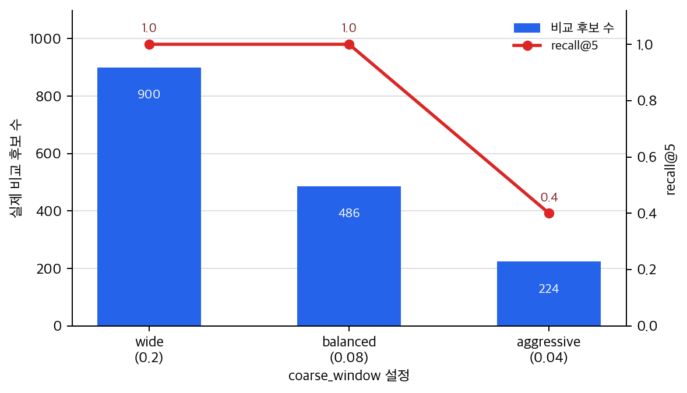

# P6-3.4 보충학습: ANN 검색의 속도와 후보 누락 절충

> Section ID: `P6-3.4`
> Version: `v2026.07.26`

P6-3.2에서는 `가까운 후보를 찾는다`는 비교 기준을 붙잡았고, P6-3.3에서는 그 비교가 성립하도록 표현 공간을 어떻게 배울지를 봤습니다. 이제 남는 질문은 하나입니다.

`그 많은 벡터 중 가까운 후보를 실제 서비스 속도로 어떻게 빨리 찾는가?`

먼저 `좋은 벡터를 만드는 문제`와 `그 벡터를 빨리 찾는 문제`를 섞지 않는 것만으로도 절반은 정리됩니다.

## 빠른 후보 탐색의 비용과 누락

- nearest neighbor와 ANN(approximate nearest neighbor)은 무엇이 다른가?
- 왜 전수 비교(full scan)만으로는 서비스 속도를 버티기 어려워지는가?
- ANN은 무엇을 조금 포기하고 무엇을 얻는가?
- 품질 문제와 속도 문제를 어떤 신호로 먼저 가를 수 있는가?

여기서는 `가까운 후보를 충분히 빠르게 좁히는 문제`까지를 먼저 잡습니다. 실제 벡터 데이터 저장 구조와 인덱스 선택, 검색 품질 조정은 이후 검색 시스템 절에서 더 넓게 다룹니다.

| 지금 초점 | 다시 넓게 읽는 위치 |
| --- | --- |
| 빠른 후보 탐색 | P6-3.4, P6-12.1, P6-12.2 |
| 저장소와 인덱스 구조 | P6-12.1, P6-12.2 |

따라서 중심 질문은 `가까운 후보를 왜 근사적으로라도 더 빨리 좁혀야 하는가`입니다.

## 좋은 표현 공간과 빠른 탐색의 구분

- nearest neighbor와 ANN의 차이를 설명할 수 있습니다.
- 전수 비교가 왜 후보 수가 커질수록 느려지는지 말할 수 있습니다.
- ANN을 `속도를 얻는 대신 일부 후보 누락 가능성을 함께 감수하는 방식`으로 설명할 수 있습니다.
- 표현 품질 문제와 탐색 속도 문제를 신호 기준으로 구분할 수 있습니다.

## 왜 ANN이 따로 필요한가

문서가 몇십 개라면 모든 벡터를 다 비교해도 괜찮을 수 있습니다. 이 경험만 기준으로 삼으면 `가장 정확하려면 끝까지 다 비교하는 것이 맞다`고 느끼기 쉽습니다.

하지만 문서가 수십만, 수백만 개로 커지면 질문은 그대로여도 비교 비용은 급격히 커집니다. 그러면 `정확한 비교`보다 `충분히 좋은 상위 후보를 실무 속도로 빨리 찾는가`가 더 앞선 운영 질문으로 올라옵니다.

## nearest neighbor와 ANN은 어떻게 다른가

| 방식 | 가장 짧은 직관 | 먼저 좋아지는 것 | 함께 감수할 것 |
| --- | --- | --- | --- |
| nearest neighbor 전수 비교 | 모든 후보를 다 보고 가장 가까운 것을 찾는다 | 후보 누락 위험이 작다 | 느려질 수 있다 |
| ANN 검색 | 충분히 가까운 후보를 더 빨리 좁힌다 | 응답 속도와 비교 비용 | 일부 후보를 놓칠 수 있다 |

여기서 중요한 것은 `ANN = 대충 찾기`로 읽지 않는 일입니다. 더 안전한 설명은 이것입니다.

`ANN은 완벽한 전수 비교 대신, 실무에서 쓸 만한 상위 후보를 더 빠르게 찾기 위한 절충이다.`

## 속도 문제는 어떤 장면에서 먼저 드러나나

속도 문제는 보통 아래 장면에서 먼저 보입니다.

| 먼저 보이는 현상 | 실제로 먼저 의심할 것 |
| --- | --- |
| 후보 품질은 그럴듯한데 응답이 너무 늦다 | 비교해야 할 후보 수가 너무 많은가 |
| 문서 수가 늘수록 지연이 급격히 늘어난다 | 전수 비교 구조가 병목인가 |
| ANN을 세게 걸었더니 속도는 빨라졌는데 문서가 빠진다 | 속도 이득과 후보 누락이 함께 늘었는가 |

이때도 `검색이 이상하다`는 한 문장으로 뭉개지 않도록, 먼저 `품질이 흔들리는가`와 `속도가 먼저 무너지는가`를 분리해 읽어야 합니다.

## 사례 및 예시

### 사례 1. FAQ가 적을 때는 전수 비교도 버틸 때

FAQ가 20개뿐이라면 모든 후보를 다 비교해도 큰 문제가 없을 수 있습니다. 작은 FAQ 경험만 기준으로 삼으면 `늘 이렇게 해도 되지 않을까`라고 생각하기 쉽습니다.

하지만 이 장면에서 확인해야 할 결과는 `작을 때 버틴다`와 `커졌을 때도 버틴다`가 같은 말이 아니라는 점입니다. 후보가 20개일 때는 전수 비교가 안전하고 단순하지만, 후보가 20만 개로 늘어나면 같은 방식은 응답 시간과 비용을 빠르게 키웁니다.

이 사례가 이 절을 지지하는 이유는 ANN이 처음부터 필요한 마법 같은 기법이 아니라, 후보 수가 커져 전수 비교가 서비스 속도를 버티기 어려워질 때 등장하는 절충임을 보여 주기 때문입니다.

이 사례에서 닫을 판단은 작은 데이터에서 통하던 전수 비교를 운영 규모로 일반화하지 않는 일입니다. 후보 수가 커지면 후보 수 증가와 지연 증가를 함께 봐야 합니다.

### 사례 2. 문서 수가 커지자 갑자기 느려질 때

정책 문서와 FAQ가 수십만 개로 늘어나면, 이전에는 괜찮던 비교 방식이 갑자기 병목이 될 수 있습니다. 이때 먼저 바로잡아야 할 오해는 `임베딩 품질이 나빠져서 느린가 보다`라는 생각입니다.

실제로는 후보가 맞게 올라와도 비교 비용이 너무 커서 늦어질 수 있습니다. 이 장면은 표현 품질보다 탐색 속도가 먼저 문제인 경우입니다.

이 사례가 이 절을 지지하는 이유는 `좋은 벡터를 만들었는가`와 `그 많은 벡터 중 가까운 후보를 빨리 좁히는가`가 다른 질문임을 보여 주기 때문입니다. 표현 공간이 괜찮아도 전수 비교가 병목이면 ANN 같은 빠른 후보 축소 구조를 검토해야 합니다.

이 사례에서 닫을 판단은 후보 품질과 탐색 속도를 분리하는 일입니다. 후보는 맞는데 느리면 표현 품질 재학습보다 전수 비교 병목과 인덱스 튜닝을 먼저 봅니다.

### 사례 3. 속도는 빨라졌는데 중요한 문서가 빠질 때

ANN 설정을 더 공격적으로 조정해 속도는 빨라졌는데, 정작 최신 예외 조항이 든 문서가 상위 후보에서 자꾸 빠질 수 있습니다. 이 경우 바로잡아야 할 오해는 `속도만 좋아졌으니 무조건 개선`이라는 감각입니다.

그래서 이 사례에서 먼저 닫아야 할 문장은 이것입니다.

`ANN은 속도를 얻는 대신 후보 누락 가능성을 함께 관리해야 하는 구조다.`

이 사례가 이 절을 지지하는 이유는 ANN을 `빠르게 찾는다`로만 읽지 않고, 근사 탐색에서 속도 이득과 recall 손실을 함께 관리해야 한다는 중심 질문으로 되돌려 주기 때문입니다.

이 사례에서 닫을 판단은 빠른 결과가 충분한 후보 품질을 유지하는지 확인하는 일입니다. ANN 설정은 지연 시간만이 아니라 후보 누락과 recall 손실을 같이 측정해야 합니다.

세 사례를 다시 묶으면 다음과 같습니다.

| 상황 | 먼저 좋아져야 하는 것 | 같이 보면 안 되는 오해 |
| --- | --- | --- |
| 후보 수가 적다 | 단순 비교 구조 | 작은 예제를 운영 기준으로 일반화함 |
| 문서 수가 커질수록 느려진다 | 탐색 속도 | 품질 문제로 먼저 단정함 |
| 속도는 빨라졌는데 문서가 빠진다 | 속도-품질 균형 | 속도 개선이 곧 성공이라고 여김 |

## 탐색 속도 문제 가르기

ANN 관점으로 실무 현상을 다시 보면, 아직 인덱스 이름을 자세히 몰라도 아래처럼 `지금 먼저 흔들리는 것이 속도 문제인가`를 먼저 가를 수 있습니다.

| 지금 보이는 현상 | 먼저 떠올리기 쉬운 오해 | 먼저 바꿔 물을 질문 |
| --- | --- | --- |
| 상위 후보는 그럴듯한데 응답이 너무 늦다 | 임베딩을 다시 학습해야 하나 보다 하고 품질 문제로 먼저 넘기기 쉽다 | 먼저 가까운 후보를 좁히는 비교 비용이 병목인가 |
| 문서 수가 늘자 지연이 급격히 늘었다 | 하드웨어만 조금 늘리면 끝날 문제라고 느끼기 쉽다 | 전수 비교 구조 자체가 한계에 닿은 것 아닌가 |
| ANN을 더 공격적으로 걸었더니 문서가 빠진다 | 속도만 빨라졌으니 좋아졌다고 느끼기 쉽다 | 속도 이득과 함께 후보 누락이 얼마나 늘었는가 |

이 표의 목적은 ANN 알고리즘 이름을 더 외우게 하는 데 있지 않습니다. 실무 장면에서 `지금은 표현 품질보다 탐색 속도 신호가 먼저 보이는가`를 짧게 가르게 만드는 데 있습니다.

## 연습 및 예제

이 절은 직관 구분만으로 닫기보다, `coarse_window` 값을 바꿨을 때 비교 후보 수와 후보 누락이 실제로 달라지는지를 봐야 합니다. 그래서 먼저 짧은 연습으로 `무엇을 예상해야 하는가`를 잡고, Python 예제로 `전수 비교`와 `빠른 후보 축소`의 출력 차이를 확인한 뒤, 다시 연습에서 이 결과를 운영 판단으로 옮겨 봅니다.

### 연습 1. 실행 전에 비교 기준 예상하기

예제를 실행하기 전에 먼저 아래 질문에 답해 봅니다.

- 전수 비교는 후보 누락 위험과 비교 비용 중 무엇을 더 줄이는 방식인가?
- 빠른 후보 축소는 비교 비용과 후보 누락 위험 중 무엇을 먼저 줄이려는 방식인가?
- `coarse_window`를 너무 좁히면 어떤 문제가 생길 수 있는가?

해설: 전수 비교는 모든 후보를 다 보므로 후보 누락 위험을 줄이지만, 후보 수가 커질수록 비교 비용이 그대로 늘어납니다. 빠른 후보 축소는 비교 비용을 먼저 줄이려는 방식이지만, 조건이 너무 좁으면 가까운 후보 일부를 놓칠 수 있습니다. 따라서 예제를 실행할 때는 `무엇이 더 빠른가`만 보지 말고, `무엇을 놓쳤는가`까지 함께 봐야 합니다. 이것이 P6-3.4의 중심축인 속도 이득과 후보 누락 관리입니다.

### 예제. `coarse_window`로 후보 축소 실험하기

이 예제의 목표는 `전수 비교`와 `빠른 후보 축소`를 나란히 놓고, 왜 ANN이 실무에서 필요한지 직접 보는 것입니다. 실제 ANN 인덱스를 구현하지는 않지만, `scikit-learn`의 `NearestNeighbors`로 기준 상위 후보를 찾고, 1차 조건으로 일부 후보만 남긴 뒤 같은 검색 API를 다시 적용하면 핵심 감각은 더 분명해집니다.

이 예제는 Python 사용법을 배우기 위한 설명형 예제가 아니라, 값을 바꾸며 결과 차이를 보는 실험형 예제입니다. 여기서 직접 바꿔 볼 값은 `coarse_window`입니다. 이 값이 넓으면 더 많은 후보를 비교하므로 후보 누락 위험이 줄고, 좁으면 비교 후보 수가 줄어드는 대신 가까운 후보 일부를 놓칠 수 있습니다.

먼저 아래 세 가지를 보고 실행 결과를 읽습니다.

| 확인할 것 | 예제에서 보는 값 | 왜 보는가 |
| --- | --- | --- |
| 전수 비교의 기준 결과 | `full_top5` | 모든 후보를 다 봤을 때의 기준 상위 후보를 세우기 위해서입니다. |
| 빠른 후보 축소의 비교 비용 | `candidates` | 후보를 몇 개만 실제로 비교했는지 보기 위해서입니다. |
| 공격적 축소의 손실 | `recall@5`, `missed` | 속도를 얻는 대신 가까운 후보를 얼마나 놓쳤는지 확인하기 위해서입니다. |

아래 코드는 하나의 질의 벡터, 수작업으로 넣은 근접 FAQ 후보 몇 개, 무작위로 만든 배경 FAQ 후보 3,000개를 사용합니다. 실행 결과에서는 `NearestNeighbors`로 만든 전수 비교 기준선과 `coarse_window`를 바꿨을 때의 빠른 후보 축소 결과를 나란히 보고, 각 설정이 실제로 비교한 후보 수, `recall@5`, 놓친 상위 후보를 확인합니다. 모든 후보를 다 보는 방식은 안전하지만 후보 수가 커질수록 느려질 수 있고, 빠른 후보 축소는 설정을 너무 공격적으로 잡으면 중요한 후보를 놓칠 수 있다는 점을 직접 읽는 것이 핵심입니다.

```python
# 전수 비교와 coarse_window 기반 후보 축소를 비교해 ANN식 검색에서 비교 비용과 recall 손실을 함께 보는 예제입니다.
import random
import numpy as np
from sklearn.neighbors import NearestNeighbors

random.seed(24)

query = [0.90, 0.80]
docs = {
    "refund_policy": [0.88, 0.82],
    "cancel_payment": [0.845, 0.79],
    "refund_exception": [0.83, 0.86],
    "billing_deadline": [0.94, 0.76],
    "payment_receipt": [0.96, 0.83],
    "change_address": [0.30, 0.20],
    "shipping_delay": [0.40, 0.35],
}

categories = ["login", "shipping", "coupon", "profile", "notice"]
for i in range(3000):
    docs[f"{random.choice(categories)}_{i:04d}"] = [
        random.random(),
        random.random() * 0.45,
    ]

def rank_with_neighbors(names, vectors, k=5):
    # 같은 검색 API를 전수 기준선과 축소 후보에 모두 적용해 비교 대상을 맞춥니다.
    model = NearestNeighbors(n_neighbors=min(k, len(names)), metric="euclidean")
    model.fit(np.array(vectors))
    distances, indices = model.kneighbors(np.array([query]))
    return [(names[index], float(distance)) for index, distance in zip(indices[0], distances[0])]

full_scan = rank_with_neighbors(list(docs), list(docs.values()))
full_top5 = [name for name, _ in full_scan]

def fast_scan_with_window(coarse_window):
    coarse_candidates = [
        (name, vec) for name, vec in docs.items() if abs(vec[0] - query[0]) <= coarse_window
    ]
    ranked = rank_with_neighbors(
        [name for name, _ in coarse_candidates],
        [vec for _, vec in coarse_candidates],
    )
    return ranked, len(coarse_candidates)

settings = {
    "wide": 0.20,
    "balanced": 0.08,
    "aggressive": 0.04,
}

fast_results = {
    label: fast_scan_with_window(coarse_window=window)
    for label, window in settings.items()
}

print("doc_count =", len(docs))
print("full_top5 =", [(name, round(distance, 4)) for name, distance in full_scan[:5]])
for label, (ranked, candidate_count) in fast_results.items():
    top5 = [name for name, _ in ranked[:5]]
    recall = len(set(full_top5) & set(top5)) / len(full_top5)
    missed = [name for name in full_top5 if name not in top5]
    print(
        label,
        "window =", settings[label],
        "candidates =", candidate_count,
        "recall@5 =", recall,
    )
    print("top5 =", top5)
    print("missed =", missed)
```

실행 결과 예시는 다음처럼 읽을 수 있습니다. 아래 출력은 로컬 `.venv`의 Python 실행으로 본문 코드와 같은 값을 확인했습니다.

```text
doc_count = 3007
full_top5 = [('refund_policy', 0.0283), ('cancel_payment', 0.0559), ('billing_deadline', 0.0566), ('payment_receipt', 0.0671), ('refund_exception', 0.0922)]
wide window = 0.2 candidates = 900 recall@5 = 1.0
top5 = ['refund_policy', 'cancel_payment', 'billing_deadline', 'payment_receipt', 'refund_exception']
missed = []
balanced window = 0.08 candidates = 486 recall@5 = 1.0
top5 = ['refund_policy', 'cancel_payment', 'billing_deadline', 'payment_receipt', 'refund_exception']
missed = []
aggressive window = 0.04 candidates = 224 recall@5 = 0.4
top5 = ['refund_policy', 'billing_deadline', 'login_1003', 'shipping_1019', 'notice_1369']
missed = ['cancel_payment', 'payment_receipt', 'refund_exception']
```

이 예제에서 읽어야 할 핵심은 다음입니다.

- 전수 비교는 `3,007`개 후보를 모두 보므로 기준선으로는 안전하지만 후보 수가 커질수록 느려집니다.
- `coarse_window=0.20`은 비교 후보를 `900`개로 줄이고도 전수 비교의 상위 5개를 모두 유지합니다.
- `coarse_window=0.08`은 비교 후보를 `486`개로 더 줄이면서도 이 예시에서는 `recall@5 = 1.0`을 유지합니다.
- `coarse_window=0.04`는 비교 후보를 `224`개로 더 줄이지만 `recall@5 = 0.4`로 떨어지고, `cancel_payment`, `payment_receipt`, `refund_exception`을 놓칩니다.
- ANN의 실무 감각도 이와 비슷하게 `완벽한 전수 비교`보다 `충분히 좋은 근접 후보를 빨리 찾되, 후보 누락을 함께 관리하는 구조`에 가깝습니다.

수치의 움직임만 따로 그리면 아래처럼 읽을 수 있습니다. `balanced`까지는 후보 수를 줄여도 기준 상위 5개를 유지하지만, `aggressive`에서는 후보 수가 더 줄어드는 대신 `recall@5`가 함께 무너집니다.



### 연습 2. 출력에서 기준선과 손실 읽기

예제를 읽은 뒤에는 아래 질문에 먼저 답해 봅니다.

- 전수 비교는 몇 개 후보를 비교했는가?
- `balanced` 설정은 몇 개 후보만 비교했고, `recall@5`는 얼마인가?
- `aggressive` 설정은 무엇을 놓쳤는가?
- 이 예제에서 ANN의 핵심 감각은 무엇인가?

해설: 전수 비교는 `doc_count = 3007`이므로 모든 후보 3,007개를 비교했습니다. `balanced` 설정은 후보를 486개만 비교했고, 이 예시에서는 `recall@5 = 1.0`으로 전수 비교의 상위 5개를 모두 유지했습니다. 반면 `aggressive` 설정은 후보를 224개로 더 줄였지만 `cancel_payment`, `payment_receipt`, `refund_exception`을 놓쳤습니다. 따라서 이 예제에서 ANN의 핵심 감각은 모든 벡터를 끝까지 비교하지 않고 실무 속도를 얻되, 설정이 후보 누락을 만들 수 있음을 함께 보는 절충입니다.

### 연습 3. 전수 비교와 빠른 후보 축소 구분하기

관찰값:

| 상황 | 후보 수 | 상위 후보 품질 | 응답 시간 |
| --- | --- | --- | --- |
| A | 30개 | 좋음 | 빠름 |
| B | 300,000개 | 좋음 | 느림 |
| C | 300,000개 | 나쁨 | 빠름 |

먼저 스스로 답해 봅니다.

- A, B, C 중 ANN 같은 빠른 후보 탐색을 먼저 검토할 장면은 무엇인가?
- C는 속도 문제인가, 표현 품질 문제인가?

해설: B는 후보 품질은 좋지만 응답 시간이 느리므로 빠른 후보 탐색을 먼저 검토할 장면입니다. A는 후보 수가 작고 응답도 빠르므로 전수 비교도 충분할 수 있습니다. C는 응답은 빠른데 상위 후보 품질이 나쁘므로 ANN 속도보다 표현 품질이나 후보 누락 설정을 먼저 봐야 합니다. 이 구분이 P6-3.4의 중심인 `탐색 속도 문제와 품질 문제를 분리하기`입니다.

### 연습 4. 속도 이득과 후보 누락 같이 보기

관찰값:

| 설정 | 평균 응답 시간 | 중요한 문서 누락 |
| --- | --- | --- |
| 전수 비교 | 900ms | 거의 없음 |
| ANN 완만 설정 | 180ms | 드묾 |
| ANN 공격 설정 | 70ms | 자주 발생 |

먼저 스스로 답해 봅니다.

- 어떤 설정이 무조건 가장 좋은가?
- 운영 판단에서는 무엇을 함께 봐야 하는가?

해설: 무조건 가장 좋은 설정은 없습니다. 전수 비교는 안전하지만 느리고, ANN 공격 설정은 빠르지만 중요한 문서 누락이 잦습니다. 운영 판단에서는 응답 시간과 후보 누락을 함께 봐야 합니다. ANN은 속도만 높이는 장치가 아니라, 속도 이득과 recall 손실을 같이 관리하는 근사 탐색 방식입니다.

### 연습 5. `coarse_window` 값을 바꿔 해석하기

관찰값:

| 설정 | `coarse_window` | 비교 후보 수 | 전수 비교 상위 5개 중 누락 |
| --- | ---: | ---: | --- |
| 공격 설정 | `0.04` | 224개 | `cancel_payment`, `payment_receipt`, `refund_exception` |
| 균형 설정 | `0.08` | 486개 | 없음 |

먼저 스스로 답해 봅니다.

- `coarse_window`를 `0.04`에서 `0.08`로 키우면 무엇이 좋아지는가?
- 대신 무엇이 늘어나는가?
- 이 변화는 표현 품질 문제인가, 탐색 설정 문제인가?

해설: `0.08`로 키우면 전수 비교 상위 후보였던 `cancel_payment`, `payment_receipt`, `refund_exception`이 다시 후보에 포함되므로 `recall@5`가 `0.4`에서 `1.0`으로 올라갑니다. 대신 실제로 비교해야 하는 후보 수가 224개에서 486개로 늘어납니다. 이 변화는 문장 벡터 자체를 다시 학습한 것이 아니라 후보를 얼마나 넓게 남길지 조정한 것이므로, 표현 품질 문제가 아니라 탐색 설정 문제입니다. 이 연습의 경계는 `속도를 더 얻을수록 후보 누락을 함께 봐야 한다`는 점입니다.

따라서 이 절의 마지막 판단은 단순합니다. 후보는 맞는데 늦으면 탐색 비용을 보고, 빨라졌는데 중요한 문서가 빠지면 속도 이득과 후보 누락을 함께 봅니다.

## 체크리스트

- nearest neighbor와 ANN의 차이를 설명할 수 있는가?
- 전수 비교가 후보 수가 커질수록 느려지는 이유를 말할 수 있는가?
- ANN을 `속도를 얻는 대신 일부 후보 누락 가능성을 함께 감수하는 방식`으로 설명할 수 있는가?
- 표현 품질 문제와 탐색 속도 문제를 신호 기준으로 구분할 수 있는가?

## 출처와 참고 자료

- Arya et al., [An Optimal Algorithm for Approximate Nearest Neighbor Searching Fixed Dimensions](https://dl.acm.org/doi/10.1145/276698.276876){: target="_blank" rel="noopener noreferrer" }, Journal of the ACM, 1998, 확인 날짜: 2026-07-19. ANN을 정확한 최근접 탐색과 구분하는 고전적 근사 탐색 배경 근거로 사용했다.
- Yu A. Malkov, D. A. Yashunin, [Efficient and robust approximate nearest neighbor search using Hierarchical Navigable Small World graphs](https://arxiv.org/abs/1603.09320){: target="_blank" rel="noopener noreferrer" }, arXiv, 2016, 확인 날짜: 2026-07-19. HNSW 기반 ANN 검색이 속도와 후보 품질의 절충으로 쓰인다는 배경 근거로 사용했다.
