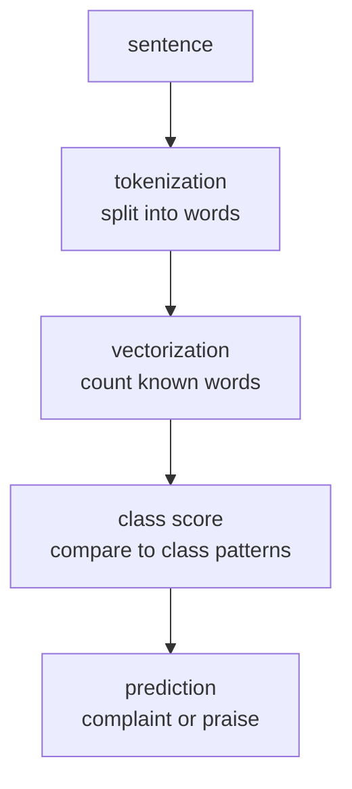

# P6-4.1 텍스트 분류 모델 목표

이미지 프로젝트를 지나면 자연스럽게 텍스트 프로젝트로 넘어가게 됩니다. 텍스트 분류(text classification)는 LLM 이전에도 매우 오래 쓰인 기본 과업(task)이며, 감정 분류, 스팸 분류, 문의 라우팅, 뉴스 주제 분류 같은 실무 문제와 직접 연결됩니다.

이번 절의 목적은 복잡한 언어 모델을 바로 쓰는 것이 아니라, `문장을 토큰(token) 묶음으로 바꾸고 라벨(label)을 예측하는 최소 프로젝트 흐름`을 확인하는 데 있습니다.

## 이 절의 범위

이 절은 다음 질문에 답합니다.

- 텍스트 분류 프로젝트는 어떤 입력과 출력을 갖는가?
- 문장을 숫자 벡터(vector)로 바꾸는 최소 방법은 무엇인가?
- 작은 텍스트 분류 프로젝트에서도 baseline이나 비교 기준이 왜 필요한가?

이 절은 다음 내용은 깊게 다루지 않습니다.

- BERT 계열 파인튜닝
- subword tokenizer의 내부 구현
- attention 기반 문장 표현
- 대규모 라벨 데이터셋

## 이 절의 목표

- 텍스트 분류 프로젝트를 `문장 -> 토큰 -> 벡터 -> 클래스 예측` 흐름으로 설명할 수 있습니다.
- 어휘(vocabulary)와 라벨 구조를 프로젝트 문서에 적을 수 있습니다.
- 작은 실습으로 예측값과 정확도를 직접 확인할 수 있습니다.

## 왜 텍스트 분류 프로젝트가 중요한가

텍스트 프로젝트는 Part 5의 LLM 문맥과도 직접 연결됩니다. 다만 여기서는 생성(generation)이 아니라 분류(classification)입니다. 그래서 다음 차이를 분명히 보는 것이 중요합니다.

| 구분 | 이번 프로젝트 |
| --- | --- |
| 입력 | 짧은 문장 |
| 출력 | 정해진 라벨(class) 하나 |
| 중심 질문 | 어떤 단어와 표현이 어떤 라벨과 연결되는가? |

즉, 이번 절은 `문장을 이해하는 모델`을 거대하게 설명하기보다, `문장을 라벨에 연결하는 작은 프로젝트`부터 다룹니다.

## 프로젝트 질문 설정

이번 프로젝트의 질문은 다음처럼 잡겠습니다.

> 고객 문장을 `complaint`와 `praise` 두 라벨로 나눌 수 있는가?

이 질문이 좋은 이유는 다음과 같습니다.

- 분류 라벨이 명확합니다.
- 토큰화(tokenization)와 어휘(vocabulary) 개념을 바로 붙일 수 있습니다.
- 이후 OOV(out-of-vocabulary) 문제와 평가 해석으로 이어지기 쉽습니다.

## 프로젝트 흐름



## 학습 데이터

이번 절에서는 여섯 개의 짧은 학습 문장을 사용합니다.

### complaint

- `refund delay angry`
- `broken product complaint`
- `refund request not working`

### praise

- `thank you fast delivery`
- `love this product great`
- `happy with quick support`

이 데이터는 실제 고객 로그가 아니라 프로젝트 실습용 장난감 문장입니다.

## Python 예제

이번 예제의 목적은 아주 단순한 공백 기준 토큰화와 count vector를 이용해 문장 분류 흐름을 확인하는 것입니다.

- 문제 상황: 고객 문장을 불만(complaint)과 칭찬(praise)으로 나눈다.
- 입력(input): 학습 문장 6개, 평가 문장 4개
- 정답(label): complaint = 0, praise = 1
- 확인할 개념:
  - 토큰화 후 어휘를 만든다
  - 문장을 count vector로 바꾼다
  - 클래스별 중심 패턴과의 거리를 비교해 예측한다

```python
import numpy as np

train_texts = [
    "refund delay angry",
    "broken product complaint",
    "thank you fast delivery",
    "love this product great",
    "refund request not working",
    "happy with quick support",
]
y_train = np.array([0, 0, 1, 1, 0, 1])  # 0 complaint, 1 praise

vocab = sorted({token for text in train_texts for token in text.split()})
token_to_index = {token: i for i, token in enumerate(vocab)}

def vectorize(texts):
    X = np.zeros((len(texts), len(vocab)), dtype=float)
    for i, text in enumerate(texts):
        for token in text.split():
            if token in token_to_index:
                X[i, token_to_index[token]] += 1
    return X

X_train = vectorize(train_texts)
class_centroids = np.vstack([
    X_train[y_train == 0].mean(axis=0),
    X_train[y_train == 1].mean(axis=0),
])

test_texts = [
    "refund for broken product",
    "great support thank you",
    "delay but quick refund",
    "love fast delivery",
]
y_test = np.array([0, 1, 0, 1])
X_test = vectorize(test_texts)

predictions = []
for x in X_test:
    distances = np.linalg.norm(class_centroids - x, axis=1)
    predictions.append(int(np.argmin(distances)))

predictions = np.array(predictions)

print("vocab_size =", len(vocab))
print("vocab_head =", vocab[:8])
print("train_shape =", X_train.shape)
print("test_pred =", predictions.tolist())
print("test_accuracy =", round((predictions == y_test).mean(), 3))
```

실행 결과 예시는 다음과 같습니다.

```text
vocab_size = 20
vocab_head = ['angry', 'broken', 'complaint', 'delay', 'delivery', 'fast', 'great', 'happy']
train_shape = (6, 20)
test_pred = [0, 1, 0, 1]
test_accuracy = 1.0
```

## 결과를 어떻게 읽는가

이 결과에서 읽어야 할 핵심은 다음입니다.

- 이번 프로젝트는 `문장`을 직접 이해한 것이 아니라, 먼저 어휘(vocabulary)를 만들고 count vector로 바꾼 뒤 분류했습니다.
- `train_shape = (6, 20)`은 학습 문장 6개가 20개 어휘 차원의 벡터로 바뀌었음을 뜻합니다.
- 작은 예제에서는 test 정확도가 1.0으로 나왔지만, 이것이 곧바로 강한 일반화(generalization)를 뜻하는 것은 아닙니다.

즉, 텍스트 분류 프로젝트도 이미지 프로젝트와 마찬가지로 `입력 표현`을 먼저 봐야 합니다.

## 커리큘럼 관점에서의 의미

이번 절은 Part 3와 Part 5를 함께 연결합니다.

- Part 3의 분류(classification) 구조를 텍스트 문제에 다시 적용합니다.
- Part 5의 토큰(token) 개념이 왜 중요한지 작은 프로젝트에서 확인합니다.

즉, 이번 절은 LLM 이전의 고전적 텍스트 분류 감각과, LLM 이후에도 계속 남는 토큰화 감각 사이의 다리 역할을 합니다.

## 다음 절과의 연결

P6-4.2에서는 같은 프로젝트를 바탕으로 다음 질문을 다룹니다.

- 토큰화(tokenization) 방식이 바뀌면 무엇이 달라지는가?
- 어휘에 없는 단어는 어떻게 기록해야 하는가?
- 정확도와 함께 토큰 coverage를 왜 같이 봐야 하는가?

## 이 절에서 기억할 관점

- 텍스트 분류는 `문장 -> 토큰 -> 벡터 -> 라벨` 흐름으로 읽을 수 있습니다.
- 어휘(vocabulary)를 어떻게 만들었는지가 프로젝트 품질에 큰 영향을 줍니다.
- 작은 성공 사례만으로 일반화를 단정하면 안 됩니다.
- 토큰화와 평가는 분리된 주제가 아니라 같은 프로젝트 안의 연결된 문제입니다.

## 체크리스트

- 텍스트 분류의 입력과 출력이 무엇인지 설명할 수 있는가?
- 토큰화와 어휘 생성 과정을 한 문단으로 적을 수 있는가?
- 문장이 벡터로 바뀐다는 뜻을 `shape`와 함께 설명할 수 있는가?
- 정확도 숫자와 함께 입력 표현 방식을 기록했는가?

## 출처와 참고 자료

- NumPy Developers, `NumPy documentation`, 확인 날짜: 2026-06-29. [https://numpy.org/doc/stable/](https://numpy.org/doc/stable/){: target="_blank" rel="noopener noreferrer" }

이 절의 텍스트 데이터는 프로젝트 실습을 위해 만든 자체 장난감 문장입니다.
