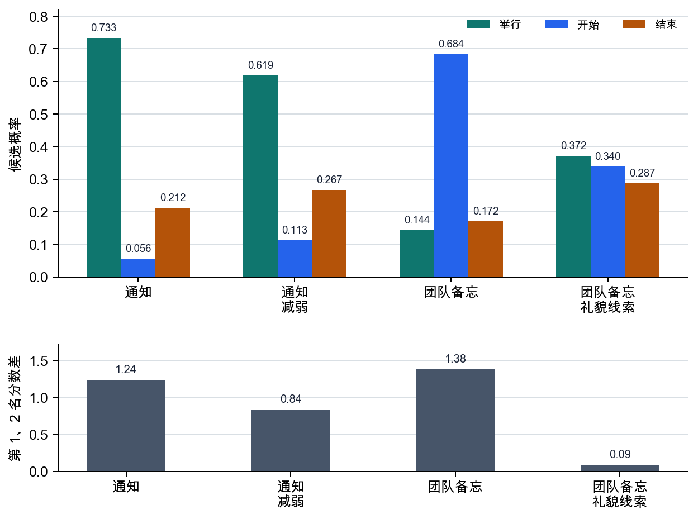

# P6-4.1 LLM 内部的 Transformer 计算流程

> Section ID: `P6-4.1`
> Version: `v2026.07.23`

_副标题：Transformer 如何把词元表示连接到下一候选分数？_

现在需要把 Part 5 中学过的 Transformer 结构，重新放回 Part 6 的生成式语言模型主线中。

如果说 Part 5 解释的是 Transformer 块本身的结构，那么 Part 6 要在生成式语言模型的计算流程中重新阅读同一个结构。核心在于，`词元 -> 嵌入 -> attention 块 -> 下一词元分数`会连成一个生成流程。

从 LLM 的角度重新看 Transformer 时，真正重要的是什么？在 LLM 中，Transformer 是一种基础结构：它把词元转换成嵌入，通过 self-attention 读取词元之间的关系，再通过 feed-forward 和重复块细化表示，最后预测下一个词元。

## Transformer 在生成计算中负责什么

重新阅读生成计算引擎时，核心问题有三个。

- 从 LLM 角度重新看已经学过的 Transformer，变化在哪里？
- 词元、嵌入、self-attention、下一词元预测如何连接？
- 为什么 Transformer 会成为生成式语言模型的基本结构？

先抓住 Transformer 块的大结构之后，multi-head attention、位置表示、KV cache、sparse attention、long context 这些补充主题也都能放在同一条流程上。服务运营视角中的延迟和成本限制，最终也会连接到这条计算流程被重复多少次、重复多久、重复得多快。

比重新展开 Transformer 公式更重要的是一张 `LLM 标准的结构地图`。它会支撑 Part 6 后面关于 GPT、pretraining、next-token prediction、RAG、agent 的说明。比细节块名称更重要的判断标准是：`输入词元经过怎样的计算流程，才连接到下一词元分数`。

| 现在阅读的内容 | 后面会扩展的问题 |
| --- | --- |
| 词元、嵌入、attention 块、下一词元分数是否形成一条流程 | context window 到底能容纳多大范围的输入 |
| Transformer 是 LLM 的基本计算引擎 | GPT 系列分化、pretraining、运营成本限制各自改变了什么 |

本节在 Part 6 主线请求流程中的作用，是展示输入词元会穿过怎样的计算引擎，再变成下一候选分数。只有先抓住这条流程，P6-5.1 的 GPT 系列、P6-6.1 的下一词元预测，以及后面关于 context window、prompt、RAG 的说明，才能放在同一个结构上阅读。

这里要确认的结果是：能否把 Transformer 读成一个中心引擎，而不是 `只把下一个词元猜一次的装置`。这个中心引擎会反映整个上下文，并更新下一候选分布。抓住这一区分之后，Part 5 的深度学习结构说明才能自然连接到 Part 6 的生成模型结构。

## 为什么要重新阅读同一个 Transformer

在 Part 5 中，我们把 Transformer 解释为一种深度学习结构。也就是说，当时的中心是这些块元素。

- self-attention
- feed-forward
- residual connection
- layer normalization

到了 Part 6，我们看的仍然是同一个结构，但问题变了。

- 这个结构如何读取文本？
- 这个结构为什么适合 next-token prediction？
- 这个结构为什么会成为 LLM 服务的基本计算单位？

也就是说，结构相同，但 `阅读视角`不同。

读过 P5-14，并不意味着 P6-4.1 会自动变得清楚。P5-14 是关闭 `Transformer 块内部有什么`这个问题的 Section，而 P6-4.1 必须重新连接这个块如何 `接收 LLM 请求，并以下一词元候选分数收束`。

因此，从 Part 5 直接转到这里时，先要补上下面的空白。

| P5-14 中已经抓住的内容 | P6-4.1 中要重新连接的内容 | 为什么不能直接跳过 |
| --- | --- | --- |
| self-attention 读取词元之间的关系 | 当前生成位置如何从前文上下文拉取线索，并改变下一候选 | 因为“读取关系”本身还没有连接到生成候选的变化 |
| feed-forward 和重复块加工表示 | 经过多层之后的最后位置表示，会变成下一词元分数表 | 因为只说表示变好，并不能看见实际输出形式 |
| residual connection 和 layer normalization 稳定地连接块 | 在长生成流程中，同一类块计算会反复执行，持续更新候选分布 | 因为块稳定化和生成循环属于不同层位 |
| Transformer 相比 RNN 更有利于并行计算和长上下文参照 | 在 LLM 中，这个优点成为 prompt、context window、GPT、RAG 说明的基础 | 因为计算结构的优点还没有和 Part 6 的服务与生成问题连接起来 |

这张表要确认的结果不是 `能否重新解释 P5-14`。要把 P5-14 的块说明当作踏板，但现在必须能够说明：`反映上下文的表示如何变成下一词元候选分布`。如果没有这座桥，P6-4.1 的案例和例子会像是突然跳到了 `下一词元分数表`。

## 在 LLM 中，词元是出发点

LLM 并不是把句子作为一个整体直接计算。它会先把文本读成词元(token)序列。

可以这样想。

```text
raw text
-> tokens
-> token ids
-> embeddings
-> Transformer blocks
-> next-token scores
```

这里的 Transformer，是词元已经被切分之后的计算结构。也就是说，Transformer 不是直接解释文本的第一阶段，而更接近于 `反复加工词元表示的中心引擎`。

## 嵌入制造可计算的起始表示

如 P6-2 章所见，词元 ID 只是编号。Transformer 不会直接处理这些编号，而是先把它们转换成嵌入(embedding)向量。

这个嵌入向量会成为后续所有计算的出发点。

可以这样理解。

`嵌入是把词元转换成 Transformer 可以计算的数字坐标的阶段。`

也就是说，Transformer 不是把文本当作字符串来读，而是在已经嵌入的词元表示上工作。

## self-attention 为什么对 LLM 特别重要

生成式语言模型必须在当前位置预测下一个词元。此时，到目前为止出现过的所有前文词元都可能成为线索。

例如，下面的信息都可能影响后面的生成。

- 前面出现过的主语
- 代码块中的函数名
- 文档开头的关键条件

self-attention 让每个词元计算自己和其他词元之间的相关程度。因此，当前位置的词元表示可以同时反映附近词元和更远的前文词元。

`在 LLM 中，self-attention 是一种计算结构，用来判断到目前为止出现的词元中，哪些对当前生成更重要。`

## 为什么需要 feed-forward 和重复块

只靠 self-attention 可以混合词元之间的关系，但这些信息并不会立刻变成足够好的表示。

feed-forward network 会在每个位置再次加工该位置的表示。这个块经过多层重复之后，表示可以变得更丰富。

也就是说：

- attention 读取关系
- feed-forward 再次修整每个位置的表示
- 多层重复让表示逐步细化

这条流程会直接连接到 Part 5 中的表示学习(representation learning)说明。

## 为什么最后会输出下一词元分数

LLM 说明中重要的差异在于最后输出的解释方式。

分类模型最后常常输出类别(class)分数。但生成式语言模型通常输出的是 `接下来可能出现的词元候选`的分数。

也就是说，经过 Transformer 块之后，最后的问题大致变成这样。

- 下一个位置最可能出现哪个词元？

这些分数之后会通过 softmax 和 sampling 等步骤，连接到实际输出词元的选择。

因此，Part 5 的结构说明在 Part 6 中会被重新读成下面这样。

> 表示学习结构
> -> 下一词元分布计算结构

把这个差异压缩到一个小输入中，可以这样看。

| 输入片段 | 先按 P5-14 的方式看到的内容 | P6-4.1 中还要额外看到的内容 |
| --- | --- | --- |
| `与客户的会议今天下午 2 点进行` | 词元表示经过 self-attention 和 feed-forward 后被更新 | 最后位置表示会连接到 `举行`、`结束`、`开始`等下一候选的分数差异 |
| `这是团队内部备忘录。今天会议下午 2 点进行` | 同一个 Transformer 块再次计算词元关系 | 因为前文有语气线索，候选分数表会从正式通知式表达偏向简短协作式表达 |

因此，目标不是重新背诵 Transformer 的部件名称，而是抓住同一批部件在 LLM 内部形成了 `上下文反映 -> 表示更新 -> 下一候选分数`这一生成流程。

## 用非常简单的方式画出来

```mermaid
--8<-- "assets/part-06/chapter-04/p6-c04-s01-transformer-flow-zh.mmd"
```

这个图是在 Part 6 中阅读 Transformer 时最常想起的最小结构。

## 案例和示例

下面的图把本节三个案例重新放到一个共同问题下：不是 `选择下一个词元一个`，而是 `前文整体如何改变下一候选分布`。

```mermaid
--8<-- "assets/part-06/chapter-04/p6-c04-s01-use-cases-zh.mmd"
```

从这个图中要确认的是：即使任务不同，最后阶段也很相似。所有场景都不应先看成 `只点中一个下一词元`，而应先看成 `反映前面输入的整个上下文之后，现在形成了怎样的候选分布`。

### 案例 1. 句子自动补全

想象一位运营人员正在写消息草稿，只输入了 `今天会议在下午`。这时很容易只看最后一个词后面，试着猜 `2 点`或 `3 点`这样的下一句话。但真正的自动补全并不是只看最后一个词的问题。Transformer 会查看前面的词元并计算下一候选分布，同时反映 `会议`和 `下午`等前文线索来选择下一表达。例如，即使句子结尾相同，如果前面有 `与客户`，更礼貌的通知式表达可能更自然；如果前面有 `团队内部`，更短的协作式表达可能更自然。这里变化的是判断标准：从 `是否猜中了最后词后面的内容`，转向 `前文整体如何改变下一候选`。

同样是 `今天会议在下午`这个结尾，前文不同，下一候选也会不同。

| 前文上下文 | 只看最后一个词时容易想到的内容 | 实际上更容易变自然的候选 |
| --- | --- | --- |
| `与客户` | 只是 `2 点`或 `3 点`这样的时间候选 | `2 点按计划举行`这样的通知式表达 |
| `团队内部` | 只要时间数字对了就够 | `2 点见`这样的简短协作式表达 |
| `这是一封通知邮件` | 好像只要补上时间信息就结束 | 时间信息和引导句结构会一起被决定 |

这张表纠正的误解是：`只要最后一个词相同，下一候选也差不多相同`。自动补全案例正是打破这个误解，并最容易展示 Transformer 会看前文整体的结构。

### 案例 2. 代码生成

当前面已经有函数定义和变量声明，后面继续写实现时，如果只看紧挨着的上一行，很容易漏掉变量名。前面声明了 `user_id`，后面却滑向 `userId`或 `account_id`，语法看起来可能没错，但实现一致性会被破坏。函数名是 `calculate_total`，但折扣步骤或税费反映顺序缺失时，前面设定的目的和后面的实现也会错开。

同样是代码生成，能否抓住前文上下文，会让摇晃的位置不同。

| 前文中已经打开的内容 | 只看上一行时容易发生的问题 | 持续看前文时更能保持的内容 |
| --- | --- | --- |
| `user_id` 这样的变量声明 | 滑向相似但不同的名称 | 变量名一致性 |
| `calculate_total` 这样的函数目的 | 漏掉折扣或税费步骤 | 实现目的和处理顺序的保持 |
| 条件语句或循环块结构 | 缩进和返回位置错开 | 块结构与返回流程的一致性 |

这个案例要确认的结果不是 `当前行附近是否看起来自然`，而是 `前面声明的名称和目的是否继续反映到后面实现的下一候选中`。Transformer 结构之所以在代码生成中重要，是因为它不仅基于紧邻上下文，还会基于已经打开的名称、目的、块结构来改变下一候选分布。

### 案例 3. 长文档摘要

总结长文档时，下一句候选也不是只由显眼的一句结论决定。前半部分的定义可能限制后面结论的适用范围，后面的例外条件也可能收窄前面的概括说明。比如结论句很短，但这个结论成立的范围被前面段落限定，那么摘要句的下一候选也要反映这个范围才自然。

这个案例要确认的结果不是 `是否只抓住前面或后面某个显眼部分`，而是 `前面的条件和后面的例外是否一起反映到下一摘要候选中`。长文档整体能维持多久，会在 P6-4.2 和 P6-4.5 中更直接讨论。这里先抓住一点即可：Transformer 会把上下文线索连接到下一候选分布。

从上下文反映的角度重新合并三个案例，可以这样看。

| 情况 | 只看紧邻前文时容易漏掉的内容 | 反映前文整体时更能保持的内容 |
| --- | --- | --- |
| 句子自动补全 | 只看最后一个词后的候选 | 符合前文上下文的语气和后续表达 |
| 代码生成 | 只看当前行附近的词元 | 已声明变量名和函数目的的一致性 |
| 长文档摘要 | 只看显眼的一句结论 | 反映前面条件和后面例外的下一摘要候选 |

## 从失败场景重新看判断标准

在应用场景中重新看 Transformer 时，常见错误是把它只读成 `困难内部结构名称的集合`，于是错过在实际场景中什么时候该重新拿出这个视角。此时，与其重新背公式或块名称，不如先判断当前问题是不是 `反映前文整体来选择下一候选`的问题。

| 现在先看到的场景 | 先提出的问题 | 先重新看的轴 |
| --- | --- | --- |
| 自动补全看起来只是机械地在最后一个词后面接数字 | `前文整体是否真的改变了语气和下一候选分布？` | Transformer 的上下文反映结构 |
| 代码生成在上一行附近看起来自然，但变量名和函数目的总是漂移 | `前面打开的名称和目的是否持续反映到后面实现中？` | Transformer 的长距离上下文连接 |
| 长文档摘要只留下显眼的一句结论，却经常漏掉条件或例外 | `它是否同时反映前后线索，而不是只抓住一个显眼部分？` | Transformer 的上下文整合结构 |

这张表的目的不是重新定义 Transformer，而是在看到实际失败场景时，先分流判断：这是 `只接上紧邻片段就够的问题`，还是必须重新读成 `反映前文整体的结构`的问题。

## 练习和示例

这个练习的目标不是实现完整 Transformer，而是用一个小分数表和图，确认前面整理的 `上下文反映 -> 表示更新 -> 下一候选分数`流程。我们将阅读共享同一个结尾的句子，如何因为前文上下文线索不同而变成不同的候选分布。

要确认的核心是：把下一词元预测读成 `根据上下文中哪些线索被激活，候选分数和概率分布会随之改变的过程`。下面的数值不是实际 LLM 的内部概率，而是为了说明分数差异如何呈现为候选分布而做的简化示例。

下面的图先压缩了这个例子要确认的流程。即使有相同结尾，前文上下文线索也会在 Transformer 块内部改变表示，而这个差异会连接到候选分数表和候选之间的差距。

```mermaid
--8<-- "assets/part-06/chapter-04/p6-c04-s01-scoring-flow-zh.mmd"
```

下表的输入是四种上下文条件。四种条件都共享同一个结尾：`今天会议将于下午 2 点进行`，但前面附加的上下文线索不同。`上下文变化`列显示进入了什么线索，`第一候选`和 `第二候选`显示在该条件下接下来可能出现的表达候选排名。`第一候选概率`和 `第 1、2 名差距`用于阅读第一名有多稳定。

即使共享同一个结尾，只要前文读到的线索不同，候选分数表也会改变。

| 上下文变化 | 第一候选 | 第一候选概率 | 第二候选 | 第 1、2 名差距 | 要读出的点 |
| --- | --- | ---: | --- | ---: | --- |
| 客户通知邮件 | `举行` | 0.733 | `结束` | 1.24 | 通知式语气线索强烈推高正式收束表达 |
| 通知感变弱 | `举行` | 0.619 | `结束` | 0.84 | 第一名相同，但确信程度下降 |
| 团队内部备忘录 | `开始` | 0.684 | `结束` | 1.38 | 内部备忘录线索推高更短的表达 |
| 团队内部备忘录混入礼貌语气 | `举行` | 0.372 | `开始` | 0.09 | 第一名改变，但差距很小，看起来是不稳定选择 |



读表时，先看 `上下文变化`列，再看第一候选是什么，最后看第 1、2 名差距是大还是小。例如在 `客户通知邮件`中，第一候选是 `举行`，差距也很大。相反，在 `团队内部备忘录混入礼貌语气`中，第一候选变成 `举行`，但差距只有 0.09。即使同样是第一名，也能看出稳定选择和摇摆选择的差异。

看图时也一样，重点不只是柱子的高度，而是候选之间的相对距离。在 `团队内部备忘录混入礼貌语气`中，`举行`是第一名，但和其他候选的差距很小。与其说下一词元选择已经稳定固定为一个选项，不如说上下文线索正在把候选分布拉向不同方向。

这样看，重要的不是 `背一个正确词元`，而是 `上下文中的哪些线索会怎样推高或拉低候选分布`。

这个例子要确认的核心如下。

- 即使候选集合相同，只要前文中读到的线索不同，分数表就会改变。
- Transformer 的最后计算，比起完整句子本身，更接近 `关于下一候选的分数分布`。
- 实际输出词元会从这个分数表中选择最高候选，或者通过 sampling 等规则被选出。
- 也就是说，比起 `直接猜中一个词`，把生成看成 `反映上下文并持续更新候选分布`更准确。

## 下一词元选择中分开的候选

前面的练习用更实际的分数表形式展示了：长上下文计算最终会以 `候选分数比较`和 `下一词元选择`收束。这里要读出的核心不是背下所有复杂内部块，而是这个计算最终会制造 `随前文上下文而变化的下一词元分布`。也就是说，阅读 Transformer 时，比起看 `直接猜中一个正确词`，看 `整个上下文如何改变下一候选分布`更准确。

## 为什么成为 LLM 的中心引擎

Transformer 成为语言模型的中心结构，并不只是因为性能好。

- 它能够更好地处理较长上下文
- 它很适合并行处理
- 同一个基本结构可以广泛复用于翻译、摘要、问答、代码生成等多种语言任务

## 检查清单

- 能否把 Transformer 解释为 `反映整个上下文并更新下一候选分布的引擎`？
- 能否区分 Part 5 的结构说明和 Part 6 的生成说明在哪里分开？
- 能否继续说明 Transformer 计算实际上也在输入范围限制内工作这一问题？

## 来源和参考资料

- Ashish Vaswani et al., [Attention Is All You Need](https://papers.nips.cc/paper_files/paper/2017/hash/3f5ee243547dee91fbd053c1c4a845aa-Abstract.html){: target="_blank" rel="noopener noreferrer" }, NeurIPS 2017, 确认日期：2026-07-19。用于说明 Transformer 的 self-attention、multi-head attention、positional encoding、feed-forward 块，是解释 LLM 结构的基本依据。
- Alec Radford et al., [Language Models are Unsupervised Multitask Learners](https://cdn.openai.com/better-language-models/language_models_are_unsupervised_multitask_learners.pdf){: target="_blank" rel="noopener noreferrer" }, OpenAI 2019, 确认日期：2026-07-19。作为背景依据，说明 GPT-2 是基于 Transformer 的 language model，并能执行多种语言任务。
- OpenAI, [openai/gpt-2](https://github.com/openai/gpt-2){: target="_blank" rel="noopener noreferrer" }, 确认日期：2026-07-19。作为辅助依据，确认 GPT-2 代码和模型是上述论文的公开实现，并确认使用模型时需要评价。
- Tom B. Brown et al., [Language Models are Few-Shot Learners](https://arxiv.org/abs/2005.14165){: target="_blank" rel="noopener noreferrer" }, arXiv 2020, 确认日期：2026-07-19。作为背景依据，说明 GPT-3 是 autoregressive language model，并说明 LLM 基于 next-token prediction 通过 few-shot text interaction 执行多种任务。
- Jay Alammar, [The Illustrated Transformer](https://jalammar.github.io/illustrated-transformer/){: target="_blank" rel="noopener noreferrer" }, 确认日期：2026-07-19。作为入门图解语言重新说明 Transformer 计算流程时的辅助教育资料。
