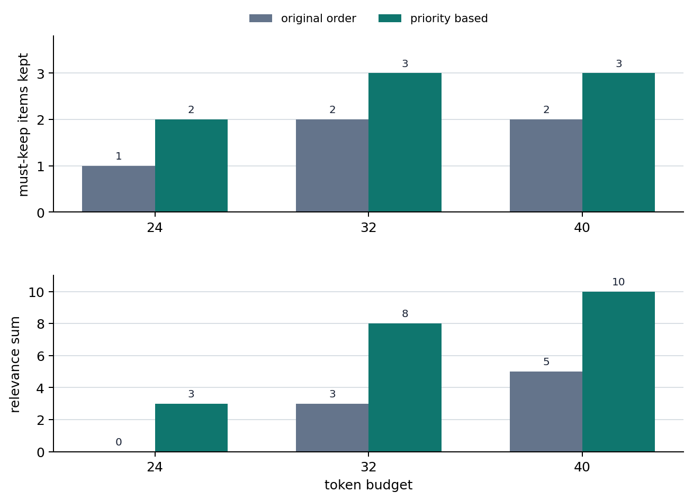

# P6-4.2 The Reference Range of Attention

> Section ID: `P6-4.2`
> Version: `v2026.07.24`

_Subtitle: What can attention look back at only inside the context window?_

In P6-4.1, we reread the Transformer by LLM standards and saw the flow where tokens pass through embeddings and Transformer blocks, then lead to next-token scores. This flow is powerful, but actual computation first meets an input-range constraint. Attention is a powerful relevance-computation structure, but that computation happens only over tokens that entered the context window.

If a Transformer can refer to previous tokens, how far can it actually refer? A context window is the token range a model can refer to within one computation, and attention is the structure that computes which tokens are more important inside that range.

## The Input Range Attention Can Read

When reading the input-range constraint, first separate attention from the context window. Attention computes how related tokens inside the input are to one another, but the computation target is limited to tokens inside the context window. So the core is not `attention sees everything`, but `the input range is limited first, and attention works only inside it`.

| What we are reading now | Question that broadens later |
| --- | --- |
| How far the model can see input in one computation | How that constraint is handled through actual retrieval, summarization, and operating policy |
| That attention computes importance only inside that range | What implementation differences long-context-specific architectures and serving optimization create |

Once this distinction is fixed, it naturally connects to why KV cache becomes necessary in repeated generation, why sparse attention and long-context discussions appear separately for long contexts, and why RAG connects to input selection. If the expression `sees all context` is interpreted too broadly, it is easy to misunderstand that an LLM always remembers all previous information.

## What Does Context Window Mean?

A context window is the token-length range a model can receive as one input.

For example, if a model supports 8k tokens, system messages, user input, conversation history, search results, and tool outputs must all fit inside that range.

It is useful to understand it as follows.

`It may seem better to put in more context, but in practice we must decide what to keep and what to reduce within a token-length limit.`

What matters at this point is separating `refers to a lot` from `refers infinitely`. An LLM can broadly use tokens that entered the input, but the input itself is always limited.

## Attention Computes Relevance Inside the Range

When we place attention on top of this constraint, the relationship becomes clearer. Attention is a structure that computes relevance among tokens, but that computation happens only inside the token range currently in the input, not over the infinite past.

That is:

- The context window limits `what can be seen`
- Attention computes `what to treat as more important` inside it

Do not mix the two.

A safer explanation is as follows.

`The context window is closer to an input-range limit, and attention is closer to a selection rule inside that range.`

## Why Does This Constraint Immediately Become a Service Problem?

The context window is not just a numeric limit. In practice, it is a constraint that makes us decide how to compose the input, and it creates the following problems.

- A long document may not fit as-is
- If old conversation history keeps accumulating, the front part can be pushed out
- If too many search results are inserted, cost rises and the core becomes blurred
- If tool output is long, the important user question can be pushed backward

In other words, the context window is a problem not only of model capability, but also of `service design`.

## Is a Long Context Always Better?

A long context window clearly has advantages.

- More background documents can be inserted
- Long code files or long contracts become easier to handle at once
- Conversation context becomes easier to maintain for a long time

But it is not always unconditionally better.

- Unnecessary context can also increase
- Irrelevant information can scatter attention
- Cost and latency can increase

So in practice, `how to choose important context well` becomes more important than simply `longer is better`.

## Where Input Range Changes Actual Design

If we tie what we have seen so far into one sentence, the actual design question does not end with `how much can be inserted`.

- What should be kept first?
- What should remain as-is, and what should be summarized?
- What is directly connected to the current question?

In other words, the context window problem is not a length competition, but also a problem of setting `standards for input selection and compression`. This view must be held so later explanations of RAG, conversation summarization, and agent context management can be read naturally as similar design problems.

## The Input-Selection Problem That Leads to RAG

RAG(retrieval-augmented generation) is not the target of detailed explanation in this section, but it is a representative scene showing where context-window constraints lead. The reason we search related document pieces and insert only needed parts instead of inserting the whole long document is to use evidence more efficiently inside the limited context window. The core to read here is not `attention is powerful, so we can insert the whole document`, but the sequence `first choose the evidence to keep in the window, then attention works inside it`.

## Drawn Very Simply

```mermaid
--8<-- "assets/part-06/chapter-04/p6-c04-s02-window-flow-en.mmd"
```

The core of this diagram is as follows.

- Not all information comes in
- There is first information that entered the window
- Attention is computed inside that range

## Cases and Examples

The diagram below groups the three cases in this section again under the shared question `what should be kept first inside a limited window`, rather than `how much to insert`.

```mermaid
--8<-- "assets/part-06/chapter-04/p6-c04-s02-use-cases-en.mmd"
```

What you should check in this diagram is that even if tasks differ, the core constraint is the same. In all cases, `does the important context remain first` matters more than `do we insert everything`, and attention is computed only inside the remaining range after that.

### Case 1. Long-Document Summarization

A user may insert a 100-page report all at once and ask, `summarize only the key points in five lines`. At first, people easily think `if we insert the whole long document, it will be more accurate`. But if the context window is limited, the model cannot insert and read the whole document as-is. Even if you want to keep both the background explanation at the front and the conclusion near the end, if all middle tables and appendices are also inserted, the final section containing the `final recommendation` can be cut off.

The same long document produces different results depending on the input-selection method.

| Input method | What is easy to expect first | What must be checked again in practice |
| --- | --- | --- |
| Insert the full 100 pages whole | It seems more accurate because more was inserted | Does the core conclusion section remain until the end? |
| Include tables and appendices too | It seems safe because there is more information | Do surrounding details push out the core recommendation? |
| Select key sections first | It can feel uneasy that something may be missed | Are conclusion and exceptions preserved more stably instead? |

The result to check in this case is not `does more input make it more accurate`, but `is the core section actually preserved inside the limited range`. When understanding context windows, first look at `which section should be kept first within the limit`, more than `how much can fit`.

### Case 2. Code Assistant

When fixing a bug in a large codebase, a user may expect `look at the whole repository and find the cause`. At first, it feels as if showing everything will fix it better. But in practice, it is hard to insert every file at once, so the current file, related functions, recent error logs, and failed test results must be selected first. If design asset files and old documents are inserted together while fixing a login error, the authentication middleware and session settings file can be cut, causing the core cause candidate to be missed.

Even the same bug fix leaves different clues depending on context selection.

| Input selection | First impression by human standard | What must be checked again in practice |
| --- | --- | --- |
| Insert a wide repository range | It seems the cause will be found better because more was shown | Do unrelated files push out core logs and settings? |
| Keep only the current file | It looks simple and light | Are the caller, tests, and error logs missing, breaking cause connection? |
| Prioritize related functions + error logs + failed tests | It can feel uneasy that some parts were removed | Does it best preserve the actual cause candidates? |

The result to check in this case is whether keeping files directly connected to the current question preserves actual cause candidates better than increasing the amount of information. The context window is not only a constraint that `everything cannot be shown`, but also a design standard that `context directly connected to the current problem must be selected`.

### Case 3. Conversational Chatbot

In a customer-support chatbot, as the conversation becomes longer, the order number from the beginning, policy explanations, and the user's follow-up questions continue accumulating. People often feel that keeping everything is safest, but if all this history is preserved as-is, the context quickly becomes long. Conversely, if too much is removed, important conditions can be lost.

The order number and refund exception conditions from the beginning remain important until the end, but repeated greetings in the middle or questions already resolved may not need to remain as-is. Conversely, if even the order number is lost during summarization, the later answer may explain the right policy but based on a different order case. The result to check in this case is whether core state such as order number and exception conditions is actually preserved longer than repeated greetings.

If we group the three cases again from the context-window management view, it becomes the following.

| Situation | What does not immediately improve just because more is inserted | What must remain first inside the limit |
| --- | --- | --- |
| Long-document summarization | Keeping all appendices and surrounding explanation | Final recommendation and core sections |
| Code assistant | Inserting the whole repository at once | Files and logs directly connected to the current error |
| Conversational chatbot | Preserving all conversation history as-is | Core state such as order number and exception conditions |

The purpose of this table is not pushing all three scenes into the same conclusion. Document summarization, code assistants, and chatbots are different tasks, but all show the common point that we first ask `do core clues remain inside the limited window`, more than `did we insert a lot`.

## Standards Revisited in Failure Scenes

A common mistake when seeing context windows in application scenes is immediately thinking only in the direction of inserting more when hearing `long context is needed`. But in actual service scenes, it is safer to first separate `did the failure happen because something did not remain in the window`, or `inside the already remaining range, what became more important`.

| Failure first visible now | First question to ask | Axis to revisit first |
| --- | --- | --- |
| A long document is inserted, but the core conclusion section is missing | `Was the important section in the window in the first place?` | context window / input selection |
| A code assistant reads a long file unrelated to the current error | `Were files and logs directly connected to the current question kept first?` | context window / context filtering |
| The needed context entered, but the answer follows the wrong clue | `Inside the remaining range, what did attention treat as more important?` | attention / relevance computation |
| As conversation grows, the early order number or exception condition is missed | `Did summarization/compression keep core state longer instead of repeated dialogue?` | context window / state preservation |

The purpose of this table is not redefining context windows and attention. It is to make you branch, when seeing an actual failure scene, whether to first look at `what remained in the window`, or `what became more important inside the remaining range`.

## Practice and Examples

The goal of this example is to see more clearly `what to keep first when there is a length limit`. We will compare a method that simply inserts items in input order with a method that selects again by importance, using a `token budget` rather than a simple count limit. We will also attach a simple relevance score that imitates `how directly connected an item is to the current question`, and see how what remains inside the context window connects to clues attention can actually see.

In the code below, `priority`, `must_keep`, and `query_keywords` are not values where the model automatically knew the right answer. They are context-selection rules that the service designer decided were important for the current task. The code compares which items those rules actually keep and push out inside the token budget. The token length of each item is directly calculated with `tiktoken`'s `o200k_base` encoding. In the result, we read the items that remain when inserted in input order, the items that remain when selected again by importance, items dropped as the budget changes, the degree of core-state preservation, and the relevance ranking of clues directly connected to the question among selected items.

The core to check is that when the context budget is insufficient, the evidence available for the final answer changes depending on which information is kept and discarded. Here, the value the actual tokenizer calculates is each item's `tokens`, and `budget_options` are operating assumptions readers can change. If `budget_options` changes, the items that survive also change, and attention can compute relevance only inside the items left after selection.

The diagram below first compresses the two selection methods this example compares. Even with the same token budget, the method that keeps items in input order and the method that selects again by priority create different clues that attention can actually see.

```mermaid
--8<-- "assets/part-06/chapter-04/p6-c04-s02-selection-flow-en.mmd"
```

```python
# Example comparing clues kept by input-order selection and priority-based selection inside a context-window token budget.
import string

import tiktoken

context_items = [
    {
        "name": "system instruction",
        "priority": 100,
        "content": "Follow policy and explain the cause clearly.",
    },
    {
        "name": "older chat history",
        "priority": 40,
        "content": "Earlier small talk and unrelated setup questions.",
    },
    {
        "name": "repeated greeting",
        "priority": 5,
        "content": "Hello again thank you hello again.",
    },
    {
        "name": "user question",
        "priority": 95,
        "content": "Why did login fail after the deploy?",
    },
    {
        "name": "current error log",
        "priority": 90,
        "content": "Login failed because session token signature mismatch after deploy.",
    },
    {
        "name": "related function code",
        "priority": 88,
        "content": "verify_session_token compares signature and rejects mismatch.",
    },
]

encoding = tiktoken.get_encoding("o200k_base")
for item in context_items:
    # Token budget judgment starts from actual tokenizer observations, not human-written estimates.
    item["tokens"] = len(encoding.encode(item["content"]))

budget_options = [24, 32, 40]
must_keep = {"system instruction", "user question", "current error log"}
query_keywords = {"login", "fail", "deploy", "token", "signature", "mismatch"}

def select_in_original_order(items, budget):
    selected = []
    used = 0
    for item in items:
        if used + item["tokens"] <= budget:
            selected.append(item)
            used += item["tokens"]
    dropped = [item for item in items if item not in selected]
    return selected, dropped, used

def select_by_priority(items, budget):
    ranked = sorted(items, key=lambda item: item["priority"], reverse=True)
    selected = []
    used = 0
    for item in ranked:
        if used + item["tokens"] <= budget:
            selected.append(item)
            used += item["tokens"]
    dropped = [item for item in ranked if item not in selected]
    return selected, dropped, used

def coverage(selected, must_keep_names):
    selected_names = {item["name"] for item in selected}
    kept = sorted(selected_names & must_keep_names)
    missing = sorted(must_keep_names - selected_names)
    return kept, missing

def relevance_ranking(selected, keywords):
    scored = []
    for item in selected:
        clean_content = item["content"].lower().translate(str.maketrans("", "", string.punctuation))
        words = set(clean_content.split())
        score = len(words & keywords)
        scored.append((score, item["name"]))
    return sorted(scored, reverse=True)

def print_summary(label, selected, dropped, used):
    kept, missing = coverage(selected, must_keep)
    print(f"[{label}]")
    print("used_tokens =", used)
    print("selected =", [item["name"] for item in selected])
    print("dropped =", [item["name"] for item in dropped])
    print("must_keep_missing =", missing)
    print("top_relevance =", relevance_ranking(selected, query_keywords)[:3])

for budget in budget_options:
    print("budget =", budget)
    naive_selected, naive_dropped, naive_used = select_in_original_order(
        context_items, budget
    )
    priority_selected, priority_dropped, priority_used = select_by_priority(
        context_items, budget
    )
    print_summary("original order", naive_selected, naive_dropped, naive_used)
    print_summary("priority based", priority_selected, priority_dropped, priority_used)
    print("---")
```

The output below was confirmed with the same values as the body code using Python in the local `.venv`.

An example execution result can be read as follows.

```text
budget = 24
[original order]
used_tokens = 23
selected = ['system instruction', 'older chat history', 'repeated greeting']
dropped = ['user question', 'current error log', 'related function code']
must_keep_missing = ['current error log', 'user question']
top_relevance = [(0, 'system instruction'), (0, 'repeated greeting'), (0, 'older chat history')]
[priority based]
used_tokens = 24
selected = ['system instruction', 'user question', 'older chat history']
dropped = ['current error log', 'related function code', 'repeated greeting']
must_keep_missing = ['current error log']
top_relevance = [(3, 'user question'), (0, 'system instruction'), (0, 'older chat history')]
---
budget = 32
[original order]
used_tokens = 31
selected = ['system instruction', 'older chat history', 'repeated greeting', 'user question']
dropped = ['current error log', 'related function code']
must_keep_missing = ['current error log']
top_relevance = [(3, 'user question'), (0, 'system instruction'), (0, 'repeated greeting')]
[priority based]
used_tokens = 26
selected = ['system instruction', 'user question', 'current error log']
dropped = ['related function code', 'older chat history', 'repeated greeting']
must_keep_missing = []
top_relevance = [(5, 'current error log'), (3, 'user question'), (0, 'system instruction')]
---
budget = 40
[original order]
used_tokens = 40
selected = ['system instruction', 'older chat history', 'repeated greeting', 'user question', 'related function code']
dropped = ['current error log']
must_keep_missing = ['current error log']
top_relevance = [(3, 'user question'), (2, 'related function code'), (0, 'system instruction')]
[priority based]
used_tokens = 35
selected = ['system instruction', 'user question', 'current error log', 'related function code']
dropped = ['older chat history', 'repeated greeting']
must_keep_missing = []
top_relevance = [(5, 'current error log'), (3, 'user question'), (2, 'related function code')]
```

The core to read in this example is as follows.

- Even with the same token budget, if items are simply inserted in input order, `older chat history` and `repeated greeting` take space, and `user question` and `current error log` can be cut.
- If selected again by priority, items directly connected to the current question survive first, and old history or repeated greetings are pushed back.
- When the budget grows from 24 to 32, the priority method newly preserves `current error log`, while the original-order method still lets older chat history occupy space.
- Even when the budget grows to 40, the original-order method preserves `user question` and `related function code`, but `current error log` is still missing. Inserting more does not automatically preserve core clues.
- In original-order selection, the question and error clue themselves may not be inside the range attention can see, so relevance scores are close to all zero.
- In priority selection, `current error log` and `user question` enter the window together, so clues attention can actually refer to remain.
- What matters in context-window management is not `how much was inserted`, but `whether core state was actually preserved inside the budget`.
- If some budget remains after priority selection, lower-priority items can partly enter, but it is more important to first check `whether all required state survived`.
- So when reading context-selection logic, check not only total token count, but also whether required state such as `order number`, `current question`, and `latest error log` actually remains.

The graph below summarizes how the difference between the two selection methods changes as the budget grows. The top part shows how many of the three required states survived, and the bottom part shows how much question-related evidence remained inside the selected items.



## Relevance That Diverges in Input Selection

The previous example is not code that implements long-context handling. It is the shortest scene showing that `what to keep and what to remove` is the actual design problem, more than `what more can be inserted`. The core to read here is that the context window is not just a length number, but a constraint that makes us reset input priority inside the token budget. And because attention computes relevance only among the items left afterward, if core clues are pushed outside the window in the first place, attention cannot refer to them no matter how good it is. The connection becomes natural if you see RAG, conversation summarization, and code-assistant context selection as different forms of this same problem.

## Why Context Management Became a Design Topic

In early language models, this kind of long-context management problem did not appear at the practical front as it does now. But as Transformers and LLMs became general-purpose structures for handling long input, context-length management itself became an important design topic.

## Checklist

- You should be able to explain the context window as `an input-range limit`.
- You should be able to distinguish the roles of attention and the context window again.
- You should be ready to read the next chapters as a problem of `what to keep`, not `how much to insert`.

## Sources and References

- Ashish Vaswani et al., [Attention Is All You Need](https://papers.nips.cc/paper_files/paper/2017/hash/3f5ee243547dee91fbd053c1c4a845aa-Abstract.html){: target="_blank" rel="noopener noreferrer" }, NeurIPS 2017, accessed 2026-07-19. Used as basic evidence for explaining that self-attention computes relationships among positions inside an input sequence.
- Colin Raffel et al., [Exploring the Limits of Transfer Learning with a Unified Text-to-Text Transformer](https://jmlr.csail.mit.edu/beta/papers/v21/20-074.html){: target="_blank" rel="noopener noreferrer" }, JMLR 2020, accessed 2026-07-19. Used as background evidence that Transformer-based text-to-text structures are reused across text tasks such as summarization, question answering, and classification.
- OpenAI, [Models documentation](https://developers.openai.com/api/docs/models){: target="_blank" rel="noopener noreferrer" }, accessed 2026-07-19. Used as operational evidence for explaining that the context window appears as an actual input-range constraint by checking the current API documentation structure where context window and max output tokens are listed by model.
