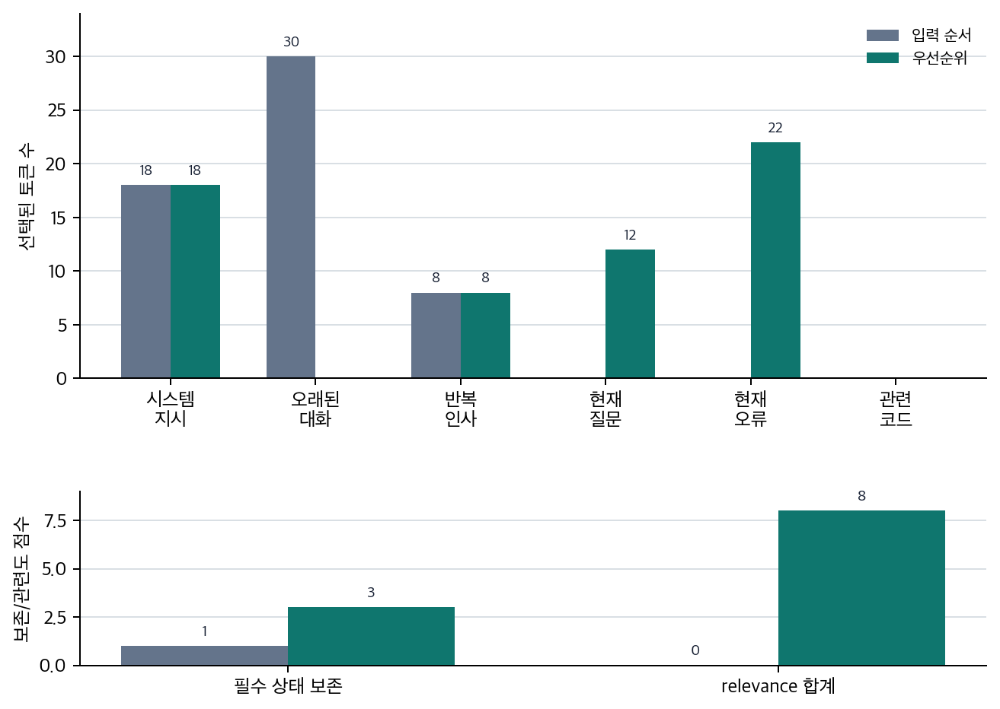

# P6-4.2 attention과 context window

> Section ID: `P6-4.2`
> Version: `v2026.07.21`

P6-4.1에서는 Transformer를 LLM 기준으로 다시 읽으며, 토큰이 임베딩을 거쳐 Transformer 블록을 통과한 뒤 다음 토큰 점수로 이어지는 흐름을 보았습니다. 이 흐름은 강력하지만, 실제 계산은 먼저 입력 범위 제약을 만납니다.

Transformer가 앞 문맥을 반영할 수 있어도, 실제 서비스에서는 먼저 입력 범위 제한을 만납니다. attention은 강력한 관련도 계산 구조이지만, 그 계산은 context window 안에 들어온 토큰을 대상으로만 일어납니다.

Transformer가 이전 토큰을 참고할 수 있다면, 실제로는 어디까지 참고할 수 있는가? context window는 모델이 한 번의 계산 안에서 참고할 수 있는 토큰 범위이며, attention은 그 범위 안에서 어떤 토큰이 더 중요한지 계산하는 구조입니다.

## 입력 범위 제약이 다루는 질문

입력 범위 제약을 읽을 때 핵심 질문은 다음 세 가지입니다.

- attention과 context window는 어떤 관계인가?
- 왜 `모든 이전 토큰을 본다`는 말에도 실제 한계가 붙는가?
- context window는 왜 비용, 품질, 서비스 구조에 영향을 주는가?

따라서 핵심은 `attention이 모든 것을 본다`가 아니라 `입력 범위가 먼저 제한되고 attention은 그 안에서만 작동한다`는 점입니다.

| 지금 읽는 것 | 이후 넓어지는 질문 |
| --- | --- |
| 모델이 한 번의 계산에서 어디까지 입력으로 볼 수 있는가 | 그 제약을 실제 retrieval, 요약, 운영 정책으로 어떻게 풀어내는가 |
| attention이 그 범위 안에서만 중요도를 계산한다는 점 | 긴 문맥 전용 아키텍처와 서빙 최적화가 어떤 구현 차이를 만드는가 |

이 구분이 잡히면 반복 생성에서 왜 KV cache가 필요해지는지, 긴 문맥에서 왜 sparse attention과 long-context 이야기가 따로 나오는지, RAG가 왜 입력 선택 문제와 연결되는지도 자연스럽게 이어집니다.

`문맥을 다 본다`는 표현을 너무 크게 해석하면 LLM이 앞선 모든 정보를 언제나 기억하는 것처럼 오해하기 쉽습니다. 여기서 확인해야 할 결과는 P6-4.1의 Transformer 구조를 실제 사용 제약과 연결해, 이후 RAG, prompt 설계, tool use, agent loop에서 왜 입력 선택이 중요해지는지 설명할 수 있게 되는가입니다.

## context window는 무엇을 뜻하나

context window는 모델이 한 번의 입력으로 받을 수 있는 토큰 길이 범위입니다.

예를 들어 어떤 모델이 8k tokens를 지원한다면, 시스템 메시지, 사용자 입력, 대화 기록, 검색 결과, 도구 출력까지 합쳐 그 범위 안에 들어와야 합니다.

다음처럼 이해하면 좋습니다.

`문맥을 많이 넣을수록 좋을 것 같지만, 실제로는 토큰 길이 제한 안에서 무엇을 남기고 무엇을 줄일지 결정해야 한다.`

이 지점에서 중요한 것은 `많이 참고한다`와 `무한히 참고한다`를 구분하는 일입니다. LLM은 입력 안에 들어온 토큰을 넓게 활용할 수 있지만, 그 입력 자체는 항상 한정되어 있습니다.

## attention은 범위 안의 관련도를 계산한다

이제 attention을 이 제약 위에 올려 보면 관계가 더 분명해집니다. attention은 토큰 간 관련도를 계산하는 구조이지만, 그 계산은 무한한 과거 전체가 아니라 현재 입력에 들어와 있는 토큰 범위 안에서만 이루어집니다.

즉:

- context window는 `무엇까지 볼 수 있는가`를 제한하고
- attention은 그 안에서 `무엇을 더 중요하게 볼 것인가`를 계산합니다

이 둘을 섞으면 안 됩니다.

더 안전한 설명은 다음과 같습니다.

`context window는 입력 범위 제한에 가깝고, attention은 그 안의 선택 규칙에 가깝다.`

## 왜 이 제약이 바로 서비스 문제로 이어지나

context window는 단순 숫자 제한이 아닙니다. 실제로는 입력을 어떻게 구성할지 결정하게 만드는 제약이며, 다음 문제를 만듭니다.

- 긴 문서를 그대로 다 넣지 못할 수 있다
- 오래된 대화 기록을 계속 누적하면 앞부분이 밀릴 수 있다
- 검색 결과를 너무 많이 넣으면 비용이 커지고 핵심이 흐려질 수 있다
- 도구 출력이 길면 정작 중요한 사용자 질문이 뒤로 밀릴 수 있다

즉, context window는 모델 성능뿐 아니라 `서비스 설계`의 문제이기도 합니다.

## 긴 문맥이 항상 더 좋은가

긴 context window는 분명 유리한 점이 있습니다.

- 더 많은 배경 문서를 넣을 수 있고
- 긴 코드 파일이나 긴 계약서를 한 번에 다루기 쉬워지며
- 대화 맥락을 오래 유지하기 쉬워집니다

하지만 항상 무조건 더 좋은 것은 아닙니다.

- 불필요한 문맥도 함께 늘어날 수 있고
- 관련 없는 정보가 attention을 분산시킬 수 있으며
- 비용과 지연 시간(latency)이 커질 수 있습니다

따라서 실무에서는 단순히 `길면 좋다`보다 `중요한 문맥을 어떻게 잘 고를 것인가`가 더 중요해집니다.

## 그래서 실제 설계 질문은 무엇인가

여기까지를 한 줄로 묶으면, 실제 설계 질문은 `얼마나 길게 넣을 수 있는가` 하나로 끝나지 않습니다.

- 무엇을 먼저 남길 것인가
- 무엇은 그대로 두고 무엇은 요약할 것인가
- 무엇이 현재 질문과 직접 연결되는가

즉, context window 문제는 길이 경쟁이 아니라 `입력 선택과 압축의 기준`을 세우는 문제이기도 합니다. 이 관점을 잡아야 뒤에서 RAG, 대화 요약, 에이전트 문맥 관리가 왜 모두 비슷한 설계 문제로 묶이는지 자연스럽게 읽을 수 있습니다.

## 그래서 왜 RAG와 연결되는가

RAG(retrieval-augmented generation)는 바로 이 문제와 연결됩니다.

긴 문서 전체를 넣는 대신:

- 관련 문서 조각만 검색하고
- 필요한 부분만 잘라 넣어
- 제한된 context window 안에서 근거를 더 효율적으로 사용하려는 구조이기 때문입니다

즉, context window의 존재는 RAG가 왜 필요한지 설명하는 중요한 배경입니다.

여기서 읽어야 할 핵심은 `attention이 강하니 문서를 전부 넣으면 된다`가 아니라, `윈도우 안에 남길 근거를 먼저 고르고 그 안에서 attention이 작동한다`는 순서입니다.

## 아주 단순하게 그리면

```mermaid
--8<-- "assets/part-06/chapter-04/p6-c04-s02-window-flow-ko.mmd"
```

이 도식의 핵심은 다음입니다.

- 전체 정보가 다 들어오는 것이 아니라
- 먼저 윈도우 안에 들어온 정보가 있고
- attention은 그 안에서 계산된다는 점입니다

## 사례 및 예시

아래 도식은 이 절의 세 사례를 `얼마나 많이 넣는가`보다 `제한된 창 안에 무엇을 우선 남길 것인가`라는 공통 질문으로 다시 묶은 것입니다.

```mermaid
--8<-- "assets/part-06/chapter-04/p6-c04-s02-use-cases-ko.mmd"
```

이 도식에서 확인해야 할 점은 과업이 달라도 핵심 제약이 같다는 것입니다. 모두 `전부 넣는가`보다 `중요한 문맥을 먼저 남기는가`가 더 중요하며, attention은 그 뒤에 남은 범위 안에서만 계산됩니다.

### 사례 1. 긴 문서 요약

사용자가 100페이지 보고서를 한 번에 넣고 `핵심만 다섯 줄로 정리해 달라`고 요청할 수 있습니다. 사람은 처음에 `긴 문서를 다 넣으면 더 정확하겠지`라고 생각하기 쉽습니다. 하지만 문맥 윈도우가 한정되어 있으면 모델은 문서 전체를 그대로 다 넣어 읽지 못합니다. 앞부분의 배경 설명과 뒤쪽의 결론을 모두 남기고 싶어도, 중간 표와 부록까지 전부 넣으면 정작 `최종 권고안`이 적힌 마지막 절이 잘려 나갈 수 있습니다.

같은 긴 문서도 입력 선택 방식에 따라 결과가 달라집니다.

| 입력 방식 | 먼저 기대하기 쉬운 것 | 실제로 다시 봐야 하는 것 |
| --- | --- | --- |
| 100페이지 전체를 통째로 넣음 | 많이 넣었으니 더 정확할 것 같음 | 핵심 결론 절이 끝까지 남는가 |
| 표·부록까지 모두 포함 | 정보가 많으니 안전할 것 같음 | 주변 정보가 핵심 권고안을 밀어내지 않는가 |
| 핵심 절을 먼저 골라 넣음 | 뭔가 빠뜨릴까 불안할 수 있음 | 오히려 결론과 예외가 더 안정적으로 보존되는가 |

이 사례에서 확인할 결과는 `많이 넣으면 더 정확한가`가 아니라 `제한된 범위 안에서 핵심 절이 실제로 보존되는가`입니다. context window를 이해할 때는 `얼마나 담을 수 있나`보다 `그 제한 안에서 어떤 절을 먼저 남길 것인가`를 더 먼저 봐야 합니다.

### 사례 2. 코드 도우미

큰 코드베이스에서 버그를 고칠 때 사용자는 `저장소 전체를 보고 원인을 찾아 달라`고 기대할 수 있습니다. 처음에는 전체를 다 보여 주면 더 잘 고칠 것 같다고 느끼기 쉽습니다. 하지만 실제로는 모든 파일을 한 번에 넣기 어렵기 때문에, 현재 파일, 관련 함수, 최근 에러 로그, 실패한 테스트 결과를 우선 선택해야 합니다. 로그인 오류를 고치는데 디자인 자산 파일과 오래된 문서까지 함께 넣는다면, 정작 인증 미들웨어와 세션 설정 파일이 잘리고 핵심 원인 후보를 놓칠 수 있습니다.

같은 버그 수정도 문맥 선택에 따라 남는 단서가 달라집니다.

| 입력 선택 | 사람 기준 첫인상 | 실제로 다시 확인해야 하는 것 |
| --- | --- | --- |
| 저장소 범위를 넓게 많이 넣음 | 많이 보여 줬으니 원인도 더 잘 찾을 것 같음 | 관련 없는 파일이 핵심 로그와 설정을 밀어내지 않는가 |
| 현재 파일만 남김 | 간단하고 가벼워 보임 | 호출부·테스트·에러 로그가 빠져 원인 연결이 끊기지 않는가 |
| 관련 함수 + 에러 로그 + 실패 테스트를 우선 남김 | 일부를 뺀 것 같아 불안할 수 있음 | 실제 원인 후보를 가장 잘 보존하는가 |

이 사례에서 확인할 결과는 정보량을 늘리는 것보다 현재 질문과 직접 연결된 파일을 남긴 쪽이 실제 원인 후보를 더 잘 보존하는가입니다. context window는 `전부 다 보여 줄 수 없다`는 제약일 뿐 아니라, `지금 문제와 직접 연결된 문맥을 선별해야 한다`는 설계 기준이기도 합니다.

### 사례 3. 대화형 챗봇

고객 지원 챗봇에서 대화가 길어지면 초반의 주문번호, 정책 설명, 사용자의 추가 질문이 계속 쌓입니다. 사람은 일단 다 남겨 두면 가장 안전하다고 느끼기 쉽지만, 이 기록을 전부 그대로 유지하면 문맥이 금방 길어지고 반대로 너무 많이 지우면 중요한 조건을 잃어버릴 수 있습니다.

초반에 나온 주문번호와 환불 예외 조건은 끝까지 중요하지만, 중간의 반복 인사나 이미 해결된 질문은 그대로 유지할 필요가 적을 수 있습니다. 반대로 주문번호까지 요약 과정에서 빠뜨리면, 뒤 답변이 맞는 정책을 말해도 다른 주문 건을 기준으로 설명하는 오류가 생길 수 있습니다. 이 사례에서 확인할 결과는 반복 인사보다 주문번호와 예외 조건 같은 핵심 상태가 실제로 더 오래 보존되는가입니다.

세 사례를 context window 관리 관점으로 다시 묶으면 다음과 같습니다.

| 상황 | 많이 넣는다고 바로 좋아지지 않는 것 | 제한 안에서 먼저 남겨야 하는 것 |
| --- | --- | --- |
| 긴 문서 요약 | 부록과 주변 설명까지 전부 유지하는 것 | 최종 권고안과 핵심 절 |
| 코드 도우미 | 저장소 전체를 한 번에 넣는 것 | 현재 오류와 직접 연결된 파일·로그 |
| 대화형 챗봇 | 모든 대화 기록을 그대로 보존하는 것 | 주문번호, 예외 조건 같은 핵심 상태 |

이 표의 목적은 세 장면을 모두 같은 결론으로 밀어 넣는 데 있지 않습니다. 문서 요약, 코드 도우미, 챗봇은 서로 다른 과업이지만, 모두 `많이 넣는가`보다 `제한된 창 안에 핵심 단서가 남는가`를 먼저 묻는다는 공통점을 보여 줍니다.

## 실패 장면에서 다시 보는 기준

context window를 적용 장면에서 다시 볼 때 자주 하는 실수는, `긴 문맥이 필요하다`는 말을 들으면 곧바로 더 많이 넣는 쪽으로만 생각하는 일입니다. 하지만 실제 서비스 장면에서는 먼저 `지금 실패가 윈도우 안에 무엇이 안 남아서 생긴 것인가`, `아니면 이미 남아 있는 범위 안에서 무엇이 더 중요했는가`를 가르는 편이 안전합니다.

| 지금 먼저 보이는 실패 | 먼저 던질 질문 | 먼저 다시 볼 축 |
| --- | --- | --- |
| 긴 문서를 넣었는데 핵심 결론 절이 빠진다 | `중요한 절이 애초에 윈도우 안에 남아 있었는가?` | context window / 입력 선택 |
| 코드 도우미가 현재 오류와 무관한 파일을 길게 본다 | `현재 질문과 직접 연결된 파일·로그가 먼저 남아 있었는가?` | context window / 문맥 선별 |
| 필요한 문맥은 들어갔는데도 답이 엉뚱한 단서를 따라간다 | `남아 있는 범위 안에서 attention이 무엇을 더 중요하게 봤는가?` | attention / 관련도 계산 |
| 대화가 길어질수록 초반 주문번호나 예외 조건을 놓친다 | `반복 대화 대신 핵심 상태를 오래 남기도록 요약·압축했는가?` | context window / 상태 보존 |

이 표의 목적은 context window와 attention을 다시 정의하는 데 있지 않습니다. 실제 실패 장면을 봤을 때 `먼저 윈도우 안에 무엇이 남았는가`를 볼지, `남은 범위 안에서 무엇이 더 중요해졌는가`를 볼지 분기하게 만드는 데 있습니다.

## 연습 및 예제

이 예제의 목표는 `길이 제한이 있을 때 무엇을 우선 남길 것인가`를 더 분명하게 보는 것입니다. 단순 개수 제한이 아니라 `토큰 예산`을 두고, 입력 순서대로 그냥 넣는 방식과 중요도 기준으로 다시 고르는 방식을 비교하겠습니다. 여기에 `현재 질문과 얼마나 직접 연결되는가`를 흉내 내는 간단한 relevance 점수도 붙여, context window 안에 무엇이 남느냐가 attention이 실제로 볼 수 있는 단서와 어떻게 연결되는지도 함께 보겠습니다.

아래 코드는 여러 개의 문맥 항목, 각 항목의 토큰 길이와 우선순위, 최대 토큰 예산을 사용합니다. 결과에서는 입력 순서대로 넣었을 때 남는 항목, 중요도 기준으로 다시 골랐을 때 남는 항목, 두 방식에서 탈락한 항목과 총 사용 토큰, 핵심 상태 보존 정도, 선택된 항목 안에서 질문과 직접 연결된 단서의 relevance 순위를 함께 봅니다.

확인할 핵심은 context budget이 부족할 때 어떤 정보를 남기고 버리느냐에 따라 최종 답변에 쓸 수 있는 근거가 달라진다는 점입니다. attention은 선택 뒤에 남은 항목 안에서만 관련도를 계산할 수 있습니다.

아래 도식은 이 예제가 비교하려는 두 선택 방식을 먼저 압축한 것입니다. 같은 토큰 예산이어도 입력 순서대로 남기는 방식과 우선순위로 다시 고르는 방식은, attention이 실제로 볼 수 있는 단서를 다르게 만듭니다.

```mermaid
--8<-- "assets/part-06/chapter-04/p6-c04-s02-selection-flow-ko.mmd"
```

```python
# context window 토큰 예산 안에서 입력 순서 선택과 중요도 기반 선택이 남기는 단서를 비교하는 예제입니다.
import string

context_items = [
    {
        "name": "system instruction",
        "tokens": 18,
        "priority": 100,
        "content": "Follow policy and explain the cause clearly.",
    },
    {
        "name": "older chat history",
        "tokens": 30,
        "priority": 40,
        "content": "Earlier small talk and unrelated setup questions.",
    },
    {
        "name": "repeated greeting",
        "tokens": 8,
        "priority": 5,
        "content": "Hello again thank you hello again.",
    },
    {
        "name": "user question",
        "tokens": 12,
        "priority": 95,
        "content": "Why did login fail after the deploy?",
    },
    {
        "name": "current error log",
        "tokens": 22,
        "priority": 90,
        "content": "Login failed because session token signature mismatch after deploy.",
    },
    {
        "name": "related function code",
        "tokens": 20,
        "priority": 88,
        "content": "verify_session_token compares signature and rejects mismatch.",
    },
]

token_budget = 60
must_keep = {"system instruction", "user question", "current error log"}
query_keywords = {"login", "fail", "deploy", "token", "signature", "mismatch"}

def select_in_original_order(items, budget):
    selected = []
    used = 0
    for item in items:
        if used + item["tokens"] <= budget:
            selected.append(item)
            used += item["tokens"]
    dropped = [item for item in items if item not in selected]
    return selected, dropped, used

def select_by_priority(items, budget):
    ranked = sorted(items, key=lambda item: item["priority"], reverse=True)
    selected = []
    used = 0
    for item in ranked:
        if used + item["tokens"] <= budget:
            selected.append(item)
            used += item["tokens"]
    dropped = [item for item in ranked if item not in selected]
    return selected, dropped, used

naive_selected, naive_dropped, naive_used = select_in_original_order(context_items, token_budget)
priority_selected, priority_dropped, priority_used = select_by_priority(context_items, token_budget)

def coverage(selected, must_keep_names):
    selected_names = {item["name"] for item in selected}
    kept = sorted(selected_names & must_keep_names)
    missing = sorted(must_keep_names - selected_names)
    return kept, missing

def relevance_ranking(selected, keywords):
    scored = []
    for item in selected:
        clean_content = item["content"].lower().translate(str.maketrans("", "", string.punctuation))
        words = set(clean_content.split())
        score = len(words & keywords)
        scored.append((score, item["name"]))
    return sorted(scored, reverse=True)

print("[naive original-order selection]")
for item in naive_selected:
    print("-", item["name"], "| tokens =", item["tokens"], "| priority =", item["priority"])
print("used_tokens =", naive_used)
print("dropped =", [item["name"] for item in naive_dropped])
naive_kept, naive_missing = coverage(naive_selected, must_keep)
print("must_keep_kept =", naive_kept)
print("must_keep_missing =", naive_missing)
print("relevance_ranking =", relevance_ranking(naive_selected, query_keywords))
print()

print("[priority-based selection]")
for item in priority_selected:
    print("-", item["name"], "| tokens =", item["tokens"], "| priority =", item["priority"])
print("used_tokens =", priority_used)
print("dropped =", [item["name"] for item in priority_dropped])
priority_kept, priority_missing = coverage(priority_selected, must_keep)
print("must_keep_kept =", priority_kept)
print("must_keep_missing =", priority_missing)
print("relevance_ranking =", relevance_ranking(priority_selected, query_keywords))
```

아래 출력은 로컬 `.venv`의 Python 실행으로 본문 코드와 같은 값을 확인했습니다.

실행 결과 예시는 다음처럼 읽을 수 있습니다.

```text
[naive original-order selection]
- system instruction | tokens = 18 | priority = 100
- older chat history | tokens = 30 | priority = 40
- repeated greeting | tokens = 8 | priority = 5
used_tokens = 56
dropped = ['user question', 'current error log', 'related function code']
must_keep_kept = ['system instruction']
must_keep_missing = ['current error log', 'user question']
relevance_ranking = [(0, 'system instruction'), (0, 'repeated greeting'), (0, 'older chat history')]

[priority-based selection]
- system instruction | tokens = 18 | priority = 100
- user question | tokens = 12 | priority = 95
- current error log | tokens = 22 | priority = 90
- repeated greeting | tokens = 8 | priority = 5
used_tokens = 60
dropped = ['related function code', 'older chat history']
must_keep_kept = ['current error log', 'system instruction', 'user question']
must_keep_missing = []
relevance_ranking = [(5, 'current error log'), (3, 'user question'), (0, 'system instruction'), (0, 'repeated greeting')]
```

이 예제에서 읽어야 할 핵심은 다음입니다.

- 같은 토큰 예산이어도 입력 순서대로 그냥 넣으면 `older chat history`와 `repeated greeting`이 자리를 차지해, 정작 `user question`과 `current error log`가 잘릴 수 있습니다.
- 중요도 기준으로 다시 고르면 현재 질문과 직접 연결된 항목이 먼저 살아남고, 오래된 기록이나 반복 인사는 뒤로 밀립니다.
- naive 선택에서는 attention이 볼 수 있는 범위 안에 질문·오류 단서 자체가 없으므로, relevance 순위를 매겨도 전부 0점에 가깝습니다.
- priority 선택에서는 `current error log`와 `user question`이 윈도우 안에 함께 들어와, attention이 실제로 참고할 만한 단서가 남습니다.
- context window 관리에서 중요한 것은 `얼마나 많이 넣었는가`보다 `예산 안에서 핵심 상태를 실제로 살렸는가`입니다.
- 우선순위 선택 뒤에 예산이 조금 남으면 낮은 우선순위 항목이 일부 들어올 수 있지만, 그보다 먼저 `필수 상태가 전부 살아남았는가`를 확인하는 편이 더 중요합니다.
- 그래서 문맥 선택 로직을 볼 때는 총 토큰 수뿐 아니라 `주문번호`, `현재 질문`, `최신 오류 로그` 같은 필수 상태가 실제로 남았는지를 함께 점검해야 합니다.



## 입력 선택 관점으로 다시 보면

앞의 예제는 긴 문맥 처리를 구현하는 코드가 아니라, `무엇을 더 넣을 수 있는가`보다 `무엇을 남기고 무엇을 덜어낼 것인가`가 실제 설계 문제라는 점을 가장 짧게 보여 주는 장면입니다. 여기서 읽어야 할 핵심은 context window가 단순 길이 숫자가 아니라, 토큰 예산 안에서 입력 우선순위를 다시 정하게 만드는 제약이라는 점입니다. 그리고 attention은 그 뒤에 남아 있는 항목들 사이에서만 관련도를 계산하므로, 애초에 핵심 단서가 윈도우 밖으로 밀리면 attention이 아무리 좋아도 그 단서를 참고할 수 없습니다. RAG, 대화 요약, 코드 어시스턴트 문맥 선택이 모두 결국 이 문제를 다른 형태로 풀고 있다고 보면 연결이 자연스럽습니다.

## 왜 문맥 관리가 설계 주제가 되었는가

초기 언어 모델에서는 이렇게 긴 문맥 관리 문제가 지금처럼 실무 전면에 드러나지 않았습니다. 하지만 Transformer와 LLM이 긴 입력을 다루는 범용 구조가 되면서, 이제 문맥 길이 관리 자체가 중요한 설계 주제가 되었습니다.

## 체크리스트

- context window를 `입력 범위 제한`이라는 말로 설명할 수 있어야 합니다.
- attention과 context window의 역할 차이를 다시 구분할 수 있어야 합니다.
- 다음 장들을 `얼마나 많이 넣는가`보다 `무엇을 남길 것인가`의 문제로 읽을 준비가 되어 있어야 합니다.

## 출처와 참고 자료

- Ashish Vaswani et al., [Attention Is All You Need](https://papers.nips.cc/paper_files/paper/2017/hash/3f5ee243547dee91fbd053c1c4a845aa-Abstract.html){: target="_blank" rel="noopener noreferrer" }, NeurIPS 2017, 확인 날짜: 2026-07-19. self-attention이 입력 시퀀스 안의 위치들 사이 관계를 계산한다는 설명의 기본 근거로 사용했다.
- Colin Raffel et al., [Exploring the Limits of Transfer Learning with a Unified Text-to-Text Transformer](https://jmlr.csail.mit.edu/beta/papers/v21/20-074.html){: target="_blank" rel="noopener noreferrer" }, JMLR 2020, 확인 날짜: 2026-07-19. Transformer 기반 text-to-text 구조가 요약, 질의응답, 분류 등 여러 텍스트 과업에 재사용된다는 배경 근거로 사용했다.
- OpenAI, [Models documentation](https://developers.openai.com/api/docs/models){: target="_blank" rel="noopener noreferrer" }, 확인 날짜: 2026-07-19. 모델별 context window와 max output tokens가 명시되는 현재 API 문서 구조를 확인해, context window가 실제 입력 범위 제약으로 드러난다는 설명의 운영 근거로 사용했다.
