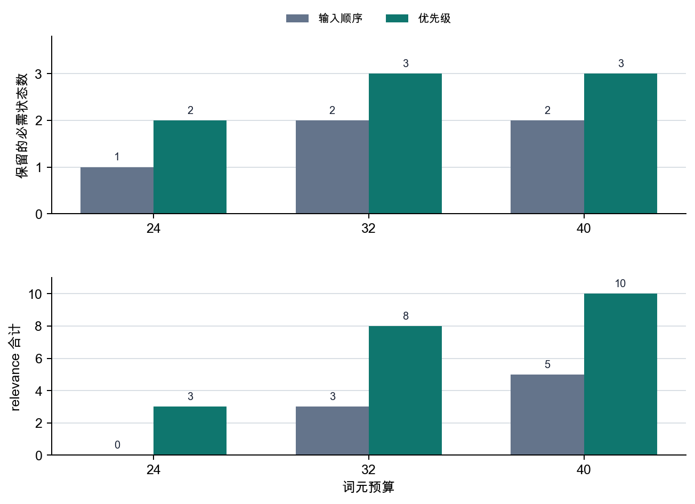

# P6-4.2 attention 的参照范围

> Section ID: `P6-4.2`
> Version: `v2026.07.24`

_副标题：attention 只能在 context window 内重新看见什么？_

在 P6-4.1 中，我们按 LLM 标准重新阅读了 Transformer，并看见了词元经过嵌入和 Transformer 块之后，连接到下一词元分数的流程。这个流程很强大，但实际计算首先会遇到输入范围限制。attention 是强大的相关度计算结构，但这种计算只发生在进入 context window 的词元之间。

如果 Transformer 能参考之前的词元，那么它实际上能参考到哪里？context window 是模型在一次计算中可以参考的词元范围，而 attention 是在这个范围内计算哪些词元更重要的结构。

## attention 能读取的输入范围

阅读输入范围限制时，要先把 attention 和 context window 分开。attention 会计算输入中的词元彼此有多相关，但计算对象被限制在 context window 内的词元。因此核心不是 `attention 能看见一切`，而是 `输入范围先被限制，attention 只在其中工作`。

| 现在阅读的内容 | 后面会扩展的问题 |
| --- | --- |
| 模型在一次计算中能把多大范围看作输入 | 这个限制怎样通过实际 retrieval、摘要、运营策略来处理 |
| attention 只在这个范围内计算重要度 | long-context 专用架构和 serving 优化会造成哪些实现差异 |

一旦抓住这个区分，为什么重复生成中需要 KV cache，为什么长上下文中会单独讨论 sparse attention 和 long-context，为什么 RAG 会连接到输入选择问题，也会自然接上。若把 `模型看见上下文`这句话解释得过大，就容易误以为 LLM 总是记得前面的所有信息。

## context window 是什么意思

context window 是模型一次输入可以接收的词元长度范围。

例如，如果某个模型支持 8k tokens，那么系统消息、用户输入、对话记录、搜索结果、工具输出，都必须合计放进这个范围内。

可以这样理解。

`放入更多上下文看起来会更好，但实际上必须在词元长度限制内决定保留什么、压缩什么。`

这里重要的是区分 `参考很多内容`和 `无限参考内容`。LLM 可以广泛利用已经进入输入的词元，但输入本身始终是有限的。

## attention 在范围内计算相关度

现在把 attention 放到这个限制之上，关系就更清楚了。attention 是计算词元之间相关度的结构，但这种计算不是针对无限过去的全部内容，而只发生在当前输入包含的词元范围内。

也就是说：

- context window 限制 `能看见什么`
- attention 在其中计算 `更重要地看什么`

不能把两者混在一起。

更稳妥的说明如下。

`context window 更接近输入范围限制，attention 更接近这个范围内的选择规则。`

## 为什么这个限制会直接变成服务问题

context window 不只是一个数字限制。实际使用时，它会迫使我们决定如何组成输入，并带来下面的问题。

- 长文档可能无法原样全部放入
- 旧对话记录不断累积时，前面的部分可能被挤出
- 搜索结果放得太多，成本会上升，核心也可能变模糊
- 工具输出太长时，真正重要的用户问题可能被推到后面

也就是说，context window 不只是模型能力问题，也是 `服务设计`问题。

## 长上下文总是更好吗

长 context window 确实有优势。

- 可以放入更多背景文档
- 更容易一次处理长代码文件或长合同
- 更容易长时间维持对话脉络

但它并不总是无条件更好。

- 不必要的上下文也会一起增加
- 无关信息可能分散 attention
- 成本和延迟(latency)可能变大

因此在实务中，比起单纯说 `越长越好`，`怎样选好重要上下文`更重要。

## 输入范围实际改变设计的位置

把目前为止的内容合成一句话，实际设计问题并不会停在 `能放多长`。

- 什么应该先留下？
- 什么应该原样保留，什么应该摘要？
- 什么和当前问题直接连接？

换句话说，context window 问题不是长度竞争，也是建立 `输入选择和压缩标准`的问题。抓住这个视角之后，后面关于 RAG、对话摘要、agent 上下文管理的说明，都会更自然地读成相似的设计问题。

## 通向 RAG 的输入选择问题

RAG(retrieval-augmented generation)不是本节要详细解释的对象，但它是展示 context window 限制会通向哪里的一种代表场景。我们不把长文档整体放入，而是搜索相关文档片段，只插入需要的部分，是为了在有限的 context window 中更有效地使用依据。这里要读出的核心不是 `attention 很强，所以把文档全部放进去就行`，而是 `先选择要留在窗口内的依据，然后 attention 在其中工作`这一顺序。

## 用非常简单的方式画出来

```mermaid
--8<-- "assets/part-06/chapter-04/p6-c04-s02-window-flow-zh.mmd"
```

这个图的核心如下。

- 并不是所有信息都会进入
- 先有进入窗口内的信息
- attention 在这个范围内计算

## 案例和示例

下面的图把本节三个案例重新放到一个共同问题下：不是 `放入多少`，而是 `有限窗口里应该优先留下什么`。

```mermaid
--8<-- "assets/part-06/chapter-04/p6-c04-s02-use-cases-zh.mmd"
```

从这个图中要确认的是：即使任务不同，核心限制也是相同的。所有场景中，比起 `是否全部放入`，`重要上下文是否先留下`更关键，而 attention 只在之后留下的范围内计算。

### 案例 1. 长文档摘要

用户可能一次放入 100 页报告，并请求 `请用五行整理核心内容`。人一开始容易觉得 `长文档全部放进去应该更准确`。但如果 context window 有限，模型就无法把整个文档原样放进去阅读。即使想同时保留前面的背景说明和后面的结论，如果中间表格和附录也全部放入，写着 `最终建议`的最后一节反而可能被截掉。

同一份长文档，也会因为输入选择方式不同而产生不同结果。

| 输入方式 | 一开始容易期待的事 | 实际上要重新检查的事 |
| --- | --- | --- |
| 把 100 页整体全部放入 | 因为放得多，所以似乎更准确 | 核心结论节是否留到了最后 |
| 表格和附录也全部包含 | 信息多，所以似乎更安全 | 周边信息是否把核心建议挤出 |
| 先挑选核心章节放入 | 可能担心漏掉什么 | 结论和例外是否反而更稳定地保留下来 |

这个案例要确认的结果不是 `放得越多是否越准确`，而是 `核心章节是否真的保存在有限范围内`。理解 context window 时，比起 `能装多少`，更先要看 `在这个限制内应该优先留下哪一节`。

### 案例 2. 代码助手

在大型代码库中修复 bug 时，用户可能期待 `看完整个仓库并找出原因`。一开始会觉得给它看全部内容会修得更好。但实际很难一次放入所有文件，所以必须优先选择当前文件、相关函数、最近错误日志、失败测试结果。修复登录错误时，如果把设计资源文件和旧文档也一起放入，真正重要的认证中间件和 session 设置文件可能被截掉，核心原因候选也会被错过。

同样是 bug 修复，文脉选择不同，留下的线索也不同。

| 输入选择 | 人的第一印象 | 实际上要重新确认的事 |
| --- | --- | --- |
| 很宽地放入仓库范围 | 因为展示得多，似乎更容易找原因 | 无关文件是否把核心日志和设置挤出 |
| 只保留当前文件 | 看起来简单、轻量 | 调用方、测试、错误日志是否缺失，导致原因连接断开 |
| 优先保留相关函数 + 错误日志 + 失败测试 | 可能担心删掉了一部分 | 是否最能保存实际原因候选 |

这个案例要确认的结果是：比起增加信息量，保留和当前问题直接连接的文件，是否更能保存实际原因候选。context window 不只是 `不能全部展示`的限制，也是 `必须筛选和当前问题直接相关的上下文`这一设计标准。

### 案例 3. 对话型聊天机器人

在客户支持聊天机器人中，对话变长后，开头的订单号、政策说明、用户追加问题会持续累积。人往往觉得全部留下最安全，但如果原样保留全部记录，文脉很快会变长；反过来，如果删得太多，又可能丢失重要条件。

开头出现的订单号和退款例外条件直到最后都很重要，但中间的重复问候或已经解决的问题，不一定需要原样保留。相反，如果订单号在摘要过程中也被漏掉，那么后续回答即使说的是正确政策，也可能基于另一个订单案例来解释。这个案例要确认的结果是：订单号和例外条件这样的核心状态，是否真的比重复问候保存得更久。

从 context window 管理视角重新合并三个案例，可以这样看。

| 情况 | 不是放得多就会立刻变好的事 | 在限制内必须先留下的事 |
| --- | --- | --- |
| 长文档摘要 | 保留所有附录和周边说明 | 最终建议和核心章节 |
| 代码助手 | 一次放入整个仓库 | 与当前错误直接连接的文件和日志 |
| 对话型聊天机器人 | 原样保存所有对话记录 | 订单号、例外条件等核心状态 |

这张表的目的不是把三个场景硬推向同一个结论。文档摘要、代码助手、聊天机器人是不同任务，但它们都展示了一个共同点：比起 `放了很多吗`，要先问 `核心线索是否留在有限窗口内`。

## 从失败场景重新看判断标准

在应用场景中重新看 context window 时，常见错误是听到 `需要长上下文`就立刻只往放入更多内容的方向想。但在实际服务场景中，更稳妥的是先区分：`这个失败是因为窗口里本来就没留下某些东西`，还是 `已经留下的范围内，别的东西变得更重要`。

| 现在先看到的失败 | 先提出的问题 | 先重新看的轴 |
| --- | --- | --- |
| 放入长文档后，核心结论节却不见了 | `重要章节一开始是否留在窗口内？` | context window / 输入选择 |
| 代码助手长时间阅读和当前错误无关的文件 | `和当前问题直接连接的文件、日志是否先留下？` | context window / 文脉筛选 |
| 需要的文脉已经进入，但答案跟着错误线索走 | `在留下的范围内，attention 把什么看得更重要？` | attention / 相关度计算 |
| 对话越长，越容易漏掉开头订单号或例外条件 | `摘要和压缩是否让核心状态比重复对话保留得更久？` | context window / 状态保存 |

这张表的目的不是重新定义 context window 和 attention，而是在看到实际失败场景时，帮助先分流：应该先看 `窗口中留下了什么`，还是看 `留下的范围内什么变得更重要`。

## 练习和示例

这个例子的目标是更清楚地看见：`有长度限制时，应该先留下什么`。我们不只使用简单的数量限制，而是设置 `词元预算`，比较按输入顺序直接放入的方式和按重要度重新选择的方式。这里还会加入一个简单的 relevance 分数，模拟 `某项内容和当前问题有多直接相关`，同时观察 context window 中留下什么，如何连接到 attention 实际能看见的线索。

下面代码中的 `priority`、`must_keep`、`query_keywords` 不是模型自动知道的正确答案。它们是服务设计者针对当前任务设定的重要文脉选择规则。代码会比较这些规则在词元预算内实际留下哪些项目、挤掉哪些项目。每个项目的词元长度用 `tiktoken` 的 `o200k_base` 编码直接计算。结果中，我们会同时阅读按输入顺序留下的项目、按重要度重新选择后留下的项目、预算变化时被淘汰的项目、核心状态保存程度，以及已选项目中和问题直接连接的线索 relevance 排名。

要确认的核心是：当 context budget 不足时，最终回答可使用的依据会随保留和丢弃的信息而改变。这里实际 tokenizer 计算出的值是每个项目的 `tokens`，`budget_options` 是读者可以改动的运营假设值。如果 `budget_options` 改变，存活的项目也会改变，而 attention 只能在选择后留下的项目内计算相关度。

下面的图先压缩了这个例子要比较的两种选择方式。即使词元预算相同，按输入顺序留下和按优先级重选，会让 attention 实际能看见的线索不同。

```mermaid
--8<-- "assets/part-06/chapter-04/p6-c04-s02-selection-flow-zh.mmd"
```

```python
# 比较 context window 词元预算内，输入顺序选择和优先级选择各自留下的线索。
import string

import tiktoken

context_items = [
    {
        "name": "system instruction",
        "priority": 100,
        "content": "Follow policy and explain the cause clearly.",
    },
    {
        "name": "older chat history",
        "priority": 40,
        "content": "Earlier small talk and unrelated setup questions.",
    },
    {
        "name": "repeated greeting",
        "priority": 5,
        "content": "Hello again thank you hello again.",
    },
    {
        "name": "user question",
        "priority": 95,
        "content": "Why did login fail after the deploy?",
    },
    {
        "name": "current error log",
        "priority": 90,
        "content": "Login failed because session token signature mismatch after deploy.",
    },
    {
        "name": "related function code",
        "priority": 88,
        "content": "verify_session_token compares signature and rejects mismatch.",
    },
]

encoding = tiktoken.get_encoding("o200k_base")
for item in context_items:
    # 词元预算判断从实际 tokenizer 观察值开始，而不是从人工估计值开始。
    item["tokens"] = len(encoding.encode(item["content"]))

budget_options = [24, 32, 40]
must_keep = {"system instruction", "user question", "current error log"}
query_keywords = {"login", "fail", "deploy", "token", "signature", "mismatch"}

def select_in_original_order(items, budget):
    selected = []
    used = 0
    for item in items:
        if used + item["tokens"] <= budget:
            selected.append(item)
            used += item["tokens"]
    dropped = [item for item in items if item not in selected]
    return selected, dropped, used

def select_by_priority(items, budget):
    ranked = sorted(items, key=lambda item: item["priority"], reverse=True)
    selected = []
    used = 0
    for item in ranked:
        if used + item["tokens"] <= budget:
            selected.append(item)
            used += item["tokens"]
    dropped = [item for item in ranked if item not in selected]
    return selected, dropped, used

def coverage(selected, must_keep_names):
    selected_names = {item["name"] for item in selected}
    kept = sorted(selected_names & must_keep_names)
    missing = sorted(must_keep_names - selected_names)
    return kept, missing

def relevance_ranking(selected, keywords):
    scored = []
    for item in selected:
        clean_content = item["content"].lower().translate(str.maketrans("", "", string.punctuation))
        words = set(clean_content.split())
        score = len(words & keywords)
        scored.append((score, item["name"]))
    return sorted(scored, reverse=True)

def print_summary(label, selected, dropped, used):
    kept, missing = coverage(selected, must_keep)
    print(f"[{label}]")
    print("used_tokens =", used)
    print("selected =", [item["name"] for item in selected])
    print("dropped =", [item["name"] for item in dropped])
    print("must_keep_missing =", missing)
    print("top_relevance =", relevance_ranking(selected, query_keywords)[:3])

for budget in budget_options:
    print("budget =", budget)
    naive_selected, naive_dropped, naive_used = select_in_original_order(
        context_items, budget
    )
    priority_selected, priority_dropped, priority_used = select_by_priority(
        context_items, budget
    )
    print_summary("original order", naive_selected, naive_dropped, naive_used)
    print_summary("priority based", priority_selected, priority_dropped, priority_used)
    print("---")
```

下面的输出已用本地 `.venv` 的 Python 按正文代码确认了相同数值。

执行结果示例可以这样阅读。

```text
budget = 24
[original order]
used_tokens = 23
selected = ['system instruction', 'older chat history', 'repeated greeting']
dropped = ['user question', 'current error log', 'related function code']
must_keep_missing = ['current error log', 'user question']
top_relevance = [(0, 'system instruction'), (0, 'repeated greeting'), (0, 'older chat history')]
[priority based]
used_tokens = 24
selected = ['system instruction', 'user question', 'older chat history']
dropped = ['current error log', 'related function code', 'repeated greeting']
must_keep_missing = ['current error log']
top_relevance = [(3, 'user question'), (0, 'system instruction'), (0, 'older chat history')]
---
budget = 32
[original order]
used_tokens = 31
selected = ['system instruction', 'older chat history', 'repeated greeting', 'user question']
dropped = ['current error log', 'related function code']
must_keep_missing = ['current error log']
top_relevance = [(3, 'user question'), (0, 'system instruction'), (0, 'repeated greeting')]
[priority based]
used_tokens = 26
selected = ['system instruction', 'user question', 'current error log']
dropped = ['related function code', 'older chat history', 'repeated greeting']
must_keep_missing = []
top_relevance = [(5, 'current error log'), (3, 'user question'), (0, 'system instruction')]
---
budget = 40
[original order]
used_tokens = 40
selected = ['system instruction', 'older chat history', 'repeated greeting', 'user question', 'related function code']
dropped = ['current error log']
must_keep_missing = ['current error log']
top_relevance = [(3, 'user question'), (2, 'related function code'), (0, 'system instruction')]
[priority based]
used_tokens = 35
selected = ['system instruction', 'user question', 'current error log', 'related function code']
dropped = ['older chat history', 'repeated greeting']
must_keep_missing = []
top_relevance = [(5, 'current error log'), (3, 'user question'), (2, 'related function code')]
```

这个例子要读出的核心如下。

- 即使词元预算相同，如果只是按输入顺序放入，`older chat history` 和 `repeated greeting` 会占据空间，真正的 `user question` 和 `current error log` 可能被截掉。
- 如果按重要度重新选择，和当前问题直接相关的项目会先存活，旧记录或重复问候会被推后。
- 预算从 24 增加到 32 时，priority 方式会新保留 `current error log`，但 original order 方式仍然让旧对话记录占据空间。
- 即使预算增加到 40，original order 方式也只保留了 `user question` 和 `related function code`，`current error log` 仍然缺失。放得多并不意味着核心线索会自动保留。
- 在 original order 选择中，问题和错误线索本身可能不在 attention 可见范围内，所以 relevance 排名几乎全是 0。
- 在 priority 选择中，`current error log` 和 `user question` 一起进入窗口，attention 实际可以参考的线索才会留下。
- context window 管理中重要的不是 `放入了多少`，而是 `核心状态是否真的保存在预算内`。
- 优先级选择之后如果还有一点预算，低优先级项目可以部分进入，但更重要的是先确认 `必需状态是否全部存活`。
- 因此阅读文脉选择逻辑时，不只要检查总词元数，还要一起检查 `订单号`、`当前问题`、`最新错误日志`这样的必需状态是否真的留下。

下面的图总结了预算增加时，两种选择方式的差异如何变化。上半部分显示三个必需状态中有几个存活，下半部分显示已选项目中留下了多少和问题相关的线索。



## 输入选择中分开的相关度

前面的例子不是实现长上下文处理的代码，而是最短地展示：比起 `还能多放什么`，`留下什么、删掉什么`才是实际设计问题。这里要读出的核心是，context window 不只是长度数字，而是在词元预算内重新确定输入优先级的限制。而且 attention 只会在之后留下的项目之间计算相关度，所以如果核心线索一开始就被挤出窗口，那么 attention 再好也无法参考它。把 RAG、对话摘要、代码助手的文脉选择都看成这个问题的不同形态，连接就会自然。

## 为什么文脉管理成为设计主题

在早期语言模型中，这种长文脉管理问题并不像现在这样出现在实务前台。但随着 Transformer 和 LLM 成为处理长输入的通用结构，文脉长度管理本身也成了重要设计主题。

## 检查清单

- 应该能够把 context window 解释为 `输入范围限制`。
- 应该能够重新区分 attention 和 context window 的作用差异。
- 应该准备好把后面的章节读成 `留下什么`的问题，而不是 `放入多少`的问题。

## 来源和参考资料

- Ashish Vaswani et al., [Attention Is All You Need](https://papers.nips.cc/paper_files/paper/2017/hash/3f5ee243547dee91fbd053c1c4a845aa-Abstract.html){: target="_blank" rel="noopener noreferrer" }, NeurIPS 2017, 确认日期：2026-07-19。作为基本依据，用于说明 self-attention 会计算输入序列内部位置之间的关系。
- Colin Raffel et al., [Exploring the Limits of Transfer Learning with a Unified Text-to-Text Transformer](https://jmlr.csail.mit.edu/beta/papers/v21/20-074.html){: target="_blank" rel="noopener noreferrer" }, JMLR 2020, 确认日期：2026-07-19。作为背景依据，用于说明基于 Transformer 的 text-to-text 结构可复用于摘要、问答、分类等多种文本任务。
- OpenAI, [Models documentation](https://developers.openai.com/api/docs/models){: target="_blank" rel="noopener noreferrer" }, 确认日期：2026-07-19。作为运营依据，用于确认当前 API 文档结构会按模型列出 context window 和 max output tokens，从而说明 context window 会表现为实际输入范围限制。
