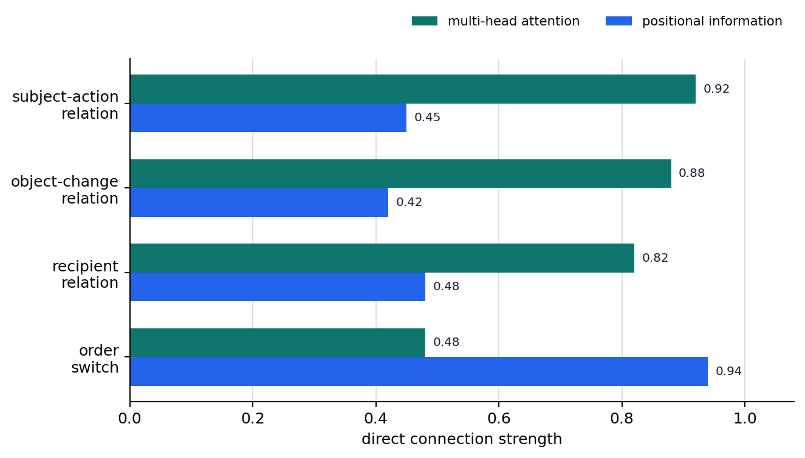

# P6-4.3 Supplement: Attention Heads and Positional Representations

> Section ID: `P6-4.3`
> Version: `v2026.07.23`

_Subtitle: How do multi-head attention and positional representations separately reinforce context relationships and order information?_

In P6-4.1, we saw the large structure of Transformer blocks, and in P6-4.2, we saw that attention works only inside the context window. But two names often block readers again at this point.

How does a Transformer read relationships and order among tokens together?

The names that become the standard for answering this question are `multi-head attention` and `positional representation(position encoding)`.

Here, we explain the two as one bundle of `reinforcing how context is read`. Repeated generation speed, long-context computation burden, and long-context design are problems at a different level from context reading itself.

## Context Position and the Role of Attention

- Why does multi-head attention use several heads?
- Why are positional representations needed?
- Why do the two names look like they are at the same level, but actually play different roles?

The problem to close first here is `what the model reinforces when reading context`.

| What we handle now | Question that broadens later |
| --- | --- |
| Multi-head attention that avoids seeing many relationships with only one view | Why does speed slow down in a long conversation? |
| Positional representations that separately provide order | Sparse attention, long context, serving optimization |
| Minimal standard for distinguishing `relationship reading` and `order reading` | Implementation differences by actual model and long-context optimization comparison |

This distinction must be fixed so KV cache, sparse attention, and long context can be read separately as problems of `repeated generation speed`, `computation burden`, and `long input maintenance`, not as `context reading itself`.

## Why Look at These Two Together First?

At first, `multi-head attention` and `positional representations` both look like names of internal Transformer parts. At this point, it is safest to distinguish them as follows.

- Multi-head attention is closer to `which relationships to view from several perspectives`.
- Positional representation is closer to providing `in what order that relationship occurred`.

In other words, one is a `relationship-reading method`, and the other is an `order-information supply method`.

Without this standard, misunderstandings such as `because there are several heads, order must also be known automatically` can easily appear. But the problem of providing order and the problem of reading relationships from several angles are different.

## Why Use Several Heads?

If there is only one attention, the model sees all relationships with only one comparison rule. But in actual sentences, relationships that cannot be handled with one view often appear at the same time.

For example:

`He read the report, revised it, and sent it back to the team lead.`

When reading this sentence, at least the following relationships matter together.

- What action did `he` perform?
- What change happened to the `report`?
- Where does the recipient `to the team lead` connect?
- How does the sequence `read -> after revising -> sent` continue?

If multi-head attention is simplified heavily, it can be understood as `dividing relationships into several views instead of mixing them into one basket`.

| Relationship in the sentence | Confusion likely when only one standard is used | Why several views feel necessary |
| --- | --- | --- |
| Subject-action relationship between `he` and `read/sent` | Action order and object can mix | Who did what must be tracked separately |
| Object/revision relationship in `read the report, after revising it` | Whether `revised` is a human action or a report state becomes blurred | Object change and action order must be separated |
| Delivery relationship in `sent it back to the team lead` | Previous actions and recipient mix into one group | Recipient and previous action must be maintained together |

The core readers should hold here is not that `one head reads every relationship in the sentence perfectly`, but that `different relationship axes need to be viewed separately through several views`.

## Why Are Positional Representations Needed?

If tokens are left only as vectors, the model does not automatically know `whether this token appeared earlier or later`. So a device that separately supplies order information is needed.

This point appears even in a very short example.

- `The cat chases the dog`
- `The dog chases the cat`

The words that appear are almost similar, but the meaning changes when the order changes. Without separate order information, it is difficult for the model to stably distinguish `which token came first`.

So positional representation(position encoding or positional information) is attached.

The standard worth keeping first at this stage is the following.

- Attention computes relevance
- Positional representation tells on what order that relevance occurs

Names such as RoPE and ALiBi are different ways to handle this positional information. At first, rather than memorizing all the names, first hold onto the fact that `the Transformer does not know order by itself`.

## What Positional Information and Attention Change Together

When multi-head attention and positional representations are placed together, it becomes clearer that two kinds of reinforcement are needed for the model to read context.

| Name to hold now | First question to recall | Role |
| --- | --- | --- |
| Multi-head attention | `Which relationships must be read from several angles?` | Prevents relationships from being seen through only one view |
| Positional representation | `How does the model know whether this token is earlier or later?` | Separately supplies order information |

In other words, multi-head attention lets the model see `what is related to what` more richly, while positional representations prevent it from missing `in what order that relationship occurs`.

The diagram below compresses where these two reinforcements attach inside the same Transformer flow. Positional information supplies order clues for tokens, multi-head attention makes several relationship axes readable separately, and the two together make context representations more stable.

```mermaid
--8<-- "assets/part-06/chapter-04/p6-c04-s03-attention-position-flow-en.mmd"
```

This difference may not remain well with only the statement `both are important`. It is more direct to also see `what kind of misunderstanding remains if one side is missing`.

| If you first imagine the missing side | Blank left when reading a sentence | Misunderstanding likely in practice |
| --- | --- | --- |
| Weak sense of multi-head attention | It becomes hard to divide who connects to whom across several relationship axes | Subject, object, and delivery relationships can mix into one group, blurring `who did what`. |
| Weak sense of positional representation | It becomes hard to stably distinguish in what front/back order the same words were placed | Sentences with similar word sets but different event order or roles are easy to read as the same meaning. |
| Mixing the two as the same problem | It becomes hard to fix relationship separation and order-information problems separately | Misunderstandings such as `if there are several heads, order is known automatically` remain, compressing again what is reinforced and why. |

## Cases and Examples

### Case 1. When Several Relationships Overlap in One Sentence

When reading a long sentence, people see subject-action relationships, object changes, recipient, and time order all at once. But if this is read with only one kind of relevance, what connects to whom easily mixes.

For example, in `He read the report, revised it, and sent it back to the team lead`, the action performed by `he`, the state change of the `report`, and the recipient `to the team lead` all matter at the same time. If these relationships are seen with only one view, subject, object, and delivery relationships are compressed into one group.

The result to check in this case is whether the need to separately read different relationship axes is actually visible even inside one sentence. Once this need is visible, multi-head attention can be understood not as a `part name`, but as `reinforcement that lets different relationship axes be read through several views`.

### Case 2. When Words Are Similar but Order Changes

`The cat chases the dog` and `The dog chases the cat` have similar appearing words, but their meanings differ. People distinguish the two because they read order together, not only the words themselves.

Even if the same tokens exist, without separately knowing `which token came first`, it is hard to stably distinguish sentences where subject and object are reversed. The result to check in this case is that even with the same word set, meaning shakes if order information is missing.

When the two cases are placed together, a common misunderstanding is also organized. It is easy to feel that `if there are several heads, order will also be read well automatically`, but several views and order information are not the same problem. Even if relationships inside a sentence are seen from several angles, interpretation can still shake if the model does not separately know in what order those relationships occurred.

Conversely, even if order information exists, if all relationships are seen with only one standard, subject relationships and recipient relationships can mix. So `multi-head attention` should be read as the side that divides relationship axes, and `positional representation` as the side that supplies order information. The result to check here is whether you can distinguish `relationship reading` and `order reading` as separate reinforcement problems.

## Standards Revisited When Stuck

At first, both names look like internal Transformer parts, so it is easy to memorize them as one bundle. In that case, rather than memorizing longer definitions, it is safer to first separate whether the question where you are stuck is on the `relationship reading` side or the `order reading` side.

| Scene where you are stuck now | First question to ask | More directly connected thing |
| --- | --- | --- |
| In one sentence, `who`, `what`, and `to whom` appear tangled in several layers | `What mixes if these relationships are seen through only one view?` | Multi-head attention |
| Almost the same words appear, but the meaning changes when front and back are swapped | `Is this difference ultimately a change in order?` | Positional representation |
| In a long sentence, subject relationships must not be missed and event order must also not be wrong | `Is what is needed now relationship separation, order information, or both?` | Both |

The purpose of this table is not to make you memorize the two terms faster. When reading an actual sentence, it makes you first distinguish `is the model failing to separate several relationships`, or `is it a problem where order is easy to miss separately`.



## Practice and Examples

Look at the two sentences below, then first fill in the blanks in the table yourself.

- `Minsu fixed the report and then sent it to Jiyeon`
- `Jiyeon fixed the report and then sent it to Minsu`

| What to mark directly | Sentence 1 | Sentence 2 |
| --- | --- | --- |
| Actor |  |  |
| Object |  |  |
| Recipient |  |  |
| Shared action flow |  |  |
| Decisive position where the meaning changed |  |  |

If you check, the actor in sentence 1 is `Minsu`, and the recipient is `Jiyeon`. In sentence 2, the actor is `Jiyeon`, and the recipient is `Minsu`. In both sentences, the object is `the report`, and the shared action flow is `fixed -> sent`.

The multi-head attention sense is needed to separate several relationship axes such as `actor`, `object`, `recipient`, and `action flow`. The positional representation sense is needed to catch that the actor and recipient change depending on where `Minsu` and `Jiyeon` are placed in the sentence. The purpose of this exercise is not memorizing answers, but manually separating `what is a relationship-axis problem` from `what is an order-information problem` when reading an actual sentence.

## Checklist

- Multi-head attention is a device that lets relationships be read through several views.
- Positional representation is a device that separately supplies order information.
- Seeing relationships from several angles and knowing order are not the same problem.
- You should not think the Transformer automatically knows order by itself.
- You should be able to explain that on top of the context-reading structure, problems of `repeated generation speed`, `computation burden`, and `long input maintenance` appear as separate levels.

## Sources and References

- Ashish Vaswani et al., [Attention Is All You Need](https://papers.nips.cc/paper_files/paper/2017/hash/3f5ee243547dee91fbd053c1c4a845aa-Abstract.html){: target="_blank" rel="noopener noreferrer" }, NeurIPS 2017, accessed 2026-07-19. Used as evidence for confirming multi-head attention and positional encoding as basic Transformer components.
- Jianlin Su et al., [RoFormer: Enhanced Transformer with Rotary Position Embedding](https://arxiv.org/abs/2104.09864){: target="_blank" rel="noopener noreferrer" }, arXiv 2021, accessed 2026-07-19. Used as evidence for explaining RoPE as a positional-representation method that combines positional information into the self-attention formulation.
- Ofir Press, Noah A. Smith, Mike Lewis, [Train Short, Test Long: Attention with Linear Biases Enables Input Length Extrapolation](https://arxiv.org/abs/2108.12409){: target="_blank" rel="noopener noreferrer" }, arXiv 2021, accessed 2026-07-19. Used as evidence for explaining ALiBi as a method that adds a position-distance-based bias to attention scores.
