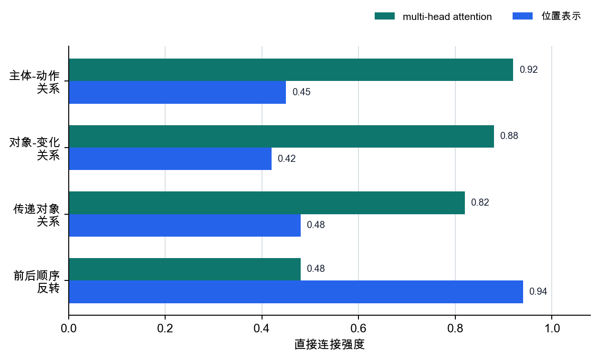

# P6-4.3 补充学习：attention head 与位置表示

> Section ID: `P6-4.3`
> Version: `v2026.07.23`

_副标题：multi-head attention 和位置表示如何分别补强上下文关系与顺序信息？_

在 P6-4.1 中，我们看到了 Transformer 块的大结构；在 P6-4.2 中，我们看到了 attention 只在 context window 内工作。但读到这里时，常常又会被两个名称卡住。

Transformer 如何同时读取词元之间的关系和顺序？

回答这个问题时要抓住的名称，是 `multi-head attention` 和 `位置表示(position encoding)`。

这里把二者放在 `补强上下文读取方式`这一组中说明。重复生成速度、长上下文计算负担、long-context 设计，则是和上下文读取本身不同层位的问题。

## 上下文位置与 attention 的作用

- multi-head attention 为什么要设置多个 head？
- 为什么需要位置表示？
- 为什么这两个名称看起来像同一层位，但实际作用不同？

这里首先要收束的问题是：`模型读取上下文时，到底补强了什么`。

| 现在处理的内容 | 后面会扩展的问题 |
| --- | --- |
| 让模型不只用一种视线看多种关系的 multi-head attention | 长对话中为什么速度会变慢 |
| 另行提供顺序的位置表示 | sparse attention、long-context、serving 优化 |
| 区分 `关系读取`和 `顺序读取`的最小标准 | 实际模型的实现差异与长上下文优化比较 |

抓住这个区分之后，KV cache、sparse attention、long-context 才能分别读成 `重复生成速度`、`计算负担`、`长输入保持`问题，而不是读成 `上下文读取本身`。

## 为什么先把二者放在一起看

第一次阅读时，`multi-head attention` 和 `位置表示` 都像是 Transformer 内部部件名称。这时最稳妥的区分方式如下。

- multi-head attention 更接近于 `要从多个视角看哪些关系`。
- 位置表示更接近于告诉模型 `这种关系发生在什么顺序上`。

也就是说，一个是 `关系读取方式`，另一个是 `顺序信息供应方式`。

如果没有这个标准，就容易产生 `既然有多个 head，顺序也会自动知道吧`这样的误解。但提供顺序的问题，和从多个角度读取关系的问题，并不是同一个问题。

## 为什么要设置多个 head

如果只有一个 attention，模型就会用一种比较规则看所有关系。但在实际句子中，常常会同时出现只靠一种视线不够处理的关系。

例如：

`他读完报告，修改之后，又发给了组长。`

阅读这句话时，至少下面的关系会同时变得重要。

- `他`做了什么动作
- `报告`发生了什么变化
- `发给组长`这个接收对象连接到哪里
- `读完 -> 修改之后 -> 发给`的顺序如何延续

把 multi-head attention 极度简化后，可以理解为：`不要把这些关系混在一个篮子里，而是用多个视角分开看`。

| 句子中的关系 | 只用一个标准看时容易产生的混乱 | 为什么会感觉需要多个视角 |
| --- | --- | --- |
| `他`和 `读完/发给`的动作主体关系 | 动作顺序和对象可能混在一起 | 必须分开追踪谁做了什么 |
| `读完报告，修改之后`中的对象/修改关系 | `修改`到底是人的动作还是报告状态会变模糊 | 必须分离对象变化和动作顺序 |
| `发给了组长`的传递关系 | 前面的动作和接收对象混成一团 | 必须同时保持接收对象和前一动作 |

这里读者要抓住的核心不是 `一个 head 能完美读取整句话的全部关系`，而是 `不同关系轴需要用多个视角分开看`。

## 为什么需要位置表示

如果词元只以向量形式存在，模型不会自动知道 `这个词元是在前面还是后面`。因此需要另行供应顺序信息的装置。

这个点在非常短的例子中也会显现。

- `猫追狗`
- `狗追猫`

出现的词几乎相同，但顺序一变，意思也会改变。没有单独提供顺序信息时，模型就难以稳定地区分 `哪个词元先出现`。

所以会附加位置表示(position encoding 或 positional information)。

这个阶段先留下的判断标准如下。

- attention 计算相关度
- 位置表示告诉模型，这种相关度发生在怎样的顺序上

RoPE、ALiBi 这样的名称，是处理位置信息的不同方式。初学时，与其把名称全部背下来，不如先抓住一点：`Transformer 不是自动知道顺序的`。

## 位置信息和 attention 共同改变什么

把 multi-head attention 和位置表示放在一起看，就更容易看出模型读取上下文时需要两类补强。

| 现在要抓住的名称 | 先想起的问题 | 作用 |
| --- | --- | --- |
| multi-head attention | `哪些关系要从多个角度读取？` | 避免只用一种视线看关系 |
| 位置表示 | `模型怎样知道这个词元在前还是在后？` | 另行供应顺序信息 |

也就是说，multi-head attention 让模型更丰富地看见 `什么和什么有关`，位置表示则让模型不漏掉 `这种关系发生在什么顺序上`。

下面的图压缩了这两种补强在同一个 Transformer 流程中接在哪里。位置信息提供词元的顺序线索，multi-head attention 让多个关系轴分开被读取，二者一起让上下文表示更稳定。

```mermaid
--8<-- "assets/part-06/chapter-04/p6-c04-s03-attention-position-flow-zh.mmd"
```

只说 `二者都重要`，这个差异可能不容易留下。更直接的方式，是同时看 `缺少其中一边时会留下哪种误解`。

| 先想象缺少的一边 | 阅读句子时留下的空白 | 实际容易产生的误解 |
| --- | --- | --- |
| multi-head attention 感觉较弱 | 难以把谁和谁连接的多个关系轴分开看 | 主体、对象、传递关系可能混成一团，使 `谁做了什么`变得模糊。 |
| 位置表示感觉较弱 | 难以稳定区分相同词语处在什么前后顺序 | 词集合相似但事件顺序或角色不同的句子，容易被读成相同意思。 |
| 把二者混成同一个问题 | 难以分别修正关系分离问题和顺序信息问题 | `head 多了，顺序也会自动知道吧`这样的误解会留下，补强了什么、为什么补强又被压缩。 |

## 案例和示例

### 案例 1. 多种关系重叠在一个句子中

阅读长句时，人会同时看主语-动作关系、对象变化、接收对象、时间顺序。但如果只用一种相关度来读，谁连接到谁就容易混在一起。

例如 `他读完报告，修改之后，又发给了组长`中，`他`做的动作、`报告`的状态变化、`发给组长`这个接收对象同时重要。如果只用一种视线看这些关系，主体、对象、传递关系就会被压成一团。

这个案例要确认的结果是：在一个句子内部，也能否实际看见分开读取不同关系轴的必要性。一旦这个必要性可见，multi-head attention 就不再只是 `部件名称`，而可以理解为 `让不同关系轴通过多个视角被读取的补强`。

### 案例 2. 词语相似但顺序改变的情况

`猫追狗`和 `狗追猫`出现的词语相似，但意思不同。人能区分二者，是因为不只读词本身，也一起读顺序。

即使同样的词元存在，如果不能另行知道 `哪个词元先出现`，就很难稳定地区分主语和对象反转的句子。这个案例要确认的结果是：即使词集合相同，只要缺少顺序信息，意义也会摇晃。

把两个案例放在一起，常见误解也会被整理出来。很容易觉得 `head 多了，顺序也会自动读好吧`，但多个视角和顺序信息并不是同一个问题。即使能从多个角度看句子中的关系，如果不能另行知道这些关系发生在什么顺序上，解释仍然会摇晃。

反过来，即使有顺序信息，如果所有关系都只用一个标准看，主体关系和接收对象关系仍可能混在一起。所以要把 `multi-head attention` 读成分离关系轴的一侧，把 `位置表示`读成供应顺序信息的一侧。这里要确认的结果是：能否把 `关系读取`和 `顺序读取`区分为两个不同的补强问题。

## 卡住时重新看的判断标准

一开始，这两个名称都像 Transformer 内部部件，所以很容易作为一团来背。这时与其背更长的定义，不如先区分当前卡住的问题是在 `关系读取`一侧，还是在 `顺序读取`一侧。

| 现在卡住的场景 | 先提出的问题 | 更直接连接的内容 |
| --- | --- | --- |
| 一个句子里 `谁`、`什么`、`给谁`多层纠缠 | `如果只用一种视线看这些关系，什么会混在一起？` | multi-head attention |
| 几乎相同的词语出现，但前后调换后意思改变 | `这个差异最终是不是顺序改变？` | 位置表示 |
| 长句中既不能漏掉主体关系，也不能弄错事件顺序 | `现在需要的是关系分离、顺序信息，还是二者都需要？` | 二者都需要 |

这张表的目的不是让人更快背下两个术语。它的作用是，在阅读真实句子时先区分：`现在是模型没能分开多种关系的问题`，还是 `现在是顺序容易另行丢失的问题`。



## 练习和示例

请先看下面两句话，然后自己填写表格中的空白。

- `敏洙修改报告后发给了智妍`
- `智妍修改报告后发给了敏洙`

| 直接标出的内容 | 第 1 句 | 第 2 句 |
| --- | --- | --- |
| 动作主体 |  |  |
| 对象 |  |  |
| 传递对象 |  |  |
| 共同动作流程 |  |  |
| 意义改变的决定性位置 |  |  |

确认后可以看到，第 1 句的动作主体是 `敏洙`，传递对象是 `智妍`。第 2 句相反，动作主体是 `智妍`，传递对象是 `敏洙`。两句话的对象都是 `报告`，共同动作流程是 `修改后 -> 发给`。

multi-head attention 的感觉，体现在把 `动作主体`、`对象`、`传递对象`、`动作流程`等多个关系轴分开看。位置表示的感觉，则体现在根据 `敏洙`和 `智妍`在句子中的位置，抓住主体和接收者会互换。这个练习的目的不是背答案，而是在阅读真实句子时，亲手分开 `什么是关系轴问题`和 `什么是顺序信息问题`。

## 检查清单

- multi-head attention 是让关系通过多个视角被读取的装置。
- 位置表示是另行供应顺序信息的装置。
- 从多个角度看关系，与知道顺序，并不是同一个问题。
- 不应认为 Transformer 会自动知道顺序。
- 应该能够说明，在上下文读取结构之上，`重复生成速度`、`计算负担`、`长输入保持`问题会作为不同层位出现。

## 来源和参考资料

- Ashish Vaswani et al., [Attention Is All You Need](https://papers.nips.cc/paper_files/paper/2017/hash/3f5ee243547dee91fbd053c1c4a845aa-Abstract.html){: target="_blank" rel="noopener noreferrer" }, NeurIPS 2017, 确认日期：2026-07-19。作为确认 multi-head attention 和 positional encoding 是 Transformer 基本构成要素的依据。
- Jianlin Su et al., [RoFormer: Enhanced Transformer with Rotary Position Embedding](https://arxiv.org/abs/2104.09864){: target="_blank" rel="noopener noreferrer" }, arXiv 2021, 确认日期：2026-07-19。作为说明 RoPE 是把 positional information 结合到 self-attention formulation 中的位置表示方式的依据。
- Ofir Press, Noah A. Smith, Mike Lewis, [Train Short, Test Long: Attention with Linear Biases Enables Input Length Extrapolation](https://arxiv.org/abs/2108.12409){: target="_blank" rel="noopener noreferrer" }, arXiv 2021, 确认日期：2026-07-19。作为说明 ALiBi 是向 attention score 添加基于位置距离 bias 的方法的依据。
