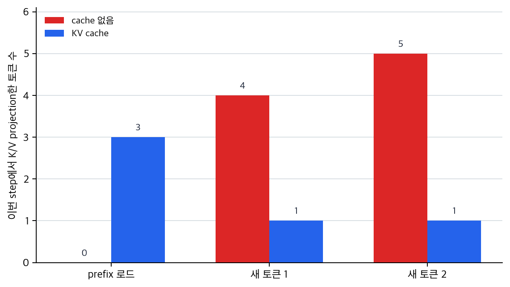
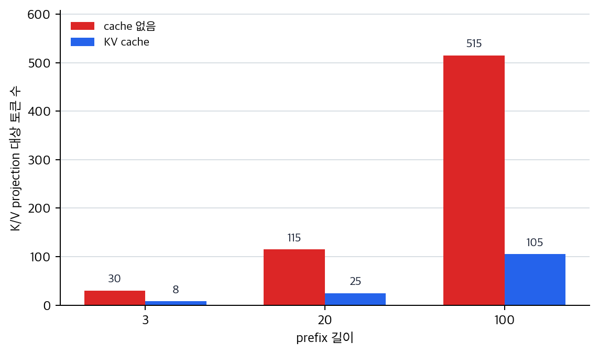

# P6-4.4 보충학습: KV cache와 반복 생성

> Section ID: `P6-4.4`
> Version: `v2026.07.23`

_보조제목: KV cache는 반복 생성에서 어떤 attention 계산을 다시 쓰는가_

P6-4.2에서는 attention과 context window가 입력 범위 제한과 연결된다는 점을 보았고, P6-4.3에서는 multi-head attention과 위치 표현이 문맥 읽기 방식에 어떤 보강을 하는지 정리했습니다. 이제 다음으로 자주 막히는 이름은 `KV cache`입니다.

왜 긴 대화나 긴 생성에서는 같은 구조라도 점점 느려지는가?

이 질문을 풀 때 기준이 되는 것은 `이전 계산 일부를 다시 쓰는가`라는 관점입니다. 여기서는 KV cache를 그 재사용 장치로 읽습니다.

## KV cache가 재사용하는 계산

- KV cache는 왜 대화형 생성 속도와 연결되는가?
- KV cache는 모델의 뜻을 바꾸는 장치인가, 반복 계산을 줄이는 장치인가?
- context window가 길어질수록 KV cache가 왜 더 중요해지는가?

여기서 먼저 닫을 문제는 `반복 생성에서 이미 계산한 앞부분을 어떻게 다시 쓰는가`입니다.

| 지금 다루는 것 | 뒤 장이나 뒤 Part로 넘기는 것 |
| --- | --- |
| 이전 계산 일부를 저장해 다음 step에서 다시 쓰는 KV cache의 기본 뜻 | 실제 서빙 엔진별 캐시 관리 방식 |
| 같은 결과를 유지하면서 projection 부담을 줄인다는 감각 | 운영 지연 시간과 비용 최적화 판단 |

context window 제약 자체는 본류인 P6-4.2에서 이미 설명했고, KV cache가 운영 지연 시간과 비용에 미치는 영향은 P6-17.1에서 다시 회수합니다. 긴 문맥 자체를 더 잘 유지하는 문제와 sparse attention은 별도의 장문맥 설계 문제입니다.

이 구분이 잡혀야 KV cache를 `답의 뜻을 바꾸는 기능`이 아니라 `같은 결과를 더 적은 재계산으로 만드는 장치`로 읽을 수 있습니다. 긴 대화나 긴 코드 생성에서 KV cache가 체감 속도와 연결되는 이유도 이 기준에서 설명됩니다.

## KV cache는 왜 중요한가

대화형 생성에서는 한 토큰을 만들고, 다시 다음 토큰을 만듭니다. 이때 이전 계산을 매번 처음부터 다시 하면 매우 비효율적입니다.

KV cache는 앞에서 계산한 일부 attention 관련 값을 재사용해, 다음 토큰 생성 때 속도를 높이는 장치로 이해하면 됩니다.

이 기준을 한 줄로 줄이면 다음과 같습니다.

`같은 결과를 유지하면서 무엇을 다시 계산하지 않을 것인가?`

context window가 길수록 반복 생성 부담도 커지기 때문에, KV cache는 특히 긴 대화나 긴 코드 생성에서 체감 속도와 연결되기 쉽습니다.

이 설명은 생활 장면으로 바꾸면 더 선명해집니다. 긴 메신저 대화에서 답장을 이어 쓰거나, 긴 코드 파일을 보며 다음 줄을 계속 생성할 때 사람은 보통 `이미 앞에서 본 내용은 계속 기억한 채 이어 간다`고 느낍니다. 그래서 응답도 대체로 비슷한 속도로 이어질 것이라고 기대하기 쉽습니다. 그런데 모델이 새 토큰 하나를 만들 때마다 앞에서 본 토큰들을 다시 처음부터 모두 같은 방식으로 계산한다면, 대화가 길어질수록 다음 한 토큰을 만드는 부담도 같이 커집니다.

즉, KV cache를 처음 읽을 때는 다음처럼 붙잡으면 됩니다.

- `새 토큰을 만들 때 앞부분을 완전히 처음부터 다시 계산하는가?`
- 아니면 `앞에서 이미 계산한 일부를 저장해 두고 새로 필요한 부분만 더하는가?`

KV cache는 두 번째 쪽에 가깝습니다. 핵심은 `뜻을 바꾸는 새 지능`보다 `이미 본 앞부분 계산을 다시 하지 않게 만드는 재사용 장치`라는 점입니다.

이 기준이 있어야 KV cache를 `모델이 더 잘 이해하게 만드는 기능`으로 오해하지 않게 됩니다. 먼저 봐야 할 것은 `답이 더 똑똑해지는가`가 아니라 `같은 답을 만드는 과정에서 반복 계산이 얼마나 줄어드는가`입니다.

## 무엇이 바뀌고 무엇은 안 바뀌나

KV cache를 처음 읽을 때 가장 중요한 구분은 `모델이 더 똑똑해지는가`와 `같은 계산을 덜 반복하는가`를 나누는 일입니다.

KV cache가 먼저 바꾸는 것은 답의 뜻이나 추론 능력이 아니라, 같은 답을 내기까지 드는 반복 계산의 양입니다. 긴 대화일수록 이전 토큰 수가 늘어나기 때문에, 앞부분을 매번 다시 key와 value로 투영하면 새 토큰 하나를 만들 때마다 부담이 커집니다. 캐시는 이 앞부분 계산을 저장해 두고, 새로 붙은 토큰에 필요한 계산만 더하는 쪽으로 흐름을 바꿉니다.

그래서 `KV cache를 켜면 답이 더 정확해지는가`, `갑자기 더 영리한 추론을 하는가`, `끄면 답이 틀리고 켜면 답이 맞는가` 같은 질문은 핵심에서 조금 벗어납니다. 더 안전한 기준은 `답의 내용`과 `답을 만들기까지의 반복 작업량`을 분리해 보는 것입니다.

즉, KV cache를 이해할 때는 `무슨 답이 나왔는가`와 함께 `그 답을 만들기 위해 앞부분을 몇 번 다시 계산했는가`를 같이 봐야 합니다.

## 왜 context window가 길수록 체감 차이가 커지나

KV cache가 긴 문맥에서 특히 중요하다고 말할 때, 종종 `긴 문맥이면 원래 다 느린 것 아닌가` 정도로만 받아들입니다. 하지만 여기에는 더 구체적인 이유가 있습니다.

문맥이 짧을 때는 앞에서 본 토큰 수 자체가 많지 않아서, 앞부분을 다시 계산해도 부담이 상대적으로 작을 수 있습니다. 반대로 대화가 길어지거나 긴 코드 생성이 이어지면, 새 토큰 하나를 만들 때마다 `이미 지나온 앞부분`의 크기도 같이 커집니다. 이때 캐시가 없으면 `앞에서 이미 본 긴 prefix`를 새 토큰마다 계속 다시 계산하는 모양이 됩니다.

이 차이는 다음처럼 이해할 수 있습니다.

- 짧은 문맥: 다시 계산하는 앞부분이 아직 짧다
- 긴 문맥: 다시 계산하는 앞부분이 이미 길다
- 그래서 긴 문맥일수록 `앞부분을 다시 안 하는가`의 체감 차이가 더 커진다

즉, context window가 길수록 KV cache가 중요하다는 말은 `긴 입력을 더 잘 이해한다`는 뜻보다, `이미 본 긴 앞부분을 반복해서 다시 계산하지 않게 해 주는 가치가 커진다`는 뜻에 더 가깝습니다.

## 사례 및 예시

### 사례 1. 채팅형 코딩 도우미가 점점 느려지는 경우

같은 코드 파일을 두고 여러 턴을 이어 가는 코딩 도우미를 생각해 보겠습니다. 사람은 같은 파일을 계속 보고 있으니 다음 답도 비슷한 속도로 이어지길 기대합니다. 하지만 이전 토큰 관계를 매번 처음부터 다시 계산하면, 턴이 길어질수록 응답 지연이 눈에 띄게 커질 수 있습니다.

첫 답변을 만들 때는 앞 문맥이 짧아서 큰 차이를 느끼지 못할 수 있습니다. 하지만 파일 설명, 함수 수정, 테스트 실패 로그, 다시 수정 요청이 몇 턴 쌓이면 `지금 새 답변 하나를 만들기 전에 이미 지나온 앞부분`이 길어집니다. 캐시가 없으면 그 긴 앞부분을 다음 토큰마다 다시 계산해야 하고, 캐시가 있으면 이미 계산해 둔 앞부분은 저장해 두고 새로 필요한 부분만 더합니다.

이 사례에서 확인할 결과는 `대화가 길어질수록 캐시 재사용 여부가 체감 지연 시간 차이로 드러나는가`입니다. 붙잡아야 할 기준은 `대화가 길어지는데 왜 점점 느려지는가`를 `모델이 피곤해진다`처럼 읽지 않고, `이미 본 앞부분을 새 토큰마다 또 계산하는가`라는 질문으로 바꾸는 것입니다.

### 사례 2. 긴 문서를 바탕으로 초안 생성이 이어질 때

긴 정책 문서를 넣고 요약 초안을 만들고, 다시 그 초안을 다듬고, 이어서 예외 조항만 다시 설명하게 하는 장면을 떠올려 보겠습니다. 같은 문서를 보고 계속 답하니 속도도 대체로 비슷할 것이라고 기대하기 쉽습니다. 하지만 앞에서 본 토큰을 매번 다시 처음부터 계산하면, 문맥이 길수록 다음 step의 부담도 같이 커집니다.

초안 생성이 한 번으로 끝나지 않고 `요약 -> 다듬기 -> 특정 예외 다시 설명`처럼 이어지면, 실제로는 비슷한 긴 앞문맥을 여러 step에서 계속 참고하게 됩니다. 이때 중요한 것은 `문서를 오래 참고하니 더 똑똑해지는가`가 아니라 `같은 긴 앞문맥을 반복해서 다시 계산하지 않게 해 주는가`입니다.

이 사례에서 확인할 결과는 `같은 문맥을 계속 이어 쓸수록 재사용 장치가 왜 더 중요해지는가`입니다. KV cache의 실용 가치는 긴 문서를 한 번 넣는 순간보다, 그 문맥 위에서 생성이 여러 step 누적될 때 더 또렷하게 드러납니다.

## 실패 장면에서 다시 보는 기준

지금까지의 설명을 더 단단하게 만들려면, KV cache가 막으려는 실패 장면을 함께 보는 편이 좋습니다.

| 먼저 눈에 띄는 실패 장면 | KV cache 관점에서 다시 읽을 질문 | 왜 중요한가 |
| --- | --- | --- |
| 대화가 길어질수록 답이 점점 늦어진다 | `앞에서 본 긴 prefix를 새 토큰마다 또 계산하는가?` | 반복 계산이 누적되기 때문 |
| 긴 코드 생성에서 앞부분이 길수록 다음 줄 생성이 버벅인다 | `이미 계산한 앞부분을 저장해 두고 있는가?` | 새 줄마다 앞문맥 재계산 부담이 커지기 때문 |
| 긴 문서 초안 수정이 이어질수록 속도가 떨어진다 | `같은 문맥을 계속 이어 쓸 때 재사용 장치가 있는가?` | 비슷한 긴 문맥을 여러 step에서 다시 보기 때문 |

이 표의 목적은 모든 속도 문제를 KV cache 하나로 설명하려는 것이 아닙니다. 다만 `길어질수록 느려진다`는 현상을 봤을 때, 먼저 `이미 본 앞부분을 반복해서 다시 계산하는 구조인가`를 떠올릴 수 있게 만드는 데 있습니다.

## 연습 및 예제

이 예제의 목표는 `KV cache가 실제로 무엇을 저장하고, 생성이 길어질수록 얼마나 많은 재계산을 막는가`를 보이는 것입니다. 토큰 ID를 작은 임베딩과 query/key/value 투영에 통과시켜, 마지막 토큰의 attention 결과가 캐시 유무와 상관없이 같게 나오면서도 재투영량은 어떻게 줄어드는지 확인합니다. 이어서 prefix 길이를 바꿨을 때 절감 폭이 어떻게 달라지는지도 같이 봅니다.

핵심 비교는 다음입니다.

- 캐시가 없으면 새 토큰을 만들 때마다 지금까지의 모든 토큰을 다시 K/V로 바꿉니다.
- 캐시가 있으면 이전 토큰의 K/V는 저장해 두고, 새 토큰의 K/V만 추가합니다.
- 두 방식의 마지막 attention 출력은 같아야 합니다. 달라지는 것은 `얼마나 다시 계산했는가`입니다.

아래 코드는 이미 본 prefix 토큰과 새로 이어서 생성할 토큰을 사용합니다. 결과에서는 캐시 없이 각 step에서 다시 계산한 K/V 행렬 shape와 마지막 토큰 attention 결과, 캐시를 쓸 때 유지되는 K/V cache shape와 마지막 토큰 attention 결과, 두 방식의 step별 projection 대상 토큰 수, 총 projection 대상 토큰 수와 절감 비율, prefix 길이를 바꿨을 때 재투영 절감 비율이 어떻게 변하는지를 함께 확인합니다.

확인할 핵심은 KV cache가 이전 토큰의 계산 결과를 재사용해 이후 step의 projection 부담을 줄인다는 점입니다. 캐시 유무에 따라 attention 결과가 달라지는 것이 아니라, 같은 결과를 만들기까지 다시 투영하는 토큰 수가 달라집니다. prefix가 길거나 생성 step이 많아질수록 `앞부분을 다시 계산하지 않는 효과`가 더 크게 드러납니다.

아래 도식은 이 예제가 비교하려는 계산 흐름을 먼저 압축한 것입니다. 캐시가 없으면 새 토큰을 만들 때마다 앞부분을 다시 K/V로 바꾸지만, KV cache가 있으면 이미 본 prefix의 K/V는 저장해 두고 새 토큰의 K/V만 추가합니다.

```mermaid
--8<-- "assets/part-06/chapter-04/p6-c04-s04-kv-cache-flow-ko.mmd"
```

```python
# KV cache 없이 매번 다시 투영하는 방식과 cache로 이전 K/V를 재사용하는 방식의 projection 부담을 비교하는 예제입니다.
import numpy as np

token_to_id = {
    "사용자": 0,
    "로그인": 1,
    "오류": 2,
    "재현": 3,
    "완료": 4,
}

embedding_table = np.array(
    [
        [1.0, 0.2, 0.0],
        [0.5, 1.0, 0.1],
        [1.2, 0.8, 0.4],
        [0.3, 1.1, 0.9],
        [0.7, 0.4, 1.3],
    ]
)

W_k = np.array(
    [
        [0.8, 0.1],
        [0.2, 0.7],
        [0.5, 0.6],
    ]
)

W_v = np.array(
    [
        [0.3, 0.9],
        [0.6, 0.2],
        [0.4, 0.8],
    ]
)

W_q = np.array(
    [
        [0.7, 0.2],
        [0.1, 0.8],
        [0.6, 0.5],
    ]
)

prefix_token_ids = [token_to_id["사용자"], token_to_id["로그인"], token_to_id["오류"]]
generated_token_ids = [token_to_id["재현"], token_to_id["완료"]]

def project_to_kv(token_ids):
    embeddings = embedding_table[token_ids]
    keys = embeddings @ W_k
    values = embeddings @ W_v
    return keys, values

def project_query(token_id):
    embedding = embedding_table[[token_id]]
    return embedding @ W_q

def attention_for_last_token(query, keys, values):
    scores = (query @ keys.T) / np.sqrt(keys.shape[1])
    shifted = scores - np.max(scores)
    weights = np.exp(shifted) / np.sum(np.exp(shifted))
    context = weights @ values
    return weights, context

def decode_without_cache(prefix_ids, new_ids):
    seen_ids = prefix_ids[:]
    projected_token_count = 0
    step_logs = []

    for new_id in new_ids:
        seen_ids.append(new_id)
        keys, values = project_to_kv(seen_ids)
        query = project_query(new_id)
        weights, context = attention_for_last_token(query, keys, values)
        projected_token_count += len(seen_ids)
        step_logs.append((new_id, len(seen_ids), keys, values, weights, context))

    return step_logs, projected_token_count

def decode_with_cache(prefix_ids, new_ids):
    cached_keys, cached_values = project_to_kv(prefix_ids)
    projected_token_count = len(prefix_ids)
    step_logs = [
        (
            "prefix_loaded",
            len(prefix_ids),
            cached_keys.copy(),
            cached_values.copy(),
            None,
            None,
        )
    ]

    for new_id in new_ids:
        new_keys, new_values = project_to_kv([new_id])
        cached_keys = np.vstack([cached_keys, new_keys])
        cached_values = np.vstack([cached_values, new_values])
        query = project_query(new_id)
        weights, context = attention_for_last_token(query, cached_keys, cached_values)
        projected_token_count += 1
        step_logs.append((new_id, 1, cached_keys.copy(), cached_values.copy(), weights, context))

    return step_logs, projected_token_count

def projection_counts(prefix_length, generated_length):
    no_cache_count = sum(prefix_length + step for step in range(1, generated_length + 1))
    with_cache_count = prefix_length + generated_length
    saved_ratio = 1 - (with_cache_count / no_cache_count)
    return no_cache_count, with_cache_count, saved_ratio

no_cache_logs, no_cache_count = decode_without_cache(prefix_token_ids, generated_token_ids)
with_cache_logs, with_cache_count = decode_with_cache(prefix_token_ids, generated_token_ids)
saved_ratio = round(1 - (with_cache_count / no_cache_count), 3)

print("[without cache]")
for token_id, projected_now, keys, values, weights, context in no_cache_logs:
    print("new_token_id =", token_id)
    print("projected_now =", projected_now)
    print("keys_shape =", keys.shape, "values_shape =", values.shape)
    print("attention_weights =", np.round(weights, 3))
    print("context =", np.round(context, 3))
    print("last_key_row =", np.round(keys[-1], 2))
    print("last_value_row =", np.round(values[-1], 2))

print("[with cache]")
for token_id, projected_now, keys, values, weights, context in with_cache_logs:
    print("step =", token_id)
    print("projected_now =", projected_now)
    print("keys_shape =", keys.shape, "values_shape =", values.shape)
    if token_id != "prefix_loaded":
        print("attention_weights =", np.round(weights, 3))
        print("context =", np.round(context, 3))
        print("last_key_row =", np.round(keys[-1], 2))
        print("last_value_row =", np.round(values[-1], 2))

print("step_output_match_1 =", np.allclose(no_cache_logs[0][5], with_cache_logs[1][5]))
print("step_output_match_2 =", np.allclose(no_cache_logs[1][5], with_cache_logs[2][5]))

print("no_cache_projected_token_count =", no_cache_count)
print("with_cache_projected_token_count =", with_cache_count)
print("saved_ratio =", saved_ratio)

print("[projection count by prefix length]")
for prefix_length in [3, 20, 100]:
    no_cache_total, with_cache_total, ratio = projection_counts(
        prefix_length=prefix_length,
        generated_length=5,
    )
    print(
        f"prefix_length={prefix_length}, generated_length=5, "
        f"without_cache={no_cache_total}, with_cache={with_cache_total}, "
        f"saved_ratio={ratio:.3f}"
    )
```

아래 출력은 로컬 `.venv`의 Python 실행으로 본문 코드와 같은 값을 확인했습니다.

실행 결과 예시는 다음처럼 읽을 수 있습니다.

```text
[without cache]
new_token_id = 3
projected_now = 4
keys_shape = (4, 2) values_shape = (4, 2)
attention_weights = [[0.121 0.189 0.317 0.373]]
context = [[0.931 1.197]]
last_key_row = [0.91 1.34]
last_value_row = [1.11 1.21]
new_token_id = 4
projected_now = 5
keys_shape = (5, 2) values_shape = (5, 2)
attention_weights = [[0.095 0.124 0.252 0.24  0.289]]
context = [[0.937 1.369]]
last_key_row = [1.29 1.13]
last_value_row = [0.97 1.75]
[with cache]
step = prefix_loaded
projected_now = 3
keys_shape = (3, 2) values_shape = (3, 2)
step = 3
projected_now = 1
keys_shape = (4, 2) values_shape = (4, 2)
attention_weights = [[0.121 0.189 0.317 0.373]]
context = [[0.931 1.197]]
last_key_row = [0.91 1.34]
last_value_row = [1.11 1.21]
step = 4
projected_now = 1
keys_shape = (5, 2) values_shape = (5, 2)
attention_weights = [[0.095 0.124 0.252 0.24  0.289]]
context = [[0.937 1.369]]
last_key_row = [1.29 1.13]
last_value_row = [0.97 1.75]
step_output_match_1 = True
step_output_match_2 = True
no_cache_projected_token_count = 9
with_cache_projected_token_count = 5
saved_ratio = 0.444
[projection count by prefix length]
prefix_length=3, generated_length=5, without_cache=30, with_cache=8, saved_ratio=0.733
prefix_length=20, generated_length=5, without_cache=115, with_cache=25, saved_ratio=0.783
prefix_length=100, generated_length=5, without_cache=515, with_cache=105, saved_ratio=0.796
```

이 예제에서 읽어야 할 핵심은 다음입니다.

- 두 방식 모두 같은 step의 `attention_weights`와 `context`가 일치합니다.
- 즉, KV cache는 마지막 attention 결과를 바꾸려는 장치가 아니라 `같은 결과를 더 적은 재계산으로 만들려는 장치`입니다.
- 차이는 `앞에서 본 prefix 토큰의 K/V를 다시 투영했는가`에 있습니다.
- 캐시가 없으면 첫 새 토큰에서는 4개, 다음 토큰에서는 5개를 다시 투영하지만, 캐시가 있으면 새 토큰마다 1개만 추가 투영합니다.
- 같은 5개 토큰을 이어 생성해도 prefix가 3개일 때보다 20개, 100개일 때 `without_cache`와 `with_cache`의 차이가 훨씬 커집니다.
- 그래서 prefix가 길어지거나 생성 step이 많아질수록 `projected_token_count` 차이가 빠르게 커집니다.



prefix 길이에 따른 재투영량 차이를 그림으로 보면 아래처럼 벌어집니다. 캐시가 없을 때는 이미 본 prefix가 길수록 새 토큰 생성마다 다시 투영해야 할 양이 빠르게 늘고, KV cache를 쓰면 같은 조건에서도 증가 폭이 훨씬 작아집니다.



여기서는 숫자 자체보다 비교 방향을 읽는 편이 더 중요합니다.

- `같은 context가 나왔는가?`
- `다시 계산한 토큰 수는 얼마나 달라졌는가?`
- `앞문맥이 더 길어지면 이 차이가 더 커질 것 같은가?`
- `generated_length`를 5에서 20으로 바꾸면 절감 비율과 총 재투영량은 어떻게 달라지는가?

이 질문들에 답할 수 있으면, KV cache를 `모델 내부의 어려운 이름`으로만 보지 않고 `긴 생성에서 같은 앞부분을 다시 계산하지 않게 만드는 실용 장치`로 읽기 시작한 것입니다.

## 체크리스트

- KV cache는 긴 생성에서 반복 계산 비용을 줄이기 위한 실용 장치입니다.
- KV cache는 모델 뜻을 바꾸기보다 같은 결과를 더 적은 재계산으로 만드는 장치입니다.
- 긴 대화와 긴 코드 생성처럼 문맥이 누적될수록 KV cache의 체감 가치가 커집니다.
- KV cache와 장문맥 설계 문제를 `재사용으로 줄이는 계산`과 `긴 입력에서 유지해야 하는 단서`로 구분할 수 있어야 합니다.

## 출처와 참고 자료

- Ashish Vaswani et al., [Attention Is All You Need](https://papers.nips.cc/paper_files/paper/2017/hash/3f5ee243547dee91fbd053c1c4a845aa-Abstract.html){: target="_blank" rel="noopener noreferrer" }, NeurIPS 2017, 확인 날짜: 2026-07-19. attention의 query, key, value 계산을 KV cache 설명의 기본 배경 근거로 사용했다.
- Hugging Face, [Cache strategies](https://huggingface.co/docs/transformers/kv_cache){: target="_blank" rel="noopener noreferrer" }, Transformers documentation, 확인 날짜: 2026-07-19. autoregressive generation에서 key-value vectors를 저장해 재계산을 줄이고 generation 성능을 높인다는 설명의 근거로 사용했다.
