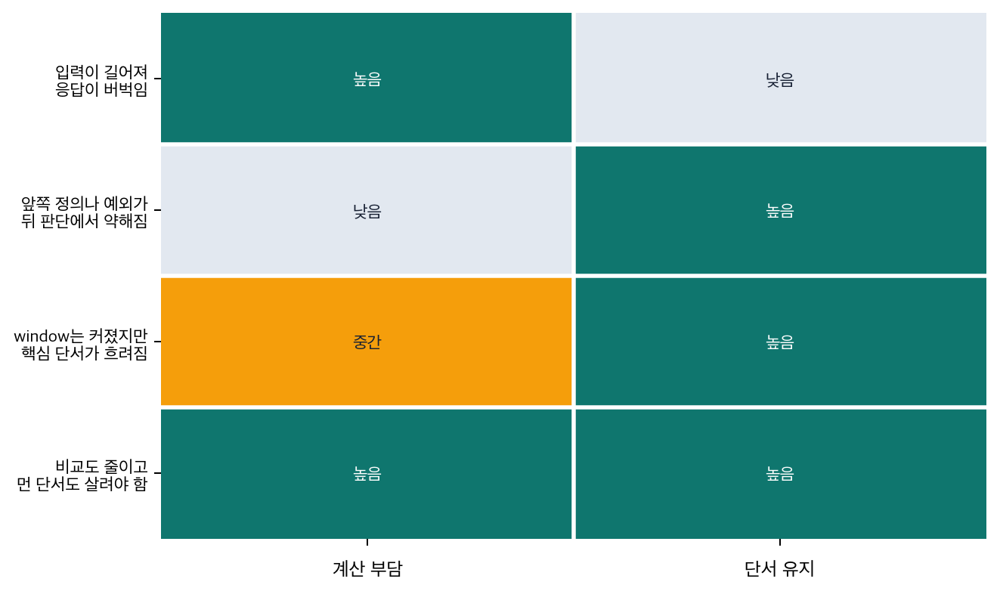

# P6-4.5 보충학습: 긴 문맥과 희소 attention

> Section ID: `P6-4.5`
> Version: `v2026.07.23`

_보조제목: sparse attention과 long-context는 계산 부담과 단서 보존을 어떻게 나누는가_

P6-4.2에서는 attention과 context window가 입력 범위 제한과 연결된다는 점을 보았고, P6-4.4에서는 KV cache가 반복 생성에서 무엇을 다시 계산하지 않을 것인가를 다루는 장치라는 점을 정리했습니다. 이제 남는 질문은 다른 쪽입니다.

긴 입력을 다루려면 정말 모든 연결을 다 유지해야 하는가?

이 질문을 따라 읽을 때 자주 나오는 이름이 `sparse attention`과 `long-context`입니다. 둘 다 긴 입력 문제와 연결되지만, 같은 기술 이름은 아닙니다. 여기서는 `장문맥 계산과 유지 문제`라는 큰 배경 안에서, `연결 수를 어떻게 줄일 것인가`와 `긴 문맥에서 핵심 단서를 어떻게 끝까지 유지할 것인가`를 다른 층위로 나눠 읽습니다.

## 장문맥에서 남는 계산 부담

- sparse attention은 무엇을 줄이려는 방향인가?
- long-context는 왜 별도 이름으로 자주 불리는가?
- 두 이름은 왜 같은 기술명이 아니라 `연결 수 조절`과 `장문맥 설계 전체`라는 서로 다른 층위의 문제를 가리키는가?

여기서 먼저 닫을 문제는 `긴 입력 문제`를 한 단어로 뭉개지 않고, 계산 부담과 단서 유지라는 두 질문으로 갈라 놓는 일입니다.

| 지금 다루는 것 | 뒤 장이나 뒤 Part로 넘기는 것 |
| --- | --- |
| 모든 연결을 같은 밀도로 보지 않으려는 sparse attention 방향 | 구체 아키텍처 비교와 최신 벤치마크 경쟁 |
| 긴 입력에서도 앞 단서를 뒤까지 유지하려는 long-context 문제 | 실제 RAG, 운영 정책, 장문맥 제품 설계 선택 |

이 구분이 잡혀야 sparse attention을 `모든 연결을 같은 밀도로 유지하지 않으려는 방향`으로, long-context를 `긴 입력을 실제로 유지하고 다시 참고하려는 전체 설계 문제`로 따로 설명할 수 있습니다.

## sparse attention은 무엇을 줄이려 하나

기본 self-attention을 아주 단순하게 읽으면, 각 토큰이 다른 많은 토큰과 관련도를 계산합니다. 문맥이 길어질수록 이 비교 수가 빠르게 늘어나기 때문에 자연스럽게 다음 질문이 나옵니다.

`정말 모든 위치를 매번 같은 밀도로 자세히 봐야 하나?`

sparse attention은 이 질문에 대한 한 가지 방향입니다.

- 가까운 이웃은 더 촘촘히 보고
- 멀리 떨어진 위치는 일부만 골라 보거나
- 정해진 규칙으로 연결을 줄여 계산 부담을 낮추려는 시도입니다

즉, sparse attention은 `attention을 버린다`가 아니라, `모든 연결을 같은 밀도로 유지하지 않는다`에 가깝습니다.

이 문장은 한 번 더 풀어 두는 편이 안전합니다. 기본 self-attention은 아주 단순하게 말하면 `지금 위치가 다른 모든 위치를 한 번씩 다 둘러본다`는 감각에 가깝습니다. 문장이 짧을 때는 이 그림이 크게 부담스럽지 않습니다. 하지만 로그 수천 줄, 긴 코드 파일, 긴 계약서처럼 입력이 길어지면 `지금 위치 하나가 확인해야 할 다른 위치 수`도 같이 빠르게 늘어납니다. sparse attention은 바로 이때 `모든 위치를 매번 똑같이 다 확인하지 않아도 되는가`를 묻는 쪽입니다.

즉, sparse attention을 처음 읽을 때는 다음처럼 이해하면 됩니다.

- `모든 연결을 다 없애는가?`가 아닙니다.
- `어떤 연결은 꼭 남기고 어떤 연결은 덜 자주 보거나 규칙적으로 줄일 수 있는가?`에 가깝습니다.
- 핵심은 `연결의 밀도`를 조절해 계산 부담을 낮추는 것입니다.

이 기준이 있어야 sparse attention을 `문맥을 대충 읽는 기술`로 오해하지 않게 됩니다. 관심사는 `덜 중요한 비교를 줄이면서도 필요한 연결은 남길 수 있는가`입니다.

## long-context는 왜 별도 이름으로 불리나

long-context는 단순히 `입력이 길다`는 말보다 조금 더 넓은 뜻으로 자주 쓰입니다. 핵심은 모델이 더 긴 문서를 넣을 수 있는가뿐 아니라, 그 긴 입력 안에서 앞쪽 단서와 뒤쪽 단서를 함께 유지하고 다시 참고할 수 있는가입니다.

long-context는 보통 다음 문제를 한꺼번에 부릅니다.

- context window 숫자가 커지는 문제
- 긴 입력에서 중요한 단서를 덜 잃는 문제
- 그 과정에서 비용, 지연 시간, 메모리 부담이 함께 커지는 문제

즉, long-context는 `길이 자랑`이 아니라 `긴 문맥을 실제로 다루는 설계 전체`를 가리키는 말에 더 가깝습니다.

이 문장도 한 번 더 장면으로 바꿔 읽는 편이 좋습니다. 예를 들어 계약서 3쪽을 읽을 때는 앞 정의 조항을 뒤 예외 조항과 다시 연결하는 일이 비교적 쉽습니다. 하지만 300쪽 문서를 읽을 때는 단순히 `많은 페이지를 넣을 수 있다`는 사실만으로는 충분하지 않습니다. 앞 정의가 뒤 예외와 실제로 다시 연결되는지, 중간에 불필요한 내용이 많아져도 핵심 단서가 약해지지 않는지, 그 긴 입력을 다루는 비용과 지연 시간이 감당 가능한지가 함께 문제로 남습니다.

그래서 long-context는 단순히 `윈도우 숫자가 큰 모델`을 자랑하는 이름이 아닙니다. 더 정확히는 다음 질문들을 함께 묶는 이름입니다.

- 긴 입력을 계산 안에 올릴 수 있는가?
- 올린 뒤에도 앞 단서와 뒤 단서를 실제로 함께 유지하는가?
- 그 유지 과정이 비용과 지연 시간 면에서 감당 가능한가?

즉, long-context는 `입력을 더 길게 받는 기능 1개`가 아니라, `긴 문맥을 실제 과업에서 끝까지 유지하는 설계 문제 묶음`으로 보는 편이 맞습니다.

## 왜 sparse attention과 long-context를 같은 말로 보면 안 되나

두 이름을 처음 보면 둘 다 `긴 입력 문제를 푸는 기술`처럼 보여 한 덩어리로 묶기 쉽습니다. 실제로도 둘은 긴 문맥 문제와 연결되어 있기 때문에 완전히 무관한 이름은 아닙니다. 하지만 둘이 바로 같은 문제를 가리키는 것은 아닙니다.

더 안전한 구분은 다음과 같습니다.

- sparse attention은 `연결을 얼마나 촘촘하게 유지할 것인가`를 먼저 묻습니다.
- long-context는 `긴 입력 전체에서 중요한 단서를 실제로 끝까지 유지할 수 있는가`를 먼저 묻습니다.

즉, sparse attention은 long-context를 돕는 한 방향일 수는 있지만, long-context 전체와 같은 뜻은 아닙니다. 연결 수를 줄였다고 해서 핵심 단서 유지가 자동으로 해결되는 것은 아니고, 반대로 긴 문맥을 유지하려는 설계를 고민한다고 해서 반드시 sparse attention만 쓰는 것도 아닙니다.

이 차이를 가장 짧게 붙잡으면 다음과 같습니다.

| 먼저 묻는 질문 | 더 직접 연결되는 이름 | 왜 다른가 |
| --- | --- | --- |
| `모든 위치를 정말 다 자세히 봐야 하나?` | sparse attention | 비교 수와 연결 밀도를 조절하는 문제이기 때문 |
| `앞 단서가 뒤 작업까지 실제로 살아남는가?` | long-context | 긴 입력 전체에서 핵심 단서를 유지하는 문제이기 때문 |
| `비용을 줄였더니 핵심 단서도 같이 약해지지 않았는가?` | 둘 다 | 계산 절약과 단서 유지가 동시에 얽히기 때문 |

이 표의 목적은 두 이름을 완전히 떼어 놓으려는 것이 아닙니다. 오히려 `서로 연결되지만 같은 층위는 아니다`라는 감각을 남기려는 것입니다.

## sparse attention과 long-context의 차이

| 이름 | 먼저 던질 질문 | 역할 |
| --- | --- | --- |
| sparse attention | `정말 모든 토큰 쌍을 다 자세히 봐야 할까?` | 연결 수를 줄여 계산 부담을 낮추려는 방향 |
| long-context | `긴 입력에서도 앞 단서를 뒤까지 유지할 수 있을까?` | 긴 문맥을 다루는 설계 전체 문제 |

이 구분이 있어야 `sparse attention은 attention을 없애는가`, `long-context는 단순 길이 숫자인가` 같은 오해를 줄일 수 있습니다.

아래 도식은 같은 `긴 입력 문제`가 두 질문으로 갈라지는 흐름을 보여 줍니다. sparse attention은 주로 `비교할 연결을 얼마나 줄일 것인가`에 가깝고, long-context는 `필요한 단서를 끝까지 어떻게 남길 것인가`에 가깝습니다.

```mermaid
--8<-- "assets/part-06/chapter-04/p6-c04-s05-long-context-flow-ko.mmd"
```

## 사례 및 예시

### 사례 1. sparse attention이 필요한 긴 로그 분석

수천 줄짜리 시스템 로그를 읽으며 장애 원인을 찾는 장면을 떠올려 보겠습니다. 처음에는 `모든 줄을 전부 서로 비교하면 가장 안전하겠다`고 느끼기 쉽습니다. 하지만 실제로는 인접한 시간대 로그는 촘촘히 보고, 몇몇 핵심 에러 코드나 세션 전환 지점만 멀리 다시 참조해도 충분한 경우가 많습니다.

로그를 읽을 때 사람도 보통 모든 줄을 모든 줄과 다 비교하지는 않습니다. 대신 다음처럼 먼저 좁혀 갑니다.

- 같은 시각대의 연속 로그를 먼저 묶어 봅니다.
- 같은 세션 ID나 같은 에러 코드를 다시 찾습니다.
- 상태가 바뀌는 지점만 멀리 떨어진 위치까지 다시 확인합니다.

여기서 바뀌는 기준은 `모든 줄을 다 같은 비중으로 본다`에서 `핵심 연결은 남기되 불필요한 비교는 줄인다`로 이동합니다. sparse attention도 이런 감각과 닿아 있습니다. 확인해야 할 결과는 `아무것도 안 보는가`가 아니라 `필요한 연결을 남기면서 덜 중요한 비교를 줄일 수 있는가`입니다.

### 사례 2. long-context가 필요한 계약서 읽기

긴 계약서를 검토할 때 초반 정의 조항과 뒤쪽 예외 조항을 함께 놓치지 않아야 하는 장면을 떠올려 보겠습니다. 문서가 길어질수록 중요한 것은 `몇 페이지를 넣었는가`보다 `앞 정의와 뒤 예외가 같은 작업 안에서 다시 연결되는가`입니다.

계약서 초반에 `서비스 중단`의 정의가 있고 뒤쪽 별첨에 `정기 점검은 중단으로 보지 않는다`는 예외가 있다고 가정해 보겠습니다. 문서 길이가 길어질수록 위험한 실패는 `문서를 많이 못 넣었다` 하나만이 아닙니다. 오히려 문서를 꽤 길게 넣었더라도, 초반 정의가 뒤 예외를 읽는 시점까지 제대로 살아남지 않으면 잘못된 검토가 나올 수 있습니다.

그래서 long-context 사례의 기준은 `몇 페이지를 넣었는가`보다 `앞 단서가 뒤 판단까지 실제로 이어지는가`입니다. 확인해야 할 결과는 `문서 길이가 길어져도 초반 정의와 뒤 예외가 실제로 함께 살아남는가`입니다.

두 사례를 함께 놓으면 흔한 오해도 정리됩니다. context window 숫자가 커지면 자동으로 long-context 문제가 해결된다고 느끼기 쉽지만, 입력 길이가 길어져도 핵심 단서가 뒤 작업까지 제대로 유지되지 않으면 장문맥 설계 문제는 여전히 남아 있습니다. 반대로 계산 부담을 줄이는 방식이 더 긴 입력 처리를 도울 수는 있어도, 그 사실만으로 `핵심 단서가 뒤까지 잘 유지된다`는 결론이 바로 나오지는 않습니다.

즉, 여기서 가장 크게 경계할 오해는 `길이 숫자만 커지면 장문맥 문제는 끝난다`는 생각입니다. sparse attention은 주로 `비교를 얼마나 줄일 것인가`를 묻고, long-context는 `중요한 것이 끝까지 남았는가`를 묻습니다.

## 실패 장면에서 다시 보는 기준

처음에는 `긴 입력 문제`라는 말 아래에 계산 부담, 길이 숫자, 핵심 단서 유지가 한꺼번에 섞이기 쉽습니다. 이때는 이름 정의를 더 외우기보다, 지금 실패 장면이 무엇을 먼저 묻는지부터 가르는 편이 안전합니다.

| 지금 먼저 보이는 장면 | 먼저 던질 질문 | 더 직접 연결되는 것 |
| --- | --- | --- |
| 입력이 길어질수록 응답이 버벅이고 비교해야 할 위치 수가 너무 많아 보인다 | `정말 모든 위치를 같은 밀도로 다 보고 있는가?` | sparse attention |
| 문서를 길게 넣었는데 앞쪽 정의나 예외가 뒤 판단 시점에서 자꾸 약해진다 | `핵심 단서가 뒤 단계까지 실제로 살아남고 있는가?` | long-context |
| context window 숫자는 커졌는데도 중요한 앞 단서가 자꾸 흐려진다 | `많이 담는 문제와 중요한 것을 끝까지 남기는 문제를 섞어 보고 있지 않은가?` | long-context |
| 계산 부담도 줄여야 하고, 멀리 떨어진 핵심 단서도 놓치면 안 된다 | `지금 더 급한 병목은 비교 수인가, 단서 유지인가, 아니면 둘 다인가?` | 둘 다 |

이 표의 목적은 sparse attention과 long-context를 완전히 떼어 놓는 데 있지 않습니다. 실제 실패 장면을 봤을 때 `모든 연결을 얼마나 유지할 것인가`와 `중요한 단서를 얼마나 오래 붙들 수 있는가`를 먼저 분리해 읽게 만드는 데 있습니다.



이 구분을 보면 두 이름이 어디서 맞닿는지도 함께 드러납니다. 긴 입력에서는 계산 부담과 단서 유지가 동시에 얽히기 쉽습니다. 하지만 `무엇을 줄일 것인가`와 `무엇을 끝까지 남길 것인가`는 여전히 다른 질문입니다.

## 연습 및 예제

다음 장면을 보고, 문제를 `계산 부담`과 `단서 유지`로 나누어 표시해 보십시오.

긴 장애 로그와 배포 문서를 함께 넣고 원인을 찾는다고 가정해 보겠습니다. 로그는 수천 줄이고, 배포 문서 앞부분에는 `토큰 서명 방식 변경`이 설명되어 있으며, 뒤쪽에는 `구버전 세션은 30분 동안 허용`이라는 예외가 있습니다. 모델이 느려지지 않으려면 모든 로그 줄을 같은 밀도로 비교하지 않아도 되는 구조가 필요하고, 답이 틀리지 않으려면 앞쪽 변경 설명과 뒤쪽 예외 조건이 끝까지 살아 있어야 합니다.

여기서 sparse attention 쪽 질문은 `모든 로그 줄과 문서 조각을 같은 밀도로 비교해야 하는가`입니다. long-context 쪽 질문은 `앞의 서명 방식 변경과 뒤의 예외 조건이 원인 판단 시점까지 실제로 남아 있는가`입니다. 두 질문이 함께 보인다면, 지금 장면은 `둘 다`와 연결됩니다.

여기서 한 번 더 이렇게 자문해 보는 편이 좋습니다.

- 지금 내가 막연히 `긴 입력 문제`라고 부른 것이 계산 부담 문제인가?
- 아니면 핵심 단서 유지 문제인가?
- 아니면 두 문제가 동시에 섞여 있는가?

이 질문을 먼저 던질 수 있으면, sparse attention과 long-context를 같은 기술 이름처럼 읽는 실수를 많이 줄일 수 있습니다.

## 체크리스트

- sparse attention은 모든 연결을 같은 밀도로 유지하지 않아 계산 부담을 줄이려는 방향입니다.
- long-context는 긴 입력을 실제로 유지하고 다시 참고하려는 문제 전체를 가리킵니다.
- 연결 수를 줄이는 일과 긴 문맥을 잘 유지하는 일은 같은 문제가 아닙니다.
- context window 숫자가 커지는 것만으로 long-context 문제가 자동으로 해결되는 것은 아닙니다.

## 출처와 참고 자료

- Ashish Vaswani et al., [Attention Is All You Need](https://papers.nips.cc/paper_files/paper/2017/hash/3f5ee243547dee91fbd053c1c4a845aa-Abstract.html){: target="_blank" rel="noopener noreferrer" }, NeurIPS 2017, 확인 날짜: 2026-07-19. 기본 self-attention이 입력 위치들 사이의 관계를 계산한다는 설명의 출발 근거로 사용했다.
- Rewon Child et al., [Generating Long Sequences with Sparse Transformers](https://arxiv.org/abs/1904.10509){: target="_blank" rel="noopener noreferrer" }, arXiv 2019, 확인 날짜: 2026-07-19. sparse factorization으로 attention matrix 계산 부담을 줄여 긴 시퀀스를 다루려는 방향의 근거로 사용했다.
- Manzil Zaheer et al., [Big Bird: Transformers for Longer Sequences](https://arxiv.org/abs/2007.14062){: target="_blank" rel="noopener noreferrer" }, NeurIPS 2020, 확인 날짜: 2026-07-19. sparse attention을 통해 full attention의 sequence length 의존 부담을 줄이고 더 긴 입력을 다루는 연구 흐름의 근거로 사용했다.
- Iz Beltagy, Matthew E. Peters, Arman Cohan, [Longformer: The Long-Document Transformer](https://arxiv.org/abs/2004.05150){: target="_blank" rel="noopener noreferrer" }, arXiv 2020, 확인 날짜: 2026-07-19. local window attention과 task-motivated global attention으로 긴 문서 과업을 다루는 long-document Transformer 사례 근거로 사용했다.
