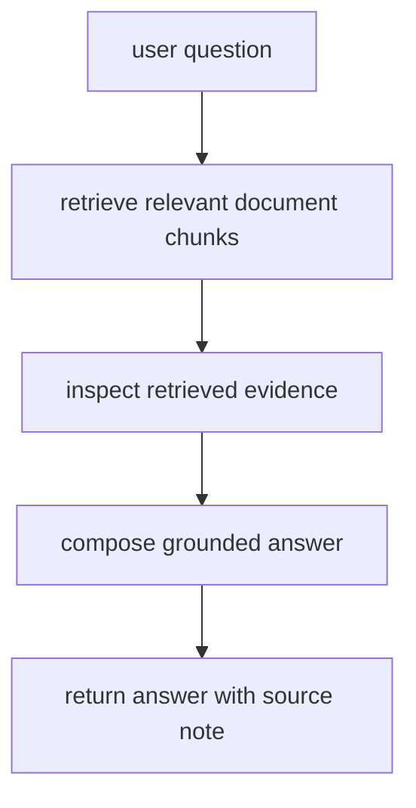

# P6-5.1 문서 기반 RAG 챗봇 목표

Part 5에서 RAG(retrieval-augmented generation)를 개념으로 설명했다면, Part 6에서는 그 구조를 아주 작은 프로젝트로 다시 확인해야 합니다.

핵심은 복잡한 챗봇 UI를 만드는 것이 아닙니다.

`질문을 받고, 관련 문서를 찾고, 찾은 근거를 바탕으로 답을 구성하는 흐름을 문서로 남기는 것`

이것이 이번 프로젝트의 출발점입니다.

## 이 절의 범위

이 절은 다음 질문에 답합니다.

- RAG 프로젝트는 어떤 구성요소로 시작하면 좋은가?
- 검색(retrieval)과 생성(generation)을 왜 분리해서 적어야 하는가?
- 아주 작은 로컬 문서 집합으로도 RAG 흐름을 설명할 수 있는가?

이 절은 다음 내용은 깊게 다루지 않습니다.

- 벡터 데이터베이스(vector database) 운영 최적화
- 임베딩 모델 선택의 심화 비교
- 고급 reranking
- 실제 API 비용 최적화

## 이 절의 목표

- RAG 프로젝트를 `질문 -> 문서 검색 -> 근거 선택 -> 답변 구성` 흐름으로 설명할 수 있습니다.
- 검색 단계와 답변 단계가 다른 역할이라는 점을 말할 수 있습니다.
- 근거가 있는 답변과 근거가 빈약한 답변을 구분하는 프로젝트 구조를 만들 수 있습니다.

## 왜 RAG 프로젝트가 필요한가

LLM 프로젝트를 처음 만들 때 초심자는 종종 `모델이 그냥 알고 답하면 되지 않는가?`라고 생각합니다. 하지만 실제 서비스에서는 다음 문제가 바로 나타납니다.

- 모델이 최신 문서를 모를 수 있다.
- 프로젝트 전용 문서나 내부 규칙은 학습 데이터에 없을 수 있다.
- 답변이 그럴듯해 보여도 근거가 없을 수 있다.

그래서 RAG 프로젝트는 `모델 기억`이 아니라 `문서 검색과 근거 연결`을 먼저 다룹니다.

OpenAI Retrieval 가이드는 retrieval을 문서 검색과 모델 답변 결합 구조로 설명합니다. 핵심은 검색 결과가 모델 입력에 들어가 답변 근거가 된다는 점입니다. 여기서는 그 거대한 구조를 모두 구현하지 않고, 흐름만 작은 예제로 축소합니다.

## 프로젝트 질문 설정

이번 프로젝트의 질문은 다음처럼 잡겠습니다.

> 책 문서 일부를 작은 지식베이스로 두었을 때, 질문에 맞는 문서를 먼저 찾고 그 문장만을 근거로 답할 수 있는가?

이 질문이 좋은 이유는 다음과 같습니다.

- `검색`과 `답변`을 분리해 기록할 수 있습니다.
- 나중에 검색 실패와 환각(hallucination)을 같은 프로젝트 안에서 다룰 수 있습니다.
- Part 5의 RAG 개념을 실제 프로젝트 문서 형식으로 옮길 수 있습니다.

## 프로젝트 흐름



## 작은 문서 집합 예제

이번 절에서는 실제 외부 문서 대신, 책 스타일에 맞춘 짧은 문서 조각 세 개를 자체 예제로 둡니다.

| doc_id | 내용 |
| --- | --- |
| doc_1 | `RAG는 외부 문서를 검색해 모델 입력에 넣는 구조다.` |
| doc_2 | `임베딩은 텍스트를 벡터로 바꾸어 유사도 비교를 가능하게 한다.` |
| doc_3 | `프롬프트만으로는 최신 문서 근거를 보장할 수 없다.` |

## Python 예제

이번 예제의 목적은 복잡한 임베딩 없이도 `질문 -> 문서 검색 -> 근거 포함 답변` 흐름을 눈으로 확인하는 것입니다.

- 문제 상황: RAG 흐름을 아주 작은 로컬 지식베이스로 재현한다.
- 입력(input): 질문 1개, 문서 조각 3개
- 기대 출력(output): 가장 관련 높은 문서 1개와 근거 기반 답변
- 확인할 개념:
  - 검색이 먼저다
  - 답변은 검색 결과 위에 작성된다
  - 출처 doc_id를 함께 남길 수 있다

```python
documents = {
    "doc_1": "RAG는 외부 문서를 검색해 모델 입력에 넣는 구조다.",
    "doc_2": "임베딩은 텍스트를 벡터로 바꾸어 유사도 비교를 가능하게 한다.",
    "doc_3": "프롬프트만으로는 최신 문서 근거를 보장할 수 없다.",
}

question = "RAG가 왜 필요한가?"

def tokenize(text):
    return set(text.replace("?", "").replace(".", "").split())

q_tokens = tokenize(question)
scores = []

for doc_id, text in documents.items():
    overlap = len(q_tokens & tokenize(text))
    scores.append((doc_id, overlap, text))

scores.sort(key=lambda x: x[1], reverse=True)
top_doc_id, top_score, top_text = scores[0]

answer = f"{top_text} 따라서 질문에 답할 때 외부 근거를 함께 붙이기 위해 RAG가 필요하다."

print("question =", question)
print("top_doc_id =", top_doc_id)
print("top_score =", top_score)
print("retrieved_text =", top_text)
print("answer =", answer)
```

실행 결과 예시는 다음과 같습니다.

```text
question = RAG가 왜 필요한가?
top_doc_id = doc_1
top_score = 1
retrieved_text = RAG는 외부 문서를 검색해 모델 입력에 넣는 구조다.
answer = RAG는 외부 문서를 검색해 모델 입력에 넣는 구조다. 따라서 질문에 답할 때 외부 근거를 함께 붙이기 위해 RAG가 필요하다.
```

## 결과를 어떻게 읽는가

이 작은 예제에서 중요한 것은 검색 점수가 크냐 작으냐가 아닙니다. 더 중요한 것은 다음입니다.

- 답변은 검색된 문장 위에서 만들어졌다.
- 검색 결과가 바뀌면 답변도 바뀌어야 한다.
- doc_id를 같이 남기면 나중에 답변 근거를 다시 확인할 수 있다.

즉, 이 프로젝트의 최소 성공 기준은 `그럴듯한 답변`이 아니라 `근거가 붙은 답변`입니다.

## 실무 감각으로 번역하면

실제 RAG 서비스에서는 보통 다음이 함께 붙습니다.

- chunking
- 임베딩 생성
- vector store 검색
- reranking
- 출처 표시

하지만 프로젝트 입문 단계에서는 이 모든 계층을 한 번에 다 넣기보다, 먼저 `검색 결과를 답변 앞에 둔다`는 태도를 고정하는 편이 낫습니다.

## 다음 절과의 연결

P6-5.2에서는 같은 프로젝트 안에서 다음 질문을 봅니다.

- 검색이 잘못되면 답변은 어떻게 흔들리는가?
- 출처가 붙어도 답이 과장되거나 누락될 수 있는가?
- 검색 품질과 답변 검증을 어떻게 문서화할 것인가?

## 이 절에서 기억할 관점

- RAG는 검색과 생성의 결합 구조입니다.
- 검색 단계와 답변 단계는 같은 작업이 아닙니다.
- 프로젝트 문서에는 답변뿐 아니라 검색된 근거를 함께 남겨야 합니다.
- 작은 예제라도 출처 `doc_id`를 남기는 습관이 중요합니다.

## 체크리스트

- 질문, 검색 결과, 답변을 분리해 적을 수 있는가?
- 답변의 근거가 되는 문장을 따로 보여 줄 수 있는가?
- 검색 단계가 실패하면 답변도 흔들린다는 점을 설명할 수 있는가?
- 출처를 프로젝트 기록에 남겼는가?

## 출처와 참고 자료

- OpenAI, `Retrieval`, OpenAI API Docs, 확인 날짜: 2026-06-29. [https://developers.openai.com/api/docs/guides/retrieval](https://developers.openai.com/api/docs/guides/retrieval){: target="_blank" rel="noopener noreferrer" }

이 절의 문서 조각은 프로젝트 실습을 위해 만든 자체 예시입니다.
