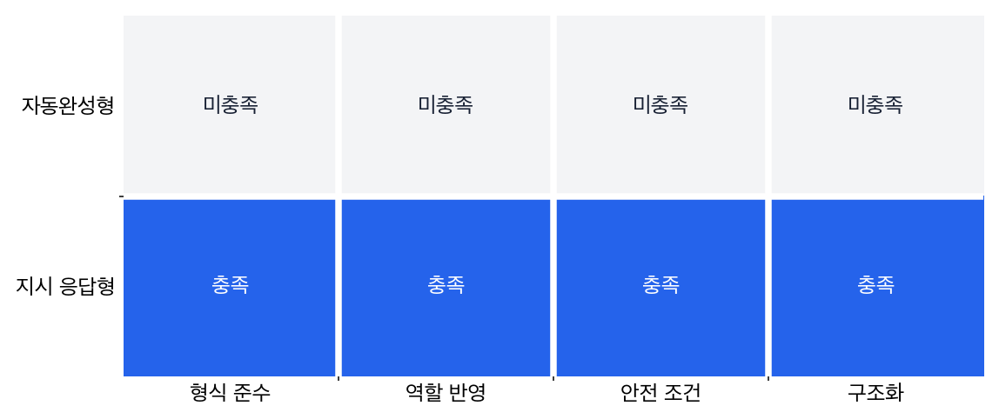

# P6-5.2 생성 구조 위에 더해지는 지시 따르기와 대화 인터페이스

> Section ID: `P6-5.2`
> Version: `v2026.07.31`

P6-5.1에서는 GPT 계열을 이전 토큰을 바탕으로 다음 토큰을 이어 생성하는 decoder 중심 흐름으로 설명했습니다. 그런데 우리가 실제로 만나는 챗봇, 코파일럿, 대화형 도우미는 단순 이어쓰기처럼만 느껴지지 않습니다.

대화형 LLM을 모델 크기 증가만으로 설명하면, 사용자가 실제로 느끼는 변화가 흐려집니다. 핵심은 생성 구조 위에 지시 따르기, 대화 형식, 안전 조정, 인터페이스가 더해지며 `이어쓰기 모델`이 `답변하는 시스템`처럼 보이기 시작했다는 점입니다.

이 구조가 어떻게 오늘날의 챗봇, 코파일럿, 대화형 도우미 같은 사용자 경험으로 바뀌었는가? 대화형 LLM은 단순 자동완성 모델 위에 지시 따르기(instruction following), 대화 형식, 안전 조정, 도구 연결 같은 층이 더해지며 만들어진 사용자 경험입니다.

## 대화형 경험으로 바뀌는 지점

대화형 전환은 다음 질문에서 시작합니다.

- 자동완성형 생성 모델과 대화형 LLM은 무엇이 다른가?
- 왜 사용자는 LLM을 `답변하는 시스템`처럼 느끼게 되었는가?
- 대화형 경험을 만들기 위해 구조 밖에서 무엇이 더 필요했는가?

대화형 전환의 큰 흐름을 먼저 잡으면, 지시 튜닝, 정렬, 프롬프트 설계, 도구 사용, AI agent loop 같은 후속 주제도 `모델 자체`와 `사용자 경험을 만드는 조정층`으로 나누어 읽을 수 있습니다.

사용자 경험의 변화는 단순히 모델 파라미터 증가만으로 생긴 것이 아닙니다. P6-5.1의 GPT 설명이 `다음 토큰을 어떤 생성 구조로 이어 붙일까`를 다뤘다면, 여기서는 그 생성 구조 위에 어떤 조정과 인터페이스가 덧붙어 사용자가 `질문에 답하는 시스템`처럼 느끼게 되었는지 읽습니다.

따라서 핵심 차이는 `생성 구조 자체`와 `그 구조를 사용자 경험으로 바꾸는 조정층`의 구분입니다.

| 지금 초점 | 이어질 질문 | 다시 넓게 읽는 위치 |
| --- | --- | --- |
| GPT 기반 생성 구조 | 텍스트를 어떤 방식으로 이어 생성하는가? | P6-5.1, P6-6.1, P6-7.1 |
| 대화형 LLM 경험 | 왜 사용자는 이것을 답변하는 시스템처럼 느끼는가? | P6-5.2 |
| 지시 튜닝과 정렬 | 그 경험이 어떤 조정 단계로 만들어지는가? | P6-9.1, P6-9.2 |
| 프롬프트와 도구 연결 | 그 조정된 모델을 실제 요청과 실행 구조에 어떻게 붙일 것인가? | P6-10.1, P6-13.1, P6-13.2 |

즉, 지금 장의 핵심은 `무엇을 생성하는 구조인가`에서 `그 구조가 왜 대화형 경험으로 보이게 되었는가`로 넘어가는 데 있습니다. 이 전환이 잡혀야 다음 토큰 예측, 사전학습, instruction tuning을 사용자 경험의 표면 변화가 아니라 학습 원리와 후속 조정 단계로 나누어 읽을 수 있습니다.

## 자동완성, 지시, 안전 조정의 구분

- 자동완성형 GPT와 대화형 LLM의 차이를 설명할 수 있습니다.
- 대화형 경험에 instruction tuning, 안전 조정, 인터페이스 설계가 함께 필요했다는 점을 말할 수 있습니다.
- 챗봇 경험이 모델 구조 하나만으로 완성되지 않는다는 점을 설명할 수 있습니다.
- 이후 pretraining, instruction tuning, prompt, agent 설명으로 자연스럽게 넘어갈 수 있습니다.

여기서 확인해야 할 결과는 대화형 LLM 경험이 단순 자동완성이 아니라, 지시 해석, 대화 이력, 안전성 보정이 함께 묶인 구조로 읽히기 시작하는가입니다.

- 뒤에서 나올 instruction tuning, alignment를 위한 필요성을 만들고
- prompt engineering이 왜 단순 입력 문장이 아닌지 설명하며
- AI agent, tool use, MCP를 `모델 자체`와 구분할 기반을 만들기 때문입니다

## 자동완성과 대화형 경험의 차이

자동완성과 대화형 LLM은 모두 생성 구조 위에 있지만, 사용자가 기대하는 성공 기준이 다릅니다. 이 차이를 다음처럼 나누어 읽어야 후속 주제인 instruction tuning, alignment, prompt, tool use를 같은 층위로 섞지 않을 수 있습니다.

| 구분할 층위 | 자동완성형 경험 | 대화형 LLM 경험 |
| --- | --- | --- |
| 기본 기대 | 앞문장 뒤에 자연스럽게 이어지는가 | 사용자의 질문과 의도를 반영하는가 |
| 추가 제약 | 말투와 문장 연결이 어색하지 않은가 | 형식, 역할, 안전 제약을 지키는가 |
| 인터페이스 역할 | 입력창의 일부처럼 보인다 | 대화 기록과 시스템 역할까지 묶인 도우미처럼 보인다 |
| 후속 질문 | 왜 자연스럽게 이어지는가 | 어떤 조정층이 답변 경험을 만들었는가 |

## 자동완성에서 대화로 바뀌었다는 말의 뜻

초기 생성 모델 사용자 경험은 대체로 다음과 같았습니다.

- 텍스트 앞부분을 주면
- 그 뒤를 계속 이어 쓰게 한다

이것은 강력했지만, 아직 `질문에 답하는 조수`처럼 느껴지지는 않을 수 있습니다.

대화형 LLM 경험은 여기에 다음 층이 더해지며 생깁니다.

- 질문과 답변의 형식
- 사용자의 의도를 따르는 지시 이해
- 불필요한 반복을 줄이는 응답 조정
- 안전성과 정책 제약
- 대화 상태 유지

즉, 모델은 여전히 다음 토큰을 생성하지만, 사용자는 더 이상 그것을 `자동완성기`로 보지 않고 `대화형 도우미`처럼 느끼게 됩니다.

## 무엇이 경험을 바꿨나

대화형 전환을 한 가지 원인으로만 설명하면 부족합니다. 더 안전한 설명은 다음과 같습니다.

1. 더 큰 사전학습 모델
2. 지시를 따르도록 조정하는 추가 학습
3. 대화형 인터페이스 설계
4. 안전성(safety)과 정책 조정
5. 때로는 에이전트 도구 사용(tool use)과 검색 연결

즉, 사용자가 만나는 경험은 `모델 구조 + 후속 조정 + 제품 인터페이스`의 결합입니다.

## 왜 자연어 지시가 중요해졌나

GPT-3 시기 이후 사용자는 prompt 안에 설명과 예시를 넣어 모델 행동을 바꾸는 경험을 더 강하게 하게 됩니다.

이것이 중요한 이유는:

- 별도 모델 교체 없이
- 자연어만으로
- 작업을 지정할 수 있다는 점입니다

예를 들어:

- `세 문장으로 요약해줘`
- `표 형태로 정리해줘`
- `초등학생도 이해하게 설명해줘`

같은 지시가 가능해집니다.

이 지점에서 모델은 단순 언어 생성기가 아니라, `자연어 지시를 따르는 인터페이스`처럼 느껴지기 시작합니다.

## 왜 안전 조정이 함께 중요해졌나

대화형 경험은 단순 생성보다 위험도 더 크게 드러냅니다.

- 그럴듯한 오류
- 공격적인 표현
- 민감 정보 처리 문제
- 잘못된 조언

같은 문제가 더 직접적으로 사용자에게 노출되기 때문입니다.

그래서 대화형 LLM은 대개 구조 밖에서도 안전 조정이 필요합니다.

다음처럼 이해할 수 있습니다.

`좋은 대화형 LLM은 많이 아는 모델이기만 한 것이 아니라, 어떻게 답하지 말아야 하는지도 함께 조정된 시스템이다.`

## 왜 인터페이스도 모델 일부처럼 느껴지나

사용자는 보통 다음을 한 덩어리로 경험합니다.

- 입력창
- 대화 기록
- 시스템 지시
- 모델 응답
- 때로는 검색/도구 실행 결과

하지만 구조적으로는 이들이 모두 같은 것이 아닙니다.

예를 들어:

- 모델은 다음 토큰을 생성하고
- 앱은 대화 기록을 유지하며
- 시스템 프롬프트는 응답 방향을 제약하고
- 도구 연결은 외부 계산이나 검색을 수행합니다

이 차이를 구분해야 나중에 AI agent, MCP, harness를 혼동 없이 설명할 수 있습니다.

## 대화형 경험을 만드는 세 층

여기까지의 흐름을 한 번에 묶으면, 대화형 LLM 경험은 `다음 토큰 생성 모델` 하나만으로 닫히지 않습니다.

- 모델은 여전히 다음 토큰을 생성합니다.
- 조정 단계는 그 생성이 어떤 지시와 형식을 따를지 바꿉니다.
- 인터페이스는 대화 기록, 역할, 도구 결과를 함께 묶어 사용자 경험으로 보여 줍니다.

즉, 사용자가 보는 챗봇은 `생성 모델 + 조정 + 인터페이스`가 합쳐진 결과로 읽는 편이 안전합니다.

## 아주 단순하게 그리면

```mermaid
--8<-- "assets/part-06/chapter-05/p6-c05-s02-conversation-shift-ko.mmd"
```

이 도식에서 확인해야 할 결과는 오늘의 대화형 경험이 한 번에 완성된 기능이 아니라, 자동완성, 지시 수행, 대화 정렬 단계를 거치며 누적된 구조라는 점입니다.

## 생성 구조 위에 더해지는 지시 따르기와 대화 인터페이스: 확인할 판단 기준

이 사례 절은 다음 질문으로 중심축을 확인한다.

- 오픈체크리스트의 중심축 문장인 "생성 구조 위에 instruction following과 대화 인터페이스가 더해지며 사용 경험이 달라진다는 점을 보여 주어야 합니다."를 본문 사례에서 어느 대목으로 확인할 수 있는가?
- 표, 코드, 도식, 체크리스트 중 어떤 장치가 이 판단을 다시 검토하게 만드는가?
아래 도식은 이 절의 세 사례를 `문장이 이어지는가`보다 `사용자 의도와 형식 제약이 실제 응답 구조에 반영되는가`라는 공통 질문으로 다시 묶은 것입니다.

```mermaid
--8<-- "assets/part-06/chapter-05/p6-c05-s02-experience-types-ko.mmd"
```

이 도식에서 확인해야 할 점은 세 경험이 모두 생성 위에 놓여 있어도 평가 기준이 달라진다는 것입니다. 자동완성은 `자연스럽게 이어지는가`가 중심이지만, 대화형 LLM은 `의도, 형식, 안전 제약이 실제 응답 구조에 반영되는가`까지 함께 봐야 합니다.

### 사례 1. 일반 자동완성

메일 작성창에 `안녕하세요, 지난 회의에서 논의한 내용은`까지만 적고 다음 문장을 추천받는 상황을 떠올려 보겠습니다. 사람이 이 기능에서 먼저 보는 기준은 보통 `문장이 자연스럽게 이어지는가`입니다. 여기서는 질문 의도 파악이나 역할 구분보다, 앞문장 뒤에 무난한 후속 표현이 붙는지가 더 중요합니다.

예를 들어 `회의 자료를 첨부드립니다`나 `아래와 같이 정리했습니다`처럼 자연스러운 후속 문장이 이어지면 기능이 잘 동작한다고 느낍니다. 하지만 이 단계에서는 사용자가 무엇을 궁금해하는지, 어떤 형식으로 답해야 하는지까지 깊게 해석하지는 않습니다.

이 경험은 `질문에 답한다`보다 `다음 문장을 이어 쓴다`에 가깝습니다. 여기서 바뀌는 점은 `질문을 해결하는가`를 보던 기준이 아니라, 여전히 `앞문장 뒤에 자연스러운 다음 문장이 붙는가`를 보는 기준에 머문다는 것입니다.

그래서 이 사례에서 확인해야 할 결과는 사용자의 질문을 깊게 해석하는가보다, 앞문장 뒤에 자연스러운 후속 문장이 실제로 이어지는가입니다.

이 사례의 핵심은 자동완성과 챗봇을 같은 성공 기준으로 묶지 않는 데 있습니다. 자동완성에서 먼저 보는 것은 `의도를 해결했는가`보다 `이어쓰기 경험이 매끄러운가`입니다. 앞문장 뒤에 무난한 후속 문장이 붙으면 사용자는 기능이 잘 된다고 느끼고, 반대로 질문을 잘 이해해도 문장 연결이 어색하면 자동완성으로는 불편하게 느낄 수 있습니다. 그래서 일반 자동완성은 생성 위에 놓여 있어도, 평가 기준이 대화형 지시 응답과 다르다는 점을 분리해야 합니다.

같은 생성 구조라도 자동완성에서 먼저 보는 기준은 아래처럼 더 좁습니다.

| 장면 | 기대하기 쉬운 것 | 실제로 자동완성에서 먼저 보는 것 |
| --- | --- | --- |
| 메일 초안 이어쓰기 | 질문도 이해하고 의도도 해결해 줄 것 같음 | 앞문장 뒤에 자연스러운 후속 표현이 붙는가 |
| 회의 후속 안내 문장 추천 | 답변 시스템처럼 다 해 줄 것 같음 | 말투와 이어쓰기 매끄러움이 유지되는가 |
| 짧은 문장 추천 | 의미 해결까지 기대하기 쉬움 | 다음 문장 후보가 무난하고 빠르게 이어지는가 |

이 표가 바로잡는 오해는 `생성 모델이면 곧바로 챗봇처럼 동작해야 한다`는 기대입니다. 일반 자동완성은 같은 생성 위에 있어도, 평가 기준이 훨씬 더 `이어쓰기 경험`에 가까운 층에 머뭅니다.

### 사례 2. 챗봇

사내 정책 문서를 열어 둔 채 `이 정책을 세 문장으로 설명해 줘`라고 묻는 상황을 생각해 보겠습니다. 사람이 단순 자동완성기에서 기대하는 것은 보통 `다음 문장 후보` 정도이지만, 챗봇에게는 질문 이해, 길이 맞추기, 말투 유지, 위험한 답변 회피까지 함께 기대합니다.

만약 모델이 정책 문장 일부만 길게 이어 쓰면, 사용자는 `질문을 들은 시스템`이 아니라 `문장을 잇는 도구`로 느낄 것입니다. 반대로 시스템 역할, 대화 이력, 요약 길이 제약, 안전 규칙이 함께 작동하면 사용자는 `세 문장 설명`이라는 요청이 실제로 반영됐다고 느낍니다.

이 차이가 자동완성과 대화형 LLM 경험을 가르는 핵심입니다. 여기서 바뀌는 점은 `자연스럽게 이어지는가`를 보던 기준에서 `질문 의도와 형식 제약이 실제 답변 구조에 반영되는가`를 보는 기준으로 이동한다는 것입니다.

그래서 이 사례에서 확인해야 할 결과는 단순 이어쓰기가 아니라, 길이 제약과 질문 의도가 실제 답변 구조에 반영되는가입니다.

이 장면도 실제 제품 경험에서 매우 중요합니다. 챗봇은 사용자가 `말을 걸었다`고 느끼는 순간부터 자동완성보다 훨씬 더 많은 것을 기대받습니다. 세 문장 요청이면 실제로 세 문장이어야 하고, 정책 설명이면 불필요한 사족 없이 핵심이 정리되어야 하며, 위험한 안내는 피해야 합니다. 즉 챗봇은 문장이 자연스럽다는 이유만으로 통과되지 않고, `무엇을 하라고 했는가`와 `어떻게 하면 안 되는가`가 실제 구조에 반영돼야 합니다. 그래서 같은 생성 구조라도 자동완성과 대화형 응답은 평가 층이 달라집니다.

같은 생성 모델도 챗봇으로 읽을 때는 아래 기준이 더 붙습니다.

| 장면 | 자동완성 기준으로만 보면 놓치기 쉬운 것 | 챗봇 기준에서 추가로 봐야 하는 것 |
| --- | --- | --- |
| `세 문장으로 설명해 줘` 요청 | 문장이 자연스럽기만 하면 괜찮아 보임 | 실제로 세 문장 형식이 지켜졌는가 |
| 정책 요약 응답 | 이어쓰기만 자연스러우면 충분해 보임 | 질문 의도와 핵심 정보가 반영됐는가 |
| 안전 제약이 있는 응답 | 길고 친절하면 좋아 보임 | 금지 내용 회피와 역할 제약이 실제로 작동했는가 |

이 사례에서 중요한 기준은 `자연스러운 문장`과 `질문에 맞는 응답 구조`를 분리해서 보는 일입니다. 챗봇은 이어쓰기 도구가 아니라, 의도·형식·안전 제약까지 함께 반영해야 하는 생성 경험이라는 점이 여기서 드러납니다.

### 사례 3. 코파일럿

개발자가 함수 안에 `여기서 사용자 입력을 검증하고 실패하면 에러를 반환`이라고 주석을 적는 상황을 떠올려 보겠습니다. 사람이 단순 자동완성에서 기대하는 것은 보통 `다음 몇 글자`이지만, 코드 도우미에게는 함수 이름, 인자, 반환 형식, 주변 파일 문맥까지 함께 읽어 주길 기대합니다.

만약 모델이 이어지는 한 줄만 맞추고 예외 처리나 반환 구조를 놓치면, 개발자는 `코드 문맥을 이해했다`고 느끼기 어렵습니다. 반대로 편집기 문맥과 시그니처를 함께 읽어 조건문, 오류 메시지, 반환문까지 한 묶음으로 제안하면 같은 생성 구조도 훨씬 목적에 맞는 도구로 보입니다.

여기서 바뀌는 점은 `다음 한 줄이 이어지는가`를 보던 기준에서 `주변 코드 문맥을 반영해 더 완결된 블록을 제안하는가`를 보는 기준으로 이동한다는 것입니다.

그래서 이 사례에서 확인해야 할 결과는 한 줄 완성보다 함수 문맥 전체를 반영한 제안이 실제로 더 완결된 코드 블록으로 이어지는가입니다.

세 사례를 사용자 경험 관점으로 다시 묶으면 다음과 같습니다.

| 상황 | 자동완성만으로는 부족한 것 | 대화형 또는 문맥 반영 구조가 더 봐야 하는 것 |
| --- | --- | --- |
| 일반 자동완성 | 자연스러운 이어쓰기 | 이것만으로도 충분한 경우가 있음 |
| 챗봇 | 단순 후속 문장 생성 | 질문 의도, 형식 제약, 안전 조건 |
| 코파일럿 | 다음 한 줄 제안 | 함수 문맥, 반환 형식, 예외 처리 블록 |

## 조정층이 필요한 장면

이 절을 읽은 뒤에는 아직 instruction tuning이나 alignment 세부를 다 몰라도, 아래처럼 `지금 보는 장면이 단순 이어쓰기 경험인가, 대화형 조정층이 필요한 경험인가`를 먼저 가르는 연습을 할 수 있습니다.

| 지금 보이는 장면 | 먼저 떠올리기 쉬운 오해 | 먼저 바꿔 물을 질문 |
| --- | --- | --- |
| 앞문장 뒤에 자연스러운 한 문장만 잘 붙으면 충분하다 | 생성 모델이면 곧바로 챗봇처럼 질문도 해결해야 한다고 느끼기 쉽다 | 지금 기준은 의도 해결보다 이어쓰기 매끄러움인가 |
| `세 문장으로 요약해 줘`를 자주 어기거나 말투가 들쭉날쭉하다 | 모델이 더 똑똑해지면 자동으로 형식과 역할도 맞을 것이라고 느끼기 쉽다 | 지금 막히는 것은 생성 능력보다 지시·형식 조정층 문제인가 |
| 코드 한 줄 추천은 괜찮은데 함수 전체 맥락과 예외 처리는 자주 놓친다 | 다음 토큰 생성만 잘하면 주변 문맥 반영도 자동으로 해결된다고 느끼기 쉽다 | 지금 필요한 것은 더 긴 문맥 반영과 제품 인터페이스 결합인가 |

이 표에서 중요한 것은 `챗봇`이라는 이름을 외우는 일이 아니라, 같은 생성 구조 위에서도 사용자가 기대하는 평가 기준이 달라진다는 점을 실제 장면에 대입해 보는 일입니다.

여기서 자주 섞이는 것도 다음과 같습니다.

- 자연스러운 이어쓰기와 질문 의도 해결을 같은 성공 기준으로 묶기 쉽습니다.
- 형식 준수, 역할 유지, 안전 제약을 모델 구조 하나의 문제로만 보기 쉽습니다.
- 코파일럿이나 챗봇처럼 제품 경험에서 붙는 인터페이스 층을 모델 자체와 구분하지 못하기 쉽습니다.

그래서 이 절의 닫힘은 `대화형 LLM은 생성 모델 + 조정 + 인터페이스의 결합`이라는 말을 실제 판단 기준으로 바꾸는 데 있습니다.

이 구분의 목적은 원인을 한 번에 확정하는 데 있지 않습니다. `대화형 LLM이 이상하다`는 한 문장으로 뭉개지 않고, 지금 보고 있는 현상이 `이어쓰기 경험`, `조정층`, `제품 인터페이스 결합` 중 어디에서 먼저 드러나는지 짧게 가르는 데 있습니다.

## 연습 및 예제

이 연습의 목표는 같은 생성 구조 위에서도 `자동완성 경험`과 `대화형 지시 응답 경험`이 어떻게 달라지는지 확인하는 것입니다. 두 응답 후보를 두고 형식 제약, 역할, 안전 제약, 구조화가 실제로 반영되는지 직접 표시해 보겠습니다.

사용자 요청은 다음과 같다고 하겠습니다.

> 이 문서를 세 문장으로 요약해줘.

시스템 역할은 `학습 내용을 차분히 설명하는 도우미`이고, 피해야 할 것은 확실하지 않은 사실 단정과 공격적 표현입니다. 이 조건이 이 연습의 입력입니다. 즉, 표의 응답 후보 A와 B는 같은 사용자 요청, 같은 시스템 역할, 같은 안전 조건을 받은 뒤 나올 수 있는 두 가지 출력 예입니다.

첫 번째 표는 입력 조건에 대한 두 출력 후보를 보여 줍니다. `응답 후보` 열은 비교 대상의 이름이고, `출력 예` 열은 실제로 사용자가 보게 될 문장입니다. `먼저 보이는 성격` 열은 그 출력이 자동완성에 가까운지, 대화형 지시 응답에 가까운지 첫 판단을 돕는 설명입니다.

| 응답 후보 | 출력 예 | 먼저 보이는 성격 |
| --- | --- | --- |
| A | `이 문서는 중요한 내용을 다루며 확실하지 않은 사실을 단정하기도 합니다...` | 앞문장 뒤를 이어 쓰는 자동완성에 가까움 |
| B | `첫째, 핵심 개념을 정리합니다.`<br>`둘째, 주요 사례와 한계를 함께 설명합니다.`<br>`셋째, 다음 학습 단계로 연결되는 관점을 제공합니다.` | 요청 형식과 역할을 맞추는 대화형 응답에 가까움 |

두 번째 표는 첫 번째 표의 출력 후보를 평가하는 기준표입니다. 왼쪽의 `판단 기준`은 대화형 LLM 경험에서 추가로 확인해야 하는 조건이고, A와 B 열은 각 후보가 그 조건을 만족하는지를 표시합니다. 마지막 열은 왜 그런 판정이 나오는지 설명합니다.

다음 기준으로 직접 표시해 보겠습니다.

| 판단 기준 | A | B | 왜 갈리는가 |
| --- | --- | --- | --- |
| 세 문장 형식을 지키는가 | 아니오 | 예 | A는 이어쓰기 한 줄에 가깝고, B는 요청된 문장 수를 맞춥니다. |
| 설명 도우미 역할이 보이는가 | 아니오 | 예 | A는 문맥을 이어 쓰지만, B는 학습 내용을 정리하는 역할을 드러냅니다. |
| 피해야 할 표현을 피하는가 | 아니오 | 예 | A에는 확실하지 않은 사실 단정이 들어 있고, B는 단정 위험을 줄입니다. |
| 구조화된 응답인가 | 아니오 | 예 | B는 `첫째`, `둘째`, `셋째`로 응답 구조를 만듭니다. |

이 연습에서 중요한 점은 B가 늘 더 훌륭한 문장이라는 뜻이 아닙니다. 자동완성 장면이라면 A처럼 앞문장을 자연스럽게 잇는 것만으로 충분할 수 있습니다. 그러나 사용자가 `세 문장으로 요약해줘`라고 요청한 대화형 장면에서는 자연스러운 이어쓰기만으로는 부족하고, 요청 형식과 역할, 안전 제약이 실제 응답 구조에 반영되어야 합니다.

## 대화형 경험에서 달라지는 출력 기준

앞의 연습은 같은 생성 구조라도 `다음 문장을 이어 쓰는 경험`과 `사용자 지시를 따라 응답 형식, 역할, 안전 조건을 맞추는 경험`이 다르다는 점을 가장 짧게 보여 주는 장면입니다. 여기서 읽어야 할 핵심은 모델이 더 길게 말하느냐가 아니라, `세 문장으로 요약해 달라`는 형식 조건과 `학습 내용을 차분히 설명하는 도우미`라는 역할, 그리고 피해야 할 표현이 실제 응답 구조에 반영되도록 조정된 경험이라는 점입니다.

이 예제에서 읽어야 할 핵심은 다음입니다.

- 둘 다 생성이지만
- 자동완성은 자연스러운 이어쓰기에 더 가깝고
- 대화형 LLM은 사용자의 지시 형식, 역할, 안전 제약을 더 명시적으로 따르도록 조정된 경험이라는 점입니다
- 따라서 같은 생성 모델 위에서도 `format_followed`, `role_followed`, `safety_ok` 같은 항목에서 사용자 경험 차이가 실제로 드러납니다

이 차이를 항목별로만 떼어 보면 아래처럼 읽을 수 있습니다. 자동완성형 응답은 자연스러운 다음 문장을 이어 쓰는 데 가까워 네 기준을 충족하지 못하지만, 지시 응답형은 형식, 역할, 안전 조건, 구조화가 모두 응답 평가 기준으로 들어옵니다.



대화형 LLM 전환은 단순한 모델 스케일 증가만으로 설명하기 어렵습니다. 실제 사용자 경험이 크게 바뀐 이유는:

- 큰 생성 모델
- 지시 따르기 조정
- 대화형 제품 인터페이스
- 안전성 보정

이 함께 묶였기 때문입니다.

이 예제를 판단 기준으로 다시 줄이면 아래 세 질문이 먼저 떠올라야 합니다.

| 장면 | 먼저 답해야 하는 질문 |
| --- | --- |
| 왜 자연스러운 자동완성인데도 챗봇처럼 만족스럽지 않은가 | 지금 기대하는 것은 이어쓰기보다 형식·의도·역할 반영인가 |
| 왜 같은 생성 모델인데 `세 문장`, `차분한 말투`, `금지 표현 회피`가 갈리는가 | 생성 구조 위에 어떤 조정층과 인터페이스가 붙었는가 |
| 왜 코파일럿은 다음 한 줄보다 주변 함수 문맥을 더 읽어야 하는가 | 단순 토큰 생성보다 제품이 제공하는 문맥 결합이 필요한가 |

## 체크리스트
- 대화형 LLM을 `생성 모델 + 조정 + 인터페이스`의 결합으로 설명할 수 있는가?
- 자동완성과 대화형 응답의 차이를 형식 준수, 역할, 안전 제약 기준으로 구분할 수 있는가?
- 다음 장들을 모델 자체와 조정층, 도구층을 나누어 읽을 준비가 되었는가?

## 출처와 참고 자료

- Alec Radford et al., [Language Models are Unsupervised Multitask Learners](https://cdn.openai.com/better-language-models/language_models_are_unsupervised_multitask_learners.pdf){: target="_blank" rel="noopener noreferrer" }, OpenAI 2019, 확인 날짜: 2026-07-19. GPT-2의 language model 기반 생성 흐름을 대화형 전환 이전의 생성 모델 배경 근거로 사용했다.
- Tom B. Brown et al., [Language Models are Few-Shot Learners](https://arxiv.org/abs/2005.14165){: target="_blank" rel="noopener noreferrer" }, arXiv 2020, 확인 날짜: 2026-07-19. GPT-3가 task specification과 few-shot demonstrations를 text interaction으로 받는다는 설명의 근거로 사용했다.
- Long Ouyang et al., [Training language models to follow instructions with human feedback](https://arxiv.org/abs/2203.02155){: target="_blank" rel="noopener noreferrer" }, arXiv 2022, 확인 날짜: 2026-07-19. 모델 규모만으로는 사용자 의도 준수가 자동 보장되지 않고, human feedback fine-tuning으로 InstructGPT를 만든다는 설명의 근거로 사용했다.
- OpenAI, [Aligning language models to follow instructions](https://openai.com/index/instruction-following/){: target="_blank" rel="noopener noreferrer" }, 확인 날짜: 2026-07-19. InstructGPT와 RLHF가 지시 따르기와 안전성·정렬 문제를 다루는 후속 조정층이라는 설명의 보조 근거로 사용했다.
- OpenAI, [Introducing ChatGPT](https://openai.com/index/chatgpt/){: target="_blank" rel="noopener noreferrer" }, 확인 날짜: 2026-07-19. 대화 형식이 후속 질문, 실수 인정, 부적절한 요청 거절 같은 사용자 경험을 가능하게 한다는 설명의 근거로 사용했다.
- OpenAI Help Center, [How can I use the Chat Completion API?](https://help.openai.com/en/articles/7232945-how-can-i-use-the-chatgpt-api){: target="_blank" rel="noopener noreferrer" }, 확인 날짜: 2026-07-19. developer instructions, message role, instruction following을 통해 대화 세션의 역할과 제약을 조정한다는 현재 API 사용 설명의 운영 근거로 사용했다.
