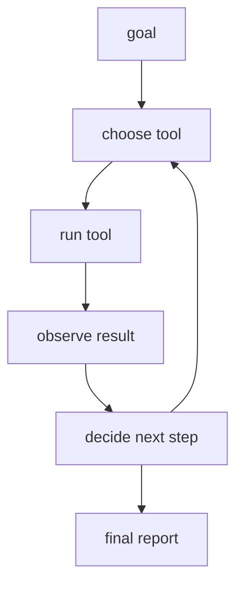

# P6-6.1 도구를 사용하는 에이전트 목표

RAG 프로젝트가 `문서를 찾아 답에 붙이는 구조`였다면, agent 프로젝트는 한 단계 더 나아가 `도구를 실제로 호출해 작업을 이어 가는 구조`를 다룹니다.

여기서 중요한 것은 agent를 막연한 지능처럼 설명하지 않는 것입니다.

이번 프로젝트에서 agent는 다음처럼 좁게 정의하면 충분합니다.

목표를 받아, 필요한 도구를 고르고, 도구 결과를 읽고, 다음 행동을 정하는 실행 루프

이 절의 목적은 agent를 똑똑한 존재로 설명하는 것이 아니라, 목표와 도구 결과를 이어 가는 프로젝트 문서 구조를 익히는 것이다.

## 이 절의 범위

이 절은 다음 질문에 답합니다.

- 도구를 사용하는 agent 프로젝트는 어떤 흐름으로 적으면 좋은가?
- RAG와 agent는 무엇이 다른가?
- tool use와 function calling은 프로젝트 문서에서 어떻게 연결되는가?

이 절은 다음 내용은 깊게 다루지 않습니다.

- 다중 agent orchestration
- 장기 메모리(memory) 설계
- 실제 샌드박스 격리 구현
- 동시성 제어

이 절은 단일 agent 프로젝트의 최소 문서 구조를 잡는 데 집중합니다. 권한과 로그를 어떻게 붙여야 하는지는 바로 다음 P6-6.2 권한과 로그 검토에서 다시 회수하고, 다중 agent와 샌드박스 구현 전개는 현재 본편 범위 밖으로 둡니다.

## 이 절의 목표

- agent를 `계획 -> 행동 -> 관찰 -> 다음 행동` 루프로 설명할 수 있습니다.
- RAG와 agent의 차이를 말할 수 있습니다.
- 제한된 도구 집합으로도 agent 프로젝트를 문서화할 수 있습니다.

## 왜 agent 프로젝트가 필요한가

Part 5에서 보았듯, function calling은 모델이 외부 시스템과 연결되도록 만드는 방식입니다. OpenAI의 function calling 문서도 이 기능을 외부 데이터와 시스템을 다루는 연결 지점으로 설명합니다. 즉, tool use는 단순 답변 생성과 다른 층위의 문제입니다.

RAG와 비교하면 차이가 더 분명합니다.

| 구조 | 중심 동작 |
| --- | --- |
| RAG | 문서를 검색하고 근거를 붙인다 |
| agent | 도구를 고르고 호출하며 다음 행동을 이어 간다 |

즉, agent 프로젝트는 `문서를 읽는 것`보다 `행동을 이어 가는 것`에 더 가깝습니다.

먼저 다음 세 질문으로 읽으면 좋습니다.

| 질문 | 짧은 답 |
| --- | --- |
| 이 프로젝트에서 먼저 남길 것은 무엇인가? | 목표, 도구 목록, 실행 순서 |
| RAG와 가장 큰 차이는 무엇인가? | 읽기보다 행동 연결이 중심이라는 점 |
| 최소 산출물은 무엇인가? | tool log와 최종 보고 |

## 프로젝트 질문 설정

이번 프로젝트의 질문은 다음처럼 잡겠습니다.

> 책 저장소에서 `목차 읽기 -> 빌드 상태 확인 -> 결과 보고`처럼 제한된 도구 흐름을 하나의 작업으로 연결할 수 있는가?

이 질문이 좋은 이유는 다음과 같습니다.

- 이 저장소의 실제 작업 흐름과 닮아 있습니다.
- 도구 호출과 관찰 결과가 분명합니다.
- 권한과 로그 문제를 다음 절로 자연스럽게 넘길 수 있습니다.

## 프로젝트 흐름



이 도식은 agent 프로젝트의 핵심이 `정답 한 번 출력`이 아니라 `관찰을 바탕으로 다음 행동을 다시 고르는 루프`라는 점을 보여 줍니다. 목표를 받은 뒤 도구를 고르고, 결과를 읽고, 필요하면 다시 도구 선택으로 돌아가는 구조가 agent 문서화의 중심입니다.

프로젝트 문서 관점으로 다시 쓰면 다음 순서입니다.

| 단계 | 문서에 남길 것 |
| --- | --- |
| 목표 | 무엇을 끝내려는가 |
| 도구 선택 | 어떤 도구를 왜 고르는가 |
| 실행 | 실제 호출 결과 |
| 관찰 | 어떤 결과를 읽었는가 |
| 다음 행동 | 계속할지 멈출지 |
| 최종 보고 | 전체 흐름 요약 |

## 작은 agent 예제

이번 절에서는 세 개의 장난감 도구를 둡니다.

- `read_toc`: 목차 읽기
- `check_build`: 빌드 상태 확인
- `report_status`: 요약 보고

실제 shell 실행 대신, 프로젝트 문서 안에서는 이 도구들이 어떤 입력과 출력을 갖는지만 명확히 보여 주면 충분합니다.

## Python 예제

이번 예제의 목적은 agent 상태(state)와 tool result를 순서대로 기록하는 것입니다. 이번에는 단순히 `tool`과 `result`만 출력하지 않고, `planned_steps`, `execution_records`, `final_report`를 함께 남겨 실제 실행 루프가 어떻게 문서화되는지 보이게 하겠습니다.

- 문제 상황: 제한된 도구 집합으로 하나의 작업을 끝까지 연결한다.
- 입력(input): 목표 1개, 도구 3개, 단계별 계획
- 기대 출력(output): 계획 목록, 실행 기록, 최종 보고
- 확인할 개념:
  - 계획과 관찰이 함께 있어야 agent 루프를 다시 읽을 수 있다
  - tool result는 다음 행동을 정하는 입력이 된다
  - 최종 보고는 마지막 단계 하나가 아니라 전체 실행 기록을 요약해야 한다

```python
tools = {
    "read_toc": lambda: {
        "status": "success",
        "summary": "table-of-contents loaded",
        "observation": "part/chapter structure is available",
    },
    "check_build": lambda: {
        "status": "success",
        "summary": "mkdocs build passed",
        "observation": "current docs render without build failure",
    },
    "report_status": lambda: {
        "status": "success",
        "summary": "report written",
        "observation": "final status note can be shared",
    },
}

goal = "summarize current book status"
planned_steps = [
    {"step": 1, "tool": "read_toc", "why": "need current structure first"},
    {"step": 2, "tool": "check_build", "why": "need current build health"},
    {"step": 3, "tool": "report_status", "why": "need final summary after observations"},
]
execution_records = []

for index, step in enumerate(planned_steps):
    result = tools[step["tool"]]()
    if result["status"] != "success":
        next_action = "stop_and_review"
    elif index == len(planned_steps) - 1:
        next_action = "finish"
    else:
        next_action = planned_steps[index + 1]["tool"]

    execution_records.append({
        "step": step["step"],
        "tool": step["tool"],
        "why": step["why"],
        "result_status": result["status"],
        "result_summary": result["summary"],
        "observation": result["observation"],
        "next_action": next_action,
    })

print("goal =", goal)
print("planned_steps =", planned_steps)
print("execution_records =")
for entry in execution_records:
    print(entry)

final_report = {
    "goal": goal,
    "completed_steps": len(execution_records),
    "final_status": execution_records[-1]["result_status"],
    "last_observation": execution_records[-1]["observation"],
}
print("final_report =", final_report)
```

실행 결과 예시는 다음과 같습니다.

```text
goal = summarize current book status
planned_steps = [{'step': 1, 'tool': 'read_toc', 'why': 'need current structure first'}, {'step': 2, 'tool': 'check_build', 'why': 'need current build health'}, {'step': 3, 'tool': 'report_status', 'why': 'need final summary after observations'}]
execution_records =
{'step': 1, 'tool': 'read_toc', 'why': 'need current structure first', 'result_status': 'success', 'result_summary': 'table-of-contents loaded', 'observation': 'part/chapter structure is available', 'next_action': 'check_build'}
{'step': 2, 'tool': 'check_build', 'why': 'need current build health', 'result_status': 'success', 'result_summary': 'mkdocs build passed', 'observation': 'current docs render without build failure', 'next_action': 'report_status'}
{'step': 3, 'tool': 'report_status', 'why': 'need final summary after observations', 'result_status': 'success', 'result_summary': 'report written', 'observation': 'final status note can be shared', 'next_action': 'finish'}
final_report = {'goal': 'summarize current book status', 'completed_steps': 3, 'final_status': 'success', 'last_observation': 'final status note can be shared'}
```

## 결과를 어떻게 읽는가

이 장난감 예제에서 읽어야 할 핵심은 `tool result가 다음 단계의 입력이 된다`는 점입니다.

- `planned_steps`는 agent가 어떤 순서와 이유로 도구를 고르는지 보여 줍니다.
- `read_toc`의 결과가 없으면 현재 구조를 모릅니다.
- `check_build`의 결과가 실패라면 `next_action`은 `report_status`가 아니라 중단 또는 재시도로 바뀌어야 합니다.
- 마지막 `report_status`는 앞 두 단계 관찰을 묶어야 의미가 있습니다.
- `final_report`는 실행 루프의 끝에서 무엇을 사용자에게 전달할지 정리합니다.

즉, agent 프로젝트는 단순 명령 목록이 아니라 `관찰 기반 루프`입니다.

이 결과를 다음 세 줄로 요약할 수 있으면 충분합니다.

- tool result는 다음 단계 판단의 근거가 된다
- 계획, 관찰, 다음 행동이 함께 남아야 agent 루프를 다시 읽을 수 있다
- 계획은 고정 문장이 아니라 관찰에 따라 바뀔 수 있다
- agent 프로젝트는 답변보다 실행 흐름 기록이 중요하다

## MCP와의 연결

Model Context Protocol(MCP) 문서는 AI 애플리케이션과 외부 시스템 사이의 연결 방식을 표준화하려는 방향을 설명합니다. 이 관점은 agent 프로젝트에 매우 중요합니다. agent가 도구를 여러 개 쓰더라도, 연결 방식과 입력/출력 구조가 일관되면 프로젝트 문서와 운영이 쉬워집니다.

이번 절에서는 MCP 구현 자체를 다루지 않지만, 왜 tool interface를 표준화하려 하는지의 감각은 여기서부터 잡을 수 있습니다.

이 절은 Part 6 전체 흐름에서 `LLM 프로젝트가 읽기에서 실행으로 확장될 때 문서 구조도 함께 바뀐다`는 점을 보여 줍니다.

## 다음 절과의 연결

P6-6.2에서는 같은 agent 프로젝트를 가지고 다음 질문을 봅니다.

- 어떤 도구는 그냥 호출해도 되는가?
- 어떤 도구는 승인(approval)이 필요한가?
- 실행 로그와 권한 기록은 어디에 남겨야 하는가?

즉, agent 프로젝트의 다음 단계는 성능보다 `권한과 기록`입니다.

## 이 절에서 기억할 관점

- agent는 목표를 따라 도구를 이어 쓰는 실행 루프입니다.
- RAG와 agent는 같은 것이 아닙니다.
- tool result는 다음 행동 판단의 근거가 됩니다.
- 표준화된 도구 연결 구조는 프로젝트 문서와 운영을 단순하게 만듭니다.

## 체크리스트

- agent를 계획/행동/관찰 루프로 설명할 수 있는가?
- RAG와 agent의 차이를 말할 수 있는가?
- 도구 이름, 도구 결과, 다음 행동을 따로 기록할 수 있는가?
- 어떤 단계에서 권한 문제가 생길지 예측할 수 있는가?

## 출처와 참고 자료

- OpenAI, `Function calling`, OpenAI API Docs, 확인 날짜: 2026-06-29. [https://developers.openai.com/api/docs/guides/function-calling](https://developers.openai.com/api/docs/guides/function-calling){: target="_blank" rel="noopener noreferrer" }
- Model Context Protocol, `What is MCP?`, 확인 날짜: 2026-06-29. [https://modelcontextprotocol.io/docs/getting-started/intro](https://modelcontextprotocol.io/docs/getting-started/intro){: target="_blank" rel="noopener noreferrer" }
