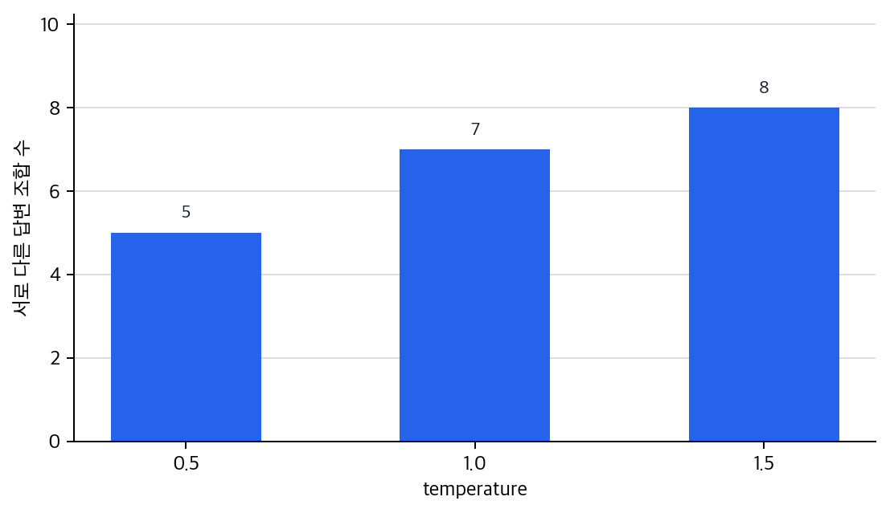

# P6-6.2 출력 선택 규칙은 왜 답변의 안정성과 다양성을 바꾸는가

> Section ID: `P6-6.2`
> Version: `v2026.07.21`

P6-6.1에서는 LLM의 기본 학습 목표가 다음 토큰 예측(next-token prediction)이라는 점을 보았습니다. 하지만 사용자 경험은 단지 `다음 한 조각 예측`이라는 말보다 훨씬 복잡해 보입니다.

질문은 자연스럽게 이어집니다.

그렇다면 실제 생성은 어떤 흐름으로 진행되는가? 사용자가 보는 답변은 `후보 분포 계산`과 `후보 선택`이 여러 번 이어진 결과입니다.

다음 토큰 예측의 기본 뜻은 이미 `현재 문맥에서 다음 토큰 분포를 계산한다`는 말로 잡았습니다. 여기서는 그 분포에서 실제 토큰을 어떻게 뽑느냐가 답변의 안정성, 다양성, 재현성을 어떻게 바꾸는지에 집중합니다.

## 출력 선택 규칙이 다루는 질문

출력 선택 규칙은 다음 질문에서 시작합니다.

- 생성은 한 토큰씩 어떻게 이어지는가?
- 왜 같은 입력에서도 결과가 조금씩 달라질 수 있는가?
- temperature, sampling, greedy 선택은 어떤 차이를 만드는가?

여기서 필요한 것은 디코더 내부 attention 공식을 다시 푸는 일이 아니라 `후보를 어떻게 고르느냐에 따라 결과가 왜 달라지는가`를 읽는 감각입니다. 같은 후보 분포라도 선택 규칙이 달라지면 사용자에게 보이는 문장 구조와 흔들림이 달라집니다.

따라서 핵심은 `모델이 답을 안다`보다 `후보들 가운데 무엇을 어떤 규칙으로 고르느냐에 따라 결과가 달라진다`는 점입니다. 이 절에서는 확률 분포를 계산한 뒤 실제로 어떤 토큰을 고를지 정하는 과정을 다룹니다. beam search, top-p 같은 세부 디코딩 공식 비교는 뒤로 미루고, greedy, sampling, temperature가 결과의 안정성과 다양성을 어떻게 바꾸는지 먼저 봅니다. 정렬, 정책 제약, 외부 도구 연결처럼 생성 경로를 더 바꾸는 문제도 여기서는 분리해 둡니다.

핵심 직관은 `생성은 확률 분포에서 다음 토큰을 반복 선택하는 과정`이라는 점입니다.

`모델이 무엇을 학습했는가`와 `생성 시 어떤 후보를 어떻게 고르는가`를 구분해야 같은 답변 흔들림도 더 정확히 읽을 수 있습니다.

## 여기서 남겨야 할 구분

- 생성이 반복 선택 과정임을 설명할 수 있습니다.
- greedy 선택과 sampling의 차이를 구분할 수 있습니다.
- temperature가 `모델 파라미터`가 아니라 `생성 시 선택 성향을 바꾸는 설정값`이라는 점을 설명할 수 있습니다.
- 왜 같은 질문에도 다른 답이 나올 수 있는지 설명할 수 있습니다.

## 출력 선택 규칙의 판단 기준

출력 선택 규칙은 모델이 학습한 내용을 바꾸는 문제가 아니라, 계산된 후보 분포에서 실제로 무엇을 고를지 정하는 문제입니다. 따라서 다음 기준을 분리해서 읽어야 합니다.

| 판단 기준 | 확인할 질문 |
| --- | --- |
| 반복 구조 | 생성이 확률 분포 계산과 후보 선택의 반복으로 설명되는가 |
| 선택 방식 | greedy와 sampling이 같은 분포에서 무엇을 다르게 고르는가 |
| 설정값의 층위 | temperature가 학습 파라미터가 아니라 생성 시 선택 성향을 바꾸는 값으로 설명되는가 |
| 사용 목적 | 안정성, 다양성, 재현성 중 무엇이 먼저 필요한 장면인가 |

## 생성은 어떻게 이어지나

생성 과정은 매우 단순하게 말하면 다음 순서를 반복합니다.

1. 현재까지의 토큰을 본다
2. 다음 토큰 후보들의 확률 분포를 계산한다
3. 어떤 규칙으로 하나를 고른다
4. 고른 토큰을 뒤에 붙인다
5. 종료 조건까지 반복한다

이 과정을 보면, 생성은 `정답을 미리 다 써 둔 문장을 꺼내는 일`이 아니라 `매 단계에서 다음 선택을 이어 가는 일`에 더 가깝습니다.

## 왜 같은 질문에도 답이 달라질 수 있나

모델은 보통 후보 하나만 절대적으로 정하지 않습니다. 여러 후보가 그럴듯할 수 있습니다.

예를 들어 어떤 문장 뒤에는:

- `좋습니다`
- `가능합니다`
- `검토하겠습니다`

같은 후보가 모두 자연스러울 수 있습니다.

이때 항상 가장 높은 후보만 고르면 결과는 더 안정적일 수 있지만, 표현이 단조로워질 수 있습니다. 반대로 확률 분포에서 샘플링(sampling)하면 더 다양한 결과가 나올 수 있지만, 불안정성도 커질 수 있습니다.

## greedy와 sampling은 어떻게 다른가

가장 간단한 비교는 다음과 같습니다.

| 방식 | 핵심 아이디어 |
| --- | --- |
| greedy | 매 단계에서 가장 높은 확률 후보를 고른다 |
| sampling | 확률 분포를 반영해 후보를 뽑는다 |

greedy는 더 예측 가능하고, sampling은 더 다양합니다.

다음처럼 기억하면 됩니다.

`greedy는 가장 안전한 한 점을 고르는 방식이고, sampling은 그럴듯한 후보들 사이에서 확률적으로 선택하는 방식이다.`

## temperature는 무엇을 바꾸나

이 표현은 Part 1에서도 한 번 조심해서 다뤘습니다. 많은 사용자가 temperature를 `모델 내부를 바꾸는 학습 파라미터`처럼 오해합니다. 하지만 일반적인 서비스 사용 문맥에서는 다음처럼 설명하는 편이 안전합니다.

`temperature는 생성 시 후보 확률 분포를 얼마나 날카롭거나 퍼지게 읽을지 조정하는 설정값이다.`

즉:

- 낮은 temperature: 상위 후보를 더 강하게 밀어 준다
- 높은 temperature: 낮은 후보도 더 자주 선택될 수 있다

이 값은 보통 `학습된 지식 자체`를 바꾸는 것이 아니라, `생성 시 선택 방식`을 바꿉니다.

## 어떤 목적에서 어떤 선택이 먼저 어울리나

생성 설정은 `무조건 creativity를 높이거나 낮추는 버튼`이라기보다, 지금 무엇을 더 우선할지 정하는 선택에 가깝습니다.

| 장면 | 더 먼저 원하는 것 | 먼저 떠올릴 선택 감각 |
| --- | --- | --- |
| 고객 지원 초안 | 일관성, 정책 준수 | 낮은 temperature, 보수적 선택 |
| 코드 생성 | 재현성, 구조 안정성 | 낮은 temperature, greedy에 가까운 선택 |
| 마케팅 문구 초안 | 후보 다양성, 표현 폭 | sampling, 다소 높은 temperature |
| 브레인스토밍 | 새로운 조합, 탐색 | sampling 중심 선택 |

즉, 같은 모델이라도 `정확하고 흔들리지 않는 답`이 먼저 필요한지, `여러 후보를 넓게 보고 싶은지`에 따라 생성 설정의 우선순위가 달라집니다.

## 여기까지를 한 줄로 묶으면

여기까지를 가장 짧게 정리하면 다음과 같습니다.

- 학습은 `무엇을 다음 토큰으로 예측할 것인가`를 다룹니다.
- 생성은 `그 후보들 중 무엇을 실제로 뽑을 것인가`를 다룹니다.
- temperature, greedy, sampling은 이 두 번째 문제에 속합니다.

이 구분이 있어야 `모델이 아는 것`과 `실제로 어떤 답을 꺼냈는가`를 섞어 설명하지 않게 됩니다.

## 아주 단순하게 그리면

```mermaid
--8<-- "assets/part-06/chapter-06/p6-c06-s02-decoding-loop-ko.mmd"
```

이 도식의 핵심은 생성이 `확률 분포 계산`과 `선택 규칙`의 결합이라는 점입니다.

## 사례 및 예시

아래 도식은 이 절의 세 사례를 `무작위로 고른다`보다 `어떤 목적에서 얼마나 보수적으로 또는 다양하게 고를 것인가`라는 공통 질문으로 다시 묶은 것입니다.

```mermaid
--8<-- "assets/part-06/chapter-06/p6-c06-s02-selection-criteria-ko.mmd"
```

이 도식에서 확인해야 할 점은 생성 설정이 `창의성 버튼` 하나가 아니라는 것입니다. 같은 모델이라도 고객 응답, 마케팅 문구, 코드 생성처럼 목적이 달라지면 `안정성`, `다양성`, `재현성`의 우선순위가 달라지고, 그에 따라 greedy, sampling, temperature를 보는 기준도 달라집니다.

### 사례 1. 고객 응답 초안

고객 지원 초안을 자동으로 만들 때를 생각해 볼 수 있습니다. 사람은 이 장면에서 보통 `정책에 맞는 안정적인 문장이 나오는가`를 먼저 기준으로 삼습니다.

예를 들어 환불 문의에 어떤 답은 먼저 사과하고 어떤 답은 바로 정책을 말하면, 내용이 맞아도 서비스 톤은 일정하지 않게 느껴질 수 있습니다. 또 어떤 답은 환불 조건을 먼저 말하고 다른 답은 제출 서류부터 길게 설명하면 고객이 다음 행동을 헷갈릴 수 있습니다.

이때 샘플링 폭이 너무 넓으면 같은 질문에도 말투와 안내 순서가 흔들리기 쉽습니다. 반대로 낮은 temperature와 보수적인 선택 규칙은 `정책 설명 -> 필요한 서류 -> 다음 단계`처럼 비슷한 안내 흐름을 더 자주 유지하게 만듭니다.

그래서 이 사례에서 확인해야 할 결과는 같은 질문에 대해 말투와 안내 순서가 크게 흔들리지 않는가입니다.

이 장면에서는 `다양한 표현`이 꼭 장점이 아닙니다. 고객이 원하는 것은 여러 스타일의 답이 아니라, 같은 조건이면 비슷한 구조와 같은 정책 순서로 안내받는 경험이기 때문입니다. 즉, 표현 폭을 넓히는 것보다 `정책 문장 누락이 없는가`, `다음 행동이 항상 같은 자리에서 보이는가`가 더 먼저 점검할 기준이 됩니다.

| 이 장면에서 먼저 보는 것 | 흔들리면 생기는 문제 |
| --- | --- |
| 사과, 정책 설명, 다음 단계의 순서 | 답변마다 안내 흐름이 달라져 고객이 헷갈림 |
| 같은 조건에서 비슷한 말투 유지 | 상담 품질이 들쭉날쭉해 보임 |
| 필요한 정보 요청 위치 고정 | 주문번호, 수령일 같은 다음 행동이 눈에 덜 들어옴 |

### 사례 2. 마케팅 문구 초안

마케팅 문구 초안이나 아이디어 브레인스토밍에서는 상황이 다릅니다. 사람은 이 단계에서 보통 `가장 안전한 한 문장`보다 `비교할 만한 여러 후보가 나오는가`를 먼저 봅니다. 같은 표현만 반복해서 받으면 후보 폭이 너무 좁다고 느낄 수 있습니다.

예를 들어 세 개 시안을 요청했는데 모두 `쉽고 빠른`으로 시작하면, 문법상 맞아도 팀은 방향을 비교하기 어렵습니다. 반대로 `빠른 처리`, `안심 배송`, `복잡한 절차 없는 시작`처럼 강조점이 갈리면 어떤 메시지가 더 맞는지 논의할 재료가 생깁니다.

이 장면에서는 항상 가장 높은 후보만 고르는 보수적 선택보다, 그럴듯한 후보를 몇 개 더 허용하는 sampling 계열 설정이 더 잘 맞을 수 있습니다. 즉, 중요한 변화는 `한 문장 정답`을 찾는 일에서 `비교 가능한 후보 묶음`을 만드는 일로 기준이 바뀐다는 점입니다.

그래서 이 사례에서 확인해야 할 결과는 서로 다른 강조점을 가진 후보가 실제로 여러 개 나오는가입니다.

여기서는 오히려 너무 안정적인 출력이 문제일 수 있습니다. 시안이 모두 같은 구조와 어휘로만 나오면 팀은 무엇을 비교해야 하는지 판단 재료를 얻지 못합니다. 따라서 이 장면에서는 `조금 덜 안전해도 다른 각도의 후보가 생기는가`, `강조점이 실제로 갈리는가`를 먼저 보는 편이 맞습니다.

| 이 장면에서 먼저 보는 것 | 부족하면 생기는 문제 |
| --- | --- |
| 서로 다른 강조점의 후보 수 | 비교 가능한 시안이 없어 한 문장만 반복 검토하게 됨 |
| 브랜드 톤을 벗어나지 않는 다양성 | 후보는 늘었지만 품질선이 무너질 수 있음 |
| 문장 시작과 핵심 메시지의 변주 | 모두 비슷한 문구로 시작해 선택지가 좁아짐 |

### 사례 3. 코드 생성

코드 생성에서는 문법 안정성과 재현성이 특히 중요합니다. 사람은 여기서 `매번 조금 다른 코드`보다 `같은 요구에 비슷한 구조로 안정적으로 답하는가`를 먼저 기준으로 삼습니다.

예를 들어 같은 함수 수정 요청인데 한 번은 `try/except`를 넣고 다음에는 생략하면, 비교와 회귀 확인이 훨씬 어려워집니다. 첫 결과를 기준으로 테스트를 맞춘 뒤 다시 생성했을 때 구조가 크게 바뀌면, 실제 버그보다 생성 변동을 추적하는 시간이 더 늘어날 수 있습니다.

이때 샘플링 폭이 너무 넓으면 예외 처리 방식, 변수 구조, 반환 순서가 불필요하게 흔들릴 수 있습니다. 반대로 더 보수적인 설정은 `같은 요구 -> 비슷한 구조`를 더 자주 유지하게 만들어 디버깅 기준선을 잡기 쉽게 합니다.

그래서 이 사례에서 확인해야 할 결과는 같은 요청을 반복했을 때 코드 구조와 예외 처리 방식이 크게 흔들리지 않는가입니다.

세 사례를 디코딩 선택 기준으로 다시 묶으면 다음과 같습니다.

| 상황 | 더 보수적으로 볼수록 좋은 것 | 더 다양한 후보를 허용할수록 좋은 것 |
| --- | --- | --- |
| 고객 응답 초안 | 말투 일관성, 안내 순서 안정성 | 거의 없음, 흔들림이 오히려 문제 |
| 마케팅 문구 초안 | 최소 품질선 유지 | 강조점이 다른 여러 시안 |
| 코드 생성 | 구조 안정성, 재현성 | 과도한 다양성은 디버깅 비용 증가 |

세 사례를 묶으면, 생성 설정은 `창의성 버튼`이 아니라 `어느 정도까지 구조 흔들림을 허용할 것인가`를 정하는 선택으로 읽어야 합니다.

## 선택 규칙이 드러나는 장면

beam search나 top-p 같은 세부 공식을 아직 몰라도, 지금 보는 장면이 `모델이 모르는 문제`인지 `이미 있는 후보 중 무엇을 뽑느냐의 문제`인지는 먼저 가를 수 있습니다. 같은 문의인데 답변 말투와 안내 순서가 매번 흔들린다면 곧바로 지식 부족으로만 보지 말고, 후보는 알고 있지만 sampling 폭이나 temperature 때문에 구조 흔들림이 커진 것인지 물어야 합니다. 마케팅 시안이 너무 비슷해서 비교할 재료가 없다면 창의력 부족이라는 말보다 더 다양한 후보를 허용하는 선택 규칙이 필요한지 봐야 합니다. 같은 코드 수정 요청에서 예외 처리 방식이 실행마다 달라진다면, 지식 추가보다 더 보수적인 선택 규칙이 먼저 필요한 장면일 수 있습니다.

여기서 중요한 것은 `temperature를 올릴까 내릴까`를 기계적으로 외우는 일이 아니라, 먼저 `무엇을 학습했는가`와 `그중 무엇을 실제로 뽑고 있는가`를 다른 문제로 읽는 일입니다.

여기서 자주 섞이는 것도 다음과 같습니다.

- 모델 지식 부족과 출력 선택 흔들림을 같은 원인으로 묶기 쉽습니다.
- 다양성이 필요한 장면과 일관성이 필요한 장면을 같은 평가 기준으로 보기 쉽습니다.
- temperature를 `모델 내부를 바꾸는 값`처럼 느끼고, 실제로는 출력 선택 성향을 바꾸는 설정값이라는 점을 놓치기 쉽습니다.

따라서 `생성은 후보 분포에서 실제로 무엇을 뽑을지 정하는 과정`이라는 말은 실제 서비스 장면을 읽는 기준이 되어야 합니다.

이 구분의 목적은 원인을 한 번에 확정하는 데 있지 않습니다. `생성이 이상하다`는 한 문장으로 뭉개지 않고, 지금 문제가 `지식 부족`보다 `선택 규칙`, `후보 다양성`, `구조 흔들림` 중 어디에서 먼저 드러나는지 짧게 가르는 데 있습니다.

## 연습 및 예제

이 예제의 목표는 확률 후보에서 `greedy`, `sampling`, `temperature`가 실제 사용자에게 보이는 문장 구조를 어떻게 바꾸는지 직접 보는 것입니다. 한 번만 토큰을 뽑는 대신, 고객 지원 답변의 세 슬롯을 채우는 방식으로 `낮은 temperature`, `기본 temperature`, `높은 temperature`에서 문장 순서와 표현 폭이 어떻게 달라지는지 비교하겠습니다.

아래 코드는 고객 지원 답변의 세 슬롯, 슬롯별 후보 확률, temperature 설정값, 반복 샘플링 횟수를 사용합니다. 결과에서는 temperature별 조정 확률, greedy로 만든 고정 답변, sampling으로 만든 여러 답변 미리보기, 샘플링 답변의 표현 조합 수를 확인합니다.

확인할 핵심은 temperature 조절이 후보 분포의 평탄도를 바꿔 일관성과 다양성의 균형을 달라지게 만든다는 점입니다.

```python
# 고객 지원 답변 슬롯에서 greedy, sampling, temperature가 문장 조합의 일관성과 다양성을 어떻게 바꾸는지 비교하는 예제입니다.
import random

reply_slots = {
    "opening": {
        "불편을 드려 죄송합니다.": 0.50,
        "문의 주셔서 감사합니다.": 0.30,
        "확인 도와드리겠습니다.": 0.20,
    },
    "policy": {
        "환불은 배송 완료 후 7일 이내 가능합니다.": 0.55,
        "배송 완료 후 7일 안에 환불을 접수할 수 있습니다.": 0.25,
        "주문 상태를 확인한 뒤 환불 가능 여부를 안내해 드립니다.": 0.20,
    },
    "next_step": {
        "주문번호를 보내 주시면 바로 확인하겠습니다.": 0.60,
        "주문번호와 수령일을 함께 알려 주세요.": 0.25,
        "필요한 정보를 남겨 주시면 순서대로 도와드리겠습니다.": 0.15,
    },
}

def apply_temperature(prob_dict, temperature):
    adjusted = {
        token: prob ** (1.0 / temperature)
        for token, prob in prob_dict.items()
    }
    total = sum(adjusted.values())
    return {token: adjusted[token] / total for token in adjusted}

def greedy_reply(slots, temperature):
    parts = []
    for _, prob_dict in slots.items():
        adjusted = apply_temperature(prob_dict, temperature)
        parts.append(max(adjusted, key=adjusted.get))
    return " ".join(parts)

def sample_many(slots, temperature, trials=12, seed=7):
    random.seed(seed)
    replies = []
    for _ in range(trials):
        parts = []
        for _, prob_dict in slots.items():
            adjusted = apply_temperature(prob_dict, temperature)
            tokens = list(adjusted.keys())
            weights = list(adjusted.values())
            picked = random.choices(tokens, weights=weights, k=1)[0]
            parts.append(picked)
        replies.append(" ".join(parts))
    unique_count = len(set(replies))
    return replies, unique_count

for temperature in [0.5, 1.0, 1.5]:
    adjusted_opening = apply_temperature(reply_slots["opening"], temperature)
    greedy_choice = greedy_reply(reply_slots, temperature)
    sampled_replies, unique_count = sample_many(reply_slots, temperature, trials=12, seed=7)

    print("temperature =", temperature)
    print(
        "opening_probs =",
        {token: round(prob, 3) for token, prob in adjusted_opening.items()},
    )
    print("greedy_reply =", greedy_choice)
    print("preview =", sampled_replies[:5])
    print("unique_reply_count =", unique_count)
    print()
```

이 예제는 로컬 `.venv`의 Python으로 실행해 본문 출력과 일치함을 확인했습니다.

실행 결과 예시는 다음처럼 읽을 수 있습니다.

```text
temperature = 0.5
opening_probs = {'불편을 드려 죄송합니다.': 0.658, '문의 주셔서 감사합니다.': 0.237, '확인 도와드리겠습니다.': 0.105}
greedy_reply = 불편을 드려 죄송합니다. 환불은 배송 완료 후 7일 이내 가능합니다. 주문번호를 보내 주시면 바로 확인하겠습니다.
preview = ['불편을 드려 죄송합니다. 환불은 배송 완료 후 7일 이내 가능합니다. 주문번호를 보내 주시면 바로 확인하겠습니다.', '불편을 드려 죄송합니다. 환불은 배송 완료 후 7일 이내 가능합니다. 주문번호를 보내 주시면 바로 확인하겠습니다.', '불편을 드려 죄송합니다. 환불은 배송 완료 후 7일 이내 가능합니다. 주문번호를 보내 주시면 바로 확인하겠습니다.', '불편을 드려 죄송합니다. 환불은 배송 완료 후 7일 이내 가능합니다. 주문번호를 보내 주시면 바로 확인하겠습니다.', '불편을 드려 죄송합니다. 배송 완료 후 7일 안에 환불을 접수할 수 있습니다. 주문번호를 보내 주시면 바로 확인하겠습니다.']
unique_reply_count = 5

temperature = 1.0
opening_probs = {'불편을 드려 죄송합니다.': 0.5, '문의 주셔서 감사합니다.': 0.3, '확인 도와드리겠습니다.': 0.2}
greedy_reply = 불편을 드려 죄송합니다. 환불은 배송 완료 후 7일 이내 가능합니다. 주문번호를 보내 주시면 바로 확인하겠습니다.
preview = ['불편을 드려 죄송합니다. 환불은 배송 완료 후 7일 이내 가능합니다. 주문번호와 수령일을 함께 알려 주세요.', '불편을 드려 죄송합니다. 환불은 배송 완료 후 7일 이내 가능합니다. 주문번호를 보내 주시면 바로 확인하겠습니다.', '불편을 드려 죄송합니다. 환불은 배송 완료 후 7일 이내 가능합니다. 주문번호를 보내 주시면 바로 확인하겠습니다.', '불편을 드려 죄송합니다. 환불은 배송 완료 후 7일 이내 가능합니다. 주문번호를 보내 주시면 바로 확인하겠습니다.', '불편을 드려 죄송합니다. 주문 상태를 확인한 뒤 환불 가능 여부를 안내해 드립니다. 주문번호를 보내 주시면 바로 확인하겠습니다.']
unique_reply_count = 7

temperature = 1.5
opening_probs = {'불편을 드려 죄송합니다.': 0.444, '문의 주셔서 감사합니다.': 0.316, '확인 도와드리겠습니다.': 0.241}
greedy_reply = 불편을 드려 죄송합니다. 환불은 배송 완료 후 7일 이내 가능합니다. 주문번호를 보내 주시면 바로 확인하겠습니다.
preview = ['불편을 드려 죄송합니다. 환불은 배송 완료 후 7일 이내 가능합니다. 주문번호와 수령일을 함께 알려 주세요.', '불편을 드려 죄송합니다. 배송 완료 후 7일 안에 환불을 접수할 수 있습니다. 주문번호를 보내 주시면 바로 확인하겠습니다.', '불편을 드려 죄송합니다. 배송 완료 후 7일 안에 환불을 접수할 수 있습니다. 주문번호를 보내 주시면 바로 확인하겠습니다.', '불편을 드려 죄송합니다. 환불은 배송 완료 후 7일 이내 가능합니다. 주문번호를 보내 주시면 바로 확인하겠습니다.', '불편을 드려 죄송합니다. 주문 상태를 확인한 뒤 환불 가능 여부를 안내해 드립니다. 주문번호를 보내 주시면 바로 확인하겠습니다.']
unique_reply_count = 8
```

이 예제에서 읽어야 할 핵심은 다음입니다.

- greedy는 세 경우 모두 같은 고정 답 구조를 만듭니다.
- sampling은 temperature가 높아질수록 같은 질문에도 opening, 정책 문장, 다음 단계 표현 조합이 더 다양해집니다.
- `unique_reply_count`가 5 -> 7 -> 8로 늘어나는 점은, temperature가 단순 랜덤 버튼이 아니라 `답 구조 다양성`을 실제로 밀어 올린다는 점을 보여 줍니다.
- 즉, temperature는 `무작위성 추가 버튼`이라기보다 `확률 분포를 얼마나 눌러서 볼지, 얼마나 펴서 볼지`를 조절해 결과 구조 흔들림까지 바꾸는 설정값에 가깝습니다.

이 변화를 숫자만 따로 그리면 아래처럼 보입니다. 같은 12회 샘플링에서도 temperature가 높아질수록 서로 다른 답변 조합 수가 늘어나, 일관성보다 후보 다양성을 더 허용하는 방향으로 이동합니다.



이 예제에서는 `reply_slots`, `temperature`, `trials`, `seed`를 직접 바꿔 볼 수 있습니다. 예를 들어 `trials`를 100으로 늘리면 조합 수 차이가 더 선명해지고, `temperature`를 0.2나 2.0으로 바꾸면 고객 응답처럼 안정성이 중요한 장면에서 구조 흔들림이 얼마나 커지는지도 더 극단적으로 볼 수 있습니다.

## temperature를 아주 단순한 비유로 보면

다음 정도의 비유가 유용합니다.

- 낮은 temperature: `가장 유력한 후보만 거의 고른다`
- 높은 temperature: `덜 유력한 후보도 꽤 자주 검토한다`

다만 이 비유도 전부는 아닙니다. 실제 구현에서는 확률 분포의 모양 자체가 조정됩니다. 그래서 `temperature는 randomness 버튼`이라고만 말하면 부족합니다.

## 이 예제를 선택 규칙 관점으로 다시 보면

이 예제에서 중요한 것은 후보 확률이 있다는 사실만이 아니라, 그 분포에서 `어떻게 고를 것인가`가 실제 사용자 경험을 바꾼다는 점입니다. 같은 모델이라도 보수적으로 뽑을지, 다양한 후보를 더 허용할지에 따라 응답의 안정성, 창의성, 재현성이 달라지므로 이후 설정 논의는 모두 이 선택 규칙 관점 위에 올라갑니다.

언어 모델을 실제 사용자 도구로 이해하려면, `무엇을 학습했는가`와 `그 학습 결과로 실제 출력을 어떻게 뽑는가`를 분리해서 보는 습관이 필요합니다.

- 학습 목표: 다음 토큰 예측
- 생성 절차: 후보 분포에서 실제 토큰을 선택하는 반복 과정

이 구분이 있어야 이후의:

- prompting
- decoding 설정
- hallucination 검토
- 평가

를 서로 다른 문제로 나눠 볼 수 있습니다.

이 예제를 판단 기준으로 다시 줄이면 다음 세 질문이 먼저 떠올라야 합니다.

| 장면 | 먼저 답해야 하는 질문 |
| --- | --- |
| 왜 같은 질문인데도 답이 조금씩 달라지는가 | 후보 분포는 비슷하지만 실제 선택 규칙이 달라지고 있는가 |
| 왜 고객 응답과 코드 생성에서는 흔들림이 더 큰 문제인가 | 이 과업은 다양성보다 일관성과 재현성이 먼저 필요한가 |
| 왜 마케팅 문구 초안에서는 오히려 답이 너무 비슷한 것이 문제인가 | 더 넓은 후보를 허용하는 선택 규칙이 필요한가 |

## 체크리스트
- `무엇을 학습했는가`와 `무엇을 실제로 뽑는가`를 분리해서 설명할 수 있는가?
- greedy, sampling, temperature를 각각 안정성·다양성·재현성 관점으로 구분할 수 있는가?
- 다음 장들을 읽을 때 모델 지식과 출력 선택 규칙을 섞지 않을 준비가 되었는가?

## 출처와 참고 자료

- Tom B. Brown et al., `Language Models are Few-Shot Learners`, arXiv, 2020, 확인 날짜: 2026-07-19. [https://arxiv.org/abs/2005.14165](https://arxiv.org/abs/2005.14165){: target="_blank" rel="noopener noreferrer" }
- Ari Holtzman et al., `The Curious Case of Neural Text Degeneration`, ICLR, 2020, 확인 날짜: 2026-07-19. [https://iclr.cc/virtual_2020/poster_rygGQyrFvH.html](https://iclr.cc/virtual_2020/poster_rygGQyrFvH.html){: target="_blank" rel="noopener noreferrer" }
- OpenAI API Reference, `Create a model response`, 생성 설정 예시, 확인 날짜: 2026-07-19. [https://developers.openai.com/api/reference/resources/responses/methods/create](https://developers.openai.com/api/reference/resources/responses/methods/create){: target="_blank" rel="noopener noreferrer" }
