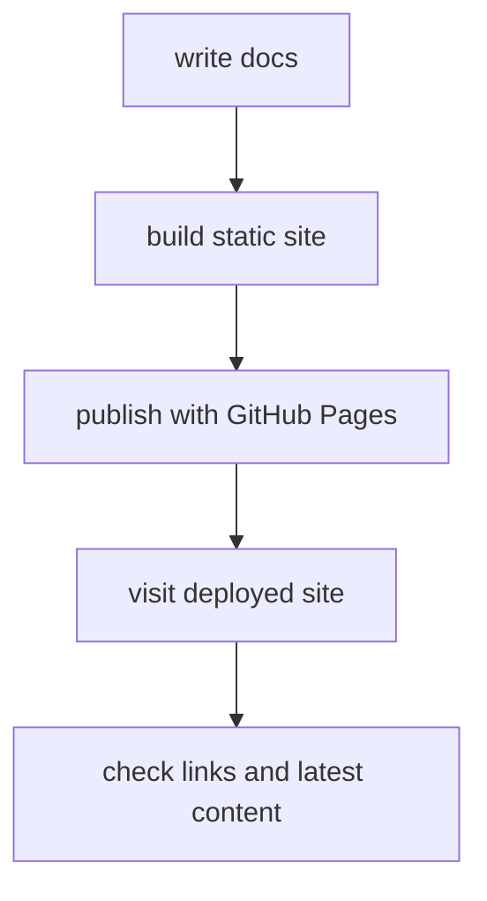

# P6-7.1 배포와 모니터링 목표

Part 6의 마지막 프로젝트는 `만들기`보다 `계속 보여 주고 확인하기`에 가깝습니다. 이 책 저장소처럼 정적 웹 문서를 배포하는 프로젝트도 결국 서비스 관점을 갖게 됩니다.

즉, 질문은 이렇게 바뀝니다.

`문서를 빌드해서 올리는 것만으로 충분한가? 아니면 배포 상태와 기본 신호를 함께 확인해야 하는가?`

이번 절은 GitHub Pages를 기준으로 그 기본 구조를 잡습니다.

초심자 기준에서는 먼저 다음 한 문장으로 잡으면 충분합니다.

`이 절의 목적은 문서를 올리는 법 자체보다, 배포 프로젝트에서 빌드와 공개 확인을 분리해 기록하는 것이다.`

## 이 절의 범위

이 절은 다음 질문에 답합니다.

- 정적 문서 프로젝트를 배포한다는 것은 무엇을 뜻하는가?
- GitHub Pages는 어떤 종류의 배포 방식인가?
- 배포 후 무엇을 최소한 확인해야 하는가?

이 절은 다음 내용은 깊게 다루지 않습니다.

- CDN 세부 최적화
- 커스텀 도메인 DNS 설정
- 사설 모니터링 시스템 구축

## 이 절의 목표

- 정적 사이트 배포를 `빌드 -> 배포 -> 확인` 흐름으로 설명할 수 있습니다.
- GitHub Pages가 정적 사이트 호스팅(static site hosting)이라는 점을 말할 수 있습니다.
- 배포 후 기본 상태 확인 체크리스트를 만들 수 있습니다.

## 왜 배포 프로젝트가 필요한가

개인 학습 프로젝트라도 배포를 거치면 다음 문제가 생깁니다.

- 로컬에서는 되는데 배포에서는 안 될 수 있다.
- 링크가 깨질 수 있다.
- 새 변경이 바로 반영되지 않을 수 있다.
- 빌드 성공과 공개 페이지 정상 동작은 같은 말이 아닐 수 있다.

GitHub Docs는 GitHub Pages를 저장소의 정적 파일을 웹사이트로 공개하는 서비스로 설명합니다. 또한 public repository라면 GitHub Free에서도 사용할 수 있다고 안내합니다.

즉, 이번 프로젝트는 단순 업로드가 아니라 `정적 산출물을 공개 서비스로 전환하는 최소 운영 경험`입니다.

초심자는 먼저 다음 세 질문으로 읽으면 좋습니다.

| 질문 | 초심자용 짧은 답 |
| --- | --- |
| 이 프로젝트에서 먼저 남길 것은 무엇인가? | build 상태, publish 상태, 공개 URL |
| 왜 배포 후 확인이 필요한가? | 빌드 성공과 공개 정상 동작이 다를 수 있어서 |
| 최소 산출물은 무엇인가? | 체크리스트와 확인 결과 |

## 프로젝트 흐름



이 도식은 배포를 `파일 올리기 한 번`이 아니라 `작성, 빌드, 공개, 실제 확인`으로 나누어 보게 해 줍니다. 특히 마지막 확인 단계가 있어야 빌드 성공과 공개 페이지 정상 동작이 다른 문제라는 점을 프로젝트 문서에 분명히 남길 수 있습니다.

프로젝트 문서 관점으로 다시 쓰면 다음 순서입니다.

| 단계 | 문서에 남길 것 |
| --- | --- |
| 작성 | 어떤 변경을 배포하는가 |
| 빌드 | 산출물 생성 성공 여부 |
| 배포 | workflow 또는 publish 상태 |
| 공개 확인 | URL 접근 가능 여부 |
| 점검 | 최신 반영, 링크, 오류 페이지 확인 |

## GitHub Pages에서 기억할 점

GitHub Docs는 GitHub Pages가 정적 파일을 배포하며, 필요하면 build process를 거쳐 publish할 수 있다고 설명합니다. 또한 GitHub Actions workflow를 publishing source로 사용할 수 있다고 안내합니다. public repository에서는 Actions도 무료로 사용할 수 있습니다.

이 저장소의 문맥에서는 다음 정도를 기억하면 충분합니다.

- `main` 반영 시 Pages 배포가 실행된다.
- 산출물은 정적 파일이다.
- 배포 후 실제 공개 URL을 확인해야 한다.
- 변경 반영에는 시간이 걸릴 수 있다.

## 작은 배포 체크리스트

이번 절에서는 실제 원격 배포를 다시 실행하는 대신, 프로젝트 문서 관점에서 어떤 항목을 확인해야 하는지 적는 데 집중합니다.

| 확인 항목 | 질문 |
| --- | --- |
| build status | 로컬 또는 CI 빌드가 성공했는가? |
| publish status | 배포 workflow가 성공했는가? |
| site URL | 공개 URL이 열리는가? |
| latest content | 가장 최근 수정이 반영되었는가? |
| broken links | 주요 내부 링크가 깨지지 않았는가? |

## Python/터미널 예시 대신 남길 수 있는 실제 명령

이 프로젝트에서는 코드보다 명령 흐름이 더 중요합니다.

```bash
.venv/bin/python -m mkdocs build
git push origin main
```

이 두 줄은 단순하지만 역할이 다릅니다.

- 첫 줄은 `정적 산출물 생성`
- 둘째 줄은 `배포 트리거`

프로젝트 문서에는 둘을 분리해 적는 편이 좋습니다.

초심자는 이 두 줄을 다음처럼 구분해 기억하면 충분합니다.

- `mkdocs build`: 배포 전 산출물 확인
- `git push origin main`: 배포 트리거

## 운영 관점의 연결

Google SRE 책은 monitoring을 실시간 수치 데이터를 수집하고 가공해 보여 주는 활동으로 설명합니다. 또한 alerting, dashboard, retrospective analysis 같은 목적을 함께 두며, 사용자 관점 시스템에서는 latency, traffic, errors, saturation 네 가지 golden signals를 우선 보라고 정리합니다.

정적 문서 사이트는 동적 서비스보다 단순하지만, 운영 질문은 여전히 남습니다.

- 페이지가 열리는가?
- 최근 배포가 반영되었는가?
- 오류 페이지가 보이지 않는가?
- 트래픽이 늘면 정적 파일 전달은 안정적인가?

즉, 작은 문서 배포도 `배포 후 확인` 단계를 가져야 합니다.

이 절은 Part 6 전체 흐름에서 `정적 사이트도 서비스처럼 확인하고 기록해야 한다`는 기준을 잡습니다.

## 다음 절과의 연결

P6-7.2에서는 배포 실패, 링크 오류, 오래된 콘텐츠 노출 같은 문제를 어떻게 회고 문서로 남길지 다룹니다.

## 이 절에서 기억할 관점

- 정적 사이트 배포도 하나의 서비스 배포입니다.
- build 성공과 공개 페이지 정상 동작은 같은 말이 아닙니다.
- GitHub Pages는 정적 파일 호스팅 서비스입니다.
- 배포 후 상태 확인 체크리스트가 필요합니다.

## 체크리스트

- 빌드 성공과 배포 성공을 분리해 적을 수 있는가?
- 공개 URL과 최신 반영 여부를 확인했는가?
- 링크 깨짐과 오류 페이지 여부를 점검했는가?
- 정적 사이트도 운영 관점이 필요하다는 점을 설명할 수 있는가?

## 출처와 참고 자료

- GitHub Docs, `What is GitHub Pages?`, 확인 날짜: 2026-06-29. [https://docs.github.com/en/pages/getting-started-with-github-pages/what-is-github-pages](https://docs.github.com/en/pages/getting-started-with-github-pages/what-is-github-pages){: target="_blank" rel="noopener noreferrer" }
- GitHub Docs, `Creating a GitHub Pages site`, 확인 날짜: 2026-06-29. [https://docs.github.com/en/pages/getting-started-with-github-pages/creating-a-github-pages-site](https://docs.github.com/en/pages/getting-started-with-github-pages/creating-a-github-pages-site){: target="_blank" rel="noopener noreferrer" }
- Google, `Monitoring Distributed Systems`, Site Reliability Engineering Book, 확인 날짜: 2026-06-29. [https://sre.google/sre-book/monitoring-distributed-systems/](https://sre.google/sre-book/monitoring-distributed-systems/){: target="_blank" rel="noopener noreferrer" }
