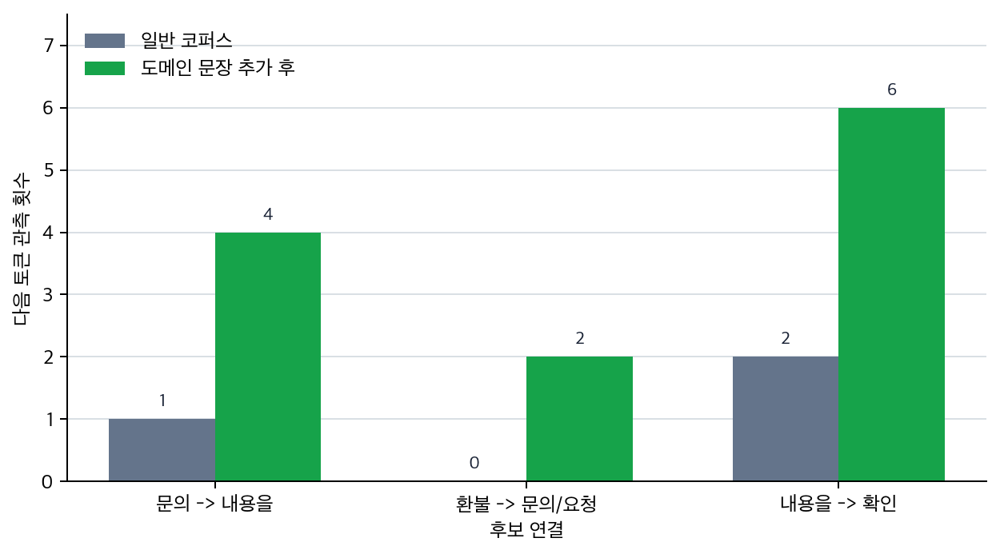

# P6-8.1 넓은 언어 기반을 먼저 만드는 사전학습

> Section ID: `P6-8.1`
> Version: `v2026.07.31`

P6-6까지에서는 Transformer와 GPT 구조가 다음 토큰 후보를 만들고, 출력 선택 규칙이 실제 답변의 안정성과 다양성을 바꾼다는 점을 보았습니다. 하지만 거기까지로는 아직 한 가지가 남습니다. `왜 같은 생성 구조라도 어떤 모델은 더 넓은 장면에서 그럴듯하게 반응하고, 어떤 모델은 금방 한계가 드러나는가`입니다.

이 질문부터는 계산 구조만으로는 충분하지 않습니다. 이제는 `무엇을 먼저 배우고`, `얼마나 큰 규모로 배우고`, `그 위에 어떤 후속 조정을 얹는가`를 함께 읽어야 합니다. Chapter 7은 바로 그 학습 축의 출발점입니다.

P6-5.2에서는 대화형 LLM이 단순 자동완성 모델 위에 지시 따르기, 안전 조정, 인터페이스 층이 더해진 사용자 경험이라는 점을 보았습니다. 여기서는 그보다 한 단계 아래로 내려가, 그런 조정이 얹히기 전에 모델이 먼저 어떤 기반을 가져야 하는지부터 다시 봅니다.

사전학습(pretraining)은 모델이 특정 한 과업에 들어가기 전에, 대규모 텍스트에서 일반적인 언어 패턴과 표현을 먼저 배우는 단계입니다. 즉, 바로 실무 문제를 푸는 단계라기보다 먼저 언어의 기본 감각을 넓게 익히는 준비 단계에 가깝습니다.

## 넓은 언어 기반을 먼저 만드는 단계

기반 학습 단계는 다음 질문에서 시작합니다.

- 사전학습은 무엇을 배우는 단계인가?
- 왜 먼저 큰 텍스트에서 배우고, 나중에 목적에 맞게 조정하는가?
- 사전학습과 파인튜닝(fine-tuning), 지시 튜닝(instruction tuning)은 어떻게 구분하는가?

사전학습은 `대규모 일반 패턴을 먼저 배우는 기반 학습 단계`입니다. 이 기준이 있어야 파인튜닝·지시 튜닝을 같은 학습이라는 이름 아래 뭉뚱그리지 않을 수 있습니다.

규모와 계산 제약은 `왜 넓은 기반을 그렇게 큰 규모로 만드는가`의 문제이고, 지시 튜닝과 정렬은 `그 기반을 사용자 요청과 정책 기준에 어떻게 맞추는가`의 문제입니다. 사전학습을 먼저 분리해 두면 이 후속 질문들이 한 덩어리로 섞이지 않습니다.

사전학습을 `지식을 통째로 저장하는 마법 같은 과정`으로 보면 이후 설명이 흔들립니다. 더 정확한 출발점은, 생성 구조가 실제 과업 조정으로 이어지기 전에 모델이 먼저 넓은 언어 패턴과 표현 관계를 배운다는 점입니다.

따라서 핵심은 `이미 똑똑한 모델`이라는 인상보다 `먼저 넓은 언어 기반을 배우고 나중에 목적별 조정을 얹는 구조`입니다.

## 왜 생성 설명 다음에 학습 축을 다시 읽는가

생성 구조를 이해한 직후 자주 생기는 오해는 `그럼 이제 모델은 구조만 같으면 비슷하게 반응하겠네`라고 느끼는 일입니다. 하지만 실제로는 그렇지 않습니다. 같은 Transformer 구조를 써도 무엇을 먼저 얼마나 넓게 배웠는지에 따라 기본 반응 범위가 크게 달라지고, 그 위에 어떤 조정을 더 얹었는지에 따라 사용자 경험도 다시 달라집니다.

그래서 Chapter 7은 생성 원리 설명 뒤에 붙은 별도 주제가 아니라, `왜 같은 생성 구조라도 기본 반응 범위가 다른가`에 답하는 학습 축의 시작입니다. 여기서 먼저 잡을 것은 특정 과업 전에 넓은 언어 기반을 배우는 사전학습입니다. 스케일(scale)은 그 기반을 왜 큰 규모로 만들려 하는가의 문제이고, 파인튜닝·지시 튜닝·정렬은 그 기반을 사용자 목적과 정책 기준에 어떻게 더 맞추는가의 문제입니다.

`모델이 이미 똑똑하다`는 인상은 `대규모 일반 패턴을 먼저 배우고 이후 목적별 조정이 덧붙는 구조`로 바꾸어 읽어야 합니다.

따라서 이 절의 중심은 `언어 기반을 먼저 만든다`는 감각입니다. 이 기준이 잡혀야 뒤의 파인튜닝과 지시 튜닝도 새 기능 추가가 아니라, 이미 만든 기반을 목적과 사용자 반응 쪽으로 좁혀 가는 후속 조정으로 보이기 시작합니다.

## 넓은 언어 기반과 후속 조정의 구분

- 사전학습을 입문 수준에서 설명할 수 있습니다.
- 사전학습과 파인튜닝, 지시 튜닝의 차이를 말할 수 있습니다.
- 사전학습이 왜 다양한 과업 전이(transfer)의 기반이 되는지 설명할 수 있습니다.
- `데이터와 스케일` 문제를 사전학습 기반의 크기 문제로 읽을 수 있습니다.

이 구분이 필요한 이유는 다음과 같습니다.

- 여러 후속 모델을 공통 사전학습 관점으로 묶어 읽게 하며
- 이후 fine-tuning, instruction tuning, prompt, alignment 설명을 한 줄로 묶어 주기 때문입니다

## 기반 학습과 후속 조정의 구분

사전학습을 이해하려면 `넓은 기반을 만드는 단계`와 `목적에 맞게 좁히는 단계`를 분리해야 합니다.

| 구분할 단계 | 확인할 기준 |
| --- | --- |
| 사전학습 | 특정 과업 정답보다 넓은 언어 기반을 먼저 만드는가 |
| 파인튜닝 | 이미 만든 기반을 특정 과업 데이터에 맞게 더 좁히는가 |
| 지시 튜닝 | 사용자의 자연어 요청 형식에 더 잘 반응하도록 조정하는가 |
| 사례 판단 | 지금 부족한 것이 언어 기반인지, 과업 조정인지, 요청 형식 조정인지 나눌 수 있는가 |

## 사전학습은 무엇을 배우는 단계인가

사전학습은 모델이 어떤 회사의 내부 업무 하나나, 특정 시험 문제 하나만 먼저 배우는 단계가 아닙니다. 더 넓은 텍스트 패턴을 먼저 배우는 단계입니다.

| 질문 | 짧은 답 |
| --- | --- |
| 모델은 이 단계에서 무엇을 배우는가? | 문장과 표현이 이어지는 일반 패턴 |
| 아직 배우지 않는 것은 무엇인가? | 특정 회사 정책, 특정 과업 규칙 |
| 왜 이 단계를 먼저 거치는가? | 나중에 여러 과업에 공통으로 쓸 기반을 만들기 위해 |

예를 들어 모델은 다음과 같은 것을 간접적으로 익힐 수 있습니다.

- 어떤 단어와 표현이 자주 함께 나타나는가
- 문장이 보통 어떤 구조로 이어지는가
- 질문, 설명, 비교, 요약 같은 형식이 어떻게 나타나는가
- 특정 맥락에서 어떤 토큰이 더 자연스럽게 뒤따르는가

즉, 사전학습은 `언어 사용의 큰 통계적 구조`를 먼저 익히는 과정으로 보는 편이 안전합니다.

## 왜 먼저 크게 배우고 나중에 조정하나

이 질문을 먼저 잡아야 `처음부터 작은 과업 모델을 만드는 일`과 `넓게 배운 뒤 목적에 맞게 좁히는 일`의 차이를 구분할 수 있습니다.

왜 바로 고객센터 분류 모델만 만들지 않고, 왜 먼저 큰 일반 모델을 학습할까요?

이유는 간단합니다.

- 일반 패턴을 먼저 배우면
- 이후 작은 데이터로도
- 여러 과업에 더 잘 적응할 수 있기 때문입니다

다음처럼 이해하면 좋습니다.

`사전학습은 범용 언어 감각을 먼저 만들고, 이후 세부 과업 조정은 그 위에 얹는 방식이다.`

이것은 Part 3에서 배운 전이(transfer)와 일반화(generalization) 관점과도 연결됩니다.

다시 말해, 사전학습은 `문제를 바로 푸는 단계`보다 `문제를 풀 수 있는 바탕을 먼저 만드는 단계`에 가깝습니다.

이 기준이 보여야 P6-8.2의 스케일 설명도 자연스럽게 이어집니다. `왜 굳이 그렇게 큰 데이터와 계산을 쓰는가`라는 질문은, 바로 지금 보고 있는 `넓은 기반을 먼저 만드는 단계`가 실제로 얼마나 넓고 무거운 준비 단계인지와 이어지기 때문입니다.

예를 들어 고객센터 분류를 만들더라도, 모델이 먼저 문장 구조와 표현 차이를 넓게 익혀 두면 이후 `환불`, `교환`, `계정 문제` 같은 더 좁은 분류 규칙에 적응시키기 쉬워집니다.

## 사전학습, 파인튜닝, 지시 튜닝은 어떻게 다른가

이 세 표현은 자주 함께 나오지만 같은 말이 아닙니다.

| 구분 | 핵심 질문 |
| --- | --- |
| 사전학습(pretraining) | 일반적인 언어 패턴을 먼저 배우는가? |
| 파인튜닝(fine-tuning) | 특정 과업 데이터에 맞게 가중치를 더 조정하는가? |
| 지시 튜닝(instruction tuning) | 사용자의 자연어 지시를 더 잘 따르도록 조정하는가? |

이 차이를 구분하지 않으면, 사용자는 `모델이 원래부터 다 알았다`거나 `프롬프트만 잘 쓰면 학습과 같은 효과가 난다`고 오해하기 쉽습니다.

다음 한 줄 비교로 먼저 잡을 수 있습니다.

- 사전학습: 넓게 배운다
- 파인튜닝: 목적에 맞게 좁힌다
- 지시 튜닝: 사람의 요청 형식에 더 잘 반응하게 만든다

## 사전학습은 사실 저장과 같은 말이 아니다

이 지점을 먼저 분리해야 `패턴을 넓게 익히는 일`과 `사실을 완전히 저장해 두는 일`을 같은 것으로 오해하지 않게 됩니다.

사전학습을 다음처럼 설명하면 위험합니다.

> 모델이 세상의 사실을 다 외운다.

더 안전한 설명은 다음입니다.

> 모델은 대규모 텍스트에서 패턴과 표현을 학습한다.
> 그 결과 그럴듯한 문장과 구조를 잘 만들 수 있지만,
> 항상 사실 검증이 끝난 지식을 보장하는 것은 아니다.

즉, 사전학습은:

- 언어 패턴 학습
- 표현 학습
- 다음 토큰 예측 구조 학습

에 가깝고, `진실 보증 시스템`과는 다릅니다.

## 사전학습은 왜 여러 과업에 연결되나

사전학습된 모델은 일반적인 언어 패턴을 이미 알고 있기 때문에, 그 위에 작은 조정을 더하면 다양한 과업으로 연결되기 쉽습니다.

예를 들어:

- 요약
- 분류
- 질의응답
- 정보 추출
- 번역

같은 작업이 완전히 다른 모델로 각각 시작되지 않고, 하나의 큰 기반 모델 위에서 이어질 수 있습니다.

이것이 LLM 시대의 중요한 전환입니다.

## 사전학습이 만드는 기반과 남는 조정

여기까지를 가장 짧게 정리하면 다음과 같습니다.

- 사전학습은 `넓은 언어 기반`을 먼저 만듭니다.
- 파인튜닝은 `특정 과업 반응`을 더 선명하게 만듭니다.
- 지시 튜닝은 `사람의 요청 형식에 더 잘 반응하는 방식`을 만듭니다.

이 구분이 있어야 `모델이 원래부터 다 안다`는 오해와 `프롬프트만 바꾸면 학습과 같은 효과가 난다`는 오해를 함께 줄일 수 있습니다.

## 아주 단순하게 그리면

```mermaid
--8<-- "assets/part-06/chapter-07/p6-c07-s01-pretraining-flow-ko.mmd"
```

이 도식은 사전학습이 끝이 아니라, 이후 여러 사용 방식의 출발점이라는 점을 정리한 것입니다. 그래서 이 도식에서 확인해야 할 결과는 큰 텍스트에서 넓은 기반을 만든 뒤, 이후 단계가 그 기반을 목적별로 조정하는 흐름으로 실제로 나뉘어 읽히는가입니다.

이 그림에서 가장 중요한 읽는 법은 다음입니다.

- 큰 텍스트는 `재료`
- 사전학습은 `넓은 기반 만들기`
- 이후 단계는 `그 기반을 목적에 맞게 쓰는 조정`

## 넓은 언어 기반을 먼저 만드는 사전학습: 확인할 판단 기준

이 사례에서는 사전학습이 대규모 텍스트에서 일반 언어 기반을 만드는 과정이라는 점이 드러나는지 확인한다.

아래 도식은 이 절의 세 사례를 `처음부터 과업 하나만 학습시키는가`보다 `넓은 언어 기반을 먼저 만들고 그 위에 목적을 얹는가`라는 공통 질문으로 다시 묶은 것입니다.

```mermaid
--8<-- "assets/part-06/chapter-07/p6-c07-s01-pretraining-cases-ko.mmd"
```

이 도식에서 확인해야 할 점은 세 장면이 모두 `처음부터 목적 하나만 외우는 학습`보다 `먼저 넓은 기반을 만들고 나중에 목적을 조정하는 학습`에 더 가깝다는 것입니다. 과업은 달라도, 먼저 일반 패턴을 익힌 뒤 세부 목적을 얹는다는 순서는 공통입니다.

### 사례 1. 문서 요약

긴 회의록을 요약하는 모델을 처음부터 바로 만들려고 한다고 해 봅시다. 사람은 이 문제를 보면 보통 `요약 예시 몇천 개만 있으면 되지 않을까`라고 먼저 생각할 수 있습니다. 하지만 데이터가 그 정도에 그치면, 모델은 요약 규칙뿐 아니라 문장 구조와 정보 배열 방식 자체도 함께 배워야 해서 출발이 무거워집니다. 예를 들어 `결론 -> 이유 -> 다음 조치` 순서를 요약 안에 유지해야 하는데, 언어 기반이 약하면 핵심 문장 압축 이전에 문장 연결부터 자주 흔들릴 수 있습니다.

여기서 바뀌는 점은 `요약 예시만 더 주면 된다`는 기준에서 `먼저 넓은 언어 기반을 갖추고 그 위에 요약 목적을 얹어야 한다`는 기준으로 이동한다는 것입니다. 사전학습된 모델은 이미 넓은 텍스트에서 문장 패턴과 압축 형태를 어느 정도 익힌 상태로 시작합니다. 그래서 같은 요약 과업이라도 `언어 자체를 새로 배우는 단계`를 줄이고, 요약 목적 조정에 더 빨리 들어갈 수 있습니다. 그래서 이 사례에서 확인해야 할 결과는 적은 요약 데이터로도 핵심 문장 압축과 문장 연결이 더 빨리 안정되는가입니다.

이 사례가 중요한 이유는 과업 예시만 모으면 바로 과업 모델을 만들 수 있다고 느끼기 쉽기 때문입니다. 하지만 요약은 단순히 길이를 줄이는 일이 아니라, 어떤 정보가 핵심이고 어떤 순서로 남아야 하는지를 언어 수준에서 이미 어느 정도 알고 있어야 안정됩니다. 언어 기반이 약한 상태에서 요약만 바로 배우게 하면 모델은 `무엇을 요약할까`와 `문장을 어떻게 이어 붙일까`를 동시에 새로 배워야 합니다. 그래서 사전학습의 가치는 요약 규칙을 대신 외워 주는 데 있지 않고, 과업 이전의 언어 기반 부담을 먼저 덜어 주는 데 있습니다.

이 차이를 작업 준비 관점으로 다시 보면 다음과 같습니다.

| 시작 방식 | 먼저 기대하기 쉬운 것 | 실제로 먼저 부족해지기 쉬운 것 |
| --- | --- | --- |
| 요약 데이터만으로 바로 시작 | 과업 예시가 있으니 바로 요약을 배울 것 같음 | 문장 연결, 핵심 정보 배열, 압축 표현 |
| 넓은 텍스트 기반 후 요약 조정 | 돌아가는 길처럼 보일 수 있음 | 과업 전에 언어 구조 부담을 먼저 줄여 줌 |
| 적은 요약 데이터 + 사전학습 기반 | 작은 데이터로도 어느 정도 될 수 있음 | 과업 목적 조정에 더 빨리 집중 가능 |

이 표에서 바로잡아야 할 오해는 `요약 데이터가 많아 보이면 언어 기반도 같이 해결된다`는 생각입니다. 실제로는 요약 과업보다 먼저 언어 구조를 다루는 기반이 있어야, 같은 수의 요약 예시로도 더 안정적으로 수렴하기 쉽습니다.

### 사례 2. 고객 문의 분류

고객 문의를 `환불`, `배송`, `계정`으로 분류한다고 해 봅시다. 사람은 라벨 데이터가 많지 않으면 `라벨만 붙이면 바로 분류기를 만들 수 있지 않을까`라고 생각하기 쉽습니다. 하지만 처음부터 새 모델을 학습할 때는 문장 표현 자체를 배우는 데도 데이터가 부족할 수 있습니다. 예를 들어 `결제 취소했는데 언제 반영되나요`와 `취소 처리 상태를 확인하고 싶어요`는 같은 흐름인데 표면 문장이 다를 수 있습니다.

사람이 단순 기준으로 보면 같은 단어가 얼마나 겹치는지를 먼저 보겠지만, 이 기준만으로는 표현 차이가 큰 문장을 자주 놓칠 수 있습니다. 사전학습된 표현 위에서 파인튜닝을 하면, 모델은 이미 비슷한 문장 구조와 단어 관계를 어느 정도 읽을 수 있는 상태입니다. 그래서 적은 라벨 데이터로도 `이 문장이 어느 업무 흐름에 가까운가`를 더 빨리 맞추기 쉬워집니다. 그래서 이 사례에서 확인해야 할 결과는 직접 같은 단어가 없더라도 비슷한 문의가 같은 처리 큐로 더 안정적으로 모이는가입니다.

이 장면도 실제 실무와 바로 붙어 있습니다. 고객 문의 데이터는 보통 라벨 수보다 표현 변형이 더 문제입니다. 같은 환불 문의도 사람마다 `취소`, `철회`, `반품`, `환불 요청`처럼 다르게 말합니다. 라벨 정의만 분명하면 분류기가 바로 안정될 것처럼 느끼기 쉽지만, 실제로는 라벨보다 먼저 `표현이 달라도 비슷한 의도임을 읽는 기반`이 필요합니다. 사전학습이 중요한 이유는 이 표현 기반을 넓게 만들어 둔 뒤, 적은 라벨 데이터로 업무 경계를 더 좁히게 해 준다는 데 있습니다.

같은 분류 과업도 준비 상태에 따라 어려움이 달라집니다.

| 분류 준비 방식 | 먼저 기대하는 것 | 실제로 부딪히는 문제 |
| --- | --- | --- |
| 라벨 데이터만으로 바로 시작 | 라벨만 주면 분류 경계가 생길 것 같음 | 표현이 다른 같은 문의를 자주 놓침 |
| 사전학습 표현 위에 파인튜닝 | 돌아가는 길처럼 보일 수 있음 | 비슷한 의도 묶기를 더 적은 라벨로 시작 가능 |
| 단어 겹침 위주 단순 기준 | 빠르게 될 것 같음 | 표면 단어가 다른 같은 흐름 문의에 약함 |

이 사례에서 중요한 기준은 `라벨을 외우는 것`과 `표현이 달라도 같은 의도를 읽는 것`을 분리해서 보는 일입니다. 사전학습은 바로 이 두 번째 부담을 먼저 덜어 주기 때문에, 적은 라벨 데이터에서도 분류가 더 빨리 안정되기 쉽습니다.

### 사례 3. 대화형 응답

대화형 LLM이 자연스럽게 답하는 모습을 보면 처음부터 대화만 배우는 것처럼 느껴질 수 있습니다. 하지만 사람이 먼저 생각해야 할 것은, 이런 응답도 문장 연결과 일반 언어 패턴을 배운 기반 위에 올라간다는 점입니다. 예를 들어 `간단히 설명해 줘`, `단계별로 정리해 줘`, `주의점도 붙여 줘` 같은 요구에 반응하려면, 대화 형식 이전에 문장 구조와 설명 방식 자체를 넓게 알고 있어야 합니다.

사람이 단순 기준으로 보면 마지막 말투 조정만 좋아지면 대화 품질도 바로 생긴다고 느끼기 쉽지만, 기반 언어 패턴이 약하면 정중한 말투를 붙여도 설명 순서와 문장 연결이 쉽게 무너질 수 있습니다. 여기서 바뀌는 점은 `마지막 말투 조정`을 먼저 보던 기준에서 `그 아래에 있는 언어 기반이 충분한가`를 먼저 보게 되는 기준으로 이동한다는 것입니다. 실제 대화형 조정은 보통 이 넓은 언어 기반 위에 추가 지시 따르기와 응답 형식 조정을 얹는 방식으로 붙습니다. 그래서 이 사례에서 확인해야 할 결과는 말투 조정 이전에도 설명 문장 연결과 기본 응답 구조가 어느 정도 자연스럽게 유지되는가입니다.

세 사례를 기반 형성 관점으로 다시 묶으면 다음과 같습니다.

| 상황 | 과업 데이터만으로 시작하면 먼저 부족해지기 쉬운 것 | 사전학습 기반이 먼저 주는 것 |
| --- | --- | --- |
| 문서 요약 | 문장 연결과 일반 압축 패턴 | 넓은 언어 구조와 정보 배열 감각 |
| 고객 문의 분류 | 표현이 다른 같은 문의 묶기 | 비슷한 문장 관계를 읽는 기반 |
| 대화형 응답 | 설명 문장 연결과 기본 응답 구조 | 질문-응답의 일반 언어 흐름 |

세 사례가 결국 같은 방향을 가리킨다는 점도 분명히 잡아 둘 필요가 있습니다. 요약, 분류, 대화는 겉으로는 다른 과업이지만, 세 경우 모두 `지금 보이는 문제를 바로 과업 규칙 부족으로 볼 것인가`, 아니면 `그보다 먼저 넓은 언어 기반이 약한가`를 먼저 가르는 질문으로 다시 모입니다. 이 공통 질문이 있어야 P6-8.2에서 `그 넓은 기반을 왜 크게 만들려고 하는가`를 읽는 흐름이 끊기지 않습니다.

## 학습 단계가 갈리는 장면

이 절을 읽은 뒤에는 아직 대규모 학습 절차를 다 몰라도, 지금 필요한 것이 `넓은 기반 학습인가`, `과업 조정인가`, `지시 조정인가`를 먼저 가르는 연습을 할 수 있습니다. 요약 예시는 조금 있는데 문장 연결과 핵심 압축 자체가 자주 흔들린다면, 요약 데이터만 더 넣을 문제가 아니라 넓은 언어 기반이 약한지 봐야 합니다. `환불`, `교환`, `계정` 분류는 되지만 표현이 다른 같은 문의를 자주 놓친다면, 라벨 정의보다 표현 관계를 읽는 기반 위 파인튜닝이 필요한지 물어야 합니다. 기본 설명은 되는데 `세 문장으로`, `차분하게`, `단계별로` 같은 요청 형식을 자주 어긴다면, 사전학습을 더 키우는 문제보다 지시 조정층 문제가 먼저 드러난 것일 수 있습니다.

여기서 중요한 것은 `사전학습이 크면 다 해결된다`고 보는 일이 아니라, 먼저 `넓게 배우는 단계`, `목적에 맞게 좁히는 단계`, `사람 요청 형식에 맞추는 단계`를 다른 층위로 읽는 일입니다.

여기서 자주 섞이는 것도 다음과 같습니다.

- 사전학습과 파인튜닝, 지시 튜닝을 모두 같은 추가 학습처럼 묶기 쉽습니다.
- 과업 예시가 조금 있으면 언어 기반 부담도 함께 해결된다고 느끼기 쉽습니다.
- 대화형 형식 문제를 기반 학습 부족과 같은 원인으로 보기 쉽습니다.

따라서 `사전학습은 넓은 기반을 먼저 만든다`는 문장은 실제 문제 분류 기준이 되어야 합니다.

이 구분의 목적은 원인을 한 번에 확정하는 데 있지 않습니다. `학습이 더 필요하다`는 한 문장으로 뭉개지 않고, 지금 보고 있는 현상이 `넓은 기반`, `과업 조정`, `요청 형식 조정` 중 어디에서 먼저 드러나는지 짧게 가르는 데 있습니다.

## 연습 및 예제

이 예제의 목표는 `일반 텍스트에서 먼저 패턴을 모으고, 작은 과업 데이터로 그 패턴을 어떻게 더 좁혀 가는가`를 직접 보는 것입니다. 실제 LLM 사전학습을 구현하는 예제가 아니라, 학습 데이터 묶음이 달라질 때 관찰되는 연결이 어떻게 달라지는지 분리해서 보는 축소 실험입니다.

예제 데이터는 [p6-7-pretraining-stage-sentences.csv](../../../assets/part-06/chapter-07/p6-7-pretraining-stage-sentences.csv){ .csv-preview }에 있습니다. 한 행은 하나의 짧은 학습 문장이고, `stage`는 그 문장이 어느 학습 묶음에 속하는지 나타냅니다. `general_text`는 넓은 일반 문장, `customer_support`는 고객센터 도메인 문장, `instruction_reply`는 요청 형식을 맞추는 응답 문장입니다.

입력:

- `general_text`: 문서, 회의, 질문, 설명처럼 넓은 일반 표현을 담은 문장
- `customer_support`: 환불, 배송, 계정, 교환처럼 특정 업무 어휘가 들어간 문장
- `instruction_reply`: `단계별로`, `차분하게`, `세 문장으로`처럼 응답 형식을 드러내는 문장

출력:

- 일반 말뭉치만 보았을 때의 연결 수
- 고객센터 도메인 문장을 더했을 때 새로 생기거나 강해지는 연결
- 지시형 응답 문장을 더했을 때 비로소 나타나는 요청 형식 연결

확인할 핵심은 `학습을 더 했다`가 한 종류의 변화가 아니라는 점입니다. 일반 말뭉치는 넓은 언어 연결을 만들고, 도메인 문장은 특정 업무 어휘 연결을 더하며, 지시형 응답 문장은 사람 요청 형식에 맞는 연결을 따로 강화합니다.

```python
# CSV 문장을 단계별로 더하면서 어떤 다음 토큰 연결이 유지, 생성, 강화되는지 비교하는 예제입니다.
from collections import Counter, defaultdict
from csv import DictReader
from pathlib import Path

DATA_PATH = Path("docs/assets/part-06/chapter-07/p6-7-pretraining-stage-sentences.csv")

STAGE_BUNDLES = [
    ("general_only", ("general_text",)),
    ("with_domain", ("general_text", "customer_support")),
    ("with_instruction", ("general_text", "customer_support", "instruction_reply")),
]

FOCUS_LINKS = [
    ("broad_language", "내용을", ("확인", "정리", "요약", "설명")),
    ("domain_support", "환불", ("문의", "요청", "상태", "처리")),
    ("instruction_style", "단계별로", ("안내", "설명", "정리")),
]

DOMAIN_START_TOKENS = {"환불", "배송", "계정", "교환"}


def load_rows(path):
    with path.open(newline="", encoding="utf-8") as f:
        return list(DictReader(f))


def build_bigram_counts(sentences):
    counts = defaultdict(Counter)
    for sentence in sentences:
        tokens = sentence.split()
        for left, right in zip(tokens, tokens[1:]):
            counts[left][right] += 1
    return counts


def rows_for_stages(rows, stages):
    return [row for row in rows if row["stage"] in stages]


def link_count(counts, left, rights):
    return sum(counts[left][right] for right in rights)


rows = load_rows(DATA_PATH)

print("[stage_rows]")
for stage in ("general_text", "customer_support", "instruction_reply"):
    print(f"{stage}: {sum(row['stage'] == stage for row in rows)}")

print("\n[focus_link_counts]")
for link_name, left, rights in FOCUS_LINKS:
    values = {}
    for bundle_name, stages in STAGE_BUNDLES:
        bundle_rows = rows_for_stages(rows, stages)
        counts = build_bigram_counts(row["sentence"] for row in bundle_rows)
        values[bundle_name] = link_count(counts, left, rights)
    print(
        f"{link_name}: "
        f"general_only={values['general_only']}, "
        f"with_domain={values['with_domain']}, "
        f"with_instruction={values['with_instruction']}"
    )

print("\n[new_links_after_domain]")
general_counts = build_bigram_counts(
    row["sentence"] for row in rows if row["stage"] == "general_text"
)
domain_counts = build_bigram_counts(
    row["sentence"] for row in rows if row["stage"] == "customer_support"
)
new_links = []
for left, right_counts in domain_counts.items():
    if left not in DOMAIN_START_TOKENS:
        continue
    for right, domain_count in right_counts.items():
        if general_counts[left][right] == 0:
            new_links.append((f"{left} -> {right}", domain_count))

for link_name, count in sorted(new_links, key=lambda item: (-item[1], item[0]))[:6]:
    print(f"{link_name}: {count}")
```

이 예제는 로컬 `.venv`의 Python으로 실행해 본문 출력과 일치함을 확인했습니다.

실행 결과 예시는 다음처럼 읽을 수 있습니다.

```text
[stage_rows]
general_text: 40
customer_support: 24
instruction_reply: 12

[focus_link_counts]
broad_language: general_only=35, with_domain=46, with_instruction=48
domain_support: general_only=0, with_domain=8, with_instruction=8
instruction_style: general_only=0, with_domain=0, with_instruction=3

[new_links_after_domain]
환불 -> 문의: 2
환불 -> 상태: 2
환불 -> 요청: 2
환불 -> 처리: 2
계정 -> 문의: 1
계정 -> 복구: 1
```

이 출력에서 먼저 볼 것은 `broad_language`입니다. `내용을 -> 확인/정리/요약/설명` 같은 넓은 연결은 일반 말뭉치만 보아도 이미 많이 생깁니다. 도메인 문장을 더하면 이 값이 더 커지지만, 완전히 새로 생긴 연결이라기보다 기존 언어 기반 위에 더해진 변화입니다.

반대로 `domain_support`는 일반 말뭉치만으로는 0입니다. `환불 -> 문의/요청/상태/처리` 같은 연결은 고객센터 문장을 더한 뒤에야 나타납니다. 이것이 과업 조정이 하는 일에 가깝습니다. 이미 만들어진 언어 기반 위에서 특정 업무 어휘와 절차를 더 선명하게 만드는 것입니다.

마지막으로 `instruction_style`은 도메인 문장을 더해도 0이고, 지시형 응답 문장을 더한 뒤에야 생깁니다. 이 값은 사전학습과 파인튜닝을 넘어, 사용자의 요청 형식에 맞춰 반응하도록 조정하는 층이 따로 필요할 수 있음을 보여 줍니다.

그래프로 보면 세 연결이 같은 방식으로 커지지 않는다는 차이가 더 분명합니다.



이 예제에서 읽어야 할 핵심은 다음입니다.

- 일반 말뭉치는 먼저 넓은 언어 연결을 만듭니다.
- 고객센터 문장을 추가하면 `환불`, `배송`, `계정`, `교환` 같은 도메인 연결이 새로 생기거나 강해집니다.
- 지시형 응답 문장을 추가하면 `단계별로 안내`처럼 요청 형식에 맞춘 연결이 따로 생깁니다.
- 즉, 사전학습은 바탕 패턴을 넓게 만들고, 이후 조정은 그 위에서 업무 어휘나 응답 형식을 더 두드러지게 만드는 쪽에 가깝습니다.

## 학습 단계 분리에서 보이는 분포 이동

이 예제는 `많이 학습했다`는 한 문장으로 사전학습과 후속 조정을 뭉뚱그리면 안 된다는 점을 다시 보여 줍니다. 같은 next-word 구조를 쓰더라도, 일반 말뭉치로 만든 단계는 `넓은 언어 연결`을, 도메인 문장을 더한 단계는 `특정 업무 표현 강화`를 보여 줍니다. 이후 파인튜닝, instruction tuning, alignment를 읽을 때도 먼저 `기반 능력을 넓게 만든 단계`와 `반응 방식을 목적에 맞춘 단계`를 구분해 보는 습관이 필요합니다.

사전학습은 LLM 시대를 설명하는 핵심 전환입니다. 이전에도 언어 모델과 표현 학습은 있었지만, 대규모 텍스트에서 먼저 일반 패턴을 학습하고 나중에 다양한 과업으로 연결하는 방식이 중심이 되면서 모델 사용 방식 자체가 바뀌었습니다.

더 중요하게 붙잡아야 할 점은 `기반 능력을 넓게 만드는 단계`와 `그 위에 과업별 조정을 얹는 단계`가 같은 층이 아니라는 점입니다. LLM 시대를 읽을 때도 먼저 큰 기반 모델을 만들고, 그 위에 여러 과업 조정을 얹는 구조로 이해해야 fine-tuning, instruction tuning, alignment를 같은 흐름 안에서 읽기 쉬워집니다.

이 예제를 판단 기준으로 다시 줄이면 다음 세 질문이 먼저 떠올라야 합니다.

| 장면 | 먼저 답해야 하는 질문 |
| --- | --- |
| 왜 요약 예시가 조금 있어도 문장 연결 자체가 흔들리는가 | 과업 조정 전에 넓은 언어 기반이 충분한가 |
| 왜 라벨 정의는 분명한데 표현이 다른 같은 문의를 자주 놓치는가 | 과업 규칙보다 표현 관계를 읽는 기반이 먼저 약한가 |
| 왜 기본 설명은 되는데 요청 형식을 자주 어기는가 | 기반 학습보다 지시 조정층에서 더 손봐야 하는가 |

## 체크리스트
- 사전학습을 `넓은 기반 형성`이라는 말로 파인튜닝과 구분해 설명할 수 있는가?
- 프롬프트 사용과 학습 단계 조정을 같은 층으로 보지 않는 이유를 설명할 수 있는가?
- 스케일 설명을 `왜 그 기반을 그렇게 큰 규모로 만드는가`의 문제로 읽을 준비가 되었는가?

## 출처와 참고 자료

- Alec Radford et al., `Improving Language Understanding by Generative Pre-Training`, OpenAI, 2018, 확인 날짜: 2026-07-19. [https://cdn.openai.com/research-covers/language-unsupervised/language_understanding_paper.pdf](https://cdn.openai.com/research-covers/language-unsupervised/language_understanding_paper.pdf){: target="_blank" rel="noopener noreferrer" }
- Jeremy Howard, Sebastian Ruder, `Universal Language Model Fine-tuning for Text Classification`, arXiv, 2018, 확인 날짜: 2026-07-19. [https://arxiv.org/abs/1801.06146](https://arxiv.org/abs/1801.06146){: target="_blank" rel="noopener noreferrer" }
- Tom B. Brown et al., `Language Models are Few-Shot Learners`, arXiv, 2020, 확인 날짜: 2026-07-19. [https://arxiv.org/abs/2005.14165](https://arxiv.org/abs/2005.14165){: target="_blank" rel="noopener noreferrer" }
- Daniel Jurafsky, James H. Martin, `Speech and Language Processing` draft materials, 확인 날짜: 2026-07-19. [https://web.stanford.edu/~jurafsky/slp3/](https://web.stanford.edu/~jurafsky/slp3/){: target="_blank" rel="noopener noreferrer" }
