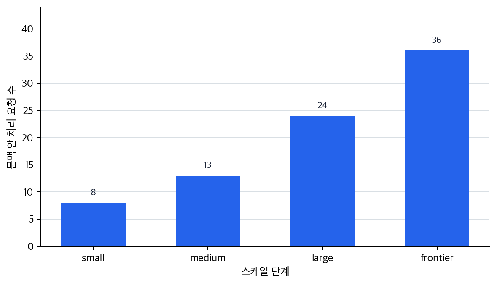
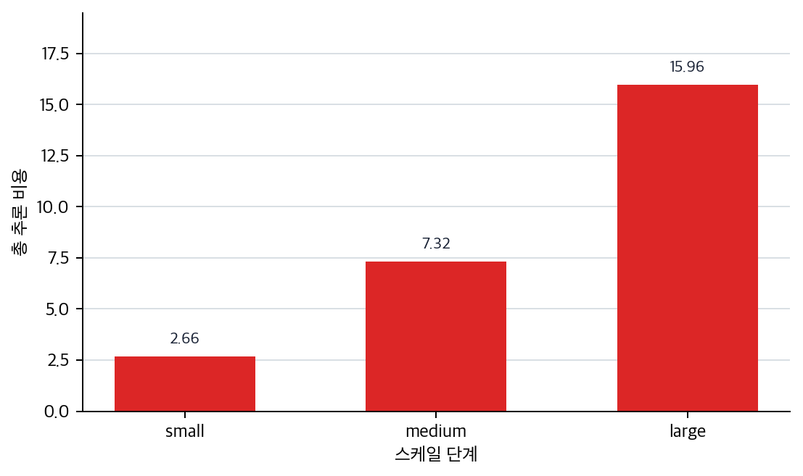
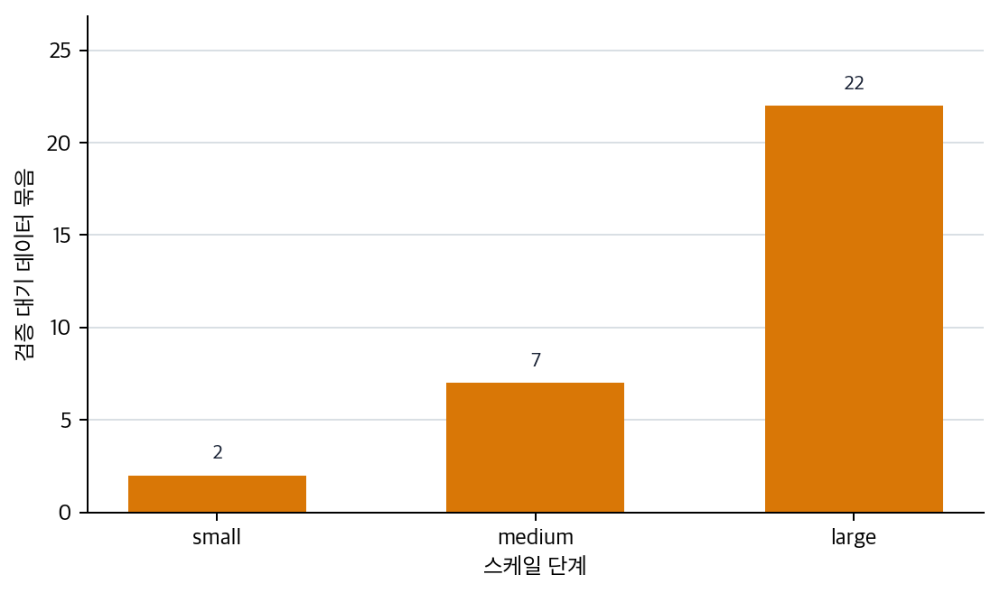

# P6-7.2 능력과 운영 부담을 함께 키우는 스케일

> Section ID: `P6-7.2`
> Version: `v2026.07.31`

P6-7.1에서는 사전학습(pretraining)을 `먼저 넓은 언어 기반을 만드는 단계`로 설명했습니다. 그러면 질문이 이어집니다. `왜 그 기반을 만들 때는 늘 큰 데이터셋, 큰 모델, 큰 계산량이 함께 따라오는가?`

즉, 이 절의 출발점은 `큰 모델이 더 좋아 보인다`가 아닙니다. 오히려 `넓은 기반을 만들려면 왜 규모가 문제로 튀어나오는가`, 그리고 `그 규모 확대가 무엇을 가능하게 하고 무엇을 부담으로 남기는가`입니다.

스케일(scale)은 데이터 양, 모델 크기, 계산량이 함께 커지는 현상을 가리키며, LLM 성능 향상과 강하게 연결되지만 비용과 위험도 함께 키운다.

## 규모 확대에서 함께 보는 기준

규모 확대 판단은 다음 질문에서 시작합니다.

- 스케일(scale)은 무엇을 뜻하는가?
- 왜 데이터, 파라미터(parameter), 계산량(compute)을 함께 보아야 하는가?
- 규모가 커지면 왜 성능이 좋아지기도 하고, 동시에 비용과 위험도 커지는가?

스케일은 `데이터, 파라미터, 계산량이 함께 커지며 성능 가능성과 비용 부담이 동시에 달라지는 구조`입니다. 이 기준이 있어야 큰 기반 모델 이야기를 단순한 성능 경쟁으로 읽지 않을 수 있습니다.

다음 토큰 예측은 `무엇을 학습 목표로 삼는가`의 문제이고, 운영 제약은 `서비스로 돌릴 때 무엇을 감당해야 하는가`의 문제입니다. 스케일은 그 사이에서 기반을 크게 만들수록 능력과 부담이 함께 커진다는 연결고리입니다.

`크면 무조건 좋다`는 인상은 피해야 합니다. P6-7.1이 `무엇을 먼저 배우는가`를 다뤘다면, 여기서는 `그 학습을 왜 그렇게 큰 규모로 돌리게 되는가`를 읽습니다. 프롬프트나 RAG 같은 서비스 연결로 넘어가기 전에, 후속 파인튜닝과 지시 튜닝이 왜 보통 `큰 기반 모델` 위에 얹히는지 판단할 수 있어야 합니다.

따라서 먼저 잡아야 할 것은 `큰 모델이 더 좋다`가 아니라 `규모가 커질수록 능력과 부담이 함께 바뀐다`는 점입니다.

## 왜 사전학습 다음에 바로 스케일을 읽는가

여기서는 `넓은 기반을 먼저 만든다`는 설명과 `그래서 큰 모델이 중요하다`는 말을 쉽게 한 덩어리로 받아들일 수 있습니다. 하지만 두 말은 같지 않습니다. P6-7.1은 `무엇을 먼저 배우는가`를 설명했고, 이 절은 `그 기반을 만들기 위해 실제로 무엇이 함께 커지는가`를 설명합니다.

이 차이를 분리해 두어야 후속 파인튜닝과 지시 튜닝도 더 정확하게 읽힙니다. 기반을 먼저 만드는 비용과 부담이 어떤 것인지 모르면, 조정 단계가 왜 보통 `처음부터 새로 다 배우기`보다 `이미 큰 기반 위에 더 얹는 방식`으로 설명되는지도 흐려지기 쉽기 때문입니다.

흐름은 이렇게 읽으면 됩니다. 앞 절에서 모델이 무엇을 먼저 배우는지 잡았다면, 여기서는 그 기반을 만들 때 데이터, 파라미터, 계산량이 왜 함께 커지는지 봅니다. 큰 기반 위에서 특정 과업과 사용자 요청을 어떻게 더 맞출지는 뒤의 파인튜닝, 지시 튜닝, 프롬프트, RAG, 운영 정책에서 다시 나눠 읽습니다.

즉, 이 절은 `큰 모델 예찬`이 아니라 `큰 기반을 만든다는 말이 실제로 어떤 능력과 비용을 같이 뜻하는가`를 읽는 자리입니다. 데이터, 파라미터, 계산량이 함께 커질 때 무엇이 좋아질 수 있는지와 성능 가능성, 비용, 위험이 왜 같이 커지는지를 먼저 구분합니다.

`큰 모델이 더 낫다`는 단순 인상을 `데이터, 파라미터, 계산량이 함께 커지며 성능 가능성과 비용 부담이 같이 커지는 구조`로 바꾸는 기준선을 여기서 세웁니다.

## 스케일이 키우는 능력과 부담의 구분

- 스케일을 데이터, 모델, 계산량의 확대라는 관점으로 설명할 수 있습니다.
- 성능 향상과 비용 증가가 함께 간다는 점을 말할 수 있습니다.
- 데이터 품질과 검증 책임이 규모와 함께 더 중요해진다는 점을 설명할 수 있습니다.
- 후속 조정과 운영 판단을 스케일의 능력·부담 균형 위에서 읽을 수 있습니다.

여기서는 두 가지를 함께 기억해야 합니다.

1. 스케일은 중요한 성능 전환 요인이다
2. 스케일은 데이터 품질, 검증, 비용, 정책 문제를 같이 키운다

이 두 가지를 함께 넣어야 바로 앞의 P6-7.1 사전학습 목표를 `왜 그렇게 큰 규모로 돌리는가`와 연결해 읽을 수 있고, 뒤의 P6-16.1, P6-17.1 평가와 운영 제약 절에서 `성능이 커질수록 비용과 통제 문제도 커진다`는 관점을 자연스럽게 이어 갈 수 있습니다. 이렇게 읽어야 Part 6의 이후 장과 Part 7 프로젝트에서도 균형 잡힌 판단이 가능합니다.

## 능력과 부담의 판단 기준

스케일은 모델 크기 하나로 판단할 수 없습니다. 규모 확대가 무엇을 가능하게 하고 무엇을 더 감당하게 만드는지 함께 봐야 합니다.

| 판단 기준 | 확인할 질문 |
| --- | --- |
| 확대되는 축 | 데이터, 파라미터, 계산량이 함께 커지는가 |
| 능력 변화 | 더 긴 문맥, 더 복합적인 요청, 더 넓은 패턴 처리가 가능해지는가 |
| 운영 부담 | 비용, 지연 시간, 장애 대응 부담이 함께 커지는가 |
| 데이터 책임 | 데이터 품질, 중복, 저작권, 편향 검토 범위도 함께 커지는가 |

## 스케일은 무엇을 함께 키우는가

LLM 문맥에서 스케일은 보통 하나만 커지는 것을 뜻하지 않습니다. 대개 다음이 함께 커집니다.

- 학습 데이터 양
- 모델 파라미터 수
- 학습 계산량(compute)

`모델을 크게 만든다는 말은 대개 더 많은 텍스트를 보고, 더 많은 파라미터를 쓰고, 더 많은 계산 자원을 투입한다는 뜻과 함께 간다.`

## 왜 규모가 커지면 성능이 좋아질 수 있나

이 질문에 대한 직관적 답은 다음과 같습니다.

- 더 많은 데이터는 더 다양한 언어 패턴을 보게 하고
- 더 큰 모델은 더 복잡한 패턴을 담을 표현력을 주며
- 더 많은 계산은 그 구조를 실제로 학습하게 해 줍니다

즉, 스케일은 단순한 크기 경쟁이 아니라 `패턴을 더 넓고 더 세밀하게 담는 조건`과 연결됩니다.

그래서 LLM 발전사에서는 모델 규모와 데이터 규모가 성능 전환과 함께 자주 언급됩니다.

## 왜 비용과 지연 시간도 함께 커지나

하지만 규모가 커질수록 좋은 점만 생기지는 않습니다.

- 학습 비용이 커집니다
- 추론 비용도 커질 수 있습니다
- 응답 지연 시간(latency)이 늘어날 수 있습니다
- 운영 복잡도와 장애 대응 부담이 커집니다

즉, 스케일은 성능 문제이면서 동시에 서비스 운영 문제입니다.

이 점은 Part 6 뒤쪽의 운영, 평가, 제약 설명과도 직접 연결됩니다.

## 데이터가 많다고 항상 좋은가

이 점을 함께 봐야 스케일이 성능을 올리는 방향과 동시에 데이터 품질, 비용, 정책 부담을 어떻게 키우는지도 같이 판단할 수 있습니다.

데이터 양이 늘어나는 것은 중요하지만, 품질 문제가 사라지는 것은 아닙니다.

예를 들어:

- 오래된 정보
- 중복 데이터
- 편향된 표현
- 저작권 문제
- 잘못된 사실

같은 문제는 데이터가 많아져도 그대로 남거나 더 커질 수 있습니다.

따라서 더 안전한 설명은 다음입니다.

`스케일은 성능 가능성을 키우지만, 데이터 품질과 검증 책임을 없애 주지는 않는다.`

## 왜 스케일이 사용자 경험을 바꾸었나

스케일이 커지면서 사용자는 다음과 같은 변화를 더 직접 느끼게 됩니다.

- 긴 문맥을 더 자연스럽게 처리하는 듯한 응답
- 더 다양한 작업 지시에 대한 반응
- zero-shot, few-shot 사용 경험의 향상
- 자연어 질의만으로도 여러 작업을 수행하는 듯한 느낌

하지만 이 역시 곧바로 `이해`나 `사실성`을 보장하는 것은 아닙니다.

즉, 스케일은 사용자 경험을 크게 바꾸지만, 검증 책임을 없애지는 않습니다.

## 스케일 판단에서 함께 커지는 것

여기까지를 가장 짧게 정리하면 다음과 같습니다.

- 스케일은 `더 넓은 패턴을 다룰 가능성`을 키웁니다.
- 동시에 `더 큰 비용과 운영 부담`도 키웁니다.
- 따라서 `더 크다`는 말은 항상 `무엇이 좋아지고 무엇을 더 감당해야 하는가`와 함께 읽어야 합니다.

## 아주 단순하게 그리면

```mermaid
--8<-- "assets/part-06/chapter-07/p6-c07-s02-scale-tradeoff-ko.mmd"
```

이 도식의 핵심은 한 가지입니다.

`스케일은 성능 가능성과 비용/위험을 함께 키운다.`

## 능력과 운영 부담을 함께 키우는 스케일: 확인할 판단 기준
아래 도식은 스케일업 결정을 `더 큰 모델이 더 좋은가`라는 한 줄 판단이 아니라 능력, 비용, 데이터 검증 부담을 함께 보는 질문으로 다시 묶은 것입니다.

```mermaid
--8<-- "assets/part-06/chapter-07/p6-c07-s02-scale-decision-ko.mmd"
```

이 도식에서 확인해야 할 점은 스케일업이 `성능 개선` 한 줄로 닫히지 않는다는 것입니다. 같은 변화라도 사용자에게는 더 긴 요청 처리로 보이고, 운영팀에게는 비용과 지연 증가로 보이며, 데이터 담당자에게는 검증해야 할 원천 데이터 증가로 보일 수 있습니다.

### 사례. 스케일업 결정 회의

고객 지원팀이 현재 쓰는 small 모델을 medium이나 large로 올릴지 회의한다고 해 봅시다. 지금 모델은 짧은 FAQ에는 빠르게 답하지만, 긴 계약서 조항을 요약하거나 코드 오류 로그를 함께 읽는 요청에서는 자주 실패합니다. 회의에서 사람이 먼저 보기 쉬운 기준은 `large로 바꾸면 더 잘하겠지`입니다. 하지만 스케일 관점에서는 먼저 질문을 나누어야 합니다.

첫째, 능력 축에서는 어떤 요청이 새로 가능해지는지 봅니다. context window가 넓어지고 모델 표현력이 커지면 긴 계약서, 긴 오류 로그, 여러 조건이 섞인 복합 요청을 더 잘 처리할 가능성이 생깁니다. 둘째, 비용 축에서는 그 요청을 처리할 때 지연 시간과 추론 비용이 얼마나 늘어나는지 봅니다. 셋째, 데이터 축에서는 더 많은 데이터로 사전학습하거나 후속 조정을 할수록 중복, 오래된 정보, 저작권, 편향 같은 품질 문제를 더 넓게 검토해야 한다는 점을 봅니다.

이 사례에서 확인해야 할 결과는 `large가 더 많은 요청을 처리할 수 있는가`만이 아닙니다. 더 많은 요청을 처리할 수 있어도 비용과 지연이 서비스 한도를 넘거나, 데이터 검증 부담을 감당하지 못하면 그 선택은 최선이 아닐 수 있습니다. 반대로 medium이 일부 긴 요청은 포기하더라도 비용과 운영 부담 안에서 충분한 개선을 줄 수 있다면, 현재 서비스에는 더 현실적인 선택일 수 있습니다.

| 스케일 단계 | 얻는 것 | 함께 감당할 것 |
| --- | --- | --- |
| `small` 유지 | 짧은 FAQ를 낮은 비용과 빠른 응답으로 처리 | 긴 계약서, 긴 코드 로그, 복합 요청은 계속 실패할 수 있음 |
| `medium` 전환 | 일부 긴 요청과 복합 요청을 더 처리할 가능성 | 비용과 지연이 늘고, 검증해야 할 데이터 범위도 커짐 |
| `large` 전환 | 긴 계약서와 코드 로그 일부까지 처리할 가능성 | 추론 비용, 지연 시간, 데이터 품질 검토 부담이 크게 늘어남 |
| `frontier` 전환 | 가장 긴 다중 문서 요청까지 문맥 안에 넣을 가능성 | 비용, 지연, 검증 부담이 가장 커져 운영 기준을 다시 세워야 함 |

이 표는 뒤의 Python 예제를 읽는 기준이 됩니다. 사례는 `왜 세 축을 함께 비교해야 하는가`를 보여 주고, 예제는 그 세 축이 단계별 숫자로 어떻게 달라지는지 확인하는 역할을 맡습니다.

## 스케일 판단이 필요한 장면

이 절을 읽은 뒤에는 아직 실제 모델 가격표나 벤치마크를 다 몰라도, 지금 필요한 것이 `더 큰 능력`인지 `비용·지연·검증 부담을 먼저 줄이는 일`인지 먼저 가르는 연습을 할 수 있습니다. 긴 계약서와 긴 로그를 함께 읽는 요청에서 자주 실패한다면, 더 큰 모델 하나로 모든 문제가 해결된다고 보기 전에 실제로 필요한 것이 더 긴 문맥과 더 큰 표현력인지 물어야 합니다. 답 품질은 괜찮아졌지만 응답이 느리고 비용이 급격히 늘었다면, 성능이 좋아졌다는 사실과 서비스 한도 안에서 비용과 지연을 감당할 수 있는지는 따로 봐야 합니다. 더 많은 데이터를 써서 성능은 올랐지만 검증해야 할 데이터 묶음이 크게 늘었다면, 지금 커진 것이 능력뿐 아니라 검증 책임과 정책 부담인지도 함께 봐야 합니다.

여기서 중요한 것은 `큰 모델이 좋다`와 `작은 모델이 싸다` 중 하나를 외우는 일이 아니라, 먼저 `무엇을 더 처리할 수 있게 되는가`와 `무엇을 더 감당해야 하는가`를 함께 읽는 일입니다.

여기서 자주 섞이는 것도 다음과 같습니다.

- 성능 향상과 운영 가능성을 같은 축으로만 보기 쉽습니다.
- 더 큰 context window가 필요한 문제와 단순 비용 문제를 구분하지 못하기 쉽습니다.
- 데이터 규모 확대를 품질 보장과 같은 말처럼 느끼기 쉽습니다.

따라서 `스케일은 성능 가능성과 비용·위험을 함께 키운다`는 문장은 실제 서비스 판단 기준이 되어야 합니다.

## 연습 및 예제

이 예제의 목표는 스케일이 커질 때 `무엇을 더 처리할 수 있게 되는가`와 `무엇을 더 감당해야 하는가`를 단계별로 나누어 보는 것입니다. 작은 모델과 큰 모델을 한 번에 비교해 승패를 고르는 방식이 아니라, `small -> medium -> large -> frontier`로 커질 때 데이터 양, 파라미터 수, 학습 계산량, 문맥 범위, 추론 비용, 검증 부담이 함께 어떻게 움직이는지 추적하겠습니다.

입력:

아래 코드는 두 입력 CSV를 사용합니다.

- 요청 목록: [p6-7-scale-requests.csv](../../../assets/part-06/chapter-07/p6-7-scale-requests.csv){ .csv-preview }
- 스케일 단계: [p6-7-scale-steps.csv](../../../assets/part-06/chapter-07/p6-7-scale-steps.csv){ .csv-preview }

요청 목록의 한 행은 하나의 사용자 요청입니다. `request_type`은 FAQ, 요약, 계약서 검토, 코드 보조, 다중 문서 요청처럼 요청 성격을 나타내고, `input_tokens`는 그 요청을 문맥 안에 넣으려 할 때 필요한 입력 길이를 단순화한 값입니다. 스케일 단계 CSV의 한 행은 하나의 모델 규모 가정이며, `context_window`, `cost_per_1k_tokens`, `latency_per_1k_tokens`, `review_batches`가 이번 예제에서 직접 바꿔 볼 조작 변수입니다.

결과에서는 스케일 단계별 처리 가능한 요청 수, 문맥 초과 요청 수와 유형, 높은 우선순위인데도 문맥을 넘는 요청 수, 총 예상 추론 비용과 지연 시간, 데이터 검증 대기 묶음 수를 확인합니다. 여기서 숫자는 특정 상용 모델의 실제 가격표나 성능표가 아니라, 스케일을 읽는 축을 분리하기 위한 운영 판단 연습용 가정값입니다.

확인할 핵심은 스케일이 데이터, 모델, 계산량이 함께 커지는 현상이라는 점입니다. context window가 커지면 더 긴 요청을 처리할 수 있지만 추론 비용과 지연 시간도 커질 수 있고, 데이터 양이 커질수록 검증해야 할 데이터 품질 부담도 함께 커집니다.

```python
# CSV 요청 목록과 스케일 단계표를 읽어 처리 가능 범위와 비용 부담을 함께 비교하는 예제입니다.
from csv import DictReader
from pathlib import Path

REQUESTS_PATH = Path("docs/assets/part-06/chapter-07/p6-7-scale-requests.csv")
STEPS_PATH = Path("docs/assets/part-06/chapter-07/p6-7-scale-steps.csv")


def load_requests(path):
    with path.open(newline="", encoding="utf-8") as f:
        return [
            {
                "request_id": row["request_id"],
                "request_type": row["request_type"],
                "input_tokens": int(row["input_tokens"]),
                "priority": row["priority"],
            }
            for row in DictReader(f)
        ]


def load_steps(path):
    with path.open(newline="", encoding="utf-8") as f:
        return [
            {
                "scale": row["scale"],
                "rank": int(row["rank"]),
                "context_window": int(row["context_window"]),
                "cost_per_1k_tokens": float(row["cost_per_1k_tokens"]),
                "latency_per_1k_tokens": float(row["latency_per_1k_tokens"]),
                "review_batches": int(row["review_batches"]),
            }
            for row in DictReader(f)
        ]


def summarize_scale_step(step, requests):
    supported = [
        request
        for request in requests
        if request["input_tokens"] <= step["context_window"]
    ]
    over_limit = [
        request
        for request in requests
        if request["input_tokens"] > step["context_window"]
    ]
    total_tokens = sum(request["input_tokens"] for request in requests)
    over_limit_types = sorted({request["request_type"] for request in over_limit})
    high_priority_over_limit = [
        request for request in over_limit if request["priority"] == "high"
    ]

    return {
        "scale": step["scale"],
        "context_window": step["context_window"],
        "supported_requests": len(supported),
        "over_limit_requests": len(over_limit),
        "over_limit_types": over_limit_types,
        "high_priority_over_limit": len(high_priority_over_limit),
        "total_inference_cost": round(
            (total_tokens / 1000) * step["cost_per_1k_tokens"],
            2,
        ),
        "total_latency": round(
            (total_tokens / 1000) * step["latency_per_1k_tokens"],
            2,
        ),
        "review_batches": step["review_batches"],
    }


requests = load_requests(REQUESTS_PATH)
steps = sorted(load_steps(STEPS_PATH), key=lambda step: step["rank"])

print(f"request_rows = {len(requests)}")
print(f"scale_steps = {len(steps)}")
for step in steps:
    print(summarize_scale_step(step, requests))
```

이 예제는 로컬 `.venv`의 Python으로 실행해 본문 출력과 일치함을 확인했습니다.

실행 결과 예시는 다음처럼 읽을 수 있습니다.

```text
request_rows = 36
scale_steps = 4
{'scale': 'small', 'context_window': 2048, 'supported_requests': 8, 'over_limit_requests': 28, 'over_limit_types': ['code_assistant', 'contract_review', 'multi_document', 'summary'], 'high_priority_over_limit': 16, 'total_inference_cost': 52.38, 'total_latency': 183.33, 'review_batches': 2}
{'scale': 'medium', 'context_window': 4096, 'supported_requests': 13, 'over_limit_requests': 23, 'over_limit_types': ['code_assistant', 'contract_review', 'multi_document', 'summary'], 'high_priority_over_limit': 16, 'total_inference_cost': 144.04, 'total_latency': 288.09, 'review_batches': 7}
{'scale': 'large', 'context_window': 8192, 'supported_requests': 24, 'over_limit_requests': 12, 'over_limit_types': ['code_assistant', 'contract_review', 'multi_document'], 'high_priority_over_limit': 12, 'total_inference_cost': 314.28, 'total_latency': 471.42, 'review_batches': 22}
{'scale': 'frontier', 'context_window': 32768, 'supported_requests': 36, 'over_limit_requests': 0, 'over_limit_types': [], 'high_priority_over_limit': 0, 'total_inference_cost': 838.08, 'total_latency': 811.89, 'review_batches': 75}
```

이 예제에서 읽어야 할 핵심은 다음입니다.

- `small`은 짧은 FAQ 8개만 문맥 안에 넣고, 나머지 28개 요청은 문맥 초과로 남습니다.
- `medium`은 일부 요약 요청까지 처리하지만, 높은 우선순위 요청 16개는 여전히 문맥 초과입니다.
- `large`는 24개 요청을 처리하지만, 긴 계약서·코드·다중 문서 요청 12개는 아직 남습니다.
- `frontier`는 36개 요청을 모두 문맥 안에 넣지만, 총 추론 비용과 지연 시간, 데이터 검증 묶음이 가장 큽니다.
- `review_batches`는 데이터 양이 커질수록 검증해야 할 묶음도 함께 커진다는 점을 단순화해 보여 줍니다.

그래프로 나누어 보면 세 축이 서로 다른 의미로 커진다는 점이 더 분명합니다. 먼저 문맥 범위가 커지면 처리 가능한 요청 수가 늘어납니다.



하지만 같은 요청 묶음을 처리할 때의 총 추론 비용도 함께 커집니다. 이 그래프에서 확인할 것은 `large`가 더 많은 요청을 처리한다는 사실이 아니라, 그 선택이 비용 증가와 함께 온다는 점입니다.



데이터 양이 커지면 검증해야 할 데이터 품질 부담도 같이 커집니다. 아래 그래프는 실제 위험 측정값이 아니라, 데이터가 많아질수록 검토해야 할 묶음도 늘어난다는 구조를 보여 주기 위한 단순화입니다.



이 예제에서는 요청 CSV의 `input_tokens`와 `priority`, 스케일 단계 CSV의 `context_window`, `cost_per_1k_tokens`, `latency_per_1k_tokens`, `review_batches`를 직접 바꿔 볼 수 있습니다. 예를 들어 긴 계약서 요청을 더 늘리면 `small`과 `medium`의 문맥 초과가 더 두드러지고, 반대로 짧은 FAQ만 남기면 `frontier`의 추가 비용이 정말 필요한지 다시 생각해 볼 수 있습니다.

## 규모-비용 균형에서 갈리는 선택

이 비교는 `더 큰 모델이 더 좋다`는 식의 단선적인 이해를 피하게 해 줍니다. 실제 선택은 언제나 능력 확대와 학습·추론 비용 증가를 함께 읽는 문제이므로, 이후 모델 선택과 운영 절에서는 규모를 `성능`, `문맥 범위`, `비용`, `지연`의 동시 판단 축으로 봐야 합니다.

LLM 시대를 이해할 때 스케일은 빠질 수 없는 주제입니다. GPT-3 이후 특히 많은 논의가 `모델이 왜 이런 능력을 보이기 시작했는가`를 스케일과 연결해 설명했습니다.

이 예제를 판단 기준으로 다시 줄이면 다음 세 질문이 먼저 떠올라야 합니다.

| 장면 | 먼저 답해야 하는 질문 |
| --- | --- |
| 왜 더 큰 모델이 어떤 요청에서는 필요해 보이는가 | 지금 실패 원인이 더 긴 문맥과 더 큰 표현력이 필요한 문제인가 |
| 왜 성능이 좋아져도 바로 운영 최적해가 되지 않는가 | 비용과 지연 시간이 서비스 한도를 넘고 있지 않은가 |
| 왜 데이터가 많아질수록 검증 부담도 같이 커지는가 | 능력 확대와 함께 품질·저작권·편향 검토 범위도 커지고 있는가 |

## 체크리스트
- 스케일을 `무엇이 좋아지는가`와 `무엇을 더 감당해야 하는가`의 쌍으로 설명할 수 있는가?
- 긴 문맥, 성능 향상, 운영 비용을 한 축에서 함께 볼 수 있는가?
- 다음 장들을 읽을 때 큰 기반 모델의 성능과 후속 조정 비용을 분리해서 볼 준비가 되었는가?

## 출처와 참고 자료

- Tom B. Brown et al., `Language Models are Few-Shot Learners`, arXiv, 2020, 확인 날짜: 2026-07-19. [https://arxiv.org/abs/2005.14165](https://arxiv.org/abs/2005.14165){: target="_blank" rel="noopener noreferrer" }
- Jared Kaplan et al., `Scaling Laws for Neural Language Models`, arXiv, 2020, 확인 날짜: 2026-07-19. [https://arxiv.org/abs/2001.08361](https://arxiv.org/abs/2001.08361){: target="_blank" rel="noopener noreferrer" }
- Jordan Hoffmann et al., `Training Compute-Optimal Large Language Models`, arXiv, 2022, 확인 날짜: 2026-07-19. [https://arxiv.org/abs/2203.15556](https://arxiv.org/abs/2203.15556){: target="_blank" rel="noopener noreferrer" }
- OpenAI Docs, `Models`, 모델별 가격·context window 예시, 확인 날짜: 2026-07-19. [https://developers.openai.com/api/docs/models](https://developers.openai.com/api/docs/models){: target="_blank" rel="noopener noreferrer" }
