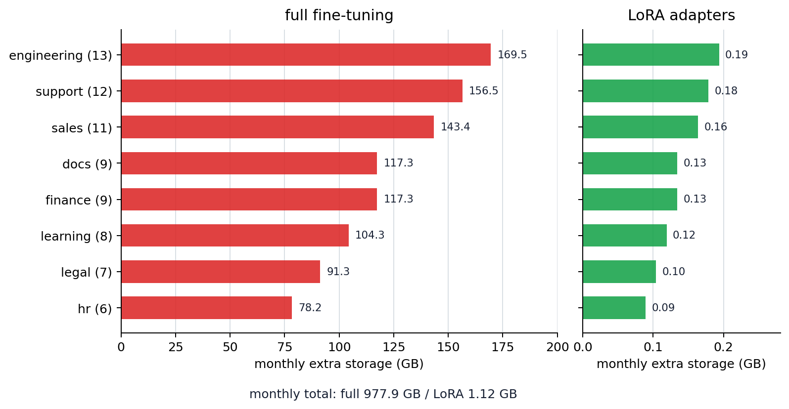

# P6-8.2 LoRA That Reduces the Burden of Full Fine-Tuning

> Section ID: `P6-8.2`
> Version: `v2026.07.23`

In P6-8.1, we saw that fine-tuning is the process of additionally adjusting a pretrained model so it fits a specific purpose better. But a realistic next question appears immediately here.

Isn't it too costly to adjust the entire huge model again every time?

This section starts from that problem.

So in practice, we do not only ask `is fine-tuning needed?`; we also ask `by what method can we handle the cost of that adjustment?`

The large flow that appears here is parameter-efficient fine-tuning. LoRA is one of the representative methods most widely mentioned within that flow.

LoRA is a method that tries to adapt efficiently through a small additional update, without greatly changing the entire huge model again.

## Criteria for Reducing Efficient Adjustment Cost

Efficient adjustment cost begins with the following questions.

- Why is parameter-efficient fine-tuning needed?
- What problem does LoRA try to reduce?
- What is the difference between full fine-tuning and efficient adjustment?

The first sense needed to understand LoRA is the idea of `reducing cost by adding only a small update on top of a large foundation model`. Low-rank formulas, which matrices receive the update, and how adapter, LoRA, and QLoRA are separated in real constraint scenes are deeper implementation judgments. Here, we first grasp the cost sense of `can we make purpose adaptation without adjusting the whole thing again?`

Before distinguishing names such as adapter, LoRA, and QLoRA, what matters first is `what is kept as is and what alone is newly learned`. LoRA should be understood not as a `small model`, but as a `method that adds a small update on top of a large foundation model`.

Therefore, the core is not `make the model small`, but `adapt the same large foundation model with lower adjustment cost`. In this section, we grasp why full fine-tuning can become too heavy and the idea of keeping a large foundation model while adding only a small adaptation. The intuition behind the name LoRA and the scale sense of low rank continue in P6-9.4, and the detailed constraint distinction between adapter, LoRA, and QLoRA continues in P6-9.5.

The misunderstanding of `a lightweight small model` should be reread as `a method that reduces adaptation cost by adding only a small update on top of a large foundation model`.

## Distinguishing Full Weight Adjustment and Small Deltas

- You can explain why efficient adjustment is needed.
- You can say the basic idea of LoRA at an introductory level.
- You can conceptually distinguish the cost difference between full fine-tuning and LoRA.
- You can connect it to later explanations of instruction tuning or domain adaptation.

This criterion is needed for the following reasons.

- because it prevents us from immediately understanding P6-8.1 fine-tuning only as `training the whole model again`
- because it makes us think about cost and structure choices together in practical LLM services
- because it creates the basis for reading `model adjustment cost` in later sections such as P6-9.1 instruction tuning, P6-9.2 alignment, and P6-17.1 service operation constraints

## Judgment Criteria for Efficient Adjustment

Efficient adjustment is a problem separate from whether fine-tuning is needed: it asks by what cost structure that adjustment should be handled.

| Judgment Criterion | Question to Check |
| --- | --- |
| Adjustment range | Even if fine-tuning is needed, must the whole model be adjusted? |
| What to keep | Can the foundation model body be kept and only a small update be newly learned? |
| Operational cost | Are training cost, storage, and version-management burden the bottleneck? |
| Experiment method | Must several purpose adaptations be compared quickly on top of the same foundation model? |

## Why Is Efficient Adjustment Needed?

The direction of fine-tuning seen in P6-8.1 is natural. The problem is that LLMs are too large.

If we try to update all model weights, the following burdens immediately grow.

- memory use
- training time
- storage space
- cost of managing several versions

In practice, on top of the same foundation model, we may want to adjust for several purposes such as:

- customer-center use
- search assistance
- document summarization
- code assistance

Each time, adjusting and storing the whole model again can be very inefficient.

In other words, the thought `we want to change the model to fit our purpose` is right, but its cost can grow too large.

At this point, the flow bends once.

- The question in P6-8.1: `Should we adjust the model more for our purpose?`
- The question in P6-8.2: `Can we do that adjustment without changing the entire model again?`

In other words, LoRA is not a method from a completely different world competing with fine-tuning, but the next option that arises from the reality that `fine-tuning is needed, but touching everything is too heavy`.

So the next question naturally follows.

`Can we make only the needed purpose adaptation more lightly without retraining the entire foundation model every time?`

## What Does LoRA Try to Do?

LoRA is a representative answer to this question.

If we reduce the core idea very simply, it is as follows.

`Instead of rewriting the whole original large weight, learn and attach only a small additional update.`

So LoRA is closer to `reduce the burden of fine-tuning` than to `give up fine-tuning`.

If we translate this sentence into more practical terms, it becomes the following.

- full fine-tuning: `the body is also largely readjusted`
- LoRA: `the body is preserved as much as possible, and only a small adaptation is additionally learned`

Therefore, LoRA should be read by first grasping `what is kept as is and what alone is newly learned`, before low-rank formulas.

To unpack it a little more:

- keep the base model largely fixed
- separately learn only small adjustment parameters
- add responses for a specific purpose

So it is better to understand LoRA not as `a method for making a new model from scratch`, but as `a method for efficiently adapting one large foundation model to several purposes`.

## What Is Different From Full Fine-Tuning?

| Method | Core Difference |
| --- | --- |
| full fine-tuning | directly updates many weights |
| LoRA | updates mainly a small additional adjustment |

You can remember it as follows.

`Full fine-tuning directly and largely modifies the body, while LoRA creates purpose adaptation by placing a small adjustment module on top of the body.`

## Why Is It Attractive in Practice?

Methods like LoRA are attractive for the following reasons.

- cost is relatively lower
- the same foundation model is easier to reuse
- purpose-specific adjusted versions are easier to manage separately
- experiment speed is easier to increase

In other words, LoRA is not just a theoretical idea, but an option connected to the `operational reality of LLMs`.

## What Should We Be Careful About?

But LoRA is not万能 either.

- It may not always be best for every task.
- Because the adjustment range is limited, it may fit less than full fine-tuning.
- Data quality problems still remain.
- Choosing it only because it is `lightweight` without evaluation is risky.

A safer explanation is as follows.

`LoRA is a strong practical option that improves cost and flexibility, but it does not replace quality verification.`

## Adjustment Cost Reduced by LoRA

If we summarize this so far in the shortest form, it is as follows.

- Full fine-tuning is close to `largely readjusting the body`.
- LoRA is close to `keeping the body as much as possible and learning only a small update`.
- Therefore, the core of LoRA is not `a small model`, but `an operational method for adapting a large foundation model more lightly`.

## If We Draw It Very Simply

```mermaid
--8<-- "assets/part-06/chapter-08/p6-c08-s02-lora-flow-en.mmd"
```

The core of this diagram is conceptually separating the foundation model body from the small update.

## Cases and Examples

The diagram below groups the three cases in this section around the common question `how many purpose adaptations can be handled while keeping the same foundation model?`, rather than `is it lighter?`

```mermaid
--8<-- "assets/part-06/chapter-08/p6-c08-s02-lora-cases-en.mmd"
```

What we should confirm from this diagram is that LoRA's advantage does not end at simply `having fewer parameters`. We also need to see the operational flow of reusing the same foundation model, running more adaptation experiments within limited resources, and managing several work-specific adjusted versions more lightly.

### Case 1. Same Foundation Model, Different Work

Suppose a company experiments with customer replies, document summaries, and code assistance using one foundation model. People first tend to think that if the work differs, the whole model also needs to be made separately. If we insist only on full fine-tuning, then in practice we make a huge model copy for each work type and store each training result again. Then whenever one new work type is added, cost and version-management burden grow together. For example, even when running one more summarization experiment, a result of several GB to tens of GB may need to be separately managed.

The LoRA approach creates a flow where the foundation model body is shared and only small updates are attached and managed separately by work type. What changes here is moving from the criterion `does every work type need its own body model?` to the criterion `can only the updates be separated and managed on top of the same body?` So on top of the same foundation model, adjusted versions for `customer replies`, `summaries`, and `code` can be divided and experimented with more lightly. So the result to check in this case is whether version-management burden actually decreases by swapping purpose-specific updates without increasing the number of huge model copies as the number of work types grows.

| Question | Full Fine-Tuning Picture | LoRA Picture |
| --- | --- | --- |
| To operate customer replies and summaries together | manage a large model artifact separately for each work type | one shared foundation model plus separated updates by work type |
| When one more work type appears | large copies and training results grow together | respond mainly by adding a small update |
| When tracking version differences | the whole body difference must be handled together | first look at differences in purpose-specific updates |

### Case 2. A Team With Strong Cost Constraints

Suppose a small startup wants to test an internal document-summarization model but has a tight GPU budget. People first tend to think, `Isn't full fine-tuning the proper way to improve performance?` But if full fine-tuning is attempted, memory use and storage space during training quickly grow, making even one experiment burdensome. For example, if no resources remain to rerun after the first experiment fails, the experimentation culture itself can be blocked before performance is discussed. What this team may need first is more likely `can we start and compare experiments?` than `best performance`.

LoRA lets the team experiment mainly with small updates without readjusting the whole model, placing this first attempt within a more realistic cost. What changes here is moving from the criterion `does it immediately produce the highest performance?` to the criterion `can we start and repeat experiments within limited resources?` So for a resource-tight team, the choice `first check whether purpose adaptation is possible with LoRA` naturally appears. So the result to check in this case is not one best-performance number, but whether the team can actually start the first experiment within a limited GPU budget and continue to comparative experiments after failure.

| What This Team Checks First | Where Full Fine-Tuning Alone Can Get Blocked | Option LoRA Opens |
| --- | --- | --- |
| Can the first experiment start? | memory and storage burden make the attempt itself heavy | lower the entry barrier with a smaller update |
| Can it be rerun after failure? | one failure is costly, making retry difficult | try a few more comparison experiments more easily |
| Is operational feasibility present before best score? | resources may be exhausted before performance discussion | verify feasibility first within limited resources |

### Case 3. Fast Comparison Experiments

Suppose an operations team compares what works better with the same foundation model among `stabilizing answer format`, `reflecting internal terminology`, and `maintaining a specific domain style`. People may first want to adjust it once, largely, and finish. But in practice, the process of quickly running and discarding several adjustment directions is often more important than finding one correct answer from the beginning. If only full fine-tuning is used, preparation time and storage cost grow each time one experiment runs, reducing the number of comparison rotations. For example, if all three adjustment hypotheses must be tested within a week, comparison itself can be delayed if one experiment is too heavy.

Because LoRA makes it relatively easy to create several small adjusted versions and attach or detach them, it fits the flow of comparing which adjustment is actually valuable more quickly. What changes here is moving from the criterion `did we fit it largely once?` to the criterion `can we compare more adjustment hypotheses in the same period?` So LoRA's advantage does not stop at `theoretically lightweight`; it continues into the operational sense that `experiment rotation count is easier to increase`. So the result to check in this case is whether more adjustment hypotheses can actually be run and turned into a comparison table in the same period, rather than holding one adjustment for a long time.

If we group the three cases again from the operational-efficiency perspective, we get the following.

| Situation | What Is Likely to Grow With Full Fine-Tuning | Burden LoRA Tries to Reduce |
| --- | --- | --- |
| Same foundation model, different work | number of model copies and version-management cost | shared body reuse, separated small updates |
| Team with strong cost constraints | first-experiment entry cost and retry burden | possibility of starting within limited resources |
| Fast comparison experiments | experiment preparation time and storage | hypothesis rotation count and comparison speed |

## Scenes Where LoRA Judgment Is Needed

After reading this section, even if you do not yet know low-rank formulas or QLoRA details, you can first distinguish whether what is needed now is `largely readjusting the entire model` or `quickly running experiments with small adaptations`. If several work-specific adjusted versions must be made with the same foundation model, instead of thinking that each work type needs a whole large model, you should see whether small updates can be separated and managed instead of copying the body. If the GPU budget is tight and the first experiment itself is heavy, being able to start and repeat experiments may come before the highest performance number. If several adjustment hypotheses must be compared within one week, hypothesis rotation count and comparison speed may be more important bottlenecks than one large adjustment.

What matters here is not memorizing that `LoRA is lighter`, but first reading `what is the bottleneck?` by separating it into `memory`, `storage`, `version management`, and `experiment rotation speed`.

The things often mixed here are as follows.

- It is easy to misunderstand LoRA as a `small model`.
- It is easy to see quality problems and operational cost problems as the same question.
- It is easy to feel that whether full fine-tuning is possible and whether full fine-tuning is always best are the same thing.

Therefore, the sentence `LoRA is an operational method for adapting a large foundation model more lightly` should become a practical selection criterion.

## Exercise and Example

The goal of this example is to directly see what difference `full fine-tuning` and the `LoRA approach` make when operating several work-specific adjusted versions. Instead of manually counting three work types, we will read a list of purpose-adaptation experiments planned by several teams for one month, and compare the additional storage burden when using full fine-tuning versus LoRA updates.

The input file is [P6-8.2 purpose-adaptation portfolio](../../../assets/part-06/chapter-08/p6-8-2-adaptation-portfolio.csv){ .csv-preview }. One row means one purpose-adaptation task reviewed by one team. The core columns are `team`, `task`, `monthly_experiments`, and `expected_change`. Here, we do not predict quality scores by work type; we only look at the structure of storage and version-management burden when several adjustment experiments must be repeated on top of the same foundation model.

The code below reads the CSV and sums monthly experiment counts by team. In the result, it compares the additional storage size when storing a large artifact for every full fine-tuning experiment and when storing only a small LoRA update.

The key point to confirm is that full fine-tuning and PEFT/LoRA-style methods create a large management-cost gap as the number of work types grows. LoRA-style methods keep additional training and storage much smaller than full fine-tuning as the number of work types increases.

```python
import csv
from pathlib import Path

# Changing monthly_experiments in the CSV changes the assumed experiment rotation count by team.
portfolio_path = Path("docs/assets/part-06/chapter-08/p6-8-2-adaptation-portfolio.csv")

base_model_params = 7_000_000_000
full_finetuning_trainable_per_task = 7_000_000_000
lora_trainable_per_task = 8_000_000  # Changing this value changes the assumed size of each work-specific LoRA update.

# Assumes roughly 2 bytes per parameter based on float16.
bytes_per_param = 2

def to_gb(param_count):
    return param_count * bytes_per_param / (1024 ** 3)

team_summary = {}
with portfolio_path.open(newline="", encoding="utf-8") as file:
    for row in csv.DictReader(file):
        team = row["team"]
        monthly_experiments = int(row["monthly_experiments"])
        summary = team_summary.setdefault(
            team,
            {"task_count": 0, "monthly_runs": 0, "sample_tasks": []},
        )
        summary["task_count"] += 1
        summary["monthly_runs"] += monthly_experiments
        if len(summary["sample_tasks"]) < 2:
            summary["sample_tasks"].append(row["task"])

print(f"base model: {base_model_params:,} parameters")
print("team        | tasks | monthly_runs | full_storage_gb | lora_storage_gb | gap | sample_tasks")
print("-" * 104)

total_runs = 0
total_full_storage_gb = 0
total_lora_storage_gb = 0

for team, summary in sorted(
    team_summary.items(),
    key=lambda item: item[1]["monthly_runs"],
    reverse=True,
):
    monthly_runs = summary["monthly_runs"]
    total_runs += monthly_runs

    full_trainable = full_finetuning_trainable_per_task * monthly_runs
    lora_trainable = lora_trainable_per_task * monthly_runs
    full_storage_gb = to_gb(full_trainable)
    lora_storage_gb = to_gb(lora_trainable)
    gap_ratio = round(full_trainable / lora_trainable)

    total_full_storage_gb += full_storage_gb
    total_lora_storage_gb += lora_storage_gb

    print(
        f"{team:<11} | "
        f"{summary['task_count']:>5} | "
        f"{monthly_runs:>12} | "
        f"{full_storage_gb:>15.2f} | "
        f"{lora_storage_gb:>15.2f} | "
        f"{gap_ratio:>3}x | "
        f"{', '.join(summary['sample_tasks'])}"
    )

print("-" * 104)
print(
    f"monthly total: {total_runs} runs, "
    f"full={total_full_storage_gb:.2f} GB, "
    f"LoRA={total_lora_storage_gb:.2f} GB"
)
```

This example was run with the local `.venv` Python environment and checked against the output in the body.

The execution result example can be read as follows.

```text
base model: 7,000,000,000 parameters
team        | tasks | monthly_runs | full_storage_gb | lora_storage_gb | gap | sample_tasks
--------------------------------------------------------------------------------------------------------
engineering |     5 |           13 |          169.50 |            0.19 | 875x | bug_triage_comment, code_review_reply
support     |     5 |           12 |          156.46 |            0.18 | 875x | refund_policy_answer, subscription_cancel_reply
sales       |     5 |           11 |          143.42 |            0.16 | 875x | lead_reply_draft, proposal_summary
docs        |     5 |            9 |          117.35 |            0.13 | 875x | contract_summary, meeting_note_cleanup
finance     |     5 |            9 |          117.35 |            0.13 | 875x | expense_policy_answer, monthly_report_summary
learning    |     5 |            8 |          104.31 |            0.12 | 875x | course_qna_reply, quiz_feedback_explain
legal       |     5 |            7 |           91.27 |            0.10 | 875x | risk_clause_check, privacy_question_answer
hr          |     5 |            6 |           78.23 |            0.09 | 875x | interview_feedback_summary, policy_question_answer
--------------------------------------------------------------------------------------------------------
monthly total: 75 runs, full=977.89 GB, LoRA=1.12 GB
```

This example does not claim figures for a specific real product. It simply lets readers directly check the following sense.

- Even with the same foundation model, if adjustment experiments repeat across several teams, full fine-tuning can quickly grow the monthly artifact-management burden.
- `monthly_runs` is the number of purpose-adaptation experiments that team must repeatedly check during one month. Even with the same number of tasks, if the experiment rotation count is high, the storage and version-management burden grows more.
- `gap` shows how far apart the number of parameters to train with full fine-tuning and the number of parameters in LoRA updates become under this example's assumptions.
- The monthly totals split into `full=977.89 GB` and `LoRA=1.12 GB` not because LoRA skips quality verification, but because the foundation model body is shared and only small updates are separately managed.

In this example, you can change `monthly_experiments` in the CSV to see a situation where experiment rotation count increases, or change `lora_trainable_per_task` in the code to assume that each work-specific update becomes larger. Whichever value changes, the question to check is the same. Full fine-tuning is a structure that repeatedly creates and manages large artifacts, while LoRA is a structure that repeatedly attaches and compares small updates on top of the same foundation model.

The chart below redraws the same CSV input by each team's monthly experiment count. The left panel is the monthly additional storage size for full fine-tuning, and the right panel is the monthly additional storage size when only LoRA updates are stored. The axis ranges differ because the LoRA bars need to be visible; the core is to read which teams have many experiment rotations and how those rotations translate into storage and version-management burden.



## Scale Difference Seen in Adjustment Cost Reduction

The purpose of this example is not to memorize LoRA numbers. The core is the sense that `it is possible to add only the needed change without touching the whole model again`, and that point changes experiment speed, memory burden, and deployment strategy together.

LoRA is not a one-off technology that suddenly appeared, but part of a flow that tries to adapt large pretrained models for a purpose at lower cost. Families such as adapter, prefix tuning, and prompt tuning also appear in this flow.

## Checklist
- Can you explain why `fine-tuning is needed` and `the whole model must be adjusted again` are not the same statement?
- Can you explain LoRA as `keep the body + learn a small update`?
- When reading instruction tuning and alignment, can you separate LoRA not as a separate purpose, but as an implementation option that reduces adjustment cost?

## Sources and References

- Neil Houlsby et al., `Parameter-Efficient Transfer Learning for NLP`, ICML, 2019, accessed 2026-07-19. [https://proceedings.mlr.press/v97/houlsby19a.html](https://proceedings.mlr.press/v97/houlsby19a.html){: target="_blank" rel="noopener noreferrer" }
- Edward J. Hu et al., `LoRA: Low-Rank Adaptation of Large Language Models`, arXiv, 2021, accessed 2026-07-19. [https://arxiv.org/abs/2106.09685](https://arxiv.org/abs/2106.09685){: target="_blank" rel="noopener noreferrer" }
- Hugging Face, `PEFT` documentation, accessed 2026-07-19. [https://huggingface.co/docs/peft/index](https://huggingface.co/docs/peft/index){: target="_blank" rel="noopener noreferrer" }
