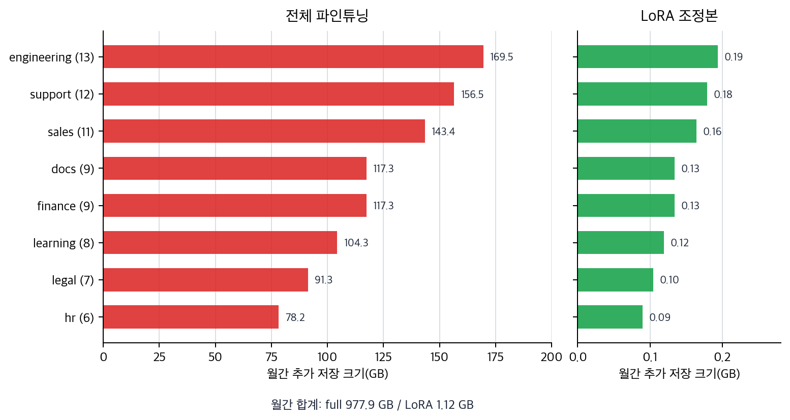

# P6-8.2 LoRA는 왜 전체 파인튜닝 부담을 줄이려 하는가

> Section ID: `P6-8.2`
> Version: `v2026.07.21`

P6-8.1에서는 파인튜닝(fine-tuning)이 사전학습된 모델을 특정 목적에 더 잘 맞게 추가 조정하는 과정이라는 점을 보았습니다. 하지만 여기서 바로 현실적인 다음 질문이 생깁니다.

거대한 모델 전체를 매번 다시 조정하는 것은 비용이 너무 크지 않은가?

이 절은 그 문제에서 출발합니다.

그래서 실무에서는 `파인튜닝이 필요한가`만 묻지 않고, `그 조정을 어떤 방식으로 해야 비용을 감당할 수 있는가`도 함께 묻게 됩니다.

이때 등장하는 큰 흐름이 효율적 조정(parameter-efficient fine-tuning)입니다. LoRA는 그 흐름 안에서 가장 널리 언급되는 대표적인 방법 중 하나입니다.

LoRA는 거대한 모델 전체를 다시 크게 바꾸지 않고, 작은 추가 조정분을 통해 효율적으로 적응시키려는 방법입니다.

## 효율적 조정 비용이 다루는 질문

효율적 조정 비용은 다음 질문에서 시작합니다.

- 왜 효율적 조정(parameter-efficient fine-tuning)이 필요한가?
- LoRA는 어떤 문제를 줄이려는가?
- 전체 파인튜닝과 효율적 조정은 어떤 차이가 있는가?

LoRA를 이해할 때 먼저 필요한 감각은 `큰 기반 모델 위에 작은 조정분만 더해 비용을 줄이는 발상`입니다. low-rank 수식, 어느 행렬에 조정분이 붙는지, adapter·LoRA·QLoRA를 실제 제약 장면에서 어떻게 나누는지는 더 깊은 구현 판단입니다. 여기서는 먼저 `전체를 다 다시 조정하지 않아도 목적 적응을 만들 수 있는가`라는 비용 감각을 잡습니다.

adapter, LoRA, QLoRA의 이름 구분보다 먼저 중요한 것은 `무엇을 그대로 두고 무엇만 새로 학습하는가`입니다. LoRA는 `작은 모델`이 아니라 `큰 기반 모델 위에 작은 조정 층을 더하는 방식`으로 이해해야 합니다.

따라서 핵심은 `모델을 작게 만든다`가 아니라 `같은 큰 기반 모델을 더 적은 조정 비용으로 적응시킨다`는 점입니다. 이 절에서는 전체 파인튜닝이 왜 너무 무거워질 수 있는지와, 큰 기반 모델을 유지한 채 작은 적응분만 더하는 발상을 잡습니다. low-rank 수식과 세부 메모리 계산, instruction tuning이나 도메인 적응에서 이 방식을 어떻게 조합할지는 뒤의 보충학습과 운영 판단으로 남겨 둡니다.

`가벼운 작은 모델`이라는 오해는 `큰 기반 모델 위에 작은 조정분만 더해 적응 비용을 줄이는 방식`으로 바꾸어 읽어야 합니다.

## 여기서 남겨야 할 구분

- 효율적 조정이 왜 필요한지 설명할 수 있습니다.
- LoRA의 기본 아이디어를 입문 수준에서 말할 수 있습니다.
- 전체 파인튜닝과 LoRA의 비용 차이를 개념적으로 구분할 수 있습니다.
- 이후 instruction tuning이나 도메인 적응 설명과 연결할 수 있습니다.

이 기준이 필요한 이유는 다음과 같습니다.

- 바로 앞의 P6-8.1 파인튜닝을 곧바로 `전체 모델 다시 학습`으로만 이해하지 않게 하고
- LLM 서비스 실무에서 비용과 구조 선택을 같이 생각하게 하며
- 이후 P6-9.1 instruction tuning, P6-9.2 alignment, P6-17.1 서비스 운영 제약 절에서 `모델 조정 비용`을 읽는 기반을 만들기 때문입니다

## 효율적 조정의 판단 기준

효율적 조정은 파인튜닝이 필요한지와 별개로, 그 조정을 어떤 비용 구조로 감당할 것인지 묻는 문제입니다.

| 판단 기준 | 확인할 질문 |
| --- | --- |
| 조정 범위 | 파인튜닝이 필요하더라도 전체 모델을 다 조정해야 하는가 |
| 유지할 부분 | 기반 모델 본체를 유지하고 작은 조정분만 새로 학습할 수 있는가 |
| 운영 비용 | 학습 비용, 저장 공간, 버전 관리 부담이 병목인가 |
| 실험 방식 | 같은 기반 모델 위에서 여러 목적 적응을 빠르게 비교해야 하는가 |

## 왜 효율적 조정이 필요하나

P6-8.1에서 본 파인튜닝의 방향 자체는 자연스럽습니다. 문제는 LLM이 너무 크다는 데 있습니다.

모델 전체 가중치를 모두 업데이트하려 하면 다음 부담이 곧바로 커집니다.

- 메모리 사용량
- 학습 시간
- 저장 공간
- 여러 버전 관리 비용

실무에서는 같은 기반 모델을 바탕으로:

- 고객센터용
- 검색 보조용
- 문서 요약용
- 코드 도우미용

처럼 여러 목적에 맞춰 조정하고 싶을 수 있습니다. 이때 매번 전체 모델을 새로 조정하고 저장하는 것은 매우 비효율적일 수 있습니다.

즉, `모델을 우리 목적에 맞게 바꾸고 싶다`는 생각은 맞지만, 그 비용이 너무 커질 수 있습니다.

이 지점에서 흐름이 한 번 꺾입니다.

- P6-8.1의 질문: `우리 목적에 맞게 모델을 더 조정해야 하는가?`
- P6-8.2의 질문: `그 조정을 모델 전체를 다시 바꾸지 않고도 할 수 있는가?`

즉, LoRA는 파인튜닝과 경쟁하는 전혀 다른 세계의 방법이 아니라, `파인튜닝은 필요하지만 전체를 다 건드리기는 너무 무겁다`는 현실에서 나온 다음 선택지입니다.

그래서 다음 질문이 자연스럽게 이어집니다.

`기반 모델 전체를 매번 다시 학습하지 않고도, 필요한 목적 적응만 더 가볍게 만들 수는 없을까?`

## LoRA는 무엇을 하려 하나

LoRA는 바로 이 질문에 대한 대표적인 답입니다.

핵심 생각을 아주 단순하게 줄이면 다음과 같습니다.

`원래 큰 가중치 전체를 크게 다시 쓰지 말고, 작은 추가 조정분만 학습해서 붙이자.`

즉 LoRA는 `파인튜닝을 포기하자`가 아니라, `파인튜닝의 부담을 줄이자`에 더 가깝습니다.

이 문장을 더 실무적으로 바꾸면 다음과 같습니다.

- 전체 파인튜닝: `본체도 같이 크게 다시 조정한다`
- LoRA: `본체는 최대한 유지하고 작은 적응분만 추가로 학습한다`

따라서 LoRA는 low-rank 수식보다 `무엇을 그대로 두고, 무엇만 새로 배우는가`를 먼저 잡고 읽어야 합니다.

조금 더 풀어 쓰면 다음과 같습니다.

- 기반 모델(base model)은 크게 유지하고
- 작은 조정 파라미터만 따로 학습해
- 특정 목적 반응을 덧붙이는 방식입니다

그래서 LoRA는 `새 모델을 처음부터 따로 만드는 방법`이 아니라, `하나의 큰 기반 모델을 여러 목적에 효율적으로 적응시키는 방법`으로 이해하는 편이 좋습니다.

## 전체 파인튜닝과 무엇이 다른가

| 방식 | 핵심 차이 |
| --- | --- |
| 전체 파인튜닝(full fine-tuning) | 많은 가중치를 직접 업데이트 |
| LoRA | 작은 추가 조정분 중심으로 업데이트 |

다음처럼 기억하면 됩니다.

`전체 파인튜닝은 본체를 직접 크게 고치는 방식이고, LoRA는 본체 위에 작은 조정 모듈을 얹어 목적 적응을 만드는 방식이다.`

## 왜 실무에서 매력적인가

LoRA 같은 방식이 매력적인 이유는 다음과 같습니다.

- 비용이 상대적으로 적습니다
- 같은 기반 모델을 재사용하기 쉽습니다
- 목적별 조정본을 따로 관리하기 쉽습니다
- 실험 속도를 높이기 쉽습니다

즉, LoRA는 단순한 이론 아이디어가 아니라, `LLM 운영 현실`과 연결된 선택지입니다.

## 무엇을 조심해야 하나

하지만 LoRA도 만능은 아닙니다.

- 모든 과업에서 항상 최선은 아닐 수 있습니다
- 조정 범위가 제한되므로 전체 파인튜닝보다 덜 맞을 수도 있습니다
- 데이터 품질 문제는 여전히 남습니다
- 평가 없이 `가볍다`는 이유만으로 선택하면 위험합니다

더 안전한 설명은 다음입니다.

`LoRA는 비용과 유연성을 개선하는 강한 실무 선택지이지만, 품질 검증을 대신하지는 않는다.`

## 여기까지를 한 줄로 묶으면

여기까지를 가장 짧게 정리하면 다음과 같습니다.

- 전체 파인튜닝은 `본체를 크게 다시 조정하는 방식`에 가깝습니다.
- LoRA는 `본체는 최대한 유지하고 작은 조정분만 학습하는 방식`에 가깝습니다.
- 따라서 LoRA의 핵심은 `작은 모델`이 아니라 `큰 기반 모델을 더 가볍게 적응시키는 운영 방식`입니다.

## 아주 단순하게 그리면

```mermaid
--8<-- "assets/part-06/chapter-08/p6-c08-s02-lora-flow-ko.mmd"
```

이 도식의 핵심은 기반 모델 본체와 작은 조정분을 개념적으로 분리해 보는 데 있습니다.

## 사례 및 예시

아래 도식은 이 절의 세 사례를 `더 가볍다`보다 `같은 기반 모델을 유지한 채 얼마나 많은 목적 적응을 감당할 수 있는가`라는 공통 질문으로 다시 묶은 것입니다.

```mermaid
--8<-- "assets/part-06/chapter-08/p6-c08-s02-lora-cases-ko.mmd"
```

이 도식에서 확인해야 할 점은 LoRA의 장점이 단순히 `파라미터 수가 적다`에서 끝나지 않는다는 것입니다. 같은 기반 모델을 재사용하고, 제한된 자원 안에서 더 많은 적응 실험을 돌리고, 여러 업무용 조정본을 더 가볍게 관리할 수 있다는 운영 흐름까지 함께 봐야 합니다.

### 사례 1. 같은 기반 모델, 다른 업무

한 회사가 하나의 기반 모델로 고객 응답, 문서 요약, 코드 보조를 모두 실험한다고 해 봅시다. 사람은 업무가 다르면 모델도 통째로 따로 만들어야 한다고 먼저 생각하기 쉽습니다. 전체 파인튜닝만 고집하면 실제로 업무마다 거대한 모델 복사본을 따로 만들고, 학습 결과도 각각 다시 저장해야 합니다. 이렇게 되면 새 업무 하나를 추가할 때마다 비용과 버전 관리 부담이 함께 커집니다. 예를 들어 요약 실험 하나를 더 돌릴 때도 수 GB~수십 GB 규모의 결과물을 별도 관리해야 할 수 있습니다.

LoRA 방식은 기반 모델 본체는 공통으로 두고, 업무마다 작은 조정분만 따로 붙여 관리하는 흐름을 만듭니다. 여기서 바뀌는 점은 `업무마다 본체 모델을 따로 가져야 하는가`를 보던 기준에서 `같은 본체 위에 조정분만 분리해 관리할 수 있는가`를 보는 기준으로 이동한다는 것입니다. 그래서 같은 기반 모델 위에 `고객 응답용`, `요약용`, `코드용` 조정본을 더 가볍게 나눠 실험할 수 있습니다. 그래서 이 사례에서 확인해야 할 결과는 업무 수가 늘어나도 거대한 모델 복사본 수를 함께 늘리지 않고, 목적별 조정본만 바꿔 끼우는 방식으로 실제 버전 관리 부담이 줄어드는가입니다.

| 질문 | 전체 파인튜닝 쪽 그림 | LoRA 쪽 그림 |
| --- | --- | --- |
| 고객 응답용과 요약용을 같이 운영하려면 | 업무마다 큰 모델 결과물을 따로 관리 | 공통 기반 모델 하나에 업무별 조정본만 분리 |
| 새 업무가 하나 더 생기면 | 큰 복사본과 학습 결과가 함께 늘어남 | 작은 조정본 추가 중심으로 대응 |
| 버전 차이를 추적할 때 | 본체 전체 차이를 같이 다뤄야 함 | 목적별 조정분 차이를 먼저 보면 됨 |

### 사례 2. 비용 제약이 큰 팀

작은 스타트업이 사내 문서 요약 모델을 시험해 보려는데 GPU 예산이 넉넉하지 않다고 해 봅시다. 사람은 먼저 `성능을 높이려면 전체 파인튜닝이 정석 아닌가`라고 생각하기 쉽습니다. 하지만 전체 파인튜닝을 시도하면 학습 중 메모리 사용량과 저장 공간이 금방 커져 한 번의 실험 자체가 부담이 될 수 있습니다. 예를 들어 첫 실험이 실패해도 다시 돌려 볼 자원이 남지 않으면, 성능 논의 이전에 실험 문화 자체가 막힐 수 있습니다. 이 팀이 먼저 필요한 것은 `최고 성능`보다도 `실험을 시작하고 비교해 볼 수 있는가`일 가능성이 높습니다.

LoRA는 전체 모델을 전부 다시 조정하지 않고 작은 조정분 위주로 실험하게 해 이런 첫 시도를 더 현실적인 비용 안에 넣어 줍니다. 여기서 바뀌는 점은 `가장 높은 성능을 바로 내는가`를 보던 기준에서 `제한된 자원 안에서 실험을 시작하고 반복할 수 있는가`를 보는 기준으로 이동한다는 것입니다. 그래서 자원이 빠듯한 팀에서는 `일단 LoRA로 목적 적응 가능성을 본다`는 선택이 자연스럽게 나옵니다. 그래서 이 사례에서 확인해야 할 결과는 최고 성능 수치 하나보다, 제한된 GPU 예산 안에서 실제로 첫 실험을 시작하고 실패 후 다시 비교 실험까지 이어 갈 수 있는가입니다.

| 이 팀이 먼저 확인할 것 | 전체 파인튜닝만 고집할 때 막히기 쉬운 지점 | LoRA가 열어 주는 선택지 |
| --- | --- | --- |
| 첫 실험을 시작할 수 있는가 | 메모리와 저장 부담이 커서 시도 자체가 무거움 | 더 작은 조정분으로 진입 장벽을 낮춤 |
| 실패 후 다시 돌릴 수 있는가 | 한 번 실패 비용이 커 재시도가 어려움 | 비교 실험을 몇 번 더 시도하기 쉬움 |
| 최고 점수보다 운영 가능성이 있는가 | 성능 논의 전에 자원 고갈이 먼저 올 수 있음 | 제한 자원 안에서 가능성 검증부터 진행 가능 |

### 사례 3. 빠른 비교 실험

운영팀이 같은 기반 모델로 `답변 형식 안정화`, `사내 용어 반영`, `특정 도메인 문체 유지` 중 무엇이 더 효과적인지 비교한다고 해 봅시다. 사람은 먼저 한 번 크게 조정해 보고 끝내고 싶어질 수 있습니다. 하지만 실무에서는 처음부터 정답 하나를 맞히는 것보다 여러 조정 방향을 빠르게 돌려 보고 버리는 과정이 더 중요할 때가 많습니다. 전체 파인튜닝만 사용하면 실험 하나를 돌릴 때마다 준비 시간과 저장 비용이 커져 비교 회전 수 자체가 줄어들 수 있습니다. 예를 들어 세 가지 조정 가설을 일주일 안에 모두 시험해야 하는데, 한 실험이 너무 무거우면 비교 자체가 늦어질 수 있습니다.

LoRA는 작은 조정본을 여러 개 만들어 붙였다 떼기 쉬운 편이라, 어떤 조정이 실제로 가치가 있는지 더 빠르게 비교하는 흐름과 잘 맞습니다. 여기서 바뀌는 점은 `한 번 크게 맞추는가`를 보던 기준에서 `같은 기간 안에 더 많은 조정 가설을 실제로 비교할 수 있는가`를 보는 기준으로 이동한다는 것입니다. 그래서 LoRA의 장점은 `이론적으로 가볍다`에 그치지 않고 `실험 회전 수를 늘리기 쉽다`는 운영 감각으로 이어집니다. 그래서 이 사례에서 확인해야 할 결과는 하나의 조정을 오래 붙드는가보다, 같은 기간 안에 더 많은 조정 가설을 실제로 돌려 보고 비교표를 만들 수 있는가입니다.

세 사례를 운영 효율 관점으로 다시 묶으면 다음과 같습니다.

| 상황 | 전체 파인튜닝으로 갈 때 커지기 쉬운 것 | LoRA가 줄이려는 부담 |
| --- | --- | --- |
| 같은 기반 모델, 다른 업무 | 모델 복사본 수와 버전 관리 비용 | 공통 본체 재사용, 작은 조정본 분리 |
| 비용 제약이 큰 팀 | 첫 실험 진입 비용과 재시도 부담 | 제한 자원 안의 시작 가능성 |
| 빠른 비교 실험 | 실험 준비 시간과 저장 공간 | 가설 회전 수와 비교 속도 |

## LoRA 판단이 필요한 장면

이 절을 읽은 뒤에는 아직 low-rank 수식이나 QLoRA 세부를 다 몰라도, 지금 필요한 것이 `모델 전체를 다시 크게 조정하는 일`인지 `작은 적응분으로 실험을 빠르게 돌리는 일`인지 먼저 가를 수 있습니다. 같은 기반 모델로 여러 업무용 조정본을 만들어야 한다면, 업무마다 큰 모델을 통째로 따로 가져야 한다는 생각보다 본체 복사 대신 작은 조정본을 분리 관리할 수 있는지 봐야 합니다. GPU 예산이 빠듯해 첫 실험 자체가 무겁다면, 최고 성능 수치보다 실험을 시작하고 반복할 수 있는지가 더 먼저일 수 있습니다. 일주일 안에 여러 조정 가설을 비교해야 한다면, 한 번 크게 조정하는 것보다 가설 회전 수와 비교 속도가 더 중요한 병목일 수 있습니다.

여기서 중요한 것은 `LoRA가 더 가볍다`를 외우는 일이 아니라, 먼저 `무엇이 병목인가`를 `메모리`, `저장`, `버전 관리`, `실험 회전 속도`로 나눠 읽는 일입니다.

여기서 자주 섞이는 것도 다음과 같습니다.

- LoRA를 `작은 모델`로 오해하기 쉽습니다.
- 품질 문제와 운영 비용 문제를 같은 질문으로 보기 쉽습니다.
- 전체 파인튜닝이 가능한가와 전체 파인튜닝이 항상 최선인가를 같은 말처럼 느끼기 쉽습니다.

따라서 `LoRA는 큰 기반 모델을 더 가볍게 적응시키는 운영 방식`이라는 문장은 실제 선택 기준이 되어야 합니다.

## 연습 및 예제

이 예제의 목표는 `전체 파인튜닝`과 `LoRA 방식`이 여러 업무용 조정본을 운영할 때 어떤 차이를 만드는지 직접 보는 것입니다. 같은 기반 모델을 고객 응답용, 요약용, 코드 보조용으로 나눠 실험한다고 가정하고, 업무 수가 늘어날 때 학습해야 하는 파라미터 수와 저장해야 하는 추가 파일 크기가 어떻게 달라지는지 비교해 보겠습니다.

아래 코드는 기반 모델 파라미터 수, 업무 수, 전체 파인튜닝과 LoRA의 업무별 추가 파라미터 수를 사용합니다. 결과에서는 업무 수에 따른 방식별 증가 폭, 총 학습 대상 파라미터 수, 추가 저장 크기 추정, 방식별 차이를 비교합니다.

확인할 핵심은 전체 미세조정과 PEFT/LoRA 방식은 업무 수가 늘어날수록 관리 비용 차이가 크게 벌어진다는 점입니다. LoRA류 방식은 업무 수가 늘어날수록 전체 미세조정보다 추가 학습량과 저장량을 훨씬 작게 유지합니다.

```python
# 전체 가중치 행렬과 rank별 LoRA 업데이트 파라미터 수를 비교해 효율적 조정의 규모 차이를 확인하는 예제입니다.
base_model_params = 7_000_000_000
tasks = ["customer_support", "summarization", "code_assistant"]
task_count_options = [1, 3, 10]

full_finetuning_trainable_per_task = 7_000_000_000
lora_trainable_per_task = 8_000_000

# float16 기준으로 파라미터 하나를 대략 2 bytes로 가정
bytes_per_param = 2

def to_gb(param_count):
    return round(param_count * bytes_per_param / (1024 ** 3), 2)

full_total_trainable = full_finetuning_trainable_per_task * len(tasks)
lora_total_trainable = lora_trainable_per_task * len(tasks)

full_extra_storage_gb = to_gb(full_finetuning_trainable_per_task * len(tasks))
lora_extra_storage_gb = to_gb(lora_trainable_per_task * len(tasks))

growth_reports = []
for task_count in task_count_options:
    growth_reports.append(
        {
            "task_count": task_count,
            "full_trainable": full_finetuning_trainable_per_task * task_count,
            "lora_trainable": lora_trainable_per_task * task_count,
            "full_storage_gb": to_gb(full_finetuning_trainable_per_task * task_count),
            "lora_storage_gb": to_gb(lora_trainable_per_task * task_count),
        }
    )

print("base_model_params =", base_model_params)
print("tasks =", tasks)
print("growth_reports =", growth_reports)
print("full_total_trainable =", full_total_trainable)
print("lora_total_trainable =", lora_total_trainable)
print("full_extra_storage_gb =", full_extra_storage_gb)
print("lora_extra_storage_gb =", lora_extra_storage_gb)
```

이 예제는 로컬 `.venv`의 Python으로 실행해 본문 출력과 일치함을 확인했습니다.

실행 결과 예시는 다음처럼 읽을 수 있습니다.

```text
base_model_params = 7000000000
tasks = ['customer_support', 'summarization', 'code_assistant']
growth_reports = [{'task_count': 1, 'full_trainable': 7000000000, 'lora_trainable': 8000000, 'full_storage_gb': 13.04, 'lora_storage_gb': 0.01}, {'task_count': 3, 'full_trainable': 21000000000, 'lora_trainable': 24000000, 'full_storage_gb': 39.12, 'lora_storage_gb': 0.04}, {'task_count': 10, 'full_trainable': 70000000000, 'lora_trainable': 80000000, 'full_storage_gb': 130.39, 'lora_storage_gb': 0.15}]
full_total_trainable = 21000000000
lora_total_trainable = 24000000
full_extra_storage_gb = 39.12
lora_extra_storage_gb = 0.04
```

이 예제는 특정 실제 제품 수치를 주장하는 것이 아닙니다. 다만 독자가 다음 감각을 직접 확인하게 해 줍니다.

- 같은 기반 모델이라도 업무 수가 늘어나면 전체 파인튜닝은 학습 대상과 저장 부담이 급격히 커질 수 있습니다.
- LoRA는 업무마다 작은 조정본만 추가로 관리하는 쪽에 가깝습니다.
- `growth_reports`를 보면 업무 수가 1개에서 10개로 늘 때 전체 파인튜닝 저장 부담은 빠르게 커지지만, LoRA 조정본은 훨씬 완만하게 증가합니다.
- 그 차이가 실험 회전 수, 저장 전략, 버전 관리 방식을 실제로 바꿀 수 있습니다.

이 예제에서는 `tasks`를 더 늘리거나 `lora_trainable_per_task`를 바꿔 볼 수 있습니다. 예를 들어 업무를 3개에서 10개로 늘리면 전체 파인튜닝 방식은 저장 부담이 선형으로 크게 늘고, LoRA는 훨씬 완만하게 증가하는 모습을 더 선명하게 볼 수 있습니다.

아래 차트는 같은 수치를 업무 수별 추가 저장 크기로 다시 그린 것입니다. 핵심은 LoRA 저장량이 0에 가깝다는 사실 자체보다, 업무 수가 늘어날수록 전체 파인튜닝과 LoRA 조정본의 운영 부담 격차가 빠르게 벌어진다는 점입니다.



## 이 예제를 조정 비용 절감 관점으로 다시 보면

이 예제의 목적은 LoRA 수치를 외우는 데 있지 않습니다. 핵심은 `모델 전체를 다시 만지지 않고도 필요한 변화만 작게 더하는 방식`이 가능하다는 감각이며, 바로 그 점이 실험 속도, 메모리 부담, 배포 전략을 함께 바꿉니다.

LoRA는 갑자기 튀어나온 단발 기술이라기보다, 큰 사전학습 모델을 더 적은 비용으로 목적 적응시키려는 흐름 안에 있습니다. 이 흐름에는 adapter, prefix tuning, prompt tuning 같은 계열도 함께 등장합니다.

## 체크리스트
- `파인튜닝이 필요하다`와 `전체 모델을 다시 조정해야 한다`를 같은 말로 보지 않는 이유를 설명할 수 있는가?
- LoRA를 `본체 유지 + 작은 조정분 학습`이라는 말로 설명할 수 있는가?
- 지시 튜닝과 정렬을 읽을 때, LoRA를 별도 목적이 아니라 조정 비용을 줄이는 구현 선택지로 분리해 볼 수 있는가?

## 출처와 참고 자료

- Neil Houlsby et al., `Parameter-Efficient Transfer Learning for NLP`, ICML, 2019, 확인 날짜: 2026-07-19. [https://proceedings.mlr.press/v97/houlsby19a.html](https://proceedings.mlr.press/v97/houlsby19a.html){: target="_blank" rel="noopener noreferrer" }
- Edward J. Hu et al., `LoRA: Low-Rank Adaptation of Large Language Models`, arXiv, 2021, 확인 날짜: 2026-07-19. [https://arxiv.org/abs/2106.09685](https://arxiv.org/abs/2106.09685){: target="_blank" rel="noopener noreferrer" }
- Hugging Face, `PEFT` documentation, 확인 날짜: 2026-07-19. [https://huggingface.co/docs/peft/index](https://huggingface.co/docs/peft/index){: target="_blank" rel="noopener noreferrer" }
