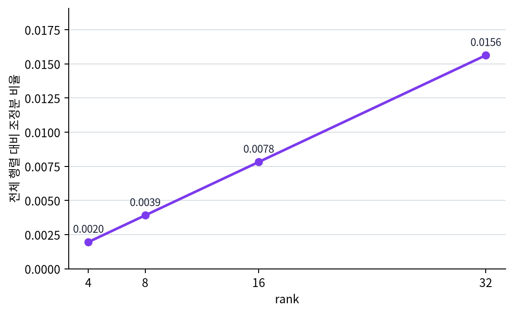

# P6-8.4 보충학습: adapter, LoRA, QLoRA는 어떤 제약에서 갈리는가

> Section ID: `P6-8.4`
> Version: `v2026.07.19`

P6-8.3까지 오면 `지금 실패를 프롬프트, 파인튜닝, RAG, 도구 사용 중 어디서 먼저 고쳐야 하는가`라는 큰 선택 지도는 잡힙니다. 그런데 여기서 `파인튜닝 쪽을 더 보겠다`고 방향을 정하면 곧바로 다음 벽에 부딪히기 쉽습니다. 문서와 강의마다 adapter, LoRA, QLoRA 같은 이름이 한꺼번에 나오기 시작하기 때문입니다. 이 이름들은 `파인튜닝 축을 먼저 고른 뒤` 다시 갈라지는 효율적 조정 선택지입니다.

이 절은 수식을 길게 따라가기보다, `왜 low-rank라는 말이 붙는가`, `작은 조정분이 어디에 붙는가`, `왜 QLoRA가 같이 언급되는가`를 읽을 수 있게 만드는 데 초점을 둡니다.

## 효율적 조정 방식이 갈리는 질문

- LoRA에서 `low-rank`는 무엇을 줄이려는 말인가?
- LoRA는 모델 어디에 붙는다고 이해하면 좋은가?
- adapter, LoRA, QLoRA는 어떤 층위에서 다른가?

여기서는 이름이 비슷한 조정 방식들을 먼저 구분합니다. 앞 절의 파인튜닝과 LoRA가 `모델을 어떻게 조정할 것인가`를 다뤘다면, 여기서는 그 조정 방식 안에서 adapter, LoRA, QLoRA가 각각 어떤 제약을 먼저 줄이려는지 더 세분화해 봅니다. 즉, `파인튜닝을 할 것인가`를 다시 묻는 절이 아니라 `이미 파인튜닝 축을 골랐다면 어떤 효율적 조정 이름을 어떤 제약 장면에서 떠올릴 것인가`를 정리하는 절입니다. 뒤의 지시 튜닝 절에서는 `무엇을 가르칠 것인가`로, 운영 절에서는 `메모리와 비용 제약이 실제 선택을 어떻게 밀어 올리는가`로 질문이 다시 이동합니다.

핵심은 `이름이 비슷하다`가 아니라 `각 방식이 무엇을 덜 무겁게 만들려고 하는가`입니다. 실제 데이터 설계와 운영 판단은 뒤 절로 넘겨 두는 편이 안정적입니다.

## 왜 선택 지도 다음에 이 이름 구분이 필요한가

P6-7.2까지 읽으면 `큰 기반 모델을 더 가볍게 적응시키는 방식이 필요하다`는 큰 축은 잡힙니다. P6-8.3까지 읽으면 거기에 더해 `정말 지금 파인튜닝 축을 먼저 고를 문제인가`도 한 번 가른 상태가 됩니다. 그런데 실제 자료를 보기 시작하면 곧 `그 가벼운 방식이 정확히 무엇인가`에서 다시 흐려지기 쉽습니다. 같은 문단 안에 adapter, LoRA, QLoRA가 함께 나오면 초심자는 이 셋을 `비슷한 신기술 이름 몇 개` 정도로 받아들이기 쉽기 때문입니다.

하지만 이 셋을 같은 이름 묶음으로 읽으면 뒤 장에서 계속 헷갈립니다. `무엇을 가르칠 것인가`와 `어떻게 덜 무겁게 조정할 것인가`가 섞이고, 메모리 제약 때문에 QLoRA를 봐야 하는 장면을 단순 LoRA 설명으로 넘기게 되며, adapter와 LoRA의 구조 차이도 `어차피 비슷한 최적화`처럼 느껴집니다.

그래서 이 절은 Chapter 7의 본선 한가운데를 끊는 옆길이보다, 선택 지도를 본 뒤 `파인튜닝 쪽을 더 파고들 때 필요한 세부 구분`을 붙잡아 주는 정리 구간으로 두는 편이 더 자연스럽습니다.

| 바로 앞 절에서 이미 잡은 것 | 이 보충 절에서 새로 잡는 것 | 바로 뒤 절로 넘기는 질문 |
| --- | --- | --- |
| 프롬프트, 파인튜닝, RAG, 도구 사용 중 무엇을 먼저 고를지 큰 방향을 잡았다 | adapter, LoRA, QLoRA가 무엇을 줄이려는 선택지인지 구분한다 | 운영 제약이 더 커질 때 어떤 효율적 조정 방식이 더 현실적인가 |
| 전체 파인튜닝과 LoRA의 큰 차이 | 구조 차이, 변화분 학습, 메모리 제약을 서로 다른 질문으로 나눈다 | 뒤의 운영 절에서 비용, 메모리, 실험 회전 수를 어떤 기준으로 다시 볼 것인가 |

즉, 여기서 남겨야 할 결과는 `이름을 더 많이 아는 것`이 아니라 `파인튜닝 쪽을 고른 뒤 문서를 읽다가 어떤 제약 장면에서 어떤 이름이 나오는지 덜 헷갈리는 것`입니다.

핵심은 adapter, LoRA, QLoRA가 모두 `효율적 조정` 흐름에 속하지만, 줄이려는 대상과 실무에서 유리한 조건이 서로 같지는 않다는 점입니다.
비슷해 보이는 효율적 조정 이름들을 같은 말처럼 섞지 않고, 무엇을 줄이려는 선택지인지 구분하는 기준선을 여기서 세웁니다.

## 여기서 남겨야 할 구분

- LoRA의 `low-rank` 직관을 설명할 수 있습니다.
- LoRA가 기반 모델 전체를 다시 바꾸지 않고 일부 조정분만 학습하는 구조라는 점을 말할 수 있습니다.
- adapter, LoRA, QLoRA를 같은 말로 섞지 않고 구분할 수 있습니다.

이름 세 개를 먼저 외우기보다, 지금 막히는 것이 `추가 모듈 구조`, `작은 변화분 학습`, `메모리 제약` 중 무엇인지 먼저 가르는 편이 더 안전합니다.

| 먼저 보인 제약 장면 | 먼저 떠올릴 이름 | 왜 이렇게 갈라지는가 |
| --- | --- | --- |
| 기반 모델은 유지하고 업무별 적응만 나눠 관리하고 싶다 | adapter 또는 LoRA 비교 | 둘 다 전체 모델을 크게 다시 학습하지 않으려는 흐름이지만, 추가 구조를 두는 방식이 다르기 때문입니다. |
| 전체 모델을 직접 다루기엔 GPU 메모리가 너무 빠듯하다 | QLoRA 우선 검토 | 작은 변화분 학습만이 아니라 기반 모델을 더 가벼운 표현으로 다루는 조건이 같이 중요해지기 때문입니다. |
| rank를 바꿔 가며 비용과 표현력 균형을 비교해야 한다 | LoRA 세부 비교 | 지금 병목이 구조 차이보다 변화분 규모와 실험 자원 균형일 가능성이 크기 때문입니다. |

이 표를 먼저 잡고 아래의 low-rank, adapter, QLoRA 설명을 읽으면, 이 보충학습을 `이름 암기`보다 `제약 장면별 선택 기준`으로 더 쉽게 붙잡을 수 있습니다.

## 왜 `low-rank`라는 이름이 붙나

LoRA는 아주 단순하게 말하면 `큰 가중치 전체를 새로 쓰지 말고, 더 작은 조정 구조로 근사하자`는 생각입니다.

이 단계에서는 다음처럼 이해할 수 있습니다.

- 원래 가중치 행렬은 매우 큽니다
- 하지만 과업 적응에 필요한 변화 전체가 항상 그만큼 거대할 필요는 없습니다
- 그래서 작은 크기의 조정 행렬 두 개를 곱하는 식으로 `변화분`을 표현해 보자는 생각이 나옵니다

즉, LoRA는 `기반 모델 전체`보다 `업무에 맞게 바뀌는 부분`이 더 작은 구조일 수 있다고 보고 출발합니다.

`LoRA는 큰 모델 전체를 다시 배우기보다, 필요한 변화분만 더 작은 구조로 표현하려는 시도다.`

여기서 중요한 점은 LoRA가 `작은 모델`을 따로 만든다는 뜻이 아니라는 것입니다. 핵심은 기존 큰 가중치 전체를 다시 쓰지 않고, 과업 적응에 필요한 업데이트를 더 작은 구조로 표현해 보자는 데 있습니다. 그래서 low-rank라는 말은 모델 크기 자체보다 `업데이트를 표현하는 방식`에 더 가깝게 붙습니다.

## LoRA는 모델 어디에 붙는가

입문 독자는 종종 `LoRA가 모델 바깥에 붙는가, 안쪽에 붙는가`에서 멈춥니다.

더 안전한 설명은 다음과 같습니다.

- 기반 모델의 원래 가중치는 크게 고정해 둡니다
- attention 같은 핵심 선형 변환 층 주변에 작은 학습 가능한 조정분을 둡니다
- 실제 출력은 `원래 가중치의 계산 결과 + 작은 조정분의 계산 결과`처럼 이해할 수 있습니다

즉, LoRA는 완전히 별도 모델을 하나 더 만드는 것이 아니라, `기반 모델 안의 일부 선형 변환에 작은 보정 장치`를 더하는 쪽에 가깝습니다.

## adapter와 무엇이 다른가

LoRA와 adapter는 둘 다 `기반 모델 전체를 크게 다시 학습하지 않으려는 흐름`에 속합니다. 하지만 같은 방식은 아닙니다.

| 방식 | 입문용 직관 |
| --- | --- |
| adapter | 층 사이에 작은 추가 모듈을 넣어 조정한다 |
| LoRA | 기존 큰 가중치에 더해지는 작은 변화분을 학습한다 |
| QLoRA | LoRA의 조정 아이디어에 양자화(quantization)를 함께 써서 메모리 부담을 더 줄이려는 흐름이다 |

이 표에서 중요한 점은 우열 비교가 아니라 `문제를 줄이는 층위`입니다.

- adapter는 `추가 모듈을 넣는 구조`
- LoRA는 `작은 변화분 학습 구조`
- QLoRA는 `LoRA + 더 가벼운 저장/학습 조건`

으로 읽는 편이 안전합니다.

즉, 셋은 모두 `전체 모델을 통째로 다시 조정하지 않으려는 흐름`에 속하지만, 어디에 추가 구조를 두는지와 무엇을 줄이려는지는 다릅니다. 이 차이를 먼저 잡아 두어야 뒤에서 실험 비용, 메모리 제약, 품질 비교를 읽을 때 같은 이름처럼 섞이지 않습니다.

## QLoRA는 왜 같이 언급되나

독자는 LoRA를 읽다가 곧 QLoRA를 만나게 됩니다. 이때 `둘이 완전히 다른 방법인가?`라는 질문이 생깁니다.

핵심은 다음과 같습니다.

- LoRA는 작은 조정분만 학습하자는 생각입니다
- QLoRA는 기반 모델을 더 가벼운 표현으로 다루면서 LoRA 조정을 얹는 흐름입니다

즉, QLoRA는 `LoRA를 버린 다른 철학`이라기보다, `LoRA를 더 낮은 메모리 조건에서 다루기 쉽게 만든 실무 확장`으로 보는 편이 좋습니다.

다음처럼 한 줄로 정리할 수 있습니다.

`LoRA는 조정 대상 축소, QLoRA는 그 조정을 더 적은 메모리에서 가능하게 하려는 확장이다.`

## 왜 이런 구분이 실무에서 중요한가

같은 `파인튜닝`이라는 말 아래에 서로 다른 선택이 섞이면 비용 판단이 흐려집니다.

예를 들어 팀이 다음을 고민할 수 있습니다.

- 전체 파인튜닝이 가능한 자원이 있는가?
- LoRA 정도면 품질과 비용이 균형을 이루는가?
- 메모리가 더 빠듯하면 QLoRA 같은 선택이 필요한가?
- 구조 단순성이 중요한가, 실험 반복 속도가 중요한가?

즉, LoRA를 깊게 이해한다는 것은 수식을 외우는 일보다 `왜 이런 선택지가 생겼는가`를 읽는 일에 더 가깝습니다.

## 여기까지를 한 줄로 묶으면

여기까지를 가장 짧게 정리하면 다음과 같습니다.

- adapter는 `작은 추가 모듈을 넣는 방식`에 가깝습니다.
- LoRA는 `작은 변화분을 학습해 붙이는 방식`에 가깝습니다.
- QLoRA는 `LoRA 조정을 더 낮은 메모리 조건에서 다루기 쉽게 만든 확장`에 가깝습니다.

이 셋을 구분해야 `같은 파인튜닝`이라는 말 아래에 서로 다른 비용 구조와 실험 조건이 숨어 있다는 점을 놓치지 않게 됩니다.

## 사례 및 예시

### 사례 1. 같은 기반 모델로 여러 업무 실험

한 팀이 고객 문의 분류, 문서 요약, 내부 검색 보조를 모두 같은 기반 모델로 시험한다고 해 봅시다. 초심자는 이런 장면에서 `업무가 세 개면 모델도 세 개를 따로 만들어야 하지 않을까`라고 생각하기 쉽습니다. 하지만 이 기준으로 전체 파인튜닝을 세 번 하면 저장 공간이 커지고, 어떤 버전이 어느 업무용인지 관리도 복잡해집니다. 예를 들어 분류용 실험 하나만 바꿔도 전체 모델 사본을 다시 관리해야 하면, 비교 실험 자체가 금방 무거워집니다. 이때 팀이 실제로 먼저 막히는 것은 이론보다 버전 수와 실험 관리 비용입니다.

이때 LoRA 계열은 기반 모델은 그대로 두고 업무별 조정분만 따로 붙이는 방식으로, `모델 전체를 복제하는가` 대신 `조정분만 분리해 관리할 수 있는가`라는 기준을 가능하게 합니다. 즉, 여기서 바뀌는 점은 `업무별 전체 사본을 가져야 하는가`를 보던 기준에서 `업무별 조정분만 나눠도 되는가`를 보는 기준으로 이동한다는 것입니다. 여기서 바로잡아야 할 오해는 `업무가 늘면 전체 모델도 비례해서 늘려야 한다`는 감각입니다. 그래서 이 사례에서 확인해야 할 결과는 같은 기반 모델 위에서 업무별 조정본을 나눠 관리해 실험 비교 속도를 실제로 높일 수 있는가, 그리고 전체 사본 수가 아니라 조정본 수로 관리 단위를 줄일 수 있는가입니다.

### 사례 2. 메모리가 빠듯한 환경

노트북급 장비나 제한된 GPU 환경에서 큰 기반 모델 전체를 직접 다루기는 부담이 큽니다. 초심자는 종종 `조정을 하려면 어차피 모델 전체를 메모리에 올려 바꿔야 한다`고 먼저 생각합니다. 하지만 그렇게 접근하면 아예 실험 시작조차 어려울 수 있습니다. 예를 들어 데이터 준비는 끝났는데 GPU 메모리 부족으로 첫 학습 step조차 못 돌리면, 모델 선택 논의 이전에 실험이 막힙니다. 이때 팀은 `전체를 다 바꾸지 않고도 목적에 맞게 조정할 수 없는가`를 묻게 됩니다.

LoRA와 QLoRA가 함께 언급되는 이유도 이런 현실 제약과 직접 연결됩니다. 여기서 바뀌는 점은 `모델 전체를 직접 다뤄야만 조정이 가능한가`를 보던 기준에서 `작은 조정 구조만으로도 실험을 시작할 수 있는가`를 보는 기준으로 이동한다는 것입니다. 여기서 바로잡아야 할 오해는 `전체를 다 못 올리면 조정 자체가 불가능하다`는 판단입니다. 그래서 이 사례에서 확인해야 할 결과는 전체 모델 수정이 막힌 환경에서도 작은 조정 구조가 실제 실험 시작을 가능하게 하는가, 그리고 첫 step이 돌아갈 만큼의 자원 문턱을 실제로 낮출 수 있는가입니다.

### 사례 3. 결과 품질보다 먼저 실험 회전 수가 중요할 때

초기 탐색 단계에서는 `완벽한 최종 모델`보다 `어떤 데이터와 과업 정의가 맞는가`를 빨리 보는 일이 더 중요할 수 있습니다. 초심자는 성능 문제를 만나면 먼저 한 번 크게 학습해서 최고의 결과를 보는 쪽을 떠올리기 쉽습니다. 하지만 이 단계에서는 어떤 라벨 정의가 맞는지, 프롬프트보다 조정이 필요한지, 데이터 정제가 더 중요한지를 빠르게 비교하는 편이 더 실용적일 수 있습니다. 예를 들어 이번 주 안에 세 가지 업무 정의를 시험해야 하는데 한 실험이 너무 무거우면, 가장 중요한 비교 자체를 못 하게 됩니다.

이런 상황에서는 큰 비용을 한 번 쓰는 방식보다, 더 작은 조정본을 빠르게 여러 번 비교하는 쪽이 유리합니다. 여기서 바뀌는 점은 `최종 최고 점수를 한 번에 얻는가`를 보던 기준에서 `여러 가설을 실제로 빨리 비교할 수 있는가`를 보는 기준으로 이동한다는 것입니다. 여기서 바로잡아야 할 오해는 `최고 성능 한 번`이 항상 `좋은 탐색 과정`을 뜻한다는 생각입니다. 그래서 이 사례에서 확인해야 할 결과는 최종 최고 점수보다 여러 실험 회전이 실제 과업 정의 비교를 더 빠르게 가능하게 하는가, 그리고 그 회전 수 덕분에 잘못된 가설을 더 일찍 버릴 수 있는가입니다.

세 사례를 효율적 조정 선택 기준으로 다시 묶으면 다음과 같습니다.

| 상황 | 전체 모델을 다 건드릴 때 먼저 커지는 것 | 효율적 조정이 먼저 줄이려는 것 |
| --- | --- | --- |
| 같은 기반 모델로 여러 업무 실험 | 모델 사본 수와 버전 관리 부담 | 업무별 조정본만 분리 관리하는 비용 |
| 메모리가 빠듯한 환경 | 첫 실험 진입 자체의 자원 부담 | 작은 조정 구조만으로 시작 가능한지 여부 |
| 실험 회전 수가 중요할 때 | 한 실험의 준비 시간과 저장 비용 | 여러 가설을 빠르게 비교하는 회전 부담 |

이 표의 목적은 세 기술 이름을 다시 외우게 하는 데 있지 않습니다. 같은 `파인튜닝` 축 안에서도 먼저 커지는 부담이 사본 수인지, 메모리인지, 실험 회전 시간인지에 따라 비교해야 할 선택지가 달라진다는 점을 남기는 데 있습니다.

## 바로 적용해 보면

이 보충학습을 읽은 뒤에는 아직 low-rank 수식이나 quantization 세부를 다 몰라도, 아래처럼 `지금 막히는 것이 추가 모듈 구조 문제인가, 작은 변화분 문제인가, 메모리 제약 문제인가`를 먼저 가르는 연습을 할 수 있습니다.

| 지금 보이는 장면 | 먼저 떠올리기 쉬운 오해 | 먼저 바꿔 물을 질문 |
| --- | --- | --- |
| 기반 모델은 유지하고 업무별 적응만 나눠 관리하고 싶다 | 이름이 비슷하니 adapter와 LoRA는 사실상 같은 방식이라고 느끼기 쉽다 | 지금 필요한 것은 층 사이에 작은 모듈을 넣는 구조인가, 기존 가중치의 작은 변화분을 붙이는 구조인가 |
| 전체 모델을 직접 다루기엔 GPU 메모리가 너무 빠듯하다 | LoRA만 알면 메모리 문제도 자동 해결된다고 느끼기 쉽다 | 지금 막히는 것은 작은 변화분 학습보다 기반 모델을 더 가벼운 표현으로 다뤄야 하는가 |
| 여러 rank 후보를 비교하다 보니 비용과 표현력 균형이 헷갈린다 | rank는 작을수록 무조건 좋은 것이라고 느끼기 쉽다 | 지금 단계의 병목이 자원 제약인가, 더 큰 표현 여지 부족인가 |

이 표에서 중요한 것은 이름 세 개를 외우는 일이 아니라, 먼저 `어디에 추가 구조를 두는가`, `무엇의 규모를 줄이려는가`, `메모리 제약을 같이 줄여야 하는가`를 서로 다른 질문으로 읽는 일입니다.

여기서 자주 섞이는 것도 다음과 같습니다.

- adapter, LoRA, QLoRA를 모두 같은 효율적 조정의 다른 이름처럼 느끼기 쉽습니다.
- LoRA를 알면 QLoRA가 따로 왜 필요한지 놓치기 쉽습니다.
- rank 비교를 품질 확정 문제와 탐색 비용 문제로 나누지 못하기 쉽습니다.

그래서 이 보충학습의 닫힘은 `비슷한 이름을 같은 말로 묶지 않고 제약 장면별로 다시 고른다`는 기준을 만드는 데 있습니다.

## 연습 및 예제

이번 예제의 목표는 실제 LoRA를 구현하는 것이 아니라, `큰 행렬 전체`와 `작은 rank 조정분`의 규모 차이를 rank별로 비교해 보는 것입니다.

아래 코드는 기반 가중치 크기와 여러 rank 값을 사용합니다. 결과에서는 전체 행렬 파라미터 수, rank별 LoRA 조정분 파라미터 수, 전체 대비 비율을 확인합니다.

확인할 핵심은 LoRA의 핵심이 전체 행렬 대신 작은 rank 조정분만 학습해 필요한 파라미터 수를 크게 줄이는 데 있다는 점입니다.

예제를 보기 전에 먼저 다음처럼 예상해 보면 좋습니다.

| 비교 장면 | 실행 전에 먼저 예상할 변화 | 왜 이 예상이 중요한가 |
| --- | --- | --- |
| `rank=4`에서 `rank=32`로 갈 때 | 조정분 파라미터 수와 비율이 함께 커진다 | rank는 표현 여지를 늘리지만 비용도 같이 키운다는 감각이 필요하기 때문입니다. |
| 전체 행렬과 LoRA 조정분을 비교할 때 | LoRA 조정분 비율이 매우 작게 나온다 | `효율적 조정`이 단순 슬로건이 아니라 규모 차이에서 나온 말임을 읽기 위해서입니다. |
| 여러 rank를 나란히 볼 때 | 작은 rank일수록 실험 회전에는 유리하지만 표현 여지는 더 제한적일 수 있다 | 수치가 바로 `무조건 작을수록 좋다`는 뜻은 아니라는 점을 먼저 잡아야 하기 때문입니다. |

```python
hidden_size = 4096
ranks = [4, 8, 16, 32]

full_matrix_params = hidden_size * hidden_size

print("full_matrix_params =", full_matrix_params)

for rank in ranks:
    lora_update_params = hidden_size * rank + rank * hidden_size
    ratio = lora_update_params / full_matrix_params
    print(
        f"rank={rank:>2}: "
        f"lora_update_params={lora_update_params}, "
        f"ratio={ratio:.4f}"
    )
```

이 예제는 로컬 `.venv`의 Python으로 실행해 본문 출력과 일치함을 확인했습니다.

실행 결과 예시는 다음처럼 읽을 수 있습니다.

```text
full_matrix_params = 16777216
rank= 4: lora_update_params=32768, ratio=0.0020
rank= 8: lora_update_params=65536, ratio=0.0039
rank=16: lora_update_params=131072, ratio=0.0078
rank=32: lora_update_params=262144, ratio=0.0156
```

이 숫자는 특정 제품의 실제 설정을 주장하는 것이 아닙니다. 다만 다음 감각을 보여 줍니다.

- 전체 가중치 행렬은 매우 크고
- 작은 rank 조정분은 훨씬 작을 수 있으며
- rank를 키우면 조정 표현력은 늘 수 있지만, 동시에 조정분 규모도 함께 커집니다

그 차이가 왜 `효율적 조정`이라는 말을 낳았는지 이해하게 해 줍니다.

아래 차트는 rank가 커질 때 LoRA 조정분 비율이 어떻게 함께 커지는지 다시 보여 줍니다. 여기서 핵심은 조정분이 전체 행렬보다 작다는 사실뿐 아니라, rank 선택이 비용과 표현 여지를 동시에 바꾸는 손잡이라는 점입니다.



이 예제를 실제 선택 기준으로 다시 묶으면 다음처럼 읽는 편이 안전합니다.

| 먼저 막히는 질문 | 먼저 떠올릴 선택지 | 이유 |
| --- | --- | --- |
| 기반 모델 사본이 너무 많이 늘어난다 | LoRA / adapter 계열 | 전체 모델을 매번 따로 저장하고 다시 조정하는 부담을 줄이려는 흐름이기 때문입니다. |
| GPU 메모리가 빠듯해 실험 시작 자체가 어렵다 | QLoRA를 먼저 검토 | LoRA만이 아니라 기반 모델을 더 가벼운 표현으로 다루는 조건이 함께 중요해지기 때문입니다. |
| 여러 과업 정의를 빨리 비교해야 한다 | 작은 조정본 중심 접근 | 최고 점수 하나보다 실험 회전 수와 비용이 더 중요한 단계일 수 있기 때문입니다. |

예제 뒤에는 숫자를 구조 선택으로 다시 번역해 보는 편이 더 중요합니다.

| 숫자에서 바로 읽어야 할 것 | 그 숫자를 잘못 읽으면 생기는 오해 | 다음 판단으로 이어지는 질문 |
| --- | --- | --- |
| rank가 커질수록 조정분 규모도 커진다 | rank를 키워도 여전히 `공짜로 가볍다`고 오해할 수 있다 | 지금 단계의 병목이 표현력 부족인가, 자원 제약인가 |
| 전체 행렬 대비 조정분 비율이 매우 작다 | LoRA를 `작은 모델을 새로 만드는 방식`으로 오해할 수 있다 | 기반 모델은 유지하고 변화분만 분리하는 이점이 필요한가 |
| 작은 rank 비교만으로는 품질을 확정할 수 없다 | 숫자만 보고 바로 최종 방식을 고를 수 있다고 오해할 수 있다 | 이번 단계가 최종 성능 확정인가, 빠른 탐색인가 |

### 연습 2. 이름이 아니라 제약 장면으로 다시 고르면

다음 장면마다 `adapter`, `LoRA`, `QLoRA`, `전체 파인튜닝` 중 무엇을 먼저 검토할지 고르고 이유를 한 문장으로 적어 보세요.

1. 같은 기반 모델로 고객 분류, 요약, 검색 보조를 병렬 실험해야 하는데 저장 공간과 버전 관리가 먼저 부담된다.
2. 24GB 이하 GPU 한 장에서 첫 실험을 열어야 하는데, 전체 모델 수정은 시작부터 버겁다.
3. 최종 배포 전이라 성능 최고점보다 과업 정의 세 가지를 이번 주 안에 비교하는 것이 더 중요하다.
4. 특정 도메인 성능이 절대적으로 중요하고, 충분한 자원과 시간이 있어 전체 모델 재조정도 감수할 수 있다.

## 체크리스트

- 메모리, 사본 수, 실험 회전 수 중 무엇이 현재 병목인지 먼저 말할 수 있어야 합니다.
- adapter, LoRA, QLoRA를 `추가 모듈`, `작은 변화분`, `더 낮은 메모리 조건`이라는 축으로 구분할 수 있어야 합니다.
- low-rank를 모델 크기 축이 아니라 업데이트 표현 축으로 설명할 수 있어야 합니다.

## 출처와 참고 자료

- Neil Houlsby et al., [Parameter-Efficient Transfer Learning for NLP](https://proceedings.mlr.press/v97/houlsby19a.html){: target="_blank" rel="noopener noreferrer" }, ICML, 2019, 확인 날짜: 2026-07-19.
- Edward J. Hu et al., [LoRA: Low-Rank Adaptation of Large Language Models](https://arxiv.org/abs/2106.09685){: target="_blank" rel="noopener noreferrer" }, arXiv, 2021, 확인 날짜: 2026-07-19.
- Tim Dettmers et al., [QLoRA: Efficient Finetuning of Quantized LLMs](https://arxiv.org/abs/2305.14314){: target="_blank" rel="noopener noreferrer" }, arXiv, 2023, 확인 날짜: 2026-07-19.
