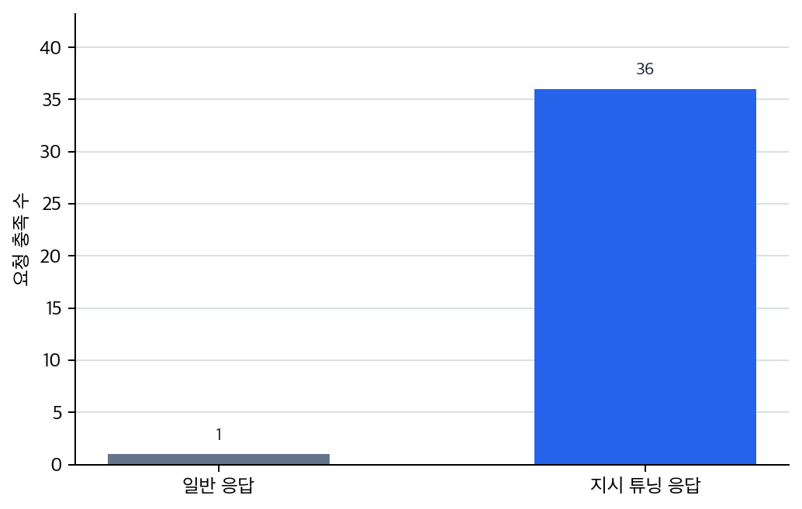

# P6-9.1 지시 튜닝(instruction tuning)

> Section ID: `P6-9.1`
> Version: `v2026.07.21`

P6-8.2에서는 LoRA 같은 효율적 조정 방식이 왜 실무에서 중요한지 보았습니다. 그런데 모델을 조금 더 싸게 조정할 수 있다고 해서, 곧바로 사람 지시를 잘 따르는 답변이 만들어지는 것은 아닙니다.

모델이 단순히 문장을 이어 쓰는 수준을 넘어, 사용자의 지시를 더 잘 따르도록 만드는 과정은 무엇인가?

지시 튜닝(instruction tuning)은 모델이 자연어 지시를 더 잘 이해하고, 그 형식에 맞게 응답하도록 추가로 조정하는 과정이다.

같은 말을 더 쉽게 바꾸면 다음과 같습니다.

지시 튜닝은 모델이 단순히 이어 쓰는 것을 넘어서, 사람의 요청 방식에 맞춰 답하는 습관을 더 강하게 만드는 단계다.

## 응답 습관 조정이 다루는 질문

응답 습관 조정은 다음 질문에서 시작합니다.

- 지시 튜닝은 무엇을 바꾸려는가?
- 사전학습, 파인튜닝, 지시 튜닝은 어떻게 이어지는가?
- 왜 대화형 LLM 경험에서 지시 튜닝이 중요하게 느껴지는가?

지시 튜닝은 `지시 따르기 조정층`입니다. 이 층은 새 사실을 더 저장하는 문제보다, 이미 있는 언어 능력을 사용자의 요청 형식에 맞게 꺼내도록 반응 습관을 바꾸는 문제에 가깝습니다. 정렬은 그다음에 `그렇게 잘 따르는 답이 허용 가능한가`를 따로 묻는 문제입니다.

대화형 LLM의 사용자 경험은 `지시 따르기 능력`이라는 관점에서 따로 읽어야 합니다. 사전학습은 넓은 언어 기반을 만들고, 파인튜닝은 목적과 도메인 기준을 좁히며, 지시 튜닝은 사용자의 자연어 요청에 맞는 답변 구조와 한계 고지 습관을 더 강하게 만듭니다. 외부 문서 근거와 도구 실행은 이 응답 습관 위에 붙는 별도 서비스 연결입니다.

따라서 여기서 먼저 봐야 할 것은 `새 지식을 더 넣는가`보다 `같은 생성 구조가 어떤 응답 습관을 갖게 되는가`입니다.

| 지금 구분할 것 | 다른 층위로 남겨 둘 것 |
| --- | --- |
| 사용자의 자연어 지시 형식에 맞춰 답변 습관과 구조를 더 조정하는 단계 | 정렬 문제를 어떻게 더 세밀하게 다룰지 |
| 왜 같은 생성 구조가 대화형 assistant처럼 보이기 시작하는가 | 외부 문서 근거와 도구 실행을 어떻게 실제 응답에 붙일지 |

이 전환을 한 번 더 짧게 묶어 두면, 지금 구간은 `새 기능을 계속 붙이는 장`이 아니라 `같은 생성 구조를 사용자 반응 쪽으로 점점 더 좁혀 가는 조정 축`입니다.

| 앞에서 한 일 | 여기서 더 바꾸는 것 | 다른 층위로 남겨 둘 것 |
| --- | --- | --- |
| P6-7.1과 P6-8.1에서 넓은 언어 기반과 과업 적합성을 구분했다 | 사용자 지시 형식, 답변 구조, 한계 고지 습관을 더 맞춘다 | 최신 정보 연결, 외부 문서 근거, 도구 실행 |

여기까지의 조정 축을 한 번에 묶으면 다음처럼 읽을 수 있습니다.

| 조정 단계 | 여기서 먼저 좋아지는 것 | 아직 남는 질문 | 뒤에서 이어지는 구조 |
| --- | --- | --- | --- |
| 사전학습 | 넓은 언어 기반과 표현 감각 | 우리 과업 기준에 얼마나 맞는가? | P6-8.1 파인튜닝 |
| 파인튜닝 | 도메인 표현, 과업 기준, 출력 습관의 안정화 | 사람의 자연어 요청 형식에 얼마나 잘 맞는가? | P6-9.1 지시 튜닝 |
| 지시 튜닝 | 요청 형식, 답변 구조, 한계 고지 습관 | 최신 문서 근거와 실제 실행은 어디서 붙는가? | P6-10 RAG, P6-12 tool use |

`대화형 LLM은 원래부터 사람 요청을 잘 따른다`는 인상은 `응답 형식과 반응 습관을 추가로 조정한 결과`로 바꾸어 읽어야 합니다.

즉, 이 장까지는 `어떻게 더 assistant처럼 반응하게 만들까`를 다루는 조정 축이고, 그 다음부터 비로소 `무엇을 근거로 답하게 할까`, `무엇을 실제로 실행하게 할까`라는 서비스 연결 축으로 넘어갑니다.

## 여기서 남겨야 할 구분

- 지시 튜닝을 입문 수준에서 설명할 수 있습니다.
- 사전학습과 파인튜닝, 지시 튜닝의 차이를 다시 정리할 수 있습니다.
- 왜 대화형 LLM이 일반 언어 모델과 다르게 느껴지는지 설명할 수 있습니다.
- 정렬(alignment)을 `지시를 잘 따르는가`와 다른 허용 가능성 문제로 읽을 수 있습니다.

이 구분이 중요한 이유는 다음과 같습니다.

- 생성형 AI를 단순 자동완성으로만 이해하는 시각을 넘어서게 하고
- assistant behavior를 별도 층으로 분리하게 하며
- 다음 절의 alignment 문제를 `왜 필요한가`라는 질문과 연결해 주기 때문입니다

## 조정 축을 보는 순서

조정 축은 다음 순서로 읽으면 흐름이 잘 잡힙니다.

1. 먼저 지시 튜닝이 `새 지식을 넣는 단계`보다 `응답 형식과 반응 습관을 조정하는 단계`에 가깝다는 점을 봅니다.
2. 그 다음 사전학습, 파인튜닝, 지시 튜닝이 각각 무엇을 바꾸는지 다시 구분합니다.
3. 이어서 왜 이 조정이 대화형 LLM 경험에서 특히 중요하게 느껴지는지 읽습니다.
4. 마지막에 사례와 예제로 `요약`, `단계`, `표`, `한계 고지` 같은 응답 습관이 실제로 어떻게 달라지는지 확인합니다.

## 지시 튜닝은 무엇을 바꾸려 하나

사전학습된 모델은 넓은 언어 패턴을 학습합니다. 하지만 그것만으로는 사용자가 기대하는 방식으로 항상 반응하지는 않습니다.

| 질문 | 짧은 답 |
| --- | --- |
| 왜 이런 조정이 또 필요한가? | 언어를 아는 것과 지시를 잘 따르는 것은 같지 않아서 |
| 무엇을 더 잘하게 만들려는가? | 요청 형식 이해, 답변 구조, 한계 고지 |
| 어디가 달라지는가? | 다음 토큰 예측 자체보다 응답 습관과 형식 적합성 |

예를 들어 사용자는 다음처럼 기대합니다.

- 질문에는 답을 해 주기
- 표를 요청하면 표 형식으로 정리하기
- 단계별 설명을 요청하면 순서대로 풀기
- 불가능한 요청에는 한계를 분명히 말하기

이런 기대는 단순히 다음 토큰을 잘 예측하는 것만으로는 충분히 보장되지 않습니다. 지시 튜닝은 바로 이런 `사용자 지시 형식`에 맞는 반응 습관을 더 강하게 만드는 과정으로 볼 수 있습니다.

즉, 이 절의 핵심은 `말을 이어 쓰는 능력`과 `요청에 맞게 답하는 능력`을 분리해 보는 데 있습니다.

## 사전학습과 어떻게 다른가

이 차이는 다시 분리해 두는 것이 좋습니다.

| 단계 | 핵심 질문 |
| --- | --- |
| 사전학습(pretraining) | 일반 언어 패턴을 먼저 배우는가? |
| 파인튜닝(fine-tuning) | 특정 과업이나 도메인에 맞게 조정하는가? |
| 지시 튜닝(instruction tuning) | 자연어 지시를 더 잘 따르도록 조정하는가? |

지시 튜닝은 보통 `사용자의 요청 형식`과 `바람직한 답변 형식`을 더 잘 맞추는 방향으로 설명할 수 있습니다.

즉, 다음처럼 정리할 수 있습니다.

`사전학습은 언어를 넓게 배우는 단계이고, 지시 튜닝은 사람의 요청 방식에 더 잘 반응하도록 답변 습관을 조정하는 단계다.`

여기에 파인튜닝까지 함께 놓으면 다음처럼 읽을 수 있습니다.

- 사전학습: 언어의 넓은 기반
- 파인튜닝: 특정 과업과 도메인 적응
- 지시 튜닝: 사용자 요청 형식에 맞는 응답 적응

## 왜 대화형 LLM에서 중요하게 느껴지나

대화형 LLM은 사용자가 자연어로 바로 요청합니다. 따라서 사용자는 모델이 다음과 같은 것을 기대합니다.

- 내 질문을 이해한 듯한 반응
- 요청 형식에 맞춘 답변
- 장황하지 않거나, 반대로 충분히 자세한 답변
- 단계, 요약, 예시, 경고의 구조화

이 경험은 단순한 언어 모델보다 `대화형 조수 같은 반응`에 더 가깝습니다. 지시 튜닝은 바로 이 변화를 설명하는 중요한 층입니다.

독자 입장에서는 이 지점이 가장 체감됩니다. 같은 모델 계열이라도 어떤 것은 `그럴듯한 문장을 이어 가는 느낌`이 강하고, 어떤 것은 `내 요청을 구조적으로 따라오는 느낌`이 강합니다. 이 차이를 설명할 때 지시 튜닝이 필요합니다.

## 지시 튜닝이 만능은 아니다

하지만 지시 튜닝도 과장해서는 안 됩니다.

지시 튜닝이 된다고 해서:

- 사실성이 자동 보장되거나
- 편향이 자동 제거되거나
- 위험한 요청을 완전히 스스로 해결하거나
- 외부 최신 정보를 자동으로 반영하는 것

은 아닙니다.

더 안전한 설명은 다음입니다.

`지시 튜닝은 사용자 요청 형식에 맞는 반응을 강화하지만, 사실 검증·최신성·안전성 전체를 단독으로 해결하지는 않는다.`

이 경계를 먼저 잡아야 `답변 형식이 좋아졌다`는 사실과 `사실 검증·최신성·안전성이 함께 해결됐다`는 판단을 섞지 않게 됩니다.

## 여기까지를 한 줄로 묶으면

여기까지를 가장 짧게 정리하면 다음과 같습니다.

- 사전학습은 `언어를 넓게 배우는 단계`입니다.
- 파인튜닝은 `특정 과업과 도메인에 더 맞추는 단계`입니다.
- 지시 튜닝은 `사람의 요청 형식에 더 잘 반응하도록 응답 습관을 조정하는 단계`입니다.

이 셋을 구분해야 `모델이 무엇을 아는가`와 `모델이 어떻게 답하는가`를 같은 문제로 섞지 않게 됩니다.

## 아주 단순하게 그리면

```mermaid
--8<-- "assets/part-06/chapter-08/p6-c08-s01-diagram-01-ko.mmd"
```

이 도식은 지시 튜닝을 `언어 모델 본체` 위에 `응답 형식 조정`이 더해지는 흐름으로 읽게 합니다. 그래서 이 도식에서 확인해야 할 결과는 기반 모델의 일반 언어 능력과, 이후에 얹히는 응답 형식 조정이 실제로 다른 층위로 구분되는가입니다.

이 그림에서 읽어야 할 핵심은 다음입니다.

- 기반 모델은 이미 언어를 알고 있고
- 추가 예시는 `어떻게 답해야 하는가`를 보여 주며
- 결과는 `assistant처럼 보이는 응답`에 더 가까워집니다

## 사례 및 예시

### 사례 1. 요약 요청

팀 문서를 요약할 때 사용자가 `핵심만 세 줄로 정리해 달라`고 요청했다고 가정해 보겠습니다. 이런 요청은 처음 보면 `내용만 맞으면 되겠지`라고 생각하기 쉽습니다. 모델이 핵심 사실을 빠뜨리지 않으면 이미 꽤 잘한 것처럼 느껴지기 때문입니다. 하지만 실제 사용자는 길이와 형식도 함께 기대합니다. 지시 조정이 약한 모델은 문서를 설명하는 긴 문단을 이어 쓰기만 하고, 세 줄이라는 형식을 맞추지 못할 수 있습니다. 예를 들어 핵심 사실은 모두 들어 있어도 한 단락으로 길게 써 버리면, 사용자는 그대로 메신저나 보고서에 붙여 넣기 어렵다고 느낄 수 있습니다.

여기서 바뀌는 점은 `핵심 사실이 들어갔는가`를 보던 기준에서 `요청한 길이와 형식까지 함께 맞췄는가`를 보는 기준으로 이동한다는 것입니다. 지시 튜닝은 `무엇을 말할지`뿐 아니라 `어떤 길이와 구조로 답할지`를 함께 맞추도록 도와, 같은 내용이라도 사용자가 바로 가져다 쓸 수 있는 응답으로 바꾸는 데 기여합니다. 여기서 바로잡아야 할 오해는 `사실만 맞으면 요청 충족도 자동으로 따라온다`는 기대입니다. 그래서 이 사례에서 확인해야 할 결과는 핵심 사실만 맞는 것이 아니라, 실제로 세 줄 요약 형식까지 함께 맞춰지는가, 그리고 그 형식 덕분에 바로 재사용 가능한가입니다.

### 사례 2. 단계별 설명

사내 교육 자료를 만들면서 `신입 직원이 따라 할 수 있게 3단계로 설명해 달라`고 요청할 수 있습니다. 이 장면에서는 모델이 내용을 알고 있으면 구조도 자연스럽게 맞출 것이라고 느끼기 쉽습니다. 하지만 사람도 정보를 알고 있다고 해서 항상 `3단계`, `따라 하기 쉬운 순서`를 자동으로 맞추는 것은 아닙니다. 일반 언어 모델은 설명 순서를 임의로 섞거나 단계 수를 맞추지 못할 수 있습니다. 예를 들어 준비 단계보다 예외 처리부터 먼저 말하면, 내용은 맞아도 실제 따라 하기는 더 어려워질 수 있습니다. 즉 `정보가 있음`과 `가르치기 쉬운 구조로 말함`은 다른 능력입니다.

여기서 바뀌는 점은 `내용을 알고 있는가`를 보던 기준에서 `요청한 단계 수와 전개 순서를 함께 지키는가`를 보는 기준으로 이동한다는 것입니다. 지시 튜닝된 모델은 `단계 수`, `설명 순서`, `독자 수준에 맞춘 전개` 같은 요구를 더 자연스럽게 반영하는 쪽으로 조정됩니다. 여기서 바로잡아야 할 오해는 `내용만 맞으면 교육용 구조도 저절로 따라온다`는 생각입니다. 그래서 이 사례에서 확인해야 할 결과는 설명 내용만 맞는 것이 아니라, 실제로 3단계 순서와 따라 하기 쉬운 전개까지 유지되는가, 그리고 단계 사이 의존 순서도 어긋나지 않는가입니다.

### 사례 3. 거절과 한계 고지

사용자가 내부 권한이 없는 문서를 보여 달라고 하거나, 확인할 근거 없이 단정적 답을 요구할 수 있습니다. 이 장면에서는 모델이 친절하게 잘 답해 주는 것이 항상 좋은 응답이라고 느끼기 쉽습니다. 그래서 답을 계속 이어 가면 서비스 품질도 높아진다고 보기 쉽습니다. 하지만 이때 무조건 답을 이어 쓰기만 하면 잘못된 정보나 권한 위반으로 이어질 수 있습니다. 예를 들어 권한이 없는 파일 내용을 추정해서 요약해 버리면, 실제 문서 접근 통제는 지키지 못하고 잘못된 내용까지 퍼뜨릴 수 있습니다. 이때 필요한 것은 `끝까지 대답하는 성실함`이 아니라 `어디서 멈춰야 하는지 아는 응답 습관`입니다.

여기서 바뀌는 점은 `끝까지 답을 이어 쓰는가`를 보던 기준에서 `거절 이유와 안전한 다음 행동을 구조적으로 제시하는가`를 보는 기준으로 이동한다는 것입니다. 지시 튜닝은 `할 수 없는 이유`, `확인 가능한 대안`, `다음에 필요한 정보`를 구조적으로 말하는 응답 습관을 강화하는 데에도 쓰입니다. 그래서 이 사례에서 확인해야 할 결과는 무조건 답을 이어 쓰는 대신, 거절 이유와 안전한 다음 행동이 함께 제시되는가, 그리고 사용자에게 필요한 다음 입력이나 승인 조건도 함께 드러나는가입니다.

세 사례를 한 줄로 다시 묶으면 다음과 같습니다.

| 상황 | 지시 튜닝이 기여하는 지점 |
| --- | --- |
| 요약 요청 | 요청 형식에 맞춘 길이와 구조 |
| 단계별 설명 | 독자가 원하는 전개 순서 반영 |
| 거절과 한계 고지 | 불가 사유와 대안을 구조적으로 제시 |

세 사례를 응답 습관 관점으로 다시 묶으면 다음과 같습니다.

| 상황 | 기반 모델만으로 흔들리기 쉬운 것 | 지시 튜닝이 더 붙잡으려는 것 |
| --- | --- | --- |
| 요약 요청 | 길이와 줄 수 같은 형식 제약 | 요청한 구조와 분량 유지 |
| 단계별 설명 | 단계 수와 전개 순서 | 독자용 안내 흐름과 단계 구조 |
| 거절과 한계 고지 | 무조건 이어 쓰는 답변 습관 | 거절 이유와 안전한 다음 행동 제시 |

## 바로 적용해 보면

이 절을 읽은 뒤에는 아직 정렬이나 RLHF 세부를 다 몰라도, 아래처럼 `지금 막히는 것이 내용 부족 문제인가, 지시 형식 조정 문제인가`를 먼저 가르는 연습을 할 수 있습니다.

| 지금 보이는 장면 | 먼저 떠올리기 쉬운 오해 | 먼저 바꿔 물을 질문 |
| --- | --- | --- |
| 형식은 잘 맞지만 최신 규정이나 근거 사실이 자주 틀린다 | assistant처럼 답하니 내용도 이미 충분히 맞는다고 느끼기 쉽다 | 지금 부족한 것은 지시 형식 준수보다 새 지식이나 근거 연결인가 |
| 핵심 사실은 맞지만 `세 줄로` 요청한 형식을 자주 어긴다 | 내용을 알고 있으니 요청도 이미 잘 따른다고 느끼기 쉽다 | 지금 부족한 것은 사실성보다 지시 형식 준수 습관인가 |
| 설명 내용은 맞는데 단계 수와 전개 순서가 자주 흔들린다 | 내용을 많이 알면 교육용 구조도 자동으로 맞아질 것이라고 느끼기 쉽다 | 지금 필요한 것은 지식 추가보다 요청 구조에 맞는 응답 습관인가 |
| 할 수 없는 요청에도 끝까지 답을 이어 가며 한계 고지가 약하다 | 친절하게 끝까지 답하는 것이 항상 좋은 응답이라고 느끼기 쉽다 | 지금 막히는 것은 내용 생성보다 거절·한계 고지 습관 조정인가 |

이 표에서 중요한 것은 `지시 튜닝이 새 지식을 넣는다`고 보는 일이 아니라, 먼저 `무엇을 말할까`와 `어떻게 답할까`를 다른 문제로 읽는 일입니다.

여기서 자주 섞이는 것도 다음과 같습니다.

- 사실을 아는 능력과 요청 형식 준수를 같은 능력처럼 느끼기 쉽습니다.
- 내용이 맞으면 형식과 한계 고지도 저절로 따라온다고 보기 쉽습니다.
- 지시 튜닝이 최신성, 사실성, 안전성을 한 번에 모두 해결한다고 과장하기 쉽습니다.

그래서 이 절의 닫힘은 `지시 튜닝은 응답 습관과 형식을 조정하는 층`이라는 문장을 실제 판단 기준으로 바꾸는 데 있습니다.

## 연습 및 예제

이번 예제의 목표는 실제 지시 튜닝 학습 전체를 재현하는 것이 아니라, `같은 사실 묶음`을 두고도 응답 습관이 어떻게 달라지는지를 평가 로그로 확인하는 것입니다. 이번에는 네 개 요청만 직접 비교하지 않고, 36개 요청 평가 기록에서 `세 줄 요약`, `3단계 설명`, `표 정리`, `근거 부족 시 한계 고지`가 얼마나 충족되는지 집계합니다.

아래 코드는 지시 수행 평가 CSV [p6_8_1_instruction_following_eval.csv](../../../assets/part-06/chapter-08/p6_8_1_instruction_following_eval.csv){ .csv-preview }를 사용합니다. 이 표의 한 행은 하나의 사용자 지시 평가 사례입니다. 핵심 열은 `request_type`, `requested_signal`, `base_*`, `tuned_*`입니다. `requested_signal`은 줄 수, 번호 단계, 표 행, 불확실성 표시처럼 어떤 지시 준수 신호를 봐야 하는지 알려 줍니다. `base_*` 열은 일반 응답에서 관찰된 형식 신호이고, `tuned_*` 열은 지시 형식 반영 응답에서 관찰된 형식 신호입니다. `reader_hint`와 `base_observation` 열은 정답을 대신 주는 열이 아니라, CSV를 열었을 때 어떤 형식 차이를 관찰해야 하는지 알려 주는 보조 설명입니다.

확인할 핵심은 instruction tuning이 새 사실을 추가하는 일이 아니라, 같은 내용이라도 요청한 출력 형식과 지시 준수율을 더 안정적으로 맞추는 변화로 읽힐 수 있다는 점입니다.

```python
# CSV 평가 케이스를 읽어 일반 응답과 instruction-tuned 응답이 요청 형식과 구조 신호를 얼마나 충족하는지 비교하는 예제입니다.
import csv
from collections import defaultdict
from pathlib import Path

eval_path = Path("docs/assets/part-06/chapter-08/p6_8_1_instruction_following_eval.csv")

def to_bool(value):
    return value.lower() == "true"

def read_cases(path):
    rows = []
    with path.open(encoding="utf-8", newline="") as file:
        for row in csv.DictReader(file):
            rows.append(row)
    return rows

def check_case(row, prefix):
    request_type = row["request_type"]
    lines = int(row[f"{prefix}_lines"])
    numbered_steps = int(row[f"{prefix}_numbered_steps"])
    table_rows = int(row[f"{prefix}_table_rows"])
    uncertainty_marker = to_bool(row[f"{prefix}_uncertainty_marker"])
    bullets = int(row[f"{prefix}_bullets"])

    if request_type == "three_line_summary":
        return lines == 3
    if request_type == "three_steps":
        return lines == 3 and numbered_steps == 3
    if request_type == "table":
        return table_rows >= 4
    if request_type == "limitations":
        return uncertainty_marker and bullets >= 2
    return False

cases = read_cases(eval_path)
preview_count = 6

evaluated = []
for row in cases:
    base_ok = check_case(row, "base")
    tuned_ok = check_case(row, "tuned")
    evaluated.append(
        {
            "case_id": row["case_id"],
            "request_type": row["request_type"],
            "base_ok": base_ok,
            "tuned_ok": tuned_ok,
            "improved": (not base_ok) and tuned_ok,
        }
    )

by_type = defaultdict(lambda: {"count": 0, "base_ok": 0, "tuned_ok": 0, "improved": 0})
for item in evaluated:
    group = by_type[item["request_type"]]
    group["count"] += 1
    group["base_ok"] += int(item["base_ok"])
    group["tuned_ok"] += int(item["tuned_ok"])
    group["improved"] += int(item["improved"])

total = len(evaluated)
base_total = sum(item["base_ok"] for item in evaluated)
tuned_total = sum(item["tuned_ok"] for item in evaluated)
improved_total = sum(item["improved"] for item in evaluated)

print("[dataset]")
print("case_count =", total)
print("request_types =", sorted(by_type))
print()
print("[preview]")
for item in evaluated[:preview_count]:
    print(item)
print(f"... {total - preview_count} more cases")
print()
print("[summary]")
print("base_meets_request_count =", base_total)
print("tuned_meets_request_count =", tuned_total)
print("improved_case_count =", improved_total)
print("base_meets_request_rate =", round(base_total / total, 2))
print("tuned_meets_request_rate =", round(tuned_total / total, 2))
print()
print("[by request type]")
for request_type, values in sorted(by_type.items()):
    print(
        request_type,
        {
            "count": values["count"],
            "base_ok": values["base_ok"],
            "tuned_ok": values["tuned_ok"],
            "improved": values["improved"],
        },
    )
```

실행 결과 예시는 다음처럼 읽을 수 있습니다.

```text
[dataset]
case_count = 36
request_types = ['limitations', 'table', 'three_line_summary', 'three_steps']

[preview]
{'case_id': 'S01', 'request_type': 'three_line_summary', 'base_ok': False, 'tuned_ok': True, 'improved': True}
{'case_id': 'S02', 'request_type': 'three_line_summary', 'base_ok': False, 'tuned_ok': True, 'improved': True}
{'case_id': 'S03', 'request_type': 'three_line_summary', 'base_ok': False, 'tuned_ok': True, 'improved': True}
{'case_id': 'S04', 'request_type': 'three_line_summary', 'base_ok': False, 'tuned_ok': True, 'improved': True}
{'case_id': 'S05', 'request_type': 'three_line_summary', 'base_ok': False, 'tuned_ok': True, 'improved': True}
{'case_id': 'S06', 'request_type': 'three_line_summary', 'base_ok': False, 'tuned_ok': True, 'improved': True}
... 30 more cases

[summary]
base_meets_request_count = 1
tuned_meets_request_count = 36
improved_case_count = 35
base_meets_request_rate = 0.03
tuned_meets_request_rate = 1.0

[by request type]
limitations {'count': 9, 'base_ok': 0, 'tuned_ok': 9, 'improved': 9}
table {'count': 9, 'base_ok': 0, 'tuned_ok': 9, 'improved': 9}
three_line_summary {'count': 9, 'base_ok': 1, 'tuned_ok': 9, 'improved': 8}
three_steps {'count': 9, 'base_ok': 0, 'tuned_ok': 9, 'improved': 9}
```

그래서 이 예제에서 확인해야 할 결과는 한두 개 성공 사례가 아니라, 여러 요청 유형에서 일반 응답과 지시 형식 반영 응답의 통과 패턴이 어떻게 달라지는가입니다. 기본 응답도 일부 요청에서는 우연히 형식을 맞출 수 있지만, 36개 사례를 묶어 보면 요청 형식 준수율은 `0.03`에서 `1.0`으로 달라집니다. 이 차이가 바로 지시 튜닝을 `새 지식 추가`보다 `응답 습관 조정`으로 읽게 해 줍니다.

요약 통계를 차트로 보면 일반 응답과 지시 튜닝 응답의 차이가 더 단순하게 보입니다. 같은 사실 묶음을 사용해도, 지시 튜닝 응답은 여러 요청 형식에서 충족률을 안정적으로 높이는 방향으로 출력 규칙을 바꿉니다.



이 예제에서 독자가 직접 해 볼 수 있는 조정은 다음과 같습니다.

- CSV에 `two_sentence_summary`, `pros_cons_table` 같은 새 요청 유형을 추가해 보기
- `three_line_summary`의 통과 기준을 `lines == 3`에서 `lines <= 3`으로 바꾸면 결과가 어떻게 달라지는지 확인해 보기
- `limitations` 기준을 더 엄격하게 바꿔, 한계 고지 문구와 추가 정보 항목을 모두 요구해 보기
- `tuned_*` 열 일부를 일부러 낮춰, 지시 형식 반영 응답도 모든 요청을 자동으로 완벽히 해결하지는 않는다는 경계 사례를 만들어 보기

이 예제에서 여기서 읽어야 할 핵심은 다음입니다.

- 질문이 같아도 응답 형식 요구는 달라질 수 있고
- 일반 응답은 내용을 이어 쓰는 데는 성공해도 형식 요구를 자주 놓치며
- 지시 튜닝된 응답은 사용자가 요청한 구조를 실제 출력 신호로 더 안정적으로 반영합니다
- 특히 `요약`, `단계`, `표`, `한계 고지`처럼 서로 다른 응답 습관을 한 모델 안에서 더 안정적으로 꺼내도록 돕습니다

즉, 지시 튜닝은 종종 `무엇을 아는가`보다 `어떻게 답하는가`를 바꾸는 층으로 이해하는 편이 좋습니다.

## 이 예제를 응답 방식 조정 관점으로 다시 보면

이 축약된 비교는 instruction tuning이 새 지식을 주입하는 작업이라기보다, 이미 있는 기반 능력을 사용자의 요청 형식에 더 잘 맞춰 꺼내게 하는 층임을 보여 줍니다. 특히 여기서는 같은 사실 묶음이라도 `세 줄`, `3단계`, `표`, `한계 고지`처럼 요청 습관이 달라지면 출력 규칙도 함께 달라져야 한다는 점이 드러납니다. 그래서 이후 정렬과 서비스 설계 논의에서도 `응답 내용`과 `응답 방식`을 분리해 읽는 습관이 중요합니다.

더 중요하게 붙잡아야 할 점은 `기반 능력`과 `응답 방식 조정`이 같은 층이 아니라는 것입니다. 그래서 지시 튜닝은 모델이 무엇을 아는가보다, 그 능력을 사용자의 요청 형식에 맞게 어떻게 꺼내 보이게 하는가의 문제로 읽는 편이 좋습니다.

## 체크리스트
- 지시 튜닝을 `무엇을 아는가`보다 `어떻게 답하는가`를 조정하는 층으로 설명할 수 있는가?
- 사전학습, 파인튜닝, 지시 튜닝이 각각 무엇을 바꾸는지 다시 구분할 수 있는가?
- 다음 절을 `잘 따르는 것`과 `허용 가능한 행동`을 나누는 문제로 읽을 준비가 되었는가?

## 출처와 참고 자료

- Long Ouyang et al., `Training language models to follow instructions with human feedback`, arXiv, 2022, 확인 날짜: 2026-07-19. [https://arxiv.org/abs/2203.02155](https://arxiv.org/abs/2203.02155){: target="_blank" rel="noopener noreferrer" }
- Victor Sanh et al., `Multitask Prompted Training Enables Zero-Shot Task Generalization`, arXiv, 2021, 확인 날짜: 2026-07-19. [https://arxiv.org/abs/2110.08207](https://arxiv.org/abs/2110.08207){: target="_blank" rel="noopener noreferrer" }
- OpenAI, `Aligning language models to follow instructions`, 2022, 확인 날짜: 2026-07-19. [https://openai.com/index/instruction-following/](https://openai.com/index/instruction-following/){: target="_blank" rel="noopener noreferrer" }
