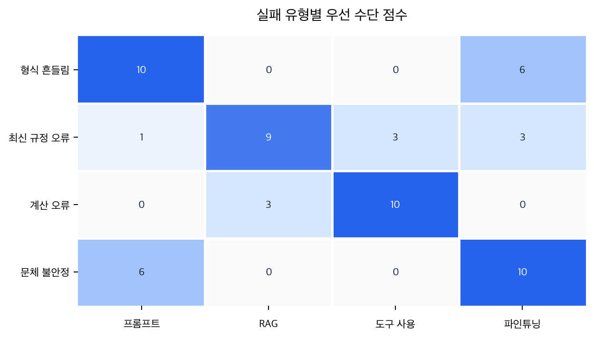

# P6-9.3 형식·근거·실행 부족으로 나누어 보는 LLM 실패

> Section ID: `P6-9.3`
> Version: `v2026.07.23`

P6-9.2까지 오면 `어떤 답이 더 assistant처럼 보이는가`, `어떤 답이 더 허용 가능하고 안전한가`까지는 읽게 됩니다. 그런데 실제 기능 개선 단계로 가면 질문이 한 번 더 바뀝니다. 이제는 좋은 답의 기준을 아는 데서 멈추지 않고, 실패한 답에서 무엇이 먼저 부족했는지 진단해야 하기 때문입니다.

모델이 기대와 다르게 동작할 때, 먼저 무엇이 부족해서 실패했는가?

생성형 AI 기능을 개선할 때는 기술 이름을 먼저 고르기보다, 실패 원인이 `형식`, `근거`, `실행`, `지속 적응` 중 어디에 가까운지 먼저 나누어 보는 편이 안전하다.

## 실패 원인을 먼저 나누는 진단 지도

실패 원인 진단은 다음 질문에서 시작합니다.

- 지금 실패는 답변 형식이 흔들린 문제인가?
- 현재 근거 문서나 최신 정보가 빠진 문제인가?
- 계산, 조회, 상태 변경처럼 실행이 필요한 문제인가?
- 반복되는 도메인 문체나 과업 반응을 더 오래 맞춰야 하는 문제인가?

프롬프트 수정, RAG, 도구 사용, 파인튜닝은 이 진단 뒤에 검토하는 보강 경로입니다. 프롬프트 조정은 입력 지시와 출력 형식을 손보는 문제이고, RAG는 외부 문서와 출처를 근거로 연결하는 문제이며, 도구 사용은 계산·조회·상태 변경을 모델 밖 기능에 맡기는 문제입니다. 파인튜닝은 반복되는 도메인 패턴이나 문체 적응을 학습층으로 옮기는 문제에 가깝습니다.

여기서 조심할 점은 네 경로가 `성능을 올리는 방법`이라는 이름으로 뭉쳐 보인다는 것입니다. 실제로는 손대는 위치가 다릅니다. 프롬프트 수정은 같은 모델을 두고 입력 문장과 출력 형식을 바꿉니다. RAG는 모델이 답하기 전에 참고할 문서를 찾아 입력 쪽에 붙입니다. 도구 사용은 모델이 직접 계산하거나 조회하지 않고, 바깥 기능을 호출해 결과를 받아오게 합니다. 파인튜닝은 반복해서 필요한 반응 습관을 모델 조정 과정에 반영합니다. 그래서 같은 `답이 틀렸다`는 말도, 어디를 손봐야 하는지는 서로 달라질 수 있습니다.

이 절은 후속 장의 세부 기술을 대신 설명하지 않습니다. 여기서 닫을 문제는 `무엇을 어디서 먼저 손봐야 하는가`입니다. 프롬프트 자체의 설계는 P6-10에서, RAG와 벡터 검색은 P6-11과 P6-12에서, 도구 사용과 agent 구조는 뒤 Module에서 이어 봅니다. P6-9.4와 P6-9.5는 이 진단 중 파인튜닝 축으로 판단이 갔을 때 필요한 효율적 조정 보충학습입니다.

## 왜 정렬 다음에 바로 진단 지도를 읽는가

여기서는 `지시 튜닝`과 `정렬`까지 읽었으면 이제 모델 품질 문제도 거의 다 설명된 것처럼 느낄 수 있습니다. 하지만 실제 제품에서는 거기서부터가 시작입니다. 답이 이상할 때마다 `모델이 별로다`라고 뭉뚱그리면, 형식 문제를 근거 검색 문제로 오해하거나, 최신성 문제를 프롬프트만 길게 써서 버티거나, 계산 문제를 파인튜닝으로 해결하려고 드는 식의 엇나간 대응이 반복되기 쉽습니다.

그래서 진단 지도는 앞에서 잡은 `응답 습관 조정`과 `허용 가능한 행동 기준`을 실제 개선 작업으로 번역하는 다리 역할을 합니다. 여기서는 어떤 반응이 더 assistant처럼 보이는지, 어떤 답이 더 허용 가능하고 안전한지를 다시 평가하는 데서 멈추지 않습니다. 지금 실패가 형식 문제인지, 근거 문제인지, 실행 문제인지, 지속 적응 문제인지 먼저 가릅니다.

즉, 이 절의 닫힘은 `기술 이름 네 개를 아는 것`이 아니라 `문제 증상을 보고 실패 원인을 덜 잘못 가르는 것`입니다. 프롬프트, 파인튜닝, RAG, 도구 사용이 각각 어떤 실패 유형을 먼저 겨냥하는지와 지금 보이는 문제가 형식, 근거, 실행, 지속 적응 중 어디에 더 가까운지만 여기서 잡습니다. 각 보강 경로의 실제 설계와 구현, 비용 비교표와 조직별 운영 프로세스는 뒤에서 구체화합니다.

핵심은 `모든 문제를 한 방법으로 고친다`가 아니라 `실패 원인에 따라 형식, 근거, 실행, 지속 적응을 구분해 진단한다`는 기준입니다. 이 기준이 서야 후속 기술도 `새 기술 소개`가 아니라 `실패 원인별 보강 경로`로 읽힙니다.

## 형식, 근거, 실행, 적응 문제의 구분

- 프롬프트, 파인튜닝, RAG, 도구 사용의 역할 차이를 설명할 수 있습니다.
- 문제 유형에 따라 어느 축을 먼저 점검해야 하는지 말할 수 있습니다.
- 프롬프트, RAG, 도구 사용, agent 장을 하나의 진단 지도 안에서 읽을 수 있습니다.
- 통합 미니 실습에서 왜 여러 장치를 함께 쓰는지 더 쉽게 이해할 수 있습니다.

## 네 가지 부족을 가장 짧게 구분하면

| 먼저 부족한 것 | 1차로 의심할 보강 경로 |
| --- | --- |
| 입력 지시와 출력 형식 | prompt revision |
| 최신 정보, 내부 문서, 근거 연결 | RAG |
| 계산, 조회, 실행 같은 외부 기능 | tool use |
| 반복되는 말투, 도메인 패턴, 과업 반응 | fine-tuning |

이 표의 목적은 네 기술을 자세히 설명하는 것이 아닙니다. 같은 `LLM이 틀렸다`는 증상도 부족한 층위가 다르면 먼저 볼 보강 경로가 달라진다는 점을 남기는 데 있습니다.

예를 들어 사용자가 `휴가 규정을 세 줄로 요약해 달라`고 했는데 답이 마음에 들지 않는다고 해 봅시다. 이때 한 문장으로는 모두 `답이 별로다`라고 말할 수 있지만, 실제 진단은 다음처럼 갈립니다.

| 관찰한 실패 | 먼저 볼 부족 | 왜 다른 문제인가 |
| --- | --- | --- |
| 세 줄 요약이 아니라 긴 문단으로 답함 | 형식 | 최신 규정을 더 넣어도 출력 형식은 여전히 흔들릴 수 있음 |
| 세 줄 형식은 맞지만 지난달 규정을 기준으로 답함 | 근거 | 문장 모양이 아니라 현재 문서가 빠진 문제임 |
| 남은 휴가 일수를 계산해야 하는데 숫자가 틀림 | 실행 | 규정 문서가 있어도 계산 결과는 별도 확인이 필요함 |
| 매번 같은 브랜드 말투로 써 달라 해도 요청마다 톤이 흔들림 | 지속 적응 | 한 번의 지시보다 반복 패턴을 안정화하는 문제가 커짐 |

이렇게 보면 `틀린 답`은 하나의 원인이 아닙니다. 먼저 형식이 깨졌는지, 근거가 빠졌는지, 실행 결과가 필요한지, 반복 습관이 필요한지를 나누어야 다음 보강 경로가 덜 어긋납니다.

## 보강 경로마다 잘 안 닫히는 문제

중요한 것은 `무엇이 맞는가`만이 아니라, `무엇으로는 잘 안 닫히는가`를 같이 보는 일입니다.

| 수단 | 먼저 잘 맞는 문제 | 이것만으로는 잘 안 닫히는 문제 |
| --- | --- | --- |
| 프롬프트 수정 | 형식 흔들림, 설명 순서, 말투 조정 | 최신 정보 부족, 외부 실행, 계산 정확도 보장 |
| 파인튜닝 | 반복되는 도메인 스타일, 지속적 과업 적응 | 자주 바뀌는 최신 문서 반영, 즉시 조회형 문제 |
| RAG | 최신성, 내부 문서 근거, 출처 연결 | 계산 실행, 상태 변경, 외부 시스템 동작 |
| 도구 사용 | 계산, 조회, 실제 실행 | 말투 일관성, 장기적 도메인 스타일 적응 |

즉, 진단 지도는 `네 가지 중 하나를 고른다`보다 `현재 실패가 어느 층위의 문제인가`를 먼저 분리하는 데 목적이 있습니다.

## 형식 신호가 부족할 때

다음 문제는 먼저 입력 지시와 출력 형식 신호가 부족한지 봐야 합니다.

- 답변 형식이 자주 흐트러진다
- 지시 순서를 잘못 따른다
- 같은 정보인데 더 요약되거나 더 구조화된 출력이 필요하다

이 경우에는 모델의 지식이 부족하다기보다, 현재 입력 설계가 목표를 충분히 드러내지 못할 수 있습니다.

## 지속 적응 신호가 반복될 때

다음 조건이 반복되면 일회성 입력 수정이 아니라 지속 적응 문제인지 검토할 수 있습니다.

- 특정 도메인 스타일이 계속 필요하다
- 같은 패턴의 작업을 대량으로 안정적으로 처리해야 한다
- 프롬프트만으로는 일관성이 잘 올라오지 않는다

즉, 파인튜닝은 `매번 입력을 길게 설계하는 문제`를 일부 학습층으로 옮기는 선택에 가깝습니다.

## 근거 신호가 부족할 때

다음 문제는 답변 방식보다 현재 근거와 출처 연결이 부족한지 먼저 봐야 합니다.

- 답변의 최신성이 중요하다
- 내부 문서 근거가 필요하다
- 모델 내부 기억만으로 답하게 두면 위험하다

이 경우 핵심 문제는 `어떻게 더 잘 말하게 만들까`보다 `무엇을 근거로 말하게 만들까`에 있습니다.

## 실행 신호가 부족할 때

다음 문제는 문서 근거만으로 닫히지 않고, 모델 밖 실행이나 조회가 필요한지 봐야 합니다.

- 계산을 직접 해야 한다
- 현재 상태를 조회해야 한다
- 외부 시스템에 실제 행동을 일으켜야 한다

예를 들어 일정 생성, 잔여 휴가 조회, 파일 읽기, 주문 상태 확인은 문서 근거만으로는 끝나지 않습니다. 이때는 실제 실행이나 조회를 맡을 도구 사용 경로를 검토해야 합니다.

## 한 번에 갈리지 않으면 실패 기록을 쪼갠다

실제 문제는 위 네 가지 중 하나로 깨끗하게 나뉘지 않는 경우가 많습니다. 그래서 먼저 기술 이름을 붙이기보다, 실패 기록을 더 작은 관찰 단위로 나누어야 합니다. 좋은 진단은 `RAG가 필요하다`처럼 바로 결론으로 뛰지 않고, 다음 순서로 묻습니다.

| 진단 순서 | 물어볼 질문 | 확인할 기록 |
| --- | --- | --- |
| 1. 요구가 무엇이었나 | 사용자가 기대한 출력 형식, 사실 기준, 실행 결과가 무엇인가 | 원래 요청, 시스템 지시, 기대 출력 |
| 2. 실제 답은 어디서 어긋났나 | 형식, 근거, 실행, 지속 적응 중 어떤 신호가 보이는가 | 모델 답변, 누락된 출처, 틀린 숫자, 반복 실패 패턴 |
| 3. 먼저 고치면 효과가 큰 곳은 어디인가 | 가장 큰 실패가 입력 설계, 문서 연결, 도구 실행, 조정층 중 어디에 가까운가 | 실패 빈도, 위험도, 재현 여부 |
| 4. 아직 남을 문제는 무엇인가 | 1순위 보강 뒤에도 남는 2순위 신호가 있는가 | 재실행 결과, 남은 오류 유형 |

예를 들어 `최신 휴가 규정을 세 줄로 요약해 달라`는 요청에서 답이 네 줄이고 규정 숫자도 틀렸다면, 형식과 근거가 동시에 보입니다. 이때 형식만 고치면 세 줄짜리 틀린 답이 되고, 근거만 고치면 맞는 규정을 긴 문단으로 줄 수 있습니다. 따라서 먼저 위험이 큰 근거 오류를 줄이고, 그다음 출력 형식을 안정시키는 식으로 1순위와 2순위를 나눠야 합니다.

반대로 총액 계산이 틀린 답에서 문장이 장황하다는 이유로 프롬프트부터 고치면, 더 짧고 보기 좋은 오답이 나올 수 있습니다. 진단의 목적은 예쁜 답을 먼저 만드는 것이 아니라, 어떤 부족을 먼저 줄여야 실패가 실제로 줄어드는지 찾는 데 있습니다.

## 부족한 신호를 보강 경로로 옮기는 흐름

```mermaid
--8<-- "assets/part-06/chapter-09/p6-c09-s03-solution-map-ko.mmd"
```

이 도식은 모든 선택을 기계적으로 자동화하려는 것이 아니라, 후속 장을 읽는 판단 순서를 주는 데 목적이 있습니다. 실제 문제에서는 두 신호가 함께 보일 수 있으므로, 가장 큰 부족을 먼저 잡고 두 번째 신호를 보조 대응으로 남기는 식으로 읽어야 합니다.

## 사례 및 예시

### 사례 1. 답변 형식이 자주 흐트러진다

사용자가 `항상 세 줄 요약으로 답해 달라`고 요청했는데, 어떤 답은 길고 어떤 답은 짧게 나온다고 해 봅시다. 사람은 답이 흔들리면 먼저 모델이 똑똑하지 않다고 느끼기 쉽지만, 이때 최신 문서가 없어서 틀리는 것도 아니고, 계산 도구가 없어서 실패하는 것도 아닙니다. 핵심 문제는 `어떤 형식으로 답해야 하는가`가 흔들리는 것이므로, 근거 부족이나 실행 부족으로 넘기기 전에 프롬프트 구조와 예시를 먼저 점검하는 편이 자연스럽습니다.

예를 들어 내용은 맞지만 불릿이 네 줄로 늘어나면, 최신성 문제나 계산 문제를 해결해도 여전히 사용 목적에는 맞지 않습니다. 여기서 바뀌는 점은 `모델이 똑똑한가`를 막연히 보던 기준에서 `출력 형식 요구가 실제로 안정되는가`를 보는 기준으로 이동한다는 것입니다. 그래서 이 사례에서 확인해야 할 결과는 근거 연결이나 도구 실행을 검토하기 전에 프롬프트 구조를 고쳤을 때 답변 형식 흔들림이 실제로 줄어드는가입니다.

| 지금 보이는 증상 | 사실상 먼저 부족한 것 | 먼저 보기엔 과한 대응 |
| --- | --- | --- |
| 불릿 수가 매번 다름 | 형식 지시와 예시 구조 | RAG, 계산 도구 연결 |
| 제목/요약 순서가 자주 바뀜 | 출력 순서 제약 | 파인튜닝 검토 |
| 내용은 맞는데 모양이 일정하지 않음 | 프롬프트 설계 | 최신 문서 추가 |

### 사례 2. 사내 규정을 자주 틀린다

사내 휴가 규정이 자주 바뀌는데 모델이 지난 분기 기준으로 답한다고 해 봅시다. 사람은 답변 문장이 어색하지 않으면 일단 맞다고 넘어가기 쉽지만, 이 경우 답변 형식을 아무리 다듬어도 모델 내부 기억만으로는 최신 규정 반영이 어렵습니다. 핵심 문제는 `현재 문서 근거가 없다`는 점이므로, 프롬프트를 길게 쓰기보다 최신 규정 문서가 검색되고 답변 근거로 연결되는지 먼저 봐야 합니다.

예를 들어 문장을 더 공손하게 바꾸거나 답변 길이를 조절해도, 최신 기준 숫자가 틀리면 문제는 그대로 남습니다. 여기서 바뀌는 점은 `답변이 자연스러운가`를 보던 기준에서 `최신 근거 문서가 실제로 연결되었는가`를 보는 기준으로 이동한다는 것입니다. 그래서 이 사례에서 확인해야 할 결과는 프롬프트 수정만으로는 안 고쳐지던 최신성 오류가 최신 문서 근거를 연결했을 때 실제로 줄어드는가입니다.

| 지금 보이는 증상 | 사실상 먼저 부족한 것 | 프롬프트만으로 안 닫히는 이유 |
| --- | --- | --- |
| 숫자와 규정 날짜가 자주 틀림 | 최신 근거 문서 | 입력 문장을 길게 써도 내부 기억이 최신으로 바뀌지 않음 |
| 문장은 자연스러운데 기준이 오래됨 | 현재 버전 참조 | 말투 수정이 사실 오류를 고치지 못함 |
| 출처를 물으면 답이 흔들림 | 문서 연결과 인용 근거 | 설명 방식보다 근거 부재가 핵심이기 때문 |

### 사례 3. 숫자 계산을 자주 틀린다

모델이 할인율 계산이나 총액 합산을 자주 틀린다고 해 봅시다. 사람은 `천천히 생각해 봐` 같은 프롬프트를 더 길게 쓰면 해결될 것처럼 느끼기 쉽지만, 계산 자체를 정확하게 보장해 주지는 못합니다. 핵심이 실행 정확도라면 더 긴 프롬프트보다 계산 도구 연결이 더 직접적인 해결책일 수 있습니다.

예를 들어 설명은 더 길고 그럴듯해져도, 마지막 숫자 하나가 틀리면 업무상 실패는 그대로입니다. 여기서 바뀌는 점은 `설명이 그럴듯한가`를 보던 기준에서 `실제 계산 결과가 정확한가`를 보는 기준으로 이동한다는 것입니다. 그래서 이 사례에서 확인해야 할 결과는 설명 길이를 늘리는 것보다 계산 도구로 값을 확인했을 때 최종 숫자 정확도가 실제로 더 안정되는가입니다.

### 사례 4. 같은 도메인 문체를 항상 일정하게 맞추고 싶다

법률 안내, 의료 상담 초안, 브랜드 공지처럼 같은 도메인 문체를 오래 일관되게 유지해야 하는 경우를 생각해 보겠습니다. 사람은 프롬프트에 말투 규칙을 길게 넣으면 충분하다고 느끼기 쉽지만, 요청이 많아질수록 표현이 조금씩 흔들릴 수 있습니다. 이때는 일회성 수정이 아니라 지속적인 스타일 조정 문제이므로, 파인튜닝이나 더 구조화된 조정층을 검토할 수 있습니다.

예를 들어 하루는 존댓말이 강하고 다른 날은 설명 순서가 바뀌면, 내용이 맞아도 브랜드나 도메인 톤은 쉽게 흔들릴 수 있습니다. 여기서 바뀌는 점은 `한 번 규칙을 길게 써 주는가`를 보던 기준에서 `반복 요청에서도 같은 문체가 유지되는가`를 보는 기준으로 이동한다는 것입니다. 그래서 이 사례에서 확인해야 할 결과는 같은 스타일 문제가 반복해서 남을 때 입력 문장 수정보다 모델 조정층 보강이 더 일관된 문체로 이어지는가입니다.

네 사례를 부족 신호 진단 관점으로 다시 묶으면 다음과 같습니다.

| 증상 | 먼저 의심할 부족 신호 | 1차로 확인할 보강 경로 |
| --- | --- | --- |
| 답변 형식 흔들림 | 형식 요구 반영 부족 | prompt revision |
| 최신 규정 오류 | 근거 문서 부재 | RAG |
| 계산 오류 | 실행 정확도 부족 | tool use |
| 문체 일관성 부족 | 지속적 스타일 적응 부족 | fine-tuning |

같은 내용을 `무엇이 부족한가` 기준으로 다시 보면 다음처럼 읽을 수 있습니다.

```mermaid
--8<-- "assets/part-06/chapter-09/p6-c09-s03-missing-piece-map-ko.mmd"
```

핵심은 `기술 이름을 먼저 고르는 것`이 아니라 `현재 실패가 어느 부족으로 설명되는가`를 먼저 나누는 일입니다.

## 부족 신호 진단이 필요한 장면

이 절을 읽은 뒤에는 아직 각 장의 세부 구현을 다 몰라도, 지금 막히는 것이 `형식 문제인가`, `최신 근거 문제인가`, `실행 문제인가`, `지속 스타일 문제인가`를 먼저 가르는 연습을 할 수 있습니다. 답변 형식이 자주 흔들린다면 큰 조정부터 떠올리기 전에 입력 구조와 형식 유도 문제인지 봐야 합니다. 규정 숫자와 날짜가 오래된 기준으로 나온다면 말투가 아니라 최신 문서 근거 부재가 핵심일 수 있습니다. 계산 결과나 현재 상태 조회가 자주 틀린다면 텍스트 개선보다 실행과 조회 신호를 확인해야 합니다. 같은 도메인 문체를 반복 요청마다 일정하게 유지하지 못한다면, 최신 근거보다 지속적인 스타일 적응이 필요한 장면일 수 있습니다.

여기서 중요한 것은 `어떤 기술이 더 좋아 보이는가`를 고르는 일이 아니라, 먼저 `무엇이 부족한가`를 `형식`, `근거`, `실행`, `지속 적응`으로 나눠 읽는 일입니다.

여기서 자주 섞이는 것도 다음과 같습니다.

- 최신 정보 부족과 형식 흔들림을 같은 문제로 보기 쉽습니다.
- 실행 정확도 문제를 말투나 설명 길이 문제로 오해하기 쉽습니다.
- 반복 문체 문제를 최신 문서 연결로 해결할 수 있다고 느끼기 쉽습니다.

따라서 `기술 이름보다 실패 원인 분류가 먼저`라는 기준은 실제 선택 습관이 되어야 합니다.

다음처럼 짧게 손으로 먼저 표시해 보면 Python 예제가 무엇을 계산하려는지 더 분명해집니다.

| 실패 장면 | 형식 | 근거 | 실행 | 지속 적응 | 먼저 읽을 방향 |
| --- | --- | --- | --- | --- | --- |
| 요약 형식이 매번 달라짐 | 큼 | 작음 | 작음 | 조금 있음 | 입력 지시와 출력 예시를 먼저 본다 |
| 최신 규정 번호가 틀림 | 작음 | 큼 | 조금 있음 | 작음 | 문서 검색과 출처 연결을 먼저 본다 |
| 총액 계산이 틀림 | 작음 | 조금 있음 | 큼 | 작음 | 계산 도구나 조회 결과 연결을 먼저 본다 |
| 같은 도메인 문체가 반복해서 흔들림 | 조금 있음 | 작음 | 작음 | 큼 | 반복 스타일 조정이 필요한지 본다 |

이 표는 정답지가 아니라 관찰 연습입니다. 같은 장면에서도 회사가 보는 위험, 사용자 요구, 데이터 접근 권한에 따라 표시가 달라질 수 있습니다. 다만 표시가 달라지면 뒤에서 볼 보강 경로의 우선순위도 달라져야 합니다.

다음 세 장면은 일부러 하나의 신호만 보이지 않게 만든 연습입니다. 먼저 `1순위 부족`과 `2순위 부족`을 스스로 표시한 뒤 해설과 대조해 보겠습니다.

| 장면 | 1순위 부족 | 2순위 부족 |
| --- | --- | --- |
| 고객지원 답변이 회사 정책의 최신 환불 기한을 틀리고, 답변 말투도 브랜드 톤과 다름 |  |  |
| 매출 요약 답변이 표 형식은 맞지만 합계 숫자가 틀리고, 어느 파일을 기준으로 계산했는지도 불분명함 |  |  |
| 계약서 요약이 최신 조항은 잘 인용하지만 매번 요약 순서가 달라 검토자가 다시 정리해야 함 |  |  |

해설:

| 장면 | 먼저 볼 부족 | 이어서 볼 부족 | 이유 |
| --- | --- | --- | --- |
| 환불 기한 오류와 브랜드 톤 흔들림 | 근거 | 지속 적응 | 최신 정책 오류는 사실 실패이므로 먼저 줄여야 하고, 브랜드 톤은 반복 응답 품질을 안정시키는 다음 문제임 |
| 표는 맞지만 합계와 기준 파일이 불분명함 | 실행 | 근거 | 합계는 계산 실행의 문제이고, 어떤 파일을 기준으로 했는지는 근거 연결 문제임 |
| 최신 조항은 맞지만 요약 순서가 흔들림 | 형식 | 지속 적응 | 현재 실패는 출력 구조 불안정이 먼저이고, 여러 계약서에서 반복된다면 지속 적응을 다음으로 봄 |

이 연습의 핵심은 `한 장면에 하나의 기술만 붙인다`가 아닙니다. 실패를 쪼개어 1순위와 2순위를 구분하면, 뒤의 Python 예제에서 `first_action`과 `second_action`을 왜 함께 보는지 이해하기 쉬워집니다.

## 연습 및 예제

이 예제의 목표는 겉보기에는 모두 `LLM이 잘 못한다`는 문제처럼 보여도, 실패 원인을 분류하면 먼저 확인할 부족과 뒤로 미룰 대응이 달라진다는 점을 확인하는 것입니다. 다섯 가지 대표 실패를 두고, 각 문제에 대해 `형식`, `최신 근거`, `실행`, `지속 스타일` 신호를 따로 읽어 본 뒤 어떤 보강 경로를 먼저 보고 무엇은 우선순위에서 밀어야 하는지 점수로 비교해 보겠습니다.

입력:

아래 코드는 대표적인 실패 유형 5개와 각 실패 유형마다 형식, 최신 근거, 실행, 지속 스타일 신호를 적은 관찰값을 사용합니다. 결과에서는 문제 유형별 수단 점수표, 먼저 확인할 보강 경로와 2순위 보강 경로, 우선순위에서 밀릴 대응책, 실패 원인 분류 요약을 함께 봅니다.

여기서 점수는 실제 운영 시스템이 자동으로 내리는 정답이 아닙니다. 독자가 `관찰한 실패 신호`와 `보강 경로가 겨냥하는 문제`를 분리해 보는 진단 연습용 가중치입니다. 그래서 중요한 것은 숫자 자체보다, 어떤 신호를 키우거나 줄였을 때 1순위와 2순위 보강 경로가 어떻게 바뀌는가입니다.

확인할 핵심은 프롬프트, 파인튜닝, RAG, 도구 사용이 기술 이름으로 먼저 선택되는 것이 아니라, 실패 원인이 형식·근거·실행·지속 적응 중 어디에 있는지에 따라 보강 우선순위가 달라진다는 점입니다.

```python
# 실패 신호별 점수를 합산해 어떤 보강 경로를 우선 확인할지 비교하는 예제입니다.
cases = [
    {
        "issue": "format drift",
        "symptom": "답변 형식이 자주 흔들림",
        "signals": {
            "format": 3,
            "evidence": 0,
            "execution": 0,
            "persistent_style": 1,
        },
    },
    {
        "issue": "missing latest policy",
        "symptom": "최신 규정을 자주 틀림",
        "signals": {
            "format": 0,
            "evidence": 3,
            "execution": 0,
            "persistent_style": 1,
        },
    },
    {
        "issue": "needs calculator",
        "symptom": "계산 결과가 자주 틀림",
        "signals": {
            "format": 0,
            "evidence": 1,
            "execution": 3,
            "persistent_style": 0,
        },
    },
    {
        "issue": "persistent domain style",
        "symptom": "반복 요청에서 문체가 일정하지 않음",
        "signals": {
            "format": 1,
            "evidence": 0,
            "execution": 0,
            "persistent_style": 3,
        },
    },
    {
        "issue": "mixed format and policy evidence",
        "symptom": "요약 형식도 흔들리고 최신 규정 근거도 빠짐",
        "signals": {
            "format": 2,
            "evidence": 3,
            "execution": 0,
            "persistent_style": 1,
        },
    },
]

weights = {
    "prompt revision": {
        "format": 3,
        "evidence": 0,
        "execution": 0,
        "persistent_style": 1,
    },
    "RAG": {
        "format": 0,
        "evidence": 3,
        "execution": 0,
        "persistent_style": 0,
    },
    "tool use": {
        "format": 0,
        "evidence": 1,
        "execution": 3,
        "persistent_style": 0,
    },
    "fine-tuning": {
        "format": 1,
        "evidence": 0,
        "execution": 0,
        "persistent_style": 3,
    },
}

def score_action(signals, action_name):
    action_weights = weights[action_name]
    return sum(signals[key] * action_weights[key] for key in signals)

action_counter = {}

for case in cases:
    scores = {
        action_name: score_action(case["signals"], action_name)
        for action_name in weights
    }
    ranked = sorted(scores.items(), key=lambda item: item[1], reverse=True)
    best_action, best_score = ranked[0]
    second_action, second_score = ranked[1]
    last_action, last_score = ranked[-1]
    action_counter[best_action] = action_counter.get(best_action, 0) + 1

    print("=" * 70)
    print("issue =", case["issue"])
    print("symptom =", case["symptom"])
    print("signals =", case["signals"])
    print("scores =", scores)
    print("first_action =", best_action, best_score)
    print("second_action =", second_action, second_score)
    print("not_first =", last_action, last_score)

print("[action summary]", action_counter)
```

이 예제는 로컬 `.venv`의 Python으로 실행해 본문 출력과 일치함을 확인했습니다.

실행 결과 예시는 다음처럼 읽을 수 있습니다.

```text
======================================================================
issue = format drift
symptom = 답변 형식이 자주 흔들림
signals = {'format': 3, 'evidence': 0, 'execution': 0, 'persistent_style': 1}
scores = {'prompt revision': 10, 'RAG': 0, 'tool use': 0, 'fine-tuning': 6}
first_action = prompt revision 10
second_action = fine-tuning 6
not_first = tool use 0
======================================================================
issue = missing latest policy
symptom = 최신 규정을 자주 틀림
signals = {'format': 0, 'evidence': 3, 'execution': 0, 'persistent_style': 1}
scores = {'prompt revision': 1, 'RAG': 9, 'tool use': 3, 'fine-tuning': 3}
first_action = RAG 9
second_action = tool use 3
not_first = prompt revision 1
======================================================================
issue = needs calculator
symptom = 계산 결과가 자주 틀림
signals = {'format': 0, 'evidence': 1, 'execution': 3, 'persistent_style': 0}
scores = {'prompt revision': 0, 'RAG': 3, 'tool use': 10, 'fine-tuning': 0}
first_action = tool use 10
second_action = RAG 3
not_first = fine-tuning 0
======================================================================
issue = persistent domain style
symptom = 반복 요청에서 문체가 일정하지 않음
signals = {'format': 1, 'evidence': 0, 'execution': 0, 'persistent_style': 3}
scores = {'prompt revision': 6, 'RAG': 0, 'tool use': 0, 'fine-tuning': 10}
first_action = fine-tuning 10
second_action = prompt revision 6
not_first = tool use 0
======================================================================
issue = mixed format and policy evidence
symptom = 요약 형식도 흔들리고 최신 규정 근거도 빠짐
signals = {'format': 2, 'evidence': 3, 'execution': 0, 'persistent_style': 1}
scores = {'prompt revision': 7, 'RAG': 9, 'tool use': 3, 'fine-tuning': 5}
first_action = RAG 9
second_action = prompt revision 7
not_first = tool use 3
[action summary] {'prompt revision': 1, 'RAG': 2, 'tool use': 1, 'fine-tuning': 1}
```

그래서 이 예제에서 확인해야 할 결과는 비슷해 보이는 LLM 문제라도 `무엇이 부족한가`를 먼저 분리하면, 우선 확인할 보강 경로와 지금 바로 봐도 잘 안 닫히는 경로가 실제로 달라진다는 점입니다. 특히 형식 흔들림과 문체 일관성 부족은 비슷해 보여도, 하나는 입력 설계 쪽 점수가 더 높고 다른 하나는 지속 적응 쪽 점수가 더 높게 나옵니다. 최신 규정 오류와 계산 오류도 둘 다 `틀린 답`처럼 보이지만, 하나는 근거 연결 부족이고 다른 하나는 실행 부족이라는 점이 구분됩니다. 복합 실패에서는 1순위와 2순위가 함께 보입니다. 최신 규정 근거가 빠진 문제가 더 크면 RAG를 먼저 보고, 형식 흔들림은 prompt revision으로 뒤따라 정리하는 식입니다.

이 예제에서 독자가 직접 해 볼 수 있는 조정은 다음과 같습니다.

- `signals` 값을 바꿔 보면서 어떤 조건에서 추천 수단이 뒤집히는지 확인해 보기
- `weights`를 더 보수적으로 바꿔 조직이 어떤 실패를 더 크게 보는지 실험해 보기
- `issue`를 고객지원, 재무 보고, 내부 승인 자동화 같은 새 장면으로 추가해 보기
- `first_action`만 보지 말고 2위 점수까지 함께 읽어, 왜 어떤 문제는 복합 대응이 필요한지 확인해 보기

점수표를 그림으로 보면 실패 유형이 서로 다른 보강 경로로 갈라지는 이유가 더 분명합니다. 가장 진한 칸이 먼저 확인할 경로이고, 그다음 진한 칸은 함께 남겨 둘 2순위 보강 후보입니다. 비슷해 보이는 실패라도 형식, 근거, 실행, 지속 문체 중 어느 신호가 큰지에 따라 우선순위가 달라집니다.



## 진단 지도에서 갈리는 보강 경로

이 예제는 네 가지 경로를 외워서 고르는 방식보다, 실패를 `형식`, `근거`, `실행`, `지속 적응`으로 다시 읽는 방식이 더 중요하다는 점을 보여 줍니다. 실제 시스템에서도 한 문제를 보고 곧바로 기술 이름으로 분류하기보다, 무엇이 부족해서 실패했는지 관찰 신호를 먼저 모아야 합니다. 그래야 프롬프트를 더 길게 쓸 문제와, 문서 근거를 연결할 문제와, 계산 도구를 연결할 문제와, 장기 조정층을 강화할 문제를 섞지 않게 됩니다.

## 실패 유형별 보강 경로

프롬프트, 파인튜닝, RAG, 도구 사용은 서로 경쟁하는 만능 해법이 아니라, `어떤 부족 때문에 실패했는가`에 따라 먼저 꺼내야 하는 서로 다른 수단입니다.

## 체크리스트
- 실패를 `형식`, `근거`, `실행`, `지속 적응`으로 다시 나눠 볼 수 있는가?
- 프롬프트, 파인튜닝, RAG, 도구 사용이 경쟁 해법이 아니라 서로 다른 부족을 겨냥한다는 점을 설명할 수 있는가?
- 후속 장들을 기술 목록이 아니라 진단 지도의 세부 장으로 읽을 준비가 되었는가?

## 출처와 참고 자료

- OpenAI Academy, `Prompting fundamentals`, 확인 날짜: 2026-07-19. [https://openai.com/academy/prompting/](https://openai.com/academy/prompting/){: target="_blank" rel="noopener noreferrer" }
- Patrick Lewis et al., `Retrieval-Augmented Generation for Knowledge-Intensive NLP Tasks`, NeurIPS, 2020, 확인 날짜: 2026-07-19. [https://arxiv.org/abs/2005.11401](https://arxiv.org/abs/2005.11401){: target="_blank" rel="noopener noreferrer" }
- Jason Wei et al., `Finetuned Language Models Are Zero-Shot Learners`, arXiv, 2021, 확인 날짜: 2026-07-19. [https://arxiv.org/abs/2109.01652](https://arxiv.org/abs/2109.01652){: target="_blank" rel="noopener noreferrer" }
