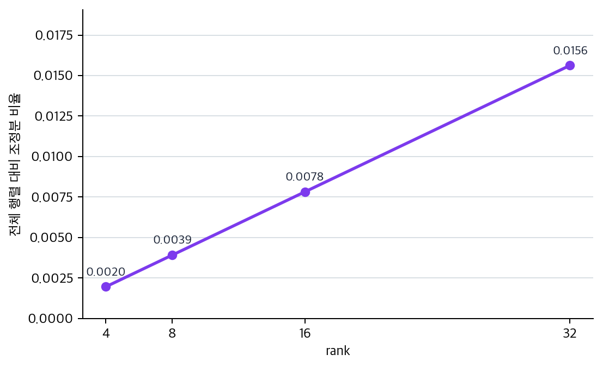

# P6-9.4 보충학습: LoRA의 low-rank는 무엇을 작게 표현하는가

> Section ID: `P6-9.4`
> Version: `v2026.07.22`

P6-8.2에서는 LoRA를 `큰 기반 모델 위에 작은 조정분을 더해 전체 파인튜닝 부담을 줄이는 방식`으로 보았습니다. 그 설명만으로도 큰 비용 감각은 잡을 수 있지만, 실제 문서에서는 곧 `Low-Rank Adaptation`, `rank`, `adapter`, `QLoRA` 같은 이름이 이어서 나옵니다. 이때 모든 이름을 한꺼번에 설명하면 보충학습 자체가 너무 커지고, 초심자는 무엇을 먼저 붙잡아야 하는지 놓치기 쉽습니다.

이 절은 먼저 LoRA 자체에 집중합니다. 목표는 실제 LoRA를 구현하는 것이 아니라, LoRA라는 이름을 `무엇을 작게 표현하려 하는가`와 `무엇을 목적에 맞게 적응시키는가`로 나누어 읽고, low-rank가 모델 본체 크기보다 `업데이트를 표현하는 방식`에 붙는 말이라는 점을 잡는 것입니다. adapter, LoRA, QLoRA를 서로 비교하는 세부 구분은 다음 보충학습인 P6-9.5에서 이어 봅니다.

## Low-Rank Adaptation을 먼저 나누어 읽기

LoRA는 Low-Rank Adaptation의 줄임말입니다. 처음부터 `rank`의 선형대수 의미나 행렬 분해 수식을 따라가려고 하면 본선보다 구현 세부가 먼저 커집니다. 여기서는 이름을 다음처럼 읽고 들어가면 충분합니다.

| 이름 조각 | 먼저 붙잡을 뜻 |
| --- | --- |
| Low-Rank | 큰 변화 전체를 그대로 학습하기보다 더 작은 형태의 변화분으로 표현하려 한다 |
| Adaptation | 기반 모델을 처음부터 새로 만드는 것이 아니라 이미 있는 모델을 목적에 맞게 적응시킨다 |

이때 `작다`는 말은 모델 본체가 작아진다는 뜻이 아닙니다. 기반 모델은 여전히 큽니다. LoRA가 줄이려는 것은 `기반 모델 전체를 다시 크게 바꾸는 부담`입니다. 즉, 거대한 본체는 최대한 유지하고, 목적에 필요한 변화만 작은 조정분으로 따로 학습해 붙이려는 발상입니다.

## 왜 `low-rank`라는 이름이 붙나

LoRA는 아주 단순하게 말하면 `큰 가중치 전체를 새로 쓰지 말고, 더 작은 조정 구조로 근사하자`는 생각입니다.

이 단계에서는 다음처럼 이해할 수 있습니다.

- 원래 가중치 행렬은 매우 큽니다
- 하지만 과업 적응에 필요한 변화 전체가 항상 그만큼 거대할 필요는 없습니다
- 그래서 작은 크기의 조정 행렬 두 개를 곱하는 식으로 `변화분`을 표현해 보자는 생각이 나옵니다

즉, LoRA는 `기반 모델 전체`보다 `업무에 맞게 바뀌는 부분`이 더 작은 구조일 수 있다고 보고 출발합니다.

`LoRA는 큰 모델 전체를 다시 배우기보다, 필요한 변화분만 더 작은 구조로 표현하려는 시도다.`

여기서 중요한 점은 LoRA가 `작은 모델`을 따로 만든다는 뜻이 아니라는 것입니다. 핵심은 기존 큰 가중치 전체를 다시 쓰지 않고, 과업 적응에 필요한 업데이트를 더 작은 구조로 표현해 보자는 데 있습니다. 그래서 low-rank라는 말은 모델 크기 자체보다 `업데이트를 표현하는 방식`에 더 가깝게 붙습니다.

## LoRA는 모델 어디에 붙는가

처음 읽을 때는 종종 `LoRA가 모델 바깥에 붙는가, 안쪽에 붙는가`에서 멈춥니다.

더 안전한 설명은 다음과 같습니다.

- 기반 모델의 원래 가중치는 크게 고정해 둡니다
- attention 같은 핵심 선형 변환 층 주변에 작은 학습 가능한 조정분을 둡니다
- 실제 출력은 `원래 가중치의 계산 결과 + 작은 조정분의 계산 결과`처럼 이해할 수 있습니다

즉, LoRA는 완전히 별도 모델을 하나 더 만드는 것이 아니라, `기반 모델 안의 일부 선형 변환에 작은 보정 장치`를 더하는 쪽에 가깝습니다.

## 연습 및 예제

이 예제의 목표는 실제 LoRA를 구현하는 것이 아니라, `큰 행렬 전체`와 `작은 rank 조정분`의 규모 차이를 rank별로 비교해 보는 것입니다.

아래 코드는 기반 가중치 크기와 여러 rank 값을 사용합니다. 결과에서는 전체 행렬 파라미터 수, rank별 LoRA 조정분 파라미터 수, 전체 대비 비율을 확인합니다.

확인할 핵심은 LoRA의 핵심이 전체 행렬 대신 작은 rank 조정분만 학습해 필요한 파라미터 수를 크게 줄이는 데 있다는 점입니다.

예제를 보기 전에 먼저 다음처럼 예상해 보면 좋습니다.

| 비교 장면 | 실행 전에 먼저 예상할 변화 | 왜 이 예상이 중요한가 |
| --- | --- | --- |
| `rank=4`에서 `rank=32`로 갈 때 | 조정분 파라미터 수와 비율이 함께 커진다 | rank는 표현 여지를 늘리지만 비용도 같이 키운다는 감각이 필요하기 때문입니다. |
| 전체 행렬과 LoRA 조정분을 비교할 때 | LoRA 조정분 비율이 매우 작게 나온다 | `효율적 조정`이 단순 슬로건이 아니라 규모 차이에서 나온 말임을 읽기 위해서입니다. |
| 여러 rank를 나란히 볼 때 | 작은 rank일수록 실험 회전에는 유리하지만 표현 여지는 더 제한적일 수 있다 | 수치가 바로 `무조건 작을수록 좋다`는 뜻은 아니라는 점을 먼저 잡아야 하기 때문입니다. |

```python
# 전체 가중치 행렬과 rank별 LoRA 업데이트 파라미터 수를 비교해 low-rank 조정분의 규모 감각을 확인하는 예제입니다.
hidden_size = 4096
ranks = [4, 8, 16, 32]

full_matrix_params = hidden_size * hidden_size

print("full_matrix_params =", full_matrix_params)

for rank in ranks:
    lora_update_params = hidden_size * rank + rank * hidden_size
    ratio = lora_update_params / full_matrix_params
    print(
        f"rank={rank:>2}: "
        f"lora_update_params={lora_update_params}, "
        f"ratio={ratio:.4f}"
    )
```

이 예제는 로컬 `.venv`의 Python으로 실행해 본문 출력과 일치함을 확인했습니다.

실행 결과 예시는 다음처럼 읽을 수 있습니다.

```text
full_matrix_params = 16777216
rank= 4: lora_update_params=32768, ratio=0.0020
rank= 8: lora_update_params=65536, ratio=0.0039
rank=16: lora_update_params=131072, ratio=0.0078
rank=32: lora_update_params=262144, ratio=0.0156
```

이 숫자는 특정 제품의 실제 설정을 주장하는 것이 아닙니다. 다만 다음 감각을 보여 줍니다.

- 전체 가중치 행렬은 매우 크고
- 작은 rank 조정분은 훨씬 작을 수 있으며
- rank를 키우면 조정 표현력은 늘 수 있지만, 동시에 조정분 규모도 함께 커집니다

그 차이가 왜 `효율적 조정`이라는 말을 낳았는지 이해하게 해 줍니다.

아래 차트는 rank가 커질 때 LoRA 조정분 비율이 어떻게 함께 커지는지 다시 보여 줍니다. 여기서 핵심은 조정분이 전체 행렬보다 작다는 사실뿐 아니라, rank 선택이 비용과 표현 여지를 동시에 바꾸는 손잡이라는 점입니다.



예제 뒤에는 숫자를 구조 선택으로 다시 번역해 보는 편이 더 중요합니다.

| 숫자에서 바로 읽어야 할 것 | 그 숫자를 잘못 읽으면 생기는 오해 | 다음 판단으로 이어지는 질문 |
| --- | --- | --- |
| rank가 커질수록 조정분 규모도 커진다 | rank를 키워도 여전히 `공짜로 가볍다`고 오해할 수 있다 | 지금 단계의 병목이 표현력 부족인가, 자원 제약인가 |
| 전체 행렬 대비 조정분 비율이 매우 작다 | LoRA를 `작은 모델을 새로 만드는 방식`으로 오해할 수 있다 | 기반 모델은 유지하고 변화분만 분리하는 이점이 필요한가 |
| 작은 rank 비교만으로는 품질을 확정할 수 없다 | 숫자만 보고 바로 최종 방식을 고를 수 있다고 오해할 수 있다 | 이번 단계가 최종 성능 확정인가, 빠른 탐색인가 |

## 체크리스트

- LoRA를 `Low-Rank Adaptation`이라는 이름으로 풀어 말할 수 있어야 합니다.
- low-rank를 모델 본체 크기 축이 아니라 업데이트 표현 축으로 설명할 수 있어야 합니다.
- rank가 커지면 조정분 규모도 함께 커진다는 점을 비용과 표현 여지의 균형으로 읽을 수 있어야 합니다.

## 출처와 참고 자료

- Edward J. Hu et al., [LoRA: Low-Rank Adaptation of Large Language Models](https://arxiv.org/abs/2106.09685){: target="_blank" rel="noopener noreferrer" }, arXiv, 2021, 확인 날짜: 2026-07-19.
