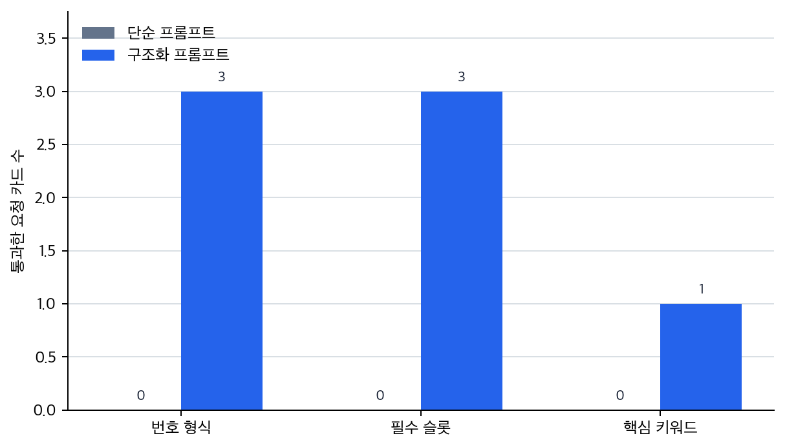

# P6-10.1 입력 지시·맥락·예시를 조정하는 프롬프트 엔지니어링

> Section ID: `P6-10.1`
> Version: `v2026.07.31`

이 절을 실습 기록으로 옮길 때는 `user_goal`, `instruction`, `context`, `example`, `output_format`, `observed_response`, `remaining_limit`를 나누어 둡니다. 그러면 프롬프트 문구로 조정할 수 있는 문제와 검색, 도구, 평가 구조로 넘겨야 하는 문제가 같은 층위로 섞이지 않습니다.

P6-9.2에서는 정렬(alignment)이 단순히 친절한 답을 만드는 문제가 아니라, 유용성, 안전성, 사실성, 서비스 정책이 함께 걸린 설계 문제라는 점을 보았습니다. 그러면 이제 사용자의 손에 가장 먼저 잡히는 도구를 봐야 합니다.

사용자는 실제로 LLM의 행동을 어떻게 관찰하고 조정하는가?

프롬프트 엔지니어링(prompt engineering)은 입력을 설계해 모델의 반응을 관찰하고, 원하는 형식과 조건에 더 가깝게 조정하는 실천적 방법이다.

같은 말을 더 쉽게 바꾸면 다음과 같습니다.

프롬프트는 모델에게 무엇을, 어떤 방식으로 답하라고 말하는 첫 번째 조정 지점입니다.

## 입력 설계가 맡는 일

- 프롬프트 엔지니어링은 무엇을 조정하는가?
- 왜 프롬프트가 LLM 사용 경험의 첫 번째 도구가 되었는가?
- 어떤 종류의 지시, 맥락, 예시가 실제로 도움이 되는가?

핵심은 프롬프트가 `현재 모델 반응을 관찰하고 조정하는 입력 설계`라는 사실입니다. Chain-of-thought, self-consistency, automatic prompt optimization은 프롬프트 층에서 중간 단계나 후보 비교를 더 다루는 전략이고, 프롬프트의 한계는 최신 근거와 실제 실행 구조가 필요한 지점에서 드러납니다.

프롬프트는 `마법의 주문`이 아니라, 모델 행동을 관찰하고 조정하기 위한 입력 설계 도구로 읽는 편이 안전합니다.

프롬프트 장은 사전학습, 파인튜닝, 정렬을 본 뒤에 `사용자가 지금 당장 조정할 수 있는 입력 설계`를 읽고, 그 한계를 확인한 뒤 RAG와 도구 사용으로 넘어가는 전환 구간입니다. 지금 단계의 질문은 현재 모델 반응을 입력 설계로 어디까지 바꿀 수 있는가입니다. 모델 가중치 조정은 파인튜닝의 층위로 남겨 두고, 최신 근거 연결과 실제 실행 연결은 RAG, tool use, AI 에이전트 구조에서 다시 봅니다.

여기서 먼저 바뀌어야 하는 인상은 `잘 쓰는 문장 요령`이 아니라 `현재 모델 반응을 관찰하고 조정하는 입력 설계`라는 이해입니다.

## 입력 설계로 풀 문제와 구조로 넘길 문제의 구분

- 프롬프트 엔지니어링을 입문 수준에서 설명할 수 있습니다.
- 지시(instruction), 맥락(context), 예시(example)의 역할을 구분할 수 있습니다.
- 왜 프롬프트가 빠른 실험과 행동 관찰의 출발점이 되었는지 말할 수 있습니다.
- 프롬프트의 한계를 `입력 설계만으로 닫히지 않는 문제`로 읽을 수 있습니다.

생성형 AI 도구를 실제로 써 보기 시작한 많은 사용자는 프롬프트에서 처음 `같은 모델도 입력 설계에 따라 다르게 움직인다`는 점을 체감했습니다. 그래서 프롬프트는 뒤의 RAG, tool use, agent보다 먼저 만나게 되는 가장 직접적인 제어 장치로 읽는 편이 좋습니다.

이 관점이 중요한 이유는 다음처럼 정리할 수 있습니다.

- 모델 구조를 다 몰라도 행동 관찰을 시작할 수 있게 하고
- 이후 RAG, tool use, agent에서 입력 설계가 왜 중요한지 연결하며
- 동시에 P6-10.2에서 프롬프트만으로는 해결되지 않는 한계를 분리하게 해 주기 때문입니다

먼저 가를 장면은 답이 나오지만 길이와 형식이 흔들리는 경우, 같은 작업인데 독자 수준이나 말투가 계속 어긋나는 경우, 답변은 그럴듯하지만 최신성이나 근거가 불안한 경우입니다. 앞의 두 경우는 지시, 맥락, 예시 중 무엇이 비었는지 먼저 볼 수 있습니다. 반대로 최신 문서, 실제 근거, 계산·조회·실행 성공이 문제라면 입력 문장을 더 정교하게 쓰는 것만으로는 닫히지 않을 수 있습니다.

이 구분을 기준으로 삼으면, 프롬프트 엔지니어링을 `좋은 문장 요령`보다 `입력 설계에서 먼저 풀 문제와 구조를 바꿔야 할 문제를 가르는 첫 제어 지점`으로 더 직접 읽을 수 있습니다.

## 프롬프트는 무엇을 바꾸나

프롬프트는 보통 모델 내부 가중치를 바꾸지 않습니다. 대신 입력을 바꿉니다.

| 질문 | 짧은 답 |
| --- | --- |
| 사용자가 바로 바꾸는 것은 무엇인가? | 입력 문장과 조건 |
| 아직 바꾸지 않는 것은 무엇인가? | 모델 내부 가중치 |
| 그래서 프롬프트의 역할은 무엇인가? | 현재 모델 반응을 더 잘 끌어내는 입력 설계 |

즉, 사용자는 다음을 설계합니다.

- 무엇을 하라고 요청할지
- 어떤 배경 정보를 같이 줄지
- 어떤 형식으로 답을 받고 싶은지
- 어떤 예시를 보여 줄지

`프롬프트는 모델을 다시 학습시키는 것이 아니라, 현재 모델이 어떤 방식으로 반응하는지 더 잘 끌어내는 입력 설계다.`

이 절을 서비스 구조 관점으로 보면, 프롬프트는 `아직 외부 문서도, 외부 도구도 붙지 않은 가장 안쪽 제어 지점`입니다.

## 프롬프트로 바로 바뀌는 것과 잘 안 바뀌는 것

프롬프트를 처음 배우면 모든 문제가 입력 문장만 잘 쓰면 해결될 것처럼 느껴지기 쉽습니다. 하지만 프롬프트는 `바로 잘 바뀌는 층`과 `그것만으로는 잘 안 바뀌는 층`이 분명히 갈립니다.

| 프롬프트로 먼저 잘 바뀌는 것 | 프롬프트만으로는 잘 안 바뀌는 것 |
| --- | --- |
| 답변 길이와 형식 | 최신 정보 접근 |
| 설명 순서와 말투 | 외부 시스템 조회와 실행 |
| 예시를 따른 출력 패턴 | 계산 정확도 보장 |
| 범위와 근거를 보라는 지시 | 장기적 도메인 스타일의 완전한 고정 |

즉, 프롬프트는 `현재 모델 반응을 어떤 식으로 끌어낼지`를 바꾸는 데 강하지만, `모델 밖에 없는 정보`나 `실행 구조`, `지속적 적응` 자체를 대신하지는 않습니다.

이 차이를 아주 짧게 다시 묶으면 다음처럼 읽으면 됩니다.

| 프롬프트로 먼저 해 볼 질문 | 프롬프트만으로는 닫히지 않는 질문 |
| --- | --- |
| 답을 더 짧게, 더 길게, 더 구조적으로 만들 수 있는가? | 최신 문서를 실제로 읽게 만들 수 있는가? |
| 같은 모델에서 형식 흔들림을 줄일 수 있는가? | 계산 정확도와 실행 성공을 보장할 수 있는가? |
| 예시를 줘서 반응 패턴을 더 안정화할 수 있는가? | 장기적 스타일 고정이나 지속적 적응까지 끝낼 수 있는가? |

이 요약이 보이면 프롬프트 한계의 핵심도 같이 잡힙니다. 프롬프트는 `현재 모델 반응을 더 잘 끌어내는 첫 제어 지점`이지만, `한계를 넘어서는 구조 보장`까지 맡는 수단은 아닙니다.

## 왜 프롬프트가 첫 번째 도구가 되었나

이유는 매우 실용적입니다.

- 바로 시도할 수 있습니다
- 비용이 상대적으로 작습니다
- 모델을 다시 학습시키지 않아도 됩니다
- 실패해도 바로 수정하고 다시 관찰할 수 있습니다

즉, 프롬프트 엔지니어링은 LLM 시대의 `가장 빠른 실험 도구`였습니다.

그래서 많은 사용자는 알고리즘을 이해하기 전에 먼저 프롬프트를 통해 모델의 성격을 체감합니다. 이 점은 학습 순서에서도 중요합니다. 사용 경험이 먼저 오고, 그 뒤에 왜 그런 반응이 나오는지 이론이 따라옵니다.

## 프롬프트를 이루는 기본 요소

실무와 학습에서 가장 자주 보는 구성은 다음 세 가지입니다.

| 요소 | 중심 질문 |
| --- | --- |
| 지시(instruction) | 무엇을 하라고 요청하는가? |
| 맥락(context) | 어떤 배경 정보나 자료를 같이 주는가? |
| 예시(example) | 어떤 입력-출력 패턴을 보여 주는가? |

이 세 가지를 분리해 보면 프롬프트가 훨씬 덜 추상적으로 보입니다.

같은 요청을 더 구조적으로 쓰는 최소 흐름은 다음처럼 볼 수 있습니다.

| 순서 | 사용자가 정하는 것 |
| --- | --- |
| 1 | 무엇을 하라고 요청할지 |
| 2 | 무엇을 참고하라고 줄지 |
| 3 | 어떤 형식으로 답하길 원하는지 |

## 지시는 무엇을 정하나

지시는 작업의 목표를 정합니다.

예를 들어:

- `세 줄로 요약해 주세요`
- `독자 기준으로 설명해 주세요`
- `표 형식으로 정리해 주세요`

같은 문장은 모델에게 `무엇을 해야 하는지`를 알려 줍니다.

## 맥락은 무엇을 정하나

맥락은 모델이 참고해야 할 배경과 범위를 정합니다.

예를 들어:

- 원문 문서 일부
- 회사 내부 정책
- 직전 대화 내용
- 용어 정의

이런 정보가 없으면 모델은 일반적 패턴으로 메우려 할 가능성이 커집니다. 따라서 맥락은 정확도와 관련이 깊습니다.

## 예시는 무엇을 정하나

예를 들어:

- 질문과 답변 한 쌍
- 입력과 분류 라벨 한 쌍
- 원문과 요약문 한 쌍

이런 예시는 `이런 방식으로 답하면 된다`는 형태 신호를 줍니다. few-shot prompting이 유용하게 느껴지는 이유가 여기에 있습니다.

즉, 예시는 내용을 더 많이 넣는 장치라기보다 `어떤 형식과 반응 패턴을 따라야 하는가`를 보여 주는 장치에 가깝습니다. 확인해야 할 결과는 예시를 붙였을 때 모델이 단순 내용 생성만이 아니라, 요청한 형식과 반응 패턴까지 실제로 더 가깝게 따르는가입니다.

## 프롬프트 엔지니어링은 관찰 작업이기도 하다

이 표현을 먼저 잡아야 프롬프트 엔지니어링을 단순 문장 꾸미기가 아니라, 입력 변화에 따라 출력이 어떻게 달라지는지 관찰하고 실패 패턴을 찾는 작업으로 읽게 됩니다. 더 정확히는:

- 입력을 바꿔 보고
- 출력이 어떻게 달라지는지 관찰하고
- 실패 패턴을 찾고
- 더 안정적인 표현을 찾는

반복 실험에 가깝습니다.

즉, 프롬프트 엔지니어링은 `문장 감각`이기도 하지만 동시에 `행동 관찰 실험`입니다.

이 점이 중요한 이유는, RAG나 도구 사용이 붙더라도 사용자는 여전히 먼저 `어떤 요청을 어떻게 적느냐`를 설계해야 하기 때문입니다.

프롬프트는 Part 6 본류에서 사용자가 가장 먼저 만지는 실무 제어 지점으로 읽고, 그다음에 어떤 구조가 더 필요한지까지 함께 연결해 두면 됩니다.

가장 짧게 붙잡아야 할 구조는 `프롬프트 입력 조정 -> RAG 근거 연결 -> tool use/AI 에이전트 실행 구조`입니다. 프롬프트 입력 조정에서는 원하는 형식과 범위를 더 잘 끌어내는 입력을 묻고, RAG에서는 프롬프트만으로 부족한 근거를 무엇으로 붙일지 묻습니다. tool use와 AI 에이전트 구조에서는 문서만으로 부족한 실행을 무엇으로 수행하고 어떤 순서로 이어 갈지 다시 봅니다. 프롬프트는 이 흐름에서 `입력 조정`을 맡고, 그 한계가 보이면 근거 연결과 실행 구조를 따로 붙여야 합니다.

여기서 먼저 남겨야 할 것은 어떤 입력 설계로 실험했는지, 답변에서 어떤 항목이 자주 빠지는지, 형식이 어디서 흔들리는지를 보여 주는 실험 메모와 형식 점검 통계입니다. 이 기록이 있어야 P6-10.2에서 프롬프트 한계를 다시 점검하고, P6-11.1의 근거 연결 판단이나 P6-13.1의 실행 필요 판단으로 왜 넘어가야 하는지 흔들리지 않습니다. 뒤로 갈수록 이 기록은 P6-16의 평가 기준과 Part 6의 회고 메모, 실행 기록, 개선 계획으로 다시 읽힙니다.

## 아주 단순하게 그리면

```mermaid
--8<-- "assets/part-06/chapter-10/p6-c10-s01-prompt-loop-ko.mmd"
```

이 도식의 핵심은 프롬프트가 한 번 쓰고 끝나는 문장이 아니라, 관찰과 수정이 이어지는 작업이라는 점입니다.

## 입력 지시·맥락·예시를 조정하는 프롬프트 엔지니어링: 확인할 판단 기준

이 사례를 읽을 때는 다음 두 가지를 먼저 확인한다.

- 프롬프트를 주문 문장이 아니라 지시, 맥락, 예시, 출력 형식을 조정하는 입력 설계로 설명하는지 확인한다.
- 이어지는 사례에서 입력, 비교 기준, 출력, 한계가 제목의 판단 기준과 어떻게 연결되는지 확인한다.

### 사례 1. 요약 작업

사용자가 긴 회의 메모를 붙여 넣고 `요약해 줘`라고만 적는 장면을 떠올려 볼 수 있습니다. 이런 경우 모델이 알아서 적당한 길이와 초점을 잡아 줄 것이라고 기대하기 쉽습니다. 하지만 이 경우 모델은 길이, 말투, 중요도 기준을 스스로 추측해야 해서 어떤 답은 너무 길고 어떤 답은 핵심 결론을 빼먹을 수 있습니다. 같은 문서라도 임원 보고용 요약과 실무 인수인계용 요약은 남겨야 할 내용이 다를 수 있습니다.

사람이 먼저 해야 할 일은 더 똑똑한 모델을 찾는 것이 아니라 `몇 줄로`, `누구를 위한 요약인지`, `무엇을 남길지`를 분명히 적는 것입니다. 여기서 바뀌는 점은 `요약해 달라`는 요청 하나로 끝내는 기준에서 `길이, 독자, 남길 기준을 명시하는가`를 보는 기준으로 이동한다는 것입니다. `독자 기준으로 세 줄로 요약해 줘`처럼 길이와 독자 수준을 함께 주면 출력 흔들림이 줄어듭니다. 그렇지 않으면 내용은 맞아도 보고용으로는 너무 길고, 인수인계용으로는 너무 성긴 답이 나올 수 있습니다. 그래서 이 사례에서 확인해야 할 결과는 요약 길이, 독자, 남길 기준을 명시했을 때 출력 범위와 형식 흔들림이 실제로 줄어드는가, 그리고 같은 문서가 용도별로 다른 구조를 안정적으로 따르는가입니다.

이 사례가 실제 실무 장면인 이유는 같은 회의 메모라도 읽는 사람이 다르면 `좋은 요약`의 기준이 완전히 달라지기 때문입니다. 임원은 결정과 위험만 빠르게 보고 싶고, 실무 담당자는 다음 조치와 미해결 항목을 더 길게 확인해야 할 수 있습니다. 그런데 프롬프트에서 이 차이를 적지 않으면 모델은 일반적인 요약 패턴에 기대어 답을 만듭니다. 그러면 어떤 날은 `결론`이 먼저 나오고, 어떤 날은 배경 설명이 길어지며, 어떤 날은 꼭 남겨야 할 액션 아이템이 빠질 수 있습니다. 즉 요약 사례의 핵심은 문장을 더 멋지게 쓰는 일이 아니라, `무엇을 버리고 무엇을 남길지`를 입력에서 먼저 고정하는 일입니다.

같은 회의 메모를 서로 다른 용도로 쓸 때 무엇을 먼저 적어야 하는지 비교하면 더 분명합니다.

| 같은 원문 문서 | 막연한 `요약해 줘`만 있을 때 흔들리는 것 | 프롬프트에서 먼저 명시해야 하는 것 |
| --- | --- | --- |
| 임원 보고용 회의 메모 | 배경 설명이 길어지고 결론이 뒤로 밀릴 수 있음 | 줄 수, 의사결정 중심, 위험 항목 유지 |
| 인수인계용 작업 메모 | 결정은 남아도 다음 조치와 담당자가 빠질 수 있음 | 독자, 남길 슬롯, 후속 작업 우선 |
| 고객 공유용 공지 초안 | 내부 용어와 미정 정보가 그대로 섞일 수 있음 | 외부 독자 기준, 공개 가능한 범위, 말투 |

이 비교의 핵심은 `요약 품질`이 모델 성능만으로 정해지지 않는다는 점입니다. 여기서 바로잡아야 할 오해는 `같은 문서면 좋은 요약도 대체로 하나일 것`이라는 생각입니다. 실제로는 문서가 같아도 독자와 목적이 바뀌면 남겨야 할 정보 구조부터 달라집니다.

### 사례 2. 분류 작업

문의 분류 작업에서 `환불`, `배송`, `계정`, `오류` 라벨만 던져 주는 장면을 생각해 볼 수 있습니다. 라벨 이름이 직관적이면 모델도 경계를 비슷하게 이해할 것이라고 기대하기 쉽습니다. 하지만 사람도 라벨 이름만 보면 각 경계를 자기 방식으로 해석해 답이 흔들릴 수 있습니다. 예를 들어 `배송이 늦어서 환불하고 싶어요` 같은 문장은 `배송`과 `환불`이 함께 들어 있어 어느 라벨을 우선해야 할지 애매합니다.

이때 입력 예시와 라벨 예시를 함께 주면 모델은 `이런 문장은 이 라벨로 보낸다`는 패턴을 더 안정적으로 읽습니다. 예시가 없으면 비슷한 문의가 날마다 다른 큐로 가서 운영 처리 순서가 흔들릴 수 있습니다. 여기서 바뀌는 점은 `라벨 이름만 던져도 된다`는 기준에서 `라벨 경계를 보여 주는 예시가 필요한가`를 보는 기준으로 이동한다는 것입니다. 그래서 분류 사례에서는 프롬프트가 정답을 새로 만드는 것이 아니라, 라벨 해석 경계를 더 또렷하게 잡아 주는 역할을 합니다. 그래서 이 사례에서 확인해야 할 결과는 라벨 이름만 던졌을 때보다 입력 예시와 라벨 예시를 함께 준 뒤에 비슷한 문의가 더 일관되게 같은 큐로 모이는가, 그리고 경계 사례에서도 우선순위가 덜 흔들리는가입니다.

이 사례도 실제 운영과 바로 붙어 있습니다. 문의 분류는 단순히 라벨 이름을 맞히는 게임이 아니라, 같은 성격의 요청을 같은 처리 흐름으로 보내는 작업입니다. 그런데 라벨 경계가 입력에서 분명히 정의되지 않으면 모델은 물론 사람 검수자도 각자 다른 기준을 쓰기 쉽습니다. 하루는 `배송 지연으로 환불 요청`을 `배송`으로 보내고, 다음 날은 `환불`로 보내면 뒤 처리 팀과 SLA가 함께 흔들립니다. 그래서 분류 프롬프트에서 중요한 것은 멋진 설명문이 아니라 `경계 사례를 어디에 넣을지`를 예시로 고정하는 일입니다.

실무에서는 특히 아래 같은 문의가 프롬프트 설계의 수준을 드러냅니다.

| 경계 문의 장면 | 라벨 이름만 두면 생기기 쉬운 흔들림 | 예시로 먼저 고정해야 하는 것 |
| --- | --- | --- |
| `배송이 늦어서 환불하고 싶어요` | `배송`과 `환불` 사이 우선순위가 흔들림 | 복합 문의의 1차 우선 라벨 |
| `로그인이 안 돼서 주문 취소를 못 하겠어요` | `계정`과 `환불` 중 어디로 보낼지 달라짐 | 장애 원인 중심인지 업무 결과 중심인지 |
| `오류가 나는데 결국 결제도 안 됐어요` | `오류`와 `결제/환불` 경계가 흔들림 | 시스템 오류 우선 규칙과 후속 큐 이동 규칙 |

이 표에서 중요한 것은 예시가 단순 설명 보충이 아니라 운영 규칙을 모델 입력에 심는 장치라는 점입니다. 여기서 꼭 붙잡아야 할 기준은 `라벨 이름이 직관적이다`와 `모든 경계 사례가 안정적으로 같은 큐로 간다`는 서로 다른 문제라는 점입니다.

### 사례 3. 문서 기반 질의응답

문서 기반 질의응답에서 사용자가 `이 정책이면 가족도 같이 등록할 수 있나요?`라고 묻는다고 해 봅시다. 질문만 충분히 구체적으로 쓰면 답도 그 범위 안에 머물 것이라고 기대하기 쉽습니다. 하지만 질문만 던지면 모델은 일반적인 복지 제도 상식을 섞어 답할 수 있고, 실제 문서 범위를 벗어날 위험이 큽니다.

사람이 먼저 해야 할 일은 더 장황하게 묻는 것이 아니라, 관련 규정 문단을 함께 넣어 `이 범위 안에서만 답하라`는 문맥을 주는 것입니다. 여기에 `근거 문장을 먼저 인용하고, 그 다음 짧게 해석하라` 같은 형식 조건까지 주면 답변 구조도 더 안정됩니다. 그렇지 않으면 그럴듯한 일반 상식을 답해도 실제 사내 규정과 다른 안내를 줄 수 있습니다.

여기서 바뀌는 점은 `질문만 잘 쓰면 된다`는 기준에서 `답이 묶여야 할 문서 범위와 근거 형식을 함께 주는가`를 보는 기준으로 이동한다는 것입니다. 그러면 응답은 일반 상식보다 붙여 준 문서 범위에 더 가깝게 묶입니다. 그래서 이 사례에서 확인해야 할 결과는 관련 문단과 근거 형식을 함께 넣었을 때 답이 일반 상식보다 실제 문서 범위에 더 가깝게 묶이는가, 그리고 답변이 근거 문장 바깥으로 불필요하게 확장되지 않는가입니다.

문서 기반 질의응답에서 프롬프트가 맡는 역할은 `문서를 찾아 오는 일` 자체보다, 붙여 준 문서를 어떤 방식으로 읽게 할지를 고정하는 일입니다. 예를 들어 같은 규정 문단을 넣어도 `답만 써라`라고 하면 모델은 근거를 생략한 채 결론만 내릴 수 있고, `근거 문장을 먼저 적고 그다음 해석하라`고 하면 답변 구조가 달라집니다. 그래서 이 사례는 `프롬프트만으로 모든 것을 해결한다`는 뜻이 아니라, 문서가 이미 있을 때도 여전히 입력 설계가 결과 구조를 크게 바꾼다는 점을 보여 줍니다.

세 사례를 입력 설계 관점으로 다시 묶으면 다음과 같습니다.

| 상황 | 막연한 요청만 두면 흔들리는 것 | 프롬프트에서 먼저 명시해야 하는 것 |
| --- | --- | --- |
| 요약 작업 | 길이, 독자, 남길 핵심 | 줄 수, 대상 독자, 중요도 기준 |
| 분류 작업 | 라벨 경계와 우선순위 | 라벨 예시, 경계 사례 |
| 문서 기반 질의응답 | 답변 범위와 근거 제한 | 참고 문단, 인용 방식, 해석 범위 |

세 사례를 더 압축하면 다음처럼 읽을 수 있습니다.

```mermaid
--8<-- "assets/part-06/chapter-10/p6-c10-s01-prompt-cases-ko.mmd"
```

핵심은 `더 화려한 문장`이 아니라 `무엇을 명시해야 흔들림이 줄어드는가`를 찾는 일입니다.

## 입력 설계로 먼저 줄일 수 있는 장면

프롬프트를 손볼 때 가장 자주 놓치는 것은 `문장을 더 길게 쓰는 일`과 `흔들리는 기준을 먼저 고정하는 일`을 같은 것으로 보는 점입니다. 실제로는 표현을 꾸미기보다, 지금 결과가 어느 칸에서 흔들리는지 먼저 분리하는 편이 더 중요합니다.

| 관찰된 흔들림 | 먼저 고정할 프롬프트 요소 | 왜 그것부터 손봐야 하는가 |
| --- | --- | --- |
| 사실관계보다 형식과 길이 쪽이 먼저 흔들림 | 작업 지시(instruction) | 지금 문제의 중심이 최신 문서나 실행이 아니라 출력 모양이면, 다른 구조를 늘리기 전에 입력 지시를 먼저 고정하는 편이 맞기 때문입니다. |
| 요약 길이가 들쭉날쭉하고 독자 수준이 맞지 않음 | 작업 지시(instruction) | 몇 줄, 누구를 위한 요약인지가 먼저 고정돼야 길이와 톤이 함께 안정됨 |
| 분류 결과는 나오지만 경계 사례마다 라벨이 바뀜 | 예시(example) | 라벨 이름 설명만으로는 경계 우선순위가 약하므로, 복합 사례 예시가 판단 경계를 붙잡아 줌 |
| 문서 질의응답이 일반 상식으로 새어 나감 | 문맥(context) | 질문을 더 다듬는 것보다 참고 문단과 답변 범위를 먼저 묶어야 근거 밖 확장이 줄어듦 |

같은 표를 실무 질문으로 바꾸면 더 분명합니다.

| 이런 장면이 보이면 | 먼저 할 질문 |
| --- | --- |
| 답은 대체로 맞는데 모양이 자꾸 흔들린다 | 지금 필요한 것이 새 구조 추가인가, 아니면 입력 지시를 더 분명히 쓰는 일인가? |
| 답이 너무 길거나 너무 짧다 | `무엇을 해라`보다 `어떤 형식으로 남겨라`를 충분히 썼는가? |
| 비슷한 문의가 다른 라벨로 간다 | 경계 사례를 예시로 보여 줬는가? |
| 근거 없는 설명이 섞인다 | 모델이 참고해야 할 문서 범위를 입력에 실제로 넣었는가? |

먼저 익혀야 하는 기준은 단순합니다. 프롬프트 엔지니어링은 `문장을 더 그럴듯하게 바꾸는 기술`이 아니라, `작업 지시`, `문맥`, `예시` 중 어디가 비어 있어 결과가 흔들리는지 찾아 그 칸을 채우는 입력 설계입니다.

## 연습 및 예제

이 예제의 목표는 `좋은 문장을 한 번 쓰는 것`이 아니라, 같은 작업을 여러 요청 카드에 반복 적용했을 때 어떤 프롬프트가 더 안정적인 결과를 내는지 직접 관찰하는 것입니다. 실제 서비스에서도 프롬프트 평가는 한 번의 멋진 출력보다 `여러 입력에서 형식과 핵심 항목이 계속 유지되는가`를 보는 쪽이 더 중요합니다.

이번 예제는 사람이 만든 응답 함수를 쓰지 않고, 모델 응답을 관찰할 때 쓰는 저장 로그 형식을 읽어 점검합니다. [p6_10_1_generate_prompt_response_log.py](../../../assets/part-06/chapter-10/p6_10_1_generate_prompt_response_log.py)는 Ollama 로컬 모델을 실제로 호출하고, 그 응답 원문을 `모델 응답 원문 -> 형식 신호와 핵심어 보존 여부 -> CSV 관찰 기록` 순서로 줄여 저장합니다. 본문 기본 예제는 이미 실행해 둔 CSV 로그를 읽습니다. 이 CSV는 특정 모델, 설정값, 실행 시점에서 만들어 둔 스냅샷 로그입니다. 실행 결과는 모델과 버전에 따라 달라질 수 있으므로, 본문에서 봐야 할 것은 특정 문장 하나가 아니라 `작업만 적은 프롬프트`, `지시와 맥락을 준 프롬프트`, `예시까지 붙인 프롬프트`, `예시와 점검 지시까지 붙인 프롬프트`의 점검 통계가 어떻게 달라지는가입니다.

고객지원팀이 매일 여러 운영 메모를 짧게 요약한다고 해 봅시다. 단순 요청은 자유롭게 요약되지만, 운영상 꼭 남겨야 하는 항목이 빠질 수 있습니다. 지시와 맥락을 주면 독자, 줄 수, 반드시 남길 항목이 더 분명해집니다. 여기에 예시까지 붙이면 모델은 `어떤 모양의 답을 따라야 하는지`를 더 직접 보게 됩니다.

아래 예제는 운영 메모 4개를 대상으로 네 프롬프트 유형의 저장 응답 로그를 비교합니다. 비교 기준은 메모별 반복 응답, 줄 수, 번호 형식, 핵심 항목 보존율, 슬롯 누락 여부, 프롬프트 유형별 전체 요약 통계입니다. 생성 스크립트를 실행하면 영어 프롬프트가 Ollama 로컬 모델에 전달되고, 응답은 같은 CSV 열로 저장됩니다. 저장 로그는 `log_source`, `model_name`, `temperature`, `slot_language` 열을 함께 두어 어떤 실행 환경에서 나온 기록인지 확인할 수 있게 했습니다. 본문에서는 재현 가능한 읽기 흐름을 위해 먼저 실행해 둔 저장 로그 CSV를 읽습니다.

프롬프트 설계 차이를 먼저 표로 보면 다음과 같습니다.

| 비교 항목 | 작업만 적은 프롬프트 | 지시+맥락 프롬프트 | 지시+맥락+예시 프롬프트 | 지시+맥락+예시+점검 프롬프트 |
| --- | --- | --- | --- | --- |
| 작업 지시 | `요약해 주세요` | `운영 담당자가 바로 읽을 3줄 요약` | 같은 지시를 유지 | 같은 지시를 유지 |
| 맥락 | 운영 메모만 있음 | 운영 메모와 독자 목적이 함께 있음 | 같은 맥락을 유지 | 같은 맥락을 유지 |
| 예시 | 없음 | 없음 | 세 줄 슬롯 출력 예시가 있음 | 같은 예시가 있음 |
| 추가 제어 | 없음 | 없음 | 없음 | 도입 문장 금지와 핵심 사실 확인 지시가 있음 |
| 점검 기준 | 사람이 눈대중 확인 | 줄 수, 슬롯, 키워드 보존율 확인 | 같은 기준으로 반복 비교 | 같은 기준으로 반복 비교 |

코드에서 확인할 핵심은 입력에 지시, 맥락, 예시가 추가될수록 답변 내용뿐 아니라 형식 점검 가능성과 사실 보존 여부도 함께 달라질 수 있다는 점입니다. `temperature`를 0으로 낮춰도 모델 응답은 완전히 고정된 계산 결과가 아니므로, 한 번의 결과보다 여러 카드와 여러 반복 로그의 통계를 함께 봐야 합니다.

저장 응답 로그는 [p6-10-1-prompt-response-log.csv](../../../assets/part-06/chapter-10/p6-10-1-prompt-response-log.csv){ .csv-preview }에 있습니다. 한 행은 하나의 모델 응답 관찰 기록입니다. 핵심 열은 `prompt_type`, `card_name`, `log_source`, `model_name`, `temperature`, `line_count`, `numbered_lines`, `slot_count`, `keyword_hits`, `keyword_total`, `missing_slots`입니다. `response_note`는 원문 응답 전체를 대신하지 않고, 어떤 형식 신호가 보였는지 짧게 남긴 관찰 메모입니다. 이 로그는 `llama3.2:latest`를 `temperature=0.2`로 호출해 만든 실행 스냅샷이며, 생성 스크립트는 번역본에서도 같은 실행 기준을 유지하기 위해 영어 프롬프트와 영어 슬롯 이름을 사용합니다.

Ollama 호출부만 떼어 보면 구조는 다음과 같습니다. 본문 기본 실행은 저장 CSV를 읽지만, 실제 모델 검증은 같은 운영 메모를 네 프롬프트 유형에 반복해서 보내고, 응답 원문을 같은 관찰 열로 줄여 저장하는 방식입니다.

```python
# 선택 실행: 같은 운영 메모를 네 프롬프트 유형으로 보내 응답 원문을 받습니다.
import json
import os
import urllib.request

ollama_url = os.environ.get("OLLAMA_URL", "http://localhost:11434/api/generate")
model_name = os.environ.get("OLLAMA_MODEL", "llama3.2:latest")
temperature = float(os.environ.get("P6_10_1_TEMPERATURE", "0.2"))

note = (
    "Mobile checkout approvals failed for 17 minutes. "
    "The payment gateway was rolled back. "
    "Operations still need to collect transaction logs before closing the incident."
)


def build_prompt(prompt_type):
    if prompt_type == "simple":
        return f"Summarize this operations note briefly.\n\nNote:\n{note}"
    if prompt_type == "instruction_context":
        return (
            "Summarize this operations note for an operations owner.\n"
            "Return exactly three numbered lines.\n"
            "Use these slot labels exactly: Situation, Immediate action, Remaining risk.\n"
            "Keep the important operational facts from the note.\n\n"
            f"Note:\n{note}"
        )
    if prompt_type == "instruction_context_example":
        return (
            "Summarize this operations note for an operations owner.\n"
            "Return exactly three numbered lines.\n"
            "Use these slot labels exactly: Situation, Immediate action, Remaining risk.\n"
            "Keep the important operational facts from the note.\n\n"
            "Example output format:\n"
            "1. Situation: One sentence about what happened.\n"
            "2. Immediate action: One sentence about what the operator should do now.\n"
            "3. Remaining risk: One sentence about what still needs watching.\n\n"
            f"Note:\n{note}"
        )
    return (
        "Summarize this operations note for an operations owner.\n"
        "Return exactly three numbered lines.\n"
        "Use these slot labels exactly: Situation, Immediate action, Remaining risk.\n"
        "Keep the important operational facts from the note.\n\n"
        "Before answering, check that each important fact from the note appears in the final answer.\n"
        "Do not add an introduction or closing sentence.\n\n"
        "Example output format:\n"
        "1. Situation: One sentence about what happened.\n"
        "2. Immediate action: One sentence about what the operator should do now.\n"
        "3. Remaining risk: One sentence about what still needs watching.\n\n"
        f"Note:\n{note}"
    )


def call_ollama(prompt):
    payload = {
        "model": model_name,
        "prompt": prompt,
        "stream": False,
        "options": {"temperature": temperature, "num_predict": 160},
    }
    request = urllib.request.Request(
        ollama_url,
        data=json.dumps(payload).encode("utf-8"),
        headers={"Content-Type": "application/json"},
        method="POST",
    )
    with urllib.request.urlopen(request, timeout=120) as response:
        return json.loads(response.read().decode("utf-8"))["response"]


for prompt_type in [
    "simple",
    "instruction_context",
    "instruction_context_example",
    "instruction_context_example_check",
]:
    print(f"\n[{prompt_type}]")
    print(call_ollama(build_prompt(prompt_type)))
```

이 호출은 Ollama 서버와 모델이 준비된 환경에서만 실행합니다. 본문에 고정한 아래 예제는 같은 관찰 구조를 서버 없이 재현하기 위해 저장 CSV를 읽습니다.

```python
# 저장 응답 로그를 읽어 입력 요소별 프롬프트의 반복 관찰 통계를 비교합니다.
import csv
from collections import defaultdict
from pathlib import Path

log_path = Path("docs/assets/part-06/chapter-10/p6-10-1-prompt-response-log.csv")
prompt_order = [
    "simple",
    "instruction_context",
    "instruction_context_example",
    "instruction_context_example_check",
]


def to_bool(value):
    return value.lower() == "true"


def read_logs(path):
    with path.open(encoding="utf-8", newline="") as file:
        rows = list(csv.DictReader(file))
    for row in rows:
        row["line_count"] = int(row["line_count"])
        row["slot_count"] = int(row["slot_count"])
        row["keyword_hits"] = int(row["keyword_hits"])
        row["keyword_total"] = int(row["keyword_total"])
        row["numbered_lines"] = to_bool(row["numbered_lines"])
    return rows


def summarize(rows):
    by_prompt = defaultdict(list)
    for row in rows:
        by_prompt[row["prompt_type"]].append(row)

    summary = {}
    for prompt_type in prompt_order:
        group = by_prompt[prompt_type]
        format_ok_count = sum(
            row["numbered_lines"] and row["line_count"] == 3
            for row in group
        )
        slot_ok_count = sum(row["slot_count"] == 3 for row in group)
        full_keyword_keep_count = sum(
            row["keyword_hits"] == row["keyword_total"]
            for row in group
        )
        average_keyword_ratio = sum(
            row["keyword_hits"] / row["keyword_total"]
            for row in group
        ) / len(group)
        summary[prompt_type] = {
            "run_count": len(group),
            "format_ok_count": format_ok_count,
            "slot_ok_count": slot_ok_count,
            "full_keyword_keep_count": full_keyword_keep_count,
            "average_keyword_ratio": round(average_keyword_ratio, 2),
        }
    return summary


def summarize_by_card(rows):
    grouped = defaultdict(list)
    for row in rows:
        grouped[(row["card_name"], row["prompt_type"])].append(row)

    result = {}
    for card_name in sorted({row["card_name"] for row in rows}):
        for prompt_type in prompt_order:
            group = grouped[(card_name, prompt_type)]
            if not group:
                continue
            result[(card_name, prompt_type)] = {
                "runs": len(group),
                "format_ok": sum(
                    row["numbered_lines"] and row["line_count"] == 3
                    for row in group
                ),
                "slot_ok": sum(row["slot_count"] == 3 for row in group),
                "full_keyword": sum(
                    row["keyword_hits"] == row["keyword_total"]
                    for row in group
                ),
            }
    return result


logs = read_logs(log_path)
summary = summarize(logs)
by_card = summarize_by_card(logs)

print("[dataset]")
print("log_count =", len(logs))
print("prompt_types =", list(summary))
print("card_names =", sorted({row["card_name"] for row in logs}))
print("log_sources =", sorted({row["log_source"] for row in logs}))
print("models =", sorted({row["model_name"] for row in logs}))
print("temperatures =", sorted({row["temperature"] for row in logs}))
print()

for prompt_type, values in summary.items():
    print(f"[{prompt_type}]")
    for key, value in values.items():
        print(key, "=", value)
print()

print("[by card]")
for (card_name, prompt_type), values in by_card.items():
    print(card_name, prompt_type, values)
```

이번 실행 스냅샷의 집계 결과는 다음처럼 읽을 수 있습니다.

```text
[dataset]
log_count = 80
prompt_types = ['simple', 'instruction_context', 'instruction_context_example', 'instruction_context_example_check']
card_names = ['account lock', 'billing outage', 'refund backlog', 'shipping delay']
log_sources = ['ollama_generated']
models = ['llama3.2:latest']
temperatures = ['0.2']

[simple]
run_count = 20
format_ok_count = 0
slot_ok_count = 0
full_keyword_keep_count = 6
average_keyword_ratio = 0.77
[instruction_context]
run_count = 20
format_ok_count = 3
slot_ok_count = 20
full_keyword_keep_count = 9
average_keyword_ratio = 0.82
[instruction_context_example]
run_count = 20
format_ok_count = 20
slot_ok_count = 20
full_keyword_keep_count = 14
average_keyword_ratio = 0.9
[instruction_context_example_check]
run_count = 20
format_ok_count = 20
slot_ok_count = 20
full_keyword_keep_count = 17
average_keyword_ratio = 0.95

[by card]
account lock simple {'runs': 5, 'format_ok': 0, 'slot_ok': 0, 'full_keyword': 4}
account lock instruction_context {'runs': 5, 'format_ok': 0, 'slot_ok': 5, 'full_keyword': 5}
account lock instruction_context_example {'runs': 5, 'format_ok': 5, 'slot_ok': 5, 'full_keyword': 5}
account lock instruction_context_example_check {'runs': 5, 'format_ok': 5, 'slot_ok': 5, 'full_keyword': 5}
billing outage simple {'runs': 5, 'format_ok': 0, 'slot_ok': 0, 'full_keyword': 2}
billing outage instruction_context {'runs': 5, 'format_ok': 0, 'slot_ok': 5, 'full_keyword': 3}
billing outage instruction_context_example {'runs': 5, 'format_ok': 5, 'slot_ok': 5, 'full_keyword': 3}
billing outage instruction_context_example_check {'runs': 5, 'format_ok': 5, 'slot_ok': 5, 'full_keyword': 5}
refund backlog simple {'runs': 5, 'format_ok': 0, 'slot_ok': 0, 'full_keyword': 0}
refund backlog instruction_context {'runs': 5, 'format_ok': 0, 'slot_ok': 5, 'full_keyword': 0}
refund backlog instruction_context_example {'runs': 5, 'format_ok': 5, 'slot_ok': 5, 'full_keyword': 5}
refund backlog instruction_context_example_check {'runs': 5, 'format_ok': 5, 'slot_ok': 5, 'full_keyword': 3}
shipping delay simple {'runs': 5, 'format_ok': 0, 'slot_ok': 0, 'full_keyword': 0}
shipping delay instruction_context {'runs': 5, 'format_ok': 3, 'slot_ok': 5, 'full_keyword': 1}
shipping delay instruction_context_example {'runs': 5, 'format_ok': 5, 'slot_ok': 5, 'full_keyword': 1}
shipping delay instruction_context_example_check {'runs': 5, 'format_ok': 5, 'slot_ok': 5, 'full_keyword': 4}
```

같은 저장 로그를 차트로 보면 입력 요소가 추가될수록 어떤 항목이 먼저 안정되는지 보입니다. 단순 프롬프트는 핵심어 일부를 남기더라도 번호 형식과 필수 슬롯을 거의 만들지 못했습니다. 지시와 맥락을 주면 슬롯 이름은 안정적으로 나오지만, 모델이 앞에 도입 문장을 붙이면서 `정확히 3줄` 조건은 자주 깨졌습니다. 예시까지 붙이면 번호 형식과 슬롯은 안정됐고, 예시에 점검 지시까지 붙이면 이번 스냅샷에서는 핵심 키워드 보존 수가 더 올라갔습니다. 즉, 예시는 출력 모양을 강하게 잡아 주고, 점검 지시는 빠뜨리면 안 되는 사실을 다시 보게 만들 수 있습니다.



이 결과를 읽을 때 핵심은 `점검 지시까지 붙이면 언제나 완벽하다`가 아닙니다. 이번 스냅샷에서는 지시+맥락+예시+점검 프롬프트가 전체 핵심 키워드 보존 수는 가장 높았지만, 환불 backlog 카드에서는 예시만 붙인 프롬프트가 더 잘 보존했습니다. 반대로 지시+맥락 프롬프트는 형식 앞에 불필요한 도입 문장을 붙여 실패한 경우가 많았지만, 슬롯 이름 자체는 안정적으로 만들었습니다. 여기서 `핵심 키워드`는 의미를 깊게 평가한 점수가 아니라 지정 문자열이 응답 안에 남았는지 보는 간단한 관찰 기준입니다. 따라서 정말 빠뜨리면 안 되는 항목이 있다면 `반드시 포함할 키워드`, `누락 시 다시 작성`, `검사 후 재요청` 같은 추가 제어를 실험하되, 그 제어도 여러 메모에서 다시 확인해야 합니다.

그래서 이 예제에서 확인해야 할 결과는 두 가지입니다.

- 지시, 맥락, 예시, 점검 지시가 추가될수록 여러 요청 카드와 반복 응답에서 `줄 수`, `번호 형식`, `슬롯 유지`가 어떻게 달라지는지 본다.
- 형식 안정성이 좋아져도 핵심 항목 보존이 자동으로 해결되는 것은 아니므로, 프롬프트 실험은 `형식 안정성`과 `내용 보존율`을 함께 점검해야 한다.

이 예제에서 독자가 직접 해 볼 수 있는 조정은 다음과 같습니다.

- CSV에 `customer_impact` 같은 새 슬롯을 추가하고 `slot_count` 기준을 더 엄격하게 바꿔 보기
- `format_ok_count` 기준을 `line_count == 3`에서 `line_count <= 3`으로 바꿔 보기
- `full_keyword_keep_count` 대신 평균 키워드 보존율을 먼저 보는 방식으로 요약 기준을 바꿔 보기

Ollama가 설치되어 있고 로컬 모델을 받을 수 있는 환경이라면, 같은 요청 카드를 실제 모델에 다시 보내 새 로그를 만들 수 있습니다. 이때는 `OLLAMA_MODEL=사용할_모델명 .venv/bin/python docs/assets/part-06/chapter-10/p6_10_1_generate_prompt_response_log.py`처럼 실행합니다. 모델에 보내는 프롬프트는 번역본에서도 같은 실행 기준을 유지하기 위해 영어로 작성했습니다. 새 CSV를 만든 뒤에는 이 본문 코드와 `p6_10_1_prompt_structure_chart.py`를 다시 실행해 저장 로그와 차트를 같은 기준으로 비교합니다. 응답 원문을 그대로 본문에 고정하기보다 위 CSV와 같은 관찰 열로 다시 저장하는 편이 좋습니다. 실시간 호출 결과는 모델과 버전에 따라 달라지므로 본문에서는 특정 문장 자체보다 `format_ok_count`, `slot_ok_count`, `full_keyword_keep_count`, `average_keyword_ratio`의 변화로 비교합니다. 저장 CSV는 이 실행 조건에서 얻은 스냅샷이므로, 독자가 다시 실행하면 숫자가 달라질 수 있습니다.

이 검증 방법이 중요한 이유는 프롬프트 엔지니어링이 `좋은 예시 하나`가 아니라 `같은 기준으로 다시 관찰할 수 있는가`의 문제이기 때문입니다. 직접 실행할 때의 흐름은 다음처럼 잡습니다.

| 단계 | 확인할 것 |
| --- | --- |
| Ollama 로그 생성 | 같은 운영 메모와 네 프롬프트 유형을 모델에 다시 보내는가 |
| CSV 관찰 열 저장 | 응답 원문을 줄 수, 슬롯 수, 핵심어 보존율 같은 비교 가능한 열로 줄였는가 |
| 집계와 차트 재생성 | 모델이나 temperature를 바꿔도 같은 지표로 입력 요소별 차이를 다시 비교할 수 있는가 |

이 예제에서 여기서 읽어야 할 핵심은 다음입니다.

- 단순 프롬프트는 `작업만 말한 상태`
- 지시+맥락 프롬프트는 `작업, 독자, 슬롯, 점검 기준`을 함께 준 상태
- 지시+맥락+예시 프롬프트는 `따라야 할 출력 패턴`까지 보여 준 상태
- 지시+맥락+예시+점검 프롬프트는 `출력 전 확인해야 할 조건`까지 붙인 상태
- 따라서 프롬프트 엔지니어링은 예쁜 문장 경쟁이 아니라 `반복 가능한 입력 설계와 점검 설계`에 가깝습니다

## 프롬프트가 바꾸는 입력 설계

이 비교에서 중요한 것은 문장을 길게 쓰느냐가 아니라, 모델이 판단에 써야 할 정보를 어떤 칸에 나눠 넣느냐입니다. Ollama로 직접 실행하면 매번 같은 숫자가 고정되지는 않을 수 있습니다. 그래서 이 절에서는 응답 원문 하나보다 저장 로그의 `format_ok_count`, `slot_ok_count`, `full_keyword_keep_count`, `average_keyword_ratio`를 비교하는 편이 더 중요합니다. 프롬프트 엔지니어링은 모델 출력 하나를 감상하는 일이 아니라, 입력을 바꾼 뒤 관찰 기록을 남기고 그 기록으로 다음 수정을 정하는 작업입니다.

## 체크리스트
- 프롬프트를 `문장 요령`이 아니라 `입력 설계와 행동 관찰 실험`으로 설명할 수 있는가?
- 지시, 맥락, 예시가 각각 무엇을 먼저 바꾸는지 구분할 수 있는가?
- P6-10.2를 `입력 조정만으로는 안 닫히는 실패`를 찾는 단계로 읽을 준비가 되었는가?

## 출처와 참고 자료

- Tom B. Brown et al., [Language Models are Few-Shot Learners](https://arxiv.org/abs/2005.14165){: target="_blank" rel="noopener noreferrer" }, arXiv, 2020, 확인 날짜: 2026-07-19.
- Jason Wei et al., [Chain-of-Thought Prompting Elicits Reasoning in Large Language Models](https://arxiv.org/abs/2201.11903){: target="_blank" rel="noopener noreferrer" }, arXiv, 2022, 확인 날짜: 2026-07-19.
- OpenAI, [Prompting | ChatGPT Learn](https://learn.chatgpt.com/docs/prompting){: target="_blank" rel="noopener noreferrer" }, 확인 날짜: 2026-07-19.
- Ollama, [API Introduction](https://docs.ollama.com/api/introduction){: target="_blank" rel="noopener noreferrer" }, 확인 날짜: 2026-07-22.
- Ollama, [Quickstart](https://docs.ollama.com/quickstart){: target="_blank" rel="noopener noreferrer" }, 확인 날짜: 2026-07-22.
