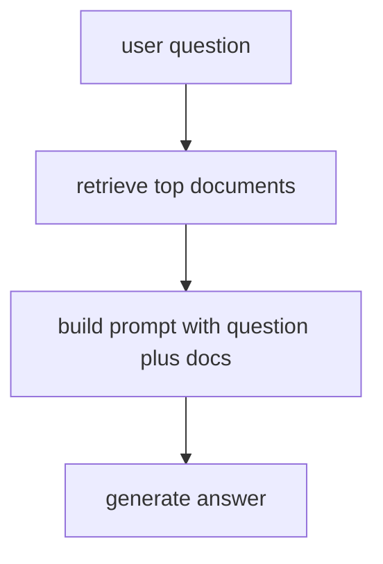
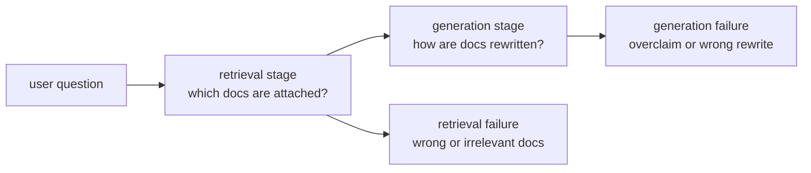

# P6-10.2 검색 결과와 생성의 결합

> Section ID: `P6-10.2`
> Version: `v2026.07.09`

P6-10.1에서는 RAG(retrieval-augmented generation)가 왜 필요한지 보았습니다. 이제 한 단계 더 들어가야 합니다.

찾아온 문서는 실제로 어디에 붙고, 답변은 그 위에서 어떻게 만들어지는가?

이 절은 그 흐름을 직관적으로 설명합니다.

여기서는 RAG의 기본 정의를 다시 길게 반복하지 않습니다. 외부 근거를 붙여 생성하는 구조의 기본 뜻은 P6-10.1과 개념사전을 기준으로 다시 붙잡고, 이 절은 그 근거가 실제 입력과 생성 흐름 안에서 어떻게 결합되는지에 집중합니다.

RAG에서 검색 결과는 모델 입력 맥락에 붙고, 모델은 그 문서 범위 안에서 답을 생성하려고 시도한다.

## 이 절의 범위

이 절은 다음 질문에 답합니다.

- 검색 결과는 생성 전에 어떻게 쓰이는가?
- 문서를 많이 넣는다고 항상 좋은가?
- 검색 품질과 생성 품질은 왜 따로 봐야 하는가?

이 절에서는 다음 내용을 깊게 다루지 않습니다.

- chunking 전략 세부
- reranker 구현 세부
- context window 최적화 알고리즘

검색 저장소와 인덱스 문제는 다음의 P6-11.1 벡터 데이터베이스와 P6-11.2 인덱스와 검색 품질에서 다시 회수합니다. context window 제약 자체는 앞의 P6-3.2 attention과 context window에서 이미 다루었고, 운영상 제약은 P6-16.1에서 다시 연결합니다.

이 절에서는 RAG를 `검색 후 생성`이라는 두 단계 구조로 분해하고, 두 단계 각각의 실패 지점을 구분합니다.

이 절은 `검색-생성 결합 축`으로 읽으면 됩니다.

| 지금 단계의 손잡이 | 바로 다음에 이어질 질문 | 뒤에서 본격적으로 다시 읽는 위치 |
| --- | --- | --- |
| RAG 필요 판단 | 왜 답 전에 문서를 붙여야 할까? | P6-10.1 |
| 검색-생성 결합 | 그 문서가 실제로 어디에 붙고 어떻게 답으로 이어질까? | P6-10.2 |
| retrieval 저장소와 탐색 구조 | 그 문서를 어떤 저장 구조와 인덱스로 다시 꺼낼까? | P6-11 |

이 절은 Part 6에서 `검색 결과와 생성의 결합`을 대표로 설명하는 Section입니다. `RAG`를 한 단계처럼 뭉뚱그리지 않고, 검색 실패와 생성 실패를 따로 나눠 읽는 기준선을 여기서 세웁니다.

즉, 지금 장의 핵심은 `문서를 붙여야 하는가`에서 `붙인 문서가 실제 입력 맥락과 최종 답 사이에서 어떻게 작동하는가`로 손잡이가 바뀌고, 이 절이 `RAG 필요 판단 -> 검색-생성 결합 -> retrieval 저장소와 탐색 구조` 가운데 `검색-생성 결합` 단계를 맡는다는 점입니다.

## 이 절의 목표

- 검색 결과와 생성이 어떻게 이어지는지 설명할 수 있습니다.
- 검색 단계와 생성 단계의 실패를 구분할 수 있습니다.
- 많이 넣는 것과 잘 넣는 것이 다르다는 점을 말할 수 있습니다.
- 다음 장의 벡터 데이터베이스와 인덱스 설명으로 자연스럽게 넘어갈 수 있습니다.

## 이 절을 읽는 순서

이 절은 다음 순서로 읽으면 흐름이 잘 잡힙니다.

1. 먼저 `검색 결과는 어디에 붙나`와 `문서를 많이 넣으면 항상 좋은가`를 읽고, 검색 결과가 답변 뒤가 아니라 생성 전 입력 맥락에 붙는다는 점과 `많이 넣기`와 `잘 넣기`의 차이를 잡습니다.
2. 그다음 `검색 실패와 생성 실패는 어떻게 다른가`와 `왜 답변 품질이 흔들릴 수 있나`를 읽으면서 RAG 실패를 두 단계로 분리해 봅니다.
3. 마지막으로 사례와 Python 예제를 보면서, 같은 오답처럼 보여도 `문서를 잘못 가져온 경우`와 `문서를 가져왔지만 과장하거나 잘못 풀어 쓴 경우`를 따로 점검해야 한다는 점을 확인합니다.

## 검색 결과는 어디에 붙나

가장 단순한 형태에서는 검색된 문서 일부가 프롬프트 맥락에 함께 들어갑니다.

예를 들어 입력은 다음처럼 구성될 수 있습니다.

- 사용자 질문
- 검색된 문서 발췌
- 답변 형식 지시

즉, 모델은 `질문만` 받는 것이 아니라, `질문 + 관련 문서 + 응답 지시`를 함께 받게 됩니다.

`RAG는 검색 결과를 모델 바깥에서 따로 가지고 있다가, 답하기 직전에 입력 맥락으로 붙여 넣는 구조다.`

여기서 먼저 남겨야 할 것은 어떤 문서를 얼마나 관련 있다고 보고 실제로 붙였는지, 어떤 근거 문장을 선택했는지, 최종 답이 문서를 과장하거나 벗어나지 않았는지를 보여 주는 검색 기록과 답안 점검 메모입니다. 이 기록이 있어야 검색 실패와 생성 실패를 나눌 수 있고, 뒤로 갈수록 P6-11.1, P6-11.2의 검색 품질 점검, P6-15의 평가, P6-16의 운영 판단, Part 6의 검색 회수 기록과 회고 메모로 다시 읽힙니다.

## 문서를 많이 넣으면 항상 좋은가

아닙니다. 여기서 중요한 것은 `양`보다 `관련성`과 `정리 방식`입니다.

문서를 너무 많이 넣으면:

- 핵심이 묻힐 수 있고
- 서로 충돌하는 문장이 섞일 수 있으며
- context window를 낭비할 수 있고
- 모델이 오히려 헷갈릴 수 있습니다

따라서 검색 결과는 `많이 모으는 것`보다 `질문에 맞는 자료를 적절한 크기와 순서로 넣는 것`이 더 중요합니다.

## 검색 실패와 생성 실패는 어떻게 다른가

이 구분이 매우 중요합니다.

### 검색 실패

- 관련 문서를 못 찾았다
- 오래된 문서가 먼저 나왔다
- 질문과 상관없는 문서가 섞였다

### 생성 실패

- 문서를 가져왔는데도 잘못 요약했다
- 문서 근거보다 일반 기억으로 답했다
- 출처를 잘못 연결했다

즉, RAG 시스템에서 답이 이상하면 항상 `모델이 나쁘다`고만 말할 수 없습니다. 먼저 검색이 틀렸는지, 생성이 틀렸는지를 나눠 봐야 합니다.

같은 오답처럼 보여도 먼저 보인 신호에 따라 바로 확인할 기록과 다음 조치는 달라집니다.

| 먼저 보인 신호 | 먼저 의심할 실패 축 | 가장 먼저 다시 볼 기록 | 바로 다음 조치 | 서두르면 안 되는 결론 |
| --- | --- | --- | --- | --- |
| 붙은 문서 제목이나 발췌가 질문과 어긋난다 | 검색 실패 | 어떤 문서가 붙었는지, 관련성 점수가 어땠는지, 어떤 근거 문장을 골랐는지 다시 봅니다 | 어떤 문서가 왜 상위에 왔는지 다시 보고, 질문과 무관한 문서가 섞였는지 먼저 뺍니다 | 곧바로 프롬프트 문장만 고치면 해결된다고 단정하지 않습니다 |
| 붙은 문서는 맞는데 답이 조건을 빼먹거나 과장한다 | 생성 실패 | 답 초안이 실제 근거 문장을 벗어났는지, 근거 점검에서 어디가 흔들렸는지 다시 봅니다 | 답 초안이 실제 근거 문장을 벗어났는지 확인하고, 요약 지시와 근거 점검 규칙을 다시 봅니다 | 검색 품질이 이미 충분하다고 단정하지 않습니다 |
| 검색도 어색하고 답도 함께 흔들린다 | 검색 실패가 생성으로 전염된 경우 | 검색 기록과 답 초안을 함께 봅니다 | 먼저 검색 오염을 줄인 뒤, 그다음 생성 지시를 다시 조정합니다 | 한 번의 오답만 보고 모델 전체 능력 문제로 확대하지 않습니다 |

## 왜 답변 품질이 흔들릴 수 있나

RAG는 두 단계를 결합하기 때문에 흔들릴 수 있는 지점도 늘어납니다.

- 검색 문서 선택
- 문서 길이와 발췌 방식
- 문서 순서
- 생성 지시 방식
- 인용 형식

이 때문에 RAG는 단순히 검색 하나, 생성 하나가 아니라 `검색 파이프라인 + 생성 파이프라인`으로 읽는 것이 더 정확합니다.

## 아주 단순하게 그리면



이 도식의 핵심은 검색 결과가 답변 뒤에 붙는 것이 아니라, `답변 전에 입력 맥락으로 들어간다`는 점입니다.

## 사례 및 예시

### 사례 1. 제품 지원 챗봇

고객이 `자동 저장을 끄려면 어디로 들어가야 하나요?`라고 묻는 제품 지원 챗봇을 생각해 볼 수 있습니다. 검색 단계는 먼저 최신 매뉴얼에서 `자동 저장`, `설정`, `환경설정`이 들어간 관련 문단을 찾아와야 합니다. 그다음 생성 단계는 그 문단 내용을 그대로 복사하는 대신, 고객 질문에 맞춰 `어느 메뉴를 누르고 어떤 순서로 들어가야 하는지`를 다시 설명합니다. 예를 들어 문서에는 `환경설정 > 편집 > 자동 저장`처럼 경로만 적혀 있고, 생성 단계는 이를 사용자가 따라 하기 쉬운 문장으로 바꾸는 역할을 맡습니다. 만약 검색이 잘못되어 다른 제품 버전 문단을 가져오면 생성이 아무리 자연스러워도 엉뚱한 기능을 안내하게 됩니다. 여기서 바뀌는 점은 `답을 바로 쓰는 일`에서 `먼저 맞는 문단을 찾고 그다음 질문 형태로 다시 풀어 쓰는 일`로 기준이 나뉜다는 것입니다. 그래서 이 사례에서 확인해야 할 결과는 최신 매뉴얼 경로가 실제 답변 문장 안에 올바르게 반영되는가입니다.

### 사례 2. 법률 문서 보조

법률 문서 보조 도구에서 사용자가 `이 조항이면 계약 해지가 바로 가능한가요?`라고 묻는다고 해 봅시다. 검색 단계는 먼저 관련 조문과 판례 요약을 찾아 현재 질문과 가까운 문서를 모읍니다. 생성 단계는 그 문서를 바탕으로 `바로 가능`, `추가 조건 필요`, `판단 보류`처럼 질의응답 형태로 다시 정리합니다. 예를 들어 문서에는 `상당한 기간을 정해 시정 요구 후 해지 가능`이라고 되어 있는데, 생성이 중간 조건을 빼고 `즉시 해지 가능`처럼 단정하면 검색은 맞았어도 최종 답은 위험해질 수 있습니다. 여기서 바뀌는 점은 `문서를 찾았으니 끝났다`는 기준에서 `찾은 문서 조건을 빼먹지 않고 다시 정리했는가`까지 따로 보는 기준으로 이동한다는 것입니다. 그래서 이 사례에서는 `문서를 찾는 정확성`과 `문서 바깥으로 나가지 않는 정리`를 따로 봐야 합니다. 그래서 이 사례에서 확인해야 할 결과는 최종 답이 `즉시 가능`로 과장되지 않고 원문 조건을 그대로 포함하는가입니다.

### 사례 3. 개발 문서 질의응답

개발자가 `이 API에서 timeout 옵션은 어디에 넣나요?`라고 묻는 장면을 떠올려 볼 수 있습니다. 사람은 검색이 올바른 버전의 공식 문서를 가져오면 `이제 거의 끝났다`고 느끼기 쉽습니다. 하지만 생성 단계가 예전 예제 코드와 새 문서를 섞거나 옵션 이름을 비슷한 다른 인자로 바꿔 말하면, 최종 답은 여전히 실패로 이어질 수 있습니다. 예를 들어 문서에는 `request_timeout`인데 생성이 익숙한 다른 라이브러리 이름인 `timeout_ms`로 바꿔 말하면, 문서는 맞았어도 답은 바로 깨집니다. 즉, 검색이 맞다고 해서 자동으로 답도 맞는 것은 아닙니다. 여기서 바뀌는 점은 `검색 성공`과 `최종 답 정확성`을 같은 일로 보지 않고, `찾아온 이름을 답변에도 그대로 유지하는가`를 별도 기준으로 보게 된다는 것입니다. 그래서 이 사례에서 확인해야 할 결과는 검색된 공식 옵션명이 최종 답변에도 그대로 유지되고, 비슷한 다른 인자 이름으로 바뀌지 않는가입니다.

세 사례를 단계 구분 관점으로 다시 묶으면 다음과 같습니다.

| 상황 | 검색 단계가 먼저 맞아야 하는 것 | 생성 단계가 이어서 지켜야 하는 것 |
| --- | --- | --- |
| 제품 지원 챗봇 | 현재 버전의 정확한 메뉴 경로 문단 회수 | 문단 내용을 사용자 절차 문장으로 정확히 풀어쓰기 |
| 법률 문서 보조 | 관련 조문과 조건 문단 회수 | 조건을 빠뜨리지 않고 단정 표현을 피하기 |
| 개발 문서 질의응답 | 현재 버전의 공식 옵션 문단 회수 | 옵션명을 비슷한 다른 이름으로 바꾸지 않기 |

같은 내용을 단계 분리 구조로 다시 보면 다음처럼 읽을 수 있습니다.



핵심은 `RAG가 한 단계처럼 보이더라도 내부에서는 검색과 생성이 따로 흔들린다`는 점입니다.

## 연습 및 예제

이번 예제의 목표는 검색과 생성을 한 단계로 뭉개지 않고, `문서를 찾는 단계`와 `그 문서를 붙여 답을 만드는 단계`를 분리해서 보는 감각을 만드는 것입니다. 이번에는 같은 질문에 대해 `정상 payload`, `검색 오염 payload`, `생성 과장 payload`를 나란히 두고, 어디서 실패가 생겼는지 원인을 분리해서 보겠습니다.

문제 상황:

- 사용자는 `벡터 검색이 왜 필요한가요?`라고 묻고 있음
- 검색 단계는 관련 문서를 골라야 하고
- 생성 단계는 그 문서를 바탕으로 독자용 설명을 다시 써야 함
- 검색이 맞아도 생성이 과장되면 최종 답은 다시 틀어질 수 있음

입력:

- 질문
- 검색 결과 문서 목록 세 묶음
- 생성용 입력 payload 세 개

출력:

- 어떤 문서가 입력에 포함되었는지
- 그 문서를 바탕으로 만든 최종 설명
- 검색 실패와 생성 실패를 나누어 볼 수 있는 점검값
- 무관 문서 혼입과 과장 표현 여부

먼저 이 예제에서 보고 싶은 실패 유형을 표로 정리하면 다음과 같습니다.

| payload | 검색 상태 | 생성 상태 | 읽어야 할 핵심 |
| --- | --- | --- | --- |
| `relevant_only` | 관련 문서만 포함 | 문서 범위 안에서 설명 | 정상 흐름 |
| `mixed_with_irrelevant` | 무관 문서 섞임 | 오염된 문서를 따라감 | 검색 실패가 생성으로 전염 |
| `retrieval_ok_but_generation_overclaims` | 검색은 정상 | 생성이 문서 밖으로 과장 | 생성 실패 |

문제 상황:

- RAG 실패는 검색 단계 문제인지 생성 단계 과장인지 구분해서 봐야 대응이 달라진다

입력(input):

위에 정리한 질문과 세 가지 payload 시나리오를 사용합니다.

확인할 개념:

- RAG 실패는 검색이 틀린 경우와 생성이 문서 밖으로 과장한 경우를 나눠 봐야 원인을 정확히 잡을 수 있다

```python
question = "벡터 검색이 왜 필요한가요?"

payloads = [
    {
        "name": "relevant_only",
        "question": question,
        "docs": [
            {"title": "문서 A", "text": "의미가 비슷한 텍스트를 벡터 공간에서 가깝게 찾는다."},
            {"title": "문서 B", "text": "키워드가 달라도 의미 기반 검색이 가능하다."},
        ],
        "instruction": "문서를 바탕으로 입문 독자 기준으로 두 문장으로 설명해 주세요.",
        "mode": "grounded",
    },
    {
        "name": "mixed_with_irrelevant",
        "question": question,
        "docs": [
            {"title": "문서 A", "text": "의미가 비슷한 텍스트를 벡터 공간에서 가깝게 찾는다."},
            {"title": "문서 X", "text": "무관한 마케팅 문구 조합을 더 다양하게 만든다."},
        ],
        "instruction": "문서를 바탕으로 입문 독자 기준으로 두 문장으로 설명해 주세요.",
        "mode": "grounded",
    },
    {
        "name": "retrieval_ok_but_generation_overclaims",
        "question": question,
        "docs": [
            {"title": "문서 A", "text": "의미가 비슷한 텍스트를 벡터 공간에서 가깝게 찾는다."},
            {"title": "문서 B", "text": "키워드가 달라도 의미 기반 검색이 가능하다."},
        ],
        "instruction": "문서를 바탕으로 입문 독자 기준으로 두 문장으로 설명해 주세요.",
        "mode": "overclaim",
    },
]


def generate_from_payload(payload):
    first = payload["docs"][0]["text"]
    second = payload["docs"][1]["text"]

    if payload["mode"] == "grounded":
        return f"벡터 검색은 {first} 그래서 {second}"

    return (
        f"벡터 검색은 {first} "
        "그래서 항상 최신 정보와 정답을 자동으로 보장한다."
    )


def inspect_payload(payload, answer):
    contains_irrelevant_doc = any("무관" in doc["text"] for doc in payload["docs"])
    answer_mentions_irrelevant_content = "마케팅" in answer or "무관" in answer
    answer_overclaims = "항상 최신 정보와 정답을 자동으로 보장" in answer

    return {
        "doc_count": len(payload["docs"]),
        "doc_titles": [doc["title"] for doc in payload["docs"]],
        "contains_irrelevant_doc": contains_irrelevant_doc,
        "answer_mentions_irrelevant_content": answer_mentions_irrelevant_content,
        "answer_overclaims": answer_overclaims,
        "retrieval_failed": contains_irrelevant_doc,
        "generation_failed": (not contains_irrelevant_doc) and answer_overclaims,
    }


reports = []
for payload in payloads:
    answer = generate_from_payload(payload)
    inspect = inspect_payload(payload, answer)
    reports.append(
        {
            "name": payload["name"],
            "doc_titles": inspect["doc_titles"],
            "answer": answer,
            "inspect": inspect,
        }
    )

summary = {
    "retrieval_failure_count": sum(report["inspect"]["retrieval_failed"] for report in reports),
    "generation_failure_count": sum(report["inspect"]["generation_failed"] for report in reports),
    "irrelevant_leak_count": sum(report["inspect"]["answer_mentions_irrelevant_content"] for report in reports),
    "overclaim_count": sum(report["inspect"]["answer_overclaims"] for report in reports),
    "retrieval_failure_ratio": round(
        sum(report["inspect"]["retrieval_failed"] for report in reports) / len(reports),
        2,
    ),
    "generation_failure_ratio": round(
        sum(report["inspect"]["generation_failed"] for report in reports) / len(reports),
        2,
    ),
}

print("[summary]")
print(summary)
print()

for report in reports:
    print("=" * 80)
    print("[payload]")
    print(report["name"])
    print("[doc titles]")
    print(report["doc_titles"])
    print("[generated answer]")
    print(report["answer"])
    print("[inspect]")
    print(report["inspect"])
```

실행 결과 예시는 다음처럼 읽을 수 있습니다.

```text
[summary]
{'retrieval_failure_count': 1, 'generation_failure_count': 1, 'irrelevant_leak_count': 1, 'overclaim_count': 1, 'retrieval_failure_ratio': 0.33, 'generation_failure_ratio': 0.33}

================================================================================
[payload]
relevant_only
[doc titles]
['문서 A', '문서 B']
[generated answer]
벡터 검색은 의미가 비슷한 텍스트를 벡터 공간에서 가깝게 찾는다. 그래서 키워드가 달라도 의미 기반 검색이 가능하다.
[inspect]
{'doc_count': 2, 'doc_titles': ['문서 A', '문서 B'], 'contains_irrelevant_doc': False, 'answer_mentions_irrelevant_content': False, 'answer_overclaims': False, 'retrieval_failed': False, 'generation_failed': False}
================================================================================
[payload]
mixed_with_irrelevant
[doc titles]
['문서 A', '문서 X']
[generated answer]
벡터 검색은 의미가 비슷한 텍스트를 벡터 공간에서 가깝게 찾는다. 그래서 무관한 마케팅 문구 조합을 더 다양하게 만든다.
[inspect]
{'doc_count': 2, 'doc_titles': ['문서 A', '문서 X'], 'contains_irrelevant_doc': True, 'answer_mentions_irrelevant_content': True, 'answer_overclaims': False, 'retrieval_failed': True, 'generation_failed': False}
================================================================================
[payload]
retrieval_ok_but_generation_overclaims
[doc titles]
['문서 A', '문서 B']
[generated answer]
벡터 검색은 의미가 비슷한 텍스트를 벡터 공간에서 가깝게 찾는다. 그래서 항상 최신 정보와 정답을 자동으로 보장한다.
[inspect]
{'doc_count': 2, 'doc_titles': ['문서 A', '문서 B'], 'contains_irrelevant_doc': False, 'answer_mentions_irrelevant_content': False, 'answer_overclaims': True, 'retrieval_failed': False, 'generation_failed': True}
```

이 결과에서 먼저 봐야 할 것은 `retrieval_failure_count`와 `generation_failure_count`가 각각 따로 잡힌다는 점입니다. 즉, `mixed_with_irrelevant`는 검색이 틀려서 생성까지 오염된 경우이고, `retrieval_ok_but_generation_overclaims`는 검색은 맞았지만 생성이 문서 밖으로 과장된 경우입니다. 이 구분이 있어야 RAG 시스템을 손볼 때 `검색을 고칠지`, `생성 지시와 평가를 고칠지`를 분리해서 판단할 수 있습니다.

그래서 이 예제에서 확인해야 할 결과는 두 가지입니다.

- 검색 결과가 최종 답변 안으로 바로 녹아 없어지는 것이 아니라, 생성 직전까지는 별도의 입력 payload 구성 요소로 남는다.
- 검색 실패와 생성 실패는 같은 오답처럼 보여도 원인이 다르므로, 점검 항목도 따로 가져가야 한다.

이 예제에서 독자가 직접 해 볼 수 있는 조정은 다음과 같습니다.

- `payloads`에 문서를 한 개 더 넣어 문서 수 증가가 답변에 어떤 영향을 주는지 보기
- `mixed_with_irrelevant`의 무관 문장을 더 교묘하게 바꿔도 오염이 잡히는지 보기
- `generate_from_payload`를 바꿔 문서 제목을 출처처럼 같이 남기도록 해 보기
- `answer_overclaims` 규칙을 더 늘려 `항상`, `완벽히`, `자동으로 해결` 같은 과장 표현을 더 잡아 보기

## 이 예제를 RAG 파이프라인 관점으로 다시 보면

앞의 예제는 검색과 생성을 모두 구현하는 코드가 아니라, `문서를 찾는 단계`와 `그 문서를 붙여 답을 만드는 단계`가 실제로 분리되어 있다는 점을 가장 짧게 보여 주는 장면입니다. 여기서 중요한 것은 답변 문장이 아니라, 답변 직전까지 근거 문서가 독립된 입력 구성 요소로 남아 있다는 구조를 읽는 데 있습니다. 즉, 검색 결과가 마음에 들지 않으면 생성 프롬프트를 고치기 전에 `어떤 문서가 붙었는가`부터 다시 봐야 한다는 뜻이기도 합니다. 무관 문서가 섞였을 때 답변까지 바로 흔들린다는 점은 이 분리를 더 분명하게 보여 줍니다.

## 여기까지를 한 줄로 묶으면

RAG의 실제 결합 흐름은 `문서를 먼저 붙이고 그 위에서 답한다`는 두 단계 구조이며, 검색 실패와 생성 실패를 따로 봐야만 어디를 고쳐야 하는지 판단할 수 있습니다.

이 절에서 더 중요하게 붙잡아야 할 점은 `문서를 찾는 단계`와 `그 문서를 바탕으로 답을 만드는 단계`가 같은 문제가 아니라는 것입니다. 그래서 RAG는 검색을 더 붙였다는 설명보다, 검색 실패와 생성 실패를 따로 구분해 어디를 고쳐야 할지 판단하게 만드는 결합 구조로 읽는 편이 좋습니다.

커리큘럼 관점에서 이 절이 중요한 이유는 다음과 같습니다.

- 검색과 생성을 하나로 뭉뚱그리지 않게 하고
- 다음 장의 벡터 데이터베이스와 인덱스가 왜 필요한지 준비시키며
- 이후 평가 장에서 `검색 품질`과 `답변 품질`을 따로 점검해야 한다는 관점을 만들기 때문입니다

## 다음 장과의 연결

여기까지 오면 다음 질문이 남습니다.

- 검색은 어떤 자료구조와 저장 구조 위에서 빨라지는가?
- 텍스트를 벡터로 저장하고 찾는 시스템은 어떤 역할을 하는가?

이 질문은 P6-11.1 벡터 데이터베이스(vector database)로 이어집니다.

## 언제 검색-생성 결합 관점을 먼저 떠올려야 하는가

| 먼저 떠올릴 질문 | 검색-생성 결합 관점이 먼저 필요한 이유 | 바로 다음 절이나 뒤 장에서 이어질 것 |
| --- | --- | --- |
| 문서를 붙였는데도 왜 최종 답은 틀릴 수 있을까? | 검색 단계와 생성 단계가 따로 흔들릴 수 있기 때문입니다. | 벡터 DB, 인덱스, 검색 품질 점검 |
| 왜 문서를 많이 넣는 것이 항상 더 좋은 답으로 이어지지 않을까? | 관련성, 순서, 발췌 방식이 나쁘면 오히려 입력 맥락을 오염시킬 수 있기 때문입니다. | chunking, re-ranking, 인덱스 품질 |
| 같은 오답처럼 보여도 왜 어떤 경우는 검색을, 어떤 경우는 생성을 먼저 고쳐야 할까? | 검색 실패와 생성 실패가 다른 기록과 다른 조치를 요구하기 때문입니다. | retrieval 기록과 답변 평가 분리 |

## 이 절에서 기억할 관점

- 검색 결과는 생성 전에 입력 맥락으로 붙습니다.
- 많이 넣는 것보다 관련성 있게 잘 넣는 것이 더 중요합니다.
- 검색 실패와 생성 실패는 구분해야 합니다.
- 이 절은 다음 장의 벡터 데이터베이스와 인덱스 설명의 직접 기반입니다.

## 짧은 점검

- 검색 결과가 답변 뒤가 아니라 생성 전 입력 구성 요소라는 점을 설명할 수 있는가?
- 검색 실패와 생성 실패를 서로 다른 문제로 분리해 말할 수 있는가?
- 다음 장을 `어떻게 더 빨리, 더 관련성 있게 문서를 찾을까`의 문제로 읽을 준비가 되었는가?

## 출처와 참고 자료

- Patrick Lewis et al., [Retrieval-Augmented Generation for Knowledge-Intensive NLP Tasks](https://papers.nips.cc/paper/2020/hash/6b493230205f780e1bc26945df7481e5-Abstract.html){: target="_blank" rel="noopener noreferrer" }, NeurIPS, 2020, 확인 날짜: 2026-07-05.
- OpenAI, [Retrieval](https://developers.openai.com/api/docs/guides/retrieval){: target="_blank" rel="noopener noreferrer" }, OpenAI API Docs, 확인 날짜: 2026-07-05.
- OpenAI, [File search](https://developers.openai.com/api/docs/guides/tools-file-search){: target="_blank" rel="noopener noreferrer" }, OpenAI API Docs, 확인 날짜: 2026-07-05.
