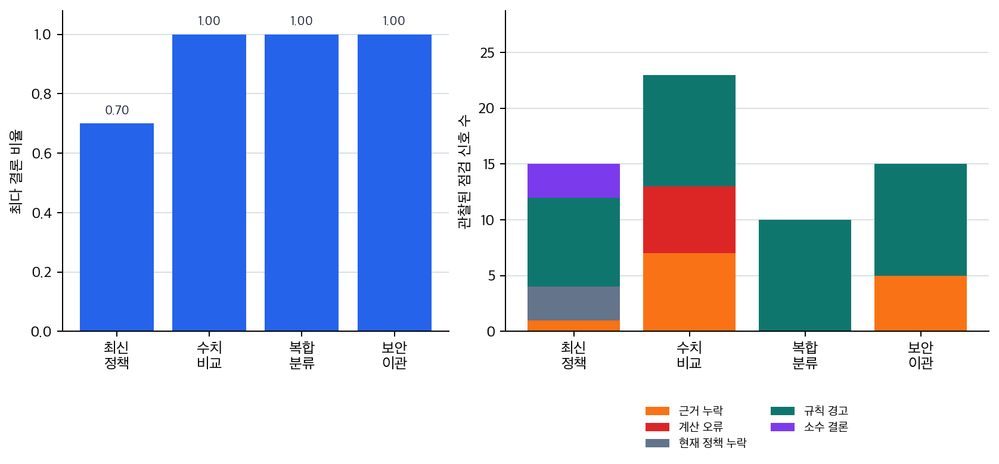

# P6-10.3 보충학습: 답변 경로 관찰과 비교

> Section ID: `P6-10.3`
> Version: `v2026.07.31`

_보조제목: CoT와 self-consistency는 한 경로와 여러 경로를 어떻게 다르게 보게 하는가_

P6-10.1에서는 프롬프트 엔지니어링(prompt engineering)을 입력 설계의 첫 번째 제어 지점으로 봤고, P6-10.2에서는 프롬프트만으로 닫히지 않는 문제를 시스템 구조로 넘기는 기준을 봤습니다. 그런데 프롬프트 층 안에서도 한 번 더 구분할 전략이 있습니다. 답을 바로 내게 할 것인가, 중간 판단 경로를 더 보게 할 것인가, 여러 후보 경로를 비교할 것인가의 차이입니다.

Chain-of-thought(CoT)와 self-consistency는 모두 답변 경로를 더 잘 보거나 비교하려는 프롬프트 전략입니다. CoT는 한 번의 답 안에서 중간 reasoning을 더 드러내려 하고, self-consistency는 여러 reasoning 후보가 어디로 모이는지 보려 합니다.

이 절에서 닫을 질문은 다음입니다.

`답 하나만 보는 방식이 불안할 때, 프롬프트 층에서 답변 경로를 어떻게 더 관찰할 수 있는가?`

## 답보다 경로가 필요한 장면

최종 답만 보면 충분한 작업도 있습니다. 하지만 조건이 여러 개 섞인 분류, 여러 문단을 비교하는 판단, 규칙 우선순위가 있는 업무에서는 답만 맞아 보이는 것과 실제 기준을 맞게 적용한 것이 다를 수 있습니다.

예를 들어 고객 문의를 `환불`, `배송`, `계정`, `오류` 중 하나로 분류한다고 해 봅시다. 모델이 `환불`이라고 답했더라도, 배송 시작 조건을 먼저 봤는지, 결제 취소 조건을 더 크게 봤는지, 운영 규칙을 무시했는지는 답 하나만으로 읽기 어렵습니다. 이때 필요한 것은 더 멋진 문장이 아니라 `어떤 기준으로 그 답에 도달했는가`를 더 잘 관찰하는 일입니다.

프롬프트 전략으로 줄일 수 있는 문제와 시스템 구조로 넘겨야 하는 문제를 나누면 다음처럼 볼 수 있습니다.

| 막히는 지점 | 먼저 볼 프롬프트 전략 | 그래도 대신하지 못하는 것 |
| --- | --- | --- |
| 답은 나오지만 기준 적용 순서가 안 보임 | CoT | 최신 문서 회수, 계산 검산, 실행 로그 |
| 한 번씩 결론이 흔들림 | self-consistency | 공통 전제가 틀렸을 때의 오류, 외부 근거 부재 |
| 답변 경로가 길어져 검토가 어려움 | 출력 형식과 경로 요약 조정 | 평가 체계, 승인 흐름 |

이 표의 핵심은 CoT와 self-consistency가 모두 `답변 경로 관찰`을 돕는 전략이라는 점입니다. 반대로 최신 문서, 계산 도구, 저장 성공 같은 시스템 바깥의 보장은 이 전략의 역할이 아닙니다.

## Chain-of-thought는 중간 기준을 드러내려는 전략이다

Chain-of-thought는 답만 바로 말하게 하지 않고, 중간 단계 reasoning을 더 분명히 드러내게 하려는 전략입니다.

단순 요청은 다음처럼 보일 수 있습니다.

> 이 문의를 환불, 배송, 계정, 오류 중 하나로 분류해 줘.

CoT 스타일 요청은 다음처럼 바뀝니다.

> 먼저 문의 안의 핵심 조건을 나누고,<br>
> 각 라벨 후보를 제외하거나 남긴 이유를 짧게 쓴 뒤,<br>
> 마지막에 최종 라벨 하나를 써 줘.

이때 기대하는 변화는 `답이 길어진다`가 아닙니다. 사람이 최종 라벨만 보지 않고, 모델이 어떤 조건을 먼저 봤고 어떤 후보를 제외했는지 검토할 수 있게 되는 것입니다.

여기서 `경로를 본다`는 말은 모델 내부를 그대로 들여다본다는 뜻이 아닙니다. 사용자가 검토할 수 있는 형태로 판단 흔적을 구조화해 받는다는 뜻에 가깝습니다. 초심자 단계에서는 다음 네 칸만 잡아도 충분합니다.

| 확인할 칸 | 묻는 질문 | 예시 |
| --- | --- | --- |
| 입력에서 잡은 조건 | 모델이 무엇을 근거로 삼았는가 | `결제 취소`, `배송 시작`, `환불 문의` |
| 후보 라벨 | 가능한 답을 무엇으로 나누었는가 | `환불`, `배송` |
| 제외 이유 | 왜 어떤 후보를 버렸는가 | 배송 문의만으로 보기에는 환불 요청이 직접 들어 있음 |
| 최종 답 | 마지막 선택은 무엇인가 | `환불` |

이 네 칸이 없으면 CoT 요청이 있어도 검토자는 긴 문장을 다시 읽어야 합니다. 반대로 네 칸이 있으면 사람이 실제 업무 규칙과 대조할 수 있습니다. 운영 규칙이 `배송 시작 여부를 먼저 확인한다`라면, 모델의 중간 기준에도 그 항목이 먼저 나타나는지 볼 수 있습니다.

다만 CoT에도 한계가 있습니다.

- 중간 단계가 길다고 그 reasoning이 반드시 맞는 것은 아닙니다.
- 최신 문서가 없으면 오래된 전제를 더 길게 설명할 수 있습니다.
- 계산이 필요한 문제에서는 중간 설명이 있어도 검산 구조가 따로 필요합니다.

따라서 CoT는 `중간 기준을 보이게 하는 입력 전략`이지, 진실 보장 장치가 아닙니다.

## self-consistency는 여러 경로의 합의를 본다

self-consistency는 한 번의 reasoning 경로만 믿지 않고, 여러 번 생성한 경로 중 더 자주 도달하는 결론을 보는 전략입니다.

이 단계에서는 다음처럼 이해하면 충분합니다.

| 전략 | 보는 것 | 기대하는 효과 |
| --- | --- | --- |
| CoT | 한 번의 답 안에서 중간 reasoning | 기준 적용 순서가 더 보임 |
| self-consistency | 여러 reasoning 후보의 결론 분포 | 우연한 한 번의 흔들림을 줄임 |

예를 들어 같은 분류 문제를 여러 번 풀게 했을 때, 세 번은 `환불`, 한 번은 `배송`으로 나온다면 `환불` 쪽이 더 안정된 후보처럼 보일 수 있습니다. 하지만 이것은 어디까지나 후보 경로의 합의를 보는 일입니다. 여러 후보가 같은 잘못된 전제를 공유하면 합의도 같이 틀릴 수 있습니다.

최신 환불 정책 질문을 여러 번 돌려 모두 같은 답이 나왔다고 해도, 모델이 최신 문서를 보지 못했다면 그 결과는 `현재 정책의 검증`이 아니라 `오래된 기억의 안정된 반복`일 수 있습니다. 이 지점에서 self-consistency와 RAG의 경계가 갈립니다.

self-consistency를 실제로 읽을 때는 `몇 번 중 몇 번 같은 결론이 나왔는가`만 보지 말고, 결론이 갈린 이유도 함께 봐야 합니다.

| 후보 경로 | 중간 판단 요약 | 최종 라벨 | 검토 포인트 |
| --- | --- | --- | --- |
| 1 | 결제 취소와 환불 문의를 먼저 봄 | 환불 | 환불 요청을 직접 근거로 삼음 |
| 2 | 배송 시작 여부를 먼저 봄 | 배송 | 운영 규칙상 먼저 확인할 조건을 잡음 |
| 3 | 환불 문의를 고객 의도로 봄 | 환불 | 고객 의도 중심으로 판단함 |
| 4 | 결제 취소를 환불 처리로 봄 | 환불 | 취소와 환불을 다소 빠르게 연결함 |

이 결과를 보면 다수결만으로 `환불`을 확정하기보다, 왜 `배송` 후보가 나왔는지도 봐야 합니다. 실제 업무 규칙이 배송 시작 여부를 우선한다면 3대 1의 다수결보다 2번 경로가 더 중요한 경고일 수 있습니다. self-consistency는 결론 분포를 보여 주지만, 어떤 경로가 업무 기준에 맞는지 판단하는 일은 여전히 사람의 기준표나 평가 구조가 맡아야 합니다.

## 합의가 곧 근거는 아니다

CoT와 self-consistency를 과신하는 가장 흔한 이유는 출력이 더 성실해 보이기 때문입니다. 중간 설명이 길고, 여러 번 물어도 비슷한 결론이 나오면 사람은 더 믿고 싶어집니다. 하지만 프롬프트 전략이 바꾸는 것은 답변 경로의 관찰 방식이지, 답의 출발점 자체가 아닙니다.

다음 비교를 기준으로 잡아 두면 안전합니다.

| 좋아 보이는 신호 | 그대로 믿으면 생기는 오판 | 다시 확인할 것 |
| --- | --- | --- |
| 중간 단계가 길고 자세함 | reasoning이 길면 사실도 맞을 것이라고 믿음 | 기준 적용 순서가 업무 규칙과 맞는가 |
| 여러 후보가 같은 결론에 도달함 | 합의했으니 최신 사실 확인도 됐다고 믿음 | 공통 전제가 현재 문서와 맞는가 |
| 결론이 안정적으로 반복됨 | 실행이나 계산도 안정적이라고 믿음 | 계산 로그, 도구 실행 결과, 근거 문서 ID가 있는가 |

CoT와 self-consistency가 유용한 장면은 `경로를 더 읽어야 하는 문제`입니다. 최신성, 근거성, 실행 성공을 확인해야 하는 문제에서는 P6-10.2에서 본 것처럼 다른 구조로 넘어가야 합니다.

## 보충학습: 답변 경로 관찰과 비교: 확인할 판단 기준

이 사례 절은 다음 질문으로 중심축을 확인한다.

- 오픈체크리스트의 중심축 문장인 "CoT와 self-consistency를 근거 보장이나 실행 보장이 아니라 답변 경로 관찰과 후보 비교 전략으로 보충해야 합니다."를 본문 사례에서 어느 대목으로 확인할 수 있는가?
- 표, 코드, 도식, 체크리스트 중 어떤 장치가 이 판단을 다시 검토하게 만드는가?

### 사례 1. 조건이 많은 분류 문제에서 CoT를 붙이는 이유

고객 문의가 `결제는 취소했는데 배송은 이미 시작됐고 환불은 언제 되나요?`처럼 여러 조건을 함께 담고 있다고 해 봅시다. 최종 라벨만 `환불`이라고 나오면 맞아 보일 수 있지만, 실제 운영 규칙은 배송 시작 여부를 먼저 보고 환불 가능성을 나눌 수도 있습니다.

이때 CoT는 모델이 `결제 취소`, `배송 시작`, `환불 요청` 중 무엇을 먼저 봤는지 드러내게 해 줍니다. 사람은 최종 라벨보다 라벨 선택 기준이 업무 규칙과 같은 순서로 적용됐는지 검토할 수 있습니다.

같은 입력을 두 방식으로 받은 결과를 비교하면 차이가 더 잘 보입니다.

| 출력 방식 | 사람이 바로 볼 수 있는 것 | 남는 불안 |
| --- | --- | --- |
| `환불` | 최종 라벨 | 배송 시작 조건을 고려했는지 모름 |
| `조건: 결제 취소, 배송 시작, 환불 문의`<br>`제외: 단순 배송 문의는 아님`<br>`최종: 환불` | 어떤 조건을 잡고 어떤 후보를 제외했는지 | 운영 규칙과 순서가 맞는지 사람이 대조해야 함 |

확인해야 할 결과는 `설명이 길어졌는가`가 아니라, `라벨을 고르는 기준이 더 읽히고 그 기준이 실제 분류 규칙과 맞는가`입니다.

### 사례 2. self-consistency가 있어도 최신 정책 문제는 남는다

최신 환불 정책을 묻는 질문을 여러 번 돌려 보고, 가장 자주 나온 답을 채택한다고 해 봅시다. 여러 번 같은 답이 나오면 안정적으로 보일 수 있습니다. 하지만 모델이 최신 정책 문서를 보지 못했다면, 여러 번 반복된 답도 오래된 정책의 반복일 수 있습니다.

이 사례에서 바뀌어야 할 기준은 `답이 몇 번 반복됐는가`가 아니라 `그 반복이 현재 문서 근거 위에서 일어났는가`입니다. self-consistency는 한 번의 흔들림을 줄일 수 있지만, 최신 문서 연결 부재를 해결하지는 못합니다.

## 연습 및 예제

이 예제의 목표는 CoT와 self-consistency를 말로만 구분하지 않고, 여러 응답 경로 로그에서 결론 분포와 점검 신호를 함께 읽는 것입니다. 같은 결론이 여러 번 반복되어도 근거가 없거나 계산이 틀리면 그대로 채택할 수 없습니다. 반대로 소수 경로라도 업무 규칙상 중요한 경고를 담을 수 있습니다.

아래 CSV는 네 작업에 대해 Ollama 로컬 모델을 실제로 호출해 만든 40개의 응답 경로 스냅샷 로그입니다. 생성 스크립트는 미리 정한 정답 후보를 프롬프트에 넣지 않고, 같은 작업을 CoT식 단일 경로 관찰과 self-consistency식 반복 후보 관찰로 나누어 여러 번 호출합니다. 그런 다음 모델 응답 원문에서 최종 답, 짧은 경로 요약, 근거 언급, 계산 오류, 현재 정책 누락, 규칙 경고, 소수 결론 여부를 관찰 열로 줄여 저장합니다. 실제 모델, 프롬프트, 샘플링 설정이 달라지면 각 경로의 결론과 점검 신호도 달라질 수 있습니다.

먼저 저장 로그를 만드는 코드는 다음과 같습니다. 모델에 보내는 프롬프트는 번역본에서도 같은 실행 기준을 유지하기 위해 영어로 작성하고, 본문 예제는 이 스크립트로 만들어 둔 CSV 스냅샷을 다시 읽습니다.

```python
--8<-- "assets/part-06/chapter-10/p6_10_3_generate_response_path_log.py"
```

Ollama가 설치되어 있고 로컬 모델을 받을 수 있는 환경이라면 `.venv/bin/python docs/assets/part-06/chapter-10/p6_10_3_generate_response_path_log.py`를 실행해 같은 형식의 새 로그를 만들 수 있습니다. 본문에 포함된 숫자는 `llama3.2:latest`를 특정 설정으로 실행해 얻은 스냅샷입니다. 새로 실행하면 결론 분포와 점검 신호 수가 달라질 수 있으며, 그 차이 자체가 self-consistency와 로그 관찰이 필요한 이유를 보여 줍니다.

- 응답 경로 로그: [p6-10-3-response-path-log.csv](../../../assets/part-06/chapter-10/p6-10-3-response-path-log.csv){ .csv-preview }

한 행은 하나의 응답 경로입니다. 핵심 열은 `task_name`, `path_type`, `log_source`, `model_name`, `temperature`, `final_answer`, `evidence_mentioned`, `calculation_correct`, `policy_current`, `rule_warning`, `minority_answer`입니다. `path_type`은 CoT식 단일 경로 관찰인지, self-consistency식 반복 후보인지 구분합니다. 여기서 봐야 할 것은 결론 다수결만이 아니라 근거 누락, 계산 오류, 현재 정책 누락, 업무 규칙상 경고 신호, 다수 결론에서 벗어난 소수 결론이 함께 남는가입니다. 특히 `path_summary`는 모델 내부 reasoning 자체가 아니라 검토 가능한 수준으로 줄인 경로 요약입니다.

```python
# 응답 경로 로그를 읽어 결론 분포와 점검 신호를 함께 비교하는 예제입니다.
import csv
from pathlib import Path

log_path = Path("docs/assets/part-06/chapter-10/p6-10-3-response-path-log.csv")


def to_bool(value):
    return value.lower() == "true"


def read_rows(path):
    with path.open(encoding="utf-8", newline="") as file:
        rows = list(csv.DictReader(file))
    for row in rows:
        for column in [
            "evidence_mentioned",
            "calculation_correct",
            "policy_current",
            "rule_warning",
            "minority_answer",
        ]:
            row[column] = to_bool(row[column])
    return rows


def summarize_task(rows, task_name):
    group = [row for row in rows if row["task_name"] == task_name]
    answer_counts = {}
    for row in group:
        answer_counts[row["final_answer"]] = answer_counts.get(row["final_answer"], 0) + 1
    majority_answer, majority_count = max(answer_counts.items(), key=lambda item: item[1])
    return {
        "answer_counts": answer_counts,
        "majority_answer": majority_answer,
        "majority_ratio": round(majority_count / len(group), 2),
        "missing_evidence": sum(not row["evidence_mentioned"] for row in group),
        "calculation_error": sum(not row["calculation_correct"] for row in group),
        "stale_policy": sum(not row["policy_current"] for row in group),
        "rule_warning": sum(row["rule_warning"] for row in group),
        "minority_answer": sum(row["minority_answer"] for row in group),
    }


rows = read_rows(log_path)
tasks = sorted({row["task_name"] for row in rows})

print("[dataset]")
print("run_count =", len(rows))
print("task_count =", len(tasks))
print("log_sources =", sorted({row["log_source"] for row in rows}))
print("models =", sorted({row["model_name"] for row in rows}))
print("temperatures =", sorted({row["temperature"] for row in rows}))
print()

for task_name in tasks:
    print(f"[{task_name}]")
    summary = summarize_task(rows, task_name)
    for key, value in summary.items():
        print(key, "=", value)
```

실행 결과 예시는 다음처럼 읽을 수 있습니다.

```text
[dataset]
run_count = 40
task_count = 4
log_sources = ['ollama_generated']
models = ['llama3.2:latest']
temperatures = ['0.7']

[current_refund_policy]
answer_counts = {'check_current_policy': 7, 'refund_7_days': 2, 'refund_14_days': 1}
majority_answer = check_current_policy
majority_ratio = 0.7
missing_evidence = 1
calculation_error = 0
stale_policy = 3
rule_warning = 8
minority_answer = 3
[discount_total]
answer_counts = {'apply_discount': 10}
majority_answer = apply_discount
majority_ratio = 1.0
missing_evidence = 7
calculation_error = 6
stale_policy = 0
rule_warning = 10
minority_answer = 0
[mixed_refund_label]
answer_counts = {'error': 10}
majority_answer = error
majority_ratio = 1.0
missing_evidence = 0
calculation_error = 0
stale_policy = 0
rule_warning = 10
minority_answer = 0
[security_escalation]
answer_counts = {'escalate_security': 10}
majority_answer = escalate_security
majority_ratio = 1.0
missing_evidence = 5
calculation_error = 0
stale_policy = 0
rule_warning = 10
minority_answer = 0
```

이 결과에서 `mixed_refund_label`, `discount_total`, `security_escalation`은 최다 결론 비율이 1.0입니다. 하지만 `security_escalation`에는 근거 누락이 5건 남아 있으므로, 결론이 모두 같아도 검토 가능한 기준이 충분히 남았다고 볼 수 없습니다. `discount_total`도 결론은 모두 `apply_discount`로 모였지만, 계산 근거를 충분히 남기지 않은 경로가 많습니다. `current_refund_policy`는 다수 결론이 `check_current_policy`로 모였지만, 여전히 오래된 환불 기한을 고른 소수 결론과 현재 정책 누락이 남아 있습니다. 여기서 `rule_warning`은 응답 안에 업무 규칙상 다시 봐야 할 단서가 남았는지, `minority_answer`는 다수 결론과 다른 결론이 있었는지를 따로 보여 줍니다.

같은 로그를 차트로 보면, 결론 합의와 관찰된 점검 신호가 서로 다른 축이라는 점이 더 분명합니다. 위쪽 막대가 높아도 아래쪽 점검 신호가 함께 높으면, 답이 자주 반복됐다는 사실만으로 채택하면 안 됩니다. 아래쪽 막대는 응답 개수가 아니라 여러 점검 열의 합입니다. 한 응답에 근거 누락과 규칙 경고가 동시에 남으면 두 신호가 함께 더해지므로, 막대 높이는 `몇 개의 답이 실패했는가`보다 `검토자가 다시 볼 신호가 얼마나 남았는가`로 읽어야 합니다.



이 예제에서 독자가 직접 바꿔 볼 값은 로그 행 자체와 점검 신호 기준입니다. 예를 들어 `rule_warning`을 더 엄격하게 잡으면 응답 경로 중 실제 업무 규칙에 중요한 경고만 남길 수 있습니다. `policy_current`가 `False`인 경로를 모두 제외하면 self-consistency의 다수결이 어떻게 달라지는지도 확인할 수 있습니다. 이 조작을 통해 CoT와 self-consistency는 답을 보장하는 기술이 아니라, 답변 경로를 더 잘 관찰하고 비교하게 하는 전략이라는 점을 확인합니다.

다음 장면에서 먼저 볼 것이 CoT인지, self-consistency인지, 아니면 프롬프트 전략보다 시스템 구조인지 표시해 보겠습니다. 핵심은 `출력이 불안한 이유`를 먼저 고르는 것입니다.

| 장면 | 불안한 이유 | 먼저 볼 것 | 이유 |
| --- | --- | --- | --- |
| 분류 라벨은 나오지만 왜 그 라벨인지 검토자가 이해하기 어렵다 |  |  |  |
| 같은 수치 비교 질문에서 결론이 한 번씩 달라진다. 원본 수치는 이미 입력에 있다 |  |  |  |
| 여러 번 물어도 같은 환불 기한을 말하지만 문서 버전이 표시되지 않는다 |  |  |  |
| 계산 과정을 길게 설명하지만 합계가 자주 틀린다 |  |  |  |
| 세 번은 같은 라벨이 나오지만 한 번 나온 다른 라벨이 업무 규칙상 중요해 보인다 |  |  |  |

해설:

| 장면 | 불안한 이유 | 먼저 볼 것 | 이유 |
| --- | --- | --- | --- |
| 라벨 선택 기준이 안 읽힘 | 판단 경로가 보이지 않음 | CoT | 중간 기준과 후보 제외 이유를 드러내는 것이 먼저임 |
| 원본 수치가 있고 결론만 흔들림 | 한 번의 생성이 흔들림 | self-consistency | 여러 후보 경로의 결론 분포를 비교해 한 번의 흔들림을 줄일 수 있음 |
| 문서 버전이 표시되지 않음 | 현재 근거가 없음 | RAG 또는 근거 연결 구조 | 여러 번 합의해도 현재 문서 근거가 없으면 최신성은 닫히지 않음 |
| 설명은 길지만 계산이 틀림 | 실제 계산 검증이 없음 | 도구 사용 또는 검산 구조 | reasoning 설명보다 실제 계산 검증이 먼저 필요함 |
| 소수 후보가 업무 규칙상 중요함 | 다수결과 업무 우선순위가 충돌함 | self-consistency 결과 해석 + 규칙 대조 | 후보 분포를 보되, 다수결만으로 닫지 말아야 함 |

이 연습의 핵심은 CoT와 self-consistency를 `더 강한 프롬프트`로 뭉뚱그리지 않는 데 있습니다. CoT는 한 경로를 더 읽게 하고, self-consistency는 여러 경로를 비교하게 합니다. 그러나 근거와 실행 보장은 여전히 별도 구조의 문제입니다.

## 체크리스트

- CoT를 중간 reasoning 경로를 더 잘 드러내게 하는 전략으로 설명할 수 있는가?
- self-consistency를 여러 reasoning 후보의 합의를 보는 전략으로 설명할 수 있는가?
- 중간 설명이 길거나 결론이 반복된다는 사실과 최신 근거·계산 검증·도구 실행 보장을 구분할 수 있는가?
- P6-10.4에서 automatic prompt optimization을 답변 경로 전략이 아니라 프롬프트 실험 루프 전략으로 읽을 준비가 되었는가?

## 출처와 참고 자료

- Jason Wei et al., [Chain-of-Thought Prompting Elicits Reasoning in Large Language Models](https://arxiv.org/abs/2201.11903){: target="_blank" rel="noopener noreferrer" }, arXiv, 2022, 확인 날짜: 2026-07-19.
- Xuezhi Wang et al., [Self-Consistency Improves Chain of Thought Reasoning in Language Models](https://arxiv.org/abs/2203.11171){: target="_blank" rel="noopener noreferrer" }, arXiv, 2022, 확인 날짜: 2026-07-19.
- Pranab Sahoo et al., [A Systematic Survey of Prompt Engineering in Large Language Models: Techniques and Applications](https://arxiv.org/abs/2402.07927){: target="_blank" rel="noopener noreferrer" }, arXiv, 2024, 확인 날짜: 2026-07-19.
