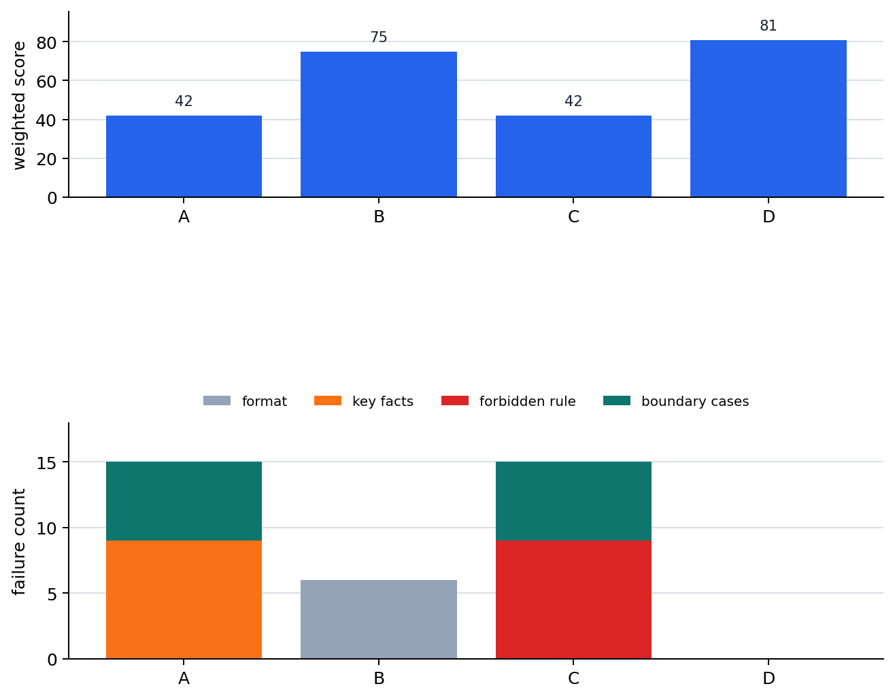

# P6-10.4 Supplement: Iterative Improvement of Prompt Candidates

> Section ID: `P6-10.4`
> Version: `v2026.07.24`

_Subtitle: How automatic prompt optimization evaluates prompt experiments and passes them to the next candidate_

In P6-10.3, we saw CoT and self-consistency as strategies for seeing or comparing response paths. Now the direction changes a little. Automatic prompt optimization is closer to asking how to evaluate and iteratively improve prompt candidates themselves, rather than the reasoning path of one answer.

Automatic prompt optimization is an approach that tries to make the work of manually revising prompts more systematic through evaluation standards and iterative loops. What matters is not the word automatic, but the structure of comparing prompt candidates across several inputs and choosing the next candidate from that result.

The question to close in this Section is the following.

`What does it mean to improve prompts well by repeatedly comparing them against a standard?`

## The Problem of Choosing Prompt Candidates

Writing a prompt once and stopping when it feels good is fast, but it easily drifts in repeated work. A prompt can work well on one input while omitting key items or breaking format on another input. So when there are several prompt candidates, we should not ask `which sentence looks more plausible?` We should ask `which candidate passes the standards more stably across several inputs?`

Automatic prompt optimization is a flow that tries to automate this repeated comparison. The basic structure can be read as follows.

| Step | What it does | Easy point to miss |
| --- | --- | --- |
| Create prompt candidates | Prepare several input designs | Having many candidates does not create good standards |
| Apply them to an evaluation set | Compare results on the same input bundle | A narrow evaluation set can fit only specific cases |
| Score results | Compare by standards such as format, omissions, and accuracy | Weak scoring standards make automation weak too |
| Choose the next candidate | Keep better-scoring candidates or create new ones | A high score does not guarantee real service quality |

This structure does not try to explain the whole evaluation system of P6-16 in advance. Here, we only hold that even choosing prompt candidates needs minimal evaluation standards. The design and operation of evaluation standards are handled again later.

Choosing a prompt candidate is not comparing sentence taste. It is making a small experiment table. For example, if we choose a customer-notice summary prompt, at minimum we keep input bundles and check standards together as follows.

| Evaluation input | Why it is needed | Item that must remain |
| --- | --- | --- |
| Short shipping-delay notice | Easy normal case | Delay reason, new expected arrival date |
| Notice with refund exception conditions | Boundary case that is easy to omit | Refund eligibility, exception conditions |
| Notice with action required from the customer | Check preservation of next action | Required documents, deadline |
| Notice where part of the policy document is ambiguous | Check suppression of guessing | Need-to-confirm marker, evidence sentence |

This table is what makes the `automatic` in automatic prompt optimization meaningful. Even if many candidates are created automatically, without these inputs and standards there is no way to judge what improved.

## Automation Does Not Replace Evaluation Standards

When hearing automatic prompt optimization, it is easy to feel that a machine will revise prompts well on its own. But what automation rapidly amplifies is the evaluation standard we put in. If the evaluation standard only checks fluency, it can select smoother sentences while missing important evidence sentences, prohibited expressions, or length limits.

Suppose we automatically improve a customer-notice summary prompt. If the only evaluation criterion is `is the sentence natural?`, automatic optimization can move toward friendlier and smoother sentences. But the real purpose may be not omitting `refund deadline`, `exception conditions`, and `the next action the customer should take`.

Therefore, the first question in automatic prompt optimization is not `which algorithm do we use?`, but `what do we regard as a good prompt?`

## Minimum Standards in Candidate Comparison

At the beginner stage, it is safer to first check the following four standards rather than complex optimization algorithms.

| Evaluation standard | Check question | Problem when weak |
| --- | --- | --- |
| Format stability | Does it keep the requested line count, table, or slots? | Output shape drifts across repetitions |
| Key item preservation | Does it keep facts that must remain? | Natural text omits important information |
| Prohibited condition compliance | Does it avoid expressions or guesses that should not be used? | Safety or policy-violation risk remains |
| Evaluation set diversity | Does it include both easy and boundary cases? | A prompt that only fits specific inputs is selected |

With this standard, automatic prompt optimization is not `a technology that automatically makes prompt sentences prettier`. It is an experiment loop that compares which candidate passes the standard more stably across several inputs.

If scores are collapsed into one number, misunderstanding follows. Which standard is strong or weak matters more than saying the overall score is 90.

| Candidate | Format stability | Key item preservation | Prohibited condition compliance | Boundary case handling | Interpretation |
| --- | ---: | ---: | ---: | ---: | --- |
| A | 5 | 2 | 4 | 2 | Stable shape, but often omits important items |
| B | 4 | 5 | 4 | 4 | A little long, but closer to the real purpose |
| C | 5 | 3 | 2 | 1 | Looks good, but has large guessing and boundary-case failures |

In this table, B may not be the prettiest prompt. But if the purpose of customer-notice summaries is key item preservation, B is the better candidate. The learning point of automatic prompt optimization is that `a good score table must be designed first`, more than chasing a high total score.

## Cases and Examples

### Case 1. If Fluency Is the Only Score, Important Information Disappears

Suppose there are customer-notice summary prompt candidates A and B. A is short and rough, but it keeps refund deadline, exception conditions, and next action. B is smooth and readable, but sometimes omits exception conditions.

If the only evaluation standard is `natural sentence`, B can receive a higher score. But in a real service, omitting exception conditions is the larger failure. At that point, automatic optimization accelerates in the wrong direction. It can choose prompts that fit the wrong standard faster than a human making manual mistakes.

The result to check here is not `did the score go up?`, but `does that score contain the real purpose?`

### Case 2. A Narrow Evaluation Set Fits the Prompt to Specific Cases

Suppose a summary prompt is compared only with three internal notices. All three documents are short and structurally similar. A prompt that scores highly there cannot automatically be said to work well on long policy documents or customer notices with many exceptions.

Automatic prompt optimization follows the signals present in the evaluation set. If the evaluation set is narrow, the candidate prompt can also fit that narrow input. So the validation set should include not only easy cases but also boundary cases, exception cases, and cases that are likely to fail.

The statement that the validation set should be broader is not helpful if it stays vague. Dividing input types as follows makes the empty parts visible.

| Input type | Why it should be included | Illusion when missing |
| --- | --- | --- |
| Normal case | Check whether the basic work is possible | Missing that the prompt may not even keep the basic format |
| Boundary case | Check priority when conditions conflict | Selecting a candidate that only works on easy cases |
| Expected failure case | Check points where the model tends to guess or omit | Dangerous failures are not caught in evaluation |
| Long input case | Check whether it holds when length and structure change | Generalizing a prompt only for short inputs |

The standard that should change in this case is not `the prompt with the highest score`, but `the prompt that maintains standards across diverse inputs`.

## Exercise and Example

The goal of the following example is to read automatic prompt optimization not as `choosing the most plausible sentence`, but as repeatedly aggregating prompt-candidate failure items across several evaluation inputs.

The CSV below is an observation log that applies four prompt candidates to nine evaluation inputs.

- Candidate evaluation log: [p6-10-4-prompt-candidate-eval-en.csv](../../../assets/part-06/chapter-10/p6-10-4-prompt-candidate-eval-en.csv){ .csv-preview }

One row is an observation value for `one evaluation input x one prompt candidate`. The core columns are `case_type`, `prompt_candidate`, `format_ok`, `key_fact_ok`, `forbidden_ok`, `boundary_ok`, and `response_too_long`. `normal` means an easy normal case, `boundary` means a boundary case where conditions conflict, and `failure_expected` means a case where guessing, prohibited expressions, or missing evidence are likely to appear.

Here, `format_ok` is 1 point, `key_fact_ok` and `forbidden_ok` are 3 points each, and `boundary_ok` is 2 points. This adds the operating assumption that in customer-notice summaries, key item preservation and prohibited-condition compliance matter more than shape. If these weights change, which candidate looks good can also change.

```python
# Read prompt-candidate evaluation logs and compare scores
# and failure items by candidate.
import csv
from pathlib import Path

eval_path = Path("docs/assets/part-06/chapter-10/p6-10-4-prompt-candidate-eval-en.csv")

weights = {
    "format_ok": 1,
    "key_fact_ok": 3,
    "forbidden_ok": 3,
    "boundary_ok": 2,
}


def to_bool(value):
    return value.lower() == "true"


def read_rows(path):
    with path.open(encoding="utf-8", newline="") as file:
        rows = list(csv.DictReader(file))
    for row in rows:
        for column in weights:
            row[column] = to_bool(row[column])
        row["response_too_long"] = to_bool(row["response_too_long"])
    return rows


def summarize_candidate(rows, candidate):
    group = [row for row in rows if row["prompt_candidate"] == candidate]
    score = sum(
        sum(weight for column, weight in weights.items() if row[column])
        for row in group
    )
    failures = {
        column.replace("_ok", "_fail"): sum(not row[column] for row in group)
        for column in weights
    }
    return {
        "score": score,
        **failures,
        "too_long": sum(row["response_too_long"] for row in group),
    }


rows = read_rows(eval_path)
candidates = sorted({row["prompt_candidate"] for row in rows})

print("[dataset]")
print("case_count =", len({row["case_id"] for row in rows}))
print("candidate_count =", len(candidates))
print("row_count =", len(rows))
print()

print("[candidate summary]")
summary = {}
for candidate in candidates:
    summary[candidate] = summarize_candidate(rows, candidate)
    print(candidate, summary[candidate])

best_candidate = max(candidates, key=lambda candidate: summary[candidate]["score"])
print()
print("[best by total score]")
print(best_candidate)
```

The example output can be read as follows.

```text
[dataset]
case_count = 9
candidate_count = 4
row_count = 36

[candidate summary]
A {'score': 42, 'format_fail': 0, 'key_fact_fail': 9, 'forbidden_fail': 0, 'boundary_fail': 6, 'too_long': 0}
B {'score': 75, 'format_fail': 6, 'key_fact_fail': 0, 'forbidden_fail': 0, 'boundary_fail': 0, 'too_long': 9}
C {'score': 42, 'format_fail': 0, 'key_fact_fail': 0, 'forbidden_fail': 9, 'boundary_fail': 6, 'too_long': 0}
D {'score': 81, 'format_fail': 0, 'key_fact_fail': 0, 'forbidden_fail': 0, 'boundary_fail': 0, 'too_long': 0}

[best by total score]
D
```

The point to read directly from this result is the difference between candidates B and D. B keeps key items, prohibited conditions, and boundary cases well, but still has 6 format failures and 9 length excesses. D passes every standard in the same evaluation set and therefore receives the highest total score. By contrast, A is short and stable in format, but missed key items 9 times, while C keeps key items but violates prohibited conditions 9 times.

The chart makes it clearer that score and failure type give different information.



The value readers can directly change in this example is `weights`. For example, if format stability is very important for a document, the weight of `format_ok` can be raised from 1 to 3. Conversely, if safety notices are more important, `forbidden_ok` can receive a higher weight. What matters here is that automatic optimization does not design the score for us. Which score should matter more must still be decided by the user according to the purpose of the problem.

The following is a simple judgment exercise comparing three prompt candidates. First mark which candidate is risky to adopt immediately.

| Candidate | Good-looking point | What can be missing | Risk of immediate adoption |
| --- | --- | --- | --- |
| A | Always short and easy to read | Often omits exception conditions |  |
| B | Preserves evidence sentences well | Sentences become a little longer |  |
| C | Highest score on five evaluation cases | Boundary cases have not been checked yet |  |

Explanation:

| Candidate | Judgment | Reason |
| --- | --- | --- |
| A | Risky | Fluency and brevity are good, but weak key-item preservation can cause large service failures |
| B | Promising depending on purpose | If evidence preservation matters, it can be a safer candidate even when longer |
| C | Hold | Even with a high score, the evaluation set is narrow, so overfitting is still unknown |

The point of this exercise is not to read automatic prompt optimization only as `choosing the prompt with the highest score`. We need to see what kind of score it is, which inputs produced it, and which failures it misses.

Let's go one step further. In the following score table, separate candidates that can be selected immediately from candidates that should be held. Scores run from 1 to 5, and for customer-notice summaries, assume that `key item preservation` and `prohibited condition compliance` are especially important.

| Candidate | Format stability | Key item preservation | Prohibited condition compliance | Evaluation set diversity | Judgment |
| --- | ---: | ---: | ---: | ---: | --- |
| A | 5 | 2 | 5 | 4 |  |
| B | 4 | 5 | 4 | 4 |  |
| C | 5 | 5 | 2 | 2 |  |

Explanation:

| Candidate | Judgment | Reason |
| --- | --- | --- |
| A | Hold | The format is stable, but key item preservation is low, so it may miss the real purpose |
| B | Promising | Key item preservation and prohibited condition compliance are both high, and the evaluation set is not narrow |
| C | Risky | Key items remain, but prohibited condition compliance is low and the evaluation set is narrow, making service application risky |

This judgment can be made without knowing complex algorithms. The first intuition needed when reading automatic prompt optimization is `by what standard should we read the automatically selected candidate again?`

## Boundary with P6-16

This Section does not explain evaluation as a whole. What is needed here is the intuition that repeated improvement of prompt candidates requires at least minimal evaluation standards and validation inputs. Automatic and human evaluation, evaluation-set design, and regression detection in operation are handled more fully in P6-16.

So the conclusion of this Section can be held as follows.

- Automatic prompt optimization can make prompt experiment loops faster.
- But if the evaluation standard is weak, it only repeats that weak standard faster.
- Even when choosing prompt candidates, format, key items, prohibited conditions, and validation-set diversity should be checked together.

## Checklist

- Can you explain automatic prompt optimization as an approach that repeatedly improves prompt candidates through an evaluation loop?
- Can you explain why automation does not replace the evaluation standard itself?
- Can you distinguish a high score, a narrow evaluation set, and real service quality?
- Can you separate the main evaluation system in P6-16 from the minimal evaluation standard in this Section?

## Sources and References

- Pranab Sahoo et al., [A Systematic Survey of Prompt Engineering in Large Language Models: Techniques and Applications](https://arxiv.org/abs/2402.07927){: target="_blank" rel="noopener noreferrer" }, arXiv, 2024, accessed 2026-07-19.
