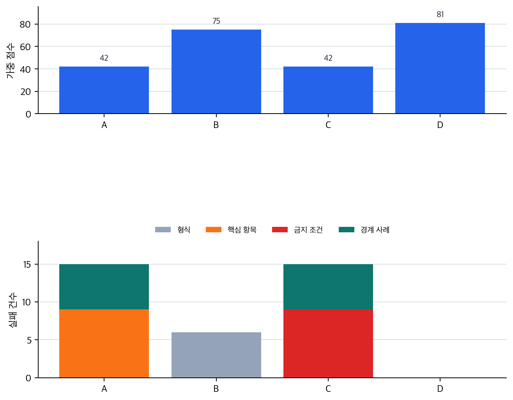

# P6-10.4 보충학습: 프롬프트 후보 반복 개선

> Section ID: `P6-10.4`
> Version: `v2026.07.31`

_보조제목: automatic prompt optimization은 프롬프트 실험을 어떻게 평가하고 다음 후보로 넘기는가_

P6-10.3에서는 CoT와 self-consistency를 답변 경로를 더 보거나 비교하는 전략으로 봤습니다. 이제는 방향이 조금 달라집니다. automatic prompt optimization은 한 답변의 reasoning 경로보다, 프롬프트 후보 자체를 어떻게 평가하고 반복 개선할 것인가에 더 가깝습니다.

automatic prompt optimization은 사람이 프롬프트를 손으로 조금씩 고치던 일을 평가 기준과 반복 루프로 더 체계화하려는 접근입니다. 중요한 것은 자동이라는 말이 아니라, 프롬프트 후보를 여러 입력에서 비교하고 그 결과로 다음 후보를 고르는 구조입니다.

이 절에서 닫을 질문은 다음입니다.

`프롬프트를 잘 고친다는 말은 무엇을 기준으로 반복 비교한다는 뜻인가?`

## 프롬프트 후보를 고르는 문제

프롬프트를 한 번 써 보고 마음에 들면 끝내는 방식은 빠르지만, 반복 업무에서는 쉽게 흔들립니다. 어떤 입력에서는 잘 맞고, 다른 입력에서는 핵심 항목을 빼거나 형식을 깨뜨릴 수 있기 때문입니다. 그래서 프롬프트 후보가 여러 개 있을 때는 `어느 문장이 더 그럴듯한가`가 아니라 `여러 입력에서 어떤 기준을 더 안정적으로 통과하는가`를 봐야 합니다.

automatic prompt optimization은 이 반복 비교를 더 자동화하려는 흐름입니다. 기본 구조는 다음처럼 볼 수 있습니다.

| 단계 | 하는 일 | 놓치기 쉬운 점 |
| --- | --- | --- |
| 프롬프트 후보 만들기 | 여러 입력 설계안을 준비함 | 후보가 많다고 좋은 기준이 생기는 것은 아님 |
| 평가 세트에 적용하기 | 같은 입력 묶음에서 결과를 비교함 | 평가 세트가 좁으면 특정 사례에만 맞을 수 있음 |
| 점수 매기기 | 형식, 누락, 정확성 같은 기준으로 비교함 | 점수 기준이 약하면 자동화도 약해짐 |
| 다음 후보 고르기 | 점수가 나은 후보를 남기거나 새 후보를 만듦 | 높은 점수가 실제 서비스 품질을 보장하지는 않음 |

이 구조는 P6-16의 평가 체계 전체를 앞당겨 설명하려는 것이 아닙니다. 여기서는 프롬프트 후보를 고르는 데도 최소한의 평가 기준이 필요하다는 점만 잡습니다. 평가 기준 자체의 설계와 운영은 뒤에서 다시 다룹니다.

프롬프트 후보를 고르는 일은 문장 취향 비교가 아니라 작은 실험표를 만드는 일입니다. 예를 들어 고객 안내 요약 프롬프트를 고른다면, 최소한 다음처럼 입력 묶음과 확인 기준을 함께 둡니다.

| 평가 입력 | 왜 필요한가 | 반드시 남겨야 할 항목 |
| --- | --- | --- |
| 짧은 배송 지연 안내 | 쉬운 정상 사례 | 지연 사유, 새 도착 예정일 |
| 환불 예외 조건이 있는 안내 | 누락되기 쉬운 경계 사례 | 환불 가능 조건, 예외 조건 |
| 고객이 해야 할 행동이 있는 안내 | 다음 행동 보존 확인 | 제출 서류, 마감일 |
| 정책 문서 일부가 애매한 안내 | 추측 억제 확인 | 확인 필요 표시, 근거 문장 |

이 표가 있어야 automatic prompt optimization의 `automatic`이 의미를 갖습니다. 자동으로 후보를 많이 만들어도, 이런 입력과 기준이 없으면 무엇이 좋아졌는지 판단할 수 없습니다.

## 자동화가 평가 기준을 대신하지는 않는다

automatic prompt optimization을 들으면 프롬프트를 기계가 알아서 잘 고쳐 줄 것처럼 느끼기 쉽습니다. 하지만 자동화가 빠르게 증폭하는 것은 우리가 넣은 평가 기준입니다. 평가 기준이 유창성만 보면 더 매끄러운 문장을 고를 수는 있지만, 중요한 근거 문장이나 금지 표현, 길이 제한을 놓칠 수 있습니다.

예를 들어 고객 안내 요약 프롬프트를 자동으로 개선한다고 해 봅시다. 평가 기준이 `문장이 자연스러운가` 하나뿐이면, 자동 최적화는 더 친절하고 매끄러운 문장을 만드는 쪽으로 갈 수 있습니다. 하지만 실제 목적은 `환불 기한`, `예외 조건`, `고객이 해야 할 다음 행동`을 빠뜨리지 않는 것일 수 있습니다.

따라서 automatic prompt optimization에서 먼저 물어야 할 질문은 `어떤 알고리즘을 쓰는가`가 아니라 `무엇을 좋은 프롬프트로 볼 것인가`입니다.

## 후보 비교에서 보는 최소 기준

초심자 단계에서는 복잡한 최적화 알고리즘보다 다음 네 기준을 먼저 보는 편이 안전합니다.

| 평가 기준 | 확인 질문 | 약하면 생기는 문제 |
| --- | --- | --- |
| 형식 안정성 | 요구한 줄 수, 표, 슬롯을 지키는가 | 출력 모양이 반복마다 흔들림 |
| 핵심 항목 보존 | 반드시 남길 사실을 빼지 않는가 | 자연스럽지만 중요한 정보가 빠짐 |
| 금지 조건 준수 | 쓰면 안 되는 표현이나 추측을 피하는가 | 안전·정책 위반 가능성이 남음 |
| 검증 세트 다양성 | 쉬운 사례와 경계 사례가 함께 있는가 | 특정 입력에만 잘 맞는 프롬프트가 선택됨 |

이 기준을 보면 automatic prompt optimization은 `프롬프트 문장을 자동으로 예쁘게 고치는 기술`이 아닙니다. 여러 입력에서 어떤 후보가 더 안정적으로 기준을 통과하는지 비교하는 실험 루프입니다.

점수도 하나로 뭉치면 오해가 생깁니다. 전체 점수 90점이라는 말보다 어떤 기준에서 강하고 약한지가 더 중요합니다.

| 후보 | 형식 안정성 | 핵심 항목 보존 | 금지 조건 준수 | 경계 사례 대응 | 해석 |
| --- | ---: | ---: | ---: | ---: | --- |
| A | 5 | 2 | 4 | 2 | 모양은 안정적이지만 중요한 항목을 자주 뺌 |
| B | 4 | 5 | 4 | 4 | 조금 길어도 실제 목적에 가까움 |
| C | 5 | 3 | 2 | 1 | 보기 좋지만 추측과 경계 사례 실패가 큼 |

이런 표에서는 B가 가장 `예쁜` 프롬프트가 아닐 수 있습니다. 하지만 고객 안내 요약의 목적이 핵심 항목 보존이라면 B가 더 나은 후보입니다. automatic prompt optimization의 학습 포인트는 높은 총점보다 `좋은 점수표를 먼저 설계해야 한다`는 데 있습니다.

## 보충학습: 프롬프트 후보 반복 개선: 확인할 판단 기준

이 사례 절은 다음 질문으로 중심축을 확인한다.

- 오픈체크리스트의 중심축 문장인 "automatic prompt optimization을 자동화 마법이 아니라 후보 프롬프트, 평가 기준, 검증 세트, 실패 누락 위험의 반복 루프로 보충해야 합니다."를 본문 사례에서 어느 대목으로 확인할 수 있는가?
- 표, 코드, 도식, 체크리스트 중 어떤 장치가 이 판단을 다시 검토하게 만드는가?

### 사례 1. 유창성만 점수로 보면 중요한 정보가 빠진다

고객 공지 요약 프롬프트 후보 A와 B가 있다고 해 봅시다. A는 문장이 짧고 투박하지만 환불 기한, 예외 조건, 다음 행동을 모두 남깁니다. B는 문장이 부드럽고 읽기 좋지만 예외 조건을 가끔 빼먹습니다.

평가 기준이 `자연스러운 문장` 하나라면 B가 더 높은 점수를 받을 수 있습니다. 하지만 실제 서비스에서는 예외 조건 누락이 더 큰 실패입니다. 이때 자동 최적화는 잘못된 방향으로 빨라집니다. 사람이 손으로 실수하는 속도보다 더 빠르게, 잘못된 기준에 맞는 프롬프트를 고를 수 있습니다.

여기서 확인해야 할 결과는 `점수가 올랐는가`가 아니라 `그 점수가 실제 목적을 담고 있는가`입니다.

### 사례 2. 평가 세트가 좁으면 프롬프트가 특정 사례에 맞춰진다

요약 프롬프트를 내부 공지 세 개로만 비교한다고 해 봅시다. 이 세 문서는 모두 짧고 구조가 비슷합니다. 이때 높은 점수를 받은 프롬프트가 긴 정책 문서나 예외가 많은 고객 안내문에서도 잘 작동한다고 말하기는 어렵습니다.

automatic prompt optimization은 평가 세트에 있는 신호를 따라갑니다. 평가 세트가 좁으면 후보 프롬프트도 그 좁은 입력에 맞춰질 수 있습니다. 그래서 검증 세트에는 쉬운 사례뿐 아니라 경계 사례, 예외가 있는 사례, 실패하기 쉬운 사례가 함께 들어가야 합니다.

검증 세트를 넓힌다는 말도 막연하면 도움이 되지 않습니다. 입력의 종류를 다음처럼 나누면 어느 부분이 비어 있는지 보입니다.

| 입력 종류 | 포함해야 하는 이유 | 없을 때 생기는 착시 |
| --- | --- | --- |
| 정상 사례 | 기본 업무가 되는지 확인 | 프롬프트가 기본 형식도 못 지키는지 놓침 |
| 경계 사례 | 조건이 충돌할 때 우선순위를 확인 | 쉬운 사례에서만 잘 맞는 후보를 고름 |
| 실패 예상 사례 | 모델이 추측하거나 생략하기 쉬운 지점을 확인 | 위험한 실패가 평가에 잡히지 않음 |
| 긴 입력 사례 | 길이와 구조가 바뀌어도 버티는지 확인 | 짧은 입력 전용 프롬프트를 일반화함 |

이 사례에서 바뀌어야 할 기준은 `점수가 가장 높은 프롬프트`가 아니라 `다양한 입력에서도 기준을 유지하는 프롬프트`입니다.

## 연습 및 예제

다음 예제의 목표는 automatic prompt optimization을 `가장 그럴듯한 문장을 고르는 일`이 아니라, 여러 평가 입력에서 후보 프롬프트의 실패 항목을 반복해서 집계하는 일로 읽는 것입니다.

아래 CSV는 후보 프롬프트 4개를 평가 입력 9개에 적용한 관찰 로그입니다.

- 후보 평가 로그: [p6-10-4-prompt-candidate-eval.csv](../../../assets/part-06/chapter-10/p6-10-4-prompt-candidate-eval.csv){ .csv-preview }

한 행은 `평가 입력 하나 × 프롬프트 후보 하나`의 관찰값입니다. 핵심 열은 `case_type`, `prompt_candidate`, `format_ok`, `key_fact_ok`, `forbidden_ok`, `boundary_ok`, `response_too_long`입니다. `normal`은 쉬운 정상 사례, `boundary`는 조건이 충돌하는 경계 사례, `failure_expected`는 추측·금지 표현·근거 부족이 드러나기 쉬운 사례입니다.

여기서는 `format_ok`는 1점, `key_fact_ok`와 `forbidden_ok`는 각각 3점, `boundary_ok`는 2점으로 둡니다. 고객 안내 요약에서는 모양보다 핵심 항목 보존과 금지 조건 준수가 더 중요하다는 운영 가정을 넣은 것입니다. 이 가중치를 바꾸면 어떤 후보가 좋아 보이는지도 달라질 수 있습니다.

```python
# 프롬프트 후보 평가 로그를 읽어 후보별 점수와 실패 항목을 비교하는 예제입니다.
import csv
from pathlib import Path

eval_path = Path("docs/assets/part-06/chapter-10/p6-10-4-prompt-candidate-eval.csv")

weights = {
    "format_ok": 1,
    "key_fact_ok": 3,
    "forbidden_ok": 3,
    "boundary_ok": 2,
}


def to_bool(value):
    return value.lower() == "true"


def read_rows(path):
    with path.open(encoding="utf-8", newline="") as file:
        rows = list(csv.DictReader(file))
    for row in rows:
        for column in weights:
            row[column] = to_bool(row[column])
        row["response_too_long"] = to_bool(row["response_too_long"])
    return rows


def summarize_candidate(rows, candidate):
    group = [row for row in rows if row["prompt_candidate"] == candidate]
    score = sum(
        sum(weight for column, weight in weights.items() if row[column])
        for row in group
    )
    failures = {
        column.replace("_ok", "_fail"): sum(not row[column] for row in group)
        for column in weights
    }
    return {
        "score": score,
        **failures,
        "too_long": sum(row["response_too_long"] for row in group),
    }


rows = read_rows(eval_path)
candidates = sorted({row["prompt_candidate"] for row in rows})

print("[dataset]")
print("case_count =", len({row["case_id"] for row in rows}))
print("candidate_count =", len(candidates))
print("row_count =", len(rows))
print()

print("[candidate summary]")
summary = {}
for candidate in candidates:
    summary[candidate] = summarize_candidate(rows, candidate)
    print(candidate, summary[candidate])

best_candidate = max(candidates, key=lambda candidate: summary[candidate]["score"])
print()
print("[best by total score]")
print(best_candidate)
```

실행 결과 예시는 다음처럼 읽을 수 있습니다.

```text
[dataset]
case_count = 9
candidate_count = 4
row_count = 36

[candidate summary]
A {'score': 42, 'format_fail': 0, 'key_fact_fail': 9, 'forbidden_fail': 0, 'boundary_fail': 6, 'too_long': 0}
B {'score': 75, 'format_fail': 6, 'key_fact_fail': 0, 'forbidden_fail': 0, 'boundary_fail': 0, 'too_long': 9}
C {'score': 42, 'format_fail': 0, 'key_fact_fail': 0, 'forbidden_fail': 9, 'boundary_fail': 6, 'too_long': 0}
D {'score': 81, 'format_fail': 0, 'key_fact_fail': 0, 'forbidden_fail': 0, 'boundary_fail': 0, 'too_long': 0}

[best by total score]
D
```

이 결과에서 바로 읽어야 할 점은 후보 B와 D의 차이입니다. B는 핵심 항목, 금지 조건, 경계 사례를 모두 잘 지키지만 형식 실패 6건과 길이 초과 9건이 남습니다. D는 같은 평가 세트에서 모든 기준을 통과해 총점이 가장 높습니다. 반대로 A는 짧고 형식은 안정적이지만 핵심 항목을 9번 놓쳤고, C는 핵심 항목은 남기지만 금지 조건을 9번 어겼습니다.

차트로 보면 점수와 실패 유형이 서로 다른 정보를 준다는 점이 더 분명합니다.



이 예제에서 독자가 직접 바꿔 볼 값은 `weights`입니다. 예를 들어 형식 안정성이 매우 중요한 문서라면 `format_ok` 가중치를 1에서 3으로 올릴 수 있습니다. 반대로 안전 고지가 더 중요한 업무라면 `forbidden_ok` 가중치를 더 높일 수 있습니다. 이때 중요한 것은 자동 최적화가 점수를 대신 설계해 주지 않는다는 점입니다. 어떤 점수를 크게 볼지는 여전히 사용자가 문제 목적에 맞게 정해야 합니다.

다음은 세 프롬프트 후보를 비교하는 간단한 판단 연습입니다. 먼저 어떤 후보를 바로 채택하면 위험한지 표시해 보겠습니다.

| 후보 | 좋아 보이는 점 | 빠질 수 있는 것 | 바로 채택 위험 |
| --- | --- | --- | --- |
| A | 항상 짧고 읽기 쉬움 | 예외 조건을 자주 생략 |  |
| B | 근거 문장을 잘 남김 | 문장이 조금 길어짐 |  |
| C | 평가 세트 5개에서 최고점 | 경계 사례를 아직 안 봄 |  |

해설:

| 후보 | 판단 | 이유 |
| --- | --- | --- |
| A | 위험함 | 유창성과 짧음은 좋지만 핵심 항목 보존이 약하면 서비스 실패가 커질 수 있음 |
| B | 목적에 따라 유력함 | 길이가 늘어도 근거 보존이 중요한 작업이면 더 안전한 후보일 수 있음 |
| C | 보류 | 점수가 높아도 검증 세트가 좁으면 과적합 여부를 아직 모름 |

이 연습의 핵심은 automatic prompt optimization을 `가장 높은 점수의 프롬프트를 고르는 일`로만 보지 않는 것입니다. 어떤 점수인지, 어떤 입력에서 나온 점수인지, 어떤 실패를 놓치는지까지 함께 봐야 합니다.

한 단계 더 들어가 보겠습니다. 다음 점수표에서 바로 선택해도 되는 후보와 보류해야 하는 후보를 나누어 봅니다. 점수는 1점에서 5점까지이고, 고객 안내 요약에서는 `핵심 항목 보존`과 `금지 조건 준수`가 특히 중요하다고 가정합니다.

| 후보 | 형식 안정성 | 핵심 항목 보존 | 금지 조건 준수 | 검증 세트 다양성 | 판단 |
| --- | ---: | ---: | ---: | ---: | --- |
| A | 5 | 2 | 5 | 4 |  |
| B | 4 | 5 | 4 | 4 |  |
| C | 5 | 5 | 2 | 2 |  |

해설:

| 후보 | 판단 | 이유 |
| --- | --- | --- |
| A | 보류 | 형식은 안정적이지만 핵심 항목 보존이 낮아 실제 목적을 놓칠 수 있음 |
| B | 유력 | 중요한 기준인 핵심 항목 보존과 금지 조건 준수가 모두 높고, 검증 세트도 좁지 않음 |
| C | 위험함 | 핵심 항목은 남기지만 금지 조건 준수가 낮고 검증 세트가 좁아 서비스 적용 위험이 큼 |

이 판단은 복잡한 알고리즘을 몰라도 할 수 있습니다. automatic prompt optimization을 읽을 때 먼저 필요한 감각은 `자동으로 고른 후보를 다시 어떤 기준으로 읽을 것인가`입니다.

## P6-16과의 경계

이 절은 평가 전체를 설명하는 곳이 아닙니다. 여기서 필요한 것은 프롬프트 후보를 반복 개선하려면 최소한의 평가 기준과 검증 입력이 필요하다는 감각입니다. 자동 평가와 사람 평가, 평가 세트 설계, 운영 중 회귀 감지는 P6-16에서 더 본격적으로 다룹니다.

따라서 이 절의 결론은 다음처럼 잡으면 됩니다.

- automatic prompt optimization은 프롬프트 실험 루프를 빠르게 만들 수 있습니다.
- 하지만 평가 기준이 약하면 약한 기준을 더 빠르게 반복할 뿐입니다.
- 프롬프트 후보를 고를 때도 형식, 핵심 항목, 금지 조건, 검증 세트 다양성을 함께 봐야 합니다.

## 체크리스트

- automatic prompt optimization을 프롬프트 후보를 평가 루프로 반복 개선하는 접근으로 설명할 수 있는가?
- 자동화가 평가 기준 자체를 대신하지 않는다는 점을 설명할 수 있는가?
- 높은 점수, 좁은 평가 세트, 실제 서비스 품질을 구분할 수 있는가?
- P6-16의 평가 체계 본편과 이 절의 최소 평가 기준을 구분할 수 있는가?

## 출처와 참고 자료

- Pranab Sahoo et al., [A Systematic Survey of Prompt Engineering in Large Language Models: Techniques and Applications](https://arxiv.org/abs/2402.07927){: target="_blank" rel="noopener noreferrer" }, arXiv, 2024, 확인 날짜: 2026-07-19.
- Tom B. Brown et al., [Language Models are Few-Shot Learners](https://arxiv.org/abs/2005.14165){: target="_blank" rel="noopener noreferrer" }, arXiv, 2020, 확인 날짜: 2026-07-19.
