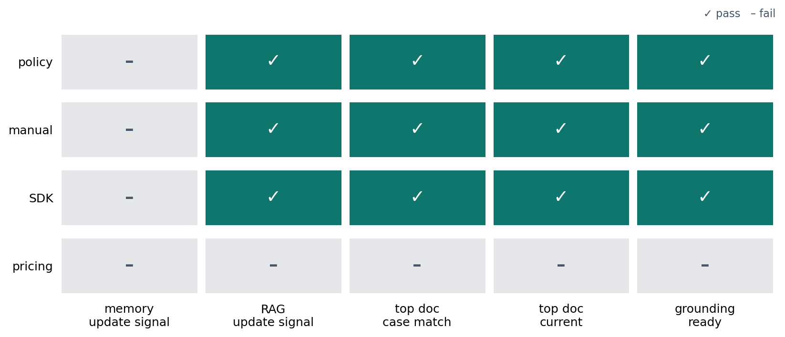

# P6-11.1 RAG That Attaches External Evidence Instead of Model Memory

> Section ID: `P6-11.1`
> Version: `v2026.07.24`

In P6-10.2, we saw that prompts alone have difficulty solving problems such as freshness, evidence guarantees, and executability. Then what matters is not only the answer sentence itself, but how to first change the materials that enter the answer.

How can we use external evidence together instead of relying only on model memory?

RAG (retrieval-augmented generation) is a structure where the model first retrieves related documents before making an answer, then generates based on those documents.

## Standards for Attaching External Evidence Before Answering

RAG is `a structure that changes the starting point of the answer from model memory to external document evidence`. If prompt and instruction adjustment asked `how should the model answer?`, RAG changes the question to `what should the model answer from?` The actual combination flow is a problem where search results are attached to the input context and the answer is generated on top of them. The search storage structure and index prepare documents so they can be found again when needed.

Therefore, the core change here is not `how well we refine the question sentence`, but `which document should be attached first before answering`. Once this standard is in place, RAG can be read as a separate evidence-connection structure rather than an extension of prompting.

At first, it is enough to separate only two questions. Summarizing a meeting memo that is already available in three lines, or rewriting a classification result in table format, is usually `a problem of adjusting how to answer with the same material`. By contrast, asking about an internal policy changed today or usage for the current SDK version is `a problem of choosing the answer material again from current documents`. RAG becomes necessary in this second scene.

The impression `a technique for attaching long documents to prompts` should be replaced with `a structure that changes the answer's starting point to external evidence documents`. What should remain first here is a retrieval memo and evidence check record showing which documents were found as evidence candidates, why each document was judged relevant, and whether the final answer actually stood on document evidence.

Documents do not automatically attach themselves before an answer. Usually, document chunks are stored in a searchable form, and when a question arrives, related chunks are retrieved first. This storage structure can mix keyword search, ordinary databases, and vector databases, but LLM services often use vector databases to find semantically close documents. This Section first holds the RAG structure of `retrieve evidence before answering`, and P6-12.1 looks at how that evidence is stored and retrieved with embeddings, original text, and metadata.

| Scene to distinguish first | Judgment to hold first | Why it must be separated first |
| --- | --- | --- |
| Only the answer tone, table format, or summary style is unsatisfactory | It is likely a prompt-adjustment problem | The material is often already there and only the expression is drifting. |
| A policy changed today, the current SDK version, or an internal manual is needed | RAG is likely needed first | Without attaching latest and internal documents before answering, memory-dependent wrong answers are likely. |
| The document was seen, but calculation, lookup, or real execution matters more | RAG alone may not close it | Reading a document and calculating a value or calling a system are different problems. |
| There are too many candidate documents, making the evidence unclear | Search quality and evidence records must be checked together | Even with RAG, trust is hard to verify if why a document was selected is not recorded. |

## Why Model Memory Alone Is Not Enough

LLMs learn many patterns through pretraining and adjustment. But in real services, latest information and internal documents often do not update automatically. What RAG adds is a step that finds evidence documents before answering, so the answer's starting point moves from model memory to document evidence.

- A policy changed today must be reflected.
- The answer must be based on internal company documents.
- The explanation must use the latest product specifications.
- The answer must include actual sources.

These requirements are hard to satisfy reliably with only the memory already inside the model.

The reason is simple.

- Information after the training point is not automatically updated.
- Internal documents may not have been included in training at all.
- Even plausible-looking answers may not be connected to real evidence.

## What Does RAG Try to Change?

The basic idea of RAG is very practical.

`First find related documents, put those documents together, and generate an answer within that scope.`

In other words, the structure changes from one where the model draws only on memory to one where:

- retrieval happens first
- the result is attached as context
- generation proceeds on top of it

For this reason, RAG is better understood not as `a technology that makes the model smarter`, but as `a service structure that connects answer evidence to external materials`.

From a service-structure perspective, if prompts handled `how should we ask the model?`, RAG handles `what should the model answer from?`

The difference becomes clearer when rewritten as operating questions.

| What to check first now | Prompt-stage question | RAG-stage question |
| --- | --- | --- |
| Why the answer drifts | Is the requested format ambiguous? | Is the evidence document missing or outdated? |
| First focus to change | Should instructions, context, and examples be rewritten? | Should the document scope and latest documents to retrieve be attached first? |
| Result to check | Did format, length, and tone stabilize? | Were actual document conditions and numbers reflected in the answer? |

## What Problems Does RAG Try to Reduce?

RAG is usually used to reduce the following problems.

- Missing latest information
- Missing internal documents
- Groundless general answers
- Difficulty tracing sources

`RAG does not only trust model memory. It first brings in needed documents and narrows the evidence scope of the answer.`

## How Is It Different from Fine-Tuning?

This difference is very important.

| Method | Problem it mainly tries to solve |
| --- | --- |
| Fine-tuning | Adjusting specific formats, response tendencies, and domain fit |
| RAG | Connecting latest information, external evidence, and document-based responses |

For example:

- Matching answer format to company style may be more related to fine-tuning.
- Reflecting a refund policy that changed today is more directly related to RAG.

Without this distinction, users can easily misunderstand every problem as solvable with one fine-tuning run or one prompt.

The same request flow can be summarized again as follows.

- Prompt: Refines the way the question is asked.
- Fine-tuning: Better matches response tendencies and formats.
- RAG: Attaches external evidence before answering.

Separating one more point makes the flow into P6-11.2 and P6-12 more natural. External curricula often handle `pretraining data preparation` and `retrieval document preparation` together, but they are not the same task.

| Type of data preparation | What it first aligns | Where it connects here |
| --- | --- | --- |
| Pretraining data preparation | Makes the model learn broad language patterns | P6-7.1, P6-7.2 |
| Retrieval document preparation | Makes documents retrievable again for the current question | P6-11, P6-12 |

So attaching RAG is closer to `prepare documents so they can be searched, then attach those documents before answering` than to `train the model broadly again`.

When external RAG summaries and practice reports are read together, there is one more axis to separate. RAG is not a technique that starts only after a question arrives. It must be read together with the earlier `content preparation` stage.

| Before the question arrives | After the question arrives |
| --- | --- |
| Keep latest-version documents and separate old documents | Search for documents matching the current question |
| Split paragraphs neither too long nor too short | Attach retrieved paragraphs to the input context |
| Clean duplicate documents and attach metadata | Generate the answer within that paragraph scope |

In short, the first success condition for RAG is not only `is the retrieval model smart?`, but also `are the documents already prepared in a searchable form?`

## Why It Is Often Used in Practice

In practice, `answers whose evidence can be checked` often matter more than `answers that sound correct`.

For example:

- Answers based on an internal wiki
- Customer support based on product manuals
- Search responses based on legal or policy documents
- Developer assistance based on technical documents

In these cases, RAG is practical because it changes the `path to evidence` rather than the model itself.

The important line here is this.

`In practice, an answer with traceable evidence often matters more than a polished answer.`

## RAG Is Not Universal Either

But RAG should not be exaggerated either.

Having RAG does not automatically guarantee that:

- the most relevant document is always found
- the found document is always read correctly
- citations are always correct
- search results are sufficient

In other words, RAG makes the system handle both a `retrieval problem` and a `generation problem`, but it does not automatically solve both.

A safer explanation is the following.

`RAG is a strong structure that connects answer evidence to external materials, but retrieval quality and generation quality must be checked separately.`

## Drawn Very Simply

```mermaid
--8<-- "assets/part-06/chapter-11/p6-c11-s01-rag-need-flow-en.mmd"
```

The key of this diagram is that retrieval comes first, and generation follows.

## Cases and Examples

### Case 1. Internal Policy Question Answering

If the question is `How did the travel-expense reimbursement standard change?`, it is easy to answer from a remembered notice or previous standard. Internal policies are still documents read by people, so it is easy to expect that the model knows them like general knowledge. But internal policies are revised often, and old standards can differ from today's standards, so memory-dependent answers easily become wrong guidance. For example, if there was no transportation-cost cap last year but a cap exists this year, the answer is wrong even if the tone is natural. The more dangerous point is that this kind of answer can be copied inside the organization as a `sentence that looks official`.

RAG first searches the latest internal policy document, finds currently effective clauses, attaches that paragraph as context, and then makes the answer. The structural change here is that the starting point moves from `bring out the remembered answer` to `check the currently valid document first`. The misunderstanding to correct is the expectation that `if the explanation is natural, it is enough for now`. The result to check in this case is whether the actual latest policy paragraph is attached as answer evidence before the natural explanation, and whether that paragraph alone lets us recheck the currently effective standard.

### Case 2. Product Manual-Based Support

Consider a customer-support chatbot that answers product usage questions. It is easy to feel that basic questions are handled sufficiently if a few FAQs and common answer templates are organized well. Customer questions tend to repeat, so reusing an answer once made can look safe. But menu names and setting locations can change by version, so a template may be natural while its content quickly becomes old. For example, if the old `Advanced Settings` menu has moved to `Preferences` in the current version, a memory-based answer sends the customer to the wrong screen. The user then experiences the failure, `The answer was kind, but why is it different from the actual screen?`

RAG first finds related documents from the latest manual and FAQ, attaches the current-version explanation, and then composes the answer. As a result, answer quality can be managed first by `consistency with the current document`, before tone. The misunderstanding to correct here is the feeling that `for frequently asked questions, memory-based templates are enough`. The result to check in this case is not whether the template is natural, but whether the current version's menu and procedure match actual documents, and whether each step of the answer also corresponds to the real screen path.

### Case 3. Developer Documentation Search

Imagine a developer asking, `Where do I put the authentication header in the current SDK version?` It is easy to think the model can answer immediately because it knows a lot of general API knowledge. For syntax questions, remembered examples can look faster than search. But if the model remembers old-version syntax, an answer that looks plausible can immediately fail in real code. For example, if it repeats an old `Authorization` example while the current version now takes a separate `auth` object, the copied code fails immediately. This failure is not just a wrong answer. It leads to debugging time, lower trust, and spread of incorrect sample code.

What should be checked first is not the model's general knowledge, but `the version document being used now`. RAG reduces this version-mismatch risk by first retrieving current API documentation and example pages, attaching them as context, and then making the answer. The key is not fluency of the generated sentence, but whether the retrieval stage accurately picks the current document. The misunderstanding to correct here is the attitude that `if the code looks plausible, we can copy and try it first`. The result to check in this case is not whether the answer looks plausible, but whether the current SDK document and code example are attached together as evidence, and whether the same code can be reproduced by following only that evidence.

The three cases can be grouped again as operating check standards.

| Situation | Evidence that must be attached first | Wrong answer when evidence is missing |
| --- | --- | --- |
| Internal policy | Latest policy notice, currently effective clause | Naturally repeats an old rule |
| Product support | Current-version manual path, latest FAQ | Guides with outdated menu names and procedures |
| Developer documentation | Current SDK/API version document, official example | Mixes old option names or code patterns into the answer |

The same content can be read again through an evidence-first structure as follows.

```mermaid
--8<-- "assets/part-06/chapter-11/p6-c11-s01-rag-grounding-cases-en.mmd"
```

The key is not `generate immediately after the question`, but `retrieve evidence first after the question`.

## Scenes Where Evidence Connection Is Needed

The most common confusion when first reading RAG is to see only that `the answer is wrong` and immediately make the prompt longer. But in the three cases in this Section, what should be checked before sentence expression is `was the current document actually attached before answering?`

| If this scene appears | What to check first | Why this order matters |
| --- | --- | --- |
| The answer tone or table format is unsatisfactory, but the facts themselves are already correct | Is this a problem of adding latest documents, or format adjustment? | If the evidence is already correct, it is better to first separate prompting or adjustment-layer problems rather than add more RAG. |
| The answer is natural, but different from the policy changed today | Was the latest policy document retrieved first? | Without latest documents, careful wording can still repeat old answers. |
| The menu explanation is kind, but different from the actual screen path | Was the current-version manual attached as evidence? | Current-version document consistency must be correct before templates. |
| The code example looks plausible, but fails in the current SDK | Were the current-version official document and example attached? | Current-version evidence must be correct before general knowledge for copyable answers. |

The same standard can be read as shorter work questions.

| If this suspicion appears | First question to ask |
| --- | --- |
| `The answer format is lacking, but the facts look right` | Do we need new document evidence, or tone and format adjustment? |
| `The answer is smooth, but somehow looks old` | Which latest document is the answer based on? |
| `The explanation is kind, but not aligned with the actual screen` | Was the current manual path actually attached? |
| `The code looks plausible, but does not run` | Were the official example and current API document retrieved together? |

The first standard to learn is simple. RAG is not `a trick for writing questions better`, but a structure that fixes `what evidence to attach before answering` at the system stage.

## Exercise and Example

The goal of the example is not to implement a real vector database or LLM service. It is to check the minimal RAG behavior of `question -> choose related documents with a retrieval model -> answer based on those documents`. Refund policy, product manual, and SDK documentation questions are run together, and we compare what changes between answering without retrieval and answering after attaching documents selected by a retrieval model.

Users can ask about latest policies, current-version product screens, and current SDK usage. Old standards or general knowledge can remain in model memory, and without finding related documents first, natural wrong answers can appear. So this example uses scikit-learn's `TfidfVectorizer` like a very small retrieval model. It is not a real embedding model, but the flow of converting questions and documents into vectors and choosing close documents can be checked by direct execution. In Korean, short sentences are more stable with character n-grams than whitespace words. In English too, this example keeps the same character n-gram setting so that the experiment structure stays aligned with the source.

The example below uses two CSV files as input.

- Question list: [p6-11-rag-need-questions-en.csv](../../../assets/part-06/chapter-11/p6-11-rag-need-questions-en.csv){ .csv-preview }
- Document candidates: [p6-11-rag-need-documents-en.csv](../../../assets/part-06/chapter-11/p6-11-rag-need-documents-en.csv){ .csv-preview }

One row in the question list means one user question. The core columns are `case_id`, `question`, `memory_answer`, and `current_signal`. `memory_answer` is an old answer that could appear when relying only on model memory without retrieval, and `current_signal` is an observation clue for checking whether the answer mentions latest evidence. This clue is not an answer key, so we also check the topic match, version status, similarity, and number of evidence documents in the retrieved documents.

One row in the document candidates is one document chunk to retrieve. The core columns are `title`, `text`, `version_status`, and `source_type`. Rows whose `version_status` is `current` are current evidence documents, rows marked `old` are archived documents, and rows marked `related` are auxiliary documents that are related but hard to use as the core evidence for the final answer.

When reading this example, it is better to first hold what should be checked in a table.

| Check item | Why it is needed |
| --- | --- |
| Whether the `memory` answer contains the latest signal | Check what is missed when answering without retrieval |
| Whether the first document selected by the retrieval model matches the question topic | Check whether an evidence-selection stage actually appears before answering |
| Whether the first document selected by the retrieval model is current | Check that old documents do not enter as evidence for the current answer |
| Whether the RAG answer contains the latest signal | Auxiliary check that the selected document was actually reflected in the answer |
| Whether a similarity score remains together | Track why a certain document was attached first |

The key point to check in the code is that RAG is not a technology that directly fixes the answer sentence, but a structure that first makes the retrieval model choose evidence documents before answering.

```python
# Use TfidfVectorizer like a small retrieval model to choose
# evidence documents close to the question first.
import csv
from pathlib import Path

from sklearn.feature_extraction.text import TfidfVectorizer
from sklearn.metrics.pairwise import cosine_similarity

question_path = Path("docs/assets/part-06/chapter-11/p6-11-rag-need-questions-en.csv")
document_path = Path("docs/assets/part-06/chapter-11/p6-11-rag-need-documents-en.csv")

def read_csv(path):
    with path.open(encoding="utf-8", newline="") as file:
        return list(csv.DictReader(file))

questions = read_csv(question_path)
documents = read_csv(document_path)

# Build the retrieval space by vectorizing document titles and bodies together.
document_texts = [
    f"{doc['title']} {doc['text']}"
    for doc in documents
]
# Keep the same small character n-gram retrieval setting as the Korean example.
vectorizer = TfidfVectorizer(analyzer="char_wb", ngram_range=(2, 4))
document_vectors = vectorizer.fit_transform(document_texts)

def retrieve_docs(question, top_k=2):
    query_vector = vectorizer.transform([question])
    scores = cosine_similarity(query_vector, document_vectors).ravel()
    ranked_indexes = scores.argsort()[::-1]

    retrieved = []
    for index in ranked_indexes:
        if scores[index] <= 0:
            continue
        retrieved.append(
            {
                **documents[index],
                "similarity": round(float(scores[index]), 3),
            }
        )
        if len(retrieved) == top_k:
            break
    return retrieved

def answer_with_rag(retrieved_docs):
    if not retrieved_docs:
        return {
            "answer": "No relevant evidence document was found, so the current standard is hard to confirm.",
            "grounding_titles": [],
        }

    top_doc = retrieved_docs[0]
    answer = f"According to evidence document '{top_doc['title']}', {top_doc['text']}"
    return {
        "answer": answer,
        "grounding_titles": [doc["title"] for doc in retrieved_docs],
    }

def inspect_question(question_row):
    retrieved_docs = retrieve_docs(question_row["question"])
    rag_result = answer_with_rag(retrieved_docs)
    top_doc = retrieved_docs[0] if retrieved_docs else None
    top_doc_matches_case = bool(top_doc) and top_doc["case_id"] == question_row["case_id"]
    top_doc_is_current = bool(top_doc) and top_doc["version_status"] == "current"
    answer_mentions_expected_update = question_row["current_signal"] in rag_result["answer"]
    grounding_ready = (
        top_doc_matches_case
        and top_doc_is_current
        and answer_mentions_expected_update
    )
    inspection = {
        "memory_mentions_expected_update": question_row["current_signal"] in question_row["memory_answer"],
        "answer_mentions_expected_update": answer_mentions_expected_update,
        "top_grounding_doc": rag_result["grounding_titles"][0] if rag_result["grounding_titles"] else "none",
        "top_doc_matches_case": top_doc_matches_case,
        "top_doc_is_current": top_doc_is_current,
        "top_doc_similarity": top_doc["similarity"] if top_doc else 0,
        "grounding_count": len(rag_result["grounding_titles"]),
        "grounding_ready": grounding_ready,
    }
    return {
        "case_id": question_row["case_id"],
        "question": question_row["question"],
        "memory_answer": question_row["memory_answer"],
        "retrieved_titles": [doc["title"] for doc in retrieved_docs],
        "retrieved_similarities": [doc["similarity"] for doc in retrieved_docs],
        "rag_answer": rag_result["answer"],
        "inspection": inspection,
    }

reports = [inspect_question(question) for question in questions]
summary = {
    "memory_update_mention_count": sum(report["inspection"]["memory_mentions_expected_update"] for report in reports),
    "rag_update_mention_count": sum(report["inspection"]["answer_mentions_expected_update"] for report in reports),
    "top_doc_case_match_count": sum(report["inspection"]["top_doc_matches_case"] for report in reports),
    "top_doc_current_count": sum(report["inspection"]["top_doc_is_current"] for report in reports),
    "grounding_ready_count": sum(report["inspection"]["grounding_ready"] for report in reports),
    "memory_update_mention_ratio": round(
        sum(report["inspection"]["memory_mentions_expected_update"] for report in reports) / len(reports),
        2,
    ),
    "grounding_ready_ratio": round(
        sum(report["inspection"]["grounding_ready"] for report in reports) / len(reports),
        2,
    ),
}

print("[summary]")
print(summary)
print()

for report in reports:
    print("=" * 80)
    print("[task]")
    print(report["case_id"])
    print("[question]")
    print(report["question"])
    print("[memory only answer]")
    print(report["memory_answer"])
    print("[retrieved doc titles and similarities]")
    print(report["retrieved_titles"])
    print(report["retrieved_similarities"])
    print("[rag answer]")
    print(report["rag_answer"])
    print("[inspection]")
    print(report["inspection"])
```

When this code is run from the repository root, it prints as follows.

```text
[summary]
{'memory_update_mention_count': 0, 'rag_update_mention_count': 3, 'top_doc_case_match_count': 4, 'top_doc_current_count': 3, 'grounding_ready_count': 3, 'memory_update_mention_ratio': 0.0, 'grounding_ready_ratio': 0.75}

================================================================================
[task]
policy
[question]
How did the refund policy change today?
[memory only answer]
Refund requests are processed within 7 days.
[retrieved doc titles and similarities]
['2026-07-22 Refund Policy Change', '2025-12-01 Refund Policy Archive']
[0.493, 0.308]
[rag answer]
According to evidence document '2026-07-22 Refund Policy Change', Starting today, the refund request processing period changes to 14 days and applies to requests received after the effective date
[inspection]
{'memory_mentions_expected_update': False, 'answer_mentions_expected_update': True, 'top_grounding_doc': '2026-07-22 Refund Policy Change', 'top_doc_matches_case': True, 'top_doc_is_current': True, 'top_doc_similarity': 0.493, 'grounding_count': 2, 'grounding_ready': True}
================================================================================
[task]
manual
[question]
Where is the advanced settings menu in the current version?
[memory only answer]
You can find it directly in the Advanced Settings menu.
[retrieved doc titles and similarities]
['Current v3 Advanced Settings Location', 'v3 Menu Name Change Notice']
[0.716, 0.512]
[rag answer]
According to evidence document 'Current v3 Advanced Settings Location', In the current version, the advanced settings menu is now found in Preferences > Labs
[inspection]
{'memory_mentions_expected_update': False, 'answer_mentions_expected_update': True, 'top_grounding_doc': 'Current v3 Advanced Settings Location', 'top_doc_matches_case': True, 'top_doc_is_current': True, 'top_doc_similarity': 0.716, 'grounding_count': 2, 'grounding_ready': True}
================================================================================
[task]
sdk
[question]
Where do I put the authentication header in the current SDK version?
[memory only answer]
Put the token directly in the Authorization header.
[retrieved doc titles and similarities]
['SDK v5 auth Object Authentication', 'SDK v5 Authentication Error Check']
[0.534, 0.516]
[rag answer]
According to evidence document 'SDK v5 auth Object Authentication', In the current SDK version, create the client by putting the token in the auth object
[inspection]
{'memory_mentions_expected_update': False, 'answer_mentions_expected_update': True, 'top_grounding_doc': 'SDK v5 auth Object Authentication', 'top_doc_matches_case': True, 'top_doc_is_current': True, 'top_doc_similarity': 0.534, 'grounding_count': 2, 'grounding_ready': True}
================================================================================
[task]
pricing
[question]
Where can I check the current seat-based pricing table?
[memory only answer]
Plans are billed monthly.
[retrieved doc titles and similarities]
['Archived Seat Pricing Notice', 'SDK v5 Authentication Error Check']
[0.534, 0.28]
[rag answer]
According to evidence document 'Archived Seat Pricing Notice', The old per-seat pricing page was archived and does not describe the current pricing table
[inspection]
{'memory_mentions_expected_update': False, 'answer_mentions_expected_update': False, 'top_grounding_doc': 'Archived Seat Pricing Notice', 'top_doc_matches_case': True, 'top_doc_is_current': False, 'top_doc_similarity': 0.534, 'grounding_count': 2, 'grounding_ready': False}
```

The first points to notice are that `memory_update_mention_count` is 0 and `grounding_ready_count` is 3. If the model answers only from memory without retrieval, all four questions miss the latest signals. RAG, however, first attaches a current document matching the question topic for the policy, manual, and SDK questions, then recovers the latest signal in the answer. By contrast, the `pricing` question has only an archived pricing candidate, so even if two documents are attached, `top_doc_is_current` and `answer_mentions_expected_update` remain false. In short, `grounding_ready` is not the number of retrieved documents. It checks whether a current document matching the question topic was actually connected to the answer.

So the results to check in this example are twofold.

- The system does not answer immediately from the question alone. The retrieval model first attaches related documents selected by search, then moves to generation.
- RAG quality must be checked not only by the answer sentence, but also by `whether a current document matching the question topic was retrieved`, `whether similarity scores and evidence titles remain`, and `whether absence of evidence remains as a failure`.

Readers can directly adjust the example in the following ways.

- Change expressions in the question CSV and see how retrieved documents and similarity scores change.
- Add archive documents or unrelated documents to the document CSV and check whether the current document still remains at the top.
- Add a current document matching the `pricing` question and see how `grounding_ready` changes.
- Change `top_k` from 1 to 3 and see how the evidence document bundle changes.
- Change `answer_with_rag` so that it returns not only document titles but also document IDs and version status.

## Changed Answer Standards in an Evidence-First Structure

The previous example does not implement all of RAG. It shows the shortest scene that the structure is not `make the answer first and decorate it with evidence`, but `attach evidence first and then make the answer`. The core to read here is which evidence step must necessarily happen right before the answer, more than the answer sentence itself. It is also important that this principle repeats across domains such as policies, manuals, and SDKs.

The core to read in this example is as follows.

- Do not answer immediately just because there is a question.
- Find documents first.
- Attach those documents and then answer.

In other words, the core change of RAG is in the `evidence step before answering`, more than in the `answer sentence`.

The difference appears more naturally when we look at similarities for the top retrieved documents. Policy, manual, and SDK questions place current documents matching the question topic near the top and create answers from those documents. By contrast, the pricing question places low-similarity documents from other topics near the top, so the mere fact that documents were retrieved does not mean evidence connection is ready. The change to read here is therefore not that the answer sentence became slightly better, but that we need to separately record which document was selected before answering and with what level of relevance. The core of RAG is not making the model remember more, but retrieving current related documents before answering and making the model speak from them.



The more important point is that `speaking plausibly` and `answering with attached evidence` are not the same problem. So RAG is better read not as a device that makes the model smarter, but as the first connection structure that compensates for prompt limits structurally by retrieving evidence documents before answering.

## Checklist

- Can you explain RAG as a `structure that attaches current documents before answering`?
- Can you distinguish what prompts, fine-tuning, and RAG each change first?
- Are you ready to read P6-11.2 not as `why attach documents`, but as `how attached documents actually lead to answers`?

## Sources and References

- Patrick Lewis et al., [Retrieval-Augmented Generation for Knowledge-Intensive NLP Tasks](https://papers.nips.cc/paper/2020/hash/6b493230205f780e1bc26945df7481e5-Abstract.html){: target="_blank" rel="noopener noreferrer" }, NeurIPS, 2020, accessed 2026-07-19.
- OpenAI, [Retrieval](https://developers.openai.com/api/docs/guides/retrieval){: target="_blank" rel="noopener noreferrer" }, OpenAI API Docs, accessed 2026-07-19.
- OpenAI, [File search](https://developers.openai.com/api/docs/guides/tools-file-search){: target="_blank" rel="noopener noreferrer" }, OpenAI API Docs, accessed 2026-07-19.
- scikit-learn developers, [TfidfVectorizer](https://scikit-learn.org/stable/modules/generated/sklearn.feature_extraction.text.TfidfVectorizer.html){: target="_blank" rel="noopener noreferrer" }, scikit-learn documentation, accessed 2026-07-22.
- scikit-learn developers, [Cosine similarity](https://scikit-learn.org/stable/modules/metrics.html#cosine-similarity){: target="_blank" rel="noopener noreferrer" }, scikit-learn documentation, accessed 2026-07-22.
