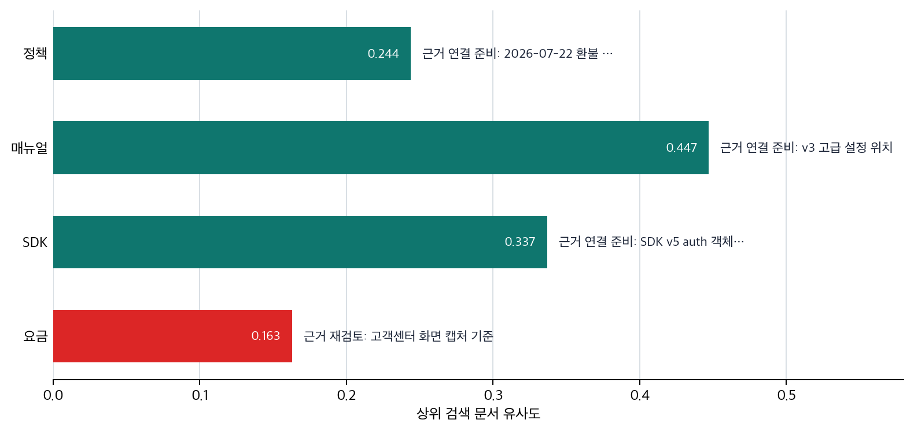

# P6-11.1 모델 기억 대신 외부 근거를 붙이는 RAG

> Section ID: `P6-11.1`
> Version: `v2026.07.24`

P6-10.2에서는 프롬프트만으로는 최신성, 근거 보장, 실행 가능성 같은 문제를 해결하기 어렵다는 점을 보았습니다. 그러면 답변 문장 자체보다, 답변에 들어갈 재료를 먼저 어떻게 바꿀지가 중요해집니다.

모델 기억에만 의존하지 않고, 외부 근거를 함께 쓰려면 어떻게 해야 하는가?

RAG(retrieval-augmented generation)는 모델이 답을 만들기 전에 관련 문서를 먼저 찾고, 그 문서를 바탕으로 생성하도록 연결하는 구조다.

## 답변 전에 외부 근거를 붙이는 기준

RAG는 `답의 출발점을 모델 기억에서 외부 문서 근거로 바꾸는 구조`입니다. 프롬프트와 지시 조정이 `모델이 어떻게 답하게 할까`를 다뤘다면, RAG는 `무엇을 근거로 답하게 할까`로 질문을 바꿉니다. 실제 결합 흐름은 검색 결과가 입력 맥락에 붙고 그 위에서 답이 생성되는 문제이고, 검색 저장 구조와 인덱스는 필요한 문서를 다시 찾을 수 있게 준비하는 문제입니다.

따라서 여기서의 핵심 변화는 `질문 문장을 더 잘 다듬는가`가 아니라 `답하기 전에 어떤 문서를 먼저 붙이게 만들 것인가`입니다. 이 기준이 서야 RAG를 프롬프트의 연장선이 아니라 별도의 근거 연결 구조로 읽을 수 있습니다.

처음에는 두 질문만 갈라도 충분합니다. 이미 가진 회의 메모를 세 줄로 요약하거나 분류 결과를 표 형식으로 다시 쓰는 일은 대체로 `같은 재료로 답하는 방식을 조정하는 문제`입니다. 반대로 오늘 바뀐 사내 정책이나 현재 SDK 버전의 사용법을 묻는 일은 `답의 재료 자체를 현재 문서로 다시 고르는 문제`입니다. 이 두 번째 장면에서 RAG가 필요해집니다.

`프롬프트에 문서를 길게 붙이는 요령`이라는 인상은 `답의 출발점을 외부 근거 문서로 바꾸는 구조`로 바꾸어 읽어야 합니다. 여기서 먼저 남겨야 할 것은 어떤 문서를 근거 후보로 찾았는지, 각 문서가 왜 관련 있다고 판단되었는지, 최종 답이 실제 문서 근거 위에 섰는지를 보여 주는 검색 메모와 근거 점검 기록입니다.

문서가 답변 앞에 저절로 붙는 것은 아닙니다. 보통은 문서 조각을 검색 가능한 형태로 저장해 두고, 질문이 들어오면 관련 조각을 먼저 꺼냅니다. 이 저장 구조에는 키워드 검색, 일반 데이터베이스, 벡터 데이터베이스(vector database)가 섞일 수 있지만, LLM 서비스에서는 의미가 가까운 문서를 찾기 위해 벡터 데이터베이스가 자주 쓰입니다. 이 절에서는 먼저 `답하기 전에 근거를 찾아 붙인다`는 RAG 구조를 잡고, P6-12.1에서 그 근거를 어떻게 임베딩, 원문, 메타데이터로 저장하고 다시 꺼내는지 봅니다.

| 먼저 구분할 장면 | 먼저 잡을 판단 | 왜 먼저 갈라야 하는가 |
| --- | --- | --- |
| 답의 말투, 표 형식, 요약 방식만 아쉽다 | 프롬프트 조정 문제일 가능성이 크다 | 재료는 이미 있는데 표현 방식만 흔들리는 경우가 많기 때문입니다. |
| 오늘 바뀐 정책, 현재 SDK 버전, 내부 매뉴얼이 필요하다 | RAG가 먼저 필요한 장면일 가능성이 크다 | 답 전에 최신 문서와 내부 문서를 붙이지 않으면 기억 의존 오답이 나기 쉽기 때문입니다. |
| 문서는 봤지만 계산, 조회, 실제 실행이 더 중요하다 | RAG만으로 닫히지 않을 수 있다 | 문서를 읽는 것과 값을 계산하거나 시스템을 호출하는 일은 다른 문제이기 때문입니다. |
| 문서 후보가 너무 많아 무엇을 근거로 삼았는지 모호하다 | 검색 품질과 근거 기록까지 함께 봐야 한다 | RAG를 붙였더라도 어떤 문서를 왜 골랐는지 남지 않으면 신뢰를 확인하기 어렵기 때문입니다. |

## 왜 모델 기억만으로는 부족한가

LLM은 사전학습과 조정을 통해 많은 패턴을 배웁니다. 하지만 실제 서비스에서는 최신 정보와 내부 문서가 자동 반영되지 않는 문제가 자주 나옵니다. RAG가 추가하는 것은 답하기 전에 근거 문서를 찾는 단계이고, 그래서 바뀌는 것은 답의 출발점이 모델 기억에서 문서 근거로 이동한다는 점입니다.

- 오늘 바뀐 정책을 반영해야 한다
- 회사 내부 문서를 근거로 답해야 한다
- 최신 제품 사양을 기준으로 설명해야 한다
- 답변에 실제 출처를 붙여야 한다

이런 요구는 모델 내부에 이미 들어 있는 기억만으로는 안정적으로 해결되기 어렵습니다.

이유는 단순합니다.

- 학습 시점 이후 정보는 자동으로 갱신되지 않고
- 내부 문서는 애초에 학습에 포함되지 않았을 수 있으며
- 답변이 그럴듯해 보여도 실제 근거와 연결되지 않을 수 있기 때문입니다

## RAG는 무엇을 바꾸려 하나

RAG의 기본 발상은 매우 실용적입니다.

`먼저 관련 문서를 찾고, 그 문서를 함께 넣은 뒤, 그 범위 안에서 답을 생성하자.`

즉, 모델이 혼자 기억을 꺼내는 구조에서:

- 검색(retrieval)이 먼저 일어나고
- 그 결과가 맥락(context)으로 붙고
- 생성(generation)이 그 위에서 진행되는 구조로 바뀝니다

이 때문에 RAG는 `모델을 더 똑똑하게 만드는 기술`이라기보다, `답변 근거를 외부 자료와 연결하는 서비스 구조`로 이해하는 편이 더 정확합니다.

서비스 구조 관점에서는, 프롬프트가 `모델에게 어떻게 물을까`를 다뤘다면 RAG는 `무엇을 근거로 답하게 할까`를 다루는 단계입니다.

이 차이를 운영 질문으로 바꾸면 더 분명해집니다.

| 지금 먼저 확인할 것 | 프롬프트 단계 질문 | RAG 단계 질문 |
| --- | --- | --- |
| 답이 흔들리는 이유 | 요청 형식이 모호한가? | 근거 문서가 없거나 낡았는가? |
| 먼저 바꿀 초점 | 지시, 맥락, 예시를 다시 쓸 것인가? | 검색할 문서 범위와 최신 문서를 먼저 붙일 것인가? |
| 확인할 결과 | 형식, 길이, 말투가 안정됐는가? | 실제 문서 조건과 숫자가 답에 반영됐는가? |

## RAG는 어떤 문제를 줄이려 하나

RAG는 보통 다음 문제를 줄이려는 방향으로 쓰입니다.

- 최신 정보 부족
- 내부 문서 미반영
- 근거 없는 일반론적 답변
- 출처 추적 어려움

`RAG는 모델의 기억을 믿기만 하지 않고, 필요한 문서를 먼저 가져와 답의 근거 범위를 좁히는 방법이다.`

## 파인튜닝과 무엇이 다른가

이 차이는 매우 중요합니다.

| 방식 | 주로 해결하려는 문제 |
| --- | --- |
| 파인튜닝(fine-tuning) | 특정 형식, 반응 성향, 도메인 적합성 조정 |
| RAG | 최신 정보, 외부 근거, 문서 기반 응답 연결 |

예를 들어:

- 답변 형식을 회사 스타일에 맞추는 일은 파인튜닝이 더 관련 있을 수 있습니다
- 오늘 바뀐 환불 정책을 반영하는 일은 RAG가 더 직접적입니다

이 구분이 없으면 사용자는 모든 문제를 파인튜닝이나 프롬프트 하나로 해결하려는 오해에 빠지기 쉽습니다.

같은 요청 흐름으로 다시 정리하면 다음과 같습니다.

- 프롬프트: 질문 방식을 다듬는다
- 파인튜닝: 반응 성향과 형식을 더 맞춘다
- RAG: 답변 전에 외부 근거를 붙인다

여기서 한 가지를 더 분리해 두면 P6-11.2와 P6-12의 흐름이 더 자연스럽게 읽힙니다. 외부 커리큘럼은 보통 `사전학습용 데이터 준비`와 `검색용 문서 준비`를 함께 다루지만, 둘은 같은 작업이 아닙니다.

| 데이터 준비 종류 | 먼저 맞추려는 것 | 지금 연결되는 위치 |
| --- | --- | --- |
| 사전학습용 데이터 준비 | 모델이 넓은 언어 패턴을 배우게 하는가 | P6-7.1, P6-7.2 |
| 검색용 문서 준비 | 현재 질문에 맞는 문서를 다시 꺼내 쓸 수 있는가 | P6-11, P6-12 |

즉, RAG를 붙인다는 말은 `모델을 다시 크게 학습시킨다`보다 `검색할 수 있게 문서를 준비하고, 답 전에 그 문서를 붙인다`에 더 가깝습니다.

외부 RAG 정리 자료와 실무형 경험 보고를 같이 보면, 여기서 한 번 더 분리해야 할 축이 있습니다. RAG는 `질문이 들어온 뒤에만 시작되는 기술`이 아니라, 그보다 앞선 `문서 준비(content preparation)` 단계와 함께 읽어야 합니다.

| 질문이 들어오기 전 | 질문이 들어온 뒤 |
| --- | --- |
| 최신 버전 문서를 남기고 낡은 문서를 구분한다 | 현재 질문에 맞는 문서를 검색한다 |
| 문단을 너무 길거나 너무 짧지 않게 분할한다 | 검색된 문단을 입력 맥락에 붙인다 |
| 중복 문서를 정리하고 메타데이터를 붙인다 | 그 문단 범위 안에서 답을 생성한다 |

즉, RAG의 첫 성공 조건은 `검색 모델이 똑똑한가`만이 아니라, `검색할 문서가 이미 검색 가능한 형태로 준비돼 있는가`이기도 합니다.

## 왜 실무에서 자주 쓰이나

실무에서는 `정답처럼 보이는 말`보다 `근거가 확인되는 말`이 중요할 때가 많습니다.

예를 들어:

- 사내 위키 기반 답변
- 제품 매뉴얼 기반 고객 지원
- 법률/정책 문서 기반 검색 응답
- 기술 문서 기반 개발 보조

이런 경우 RAG는 모델을 바꾸기보다 `근거 접근 경로`를 바꾸는 방법이기 때문에 실용적입니다.

여기서는 다음 한 줄이 중요합니다.

`실무에서는 멋진 답보다 근거가 추적되는 답이 더 중요할 때가 많다.`

## RAG도 만능은 아니다

하지만 RAG도 과장하면 안 됩니다.

RAG가 있다고 해서:

- 항상 가장 관련된 문서를 찾는 것
- 찾은 문서를 항상 정확히 읽는 것
- 인용이 항상 올바른 것
- 검색 결과가 충분한 것

이 자동으로 보장되지는 않습니다.

즉, RAG는 `검색 문제`와 `생성 문제`를 같이 다루게 만들 뿐, 두 문제를 모두 자동 해결하는 것은 아닙니다.

더 안전한 설명은 다음입니다.

`RAG는 답의 근거를 외부 자료에 연결하는 강한 구조이지만, 검색 품질과 생성 품질을 따로 점검해야 한다.`

## 아주 단순하게 그리면

```mermaid
--8<-- "assets/part-06/chapter-11/p6-c11-s01-rag-need-flow-ko.mmd"
```

이 도식의 핵심은 `검색이 먼저 오고, 생성이 그 뒤에 온다`는 점입니다.

## 사례 및 예시

### 사례 1. 사내 정책 질의응답

질문이 `출장비 정산 기준이 어떻게 바뀌었나요?`라면, 먼저 기억나는 공지나 지난번 기준으로 답하려는 흐름이 생기기 쉽습니다. 내부 정책도 결국 사람이 읽는 문서이니, 모델이 일반 지식처럼 알고 있을 것이라고 기대하기 쉽기 때문입니다. 하지만 내부 정책은 자주 개정되고, 예전 기준과 오늘 기준이 다를 수 있어서 기억 의존 방식은 바로 잘못된 안내로 이어지기 쉽습니다. 예를 들어 작년에는 교통비 상한이 없었는데 올해부터 상한이 생겼다면, 말투가 자연스러워도 답 자체는 틀립니다. 더 위험한 점은 이런 답이 조직 안에서 `공식 안내처럼 보이는 문장`으로 복제되기 쉽다는 데 있습니다.

RAG는 최신 사내 정책 문서를 먼저 검색해 현재 효력이 있는 조항을 찾고, 그 문단을 문맥에 붙인 뒤 답을 만들게 합니다. 여기서 구조적으로 바뀌는 점은 `기억나는 답을 꺼낸다`에서 `현재 유효한 문서를 먼저 확인한다`로 출발점이 이동하는 것입니다. 여기서 바로잡아야 할 오해는 `자연스럽게 설명하면 일단 충분하다`는 기대입니다. 그래서 이 사례에서 확인해야 할 결과는 자연스러운 설명보다 먼저, 실제 최신 정책 문단이 답의 근거로 붙는가, 그리고 그 문단만 보고도 현재 효력 기준을 다시 확인할 수 있는가입니다.

### 사례 2. 제품 매뉴얼 기반 지원

제품 사용법을 묻는 고객 지원 챗봇을 생각해 볼 수 있습니다. FAQ 몇 개와 자주 쓰는 답변 템플릿만 잘 정리해 두면 기본 질문은 충분히 처리된다고 느끼기 쉽습니다. 고객 질문도 반복되는 편이니, 한 번 만든 답변을 계속 재사용해도 큰 문제는 없을 것처럼 보이기 때문입니다. 하지만 메뉴 이름과 설정 위치는 버전이 바뀔 때마다 달라질 수 있어서, 템플릿은 자연스러워도 내용은 곧바로 낡을 수 있습니다. 예를 들어 예전 버전의 `고급 설정` 메뉴가 현재 버전에서는 `환경설정`으로 옮겨졌다면, 기억 기반 답변은 고객을 잘못된 화면으로 보내게 됩니다. 이때 사용자는 `답은 친절했는데 왜 실제 화면과 다르지?`라는 실패를 겪게 됩니다.

RAG는 최신 매뉴얼과 FAQ에서 관련 문서를 먼저 찾아 현재 버전 설명을 붙인 뒤 답을 구성하게 만듭니다. 그 결과 답변 품질은 말투보다 먼저 `현재 문서와의 정합성`으로 관리할 수 있게 됩니다. 여기서 바로잡아야 할 오해는 `자주 묻는 질문이면 기억 기반 템플릿으로도 충분하다`는 감각입니다. 그래서 이 사례에서 확인해야 할 결과는 템플릿이 자연스러운가보다, 현재 버전 메뉴와 절차가 실제 문서 기준으로 맞는가, 그리고 답의 각 단계가 실제 화면 경로와도 대응되는가입니다.

### 사례 3. 개발 문서 검색

개발자가 `현재 SDK 버전에서 인증 헤더를 어디에 넣나요?`라고 묻는 장면을 떠올려 볼 수 있습니다. 모델이 일반적인 API 지식을 많이 알고 있으니 바로 답해도 될 것이라고 생각하기 쉽습니다. 문법 질문은 검색보다 기억된 예제가 더 빠를 것처럼 보이기 때문입니다. 하지만 예전 버전 문법을 기억하고 있으면 얼핏 그럴듯한 답이라도 실제 코드에서는 즉시 오류로 이어질 수 있습니다. 예를 들어 과거 버전의 `Authorization` 예제를 그대로 답했는데 현재 버전은 `auth` 객체를 따로 넘기게 바뀌었다면, 복사해 넣은 코드가 바로 실패합니다. 이때 실패는 단순 오답이 아니라 디버깅 시간, 신뢰 하락, 잘못된 샘플 코드 확산으로 이어집니다.

이때 먼저 확인해야 하는 것은 모델의 일반 지식이 아니라 `지금 쓰는 버전 문서`입니다. RAG는 현재 API 문서와 예제 페이지를 먼저 찾아 문맥에 붙인 뒤 답을 만들게 해 이런 버전 불일치 위험을 줄입니다. 여기서 핵심은 생성 문장의 유창함보다 검색 단계가 현재 문서를 정확히 집어오는가에 있습니다. 여기서 바로잡아야 할 오해는 `그럴듯한 코드면 일단 복사해서 써 볼 수 있다`는 태도입니다. 그래서 이 사례에서 확인해야 할 결과는 답이 그럴듯한가보다, 실제 현재 SDK 문서와 코드 예제가 함께 근거로 붙는가, 그리고 그 근거만 따라가도 같은 코드를 재현할 수 있는가입니다.

세 사례를 운영 점검 기준으로 다시 묶으면 다음과 같습니다.

| 상황 | 먼저 붙어야 하는 근거 | 근거가 없을 때 생기는 오답 |
| --- | --- | --- |
| 사내 정책 | 최신 정책 공지, 현재 효력 조항 | 예전 규정을 자연스럽게 반복함 |
| 제품 지원 | 현재 버전 매뉴얼 경로, 최신 FAQ | 낡은 메뉴 이름과 절차를 안내함 |
| 개발 문서 | 현재 SDK/API 버전 문서, 공식 예제 | 예전 옵션명이나 코드 패턴을 섞어 답함 |

같은 내용을 근거 우선 구조로 다시 보면 다음처럼 읽을 수 있습니다.

```mermaid
--8<-- "assets/part-06/chapter-11/p6-c11-s01-rag-grounding-cases-ko.mmd"
```

핵심은 `질문 다음에 바로 생성`이 아니라 `질문 다음에 먼저 근거 검색`이 들어간다는 점입니다.

## 근거 연결이 필요한 장면

RAG를 처음 읽을 때 가장 자주 헷갈리는 지점은 `답이 틀렸다`는 사실만 보고도 곧바로 프롬프트를 더 길게 고치려는 점입니다. 하지만 이 절의 세 사례에서 먼저 봐야 하는 것은 문장 표현보다 `답하기 전에 현재 문서를 실제로 붙였는가`입니다.

| 이런 장면이 보이면 | 먼저 확인할 것 | 왜 그 순서가 중요한가 |
| --- | --- | --- |
| 답의 말투나 표 형식은 아쉽지만 사실관계 자체는 이미 맞음 | 최신 문서를 더 붙일 문제인가, 형식 조정 문제인가 | 근거가 이미 맞다면 RAG를 더 붙이는 것보다 프롬프트나 조정층 문제를 먼저 가르는 편이 맞기 때문입니다. |
| 답은 자연스럽지만 오늘 바뀐 정책과 다름 | 최신 정책 문서가 먼저 검색됐는가 | 최신 문서가 없으면 신중한 말투도 과거 답을 반복할 수 있기 때문입니다. |
| 메뉴 설명은 친절하지만 실제 화면 경로와 다름 | 현재 버전 매뉴얼이 근거로 붙었는가 | 템플릿보다 현재 버전 문서 정합성이 먼저 맞아야 하기 때문입니다. |
| 코드 예제는 그럴듯하지만 지금 SDK에서 바로 실패함 | 현재 버전 공식 문서와 예제가 붙었는가 | 일반 지식보다 현재 버전 근거가 먼저 맞아야 복사 가능한 답이 되기 때문입니다. |

같은 기준을 더 짧게 실무 질문으로 바꾸면 다음처럼 읽을 수 있습니다.

| 이런 의심이 들면 | 먼저 던질 질문 |
| --- | --- |
| `답 형식은 아쉽지만 사실은 맞는 것 같다` | 지금 필요한 것이 새 문서 근거인가, 아니면 말투·형식 조정인가? |
| `답은 매끄러운데 왠지 낡아 보인다` | 답이 어떤 최신 문서를 근거로 삼았는가? |
| `설명은 친절한데 실제 화면과 안 맞는다` | 현재 버전 매뉴얼 경로가 실제로 붙었는가? |
| `코드는 그럴듯한데 실행이 안 된다` | 공식 예제와 현재 API 문서가 함께 회수됐는가? |

먼저 익혀야 하는 기준은 단순합니다. RAG는 `질문을 더 잘 쓰는 요령`이 아니라, `답하기 전에 무엇을 근거로 붙일지`를 시스템 단계에서 먼저 고정하는 구조입니다.

## 연습 및 예제

예제의 목표는 실제 벡터 데이터베이스나 LLM 서비스를 구현하는 것이 아니라, `질문 -> 검색 모델로 관련 문서 고르기 -> 그 문서를 근거로 답 만들기`라는 RAG의 최소 동작을 확인하는 것입니다. 환불 정책, 제품 매뉴얼, SDK 문서 질문을 한 번에 돌려, 검색 없이 답할 때와 검색 모델이 고른 문서를 붙인 뒤 답할 때 무엇이 달라지는지 비교합니다.

사용자는 최신 정책, 현재 버전 제품 화면, 현재 SDK 사용법을 물을 수 있습니다. 모델 내부 기억에는 예전 기준이나 일반 상식이 남아 있을 수 있고, 관련 문서를 먼저 찾지 않으면 자연스러운 오답이 나올 수 있습니다. 그래서 이 예제는 `scikit-learn`의 `TfidfVectorizer`를 아주 작은 검색 모델처럼 사용합니다. 실제 임베딩 모델은 아니지만, 질문과 문서를 벡터로 바꿔 가까운 문서를 고른다는 흐름은 직접 실행으로 확인할 수 있습니다. 한국어 짧은 문장은 띄어쓰기 단어만으로 비교하면 `오늘`과 `오늘부터`처럼 붙은 표현을 놓치기 쉬우므로, 예제에서는 문자 n-gram 기준을 사용합니다.

아래 예제는 두 CSV 파일을 입력으로 사용합니다.

- 질문 목록: [p6-11-rag-need-questions.csv](../../../assets/part-06/chapter-11/p6-11-rag-need-questions.csv){ .csv-preview }
- 문서 후보: [p6-11-rag-need-documents.csv](../../../assets/part-06/chapter-11/p6-11-rag-need-documents.csv){ .csv-preview }

질문 목록의 한 행은 사용자 질문 하나를 뜻합니다. 핵심 열은 `case_id`, `question`, `memory_answer`, `current_signal`입니다. `memory_answer`는 검색 없이 모델 기억에만 의존했을 때 나올 수 있는 오래된 답이고, `current_signal`은 답변이 최신 근거를 언급했는지 확인하는 관찰용 단서입니다. 이 단서는 정답표가 아니므로, 검색된 문서의 주제 일치, 버전 상태, 유사도, 근거 문서 수를 함께 봅니다.

문서 후보의 한 행은 검색 대상 문서 조각 하나입니다. 핵심 열은 `title`, `text`, `version_status`, `source_type`입니다. `version_status`가 `current`인 행은 현재 근거 문서이고, `old`인 행은 보관 문서이며, `related`인 행은 관련은 있지만 최종 답의 핵심 근거가 되기 어려운 보조 문서입니다.

이 절의 예제를 읽을 때는 먼저 무엇을 점검할지 표로 잡고 가는 편이 좋습니다.

| 점검 항목 | 왜 필요한가 |
| --- | --- |
| `memory` 답이 최신 신호를 담는가 | 검색 없이 답하면 무엇을 놓치는지 확인 |
| 검색 모델이 고른 첫 문서가 질문 주제와 맞는가 | 답변 전에 근거 선택 단계가 실제로 생겼는지 확인 |
| 검색 모델이 고른 첫 문서가 현재 문서인가 | 오래된 문서가 현재 답의 근거로 들어오지 않는지 확인 |
| RAG 답이 최신 신호를 담는가 | 선택된 문서가 답에 실제 반영됐는지 보조 확인 |
| 유사도 점수가 함께 남는가 | 어떤 문서가 왜 먼저 붙었는지 추적하기 위해 |

코드에서 확인할 핵심은 RAG가 답변 문장을 바로 고치는 기술이 아니라, 답변 전에 검색 모델로 근거 문서를 먼저 고르게 만드는 구조라는 점입니다.

```python
# TfidfVectorizer를 작은 검색 모델처럼 사용해 질문과 가까운 근거 문서를 먼저 고르는 예제입니다.
import csv
from pathlib import Path

from sklearn.feature_extraction.text import TfidfVectorizer
from sklearn.metrics.pairwise import cosine_similarity

question_path = Path("docs/assets/part-06/chapter-11/p6-11-rag-need-questions.csv")
document_path = Path("docs/assets/part-06/chapter-11/p6-11-rag-need-documents.csv")

def read_csv(path):
    with path.open(encoding="utf-8", newline="") as file:
        return list(csv.DictReader(file))

questions = read_csv(question_path)
documents = read_csv(document_path)

# 문서 제목과 본문을 함께 벡터화해 질문과 비교할 검색 공간을 만든다.
document_texts = [
    f"{doc['title']} {doc['text']}"
    for doc in documents
]
# 한국어 짧은 문장에서는 단어 경계보다 문자 n-gram이 작은 검색 실험에 더 안정적이다.
vectorizer = TfidfVectorizer(analyzer="char_wb", ngram_range=(2, 4))
document_vectors = vectorizer.fit_transform(document_texts)

def retrieve_docs(question, top_k=2):
    query_vector = vectorizer.transform([question])
    scores = cosine_similarity(query_vector, document_vectors).ravel()
    ranked_indexes = scores.argsort()[::-1]

    retrieved = []
    for index in ranked_indexes:
        if scores[index] <= 0:
            continue
        retrieved.append(
            {
                **documents[index],
                "similarity": round(float(scores[index]), 3),
            }
        )
        if len(retrieved) == top_k:
            break
    return retrieved

def answer_with_rag(retrieved_docs):
    if not retrieved_docs:
        return {
            "answer": "관련 근거 문서를 찾지 못해 현재 기준을 확정하기 어렵습니다.",
            "grounding_titles": [],
        }

    top_doc = retrieved_docs[0]
    answer = f"근거 문서 '{top_doc['title']}'에 따르면 {top_doc['text']}"
    return {
        "answer": answer,
        "grounding_titles": [doc["title"] for doc in retrieved_docs],
    }

def inspect_question(question_row):
    retrieved_docs = retrieve_docs(question_row["question"])
    rag_result = answer_with_rag(retrieved_docs)
    top_doc = retrieved_docs[0] if retrieved_docs else None
    top_doc_matches_case = bool(top_doc) and top_doc["case_id"] == question_row["case_id"]
    top_doc_is_current = bool(top_doc) and top_doc["version_status"] == "current"
    answer_mentions_expected_update = question_row["current_signal"] in rag_result["answer"]
    grounding_ready = (
        top_doc_matches_case
        and top_doc_is_current
        and answer_mentions_expected_update
    )
    inspection = {
        "memory_mentions_expected_update": question_row["current_signal"] in question_row["memory_answer"],
        "answer_mentions_expected_update": answer_mentions_expected_update,
        "top_grounding_doc": rag_result["grounding_titles"][0] if rag_result["grounding_titles"] else "none",
        "top_doc_matches_case": top_doc_matches_case,
        "top_doc_is_current": top_doc_is_current,
        "top_doc_similarity": top_doc["similarity"] if top_doc else 0,
        "grounding_count": len(rag_result["grounding_titles"]),
        "grounding_ready": grounding_ready,
    }
    return {
        "case_id": question_row["case_id"],
        "question": question_row["question"],
        "memory_answer": question_row["memory_answer"],
        "retrieved_titles": [doc["title"] for doc in retrieved_docs],
        "retrieved_similarities": [doc["similarity"] for doc in retrieved_docs],
        "rag_answer": rag_result["answer"],
        "inspection": inspection,
    }

reports = [inspect_question(question) for question in questions]
summary = {
    "memory_update_mention_count": sum(report["inspection"]["memory_mentions_expected_update"] for report in reports),
    "rag_update_mention_count": sum(report["inspection"]["answer_mentions_expected_update"] for report in reports),
    "top_doc_case_match_count": sum(report["inspection"]["top_doc_matches_case"] for report in reports),
    "top_doc_current_count": sum(report["inspection"]["top_doc_is_current"] for report in reports),
    "grounding_ready_count": sum(report["inspection"]["grounding_ready"] for report in reports),
    "memory_update_mention_ratio": round(
        sum(report["inspection"]["memory_mentions_expected_update"] for report in reports) / len(reports),
        2,
    ),
    "grounding_ready_ratio": round(
        sum(report["inspection"]["grounding_ready"] for report in reports) / len(reports),
        2,
    ),
}

print("[summary]")
print(summary)
print()

for report in reports:
    print("=" * 80)
    print("[task]")
    print(report["case_id"])
    print("[question]")
    print(report["question"])
    print("[memory only answer]")
    print(report["memory_answer"])
    print("[retrieved doc titles and similarities]")
    print(report["retrieved_titles"])
    print(report["retrieved_similarities"])
    print("[rag answer]")
    print(report["rag_answer"])
    print("[inspection]")
    print(report["inspection"])
```

저장소 루트에서 이 코드를 실행하면 다음처럼 출력됩니다.

```text
[summary]
{'memory_update_mention_count': 0, 'rag_update_mention_count': 3, 'top_doc_case_match_count': 3, 'top_doc_current_count': 3, 'grounding_ready_count': 3, 'memory_update_mention_ratio': 0.0, 'grounding_ready_ratio': 0.75}

================================================================================
[task]
policy
[question]
환불 정책이 오늘 어떻게 바뀌었나요?
[memory only answer]
환불 요청 처리 기한은 7일입니다.
[retrieved doc titles and similarities]
['2026-07-22 환불 정책 변경', '2025-12-01 환불 정책 보관본']
[0.244, 0.208]
[rag answer]
근거 문서 '2026-07-22 환불 정책 변경'에 따르면 오늘부터 환불 요청 처리 기한은 14일로 변경되며 적용 날짜 이후 접수 건에 적용된다
[inspection]
{'memory_mentions_expected_update': False, 'answer_mentions_expected_update': True, 'top_grounding_doc': '2026-07-22 환불 정책 변경', 'top_doc_matches_case': True, 'top_doc_is_current': True, 'top_doc_similarity': 0.244, 'grounding_count': 2, 'grounding_ready': True}
================================================================================
[task]
manual
[question]
현재 버전에서 고급 설정 메뉴는 어디에 있나요?
[memory only answer]
고급 설정 메뉴에서 바로 찾을 수 있습니다.
[retrieved doc titles and similarities]
['v3 고급 설정 위치', 'v2 고급 설정 안내']
[0.447, 0.444]
[rag answer]
근거 문서 'v3 고급 설정 위치'에 따르면 현재 버전에서는 고급 설정 관련 기능을 환경설정 > 실험실 메뉴에서 찾는다
[inspection]
{'memory_mentions_expected_update': False, 'answer_mentions_expected_update': True, 'top_grounding_doc': 'v3 고급 설정 위치', 'top_doc_matches_case': True, 'top_doc_is_current': True, 'top_doc_similarity': 0.447, 'grounding_count': 2, 'grounding_ready': True}
================================================================================
[task]
sdk
[question]
현재 SDK 버전에서 인증 헤더를 어디에 넣나요?
[memory only answer]
Authorization 헤더에 직접 토큰을 넣으면 됩니다.
[retrieved doc titles and similarities]
['SDK v5 auth 객체 인증', 'SDK v4 Authorization 헤더 예제']
[0.337, 0.306]
[rag answer]
근거 문서 'SDK v5 auth 객체 인증'에 따르면 현재 SDK 버전에서는 auth 객체에 토큰을 넣어 클라이언트를 생성한다
[inspection]
{'memory_mentions_expected_update': False, 'answer_mentions_expected_update': True, 'top_grounding_doc': 'SDK v5 auth 객체 인증', 'top_doc_matches_case': True, 'top_doc_is_current': True, 'top_doc_similarity': 0.337, 'grounding_count': 2, 'grounding_ready': True}
================================================================================
[task]
pricing
[question]
현재 좌석별 요금표는 어디에서 확인하나요?
[memory only answer]
요금제는 월 단위로 청구됩니다.
[retrieved doc titles and similarities]
['고객센터 화면 캡처 기준', 'v3 고급 설정 위치']
[0.163, 0.139]
[rag answer]
근거 문서 '고객센터 화면 캡처 기준'에 따르면 화면 안내 답변에는 현재 버전 매뉴얼 경로를 먼저 확인해야 한다
[inspection]
{'memory_mentions_expected_update': False, 'answer_mentions_expected_update': False, 'top_grounding_doc': '고객센터 화면 캡처 기준', 'top_doc_matches_case': False, 'top_doc_is_current': False, 'top_doc_similarity': 0.163, 'grounding_count': 2, 'grounding_ready': False}
```

이 결과에서 먼저 봐야 할 것은 `memory_update_mention_count`가 0이고 `grounding_ready_count`가 3이라는 점입니다. 검색 없이 기억으로만 답하면 네 질문 모두 최신 단서를 놓쳤지만, RAG는 정책, 매뉴얼, SDK 질문에서 질문 주제와 맞는 현재 문서를 먼저 붙이고 답변 안에 최신 단서를 회수했습니다. 반대로 `pricing` 질문은 문서 후보가 없기 때문에 문서가 두 개 붙어도 `top_doc_matches_case`와 `answer_mentions_expected_update`가 모두 false입니다. 즉, `grounding_ready`는 검색된 문서 수가 아니라 질문 주제와 맞는 현재 문서가 답에 실제로 연결됐는지 보는 값입니다.

그래서 이 예제에서 확인해야 할 결과는 두 가지입니다.

- 질문만으로 바로 답하는 것이 아니라, 검색 모델이 고른 관련 문서를 먼저 붙인 뒤에야 답변 생성 단계로 넘어간다.
- RAG의 품질은 답변 문장만이 아니라 `질문 주제와 맞는 현재 문서를 회수했는가`, `유사도 점수와 근거 제목이 남았는가`, `근거가 없을 때 실패로 남기는가`까지 함께 점검해야 한다.

이 예제에서 독자가 직접 해 볼 수 있는 조정은 다음과 같습니다.

- 질문 CSV의 `question` 표현을 바꿔 검색된 문서와 유사도 점수가 어떻게 달라지는지 보기
- 문서 CSV에 보관 문서나 무관 문서를 더 넣어 현재 문서가 계속 상위에 남는지 확인하기
- `pricing` 질문에 맞는 현재 문서를 추가해 `grounding_ready`가 어떻게 바뀌는지 보기
- `top_k` 값을 1에서 3으로 바꿔 근거 문서 묶음이 어떻게 달라지는지 보기
- `answer_with_rag`에서 문서 제목뿐 아니라 문서 ID와 버전 상태를 함께 반환하도록 바꿔 보기

## 근거 우선 구조에서 바뀌는 답변 기준

앞의 예제는 RAG 전체를 구현하는 코드가 아니라, `먼저 답을 만들고 근거를 꾸미는 구조`가 아니라 `먼저 근거를 붙이고 그 뒤에 답을 만드는 구조`라는 점을 가장 짧게 보여 주는 장면입니다. 여기서 읽어야 할 핵심은 답변 문장보다, 답변 직전에 어떤 근거 단계를 반드시 거치게 할 것인가입니다. 그리고 그 원칙이 정책, 매뉴얼, SDK처럼 도메인이 달라도 반복된다는 점도 함께 중요합니다.

이 예제에서 읽어야 할 핵심은 다음입니다.

- 질문만 있다고 바로 답하지 않고
- 먼저 문서를 찾고
- 그 문서를 붙인 뒤 답한다는 점입니다

즉, RAG의 핵심 변화는 `답변 문장`보다 `답변 전에 거치는 근거 단계`에 있습니다.

상위 검색 문서의 유사도를 보면 차이가 더 자연스럽게 드러납니다. 정책, 매뉴얼, SDK 질문은 질문 주제와 맞는 현재 문서가 상위에 올라오고, 그 문서를 바탕으로 답변이 만들어집니다. 반대로 요금 질문은 낮은 유사도의 다른 주제 문서가 상위에 올라오므로, 문서가 검색되었다는 사실만으로는 근거 연결이 준비됐다고 볼 수 없습니다. 그래서 여기서 읽어야 할 변화는 답변 문장이 조금 좋아졌다는 정도가 아니라, 답변 전에 어떤 문서가 어느 정도 관련성으로 선택됐는지를 따로 남겨야 한다는 점입니다. RAG의 핵심은 모델이 더 많이 기억하게 만드는 것이 아니라, 답변 전에 현재 관련 문서를 먼저 회수해 그 문서를 근거로 말하게 만드는 데 있습니다.



더 중요하게 붙잡아야 할 점은 `그럴듯하게 말하는가`와 `근거를 붙여 답하는가`가 같은 문제가 아니라는 것입니다. 그래서 RAG는 모델을 더 똑똑하게 만드는 장치라기보다, 답변 전에 근거 문서를 먼저 회수하게 해 프롬프트 한계를 구조적으로 보완하는 첫 번째 연결 구조로 읽는 편이 좋습니다.

## 체크리스트
- RAG를 `답변 전에 현재 문서를 먼저 붙이는 구조`로 설명할 수 있는가?
- 프롬프트, 파인튜닝, RAG가 각각 무엇을 먼저 바꾸는지 구분할 수 있는가?
- P6-11.2를 `문서를 왜 붙이는가`가 아니라 `붙인 문서가 실제로 어떻게 답으로 이어지는가`의 문제로 읽을 준비가 되었는가?

## 출처와 참고 자료

- Patrick Lewis et al., [Retrieval-Augmented Generation for Knowledge-Intensive NLP Tasks](https://papers.nips.cc/paper/2020/hash/6b493230205f780e1bc26945df7481e5-Abstract.html){: target="_blank" rel="noopener noreferrer" }, NeurIPS, 2020, 확인 날짜: 2026-07-19.
- OpenAI, [Retrieval](https://developers.openai.com/api/docs/guides/retrieval){: target="_blank" rel="noopener noreferrer" }, OpenAI API Docs, 확인 날짜: 2026-07-19.
- OpenAI, [File search](https://developers.openai.com/api/docs/guides/tools-file-search){: target="_blank" rel="noopener noreferrer" }, OpenAI API Docs, 확인 날짜: 2026-07-19.
- scikit-learn developers, [TfidfVectorizer](https://scikit-learn.org/stable/modules/generated/sklearn.feature_extraction.text.TfidfVectorizer.html){: target="_blank" rel="noopener noreferrer" }, scikit-learn documentation, 확인 날짜: 2026-07-22.
- scikit-learn developers, [Cosine similarity](https://scikit-learn.org/stable/modules/metrics.html#cosine-similarity){: target="_blank" rel="noopener noreferrer" }, scikit-learn documentation, 확인 날짜: 2026-07-22.
