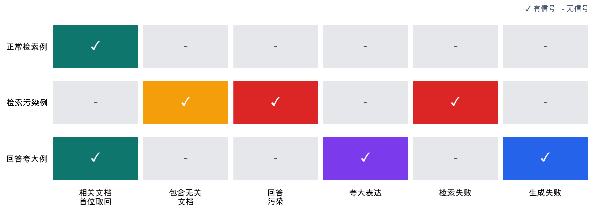

# P6-11.2 区分检索失败和生成失败的 RAG 流程

> Section ID: `P6-11.2`
> Version: `v2026.07.24`

在 P6-11.1 中，我们看到 RAG(retrieval-augmented generation) 是在回答前附加外部依据的结构。现在要看的是，这些依据在实际输入流程中位于哪里，以及回答失败应该如何拆开阅读。

在 RAG 中，检索结果不是回答后面附上的装饰，而是在生成前进入模型输入上下文(context)的材料。因此，即使看起来是同一种错误答案，也要把`取回了什么`和`如何重新写取回的材料`分开看。

## 检索和生成结合的流程

在检索-生成结合中，首先要收束的标准有三项。

| 问题 | 这里要抓住的标准 |
| --- | --- |
| 检索结果在生成前如何使用？ | 检索文档会附加到模型输入上下文 |
| 文档放得越多总是越好吗？ | 比数量更重要的是相关性、顺序和冲突管理 |
| 回答错了时先看哪里？ | 分开看检索失败和生成失败 |

如果 P6-11.1 的问题是`为什么要在回答前附加文档`，这里的问题就是`附加的文档如何在输入上下文和最终回答之间发挥作用`。之后 P6-12 再进入用什么存储结构和索引重新取回这些文档。

## 检索结果附加在哪里

最简单的形态中，检索到的部分文档会一起进入提示上下文。

例如输入可以这样构成。

- 用户问题
- 检索到的文档摘录
- 回答格式指令

也就是说，模型收到的不是`只有问题`，而是`问题 + 相关文档 + 回答指令`。

`RAG 是把检索结果保留在模型外部，并在回答前把它附加到输入上下文的结构。`

这里首先要留下的，是哪些文档被判断为足够相关并实际附加、选择了哪些依据句、最终回答是否夸大或偏离文档。只有这些检索记录和答案检查备忘存在，才能区分检索失败和生成失败。越往后，这些记录也会在 P6-12.1、P6-12.2 的检索质量检查，P6-16 的评价，P6-17 的运营判断，以及 Part 6 的检索取回记录和回顾备忘中重新被读取。

## 文档放得越多总是越好吗

不是。这里重要的不是`数量`，而是`相关性`和`整理方式`。

文档放得太多时：

- 核心依据可能被埋没
- 互相冲突的句子可能混在一起
- 可能浪费 context window
- 模型反而可能混淆

因此，检索结果不应按`收集得多`来判断。更重要的是把符合问题的材料，以合适大小和顺序放进去。

再往前一步，还能看到`检索-生成结合`前已经有文档准备阶段。检索要正常工作，文档不能只是堆在那里，而要在问题到来前整理成可以找到并附加的形态。

也就是说，本节讨论的是`取回的文档附加在哪里`，但在它之前已经有`把文档整理成可附加形态`的阶段。只有看见这个差异，向量数据库和索引的说明才不会被读成单纯的存储介绍，而会被读成`可检索文档准备`的延长线。

按请求时间重新划分，最稳妥的读法如下。

| 阶段 | 先看的问题 | 常见失败 |
| --- | --- | --- |
| 文档准备阶段 | 问题到来前，文档是否已经整理成可检索形态？ | 旧版本混入、重复文档、块太长 |
| 检索阶段 | 是否实际取回了符合当前问题的文档？ | 无关文档排在前面、最新文档缺失 |
| 生成阶段 | 是否没有偏离取回文档地重新回答？ | 条件遗漏、夸大、一般记忆混入 |

也就是说，`检索-生成结合`不只包括请求进入后的两个阶段，还应包括更早的文档准备阶段。

## 检索失败和生成失败有什么不同

这个区分非常重要。

### 检索失败

- 没有找到相关文档
- 旧文档先出现
- 与问题无关的文档混入

### 生成失败

- 文档取回了，但摘要错了
- 回答比文档依据更多地依赖一般记忆
- 来源连接错了

也就是说，RAG 系统的回答奇怪时，不能总是只说`模型不好`。要先区分是检索错了，还是生成错了。

即使表面上像同一种错误答案，先出现的信号不同，马上要确认的记录和下一步行动也会不同。

| 先看到的信号 | 先怀疑的失败轴 | 最先重看的记录 | 立刻确认的行动 | 不要急着下的结论 |
| --- | --- | --- | --- | --- |
| 附加的文档标题或摘录与问题不合 | 检索失败 | 重看附加了哪些文档、相关性分数如何、选择了哪些依据句 | 重看为什么某文档排在前面，先排除无关文档是否混入 | 不要断定只改提示句就能解决 |
| 附加文档正确，但回答漏掉条件或夸大 | 生成失败 | 重看回答草稿是否偏离实际依据句、依据检查哪里摇摆 | 确认回答草稿是否偏离依据，再看摘要指令和依据检查规则 | 不要断定检索质量已经足够 |
| 检索也奇怪，回答也一起摇摆 | 检索失败传染到生成 | 同时看检索记录和回答草稿 | 先减少检索污染，再调整生成指令 | 不要只凭一次错误扩大成模型整体能力问题 |

## 为什么回答质量会摇摆

RAG 结合了两个阶段，所以可能摇摆的点也更多。

- 检索文档选择
- 文档长度和摘录方式
- 文档顺序
- 生成指令方式
- 引用格式

因此，与其把 RAG 模糊地读成一个检索加一个生成，不如读成`检索管线 + 生成管线`。

## 非常简单地画出来

```mermaid
--8<-- "assets/part-06/chapter-11/p6-c11-s02-rag-combine-flow-zh.mmd"
```

这个图的核心是，检索结果不是附在回答后面，而是在`回答前进入输入上下文`。

## 案例和示例

### 案例 1. 产品支持聊天机器人

可以想象一个产品支持聊天机器人，客户问：`要关闭自动保存应该进入哪里？` 这个场景中，很容易觉得不管检索还是生成，最终`只要一次回答正确就好`。但检索阶段首先要从最新手册中取回包含`自动保存`、`设置`、`偏好设置`的相关段落。然后生成阶段不应只是复制该段落，而要根据客户问题重新说明`点击哪个菜单、按什么顺序进入`。例如文档可能只写了`偏好设置 > 编辑 > 自动保存`这样的路径，而生成阶段负责把它改写成用户容易跟随的句子。

如果检索错误地取回了另一个产品版本的段落，生成再自然也会指引错误功能。这里改变的是，标准从`直接写答案`分成`先找对段落，再按问题形式重新展开`。要纠正的误解是`句子自然，前一步应该也对`。因此，这个案例中要确认的结果是，最新手册路径是否正确反映在回答句子中，以及检索路径和最终步骤句是否指向同一版本。

### 案例 2. 法律文档辅助

假设法律文档辅助工具中，用户问：`有这项条款就可以立即解除合同吗？` 找到相关条文后，很容易觉得事情几乎结束了。但检索阶段是先找到与当前问题接近的相关条文和判例摘要，生成阶段则是基于这些文档，把它重新整理成`可以立即解除`、`需要追加条件`、`保留判断`这样的问答形式。例如文档写的是`在指定相当期间要求改正后可以解除`，如果生成漏掉中间条件，直接写成`可以立即解除`，检索是对的，最终回答仍然危险。

这里改变的是，从`找到文档就结束`的标准，移动到`是否没有漏掉找到文档中的条件并重新整理`的标准。因此，这个案例中要分别看`找文档的准确性`和`不越出文档的整理`。要纠正的误解是`相关条款已经附加，最终句子也会自动安全`。所以要确认的是，最终回答是否没有夸大成`立即可行`，是否保留原文条件，是否没有从文档外新加更强结论。

### 案例 3. 开发文档问答

想象开发者问：`这个 API 的 timeout 选项放在哪里？` 人很容易觉得，只要检索取回了正确版本的官方文档，工作就差不多结束了。但如果生成阶段把旧示例代码和新文档混在一起，或把选项名改成相似的其他参数，最终回答仍会失败。例如文档写的是 `request_timeout`，生成却改成另一个库中更熟悉的 `timeout_ms`，文档是对的，答案也会立刻坏掉。也就是说，检索正确不等于回答自动正确。

这里改变的是，不把`检索成功`和`最终回答正确`看成同一件事，而是另外检查`取回的名称是否在回答中保持原样`。要纠正的误解是`官方文档附上了，生成自然会对齐`。因此，这个案例中要确认的结果是，检索到的官方选项名是否在最终回答中保持不变，没有被换成相似参数名，回答示例代码也保持与检索文档相同的接口。

把三个案例按阶段区分重新整理如下。

| 情况 | 检索阶段首先要正确取回什么 | 生成阶段接着要守住什么 |
| --- | --- | --- |
| 产品支持聊天机器人 | 当前版本的准确菜单路径段落 | 把段落内容准确展开成用户步骤句 |
| 法律文档辅助 | 相关条文和条件段落 | 不漏条件，并避免断定式表达 |
| 开发文档问答 | 当前版本的官方选项段落 | 不把选项名改成相似的其他名称 |

同一内容按阶段分离结构重看，可以这样读。

```mermaid
--8<-- "assets/part-06/chapter-11/p6-c11-s02-rag-failure-split-zh.mmd"
```

核心是：`即使 RAG 看起来像一个阶段，内部的检索和生成也会分别摇摆`。

## 检索失败和生成失败分开的场景

把前面的表放在案例后再应用，判断问题可以压缩成三个。不要从`回答怪怪的`直接跳到模型整体问题，而要先把检索记录和生成回答分开摆放。

| 如果产生这种怀疑 | 先问的问题 |
| --- | --- |
| `附加的依据本身就陌生` | 哪份文档为什么排在前面？ |
| `依据似乎对，但回答说得太强` | 回答是否比实际句子更强地断言？ |
| `不知道从哪里开始错` | 是否把检索记录和最终回答分开看？ |

首先要学的标准很简单。即使 RAG 看起来像一个阶段，检查时也要把`检索阶段`和`生成阶段`分开，才能准确抓住原因。

## 练习和示例

这个示例的目标，是不要把检索和生成压成一个阶段，而是培养把`找文档的阶段`和`附加文档后生成回答的阶段`分开看的感觉。在同一文档集合中改变检索问题和 `generation_style`，确认检索污染和生成夸大是否会作为不同阶段的失败出现。

假设用户问：`为什么需要向量搜索？` 检索阶段必须选择相关文档，生成阶段必须把这些文档重新写成面向读者的说明。即使检索正确，生成如果夸大，最终回答仍可能扭曲。

下面示例使用两个 CSV 文件作为输入。

- 文档列表：[p6-11-rag-documents-zh.csv](../../../assets/part-06/chapter-11/p6-11-rag-documents-zh.csv){ .csv-preview }
- 实验条件：[p6-11-rag-experiments-zh.csv](../../../assets/part-06/chapter-11/p6-11-rag-experiments-zh.csv){ .csv-preview }

文档列表的一行是一个检索候选文档片段。关键列是 `title`, `text`, `category`, `source_role`。`category` 为 `retrieval` 时，表示与当前问题相关的依据文档；为 `irrelevant` 时，表示检索条件摇摆时可能混入的无关文档。

实验条件的一行表示一次 RAG 请求。`retrieval_terms` 是构成问题的检索信号，`generation_style` 表示把找到的文档转成回答时的生成方式。输出中会确认检索模型选中的文档标题和相似度、回答句子，以及分开观察检索失败和生成失败的检查值。尤其是 `source_trace` 会保留生成前附加的文档 ID、标题、角色、相似度、正文预览，让读者不只看回答，还能重新确认哪些依据文档进入了输入上下文。

先在这个示例中直接改动的设置如下。

| 实验 | 操作的值 | 要读的核心 |
| --- | --- | --- |
| `clean_grounded` | 相关搜索词和保守生成 | 正常流程 |
| `noisy_retrieval` | 混入无关搜索词的检索条件 | 检索失败传染到生成 |
| `clean_but_overclaim` | 检索正常，只把生成条件改成夸大型 | 生成失败 |

代码中要确认的核心是：RAG 失败必须分开看检索错误和生成越出文档的情况，才能准确抓住原因。检索使用和 P6-11.1 相同的 `TfidfVectorizer` 流程，生成失败则另外抓住检索结果正确但回答句子比依据更强的情况。代码重点是分别留下检索记录和回答检查记录，练习先重看哪个阶段的记录。

```python
# 分开记录检索结果和生成回答，观察 RAG 失败位置的示例。
import csv
from pathlib import Path

from sklearn.feature_extraction.text import TfidfVectorizer
from sklearn.metrics.pairwise import cosine_similarity

question = "为什么需要向量搜索？"
document_path = Path("docs/assets/part-06/chapter-11/p6-11-rag-documents-zh.csv")
experiment_path = Path("docs/assets/part-06/chapter-11/p6-11-rag-experiments-zh.csv")

def read_csv(path):
    with path.open(encoding="utf-8", newline="") as file:
        return list(csv.DictReader(file))

documents = read_csv(document_path)
experiments = read_csv(experiment_path)

# 把文档标题和正文一起向量化，创建检索候选空间。
document_texts = [
    f"{doc['title']} {doc['text']}"
    for doc in documents
]
vectorizer = TfidfVectorizer(analyzer="char_wb", ngram_range=(2, 4))
document_vectors = vectorizer.fit_transform(document_texts)

def build_query(experiment):
    terms = experiment["retrieval_terms"].split(";")
    return f"{question} {' '.join(terms)}"

def retrieve_documents(query, top_k=2):
    query_vector = vectorizer.transform([query])
    scores = cosine_similarity(query_vector, document_vectors).ravel()
    ranked_indexes = scores.argsort()[::-1]

    retrieved = []
    for index in ranked_indexes:
        if scores[index] <= 0:
            continue
        retrieved.append(
            {
                **documents[index],
                "similarity": round(float(scores[index]), 3),
            }
        )
        if len(retrieved) == top_k:
            break
    return retrieved

def generate_answer(retrieved_docs, generation_style):
    first = retrieved_docs[0]["text"] if retrieved_docs else "没有参考文档。"
    second = retrieved_docs[1]["text"] if len(retrieved_docs) > 1 else "缺少追加依据。"

    if generation_style == "overclaim":
        return (
            f"{first} "
            "因此 它总是会自动保证最新信息和正确答案。"
        )

    return (
        f"{first} "
        f"因此 {second}"
    )

def inspect_result(retrieved_docs, answer):
    source_trace = [
        {
            "doc_id": doc["doc_id"],
            "title": doc["title"],
            "source_role": doc["source_role"],
            "similarity": doc["similarity"],
            "text_preview": doc["text"][:34],
        }
        for doc in retrieved_docs
    ]
    contains_irrelevant_doc = any(
        doc["category"] == "irrelevant" for doc in retrieved_docs
    )
    irrelevant_fragments = [
        doc["text"].split(".")[0]
        for doc in retrieved_docs
        if doc["category"] == "irrelevant"
    ]
    answer_mentions_irrelevant_content = any(
        fragment and fragment in answer
        for fragment in irrelevant_fragments
    )
    answer_overclaims = "它总是会自动保证最新信息和正确答案。" in answer

    return {
        "source_trace": source_trace,
        "doc_titles": [doc["title"] for doc in retrieved_docs],
        "doc_similarities": [doc["similarity"] for doc in retrieved_docs],
        "top_doc_category": retrieved_docs[0]["category"] if retrieved_docs else "none",
        "contains_irrelevant_doc": contains_irrelevant_doc,
        "answer_mentions_irrelevant_content": answer_mentions_irrelevant_content,
        "answer_overclaims": answer_overclaims,
        "retrieval_failed": contains_irrelevant_doc,
        "generation_failed": (not contains_irrelevant_doc) and answer_overclaims,
    }

reports = []
for experiment in experiments:
    query = build_query(experiment)
    retrieved_docs = retrieve_documents(query)
    answer = generate_answer(retrieved_docs, experiment["generation_style"])
    inspect = inspect_result(retrieved_docs, answer)
    reports.append(
        {
            "experiment": {
                "name": experiment["name"],
                "query": query,
                "generation_style": experiment["generation_style"],
            },
            "answer": answer,
            "inspect": inspect,
        }
    )

summary = {
    "retrieval_failure_count": sum(report["inspect"]["retrieval_failed"] for report in reports),
    "generation_failure_count": sum(report["inspect"]["generation_failed"] for report in reports),
    "irrelevant_leak_count": sum(report["inspect"]["answer_mentions_irrelevant_content"] for report in reports),
    "overclaim_count": sum(report["inspect"]["answer_overclaims"] for report in reports),
    "retrieval_failure_ratio": round(
        sum(report["inspect"]["retrieval_failed"] for report in reports) / len(reports),
        2,
    ),
    "generation_failure_ratio": round(
        sum(report["inspect"]["generation_failed"] for report in reports) / len(reports),
        2,
    ),
}

print("[summary]")
print(summary)
print()

selected_names = {
    "clean_grounded_vector_search",
    "noisy_retrieval_marketing_copy",
    "clean_but_overclaim_vector_search",
}
selected_reports = [
    report for report in reports
    if report["experiment"]["name"] in selected_names
]

for report in selected_reports:
    print("=" * 80)
    print("[experiment]")
    print(report["experiment"])
    print("[generated answer]")
    print(report["answer"])
    print("[inspect]")
    print(report["inspect"])
```

示例输出可以这样读。

```text
[summary]
{'retrieval_failure_count': 16, 'generation_failure_count': 10, 'irrelevant_leak_count': 14, 'overclaim_count': 12, 'retrieval_failure_ratio': 0.44, 'generation_failure_ratio': 0.28}

================================================================================
[experiment]
{'name': 'clean_grounded_vector_search', 'query': '为什么需要向量搜索？ 语义 向量 搜索', 'generation_style': 'grounded'}
[generated answer]
向量搜索通过把语义相近的文本放在向量空间中靠近查询的位置来寻找相似文本。即使关键词不同，也可以按意义取回。 因此 搜索词应携带问题的核心含义。装饰词或与任务无关的词会让候选质量不稳定。
[inspect]
{'source_trace': [{'doc_id': 'R01', 'title': '向量搜索基础', 'source_role': 'primary_evidence', 'similarity': 0.329, 'text_preview': '向量搜索通过把语义相近的文本放在向量空间中靠近查询的位置来寻找相似文'}, {'doc_id': 'R10', 'title': '搜索词设计', 'source_role': 'supporting_explanation', 'similarity': 0.14, 'text_preview': '搜索词应携带问题的核心含义。装饰词或与任务无关的词会让候选质量不稳定'}], 'doc_titles': ['向量搜索基础', '搜索词设计'], 'doc_similarities': [0.329, 0.14], 'top_doc_category': 'retrieval', 'contains_irrelevant_doc': False, 'answer_mentions_irrelevant_content': False, 'answer_overclaims': False, 'retrieval_failed': False, 'generation_failed': False}
================================================================================
[experiment]
{'name': 'noisy_retrieval_marketing_copy', 'query': '为什么需要向量搜索？ 营销 文案 促销', 'generation_style': 'grounded'}
[generated answer]
这说明如何变化营销活动文案和促销横幅句子。它不是向量搜索的依据。 因此 向量搜索通过把语义相近的文本放在向量空间中靠近查询的位置来寻找相似文本。即使关键词不同，也可以按意义取回。
[inspect]
{'source_trace': [{'doc_id': 'X02', 'title': '促销横幅句子候选', 'source_role': 'off_topic_noise', 'similarity': 0.202, 'text_preview': '这说明如何变化营销活动文案和促销横幅句子。它不是向量搜索的依据。'}, {'doc_id': 'R01', 'title': '向量搜索基础', 'source_role': 'primary_evidence', 'similarity': 0.193, 'text_preview': '向量搜索通过把语义相近的文本放在向量空间中靠近查询的位置来寻找相似文'}], 'doc_titles': ['促销横幅句子候选', '向量搜索基础'], 'doc_similarities': [0.202, 0.193], 'top_doc_category': 'irrelevant', 'contains_irrelevant_doc': True, 'answer_mentions_irrelevant_content': True, 'answer_overclaims': False, 'retrieval_failed': True, 'generation_failed': False}
================================================================================
[experiment]
{'name': 'clean_but_overclaim_vector_search', 'query': '为什么需要向量搜索？ 语义 向量 搜索', 'generation_style': 'overclaim'}
[generated answer]
向量搜索通过把语义相近的文本放在向量空间中靠近查询的位置来寻找相似文本。即使关键词不同，也可以按意义取回。 因此 它总是会自动保证最新信息和正确答案。
[inspect]
{'source_trace': [{'doc_id': 'R01', 'title': '向量搜索基础', 'source_role': 'primary_evidence', 'similarity': 0.329, 'text_preview': '向量搜索通过把语义相近的文本放在向量空间中靠近查询的位置来寻找相似文'}, {'doc_id': 'R10', 'title': '搜索词设计', 'source_role': 'supporting_explanation', 'similarity': 0.14, 'text_preview': '搜索词应携带问题的核心含义。装饰词或与任务无关的词会让候选质量不稳定'}], 'doc_titles': ['向量搜索基础', '搜索词设计'], 'doc_similarities': [0.329, 0.14], 'top_doc_category': 'retrieval', 'contains_irrelevant_doc': False, 'answer_mentions_irrelevant_content': False, 'answer_overclaims': True, 'retrieval_failed': False, 'generation_failed': True}
```

首先要注意的是，`retrieval_failure_count` 和 `generation_failure_count` 是分开计数的。`noisy_retrieval` 是检索条件中的噪声选择了无关文档，并污染生成的情况。`clean_but_overclaim` 是检索正确，但生成条件让回答越过文档依据的情况。这个区分让我们可以分别决定是修检索，还是修生成指令和评价。

因此，这个示例要留下两个结果。

- 检索结果不会立即溶入最终回答；直到生成前，它们仍作为 `source_trace` 这样的独立输入依据记录存在。
- 检索失败和生成失败可能看起来像同一个错误答案，但原因不同，所以检查项目也必须分开。

读者可以直接这样调整示例。

- 减少 `experiments[1]["retrieval_terms"]` 中的无关搜索词，观察检索失败是否消失。
- 向 `documents` 中再加一行，观察更大的文档集合如何影响回答。
- 修改 `generate_answer`，让文档标题像引用一样保留下来。
- 扩展 `answer_overclaims` 规则，捕捉更多夸大表达，例如 `总是`、`完美`、`自动解决`。

## RAG 管线中的失败阶段拆分

上面的示例并不是检索和生成的完整实现。它展示的是最短场景：`找文档的阶段`和`附加文档并生成回答的阶段`实际上是分开的。重要的不是回答句子本身，而是依据文档直到回答前仍作为独立输入组件存在的结构。如果检索结果看起来不对，这也意味着在改变生成提示前，应先回看`附加了哪些文档`。无关文档会立刻让回答不稳定，这一点使这种拆分更清楚。

把三个代表性运行看成矩阵时，正常检索例只打开相关首位文档取回，不留下失败信号。检索污染例会同时打开无关文档包含、回答污染和检索失败。回答夸大例取回的是相关文档，但会单独打开夸大表达和生成失败。换句话说，即使结果看起来像同一种错误答案，也可以按开始不稳定的阶段来阅读。在 RAG 检查中，不应只得出`答案错了`，而要先区分该重看哪个阶段的记录。



从这个矩阵中保留的结论很简单。实际 RAG 结合流程有两个阶段：`先附加文档，再在其上回答`。回答错误时，要分开决定是修检索，还是修生成指令和评价。这个区分会把下一章的向量数据库和索引连接到检索质量检查，也把后面的评价章连接到回答质量检查。

## 检查清单

- 能否说明检索结果是生成前的输入组件，而不是回答后的附加物？
- 能否把检索失败和生成失败描述为不同问题？
- 是否准备好把下一章读成`如何更快、更相关地找到文档`的问题？

## 来源和参考资料

- Patrick Lewis et al., [Retrieval-Augmented Generation for Knowledge-Intensive NLP Tasks](https://papers.nips.cc/paper/2020/hash/6b493230205f780e1bc26945df7481e5-Abstract.html){: target="_blank" rel="noopener noreferrer" }, NeurIPS, 2020, 确认日期：2026-07-19.
- OpenAI, [Retrieval](https://developers.openai.com/api/docs/guides/retrieval){: target="_blank" rel="noopener noreferrer" }, OpenAI API Docs, 确认日期：2026-07-19.
- OpenAI, [File search](https://developers.openai.com/api/docs/guides/tools-file-search){: target="_blank" rel="noopener noreferrer" }, OpenAI API Docs, 确认日期：2026-07-19.
- scikit-learn developers, [TfidfVectorizer](https://scikit-learn.org/stable/modules/generated/sklearn.feature_extraction.text.TfidfVectorizer.html){: target="_blank" rel="noopener noreferrer" }, scikit-learn documentation, 确认日期：2026-07-22.
- scikit-learn developers, [Cosine similarity](https://scikit-learn.org/stable/modules/metrics.html#cosine-similarity){: target="_blank" rel="noopener noreferrer" }, scikit-learn documentation, 确认日期：2026-07-22.
