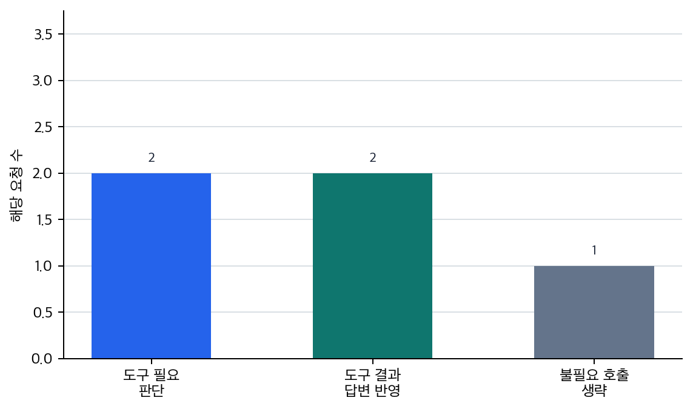

# P6-12.1 도구 사용(tool use)

Section ID: `P6-12.1`
Version: `v2026.07.19`

P6-11.2에서는 벡터 검색에서 인덱스가 검색 속도와 품질의 균형을 만드는 구조라는 점을 보았습니다. 하지만 검색은 외부 세계와 연결되는 한 가지 방식일 뿐입니다. 이제 더 넓은 질문이 나옵니다.

모델이 문서를 읽는 것을 넘어, 외부 기능을 실제로 호출해야 한다면 어떻게 해야 하는가?

Part 6에서 `도구 사용(tool use)`, `모델 밖 기능과의 연결`, `검색과 실행의 차이`에 대한 첫 상세 설명은 이 절에서 잡습니다. 뒤 절에서는 현재 맥락에 필요한 최소 설명만 남기고, 외부 기능 연결의 기본 뜻은 이 절과 개념사전을 기준으로 다시 연결합니다.

도구 사용(tool use)은 모델이 텍스트만 생성하는 데서 멈추지 않고, 계산기, 검색기, 데이터베이스, API 같은 외부 기능을 연결해 쓰는 구조다.

## 실행 연결 필요가 다루는 질문

이 절에서 먼저 붙잡을 질문은 다음과 같습니다.

- 도구 사용은 왜 필요한가?
- RAG와 도구 사용은 무엇이 다른가?
- 어떤 상황에서 모델 단독 답변보다 도구 호출이 더 적합한가?

이 절에서는 도구 사용을 `모델이 외부 기능과 실제로 연결되는 실행 구조`로 먼저 닫고, RAG의 문서 읽기와 무엇이 다른지를 붙잡는 데 집중합니다.

대신 이번 절에서 바로 더 구체화할 질문도 분명합니다. 구조화된 호출 형식은 바로 다음 P6-12.2 함수 호출에서 다시 회수합니다. 여러 단계 반복 구조는 P6-13.1 에이전트와 P6-13.2 계획, 행동, 관찰에서 다시 다루며, 권한과 운영 문제는 P6-14.2 하네스와 P6-16.2 운영 중 실패 대응에서 이어집니다.

이 절에서는 tool use를 `모델이 갑자기 실행 능력을 가진다`는 식으로 보지 않고, `애플리케이션이 모델과 외부 기능을 연결하는 구조`로 읽습니다.

앞의 RAG가 외부 문서를 읽어 근거를 붙이는 구조였다면, 여기서는 외부 기능을 실제로 호출해 결과를 가져오는 구조로 한 단계 더 나아갑니다. 이 절 다음의 함수 호출, agent, 하네스는 모두 이 실행 연결을 더 구조화하고 기록 가능하게 만드는 방향으로 이어집니다.

도구 이름을 많이 외우기보다 `지금 필요한 것이 문서 읽기인가 실제 실행인가`, `무엇을 조회하거나 계산하거나 실행해야 하는가`, `그 실행 결과를 바로 다음 장에서 어떤 호출 구조로 넘길 것인가`라는 세 질문으로 먼저 읽으면 됩니다.

후반 실행 구조를 같은 질문으로 다시 고정하면, 지금 장의 역할은 아래처럼 압축할 수 있습니다.

| 지금 부족한 것 | 이번 장이 붙이는 구조 | 아직 남는 문제 | 바로 이어지는 위치 |
| --- | --- | --- | --- |
| 문서를 읽는 것만으로는 최신 상태 조회, 계산, 파일 수정 같은 작업을 끝낼 수 없다 | 외부 기능을 실제로 호출하는 실행 연결 구조 | 호출 이름과 인자를 어떻게 검증 가능한 형식으로 만들지, 여러 호출을 어떤 순서로 이어 갈지는 아직 남아 있다 | P6-12.2, P6-13.1 |

| 지금 단계의 관점 | 바로 다음에 이어질 질문 | 뒤에서 본격적으로 다시 읽는 위치 |
| --- | --- | --- |
| RAG 근거 연결 | 무엇을 근거로 답할까? | P6-10.1, P6-10.2, P6-11.1, P6-11.2 |
| tool use 실행 연결 | 무엇을 실제로 조회하거나 실행할까? | P6-12.1 |
| agent 목표 흐름 | 읽기와 실행을 어떤 순서로 이어 갈까? | P6-13 |

여기서는 `도구 사용(tool use)`을 `모델이 스스로 실행한다`는 인상보다 `애플리케이션이 외부 기능을 연결해 실제 결과를 가져오는 구조`로 읽는 기준을 잡습니다.

즉, 지금 장의 핵심은 `문서를 읽는가`에서 `외부 기능으로 실제 결과를 가져오는가`로 관점이 바뀌는 데 있습니다. 바로 다음 P6-12.2에서는 실행 요청의 이름과 인자 구조를 보고, P6-13에서는 여러 실행과 읽기의 순서를 봅니다.

이 단계에서 먼저 남겨야 할 기록은 무엇을 실행하려 했고 실제로 어떤 값이 돌아왔는지를 보여 주는 호출 이름, 인자, 실행 결과와, 실행을 바로 진행해도 되는지와 어디서 멈췄는지를 보여 주는 승인 여부와 실패 이유입니다. 이 기록이 있어야 추측 답변과 실행 결과를 구분하고, 권한 문제와 운영 실패를 다시 볼 수 있습니다. 뒤로 갈수록 이 기록은 P6-12.2의 함수 호출 형식, P6-14.2의 trace/log와 승인 기록, P6-16.2의 실패 대응에서 다시 읽힙니다.

## 여기서 남겨야 할 구분

- 도구 사용을 입문 수준에서 설명할 수 있습니다.
- RAG와 도구 사용의 차이를 말할 수 있습니다.
- 계산, 조회, 실행 같은 작업에서 왜 도구가 필요한지 설명할 수 있습니다.
- 다음 절의 함수 호출(function calling) 구조로 자연스럽게 넘어갈 수 있습니다.

이 절에서 먼저 가를 장면은 아래처럼 정리할 수 있습니다.

| 먼저 보인 막힘 | 먼저 떠올릴 질문 | 왜 이 질문이 먼저 필요한가 |
| --- | --- | --- |
| 관련 규정은 읽었는데 지금 상태값은 아직 모른다 | 문서 읽기보다 실시간 조회가 먼저 필요한가? | 현재 값이 없으면 설명은 자연스러워도 실제 상태와 어긋난 답이 되기 쉽기 때문입니다. |
| 설명은 가능하지만 숫자 정확도가 핵심이다 | 추정 대신 계산 도구 결과를 먼저 가져와야 하는가? | 계산은 말투보다 수치 정확성이 먼저라서, 추측 답변으로는 바로 틀어질 수 있기 때문입니다. |
| 실행 결과가 있어야 답이 닫히는데 아직 행동은 하지 않았다 | 실제 실행 도구를 호출해야 질문이 끝나는가? | 파일 수정, 예약, 전송처럼 외부 세계를 바꾸는 작업은 설명만으로 완료되지 않기 때문입니다. |
| 문서를 읽을지, 도구를 부를지, 둘을 함께 쓸지 헷갈린다 | 지금 필요한 것이 근거 문서인가, 조회값인가, 실행 결과인가? | 읽기와 실행을 섞어 보면 RAG로 닫힐 질문과 tool use가 필요한 질문을 잘못 고르기 쉽기 때문입니다. |

이 표를 먼저 붙잡고 아래 내용을 읽으면, tool use를 `도구 이름 모음`보다 `문서 읽기에서 실제 조회·계산·실행으로 넘어가는 기준`으로 더 직접 읽을 수 있습니다.

## 왜 도구 사용이 필요한가

LLM은 텍스트 생성에 강하지만, 다음과 같은 작업은 모델 단독으로 처리하기 어렵거나 위험할 수 있습니다.

| 질문 | 짧은 답 |
| --- | --- |
| 왜 도구가 필요한가? | 말만으로는 정확한 계산, 조회, 실행이 어렵기 때문에 |
| 무엇이 추가되는가? | 외부 기능 호출 단계 |
| 그래서 바뀌는 것은 무엇인가? | 답을 추측하는 대신 실제 결과를 가져오는 구조 |

- 정확한 계산
- 데이터베이스 조회
- 일정 예약
- 이메일 전송
- 파일 읽기와 수정
- 실시간 API 호출

이런 작업은 단순히 `답처럼 보이는 문장`을 만드는 것과 다릅니다. 실제로 외부 세계에 영향을 주거나, 검증 가능한 결과를 가져와야 합니다.

따라서 도구 사용은 보통 다음 목적 때문에 등장합니다.

- 모델의 약한 계산 능력을 보완하기 위해
- 실시간 정보에 접근하기 위해
- 실제 시스템 동작으로 이어지게 하기 위해

서비스 구조 관점으로 다시 말하면, RAG가 `근거 문서 읽기`를 붙였다면 tool use는 `실제 기능 실행`을 붙이는 단계입니다.

## RAG와 무엇이 다른가

이 차이를 먼저 분리해 두어야 지금 필요한 것이 `문서 근거 추가`인지 `실제 기능 실행`인지 구조를 잘못 고르지 않게 됩니다.

| 구조 | 중심 역할 |
| --- | --- |
| RAG | 관련 문서를 찾아서 답변 근거로 붙인다 |
| 도구 사용(tool use) | 외부 기능을 호출해 실제 결과를 가져오거나 실행한다 |

예를 들어:

- 문서 검색 후 설명하는 것은 RAG에 가깝습니다
- 환율 API를 호출해 최신 값을 가져오는 것은 도구 사용에 가깝습니다
- 계산기로 정확한 합계를 구하는 것도 도구 사용에 가깝습니다

즉, RAG는 주로 `읽기(read)` 중심이고, tool use는 `조회(query)`, `계산(compute)`, `실행(act)`까지 포함하는 더 넓은 구조입니다.

이 차이를 현재 Part 6 본류 기준으로 가장 짧게 압축하면 다음과 같습니다.

| 구조 | 먼저 붙는 것 | 중심 질문 | 대표 결과 |
| --- | --- | --- | --- |
| RAG | 관련 문서 | 무엇을 근거로 답할까? | 문서 근거가 붙은 답변 |
| 도구 사용(tool use) | 외부 기능 호출 | 무엇을 실제로 조회하거나 실행할까? | 계산값, 조회값, 실행 결과 |
| agent | 여러 단계 연결 | 어떤 순서로 계속 진행할까? | 상태를 갱신하며 이어지는 작업 흐름 |

이 표의 핵심은 `문서를 읽는 일`, `기능을 실행하는 일`, `여러 단계를 이어 가는 일`이 서로 다른 층위라는 점입니다. 그래서 RAG 위에 tool use가 붙을 수 있고, 그 둘을 다시 agent가 하나의 목표 흐름으로 묶을 수 있습니다.

여기까지는 아직 `요청 하나에 대해 어떤 외부 기능을 붙일 것인가`를 읽는 단계입니다. 다음 장 P6-13부터는 이 호출들이 한 번으로 끝나지 않을 때, 어떤 순서로 이어 가고 언제 멈추거나 다시 계획할지를 읽는 `목표 흐름 층위`로 넘어갑니다.

같은 사용자 요청도 어디에서 구조가 갈리는지 나란히 보면 더 빨리 잡힙니다.

| 사용자 질문 장면 | RAG로 먼저 닫히는가 | tool use가 바로 필요한가 | agent까지 넘어가는가 | 경계가 갈리는 이유 |
| --- | --- | --- | --- | --- |
| `사내 환불 규정을 요약해 줘` | 그렇다 | 보통 아니다 | 보통 아니다 | 먼저 필요한 일은 최신 문서를 읽고 근거를 붙이는 것이기 때문입니다. |
| `지금 환율로 300달러를 원화로 계산해 줘` | 아니다 | 그렇다 | 보통 아니다 | 문서 설명보다 현재 값 조회와 정확한 계산이 먼저 필요하기 때문입니다. |
| `최신 환불 규정을 찾아 요약하고, 고객 답변 초안까지 만들어 줘` | 부분적으로 그렇다 | 경우에 따라 그렇다 | 그렇다 | 검색, 읽기, 초안 작성, 추가 확인이 여러 단계로 이어질 수 있기 때문입니다. |
| `내일 비어 있는 회의실을 찾아 예약까지 해 줘` | 아니다 | 그렇다 | 그렇다 | 상태 조회와 실제 예약 실행이 이어지고, 중간 결과에 따라 다음 행동이 바뀌기 때문입니다. |

즉, RAG는 `무엇을 읽을까`를 먼저 닫고, tool use는 `무엇을 실행할까`를 먼저 닫으며, agent는 그 읽기와 실행이 한 번에 끝나지 않을 때 `어떤 순서로 계속 이어 갈까`를 중심 문제로 바꿉니다.

Chapter 10~14의 최소 차이는 아래 표처럼 다시 고정할 수 있습니다.

| 지금 읽는 장 | 가장 먼저 붙잡을 질문 | 바로 다음 장으로 넘어갈 때 바뀌는 중심 |
| --- | --- | --- |
| RAG | 무엇을 근거로 답할까? | 문서를 읽는 것을 넘어 무엇을 실제로 실행할까 |
| tool use | 무엇을 실제로 조회하거나 실행할까? | 그 실행 요청을 어떤 이름과 인자 구조로 넘길까 |
| function calling | 실행 요청을 어떻게 검증 가능한 구조로 만들까? | 여러 실행과 읽기를 어떤 목표 순서로 이어 갈까 |
| agent | 여러 실행과 읽기를 어떤 목표 흐름으로 이어 갈까? | 그 흐름을 어떤 공통 연결 형식과 실행 기록 안에 둘까 |

## 모델이 직접 도구를 쓰는가

여기서 `모델이 스스로 API를 때리는가?`라는 오해를 하곤 합니다. 더 안전한 설명은 다음입니다.

`모델은 보통 어떤 도구가 필요할지에 대한 출력을 만들고, 실제 호출은 애플리케이션이나 실행 환경이 맡는다.`

즉, 도구 사용은:

- 모델이 요청 구조를 제안하고
- 시스템이 그 요청을 해석해
- 실제 도구를 호출하고
- 그 결과를 다시 모델이나 사용자에게 연결하는

협업 구조에 가깝습니다.

여기서 `모델이 어떤 실행을 제안하는가`와 `시스템이 그것을 실제로 수행하는가`를 분리해서 봐야, 실패가 판단 단계 문제인지 실행 단계 문제인지 나눌 수 있습니다.

## 어떤 상황에서 특히 유용한가

도구 사용은 다음 상황에서 매우 실용적입니다.

- 숫자 계산이 정확해야 할 때
- 최신 외부 시스템 조회가 필요할 때
- 파일이나 데이터 조작이 필요할 때
- 실행 결과를 다시 요약해야 할 때

`도구 사용은 모델이 잘 말하는 능력과, 시스템이 실제로 하는 능력을 연결하는 구조다.`

같은 요청 흐름으로 다시 정리하면 다음과 같습니다.

- 프롬프트: 질문 방식 조정
- RAG: 답하기 전 근거 문서 연결
- 도구 사용: 답하기 전 또는 답하는 중 실제 기능 호출

## 도구 사용도 만능은 아니다

도구 사용이 있다고 해서:

- 항상 올바른 도구를 고르는 것
- 필요한 인자를 정확히 구성하는 것
- 권한 없는 작업을 자동으로 막는 것
- 잘못된 실행 결과를 스스로 모두 교정하는 것

이 자동 보장되지는 않습니다.

즉, 도구 사용은 능력을 넓히지만, 동시에 다음 문제가 생깁니다.

- 권한(permission)
- 승인(approval)
- 실패 처리(error handling)
- 로그(trace)
- 재현성(reproducibility)

이 문제들은 뒤 장의 에이전트와 하네스(harness) 구조로 이어집니다.

## 아주 단순하게 그리면

```mermaid
--8<-- "assets/part-06/chapter-12/p6-c12-s01-diagram-01-ko.mmd"
```

## 사례 및 예시

### 사례 1. 계산기 도구

사용자가 `13.7%를 세 번 연속 할인하면 최종 가격이 얼마인가요?`라고 묻는다고 해 봅시다. 사람은 설명을 잘하는 모델이면 계산도 비슷하게 잘할 것이라고 느끼기 쉽습니다. 하지만 긴 계산 과정에서는 중간 곱셈이나 반올림에서 작은 산술 오류가 바로 생길 수 있습니다. 예를 들어 할인율을 단순 합산해 버리면 말은 그럴듯해도 결과가 바로 틀어집니다. 이때 중요한 것은 더 그럴듯한 설명이 아니라 정확한 계산 결과입니다. 계산이 조금만 틀려도 할인 금액, 세금, 최종 청구액까지 연쇄적으로 어긋날 수 있습니다. 여기서 바뀌는 점은 `설명을 잘하는가`를 먼저 보던 기준에서 `정확한 계산은 외부 계산 도구로 확인하는가`를 먼저 보게 되는 기준으로 이동한다는 것입니다. 도구 사용 구조가 있으면 모델은 직접 숫자를 짐작하기보다 계산기 도구를 호출해 결과를 받아 설명할 수 있습니다. 그래서 이 사례에서 확인해야 할 결과는 설명 말투가 아니라 최종 수치와 중간 계산이 일치하는가입니다.

같은 질문이라도 아래처럼 판단 기준이 달라집니다.

| 질문 장면 | 설명만 볼 때 생기기 쉬운 오판 | 도구 사용 관점에서 먼저 확인할 것 |
| --- | --- | --- |
| 연속 할인 계산 | 설명이 단계적이니 결과도 맞을 것 같음 | 중간 곱셈과 반올림이 실제 계산 결과와 일치하는가 |
| 세금 포함 최종가 계산 | 결론 숫자만 그럴듯하면 통과시키기 쉬움 | 세전·세후 값과 적용 순서가 모두 계산 도구 결과와 맞는가 |
| 환율/할인/수수료가 섞인 계산 | 장문 reasoning이 있으면 더 신뢰하기 쉬움 | 최종 수치뿐 아니라 각 단계 숫자도 외부 계산 결과로 검증됐는가 |

이 표에서 넘어가야 할 오해는 `설명이 좋아 보이면 계산도 거의 맞다`는 기대입니다. 계산기 도구 사례의 핵심은 설명과 계산을 분리하고, 계산 쪽은 별도 실행 결과를 먼저 붙잡는 데 있습니다.

### 사례 2. 일정 조회

사용자가 `내일 오후 비어 있는 회의실이 있나요?`라고 묻는 장면을 생각해 볼 수 있습니다. 사람은 먼저 관련 안내 문서나 일반 규칙을 떠올리기 쉽지만, 이 질문은 정책 문서를 검색한다고 해결되지 않고 현재 일정 시스템의 실제 상태를 조회해야 닫힙니다. 예를 들어 예약 규칙은 문서에 있어도, 지금 3층 회의실이 실제로 비어 있는지는 문서가 아니라 캘린더 상태값에 들어 있습니다. 사람이 여기서 먼저 구분해야 하는 것은 `문서 지식이 필요한가`가 아니라 `실시간 상태 값이 필요한가`입니다. 만약 조회 없이 일반 규칙만 답하면, 사용자는 실제로는 이미 예약된 회의실을 비어 있다고 오해할 수 있습니다. 반대로 캘린더 도구를 조회하면 `3층 소회의실 A는 비어 있고, B는 15:00~16:00 예약됨`처럼 현재 시점 기준 결과가 바로 돌아올 수 있습니다. 여기서 바뀌는 점은 `규칙을 알고 있는가`에서 `현재 상태를 실제로 조회했는가`로 기준이 이동한다는 것입니다. 도구 사용 구조가 있으면 모델은 캘린더나 예약 시스템을 조회한 뒤 그 결과를 바탕으로 답할 수 있습니다. 그래서 이 사례에서 확인해야 할 결과는 답변이 일반 규칙 요약이 아니라, 실제 비어 있는 회의실 목록이나 불가 상태를 현재 시점 기준으로 돌려주는가입니다.

이 차이를 운영 메모처럼 줄이면 다음과 같습니다.

| 사용자 질문 | 문서 설명만으로 닫히는가 | 실제로 조회해야 하는 대상 |
| --- | --- | --- |
| `회의실 예약 규칙이 뭐예요?` | 대체로 가능 | 규칙 문서 |
| `내일 오후 3층 회의실이 비었나요?` | 불가 | 캘린더의 현재 예약 상태 |
| `A회의실이 비면 바로 예약해 줘` | 설명만으로는 더 부족함 | 상태 조회 + 실행 도구 |

이 사례에서 붙잡아야 할 기준은 `관련 정보를 알고 있는가`보다 `지금 필요한 정보가 문서 안에 있는가, 시스템 상태 안에 있는가`입니다. 일정 조회 사례는 바로 이 분기에서 도구 사용 필요가 결정된다는 점을 보여 줍니다.

### 사례 3. 파일 수정

코드 도우미가 `이 함수 이름을 새 규칙에 맞게 바꿔 주세요`라는 요청을 받는다고 해 봅시다. 사람은 종종 `어떻게 바꿀지 설명만 해도 충분하겠지`라고 생각하기 쉽지만, 실제 파일은 그 설명만으로 달라지지 않습니다. 더구나 함수 이름 하나를 바꾸면 선언부, 호출부, 테스트 코드까지 같이 찾아 수정해야 할 수 있습니다. 예를 들어 선언부만 바꾸고 테스트 호출부를 놓치면 답변은 그럴듯해도 저장소는 바로 깨집니다. 이 경우 필요한 것은 설명 능력보다 파일을 읽고 수정하고 저장하는 실행 능력입니다. 실제 수정 없이 설명만 남기면 사용자는 다시 수동 작업을 해야 하고, 중간 누락이 생길 가능성도 커집니다. 여기서 바뀌는 점은 `수정 방법을 설명하는가`에서 `실제 파일 상태를 바꾸고 연결된 위치까지 함께 수정하는가`로 기준이 이동한다는 것입니다. 도구 사용 구조가 있으면 모델은 수정 제안에 머무르지 않고 실제 파일 작업 도구를 호출할 수 있습니다. 그래서 이 사례에서 확인해야 할 결과는 설명문이 아니라 선언부, 호출부, 테스트가 함께 바뀌고 저장소가 계속 동작하는가입니다.

이 도식의 핵심은 모델이 혼자 끝내는 것이 아니라, 외부 시스템과 왕복이 생긴다는 점입니다.

세 사례를 한 줄로 묶으면 다음과 같습니다.

| 상황 | 도구 사용이 필요한 이유 |
| --- | --- |
| 계산 | 추정이 아니라 정확한 수치가 필요해서 |
| 일정 조회 | 실제 시스템 상태를 확인해야 해서 |
| 파일 수정 | 실행 가능한 작업 결과를 만들어야 해서 |

세 사례를 실행 판단 기준으로 다시 묶으면 다음과 같습니다.

| 상황 | 모델 설명만으로는 부족한 것 | 실제로 확인하거나 바꿔야 하는 대상 |
| --- | --- | --- |
| 계산기 도구 | 숫자를 그럴듯하게 말하는 것 | 정확한 계산 결과 |
| 일정 조회 | 예약 규칙을 설명하는 것 | 현재 시점의 실제 일정 상태 |
| 파일 수정 | 수정 방법을 말로 설명하는 것 | 실제 파일 내용과 연결 위치 |

같은 내용을 실행 위임 구조로 다시 보면 다음처럼 읽을 수 있습니다.

```mermaid
--8<-- "assets/part-06/chapter-12/p6-c12-s01-diagram-02-ko.mmd"
```

핵심은 `답변` 전에 `실행 준비 구조`가 따로 생긴다는 점입니다.

## 바로 적용해 보면

도구 사용을 처음 읽을 때 가장 자주 헷갈리는 것은 `외부 정보가 필요하다`는 말을 모두 같은 문제로 보는 점입니다. 하지만 실제로는 `문서를 읽으면 되는가`, `현재 상태를 조회해야 하는가`, `실제로 뭔가를 바꿔야 하는가`를 먼저 갈라야 다음 구조가 맞아집니다.

| 이런 장면이 보이면 | 먼저 확인할 것 | 왜 그 분리가 중요한가 |
| --- | --- | --- |
| 규정이나 매뉴얼을 설명하면 될 것 같음 | 문서 근거만으로 닫히는 질문인가 | 현재 상태 조회나 실행이 필요 없으면 RAG 쪽이 먼저 맞기 때문입니다. |
| 할인율, 세금, 환율처럼 숫자 정확도가 바로 결과를 바꿈 | 추정 문장 대신 실제 계산값을 가져와야 하는가 | 설명이 자연스러워도 계산은 쉽게 틀릴 수 있어, 외부 계산 결과를 먼저 붙잡아야 하기 때문입니다. |
| 지금 비어 있는 회의실, 현재 환율처럼 시점 값이 중요함 | 실시간 상태 조회가 필요한가 | 문서 설명이 아니라 현재 시스템 값이 답의 출발점이기 때문입니다. |
| 파일 수정, 예약 생성처럼 세계 상태를 바꿔야 함 | 실제 실행과 승인 구조가 필요한가 | 설명만으로는 작업이 끝나지 않고, 권한과 실패 처리까지 함께 따라오기 때문입니다. |

같은 기준을 더 짧은 실무 질문으로 바꾸면 다음처럼 읽을 수 있습니다.

| 이런 의심이 들면 | 먼저 던질 질문 |
| --- | --- |
| `이건 문서만 읽어도 답할 수 있나?` | 필요한 것이 규정 설명인가, 현재 값 조회인가? |
| `설명은 그럴듯한데 숫자가 맞는지 불안하다` | 추정 대신 계산 도구 결과를 먼저 가져와야 하는가? |
| `답은 할 수 있겠지만 믿기 어렵다` | 추정 문장 대신 실제 조회값이나 계산값을 가져와야 하는가? |
| `설명은 충분한데 작업은 아직 안 끝났다` | 실제 파일·예약·상태를 바꾸는 실행 단계가 필요한가? |

이 절에서 먼저 익혀야 하는 기준은 단순합니다. tool use는 `외부 정보를 더 붙이는 방법`이 아니라, `조회`, `계산`, `실행`처럼 문서 읽기 밖의 결과를 실제로 가져오거나 발생시키는 연결 구조입니다.

## 연습 및 예제

이번 예제의 목표는 실제 외부 API를 붙이는 것이 아니라, `사용자 요청`, `도구 필요 판단`, `도구 호출 계획`, `도구 실행 결과`, `최종 답변`이 서로 다른 단계라는 점을 눈으로 확인하는 것입니다. 한 요청만 보면 `환율 조회 = 도구 필요` 정도로 끝나기 쉬우므로, 이번에는 여러 요청을 한 번에 돌려 어떤 요청에서만 도구가 필요한지도 같이 보겠습니다.

어떤 요청은 실시간 조회가 필요해 도구를 써야 하고, 어떤 요청은 일반 설명이므로 도구 없이도 답할 수 있습니다. 따라서 먼저 `도구가 필요한가`를 판단하고, 필요한 경우에만 호출 계획을 만든 뒤 실행 결과를 받아야 합니다.

아래 예제는 사용자 요청 여러 개, 도구 선택 규칙, 도구가 돌려주는 조회 결과를 사용합니다. 출력에서는 요청별 도구 필요 판단, 도구 호출 구조, 실행 결과, 실행 결과를 반영한 최종 답변, 도구 호출이 실제로 필요한 요청을 잘 가려냈는지에 대한 점검값을 확인합니다.

먼저 이 예제에서 같이 볼 항목을 표로 정리하면 다음과 같습니다.

| 점검 항목 | 왜 필요한가 |
| --- | --- |
| `needs_tool` | 어떤 요청이 실행 단계로 넘어가야 하는지 판단 |
| `tool_selected` | 필요한 기능을 맞게 골랐는지 확인 |
| `tool_result_used` | 실제 실행 결과가 최종 답에 반영됐는지 확인 |
| `skipped_tool_when_not_needed` | 도구가 필요 없는 요청에 불필요한 호출을 하지 않는지 확인 |

코드에서 확인할 핵심은 도구 사용에서는 먼저 호출 필요 여부를 판별하고, 호출했다면 실행 결과가 최종 답에 반영되어야 한다는 점입니다.

```python
requests = [
    "오늘 서울 기준 USD 환율을 알려 주세요.",
    "환율 API를 조회한 뒤 기준 시각도 함께 알려 주세요.",
    "환율이 무엇인지 한 문단으로 설명해 주세요.",
]

def plan_tool_call(request):
    if "환율" in request and ("오늘" in request or "조회" in request):
        return {
            "tool": "exchange_rate_lookup",
            "arguments": {
                "base_currency": "USD",
                "quote_currency": "KRW",
                "region": "Seoul",
                "date": "today",
            },
        }
    return None

def execute_tool(tool_call):
    # 예제에서는 실제 API 대신 고정된 조회 결과를 돌려줍니다.
    if tool_call["tool"] == "exchange_rate_lookup":
        return {
            "base_currency": "USD",
            "quote_currency": "KRW",
            "rate": 1382.4,
            "as_of": "2026-06-30 10:00 KST",
        }
    return {"error": "unknown tool"}

def compose_final_answer(request, tool_result=None):
    if tool_result is None:
        return "환율은 한 통화가 다른 통화와 교환될 때 적용되는 비율입니다."
    return (
        f"서울 기준 오늘 USD/KRW 환율은 {tool_result['rate']}원이며, "
        f"기준 시각은 {tool_result['as_of']}입니다."
    )

reports = []
for request in requests:
    tool_call = plan_tool_call(request)
    tool_result = execute_tool(tool_call) if tool_call else None
    final_answer = compose_final_answer(request, tool_result)
    inspection = {
        "needs_tool": tool_call is not None,
        "tool_selected": tool_call["tool"] if tool_call else None,
        "tool_result_used": (
            tool_result is not None
            and str(tool_result["rate"]) in final_answer
            and tool_result["as_of"] in final_answer
        ),
        "skipped_tool_when_not_needed": tool_call is None and tool_result is None,
    }
    reports.append(
        {
            "request": request,
            "tool_call": tool_call,
            "tool_result": tool_result,
            "final_answer": final_answer,
            "inspection": inspection,
        }
    )

summary = {
    "needs_tool_count": sum(report["inspection"]["needs_tool"] for report in reports),
    "tool_result_used_count": sum(report["inspection"]["tool_result_used"] for report in reports),
    "skipped_tool_count": sum(report["inspection"]["skipped_tool_when_not_needed"] for report in reports),
    "needs_tool_ratio": round(
        sum(report["inspection"]["needs_tool"] for report in reports) / len(reports),
        2,
    ),
    "tool_result_used_ratio": round(
        sum(report["inspection"]["tool_result_used"] for report in reports) / len(reports),
        2,
    ),
    "skipped_tool_ratio": round(
        sum(report["inspection"]["skipped_tool_when_not_needed"] for report in reports) / len(reports),
        2,
    ),
}

print("[summary]")
print(summary)
print()

for report in reports:
    print("=" * 80)
    print("[user_request]")
    print(report["request"])
    print("[tool_call]")
    print(report["tool_call"])
    print("[tool_result]")
    print(report["tool_result"])
    print("[final_answer]")
    print(report["final_answer"])
    print("[inspection]")
    print(report["inspection"])
```

실행 결과 예시는 다음처럼 읽을 수 있습니다.

```text
[summary]
{'needs_tool_count': 2, 'tool_result_used_count': 2, 'skipped_tool_count': 1, 'needs_tool_ratio': 0.67, 'tool_result_used_ratio': 0.67, 'skipped_tool_ratio': 0.33}

================================================================================
[user_request]
오늘 서울 기준 USD 환율을 알려 주세요.
[tool_call]
{'tool': 'exchange_rate_lookup', 'arguments': {'base_currency': 'USD', 'quote_currency': 'KRW', 'region': 'Seoul', 'date': 'today'}}
[tool_result]
{'base_currency': 'USD', 'quote_currency': 'KRW', 'rate': 1382.4, 'as_of': '2026-06-30 10:00 KST'}
[final_answer]
서울 기준 오늘 USD/KRW 환율은 1382.4원이며, 기준 시각은 2026-06-30 10:00 KST입니다.
[inspection]
{'needs_tool': True, 'tool_selected': 'exchange_rate_lookup', 'tool_result_used': True, 'skipped_tool_when_not_needed': False}
================================================================================
[user_request]
환율 API를 조회한 뒤 기준 시각도 함께 알려 주세요.
[tool_call]
{'tool': 'exchange_rate_lookup', 'arguments': {'base_currency': 'USD', 'quote_currency': 'KRW', 'region': 'Seoul', 'date': 'today'}}
[tool_result]
{'base_currency': 'USD', 'quote_currency': 'KRW', 'rate': 1382.4, 'as_of': '2026-06-30 10:00 KST'}
[final_answer]
서울 기준 오늘 USD/KRW 환율은 1382.4원이며, 기준 시각은 2026-06-30 10:00 KST입니다.
[inspection]
{'needs_tool': True, 'tool_selected': 'exchange_rate_lookup', 'tool_result_used': True, 'skipped_tool_when_not_needed': False}
================================================================================
[user_request]
환율이 무엇인지 한 문단으로 설명해 주세요.
[tool_call]
None
[tool_result]
None
[final_answer]
환율은 한 통화가 다른 통화와 교환될 때 적용되는 비율입니다.
[inspection]
{'needs_tool': False, 'tool_selected': None, 'tool_result_used': False, 'skipped_tool_when_not_needed': True}
```

이 결과에서 먼저 봐야 할 것은 `needs_tool_count`가 2이고 `skipped_tool_count`가 1이라는 점입니다. 즉, 모든 요청을 무조건 외부 기능으로 보내는 것이 아니라, 실시간 조회가 필요한 요청에서만 도구 호출 구조가 만들어지고, 설명형 요청은 도구 없이 끝납니다. 동시에 `tool_result_used_count`가 2라는 값은, 도구를 호출했으면 그 결과가 실제 최종 답 문장에 반영되었는지도 따로 봐야 한다는 뜻입니다.

그래서 이 예제에서 확인해야 할 결과는 두 가지입니다.

- 모델 출력이 곧바로 최종 답 문장이 아니라, 외부 기능 실행을 위한 구조화된 요청이 먼저 나오고 실제 실행 결과를 받은 뒤에야 최종 답변이 만들어진다.
- tool use에서는 `도구가 필요한 요청을 골라내는 판단`과 `실행 결과를 최종 답에 반영하는 단계`를 분리해서 봐야 한다.

이 예제에서 독자가 직접 해 볼 수 있는 조정은 다음과 같습니다.

- `requests`에 `내일 도쿄 기준 JPY 환율` 같은 요청을 추가해 인자 구조를 늘려 보기
- `execute_tool`에 오류 응답을 넣어 실패 처리 흐름을 확인해 보기
- `compose_final_answer`를 바꿔 숫자뿐 아니라 출처나 경고 문구까지 함께 넣어 보기
- `plan_tool_call`에 계산 요청을 추가해 조회와 계산 도구가 함께 등장하게 만들어 보기

이 예제에서 여기서 읽어야 할 핵심은 다음입니다.

- 사용자 요청과
- 도구 필요 판단과
- 도구 호출 구조와
- 실제 실행 결과와
- 최종 답변이 분리되어 있다는 점입니다

즉, tool use는 `대답` 이전에 `실행 준비 구조`를 만들고, 실행 결과를 다시 받아 최종 답으로 연결하는 단계라고 볼 수 있습니다.

요약 통계를 차트로 보면 도구 사용의 핵심 분기가 더 분명합니다. 세 요청 중 두 요청만 도구가 필요했고, 그 두 요청에서는 도구 결과가 최종 답에 반영되었습니다. 나머지 설명형 요청은 도구 호출을 생략했으므로, tool use는 모든 요청을 외부 기능으로 보내는 일이 아니라 실행이 필요한 요청을 먼저 가르는 구조로 읽어야 합니다.



## 이 예제를 실행 위임 관점으로 다시 보면

이 예제는 모델이 직접 모든 일을 처리하는 것이 아니라, 어떤 순간에는 `설명`보다 `실행을 위임하는 구조`가 더 중요하다는 점을 보여 줍니다. 그래서 이후 에이전트와 MCP 절을 읽을 때도 핵심은 말 잘하는 모델이 아니라, 언제 외부 기능으로 넘겨야 하는지를 판단하는 구조입니다.

## 여기까지를 한 줄로 묶으면

도구 사용의 핵심은 모델이 더 많은 사실을 아는 것이 아니라, 필요한 순간에 외부 기능으로 실행을 위임하고 그 결과를 다시 답변으로 연결하는 데 있습니다.

초기 LLM 사용 경험은 주로 `잘 말하는 모델`에 집중되어 있었습니다. 하지만 실서비스로 가면 곧 한계가 드러났습니다.

- 최신성 부족
- 계산 오류
- 실제 시스템과 단절

이 절에서 더 중요하게 붙잡아야 할 점은 `최신 문서를 읽는 일`과 `계산·조회·수정 같은 실제 기능을 실행하는 일`이 같은 문제가 아니라는 것입니다. 그래서 도구 사용은 답변을 더 길게 만드는 보강이 아니라, 프롬프트와 RAG만으로 닫히지 않는 실행 문제를 별도 연결 구조로 넘기는 단계로 읽는 편이 좋습니다.

이 구조가 중요한 이유는 다음과 같습니다.

- RAG와 도구 사용을 섞지 않게 하고
- 이후 함수 호출, 에이전트, MCP를 이해할 준비를 시키며
- `LLM은 혼자 일하지 않는다`는 서비스 구조 관점을 강화하기 때문입니다

## 체크리스트
- 도구 사용을 `모델이 스스로 실행한다`가 아니라 `애플리케이션이 외부 기능을 연결해 실제 결과를 가져오는 구조`로 설명할 수 있어야 합니다.
- RAG가 문서 근거를 붙이는 구조이고, tool use는 조회·계산·실행을 붙이는 구조라는 차이를 말할 수 있어야 합니다.
- 다음 절은 도구 사용 자체의 반복 설명이 아니라, 그 실행 요청을 어떤 이름과 인자 구조로 만들지로 질문이 더 구체화된다는 점을 잡고 있어야 합니다.

## 출처와 참고 자료

- Shunyu Yao et al., [ReAct: Synergizing Reasoning and Acting in Language Models](https://arxiv.org/abs/2210.03629){: target="_blank" rel="noopener noreferrer" }, arXiv, 2022, 확인 날짜: 2026-07-19.
- OpenAI, [Using tools](https://developers.openai.com/api/docs/guides/tools){: target="_blank" rel="noopener noreferrer" }, OpenAI API Docs, 확인 날짜: 2026-07-19.
- OpenAI, [Function calling](https://developers.openai.com/api/docs/guides/function-calling){: target="_blank" rel="noopener noreferrer" }, OpenAI API Docs, 확인 날짜: 2026-07-19.
