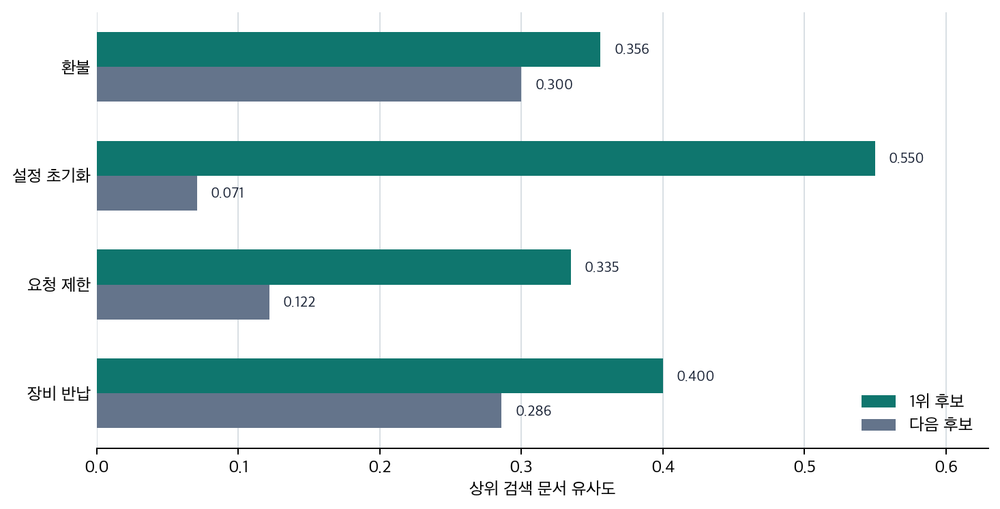

# P6-12.1 벡터 데이터베이스는 왜 원문과 메타데이터까지 함께 저장하는가

> Section ID: `P6-12.1`
> Version: `v2026.07.22`

P6-11.2에서는 검색 결과가 생성 전에 입력 맥락으로 붙는다는 점을 보았습니다. 이제 질문은 그 검색이 실제로 어떤 저장 구조 위에서 돌아가는가로 옮겨갑니다.

벡터 데이터베이스(vector database)는 임베딩(embedding) 벡터와 그에 연결된 원문, 메타데이터를 저장하고, 비슷한 벡터를 빠르게 찾도록 돕는 시스템이다.

## 검색 저장 구조가 맡는 일

핵심 질문은 다음과 같습니다.

- 왜 텍스트를 그대로 검색하지 않고 벡터를 저장하는가?
- 벡터 데이터베이스는 무엇을 저장하고 무엇을 돌려주는가?
- 왜 RAG 구조에서 벡터 데이터베이스가 자주 등장하는가?

먼저 닫을 문제는 `왜 텍스트만이 아니라 임베딩, 원문, 메타데이터를 함께 저장하는가`입니다. 벡터 데이터베이스는 `새로운 종류의 마법 저장소`가 아니라, 검색된 문서를 생성 전에 다시 쓸 수 있도록 임베딩, 원문, 메타데이터를 함께 다루는 RAG 검색 저장 구조입니다.

P6-11.2가 찾아온 문서를 답변 전에 어디에 붙일지 봤다면, 여기서는 그 문서를 검색 가능하게 어떤 저장 구조에 담아 둘지 봅니다. 그다음 P6-12.2에서는 저장된 후보를 어떤 인덱스와 검색 품질 기준으로 좁힐지 봅니다. 문서 검색을 넘어 실제 조회나 실행으로 가는 일은 뒤의 도구 사용 구간에서 별도로 다룹니다.

## 벡터, 원문, 메타데이터 저장의 구분

벡터 데이터베이스를 이해할 때는 저장되는 값을 나누어 봐야 합니다. 임베딩은 비슷한 문서를 찾기 위한 숫자 표현이고, 문서 조각(chunk)은 생성 단계가 실제로 다시 읽을 원문이며, 메타데이터(metadata)는 출처, 버전, 날짜, 범주처럼 후보를 고르고 검증할 때 쓰는 정보입니다. 이 셋을 함께 보아야 RAG에서 일반 키워드 검색만으로는 부족한 이유와, P6-12.2의 인덱스와 검색 품질 문제가 왜 따로 이어지는지 자연스럽게 연결됩니다.

먼저 가를 장면은 아래처럼 정리할 수 있습니다.

| 먼저 보인 막힘 | 먼저 떠올릴 질문 | 왜 이 질문이 먼저 필요한가 |
| --- | --- | --- |
| 문서가 있는 것 같은데 질문 표현과 문서 표현이 잘 안 맞는다 | 같은 의미 문단이 키워드가 아니라 벡터 후보로 올라오는가? | 표현이 달라도 관련 문단을 먼저 회수하지 못하면 검색이 시작도 못 하기 때문입니다. |
| 관련 문단은 찾은 것 같은데 답에 바로 붙일 근거 문장이 없다 | 반환 결과에 원문 조각이 함께 들어 있는가? | 생성 단계는 숫자 벡터가 아니라 실제 문장을 다시 써야 하기 때문입니다. |
| 맞는 문단 같지만 최신 버전인지, 어느 문서인지 판단이 안 된다 | 날짜, 버전, 출처 같은 메타데이터가 같이 돌아오는가? | 검색 후보가 보여도 출처와 최신성 판단이 안 되면 운영 답으로 쓰기 어렵기 때문입니다. |
| 후보는 여러 개 나왔는데 무엇이 더 맞는지 좁히기 어렵다 | 범주(category), 문서 ID 같은 선택 기준이 같이 붙는가? | 의미 유사도만으로 애매할 때는 메타데이터가 최종 선택 기준이 되기 때문입니다. |

이 표를 기준으로 삼으면, 벡터 데이터베이스를 `벡터만 저장하는 곳`보다 `검색 뒤에 바로 다시 쓸 원문과 메타데이터까지 함께 돌려주는 저장 구조`로 더 직접 읽을 수 있습니다.

## 왜 벡터를 저장하나

앞 절에서 보았듯, RAG는 관련 문서를 먼저 찾는 구조입니다. 그런데 질문과 문서가 항상 같은 단어를 쓰는 것은 아닙니다.

예를 들어 사용자는:

- `환불 기준이 바뀌었나요?`

라고 묻고, 문서에는:

- `반품 처리 기간 변경`

처럼 다른 표현이 있을 수 있습니다.

이런 경우 단순 키워드 검색은 놓칠 수 있지만, 의미가 비슷한 표현을 벡터 공간에서 가깝게 찾는 방식은 도움이 될 수 있습니다.

즉, 벡터 데이터베이스는 `문장을 숫자 벡터로 바꾼 뒤, 의미가 가까운 것을 빠르게 찾는 일`을 서비스 안에서 관리하기 쉽게 해 줍니다.

## 벡터 데이터베이스는 무엇을 저장하나

독자가 가장 자주 오해하는 지점은 `벡터만 저장하는가?`입니다. 실제로는 보통 다음이 함께 들어갑니다.

- 임베딩 벡터
- 원문 또는 문서 조각(chunk)
- 문서 ID
- 제목, 날짜, 출처 같은 메타데이터(metadata)

즉, 벡터 데이터베이스는 보통 `숫자 벡터만 덩그러니 모아 둔 곳`이 아니라, `검색 후 다시 원문을 꺼내 올 수 있게 연결된 저장소`로 보는 편이 맞습니다.

## 무엇을 돌려주나

질문을 임베딩으로 바꿔 검색하면, 시스템은 보통 다음을 돌려줍니다.

- 가까운 벡터 항목들
- 그 항목에 연결된 문서 조각
- 유사도 점수
- 메타데이터

그리고 RAG 파이프라인은 이 결과를 다시 프롬프트 맥락으로 붙여 생성 단계에 넘깁니다.

## 왜 RAG에서 자주 등장하나

RAG는 `질문 -> 관련 문서 검색 -> 생성` 구조입니다. 여기서 검색이 의미 기반으로 이루어지려면, 벡터 저장과 유사도 검색을 효율적으로 다루는 계층이 필요합니다.

`벡터 데이터베이스는 RAG에서 검색 단계의 실무형 저장소 역할을 한다.`

즉, 이 시스템의 역할은 모델을 대신하는 것이 아니라, 모델이 참고할 문서를 잘 찾아오도록 돕는 것입니다.

## 일반 데이터베이스와 무엇이 다른가

엄밀 비교보다 역할 차이를 먼저 잡아야 합니다.

| 저장소 관점 | 중심 질문 |
| --- | --- |
| 일반 데이터베이스 | 정확히 일치하는 키, 필드, 조건을 어떻게 찾을까? |
| 벡터 데이터베이스 | 의미가 비슷한 항목을 어떻게 가깝게 찾을까? |

물론 실제 서비스에서는 두 종류를 같이 쓰기도 합니다. 예를 들어:

- 사용자 ID나 날짜 필터는 일반 필드 검색
- 의미가 비슷한 문서 찾기는 벡터 검색

처럼 결합될 수 있습니다.

## 벡터 데이터베이스도 만능은 아니다

이 점을 같이 넣어야 `벡터 데이터베이스를 붙였다`는 사실과 `검색 품질 문제가 자동으로 해결됐다`는 판단을 섞지 않게 됩니다.

벡터 데이터베이스가 있다고 해서:

- 항상 가장 관련된 문서를 찾는 것
- 오래된 문서를 자동으로 배제하는 것
- 잘못 쪼개진 문서를 스스로 고치는 것

이 자동으로 해결되지는 않습니다.

즉, 벡터 저장 구조는 중요하지만, 문서를 어떻게 나누는지, 메타데이터를 어떻게 붙이는지, 어떤 임베딩 모델을 쓰는지도 여전히 중요합니다.

## 아주 단순하게 그리면

```mermaid
--8<-- "assets/part-06/chapter-12/p6-c12-s01-vector-store-flow-ko.mmd"
```

이 도식의 핵심은 텍스트가 먼저 벡터로 바뀌고, 검색은 그 벡터 저장소에서 일어난다는 점입니다.

## 사례 및 예시

### 사례 1. 사내 위키 검색

사내 위키에서 사용자가 `퇴사 전에 회사 노트북을 어디에 반납하나요?`라고 묻는 장면을 생각해 보겠습니다. 이런 질문에서는 먼저 `노트북 반납`이라는 표현이 그대로 들어간 문서를 찾게 되기 쉽습니다. 하지만 실제 문서 제목은 `오프보딩 절차`, `자산 회수 안내`, `퇴사 체크리스트`처럼 다를 수 있고, 핵심 문장은 본문 안의 `IT 자산은 보안팀 데스크로 회수한다`일 수 있습니다. 이때 질문에는 `반납`이 있고 문서에는 `회수`만 있어도, 업무 흐름은 사실상 같습니다. 키워드만 찾으면 사용자는 `문서가 없는 것 같다`고 오해할 수 있지만, 실제로는 표현만 다를 뿐 같은 절차를 가리킬 수 있습니다.

여기서 바뀌는 점은 `같은 단어가 있나`를 보던 기준에서 `의미가 같은 문단이 후보로 올라오는가`를 보는 기준으로 이동한다는 것입니다. 벡터 데이터베이스는 질문과 문서 조각을 의미 기반 벡터로 저장해 이런 표현 차이를 넘어서 관련 문단을 후보로 올리기 쉽게 만듭니다. 여기서 바로잡아야 할 오해는 `표현이 다르면 다른 절차일 것`이라는 감각입니다. 그래서 이 사례에서 확인해야 할 결과는 `반납`이란 단어가 없어도 `회수` 문단이 실제 후보로 올라오는가, 그리고 그 후보에 출처 메타데이터까지 함께 붙어 생성 단계로 넘길 수 있는가입니다.

### 사례 2. 제품 매뉴얼 검색

제품 매뉴얼에서 사용자가 `설정을 처음 상태로 되돌리고 싶어요`라고 묻는다고 해 봅시다. 문자열 검색만 쓰면 `처음 상태`, `되돌리기` 같은 표현이 들어간 문서부터 찾게 되기 쉽습니다. 하지만 실제 매뉴얼은 `공장 초기화`, `설정 복원`, `리셋 후 재부팅`처럼 다른 용어를 섞어 쓸 수 있고, 메뉴 경로는 본문 표 한 칸에만 들어 있을 수 있습니다. 예를 들어 검색은 개요 문단만 찾고 실제 버튼 순서가 적힌 문단을 놓칠 수 있습니다. 이 경우 사용자는 `리셋 기능은 있는 것 같은데 실제로 어디를 눌러야 하는지는 모르겠다`는 상태에 머물게 됩니다.

여기서 바뀌는 점은 `표현이 비슷한가`를 보던 기준에서 `실제로 필요한 절차 문단이 함께 후보로 올라오는가`를 보는 기준으로 이동한다는 것입니다. 벡터 데이터베이스는 이런 문서 조각을 의미가 가까운 위치에 저장해 표현 차이가 있어도 관련 후보를 더 고르게 모읍니다. 여기서 바로잡아야 할 오해는 `개요 설명을 찾았으면 절차도 곧 찾은 것`이라는 기대입니다. 그래서 이 사례에서 확인해야 할 결과는 개요 설명보다 실제 버튼 순서가 적힌 문단이 함께 후보로 올라오는가, 그리고 그 문단의 위치 정보나 범주 메타데이터도 함께 반환되는가입니다.

### 사례 3. 개발 문서 지원

개발자가 `요청 제한이 걸리면 잠깐 기다렸다 다시 보내는 옵션이 있나요?`라고 묻는다고 해 봅시다. 함수 이름이나 옵션명을 정확히 알아야 검색이 될 것이라고 먼저 생각할 수 있습니다. 하지만 질문에는 정확한 이름이 없고, 실제로는 retry나 backoff 설명이 들어 있는 API 문단을 찾아야 할 수 있습니다. 예를 들어 문서에는 `exponential backoff`와 `max_retries`만 적혀 있는데, 질문은 `잠깐 기다렸다 다시 보내기`처럼 완전히 풀어 쓸 수 있습니다. 키워드 검색만 쓰면 이름이 없는 질문에서 관련 문단이 후보에 올라오지 않을 수 있습니다.

여기서 바뀌는 점은 `정확한 옵션명을 아는가`를 보던 기준에서 `의미가 가까운 API 설명을 후보로 찾는가`를 보는 기준으로 이동한다는 것입니다. 벡터 데이터베이스는 이런 질문과 문서 조각을 의미 기반으로 가깝게 저장해 관련 API 설명을 더 잘 끌어올립니다. 여기서 바로잡아야 할 오해는 `정확한 옵션명을 모르면 검색도 거의 불가능하다`는 판단입니다. 그래서 이 사례에서 확인해야 할 결과는 정확한 옵션명을 몰라도 retry나 backoff 문단이 실제 후보로 올라오는가, 그리고 그 문단의 버전·출처 메타데이터까지 함께 반환되어 이후 생성 단계가 바로 쓸 수 있는가입니다.

세 사례를 회수 기준으로 다시 정리하면 다음과 같습니다.

| 상황 | 문자열 검색만으로는 놓치기 쉬운 것 | 벡터 검색이 회수하려는 것 |
| --- | --- | --- |
| 사내 위키 검색 | `반납`과 `회수`처럼 표현이 다른 동일 업무 문단 | 의미가 같은 오프보딩 절차 문단 |
| 제품 매뉴얼 검색 | 개요 설명 뒤에 숨은 실제 버튼 순서 문단 | 절차 수행에 필요한 핵심 단계 문단 |
| 개발 문서 지원 | 질문에 이름이 없는 retry/backoff 관련 API 설명 | 의미가 가까운 옵션·동작 설명 문단 |

같은 내용을 저장 구조 관점으로 다시 보면 다음처럼 읽을 수 있습니다.

```mermaid
--8<-- "assets/part-06/chapter-12/p6-c12-s01-vector-payload-ko.mmd"
```

핵심은 `벡터만 따로 저장`이 아니라, 검색 뒤에 생성 단계가 바로 다시 쓸 수 있게 텍스트와 메타데이터까지 연결된 레코드로 다룬다는 점입니다.

## 검색 결과가 그대로 근거가 되려면

벡터 데이터베이스를 처음 읽을 때 자주 생기는 오해는 `비슷한 문장을 찾는다`는 한 줄만 기억하고, 왜 원문과 메타데이터를 같이 붙여 두는지까지는 바로 연결하지 못하는 점입니다. 하지만 실제 RAG 점검에서는 `가까운 벡터를 찾았는가`만큼 `그 뒤에 바로 꺼내 쓸 원문과 출처가 함께 붙는가`가 중요합니다.

검색 결과가 생성 단계의 근거로 넘어가려면 최소한 세 가지가 함께 보여야 합니다.

| 검색 결과에서 볼 값 | 근거로 쓰려면 필요한 이유 |
| --- | --- |
| 유사도 점수와 후보 순위 | 어떤 조각을 먼저 읽고 어떤 조각을 보조 후보로 둘지 정해야 하기 때문입니다. |
| 원문 조각 | 생성 단계는 숫자 벡터가 아니라 실제 문장을 다시 붙여 답해야 하기 때문입니다. |
| 출처, 버전, 상태, 범주 | 후보가 현재 문서인지, 어느 자료에서 온 것인지, 어떤 필터를 적용할 수 있는지 확인해야 하기 때문입니다. |

먼저 익혀야 하는 기준은 단순합니다. 벡터 데이터베이스는 `비슷한 벡터를 찾는 곳`이면서 동시에, 그 결과를 RAG 다음 단계로 넘기기 위해 `원문`과 `메타데이터`까지 함께 되돌려주는 검색 저장 구조입니다.

## 연습 및 예제

예제의 목표는 실제 벡터 데이터베이스 엔진 전체를 구현하는 것이 아니라, `벡터`, `원문`, `메타데이터`가 함께 저장되고, 질문 벡터와의 유사도로 다시 꺼내 쓰인다는 점을 눈으로 확인하는 것입니다. 환불 정책, 설정 메뉴, SDK 제한 처리, 장비 반납처럼 다른 질문을 한 번에 돌려, 같은 저장 구조가 질문에 따라 다른 조각과 메타데이터를 다시 꺼내고, 그 결과가 생성 단계로 넘길 검색 결과 묶음으로 어떻게 이어지는지까지 비교합니다.

문서 조각들은 숫자 벡터만이 아니라 원문과 출처 정보를 함께 가져야 합니다. 질문이 들어오면 질문 벡터와 가까운 조각을 다시 찾고, 검색 후에는 원문 텍스트와 메타데이터를 함께 생성 단계에 넘겨야 합니다. 따라서 `무엇이 1위 후보인가`뿐 아니라 `어떤 출처와 범주가 같이 따라오는가`도 중요합니다.

아래 예제는 문서 조각 CSV [p6-12-vector-db-documents.csv](../../../assets/part-06/chapter-12/p6-12-vector-db-documents.csv){ .csv-preview }와 질문 CSV [p6-12-vector-db-queries.csv](../../../assets/part-06/chapter-12/p6-12-vector-db-queries.csv){ .csv-preview }를 사용합니다. 문서 파일의 한 행은 검색 저장소의 한 레코드처럼 문서 ID, 제목, 원문 조각, 출처, 범주, 버전, 상태를 담습니다. 질문 파일의 한 행은 사용자 질문을 담습니다. 출력에서는 질문별 유사도 점수, 상위 후보 문서 조각, 검색 후 다시 꺼내 쓰는 원문과 메타데이터, 생성 단계로 넘길 검색 결과 묶음을 확인합니다.

먼저 확인할 점을 표로 잡으면 다음과 같습니다.

| 점검 항목 | 왜 필요한가 |
| --- | --- |
| top-k 후보의 순위와 유사도는 어떻게 달라지는가 | 질문이 바뀌면 어떤 문서 조각을 먼저 읽게 되는지 확인 |
| 반환 결과에 원문이 포함되는가 | 생성 단계가 실제 문장을 다시 붙일 수 있어야 해서 |
| 반환 결과에 메타데이터가 포함되는가 | 출처 표기, 날짜 필터, 버전 필터에 필요해서 |
| payload 묶음에는 어떤 값이 함께 들어가는가 | 검색 결과가 생성 단계에 넘길 근거 묶음으로 충분한지 확인 |

코드에서 확인할 핵심은 벡터 데이터베이스는 유사한 문장뿐 아니라 원문과 메타데이터를 함께 반환해야 RAG 근거 저장소로 쓸 수 있다는 점입니다. 예제에서는 ChromaDB의 인메모리 컬렉션을 사용합니다. 외부 임베딩 모델 다운로드가 중심을 흐리지 않도록, 문서와 질문은 TF-IDF로 벡터화한 뒤 그 벡터를 Chroma 컬렉션에 직접 넣고 검색합니다.

```python
from pathlib import Path
import csv
from uuid import uuid4
import chromadb
from chromadb.config import Settings
from sklearn.feature_extraction.text import TfidfVectorizer

asset_dir = Path("docs/assets/part-06/chapter-12")
document_path = asset_dir / "p6-12-vector-db-documents.csv"
query_path = asset_dir / "p6-12-vector-db-queries.csv"

with document_path.open(encoding="utf-8", newline="") as file:
    documents = list(csv.DictReader(file))

with query_path.open(encoding="utf-8", newline="") as file:
    queries = list(csv.DictReader(file))

# 실제 embedding 모델 대신 TF-IDF 벡터를 사용해 검색 저장소의 반환 구조를 작게 확인합니다.
document_texts = [
    f"{document['title']} {document['text']}"
    for document in documents
]
vectorizer = TfidfVectorizer(analyzer="char_wb", ngram_range=(2, 4))
document_vectors = vectorizer.fit_transform(document_texts)

client = chromadb.Client(Settings(anonymized_telemetry=False))
collection = client.create_collection(
    name=f"p6_12_vector_payload_{uuid4().hex[:8]}",
    metadata={"hnsw:space": "cosine"},
)

collection.add(
    ids=[document["doc_id"] for document in documents],
    documents=[document["text"] for document in documents],
    embeddings=document_vectors.toarray().tolist(),
    metadatas=[
        {
            "title": document["title"],
            "source": document["source"],
            "category": document["category"],
            "version": document["version"],
            "status": document["status"],
        }
        for document in documents
    ],
)

reports = []

for query in queries:
    query_vector = vectorizer.transform([query["question"]]).toarray().tolist()
    result = collection.query(
        query_embeddings=query_vector,
        n_results=2,
        include=["documents", "metadatas", "distances"],
    )

    top_matches = [
        {
            "score": round(1 - distance, 3),
            "doc_id": doc_id,
            "title": metadata["title"],
            "text": text,
            "source": metadata["source"],
            "category": metadata["category"],
            "version": metadata["version"],
            "status": metadata["status"],
        }
        for doc_id, text, metadata, distance in zip(
            result["ids"][0],
            result["documents"][0],
            result["metadatas"][0],
            result["distances"][0],
        )
    ]

    # 생성 단계에는 숫자 벡터가 아니라 원문과 메타데이터 묶음이 넘어가야 합니다.
    retrieval_payload = [
        {
            "text": match["text"],
            "source": match["source"],
            "category": match["category"],
            "version": match["version"],
            "status": match["status"],
        }
        for match in top_matches
    ]

    reports.append(
        {
            "query_id": query["query_id"],
            "question": query["question"],
            "top_matches": top_matches,
            "retrieval_payload": retrieval_payload,
            "inspection": {
                "top1_current": top_matches[0]["status"] == "current",
                "payload_has_text": all(item["text"] for item in retrieval_payload),
                "payload_has_metadata": all(
                    item.get(key)
                    for item in retrieval_payload
                    for key in ("source", "category", "version", "status")
                ),
                "payload_count": len(retrieval_payload),
            },
        }
    )

summary = {
    "top1_current_count": sum(report["inspection"]["top1_current"] for report in reports),
    "payload_has_text_count": sum(report["inspection"]["payload_has_text"] for report in reports),
    "payload_has_metadata_count": sum(report["inspection"]["payload_has_metadata"] for report in reports),
    "returned_top1_categories": [
        report["top_matches"][0]["category"]
        for report in reports
    ],
}

print("[summary]")
print(summary)

for report in reports:
    print("=" * 80)
    print("[query]")
    print(report["query_id"], report["question"])
    print("[top matches]")
    for match in report["top_matches"]:
        print({key: match[key] for key in ("score", "doc_id", "title", "category", "source", "version", "status")})
    print("[retrieval payload]")
    print(report["retrieval_payload"])
    print("[inspection]")
    print(report["inspection"])
```

실행 결과 예시는 다음처럼 읽을 수 있습니다.

```text
[summary]
{'top1_current_count': 4, 'payload_has_text_count': 4, 'payload_has_metadata_count': 4, 'returned_top1_categories': ['refund', 'settings', 'api', 'offboarding']}

================================================================================
[query]
refund_current 환불 처리 기한이 지금은 며칠인가요
[top matches]
{'score': 0.356, 'doc_id': 'R06', 'title': '환불 문의 응대 템플릿', 'category': 'refund', 'source': 'support_playbook', 'version': '2026-02', 'status': 'current'}
{'score': 0.3, 'doc_id': 'R01', 'title': '2026 환불 정책 공지', 'category': 'refund', 'source': 'policy_notice_2026_06_29', 'version': '2026-06', 'status': 'current'}
[retrieval payload]
[{'text': '고객 환불 문의에는 접수일 처리 기한 필요 서류를 함께 안내한다', 'source': 'support_playbook', 'category': 'refund', 'version': '2026-02', 'status': 'current'}, {'text': '환불 요청 처리 기한은 접수일 기준 14일이며 적용일 이후 접수 건에 적용된다', 'source': 'policy_notice_2026_06_29', 'category': 'refund', 'version': '2026-06', 'status': 'current'}]
[inspection]
{'top1_current': True, 'payload_has_text': True, 'payload_has_metadata': True, 'payload_count': 2}
================================================================================
[query]
settings_reset 설정을 처음 상태로 되돌리려면 어디에서 하나요
[top matches]
{'score': 0.55, 'doc_id': 'S01', 'title': '설정 초기화 절차', 'category': 'settings', 'source': 'manual_v4', 'version': '2026-06', 'status': 'current'}
{'score': 0.071, 'doc_id': 'S04', 'title': '설정 복원 보관본', 'category': 'settings', 'source': 'manual_v2_archive', 'version': '2025-08', 'status': 'archived'}
[retrieval payload]
[{'text': '설정을 처음 상태로 되돌리려면 환경설정 메뉴에서 초기화 버튼을 누른 뒤 재부팅한다', 'source': 'manual_v4', 'category': 'settings', 'version': '2026-06', 'status': 'current'}, {'text': '이전 버전에서는 고급 설정 화면에서 기본값 복원을 실행했다', 'source': 'manual_v2_archive', 'category': 'settings', 'version': '2025-08', 'status': 'archived'}]
[inspection]
{'top1_current': True, 'payload_has_text': True, 'payload_has_metadata': True, 'payload_count': 2}
================================================================================
[query]
api_retry 요청 제한이 걸리면 잠깐 기다렸다 다시 보내는 옵션이 있나요
[top matches]
{'score': 0.335, 'doc_id': 'A01', 'title': 'SDK 요청 제한 재시도', 'category': 'api', 'source': 'sdk_guide_v5', 'version': '2026-06', 'status': 'current'}
{'score': 0.122, 'doc_id': 'A03', 'title': 'API 타임아웃 설정', 'category': 'api', 'source': 'sdk_reference_v5', 'version': '2026-06', 'status': 'current'}
[retrieval payload]
[{'text': '요청 제한이 발생하면 exponential backoff와 max_retries 옵션으로 재시도 간격을 조정한다', 'source': 'sdk_guide_v5', 'category': 'api', 'version': '2026-06', 'status': 'current'}, {'text': 'timeout 옵션은 요청별 제한 시간을 지정하며 재시도 횟수와 별도로 동작한다', 'source': 'sdk_reference_v5', 'category': 'api', 'version': '2026-06', 'status': 'current'}]
[inspection]
{'top1_current': True, 'payload_has_text': True, 'payload_has_metadata': True, 'payload_count': 2}
================================================================================
[query]
offboarding_asset 퇴사 전에 회사 노트북은 어디로 반납하나요
[top matches]
{'score': 0.4, 'doc_id': 'O01', 'title': '오프보딩 자산 회수', 'category': 'offboarding', 'source': 'hr_wiki_2026', 'version': '2026-06', 'status': 'current'}
{'score': 0.286, 'doc_id': 'O03', 'title': '퇴사 체크리스트', 'category': 'offboarding', 'source': 'hr_wiki_2026', 'version': '2026-06', 'status': 'current'}
[retrieval payload]
[{'text': '퇴사 전 회사 노트북과 보안 키는 보안팀 데스크로 회수한다', 'source': 'hr_wiki_2026', 'category': 'offboarding', 'version': '2026-06', 'status': 'current'}, {'text': '퇴사자는 장비 반납 예약과 문서 인수인계를 퇴사 전날까지 완료한다', 'source': 'hr_wiki_2026', 'category': 'offboarding', 'version': '2026-06', 'status': 'current'}]
[inspection]
{'top1_current': True, 'payload_has_text': True, 'payload_has_metadata': True, 'payload_count': 2}
```

이 결과에서 먼저 봐야 할 것은 `returned_top1_categories`가 질문마다 달라지고, `payload_has_text_count`, `payload_has_metadata_count`가 모두 4라는 점입니다. 즉, 벡터 데이터베이스는 가까운 숫자 항목 하나만 돌려주는 것이 아니라, 질문별로 다른 조각을 top-1로 올리고, 생성 단계가 바로 쓸 수 있는 원문과 메타데이터를 함께 돌려주는 계층으로 읽어야 합니다.

같은 결과를 질문별 검색 장면으로 다시 짧게 묶으면 다음처럼 읽을 수 있습니다.

| 질문 | 먼저 드러난 검색 성격 | 왜 이렇게 읽는가 | 생성 단계에서 바로 쓰는 것 |
| --- | --- | --- | --- |
| `refund_current` | 환불 응대 문서 회수 | 환불 범주 조각이 top-1로 올라오고 정책 공지 조각도 다음 후보로 따라오기 때문입니다. | 환불 처리 기한 안내 문장과 출처 |
| `settings_reset` | 매뉴얼 회수 | 설정 초기화 절차가 top-1로 올라오고 보관본 여부도 메타데이터로 남기 때문입니다. | 초기화 절차 문장과 버전 상태 |
| `api_retry` | SDK 가이드 회수 | 요청 제한 재시도 문서가 top-1로 올라오고 API 범주와 SDK 버전이 함께 붙기 때문입니다. | 재시도 옵션 설명과 SDK 출처 |
| `offboarding_asset` | 사내 위키 회수 | 노트북 반납 질문이 자산 회수 문단을 top-1로 올리고, 같은 범주의 체크리스트가 다음 후보로 붙기 때문입니다. | 자산 회수 문장과 HR 위키 출처 |

그래서 이 예제에서 확인해야 할 결과는 두 가지입니다.

- 임베딩 숫자만 저장하는 것이 아니라, 검색 뒤에 생성 단계가 다시 사용할 원문 텍스트와 메타데이터까지 함께 저장하고 꺼낸다.
- 같은 저장 구조라도 질문 벡터가 달라지면 상위 조각, 출처, 범주가 함께 바뀌므로, 벡터 데이터베이스는 단순 숫자 저장소가 아니라 `질문별 근거 반환 계층`이다.

이 예제에서 독자가 직접 해 볼 수 있는 조정은 다음과 같습니다.

- 질문 CSV의 `question` 표현을 바꿔 상위 문서와 유사도 점수가 어떻게 달라지는지 보기
- 질문 CSV에 새로운 질문을 추가해 다른 범주가 top-1로 올라오는지 보기
- 문서 CSV에 같은 환불 주제 조각을 더 넣어 top-k 후보 묶음이 어떻게 바뀌는지 보기
- 문서 CSV의 `status`나 `version` 값을 바꿔 검색 후 필터 기준으로 어떻게 쓸지 상상해 보기

## 저장 구조에서 함께 보존해야 할 값

앞의 예제는 벡터 데이터베이스를 구현하는 코드가 아니라, `비슷한 벡터를 찾는다`는 말 뒤에 실제로는 원문과 메타데이터까지 함께 저장하고 다시 꺼내는 계층이 있다는 점을 보여 주는 최소 장면입니다. 여기서 읽어야 할 핵심은 임베딩 숫자만으로 끝나지 않고, 검색 이후 답변 단계에 다시 쓸 정보를 함께 보존해야 한다는 점입니다. 그리고 같은 저장 구조가 질문마다 다른 출처와 범주를 다시 돌려준다는 점도 함께 중요합니다.

유사도 차트를 보면 질문마다 1위 후보와 다음 후보의 간격이 다르게 잡힙니다. 설정 초기화 질문은 1위 후보가 비교적 뚜렷하지만, 환불 질문은 응대 템플릿과 정책 공지가 함께 올라와 둘 다 확인할 여지가 있습니다. 이 차이가 있어야 검색 결과를 생성 단계로 넘길 때 어느 문서 조각을 먼저 근거로 삼고, 어떤 후보를 보조 근거로 남길지 판단할 수 있습니다. 다만 차트가 보여 주는 것은 후보 순위의 분리이고, 실제 RAG payload로 쓰려면 본문 출력처럼 원문과 메타데이터가 함께 보존되어야 합니다.



## 벡터 저장소가 함께 돌려줘야 할 것

벡터 데이터베이스는 숫자 벡터만 모아 두는 곳이 아니라, 질문과 가까운 문서 조각을 다시 찾고 그 문장과 출처 정보를 함께 생성 단계로 넘겨주는 검색 저장 계층입니다.

임베딩과 벡터 검색 자체는 LLM 이전에도 중요했습니다. 하지만 생성형 AI 서비스가 널리 퍼지면서, 이 기술은 `문서를 찾아 답변에 붙이는 구조`의 핵심 계층으로 다시 주목받게 되었습니다.

이 저장 계층이 중요한 이유는 다음과 같습니다.

- 임베딩을 추상적 수학 개념에서 서비스 저장 구조로 연결하고
- P6-12.2의 인덱스와 검색 품질 문제를 읽을 준비를 시키며
- 바로 앞의 P6-11.1, P6-11.2 RAG 흐름을 실제 저장 계층으로 다시 묶어 읽게 합니다.

여기서 잡은 관점은 다음 구간으로도 그대로 이어집니다.

- P6-12.2 인덱스와 검색 품질: 검색 속도와 후보 품질을 함께 읽는 기준
- P6-13.1 도구 사용, P6-14.1 에이전트 구조: 검색 기반 기능이 전체 시스템 안에서 어디에 놓이는지 보는 기준
- P6-16.1 LLM 평가, P6-17.1 서비스 운영 제약, P6-18.1 작은 생성형 AI 기능을 한 흐름으로 묶기: 검색 기반 기능과 도구 연결 기능을 실제 설계와 운영 판단으로 옮길 때 재사용하는 기준

## 체크리스트
- 벡터 데이터베이스를 `벡터만 담는 저장소`가 아니라 `임베딩, 원문, 메타데이터를 함께 다루는 검색 저장 구조`로 설명할 수 있어야 합니다.
- 문자열 검색과 의미 기반 검색이 왜 다르고, 왜 둘을 구분해서 생각해야 하는지 말할 수 있어야 합니다.
- P6-12.2를 저장 자체의 설명이 아니라 `저장된 후보를 얼마나 빠르고 정확하게 탐색할 것인가`의 문제로 읽을 준비가 되어 있어야 합니다.

## 출처와 참고 자료

- OpenAI, [Vector embeddings](https://developers.openai.com/api/docs/guides/embeddings){: target="_blank" rel="noopener noreferrer" }, OpenAI API Docs, 확인 날짜: 2026-07-19.
- Chroma, [Adding Data to Chroma Collections](https://docs.trychroma.com/docs/collections/add-data){: target="_blank" rel="noopener noreferrer" }, Chroma Docs, 확인 날짜: 2026-07-22. Chroma collection에 `ids`, `documents`, `metadatas`, `embeddings`를 함께 넣을 수 있음을 확인했습니다.
- Chroma, [Query and Get](https://docs.trychroma.com/docs/querying-collections/query-and-get){: target="_blank" rel="noopener noreferrer" }, Chroma Docs, 확인 날짜: 2026-07-22. `query_embeddings`로 컬렉션을 검색하고 결과에서 문서와 메타데이터를 받을 수 있음을 확인했습니다.
- Jeff Johnson, Matthijs Douze, Herve Jegou, [Billion-scale similarity search with GPUs](https://arxiv.org/abs/1702.08734){: target="_blank" rel="noopener noreferrer" }, arXiv, 2017, 확인 날짜: 2026-07-19.
- Yu A. Malkov, D. A. Yashunin, [Efficient and Robust Approximate Nearest Neighbor Search Using Hierarchical Navigable Small World Graphs](https://arxiv.org/abs/1603.09320){: target="_blank" rel="noopener noreferrer" }, arXiv, 2016, 확인 날짜: 2026-07-19.
