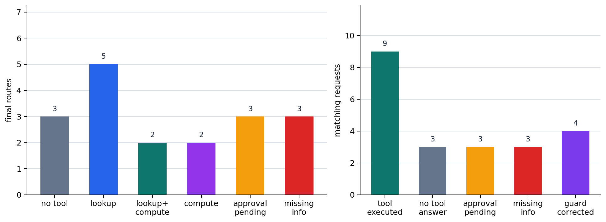

# P6-13.1 Tool Use That Hands Lookup, Computation, and Execution Outside the Model

> Section ID: `P6-13.1`
> Version: `v2026.07.23`

In P6-12.2, we saw that an index in vector retrieval creates a balance between retrieval speed and candidate quality. But retrieval is only one way to connect to the outside world. Now a broader question appears.

What should we do when the model must go beyond reading documents and actually call an external function?

Tool use is a structure in which a model does not stop at generating text, but connects to external functions such as calculators, search tools, databases, and APIs.

## Requests that need execution connection

The core questions are these.

- Why is tool use needed?
- How is RAG different from tool use?
- In what situations is a tool call more appropriate than an answer from the model alone?

The first issue to close is reading tool use as `an execution structure in which the model is connected to external functions`, and grasping how it differs from RAG's document reading.

Here we first separate `requests that only need document reading` from `requests that close only when an external function is actually called`. Splitting an execution request into a name and arguments is handled in P6-13.2, and chaining several executions is handled separately in P6-14.

Tool use does not mean `the model suddenly gains execution ability`. It means `the application connects the model with external functions`. If RAG attached external documents as evidence, tool use moves one step further by actually calling external functions and bringing back results. How to make the call name and arguments into a verifiable shape is the topic of P6-13.2, and how to continue multiple calls in sequence is the topic of P6-14.

Instead of memorizing many tool names, first read tool use through three questions: `is the needed work document reading or actual execution`, `what must be looked up, computed, or executed`, and `what call structure will carry the execution result`.

The first check at this stage is simple. We need to separate whether the answer closes with a document explanation, whether it needs a current state lookup or computation result, or whether it needs an external-world action such as reservation or modification. Once this distinction is in place, the next Section's function-call structure can be read not as a product feature name, but as a form that stabilizes execution requests.

## Separating explanation generation from actual execution connection

- You can explain tool use at an introductory level.
- You can describe the difference between RAG and tool use.
- You can explain why tools are needed for computation, lookup, and execution.
- You can explain why execution requests need to be turned into a function-calling structure.

The first scenes to separate can be summarized like this.

| First obstacle | First question to ask | Why this question comes first |
| --- | --- | --- |
| The relevant rule was read, but the current state value is still unknown. | Is live lookup needed before document reading? | Without the current value, the answer may be fluent but not match the real state. |
| An explanation is possible, but numeric accuracy is central. | Should a computation tool result be fetched instead of an estimate? | Computation needs numeric correctness before tone; guessed answers can quickly drift. |
| The answer closes only after an execution result exists, but no action has happened yet. | Does the question end only after calling an actual execution tool? | File edits, reservations, and sends are not completed by explanation alone. |
| It is unclear whether to read documents, call a tool, or use both. | Is the needed object evidence, a lookup value, or an execution result? | If reading and execution are blurred, we can choose RAG for a question that needs tool use, or the reverse. |

Using this table, tool use is easier to read not as `a list of tool names`, but as `the point where document reading moves into actual lookup, computation, and execution`.

## Why tool use is needed

LLMs are strong at text generation, but some tasks are hard or risky to handle with words alone: exact computation, lookup, and execution. What tool use adds is an external function-call step, so the structure changes from guessing an answer to fetching an actual result.

- Exact calculation
- Database lookup
- Calendar reservation
- Email sending
- File reading and editing
- Live API calls

These tasks are different from simply making `a sentence that looks like an answer`. They affect the external world or need a verifiable result.

Tool use usually appears for these purposes.

- To compensate for the model's weak arithmetic ability
- To access live information
- To connect the answer to actual system behavior

From the service-structure point of view, if RAG attaches `evidence document reading`, tool use attaches `actual function execution`.

## How it differs from RAG

We need to separate this difference first so that we do not choose the wrong structure between `adding document evidence` and `executing an actual function`.

| Structure | Central role |
| --- | --- |
| RAG | Finds related documents and attaches them as answer evidence. |
| Tool use | Calls external functions to fetch actual results or execute actions. |

For example:

- Searching documents and explaining them is closer to RAG.
- Calling an exchange-rate API to fetch the current value is closer to tool use.
- Getting an exact total from a calculator is also closer to tool use.

In short, RAG is mostly centered on `read`, while tool use is a broader structure that includes `query`, `compute`, and `act`.

Compressed to the main flow of Part 6, the difference is this.

| Structure | What is attached first | Central question | Representative result |
| --- | --- | --- | --- |
| RAG | Related documents | What should ground the answer? | An answer with document evidence |
| Tool use | External function call | What should be actually looked up or executed? | Computed value, lookup value, execution result |
| Agent | Multiple connected steps | In what order should work continue? | A workflow that updates state |

The core point of this table is that `reading documents`, `executing functions`, and `continuing multiple steps` are different levels. RAG can have tool use on top of it, and an agent can then tie the two into one goal flow.

Up to this point, we are still reading `which external function should be attached for one request`. For example, `summarize our internal refund policy` is closer to a RAG problem that first finds document evidence. `Use today's exchange rate to convert 300 dollars to KRW` is closer to a tool-use problem that needs a current value lookup and computation tool. A request such as `find and reserve an available meeting room tomorrow` connects lookup and execution, so it is revisited later in the agent structure.

In this Section, we close the move from `what should be read` to `what should actually be looked up, computed, or executed`. How to stabilize that execution request as a name and argument structure continues in P6-13.2's function calling, and how to chain multiple executions continues in P6-14's agent structure.

## Does the model directly use tools?

Here people often misunderstand the model as `calling the API by itself`. The safer explanation is this.

`The model usually produces output about which tool may be needed, and the application or execution environment performs the actual call.`

Tool use is closer to a cooperative structure:

- the model proposes a request structure
- the system interprets that request
- the system calls the actual tool
- the result is connected back to the model or the user

We need to separate `what execution the model proposes` from `what the system actually performs`, so that failures can be divided into judgment-stage problems and execution-stage problems.

## When it is especially useful

Tool use is practical in situations such as these.

- Numeric calculation must be exact.
- A live external-system lookup is needed.
- Files or data must be manipulated.
- Execution results must be summarized again.

`Tool use connects the model's ability to speak well with the system's ability to actually do things.`

The same request flow can be summarized again.

- Prompting: adjust how the question is asked
- RAG: attach evidence documents before answering
- Tool use: call actual functions before or during the answer

## Tool use is not a universal solution

Having tool use does not automatically guarantee:

- always choosing the correct tool
- constructing all required arguments accurately
- blocking unauthorized work automatically
- correcting all wrong execution results by itself

Tool use expands capability, but it also introduces these problems.

- Permission
- Approval
- Error handling
- Trace
- Reproducibility

These problems continue into later chapters on agents and harness structures.

## A minimal diagram

```mermaid
--8<-- "assets/part-06/chapter-13/p6-c13-s01-tool-use-flow-en.mmd"
```

## Cases and examples

### Case 1. Calculator tool

Suppose a user asks, `What is the final price after applying a 13.7% discount three times in a row?` It is easy to feel that a model good at explaining will also be similarly good at calculating. But in a longer calculation process, small arithmetic errors can appear in intermediate multiplication or rounding. For example, if the model simply adds the discount rates, the explanation may sound plausible while the result is immediately wrong.

What matters here is not a more plausible explanation, but an exact computation result. If the calculation is slightly wrong, the discount amount, tax, and final billed amount can all drift. The standard changes from first asking `does it explain well` to first asking `was the exact calculation checked with an external calculator`. With a tool-use structure, the model can call a calculator tool and explain the returned result instead of guessing the number itself. The result to check in this case is not tone, but whether the final number and intermediate calculation match.

Even for similar questions, the judgment standard changes like this.

| Question scene | Mistake that can arise when reading only the explanation | What to check first from the tool-use view |
| --- | --- | --- |
| Repeated discount calculation | A step-by-step explanation can make the result seem right. | Do intermediate multiplication and rounding match the actual calculator result? |
| Final price with tax | A plausible final number can be accepted too easily. | Do pre-tax value, post-tax value, and application order all match the calculator result? |
| Exchange rate, discount, and fee mixed together | Long reasoning can feel more trustworthy. | Are each step's numbers verified by an external computation result, not only the final number? |

The misunderstanding to move past in this table is the expectation that `if the explanation looks good, the calculation is probably right`. The point of the calculator-tool case is to separate explanation and calculation, and to verify the calculation side against a separate execution result.

### Case 2. Calendar lookup

Imagine a user asking, `Is there an available meeting room tomorrow afternoon?` It is natural to first think of related guidance documents or general rules, but this question is not solved by retrieving a policy document. It closes only by looking up the current state of the calendar system. For example, reservation rules may exist in a document, but whether the third-floor meeting room is currently available lives in calendar state, not in the document.

The first distinction to make is not `is document knowledge needed`, but `is a live state value needed`. If the system answers only with general rules without a lookup, the user may believe a room is available when it is already booked. If the calendar tool is queried, it can return a current result such as `Third-floor small meeting room A is available, while B is booked from 15:00 to 16:00`. The standard changes from `does it know the rule` to `did it actually look up the current state`. With tool use, the model can query the calendar or reservation system and answer from that result. The result to check is whether the answer returns actual available rooms or unavailable status as of the current point, not a summary of general rules.

Reduced to an operational memo, the difference looks like this.

| User question | Can it close with document explanation only? | What actually needs to be looked up |
| --- | --- | --- |
| `What are the meeting-room reservation rules?` | Mostly yes | Rules document |
| `Is a third-floor meeting room available tomorrow afternoon?` | No | Current calendar reservation state |
| `Reserve room A as soon as it becomes available.` | Even more than explanation is needed | State lookup + execution tool |

The standard to hold in this case is not `does the model know related information`, but `is the needed information inside a document or inside system state`. Calendar lookup shows that tool-use need is decided at exactly this branch.

### Case 3. File editing

Suppose a coding assistant receives the request, `Rename this function according to the new convention.` People sometimes think that explaining how to change it should be enough, but the actual file does not change from the explanation. Also, renaming one function can require finding and updating the declaration, call sites, and tests together. If only the declaration changes and the test call is missed, the answer may look plausible while the repository breaks immediately.

In this case, what is needed is not only explanation ability, but execution ability that reads, edits, and saves files. If only an explanation is left without the actual edit, the user must do manual work again, and omissions become more likely. The standard changes from `does it explain how to modify` to `does it actually change the file state and related locations`. With tool use, the model can call actual file-operation tools rather than stop at a modification proposal. The result to check is not the explanatory paragraph, but whether the declaration, call sites, and tests were updated together and the repository still works.

The core point of this diagram is that the model does not finish alone. There is a round trip with an external system.

The three cases can be grouped again by execution judgment.

| Situation | What model explanation alone lacks | What must actually be checked or changed |
| --- | --- | --- |
| Calculator tool | Plausibly speaking a number | Exact computation result |
| Calendar lookup | Explaining reservation rules | Current schedule state |
| File editing | Explaining how to modify | Actual file content and linked locations |

The same content can be reread as an execution-delegation structure.

```mermaid
--8<-- "assets/part-06/chapter-13/p6-c13-s01-tool-delegation-en.mmd"
```

The key point is that an `execution preparation structure` appears before the `answer`.

## Scenes that need execution connection

The most common confusion when first reading tool use is treating every case of `external information is needed` as the same problem. In practice, we first need to separate whether a document can be read, whether a current state must be queried, or whether something must actually be changed.

| If this scene appears | Check first | Why this separation matters |
| --- | --- | --- |
| It seems enough to explain a rule or manual. | Is the question closed by document evidence only? | If live lookup or execution is unnecessary, RAG is usually the first fit. |
| Numeric correctness such as discount, tax, or exchange rate changes the result. | Should an actual calculation value be fetched instead of an estimated sentence? | Computation can be wrong despite fluent explanation, so it should be checked against external computation. |
| Time-point values such as an available room or current exchange rate matter. | Is live state lookup needed? | The starting point of the answer is current system value, not document explanation. |
| World state must change, such as editing a file or creating a reservation. | Is actual execution and approval structure needed? | Explanation does not complete the work, and permission and failure handling follow. |

The same standard can be turned into shorter practical questions.

| If you suspect this | First question to ask |
| --- | --- |
| `Can this be answered by reading documents only?` | Is the needed object rule explanation or current value lookup? |
| `The explanation is plausible, but I worry the number is wrong.` | Should a computation-tool result be fetched first instead of an estimate? |
| `The answer is possible, but hard to trust.` | Should actual lookup or computation values replace guessed sentences? |
| `The explanation is enough, but the work is not done.` | Is an execution stage needed to change a file, reservation, or state? |

The standard to learn first is simple. Tool use is not `a way to attach more external information`. It is a connection structure that actually retrieves or produces results outside document reading: `lookup`, `computation`, and `execution`.

## Exercise and example

The goal of this example is not to connect a real external API. It is to visually confirm that `user request`, `tool-need judgment`, `tool-call plan`, `tool execution result`, and `final answer` are different stages. If we look at only one request, it is easy to stop at `exchange-rate lookup = tool needed`. So we run several requests together and see that some close with explanation only, while others split into lookup, computation, or execution delegation.

Some requests need a live lookup and therefore need a tool. Some are general explanations and can be answered without a tool. Some change external state, such as making a reservation, so they should stop in an approval-pending state instead of being executed immediately. Therefore, we first judge `is a tool needed`; even when a tool is needed, we separate lookup, computation, execution, and whether execution is allowed.

The example below uses a user-request CSV, a local LLM route proposal, an application guard's final judgment, tool-returned lookup and computation results, and an approval-pending state for execution. If `ollama` is installed and the model specified by `AIBOOK_OLLAMA_MODEL` is available, the model first proposes a request type. The prompt sent to the model and `model_request_en` are kept in English. This improves small local model routing stability and also makes it easier to keep the same execution standard across Korean, English, and Chinese translations. Even if the local model is unavailable or its output is unstable, the application guard finalizes the execution route, so the same code can run. In the output, we inspect the model suggestion, whether the guard corrected it, the tool-call structure, execution result, and final answer for each request.

The input CSV [p6-13-1-tool-use-requests-en.csv](../../../assets/part-06/chapter-13/p6-13-1-tool-use-requests-en.csv){ .csv-preview } contains 18 requests. `user_request_en` is the English request shown to the reader, and `model_request_en` is the English request used for model routing. `request_signal` is the minimal signal checked by the application guard before execution. This signal is not an answer key for the model, but a simplified input representing missing information, state change, or computation need that real service code must check before execution.

The first inspection items in this example are these.

| Inspection item | Why it is needed |
| --- | --- |
| `model_route` | Check what execution direction the model first proposed. |
| `guard_changed_model_route` | Check whether the application corrected the model proposal before execution. |
| `needs_tool` | Decide which requests need to move into an execution stage. |
| `tool_selected` | Check whether the required function was selected correctly. |
| `tool_result_used` | Check whether the actual execution result was reflected in the final answer. |
| `skipped_tool_when_not_needed` | Check that unnecessary tools are not called for requests that do not need one. |
| `approval_required` | Check that external state changes stop instead of being executed immediately. |
| `missing_info` | Check that missing required information is returned to the user before tool execution. |

The key point in the code is that the system does not execute immediately from the model proposal alone. It goes through a pre-execution guard that finalizes whether a call is needed and whether approval is required. If a call is made, the execution result must appear in the final answer.

```python
import csv
import os
import re
import subprocess
from pathlib import Path

CSV_PATH = Path("docs/assets/part-06/chapter-13/p6-13-1-tool-use-requests-en.csv")

with CSV_PATH.open(encoding="utf-8", newline="") as csv_file:
    requests = list(csv.DictReader(csv_file))

ROUTE_LABELS = {
    "no_tool": "general explanation",
    "lookup": "external lookup",
    "lookup_compute": "lookup then compute",
    "compute": "calculation",
    "action_pending": "execution requiring approval",
    "needs_info": "missing information",
}

OLLAMA_MODEL = os.environ.get("AIBOOK_OLLAMA_MODEL", "qwen2.5:1.5b")

def clean_ollama_output(raw):
    return re.sub(r"\x1b\[[0-?]*[ -/]*[@-~]", "", raw).strip()

def ask_ollama_for_route(request):
    prompt = f"""
Classify the request into exactly one route label.
Return only one label, with no explanation.

Labels:
- no_tool: general explanation only
- lookup: current value or external state lookup
- lookup_compute: lookup a current value and then compute from it
- compute: calculation only
- action_pending: external state change that needs approval before execution
- needs_info: missing required date, target, amount, or other execution detail

Decision rules:
- If the request asks "what is it" or asks for a concept explanation, use no_tool.
- If the request asks for today's exchange rate, use lookup.
- If the request asks to calculate money using today's exchange rate, use lookup_compute.
- If the request asks for repeated discount calculation, use compute.
- If the request asks to check room availability, use lookup.
- If the request asks to reserve, send, write, or modify something, use action_pending.
- If the request asks for an exchange rate but gives no date such as today, use needs_info.
- If the request lacks the room, amount, file, recipient, or date needed for execution, use needs_info.

Request: {request["model_request_en"]}
""".strip()

    try:
        completed = subprocess.run(
            ["ollama", "run", OLLAMA_MODEL, prompt],
            text=True,
            capture_output=True,
            timeout=45,
            check=True,
        )
    except (FileNotFoundError, subprocess.TimeoutExpired, subprocess.CalledProcessError) as error:
        return {"model_route": None, "model_raw": error.__class__.__name__}

    raw = clean_ollama_output(completed.stdout)
    route = next((token for token in re.split(r"[\s,;:]+", raw) if token in ROUTE_LABELS), None)
    if route not in ROUTE_LABELS:
        route = None
    return {"model_route": route, "model_raw": raw[:80]}

def guard_route(request):
    signal = request["request_signal"]
    if signal == "concept_only":
        return {"route": "no_tool", "guard_reason": "A concept explanation can answer this."}
    if signal in {"current_exchange_rate", "calendar_lookup", "mixed_lookup"}:
        return {"route": "lookup", "guard_reason": "A current value or external state lookup is needed."}
    if signal == "exchange_rate_conversion":
        return {"route": "lookup_compute", "guard_reason": "Today\'s exchange rate and amount calculation are both needed."}
    if signal == "pure_calculation":
        return {"route": "compute", "guard_reason": "A calculation tool can verify this without external lookup."}
    if signal == "state_change":
        return {"route": "action_pending", "guard_reason": "This request changes external state."}
    if signal in {"missing_date", "missing_target", "missing_amount"}:
        return {"route": "needs_info", "guard_reason": "Required information for tool execution is missing."}
    return {"route": "needs_info", "guard_reason": "More detail is needed to decide the route."}

def propose_route(request):
    model_hint = ask_ollama_for_route(request)
    guarded = guard_route(request)
    return {
        "route": guarded["route"],
        "route_label": ROUTE_LABELS[guarded["route"]],
        "route_source": f"app_guard_after_ollama:{OLLAMA_MODEL}",
        "guard_reason": guarded["guard_reason"],
        "model_route": model_hint["model_route"],
        "model_raw": model_hint["model_raw"],
        "guard_changed_model_route": model_hint["model_route"] != guarded["route"],
    }

def build_tool_call(request, route_proposal):
    signal = request["request_signal"]
    route = route_proposal["route"]
    base = {
        "route": route,
        "route_label": route_proposal["route_label"],
        "route_source": route_proposal["route_source"],
        "guard_reason": route_proposal["guard_reason"],
        "model_route": route_proposal["model_route"],
        "model_raw": route_proposal["model_raw"],
        "guard_changed_model_route": route_proposal["guard_changed_model_route"],
    }

    if route == "action_pending":
        return {
            **base,
            "tool": "external_action_request",
            "arguments": {"action_request": request["model_request_en"]},
            "approval_required": True,
        }
    if route == "needs_info":
        missing_by_signal = {
            "missing_date": ["date"],
            "missing_target": ["room", "date", "time"],
            "missing_amount": ["amount", "discount_rate"],
        }
        return {
            **base,
            "tool": None,
            "arguments": {},
            "missing_info": missing_by_signal.get(signal, ["required_detail"]),
            "approval_required": False,
        }
    if route == "lookup_compute":
        return {
            **base,
            "tool": "exchange_rate_lookup",
            "arguments": {"base_currency": "USD", "quote_currency": "KRW", "date": "today", "amount": 300},
            "approval_required": False,
        }
    if route == "lookup" and signal == "calendar_lookup":
        return {
            **base,
            "tool": "calendar_lookup",
            "arguments": {"floor": "third floor", "date": "tomorrow", "time": "afternoon"},
            "approval_required": False,
        }
    if route == "lookup" and signal == "mixed_lookup":
        return {
            **base,
            "tool": "combined_lookup",
            "arguments": {"queries": ["exchange_rate_lookup", "calendar_lookup"]},
            "approval_required": False,
        }
    if route == "lookup":
        return {
            **base,
            "tool": "exchange_rate_lookup",
            "arguments": {"base_currency": "USD", "quote_currency": "KRW", "date": "today"},
            "approval_required": False,
        }
    if route == "compute":
        return {
            **base,
            "tool": "discount_calculator",
            "arguments": {"discount_rate": 0.137, "repeat": 3},
            "approval_required": False,
        }
    return {**base, "tool": None, "arguments": {}, "approval_required": False}

def execute_tool(tool_call):
    # The example returns fixed results instead of calling real APIs.
    if tool_call["approval_required"] or tool_call["tool"] is None:
        return None
    if tool_call["tool"] == "exchange_rate_lookup":
        rate = 1382.4
        amount = tool_call["arguments"].get("amount")
        return {
            "rate": rate,
            "converted_krw": round(amount * rate, 1) if amount else None,
            "as_of": "2026-06-30 10:00 KST",
        }
    if tool_call["tool"] == "discount_calculator":
        remaining_ratio = (1 - tool_call["arguments"]["discount_rate"]) ** tool_call["arguments"]["repeat"]
        return {"remaining_ratio": round(remaining_ratio, 4)}
    if tool_call["tool"] == "calendar_lookup":
        return {"available_rooms": ["third-floor meeting room B"], "checked_at": "2026-06-30 10:00 KST"}
    if tool_call["tool"] == "combined_lookup":
        return {
            "rate": 1382.4,
            "available_rooms": ["third-floor meeting room B"],
            "checked_at": "2026-06-30 10:00 KST",
        }
    return {"error": "unknown tool"}

def compose_final_answer(request, tool_call, tool_result=None):
    text = request["user_request_en"]
    if tool_call["route"] == "no_tool":
        return "An exchange rate is the ratio used when one currency is exchanged for another."
    if tool_call["route"] == "needs_info":
        return "I need the lookup date. Please tell me whether this is for today or for a specific date."
    if tool_call["route"] == "action_pending":
        return "This changes an external system, so it must wait for approval before execution."
    if tool_call["tool"] == "exchange_rate_lookup" and tool_result["converted_krw"] is not None:
        return f"300 USD is {tool_result['converted_krw']} KRW. The reference time is {tool_result['as_of']}."
    if tool_call["tool"] == "exchange_rate_lookup":
        return f"Today\'s USD/KRW rate is {tool_result['rate']} KRW. The reference time is {tool_result['as_of']}."
    if tool_call["tool"] == "discount_calculator":
        return f"The remaining ratio after three discounts is {tool_result['remaining_ratio']}."
    if tool_call["tool"] == "calendar_lookup":
        return f"The available room from the lookup is {', '.join(tool_result['available_rooms'])}."
    if tool_call["tool"] == "combined_lookup":
        return f"Today\'s USD/KRW rate is {tool_result['rate']} KRW, and the available room is {', '.join(tool_result['available_rooms'])}."
    return text

def result_value_used(tool_result, final_answer):
    if tool_result is None:
        return False
    for value in tool_result.values():
        if isinstance(value, list) and any(str(item) in final_answer for item in value):
            return True
        if value is not None and not isinstance(value, list) and str(value) in final_answer:
            return True
    return False

reports = []
for request in requests:
    route_proposal = propose_route(request)
    tool_call = build_tool_call(request, route_proposal)
    tool_result = execute_tool(tool_call)
    final_answer = compose_final_answer(request, tool_call, tool_result)
    inspection = {
        "route": tool_call["route"],
        "route_source": tool_call["route_source"],
        "model_route": tool_call["model_route"],
        "guard_changed_model_route": tool_call["guard_changed_model_route"],
        "needs_tool": tool_call["tool"] is not None,
        "tool_selected": tool_call["tool"],
        "tool_executed": tool_result is not None,
        "tool_result_used": result_value_used(tool_result, final_answer),
        "skipped_tool_when_not_needed": tool_call["route"] == "no_tool" and tool_result is None,
        "approval_required": tool_call["approval_required"],
        "missing_info": tool_call["route"] == "needs_info",
    }
    reports.append(
        {
            "id": request["id"],
            "request": request,
            "tool_call": tool_call,
            "tool_result": tool_result,
            "final_answer": final_answer,
            "inspection": inspection,
        }
    )

route_counts = {}
for report in reports:
    route = report["inspection"]["route"]
    route_counts[route] = route_counts.get(route, 0) + 1

summary = {
    "needs_tool_count": sum(report["inspection"]["needs_tool"] for report in reports),
    "tool_executed_count": sum(report["inspection"]["tool_executed"] for report in reports),
    "tool_result_used_count": sum(report["inspection"]["tool_result_used"] for report in reports),
    "skipped_tool_count": sum(report["inspection"]["skipped_tool_when_not_needed"] for report in reports),
    "approval_pending_count": sum(report["inspection"]["approval_required"] for report in reports),
    "missing_info_count": sum(report["inspection"]["missing_info"] for report in reports),
    "model_hint_count": sum(report["inspection"]["model_route"] is not None for report in reports),
    "guard_changed_model_route_count": sum(report["inspection"]["guard_changed_model_route"] for report in reports),
    "route_counts": route_counts,
    "route_sources": sorted({report["inspection"]["route_source"] for report in reports}),
}

print("[summary]")
print(summary)
print()

for report in reports:
    if report["id"] not in {"R01", "R06", "R12", "R15", "R18"}:
        continue
    print("=" * 80)
    print("[request_id]")
    print(report["id"])
    print("[user_request]")
    print(report["request"]["user_request_en"])
    print("[model_request]")
    print(report["request"]["model_request_en"])
    print("[tool_call]")
    print(report["tool_call"])
    print("[tool_result]")
    print(report["tool_result"])
    print("[final_answer]")
    print(report["final_answer"])
    print("[inspection]")
    print(report["inspection"])
```

Example output can be read like this. The output below reflects an environment where the Ollama client exists but no local model server is running; the application guard still finalizes the route and makes the example reproducible.

```text
[summary]
{'needs_tool_count': 12, 'tool_executed_count': 9, 'tool_result_used_count': 9, 'skipped_tool_count': 3, 'approval_pending_count': 3, 'missing_info_count': 3, 'model_hint_count': 0, 'guard_changed_model_route_count': 18, 'route_counts': {'no_tool': 3, 'lookup': 5, 'lookup_compute': 2, 'compute': 2, 'action_pending': 3, 'needs_info': 3}, 'route_sources': ['app_guard_after_ollama:qwen2.5:1.5b']}

================================================================================
[request_id]
R01
[user_request]
Explain what an exchange rate is in one paragraph.
[model_request]
Explain what an exchange rate is in one paragraph.
[tool_call]
{'route': 'no_tool', 'route_label': 'general explanation', 'route_source': 'app_guard_after_ollama:qwen2.5:1.5b', 'guard_reason': 'A concept explanation can answer this.', 'model_route': None, 'model_raw': 'CalledProcessError', 'guard_changed_model_route': True, 'tool': None, 'arguments': {}, 'approval_required': False}
[tool_result]
None
[final_answer]
An exchange rate is the ratio used when one currency is exchanged for another.
[inspection]
{'route': 'no_tool', 'route_source': 'app_guard_after_ollama:qwen2.5:1.5b', 'model_route': None, 'guard_changed_model_route': True, 'needs_tool': False, 'tool_selected': None, 'tool_executed': False, 'tool_result_used': False, 'skipped_tool_when_not_needed': True, 'approval_required': False, 'missing_info': False}
================================================================================
[request_id]
R06
[user_request]
Using today's exchange rate, calculate how much 300 USD is in KRW.
[model_request]
Using today's exchange rate, calculate how much 300 USD is in KRW.
[tool_call]
{'route': 'lookup_compute', 'route_label': 'lookup then compute', 'route_source': 'app_guard_after_ollama:qwen2.5:1.5b', 'guard_reason': "Today's exchange rate and amount calculation are both needed.", 'model_route': None, 'model_raw': 'CalledProcessError', 'guard_changed_model_route': True, 'tool': 'exchange_rate_lookup', 'arguments': {'base_currency': 'USD', 'quote_currency': 'KRW', 'date': 'today', 'amount': 300}, 'approval_required': False}
[tool_result]
{'rate': 1382.4, 'converted_krw': 414720.0, 'as_of': '2026-06-30 10:00 KST'}
[final_answer]
300 USD is 414720.0 KRW. The reference time is 2026-06-30 10:00 KST.
[inspection]
{'route': 'lookup_compute', 'route_source': 'app_guard_after_ollama:qwen2.5:1.5b', 'model_route': None, 'guard_changed_model_route': True, 'needs_tool': True, 'tool_selected': 'exchange_rate_lookup', 'tool_executed': True, 'tool_result_used': True, 'skipped_tool_when_not_needed': False, 'approval_required': False, 'missing_info': False}
================================================================================
[request_id]
R12
[user_request]
Reserve meeting room A on the third floor for tomorrow afternoon.
[model_request]
Reserve meeting room A on the third floor for tomorrow afternoon.
[tool_call]
{'route': 'action_pending', 'route_label': 'execution requiring approval', 'route_source': 'app_guard_after_ollama:qwen2.5:1.5b', 'guard_reason': 'This request changes external state.', 'model_route': None, 'model_raw': 'CalledProcessError', 'guard_changed_model_route': True, 'tool': 'external_action_request', 'arguments': {'action_request': 'Reserve meeting room A on the third floor for tomorrow afternoon.'}, 'approval_required': True}
[tool_result]
None
[final_answer]
This changes an external system, so it must wait for approval before execution.
[inspection]
{'route': 'action_pending', 'route_source': 'app_guard_after_ollama:qwen2.5:1.5b', 'model_route': None, 'guard_changed_model_route': True, 'needs_tool': True, 'tool_selected': 'external_action_request', 'tool_executed': False, 'tool_result_used': False, 'skipped_tool_when_not_needed': False, 'approval_required': True, 'missing_info': False}
================================================================================
[request_id]
R15
[user_request]
Tell me the USD exchange rate.
[model_request]
Tell me the USD exchange rate.
[tool_call]
{'route': 'needs_info', 'route_label': 'missing information', 'route_source': 'app_guard_after_ollama:qwen2.5:1.5b', 'guard_reason': 'Required information for tool execution is missing.', 'model_route': None, 'model_raw': 'CalledProcessError', 'guard_changed_model_route': True, 'tool': None, 'arguments': {}, 'missing_info': ['date'], 'approval_required': False}
[tool_result]
None
[final_answer]
I need the lookup date. Please tell me whether this is for today or for a specific date.
[inspection]
{'route': 'needs_info', 'route_source': 'app_guard_after_ollama:qwen2.5:1.5b', 'model_route': None, 'guard_changed_model_route': True, 'needs_tool': False, 'tool_selected': None, 'tool_executed': False, 'tool_result_used': False, 'skipped_tool_when_not_needed': False, 'approval_required': False, 'missing_info': True}
================================================================================
[request_id]
R18
[user_request]
Check today's exchange rate and meeting room availability.
[model_request]
Check today's exchange rate and meeting room availability.
[tool_call]
{'route': 'lookup', 'route_label': 'external lookup', 'route_source': 'app_guard_after_ollama:qwen2.5:1.5b', 'guard_reason': 'A current value or external state lookup is needed.', 'model_route': None, 'model_raw': 'CalledProcessError', 'guard_changed_model_route': True, 'tool': 'combined_lookup', 'arguments': {'queries': ['exchange_rate_lookup', 'calendar_lookup']}, 'approval_required': False}
[tool_result]
{'rate': 1382.4, 'available_rooms': ['third-floor meeting room B'], 'checked_at': '2026-06-30 10:00 KST'}
[final_answer]
Today's USD/KRW rate is 1382.4 KRW, and the available room is third-floor meeting room B.
[inspection]
{'route': 'lookup', 'route_source': 'app_guard_after_ollama:qwen2.5:1.5b', 'model_route': None, 'guard_changed_model_route': True, 'needs_tool': True, 'tool_selected': 'combined_lookup', 'tool_executed': True, 'tool_result_used': True, 'skipped_tool_when_not_needed': False, 'approval_required': False, 'missing_info': False}
```

The first point to notice is that the final route is not decided by the model output alone. The model proposal can be absent or unstable, but the application guard still decides `no_tool`, `lookup`, `lookup_compute`, `compute`, `action_pending`, and `needs_info` before execution. The guard is not a decorative fallback. It is the structure that prevents missing information, approval-requiring state changes, and needless tool calls from moving straight into execution.

So this example should leave three results.

- Tool use begins by separating requests that can be answered with explanation only from requests that need lookup, computation, or execution.
- A model suggestion is not the same as execution; the application guard must verify the route before a tool is called.
- If a tool is called, the final answer should use the returned result, while state-changing actions should remain approval pending.

The reader can directly adjust the example in these ways.

- Change `request_signal` for one row and see how the guard route changes.
- Set `AIBOOK_OLLAMA_MODEL` to a local model and compare `model_route` with the guard route.
- Add one more `state_change` request and check that it stops with `approval_required`.
- Expand `execute_tool` with another fixed tool result and see whether `tool_result_used` catches it in the final answer.

## What changes when actual execution is connected

The example above is not a real tool integration. It is a minimal structure showing that requests must be separated into explanation, lookup, computation, execution, missing information, and approval. The key point is that the model's tool suggestion is only a proposal. The application must decide before execution whether the request has enough information, whether it changes external state, and whether a result can be safely returned.

The chart below rereads the same result as a decision check. Requests that need no tool should skip execution, lookup and computation requests should use returned values, and state-changing requests should remain approval pending. This is the point where tool use becomes a system structure rather than a prompt trick.



## What tool use connects

Tool use is a structure that connects model-generated text with the outside world. The model may propose a tool call, but the application or execution environment performs the actual call and returns a result.

This matters because:

- it separates document reading from actual lookup, computation, and execution
- it prepares us to read function calling as a structured request format in P6-13.2
- it prepares us to read agents as multi-step execution flows in P6-14

The view established here continues into later sections.

- P6-13.2 function calling: how to stabilize tool name and arguments
- P6-14.1 and P6-14.2 agents: how to connect multiple tool calls over time
- P6-16 evaluation and P6-17 operation: how to inspect execution results, approvals, failures, and traces

## Checklist

- You should be able to explain tool use as a structure for actual lookup, computation, and execution outside the model.
- You should be able to distinguish RAG's document reading from tool use's function execution.
- You should be able to say why state-changing actions need approval and why missing information should stop execution.

## Sources and references

- OpenAI, [Function calling](https://developers.openai.com/api/docs/guides/function-calling){: target="_blank" rel="noopener noreferrer" }, OpenAI API Docs, accessed: 2026-07-19.
- OpenAI, [Tools](https://developers.openai.com/api/docs/guides/tools){: target="_blank" rel="noopener noreferrer" }, OpenAI API Docs, accessed: 2026-07-19.
- OpenAI, [File search](https://developers.openai.com/api/docs/guides/tools-file-search){: target="_blank" rel="noopener noreferrer" }, OpenAI API Docs, accessed: 2026-07-19.
