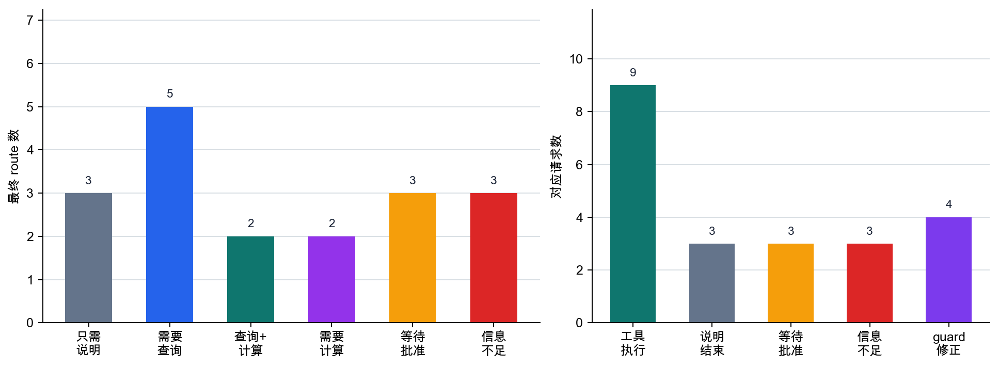

# P6-13.1 把查询、计算、执行交给模型外部的工具使用

> Section ID: `P6-13.1`
> Version: `v2026.07.23`

在 P6-12.2 中，我们看到向量检索中的索引(index)会在检索速度和候选质量之间形成平衡。但检索只是连接外部世界的一种方式。现在会出现一个更宽的问题。

当模型不能只读文档，而必须实际调用外部函数时，应该怎样处理？

工具使用(tool use)是一种结构。在这个结构中，模型不只生成文本，还会连接计算器、搜索工具、数据库、API 等外部函数。

## 需要执行连接的请求

核心问题有三个。

- 为什么需要工具使用？
- RAG 和工具使用有什么不同？
- 哪些情况下，工具调用比只让模型回答更合适？

首先要收束的问题，是把工具使用读成`把模型连接到外部函数的执行结构`，并理解它和 RAG 的文档读取有什么不同。

这里先把`只需要读取文档的请求`和`只有实际调用外部函数才会结束的请求`分开。把一个执行请求拆成名称和参数，是 P6-13.2 的主题；把多个执行串起来，是 P6-14 之后单独处理的主题。

工具使用并不表示`模型突然获得了执行能力`。它表示`应用把模型和外部函数连接起来`。如果 RAG 是把外部文档作为依据接到回答上，工具使用则再往前一步，实际调用外部函数并把结果带回来。如何把调用名称和参数变成可验证的形状，是 P6-13.2 的主题；如何连续执行多个调用，是 P6-14 的主题。

不要先背很多工具名称。先用三个问题来读工具使用：`需要的是文档读取还是实际执行`、`必须查询、计算或执行什么`、`什么调用结构会承载执行结果`。

这个阶段的第一项检查很简单。我们要区分：回答是否只靠文档说明就能结束，是否需要当前状态查询或计算结果，还是需要预订、修改之类会改变外部世界的动作。这个区分站稳之后，下一节的 function calling 才不会只是某个产品功能名，而会被读成稳定执行请求的格式。

## 区分说明生成和实际执行连接

- 可以用入门水平说明工具使用。
- 可以描述 RAG 和工具使用的差异。
- 可以说明为什么计算、查询、执行需要工具。
- 可以说明为什么执行请求需要变成 function calling 结构。

最先要分开的场景可以整理如下。

| 第一个障碍 | 先问的问题 | 为什么这个问题要先问 |
| --- | --- | --- |
| 相关规则已经读到了，但当前状态值仍然未知。 | 读取文档之前是否需要实时查询？ | 没有当前值，回答可以很流畅，却可能不符合真实状态。 |
| 可以解释，但数值准确性是核心。 | 是否应该拿到计算工具结果，而不是估计一句话？ | 计算需要先保证数值正确；猜测式回答很容易偏移。 |
| 只有执行结果存在时，回答才算结束，但动作还没有发生。 | 这个问题是否只有调用实际执行工具后才结束？ | 文件修改、预订、发送不会因为说明而完成。 |
| 不清楚该读文档、调用工具，还是两者都用。 | 需要的对象是证据、查询值，还是执行结果？ | 如果混淆读取和执行，可能把需要工具使用的问题误选成 RAG，反之亦然。 |

用这张表来看，工具使用就不是`工具名称列表`，而是`文档读取进入实际查询、计算、执行的位置`。

## 为什么需要工具使用

LLM 很擅长生成文本，但有些任务只靠文字处理会困难或有风险：精确计算、查询、执行。工具使用增加的是外部函数调用步骤，所以结构会从猜一个回答，变成拿到实际结果。

- 精确计算
- 数据库查询
- 日历预订
- 电子邮件发送
- 文件读取和编辑
- 实时 API 调用

这些任务不同于简单生成`看起来像答案的句子`。它们会影响外部世界，或者需要可以核验的结果。

工具使用通常出现在这些目的上。

- 弥补模型较弱的算术能力
- 访问实时信息
- 把回答连接到实际系统行为

从服务结构看，如果 RAG 接上的是`证据文档读取`，工具使用接上的就是`实际函数执行`。

## 它和 RAG 有什么不同

必须先分清这个差异，才不会在`添加文档证据`和`执行实际函数`之间选错结构。

| 结构 | 中心作用 |
| --- | --- |
| RAG | 找到相关文档，并把它们作为回答依据。 |
| 工具使用 | 调用外部函数，取得实际结果或执行动作。 |

例如：

- 搜索文档并解释它们，更接近 RAG。
- 调用汇率 API 取得当前值，更接近工具使用。
- 从计算器取得精确合计，也更接近工具使用。

简而言之，RAG 大多以`读取`为中心，而工具使用是包含`查询`、`计算`、`行动`的更宽结构。

如果压缩到 Part 6 的主线，差异如下。

| 结构 | 先接上的东西 | 中心问题 | 代表结果 |
| --- | --- | --- | --- |
| RAG | 相关文档 | 回答应该由什么支撑？ | 带文档依据的回答 |
| 工具使用 | 外部函数调用 | 实际要查询或执行什么？ | 计算值、查询值、执行结果 |
| Agent | 多个连接步骤 | 工作应该按什么顺序继续？ | 会更新状态的工作流 |

这张表的核心是：`读取文档`、`执行函数`、`持续推进多个步骤`属于不同层位(level)。RAG 之上可以放工具使用，agent 又可以把两者绑成一个目标流程。

到这里为止，我们仍然在读`一个请求应该接上哪个外部函数`。例如，`总结我们的内部退款政策`更接近先找文档依据的 RAG 问题。`用今天的汇率把 300 美元换算成韩元`更接近需要当前值查询和计算工具的工具使用问题。`找一个明天可用的会议室并预订`同时连接查询和执行，所以会在 agent 结构中再讨论。

在本节，我们先完成从`应该读什么`到`实际应该查询、计算或执行什么`的移动。如何把这个执行请求稳定成名称和参数结构，会接到 P6-13.2 的 function calling；如何串联多个执行，会接到 P6-14 的 agent 结构。

## 模型会直接使用工具吗？

这里常见的误解，是把模型理解成`自己调用 API`。更稳妥的解释是：

`模型通常输出可能需要哪个工具的请求结构，实际调用由应用或执行环境完成。`

工具使用更接近一种协作结构。

- 模型提出请求结构
- 系统解释这个请求
- 系统调用实际工具
- 结果再连接回模型或用户

我们要把`模型提出了什么执行`和`系统实际执行了什么`分开，才能把失败拆成判断阶段的问题和执行阶段的问题。

## 它在哪些时候特别有用

工具使用在这些情况中很实用。

- 数值计算必须精确。
- 需要实时外部系统查询。
- 必须操作文件或数据。
- 执行结果还需要再次总结。

`工具使用把模型会说话的能力，和系统真正做事的能力连接起来。`

同一个请求流程可以再概括一次。

- Prompting：调整问题的问法
- RAG：回答前接上证据文档
- 工具使用：回答前或回答过程中调用实际函数

## 工具使用不是万能解法

拥有工具使用，并不会自动保证：

- 总是选择正确工具
- 准确构造所有必要参数
- 自动阻止未授权工作
- 自己修正所有错误执行结果

工具使用扩展能力，但也引入这些问题。

- 权限(permission)
- 批准(approval)
- 错误处理(error handling)
- 轨迹(trace)
- 可复现性(reproducibility)

这些问题会延续到后面的 agent 和 harness 结构。

## 最小图示

```mermaid
--8<-- "assets/part-06/chapter-13/p6-c13-s01-tool-use-flow-zh.mmd"
```

## 案例和示例

### 案例 1. 计算器工具

假设用户问：`连续三次应用 13.7% 折扣后最终价格是多少？` 人们很容易觉得，一个擅长解释的模型也会同样擅长计算。但计算过程稍长时，中间乘法或四舍五入就可能出现小错误。例如，如果模型只是把折扣率相加，说明听起来可能合理，结果却会立刻出错。

这里重要的不是更像样的解释，而是精确的计算结果。如果计算稍微错一点，折扣金额、税额和最终结算金额都会偏移。判断标准会从先问`解释得好吗`，变成先问`是否用外部计算器确认了精确计算`。在工具使用结构中，模型可以调用计算器工具，再解释返回结果，而不是自己猜数字。这个案例中要检查的结果不是语气，而是最终数字和中间计算是否一致。

类似问题中，判断标准会这样变化。

| 问题场景 | 只读解释时可能出现的错误 | 从工具使用视角先检查什么 |
| --- | --- | --- |
| 连续折扣计算 | 分步骤说明会让结果看起来正确。 | 中间乘法和四舍五入是否符合实际计算器结果？ |
| 含税最终价格 | 一个看似合理的最终数字可能太容易被接受。 | 税前值、税后值、应用顺序是否都符合计算器结果？ |
| 汇率、折扣、手续费混在一起 | 很长的推理会显得更可信。 | 每一步数字是否由外部计算结果验证，而不只验证最终数字？ |

这张表要越过的误解是：`如果解释看起来不错，计算大概也对`。计算器工具案例的重点，是把解释和计算分开，并用另一个执行结果核验计算侧。

### 案例 2. 日历查询

想象用户问：`明天下午有没有可用会议室？` 一开始想到相关指南文档或一般规则很自然，但这个问题不能靠检索政策文档解决。它只有查询当前日历系统状态后才会结束。例如，预订规则可以存在文档里，但三楼会议室现在是否可用，存在于日历状态中，而不是文档中。

首先要区分的不是`是否需要文档知识`，而是`是否需要实时状态值`。如果系统没有查询，只回答一般规则，用户可能以为房间可用，但房间其实已经被订走。如果查询日历工具，它可以返回类似`三楼小会议室 A 可用，B 在 15:00 到 16:00 已被预订`这样的当前结果。判断标准从`是否知道规则`变成`是否实际查询了当前状态`。有了工具使用，模型可以查询日历或预订系统，再依据该结果回答。要检查的结果是回答是否返回当前时间点的实际可用房间或不可用状态，而不是一般规则摘要。

压缩成操作备忘录，差异如下。

| 用户问题 | 只靠文档说明能结束吗？ | 实际需要查询什么 |
| --- | --- | --- |
| `会议室预订规则是什么？` | 大多可以 | 规则文档 |
| `三楼会议室明天下午可用吗？` | 不可以 | 当前日历预订状态 |
| `房间 A 一可用就帮我预订。` | 比说明需要更多 | 状态查询 + 执行工具 |

这个案例中要保持的标准不是`模型是否知道相关信息`，而是`所需信息在文档里，还是在系统状态里`。日历查询显示，工具使用的需要正是在这个分岔点上决定的。

### 案例 3. 文件编辑

假设编码助手收到请求：`按照新约定重命名这个函数。` 有时人们会觉得说明怎么改就够了，但实际文件不会因为解释而改变。另外，重命名一个函数可能需要同时找到并更新声明、调用位置和测试。如果只改声明而漏掉测试中的调用，回答看起来可能合理，仓库却会立刻坏掉。

这个案例需要的不只是说明能力，而是能读取、编辑、保存文件的执行能力。如果只留下说明而没有实际修改，用户还要手动再做一遍，遗漏也更容易发生。判断标准从`是否解释了怎样修改`，变成`是否实际改变了文件状态和相关位置`。有了工具使用，模型可以调用真实文件操作工具，而不是停在修改建议。要检查的结果不是说明段落，而是声明、调用位置、测试是否一起更新，仓库是否仍然能工作。

这张图的核心是模型不会独自完成。它和外部系统之间有一次往返。

三个案例可以按执行判断重新分组。

| 情况 | 只有模型说明时缺少什么 | 实际必须检查或改变什么 |
| --- | --- | --- |
| 计算器工具 | 像样地说出一个数字 | 精确计算结果 |
| 日历查询 | 解释预订规则 | 当前日程状态 |
| 文件编辑 | 说明如何修改 | 实际文件内容和关联位置 |

同样内容可以重新读成执行委派结构。

```mermaid
--8<-- "assets/part-06/chapter-13/p6-c13-s01-tool-delegation-zh.mmd"
```

关键点是，`执行准备结构`出现在`回答`之前。

## 需要执行连接的场景

第一次读工具使用时，最常见的混淆是把所有`需要外部信息`的情况都当成同一种问题。实际上，先要分清：能不能读文档解决，是否必须查询当前状态，还是必须实际改变某个东西。

| 如果出现这个场景 | 先检查 | 为什么这个区分重要 |
| --- | --- | --- |
| 看起来说明规则或手册就够了。 | 问题是否只靠文档证据就能结束？ | 如果不需要实时查询或执行，RAG 通常先更合适。 |
| 折扣、税、汇率等数值正确性会改变结果。 | 是否应该拿到实际计算值，而不是估计句子？ | 解释流畅也可能算错，所以要对照外部计算检查。 |
| 可用房间、当前汇率等时间点值很重要。 | 是否需要实时状态查询？ | 回答的起点是当前系统值，而不是文档说明。 |
| 外部状态必须改变，例如编辑文件或创建预订。 | 是否需要实际执行和批准结构？ | 说明不会完成工作，后面还会跟随权限和失败处理。 |

同样标准可以变成更短的实践问题。

| 如果你怀疑这一点 | 先问的问题 |
| --- | --- |
| `这能只靠读文档回答吗？` | 需要的对象是规则说明，还是当前值查询？ |
| `解释很合理，但我担心数字错了。` | 是否应该先取得计算工具结果，而不是估计？ |
| `回答可以写出来，但难以信任。` | 是否应该用实际查询值或计算值替代猜测句子？ |
| `说明足够，但事情没有完成。` | 是否需要执行阶段来改变文件、预订或状态？ |

首先要学会的标准很简单。工具使用不是`接上更多外部信息的方法`。它是实际取回或产生文档读取之外结果的连接结构：`查询`、`计算`、`执行`。

## 练习和示例

这个示例的目标不是连接真实外部 API。它是为了直观看到：`用户请求`、`是否需要工具的判断`、`工具调用计划`、`工具执行结果`、`最终回答`是不同阶段。如果只看一个请求，很容易停在`汇率查询 = 需要工具`。所以我们把多个请求一起运行，观察有些请求只靠说明结束，而另一些会分成查询、计算或执行委派。

有些请求需要实时查询，因此需要工具。有些是一般说明，可以不使用工具。有些会改变外部状态，例如创建预订，所以不应该立即执行，而应该停在等待批准状态。因此，我们先判断`是否需要工具`；即使需要工具，也要区分查询、计算、执行，以及执行是否被允许。

下面的示例使用用户请求 CSV、本地 LLM 的 route 提议、应用 guard 的最终判断、工具返回的查询和计算结果，以及执行类请求的等待批准状态。如果已经安装 `ollama`，并且 `AIBOOK_OLLAMA_MODEL` 指定的模型可用，模型会先提出请求类型。发送给模型的 prompt 和 `model_request_en` 保持英文。这样做可以提高小型本地模型的路由稳定性，也更容易在韩文、英文、中文翻译之间维持相同执行标准。即使本地模型不可用或输出不稳定，应用 guard 也会最终确定执行 route，所以同一段代码仍然可以运行。在输出中，我们检查模型建议、guard 是否修正、工具调用结构、执行结果，以及每个请求的最终回答。

输入 CSV [p6-13-1-tool-use-requests-zh.csv](../../../assets/part-06/chapter-13/p6-13-1-tool-use-requests-zh.csv){ .csv-preview } 包含 18 个请求。`user_request_zh` 是显示给读者的中文请求，`model_request_en` 是用于模型路由判断的英文请求。`request_signal` 是应用在执行前 guard 中检查的最小信号。这个信号不是给模型的答案表，而是把真实服务代码在执行前必须检查的信息不足、状态变更、计算需要简化成输入。

这个示例中先看的检查项如下。

| 检查项 | 为什么需要 |
| --- | --- |
| `model_route` | 检查模型一开始提出了什么执行方向。 |
| `guard_changed_model_route` | 检查应用是否在执行前修正了模型提议。 |
| `needs_tool` | 判断哪些请求需要进入执行阶段。 |
| `tool_selected` | 检查是否正确选择了所需函数。 |
| `tool_result_used` | 检查实际执行结果是否反映到最终回答中。 |
| `skipped_tool_when_not_needed` | 检查不需要工具的请求是否没有调用多余工具。 |
| `approval_required` | 检查会改变外部状态的请求是否停止，而不是立即执行。 |
| `missing_info` | 检查工具执行前是否把缺少的必要信息返回给用户。 |

代码中的关键点是，系统不会只凭模型提议就立即执行。它会通过执行前 guard，最终确认是否需要调用以及是否需要批准。如果发生调用，执行结果必须出现在最终回答里。

```python
import csv
import os
import re
import subprocess
from pathlib import Path

CSV_PATH = Path("docs/assets/part-06/chapter-13/p6-13-1-tool-use-requests-zh.csv")

with CSV_PATH.open(encoding="utf-8", newline="") as csv_file:
    requests = list(csv.DictReader(csv_file))

ROUTE_LABELS = {
    "no_tool": "general explanation",
    "lookup": "external lookup",
    "lookup_compute": "lookup then compute",
    "compute": "calculation",
    "action_pending": "execution requiring approval",
    "needs_info": "missing information",
}

OLLAMA_MODEL = os.environ.get("AIBOOK_OLLAMA_MODEL", "qwen2.5:1.5b")

def clean_ollama_output(raw):
    return re.sub(r"\x1b\[[0-?]*[ -/]*[@-~]", "", raw).strip()

def ask_ollama_for_route(request):
    prompt = f"""
Classify the request into exactly one route label.
Return only one label, with no explanation.

Labels:
- no_tool: general explanation only
- lookup: current value or external state lookup
- lookup_compute: lookup a current value and then compute from it
- compute: calculation only
- action_pending: external state change that needs approval before execution
- needs_info: missing required date, target, amount, or other execution detail

Decision rules:
- If the request asks "what is it" or asks for a concept explanation, use no_tool.
- If the request asks for today's exchange rate, use lookup.
- If the request asks to calculate money using today's exchange rate, use lookup_compute.
- If the request asks for repeated discount calculation, use compute.
- If the request asks to check room availability, use lookup.
- If the request asks to reserve, send, write, or modify something, use action_pending.
- If the request asks for an exchange rate but gives no date such as today, use needs_info.
- If the request lacks the room, amount, file, recipient, or date needed for execution, use needs_info.

Request: {request["model_request_en"]}
""".strip()

    try:
        completed = subprocess.run(
            ["ollama", "run", OLLAMA_MODEL, prompt],
            text=True,
            capture_output=True,
            timeout=45,
            check=True,
        )
    except (FileNotFoundError, subprocess.TimeoutExpired, subprocess.CalledProcessError) as error:
        return {"model_route": None, "model_raw": error.__class__.__name__}

    raw = clean_ollama_output(completed.stdout)
    route = next((token for token in re.split(r"[\s,;:]+", raw) if token in ROUTE_LABELS), None)
    if route not in ROUTE_LABELS:
        route = None
    return {"model_route": route, "model_raw": raw[:80]}

def guard_route(request):
    signal = request["request_signal"]
    if signal == "concept_only":
        return {"route": "no_tool", "guard_reason": "A concept explanation can answer this."}
    if signal in {"current_exchange_rate", "calendar_lookup", "mixed_lookup"}:
        return {"route": "lookup", "guard_reason": "A current value or external state lookup is needed."}
    if signal == "exchange_rate_conversion":
        return {"route": "lookup_compute", "guard_reason": "Today\'s exchange rate and amount calculation are both needed."}
    if signal == "pure_calculation":
        return {"route": "compute", "guard_reason": "A calculation tool can verify this without external lookup."}
    if signal == "state_change":
        return {"route": "action_pending", "guard_reason": "This request changes external state."}
    if signal in {"missing_date", "missing_target", "missing_amount"}:
        return {"route": "needs_info", "guard_reason": "Required information for tool execution is missing."}
    return {"route": "needs_info", "guard_reason": "More detail is needed to decide the route."}

def propose_route(request):
    model_hint = ask_ollama_for_route(request)
    guarded = guard_route(request)
    return {
        "route": guarded["route"],
        "route_label": ROUTE_LABELS[guarded["route"]],
        "route_source": f"app_guard_after_ollama:{OLLAMA_MODEL}",
        "guard_reason": guarded["guard_reason"],
        "model_route": model_hint["model_route"],
        "model_raw": model_hint["model_raw"],
        "guard_changed_model_route": model_hint["model_route"] != guarded["route"],
    }

def build_tool_call(request, route_proposal):
    signal = request["request_signal"]
    route = route_proposal["route"]
    base = {
        "route": route,
        "route_label": route_proposal["route_label"],
        "route_source": route_proposal["route_source"],
        "guard_reason": route_proposal["guard_reason"],
        "model_route": route_proposal["model_route"],
        "model_raw": route_proposal["model_raw"],
        "guard_changed_model_route": route_proposal["guard_changed_model_route"],
    }

    if route == "action_pending":
        return {
            **base,
            "tool": "external_action_request",
            "arguments": {"action_request": request["model_request_en"]},
            "approval_required": True,
        }
    if route == "needs_info":
        missing_by_signal = {
            "missing_date": ["date"],
            "missing_target": ["room", "date", "time"],
            "missing_amount": ["amount", "discount_rate"],
        }
        return {
            **base,
            "tool": None,
            "arguments": {},
            "missing_info": missing_by_signal.get(signal, ["required_detail"]),
            "approval_required": False,
        }
    if route == "lookup_compute":
        return {
            **base,
            "tool": "exchange_rate_lookup",
            "arguments": {"base_currency": "USD", "quote_currency": "KRW", "date": "today", "amount": 300},
            "approval_required": False,
        }
    if route == "lookup" and signal == "calendar_lookup":
        return {
            **base,
            "tool": "calendar_lookup",
            "arguments": {"floor": "third floor", "date": "tomorrow", "time": "afternoon"},
            "approval_required": False,
        }
    if route == "lookup" and signal == "mixed_lookup":
        return {
            **base,
            "tool": "combined_lookup",
            "arguments": {"queries": ["exchange_rate_lookup", "calendar_lookup"]},
            "approval_required": False,
        }
    if route == "lookup":
        return {
            **base,
            "tool": "exchange_rate_lookup",
            "arguments": {"base_currency": "USD", "quote_currency": "KRW", "date": "today"},
            "approval_required": False,
        }
    if route == "compute":
        return {
            **base,
            "tool": "discount_calculator",
            "arguments": {"discount_rate": 0.137, "repeat": 3},
            "approval_required": False,
        }
    return {**base, "tool": None, "arguments": {}, "approval_required": False}

def execute_tool(tool_call):
    # The example returns fixed results instead of calling real APIs.
    if tool_call["approval_required"] or tool_call["tool"] is None:
        return None
    if tool_call["tool"] == "exchange_rate_lookup":
        rate = 1382.4
        amount = tool_call["arguments"].get("amount")
        return {
            "rate": rate,
            "converted_krw": round(amount * rate, 1) if amount else None,
            "as_of": "2026-06-30 10:00 KST",
        }
    if tool_call["tool"] == "discount_calculator":
        remaining_ratio = (1 - tool_call["arguments"]["discount_rate"]) ** tool_call["arguments"]["repeat"]
        return {"remaining_ratio": round(remaining_ratio, 4)}
    if tool_call["tool"] == "calendar_lookup":
        return {"available_rooms": ["third-floor meeting room B"], "checked_at": "2026-06-30 10:00 KST"}
    if tool_call["tool"] == "combined_lookup":
        return {
            "rate": 1382.4,
            "available_rooms": ["third-floor meeting room B"],
            "checked_at": "2026-06-30 10:00 KST",
        }
    return {"error": "unknown tool"}

def compose_final_answer(request, tool_call, tool_result=None):
    text = request["user_request_zh"]
    if tool_call["route"] == "no_tool":
        return "汇率是一种货币兑换成另一种货币时使用的比例。"
    if tool_call["route"] == "needs_info":
        return "我需要查询日期。请告诉我这是今天的汇率，还是某个特定日期的汇率。"
    if tool_call["route"] == "action_pending":
        return "这会改变外部系统，所以必须等待批准后才能执行。"
    if tool_call["tool"] == "exchange_rate_lookup" and tool_result["converted_krw"] is not None:
        return f"300 USD 是 {tool_result['converted_krw']} KRW。参考时间是 {tool_result['as_of']}。"
    if tool_call["tool"] == "exchange_rate_lookup":
        return f"今天的 USD/KRW 汇率是 {tool_result['rate']} KRW。参考时间是 {tool_result['as_of']}。"
    if tool_call["tool"] == "discount_calculator":
        return f"三次折扣后的剩余比例是 {tool_result['remaining_ratio']}。"
    if tool_call["tool"] == "calendar_lookup":
        return f"查询结果中的可用房间是 {', '.join(tool_result['available_rooms'])}。"
    if tool_call["tool"] == "combined_lookup":
        return f"今天的 USD/KRW 汇率是 {tool_result['rate']} KRW，可用房间是 {', '.join(tool_result['available_rooms'])}。"
    return text

def result_value_used(tool_result, final_answer):
    if tool_result is None:
        return False
    for value in tool_result.values():
        if isinstance(value, list) and any(str(item) in final_answer for item in value):
            return True
        if value is not None and not isinstance(value, list) and str(value) in final_answer:
            return True
    return False

reports = []
for request in requests:
    route_proposal = propose_route(request)
    tool_call = build_tool_call(request, route_proposal)
    tool_result = execute_tool(tool_call)
    final_answer = compose_final_answer(request, tool_call, tool_result)
    inspection = {
        "route": tool_call["route"],
        "route_source": tool_call["route_source"],
        "model_route": tool_call["model_route"],
        "guard_changed_model_route": tool_call["guard_changed_model_route"],
        "needs_tool": tool_call["tool"] is not None,
        "tool_selected": tool_call["tool"],
        "tool_executed": tool_result is not None,
        "tool_result_used": result_value_used(tool_result, final_answer),
        "skipped_tool_when_not_needed": tool_call["route"] == "no_tool" and tool_result is None,
        "approval_required": tool_call["approval_required"],
        "missing_info": tool_call["route"] == "needs_info",
    }
    reports.append(
        {
            "id": request["id"],
            "request": request,
            "tool_call": tool_call,
            "tool_result": tool_result,
            "final_answer": final_answer,
            "inspection": inspection,
        }
    )

route_counts = {}
for report in reports:
    route = report["inspection"]["route"]
    route_counts[route] = route_counts.get(route, 0) + 1

summary = {
    "needs_tool_count": sum(report["inspection"]["needs_tool"] for report in reports),
    "tool_executed_count": sum(report["inspection"]["tool_executed"] for report in reports),
    "tool_result_used_count": sum(report["inspection"]["tool_result_used"] for report in reports),
    "skipped_tool_count": sum(report["inspection"]["skipped_tool_when_not_needed"] for report in reports),
    "approval_pending_count": sum(report["inspection"]["approval_required"] for report in reports),
    "missing_info_count": sum(report["inspection"]["missing_info"] for report in reports),
    "model_hint_count": sum(report["inspection"]["model_route"] is not None for report in reports),
    "guard_changed_model_route_count": sum(report["inspection"]["guard_changed_model_route"] for report in reports),
    "route_counts": route_counts,
    "route_sources": sorted({report["inspection"]["route_source"] for report in reports}),
}

print("[summary]")
print(summary)
print()

for report in reports:
    if report["id"] not in {"R01", "R06", "R12", "R15", "R18"}:
        continue
    print("=" * 80)
    print("[request_id]")
    print(report["id"])
    print("[user_request]")
    print(report["request"]["user_request_zh"])
    print("[model_request]")
    print(report["request"]["model_request_en"])
    print("[tool_call]")
    print(report["tool_call"])
    print("[tool_result]")
    print(report["tool_result"])
    print("[final_answer]")
    print(report["final_answer"])
    print("[inspection]")
    print(report["inspection"])
```

示例输出可以这样读。下面的输出反映的是 Ollama 客户端存在但本地模型服务器没有运行的环境；即使这样，应用 guard 仍然会确定 route，使示例可复现。

```text
[summary]
{'needs_tool_count': 12, 'tool_executed_count': 9, 'tool_result_used_count': 9, 'skipped_tool_count': 3, 'approval_pending_count': 3, 'missing_info_count': 3, 'model_hint_count': 0, 'guard_changed_model_route_count': 18, 'route_counts': {'no_tool': 3, 'lookup': 5, 'lookup_compute': 2, 'compute': 2, 'action_pending': 3, 'needs_info': 3}, 'route_sources': ['app_guard_after_ollama:qwen2.5:1.5b']}

================================================================================
[request_id]
R01
[user_request]
用一段话说明什么是汇率。
[model_request]
Explain what an exchange rate is in one paragraph.
[tool_call]
{'route': 'no_tool', 'route_label': 'general explanation', 'route_source': 'app_guard_after_ollama:qwen2.5:1.5b', 'guard_reason': 'A concept explanation can answer this.', 'model_route': None, 'model_raw': 'CalledProcessError', 'guard_changed_model_route': True, 'tool': None, 'arguments': {}, 'approval_required': False}
[tool_result]
None
[final_answer]
汇率是一种货币兑换成另一种货币时使用的比例。
[inspection]
{'route': 'no_tool', 'route_source': 'app_guard_after_ollama:qwen2.5:1.5b', 'model_route': None, 'guard_changed_model_route': True, 'needs_tool': False, 'tool_selected': None, 'tool_executed': False, 'tool_result_used': False, 'skipped_tool_when_not_needed': True, 'approval_required': False, 'missing_info': False}
================================================================================
[request_id]
R06
[user_request]
使用今天的汇率，计算 300 美元是多少韩元。
[model_request]
Using today's exchange rate, calculate how much 300 USD is in KRW.
[tool_call]
{'route': 'lookup_compute', 'route_label': 'lookup then compute', 'route_source': 'app_guard_after_ollama:qwen2.5:1.5b', 'guard_reason': "Today's exchange rate and amount calculation are both needed.", 'model_route': None, 'model_raw': 'CalledProcessError', 'guard_changed_model_route': True, 'tool': 'exchange_rate_lookup', 'arguments': {'base_currency': 'USD', 'quote_currency': 'KRW', 'date': 'today', 'amount': 300}, 'approval_required': False}
[tool_result]
{'rate': 1382.4, 'converted_krw': 414720.0, 'as_of': '2026-06-30 10:00 KST'}
[final_answer]
300 USD 是 414720.0 KRW。参考时间是 2026-06-30 10:00 KST。
[inspection]
{'route': 'lookup_compute', 'route_source': 'app_guard_after_ollama:qwen2.5:1.5b', 'model_route': None, 'guard_changed_model_route': True, 'needs_tool': True, 'tool_selected': 'exchange_rate_lookup', 'tool_executed': True, 'tool_result_used': True, 'skipped_tool_when_not_needed': False, 'approval_required': False, 'missing_info': False}
================================================================================
[request_id]
R12
[user_request]
预订三楼 A 会议室，时间是明天下午。
[model_request]
Reserve meeting room A on the third floor for tomorrow afternoon.
[tool_call]
{'route': 'action_pending', 'route_label': 'execution requiring approval', 'route_source': 'app_guard_after_ollama:qwen2.5:1.5b', 'guard_reason': 'This request changes external state.', 'model_route': None, 'model_raw': 'CalledProcessError', 'guard_changed_model_route': True, 'tool': 'external_action_request', 'arguments': {'action_request': 'Reserve meeting room A on the third floor for tomorrow afternoon.'}, 'approval_required': True}
[tool_result]
None
[final_answer]
这会改变外部系统，所以必须等待批准后才能执行。
[inspection]
{'route': 'action_pending', 'route_source': 'app_guard_after_ollama:qwen2.5:1.5b', 'model_route': None, 'guard_changed_model_route': True, 'needs_tool': True, 'tool_selected': 'external_action_request', 'tool_executed': False, 'tool_result_used': False, 'skipped_tool_when_not_needed': False, 'approval_required': True, 'missing_info': False}
================================================================================
[request_id]
R15
[user_request]
告诉我美元汇率。
[model_request]
Tell me the USD exchange rate.
[tool_call]
{'route': 'needs_info', 'route_label': 'missing information', 'route_source': 'app_guard_after_ollama:qwen2.5:1.5b', 'guard_reason': 'Required information for tool execution is missing.', 'model_route': None, 'model_raw': 'CalledProcessError', 'guard_changed_model_route': True, 'tool': None, 'arguments': {}, 'missing_info': ['date'], 'approval_required': False}
[tool_result]
None
[final_answer]
我需要查询日期。请告诉我这是今天的汇率，还是某个特定日期的汇率。
[inspection]
{'route': 'needs_info', 'route_source': 'app_guard_after_ollama:qwen2.5:1.5b', 'model_route': None, 'guard_changed_model_route': True, 'needs_tool': False, 'tool_selected': None, 'tool_executed': False, 'tool_result_used': False, 'skipped_tool_when_not_needed': False, 'approval_required': False, 'missing_info': True}
================================================================================
[request_id]
R18
[user_request]
查看今天的汇率和会议室可用情况。
[model_request]
Check today's exchange rate and meeting room availability.
[tool_call]
{'route': 'lookup', 'route_label': 'external lookup', 'route_source': 'app_guard_after_ollama:qwen2.5:1.5b', 'guard_reason': 'A current value or external state lookup is needed.', 'model_route': None, 'model_raw': 'CalledProcessError', 'guard_changed_model_route': True, 'tool': 'combined_lookup', 'arguments': {'queries': ['exchange_rate_lookup', 'calendar_lookup']}, 'approval_required': False}
[tool_result]
{'rate': 1382.4, 'available_rooms': ['third-floor meeting room B'], 'checked_at': '2026-06-30 10:00 KST'}
[final_answer]
今天的 USD/KRW 汇率是 1382.4 KRW，可用房间是 third-floor meeting room B。
[inspection]
{'route': 'lookup', 'route_source': 'app_guard_after_ollama:qwen2.5:1.5b', 'model_route': None, 'guard_changed_model_route': True, 'needs_tool': True, 'tool_selected': 'combined_lookup', 'tool_executed': True, 'tool_result_used': True, 'skipped_tool_when_not_needed': False, 'approval_required': False, 'missing_info': False}
```

首先要注意，最终 route 不是只由模型输出决定的。模型提议可能缺失或不稳定，但应用 guard 仍然会在执行前决定 `no_tool`、`lookup`、`lookup_compute`、`compute`、`action_pending`、`needs_info`。guard 不是装饰性的 fallback。它是防止信息不足、需要批准的状态变更、无必要工具调用直接进入执行的结构。

所以这个示例应该留下三个结果。

- 工具使用从区分只靠说明能回答的请求，以及需要查询、计算、执行的请求开始。
- 模型建议不等于执行；调用工具前，应用 guard 必须验证 route。
- 如果调用了工具，最终回答应该使用返回结果；会改变状态的动作应该停在等待批准。

读者可以直接这样调整示例。

- 改变某一行的 `request_signal`，观察 guard route 怎样变化。
- 把 `AIBOOK_OLLAMA_MODEL` 设成本地模型，比较 `model_route` 和 guard route。
- 再添加一个 `state_change` 请求，确认它停在 `approval_required`。
- 在 `execute_tool` 中扩展另一个固定工具结果，观察 `tool_result_used` 是否能在最终回答中捕捉到它。

## 连接实际执行后会改变什么

上面的示例不是真实工具集成。它是一个最小结构，用来说明请求必须被分成说明、查询、计算、执行、信息不足、等待批准。关键点是，模型的工具建议只是一个提议。应用必须在执行前判断请求是否有足够信息，是否会改变外部状态，以及结果是否可以安全返回。

下面的图把同一个结果重新读成决策检查。不需要工具的请求应该跳过执行；查询和计算请求应该使用返回值；改变状态的请求应该保持等待批准。这就是工具使用从 prompt 技巧变成系统结构的位置。



## 工具使用连接了什么

工具使用是把模型生成文本和外部世界连接起来的结构。模型可以提出工具调用，但实际调用由应用或执行环境完成，并返回结果。

这一点重要，因为：

- 它把文档读取和实际查询、计算、执行分开。
- 它为 P6-13.2 中把 function calling 读成结构化请求格式做准备。
- 它为 P6-14 中把 agent 读成多步骤执行流程做准备。

这里建立的视角会延续到后面的 Section。

- P6-13.2 function calling：如何稳定工具名称和参数
- P6-14.1 和 P6-14.2 agent：如何随时间连接多个工具调用
- P6-16 评估和 P6-17 运行：如何检查执行结果、批准、失败和轨迹

## 检查清单

- 你应该能够把工具使用说明成在模型外部进行实际查询、计算、执行的结构。
- 你应该能够区分 RAG 的文档读取和工具使用的函数执行。
- 你应该能够说出为什么改变状态的动作需要批准，为什么信息不足时应该停止执行。

## 参考资料

- OpenAI, [Function calling](https://developers.openai.com/api/docs/guides/function-calling){: target="_blank" rel="noopener noreferrer" }, OpenAI API Docs, accessed: 2026-07-19.
- OpenAI, [Tools](https://developers.openai.com/api/docs/guides/tools){: target="_blank" rel="noopener noreferrer" }, OpenAI API Docs, accessed: 2026-07-19.
- OpenAI, [File search](https://developers.openai.com/api/docs/guides/tools-file-search){: target="_blank" rel="noopener noreferrer" }, OpenAI API Docs, accessed: 2026-07-19.
