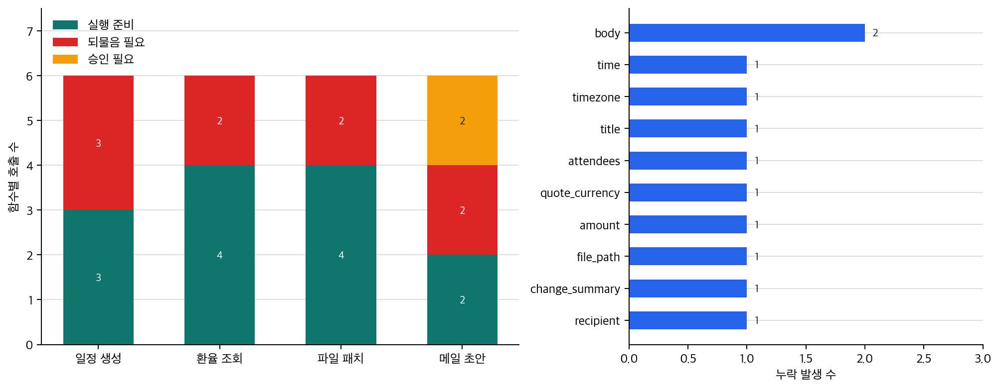

# P6-13.2 자연어 요청을 이름과 인자로 나누는 함수 호출

> Section ID: `P6-13.2`
> Version: `v2026.07.31`

함수 호출을 볼 때는 `natural_language_request`, `function_name`, `arguments`, `schema_validation`, `execution_result`, `response_use`를 따로 적습니다. 이렇게 해야 자연어 요청이 어떤 이름과 인자로 구조화되었고, 결과가 다시 답변에 어떻게 쓰였는지 추적할 수 있습니다.

P6-13.1에서는 에이전트 도구 사용(tool use)이 모델과 외부 기능을 연결하는 구조라는 점을 보았습니다. 그러면 이제 더 구체적인 질문이 나옵니다.

도구를 써야 한다는 판단을 시스템은 어떤 형식으로 주고받는가?

함수 호출(function calling)은 모델이 어떤 도구를 어떤 인자(arguments)로 호출해야 하는지 구조화된 형식으로 표현하게 하는 방식이다.

## 실행 요청을 구조화하는 기준

핵심 질문은 다음과 같습니다.

- 함수 호출은 왜 필요한가?
- 자연어 요청과 구조화된 도구 호출은 무엇이 다른가?
- 함수 이름과 인자를 나누는 것이 왜 중요한가?

먼저 닫을 문제는 함수 호출을 `도구 사용을 안정적으로 연결하기 위한 구조화된 실행 요청`으로 읽고, 자연어 요청이 왜 이름과 인자 구조로 바뀌어야 하는지 붙잡는 것입니다.

반복 작업을 이어 가는 실행 구조는 구조화된 호출을 여러 단계로 묶는 문제입니다. 함수 호출은 먼저 한 번의 실행 요청을 검증 가능한 형태로 만드는 데 집중합니다.

여기서는 function calling을 단순 제품 기능명이 아니라, `도구 사용을 안정적으로 연결하기 위한 구조화 방식`으로 읽습니다. tool use가 `무엇을 실행할까`를 다뤘다면, function calling은 그 실행 판단을 어떤 이름과 인자 구조로 바꿔야 시스템이 검증하고 이어서 처리할 수 있는지 다룹니다. 여러 호출을 어떤 순서로 이어 갈지는 P6-14의 AI 에이전트 구조에서 이어서 봅니다.

핵심은 `무엇을 실행할까`에서 `그 실행 요청을 어떻게 검증 가능한 구조로 바꿀까`로 관점이 바뀌는 데 있습니다. 이 차이가 보여야 함수 호출을 단순 제품 기능이 아니라, `실행 연결을 안정화하는 중간 층`으로 읽을 수 있습니다.

이 단계에서 먼저 남겨야 할 기록은 어떤 호출을 어떤 인자로 준비했는지를 보여 주는 함수 이름, 인자, 누락 필드 점검 결과와, 결과를 어떤 형식으로 기대했고 어디서 호출이 막혔는지를 보여 주는 결과 형식과 호출 실패 이유입니다. 이 기록이 있어야 자연어 요청과 실행 구조를 다시 맞춰 보고, 실행 실패와 후속 운영 실패를 구분할 수 있습니다.

## 자연어 요청과 구조화된 실행 요청의 구분

자연어 요청은 사람이 읽고 의미를 짐작하기 좋은 표현입니다. 반대로 구조화된 실행 요청은 시스템이 실행 전에 검사할 수 있도록 이름과 필드를 나눈 표현입니다. 두 표현은 같은 뜻을 담을 수 있지만, 쓰임이 다릅니다.

| 구분 | 자연어 요청 | 구조화된 실행 요청 |
| --- | --- | --- |
| 읽는 주체 | 사람과 모델 | 애플리케이션, API, 실행 환경 |
| 핵심 장점 | 의도를 넓게 표현하기 쉬움 | 필드 검증과 로그 추적이 쉬움 |
| 흔한 약점 | 빠진 조건이 문장 안에 숨어 있을 수 있음 | schema 밖의 의도나 맥락은 별도 해석이 필요함 |
| 먼저 확인할 것 | 사용자가 무엇을 원했는가 | 어떤 함수와 어떤 인자로 실행할 것인가 |

## 요청이 함수 이름과 인자로 바뀌는 흐름

함수 호출은 자연어 요청을 바로 실행하지 않고, 실행 전에 검사할 수 있는 중간 표현으로 바꿉니다. 이 전환은 다음처럼 나눠 볼 수 있습니다.

| 단계 | 예시 | 이 단계에서 확인할 것 |
| --- | --- | --- |
| 자연어 요청 | `오늘 달러 300달러를 원화로 계산해 줘` | 사용자가 원하는 일이 무엇인가 |
| 함수 후보 | `lookup_exchange_rate` | 어떤 기능을 호출해야 하는가 |
| 인자 후보 | `base_currency=USD`, `quote_currency=KRW`, `amount=300` | 실행에 필요한 값이 채워졌는가 |
| 검증 결과 | `ready` 또는 `needs_clarification` | 바로 실행할지, 되물을지, 승인받을지 |

이 표에서 중요한 점은 함수 호출이 `답변 문장`이 아니라 `실행 직전의 검증 가능한 요청 구조`라는 점입니다.

## 왜 구조화가 필요한가

도구 사용을 자연어 문장만으로 처리하면 애매함이 큽니다.

예를 들어 모델이 이렇게 말한다고 가정해 봅시다.

`서울의 오늘 환율을 검색해서 알려 주세요.`

이 문장은 사람은 이해할 수 있지만, 시스템 입장에서는 다음이 모호할 수 있습니다.

- 어떤 도구를 써야 하는가?
- 인자는 무엇인가?
- 날짜 형식은 어떻게 되는가?
- 실패하면 무엇을 돌려줘야 하는가?

그래서 함수 호출 구조는 보통 다음을 분리합니다.

- 도구 이름
- 인자 이름
- 인자 값

즉, 자연어를 그대로 실행하는 것이 아니라 `실행 가능한 구조`로 바꾸는 것입니다.

자연어 요청과 구조화된 함수 호출은 같은 의도를 다른 형태로 담습니다. 자연어는 사람에게 쉽지만 빠진 조건이 숨어 있을 수 있고, 구조화된 호출은 사람이 보기에는 딱딱하지만 시스템이 필드를 검사하고 실행 기록을 남기기 쉽습니다. 그래서 함수 호출은 모델의 의도를 시스템이 더 안전하게 실행할 수 있도록 문장을 구조로 바꾸는 방법이라고 볼 수 있습니다.

## 함수 이름과 인자를 나누는 이유

이 구분을 잡아야 시스템이 `어떤 기능을 부를지`와 `그 기능에 어떤 값을 넘길지`를 따로 검증하고 실패 원인을 나눠 볼 수 있습니다.

예를 들어:

- 함수 이름: `lookup_exchange_rate`
- 인자: `{"base_currency": "USD", "quote_currency": "KRW", "amount": 300}`

이렇게 나누면 시스템은 다음을 하기 쉬워집니다.

- 허용된 도구인지 확인
- 인자 형식 검증
- 빠진 인자 탐지
- 실행 전 승인 요구

즉, 함수 호출은 단순히 예쁘게 정리하는 것이 아니라, `검증 가능성`과 `통제 가능성`을 높이는 구조입니다.

## 결과도 구조화가 중요한가

그렇습니다. 도구를 호출한 뒤에도 결과가 다시 구조적으로 돌아오면:

- 모델이 다시 읽기 쉬워지고
- 앱이 후처리하기 쉬워지며
- 로그와 추적(trace)이 쉬워집니다

즉, 함수 호출은 보통 입력 구조화만이 아니라, 실행 결과를 다시 연결하는 흐름까지 포함하는 구조로 보는 편이 좋습니다.

## 함수 호출이 항상 정답은 아니다

함수 호출이 있다고 해서:

- 모델이 항상 올바른 도구를 고르는 것
- 인자를 완벽하게 채우는 것
- 잘못된 실행을 완전히 막는 것

이 보장되지는 않습니다.

따라서 실제 시스템은 보통:

- schema 검증
- 권한 확인
- 사용자 승인
- 실패 시 재시도 또는 오류 보고

같은 추가 구조를 둡니다.

## 아주 단순하게 그리면

```mermaid
--8<-- "assets/part-06/chapter-13/p6-c13-s02-function-call-flow-ko.mmd"
```

이 도식의 핵심은 `문장 -> 구조 -> 실행 -> 결과` 흐름으로 바뀐다는 점입니다.

## 자연어 요청을 이름과 인자로 나누는 함수 호출: 확인할 판단 기준

이 사례를 읽을 때는 다음 두 가지를 먼저 확인한다.

- 자연어 요청을 함수 이름과 인자로 구조화하고, 실행 전 누락 필드를 확인할 수 있어야 한다는 점을 보여 주는지 확인한다.
- 이어지는 사례에서 입력, 비교 기준, 출력, 한계가 제목의 판단 기준과 어떻게 연결되는지 확인한다.

### 사례 1. 환율 조회

`오늘 달러 환율 알려 줘`라는 질문을 생각해 볼 수 있습니다. 이런 질문은 사람끼리는 대충 통하니 시스템도 바로 처리할 수 있을 것이라고 생각하기 쉽습니다. 하지만 시스템은 `어느 통화쌍인지`, `어느 날짜 기준인지`, `어느 지역 환율인지`를 인자로 분리해야 실제 조회가 가능합니다. 예를 들어 사용자 의도가 `USD/KRW`인지 `달러 인덱스`인지부터 다를 수 있습니다. 이 구분이 없으면 조회는 성공해도 사용자가 원한 값이 아닌 다른 지표를 돌려줄 수 있습니다. 즉 `실행 성공`과 `의도 일치`는 같은 말이 아닙니다.

여기서 바뀌는 점은 `질문 뜻이 대충 통하는가`를 보던 기준에서 `실제 조회에 필요한 인자가 빠짐없이 구조화되는가`를 보는 기준으로 이동한다는 것입니다. 함수 호출 구조는 자연어 요청을 이런 명시적 필드로 바꾸어 실행 단계를 더 분명하게 만듭니다. 여기서 넘어가야 할 오해는 `말이 자연스럽게 이해되면 조회도 맞게 될 것`이라는 기대입니다. 그래서 이 사례에서 확인해야 할 결과는 질문 문장이 실제 조회 전에 `통화쌍`, `기준 날짜` 같은 인자로 분해되는가, 그리고 그 인자만 봐도 사용자의 원래 의도가 재확인되는가입니다.

### 사례 2. 일정 생성

자연어로는 `내일 오후 3시에 회의 잡아 줘`라고 말하면 충분해 보입니다. 사람도 이런 표현이면 서로 이해될 거라고 먼저 느끼기 쉽습니다. 하지만 실제 캘린더 API는 참석자, 시간대, 제목, 날짜 형식처럼 더 구조화된 인자를 받아야 합니다. 예를 들어 `내일`은 사용자 시간대가 바뀌면 다른 날짜가 될 수 있고, 참석자가 빠지면 회의 생성 자체가 불완전할 수 있습니다. 이 차이를 놓치면 모델이 말을 잘 이해해도 실행 단계에서 바로 막히거나 엉뚱한 시간에 일정이 생길 수 있습니다. 특히 `회의는 만들어졌으니 성공`이라고 보기 쉽지만, 잘못된 시각이나 빈 참석자 목록으로 생성된 일정은 운영 기준에서는 실패에 가깝습니다.

여기서 바뀌는 점은 `말이 충분히 구체적인가`를 보던 기준에서 `API가 요구하는 필드가 실제로 다 채워졌는가`를 보는 기준으로 이동한다는 것입니다. 함수 호출 구조는 이런 암묵적 정보를 명시적 인자 묶음으로 바꿔 줍니다. 그래서 이 사례에서 확인해야 할 결과는 회의 생성 전에 시간, 날짜, 제목, 참석자 같은 필드가 빠짐없이 구조화되는가, 그리고 누락 필드가 있으면 실행 전에 바로 드러나는가입니다.

### 사례 3. 코드 AI 에이전트

코드 AI 에이전트가 파일 읽기, 테스트 실행, 패치 적용을 번갈아 수행한다고 해 봅시다. 단순 자연어 설명만 남으면 어떤 작업이 언제 어떤 인자로 실행됐는지 다시 추적하기 어렵습니다. `파일을 읽고 테스트를 돌렸다`는 서술만 있어도 흐름이 충분히 설명됐다고 느끼기 쉽지만, 실제 운영에서는 어떤 파일을 읽고 어떤 테스트를 돌렸는지까지 남아야 실패를 재현할 수 있습니다. 예를 들어 같은 `테스트를 돌렸다`는 문장도 어느 디렉터리에서, 어떤 플래그로, 어떤 대상만 실행했는지에 따라 결과 해석이 완전히 달라집니다.

반대로 함수 호출 구조로 남기면 `read_file`, `run_tests`, `apply_patch` 같은 단계가 명시적으로 기록되어 실행 흐름을 더 쉽게 되짚을 수 있습니다. 여기서 바뀌는 점은 `무슨 작업을 했다`는 설명만 남기던 기준에서 `어떤 함수가 어떤 인자로 호출됐는가`까지 다시 추적할 수 있는가를 보는 기준으로 이동한다는 것입니다. 이 기록이 없으면 같은 실패가 다시 나와도 어느 단계 입력이 달랐는지 확인하기 어려워집니다. 즉, 함수 호출은 실행 성공뿐 아니라 로그와 재현성을 관리하는 데에도 직접 연결됩니다. 그래서 이 사례에서 확인해야 할 결과는 최종 성공 여부뿐 아니라 어떤 함수가 어떤 인자로 호출됐는지를 다시 추적할 수 있는가, 그리고 누락된 인자 때문에 어떤 단계가 막혔는지도 재구성할 수 있는가입니다.

세 사례를 구조화 관점으로 다시 묶으면 다음과 같습니다.

| 상황 | 자연어만 두면 모호한 것 | 함수 호출 구조가 분명하게 만드는 것 |
| --- | --- | --- |
| 환율 조회 | 어떤 값을 어느 기준으로 조회할지 | 통화쌍, 날짜, 지역 같은 인자 |
| 일정 생성 | `내일`, `오후` 같은 표현의 실행 기준 | 날짜, 시간, 시간대, 참석자 필드 |
| 코드 AI 에이전트 | 무엇을 어떤 순서로 실행했는지 | 함수 이름, 인자, 실행 로그 |

같은 내용을 구조화된 실행 요청 흐름으로 다시 보면 다음처럼 읽을 수 있습니다.

```mermaid
--8<-- "assets/part-06/chapter-13/p6-c13-s02-function-call-boundary-ko.mmd"
```

핵심은 `구조화됐다`와 `바로 실행 가능하다`가 같은 말이 아니라는 점입니다.

## 구조화된 호출이 필요한 장면

함수 호출을 처음 읽을 때 가장 자주 헷갈리는 것은 `말이 이해된다`와 `실행 준비가 끝났다`를 같은 뜻으로 보는 점입니다. 하지만 실제로는 `어떤 기능을 부를지`, `어떤 필드가 필요한지`, `누락 없이 실행 가능한지`를 따로 봐야 합니다.

| 이런 장면이 보이면 | 먼저 확인할 것 | 왜 그 확인이 먼저 필요한가 |
| --- | --- | --- |
| 요청 뜻은 알겠는데 시스템이 어떤 도구를 써야 할지 애매함 | 함수 이름이 분명하게 정해졌는가 | 기능 이름이 모호하면 뒤 인자 검증 이전에 실행 대상부터 흔들리기 때문입니다. |
| 기능은 맞는 것 같은데 실행 직전에 자주 막힘 | 필수 인자가 누락 없이 채워졌는가 | 자연어로는 통하는 요청도 날짜, 시간대, 통화쌍 같은 필드가 비어 있으면 실제 호출은 실패하기 때문입니다. |
| 구조는 갖췄는데 결과가 여전히 불안정함 | 결과 형식과 실패 이유가 함께 기록되는가 | 호출 성공/실패를 다시 추적할 수 있어야 다음 단계 재시도나 수정이 가능하기 때문입니다. |

같은 기준을 더 짧은 실무 질문으로 바꾸면 다음처럼 읽을 수 있습니다.

| 이런 의심이 들면 | 먼저 던질 질문 |
| --- | --- |
| `무슨 작업을 하려는지는 알겠는데 호출이 흐릿하다` | 함수 이름 하나로 실행 대상을 분명히 했는가? |
| `요청은 구체적인데 왜 실행이 안 되지?` | 필수 인자가 빈칸 없이 채워졌는가? |
| `실패는 했는데 어디서 막혔는지 모르겠다` | 결과 형식과 실패 이유를 구조적으로 남겼는가? |

먼저 익혀야 하는 기준은 단순합니다. function calling은 `자연어를 보기 좋게 정리하는 일`이 아니라, `함수 이름`, `인자`, `결과`를 나눠 실행 전 검증과 실행 후 추적을 가능하게 만드는 구조입니다.

## 연습 및 예제

이 예제는 실제 API나 모델을 호출하지 않고, 함수 호출 후보가 실행 전에 어떤 검증을 통과해야 하는지 보는 예제입니다. 한두 문장만 보면 `함수 이름과 인자를 만들면 끝`처럼 보이기 쉽습니다. 그래서 여러 함수 후보를 같은 배치에서 검증해, 어떤 호출은 바로 실행 가능하고, 어떤 호출은 되물어야 하며, 어떤 호출은 승인 대기 상태로 멈춰야 하는지 함께 봅니다.

아래 예제는 함수 호출 후보 CSV [p6-13-2-function-call-requests.csv](../../../assets/part-06/chapter-13/p6-13-2-function-call-requests.csv){ .csv-preview }를 사용합니다. 한 행은 사용자 요청, 참고용 영어 요청, 함수 이름, 함수 인자 후보, 승인 필요 여부를 담습니다. 이 CSV는 실제 모델을 호출해 만든 로그가 아니라, function calling의 검증 구조를 보기 위해 만든 입력입니다. `model_request_en`은 다국어 번역본과 모델 입력 형식을 상상하기 위한 참고 컬럼이며, 이 예제의 검증 코드는 함수 이름과 인자 후보만 사용합니다. CSV의 빈칸은 함수 호출 후보 안에서 아직 채워지지 않았거나 실행 전에 더 확인해야 하는 인자를 뜻합니다.

사용자는 자연어로 일정을 만들거나, 환율을 조회하거나, 파일을 고치거나, 메일 초안을 보내 달라고 요청합니다. 하지만 시스템은 이 문장을 그대로 실행하지 않습니다. 먼저 함수별 schema를 기준으로 필수 인자가 채워졌는지 검사하고, 외부 상태를 바꾸는 요청은 승인 대기 상태로 분리합니다. 따라서 `구조화했다`와 `실행 준비가 끝났다`는 같은 말이 아닙니다.

먼저 이 예제에서 같이 볼 항목은 다음과 같습니다.

| 점검 항목 | 왜 필요한가 |
| --- | --- |
| `function_name` | 어떤 기능을 부르려는지 분리해서 확인 |
| `missing_fields` | 실행 전에 어떤 인자가 비었는지 확인 |
| `status` | 바로 실행, 되물음 필요, 승인 필요를 구분 |
| `schema_required_fields` | 함수마다 필수 인자가 다르다는 점을 확인 |

입력 CSV는 24행입니다. 이 예제의 중심은 대량 데이터 처리나 통계적 대표성이 아니라, 서로 다른 함수 schema가 서로 다른 필수 인자 검증을 만든다는 점을 확인하는 데 있습니다. 그래서 행 수를 늘리는 목적도 분량 자체가 아니라 일정 생성, 환율 조회, 파일 패치, 메일 초안처럼 검증 기준이 다른 호출 후보를 나란히 놓는 데 있습니다.

코드에서 확인할 핵심은 함수 호출형 도구 사용이 `함수 이름`, `인자`, `schema 검증`, `승인 여부`를 나눠 실행 직전의 상태를 만든다는 점입니다.

```python
from collections import Counter, defaultdict
import csv
from pathlib import Path

CSV_PATH = Path("docs/assets/part-06/chapter-13/p6-13-2-function-call-requests.csv")

function_schemas = {
    "create_calendar_event": ["title", "date", "time", "timezone", "attendees"],
    "lookup_exchange_rate": ["base_currency", "quote_currency", "amount"],
    "apply_file_patch": ["file_path", "change_summary"],
    "send_email_draft": ["recipient", "subject", "body"],
}

def is_blank(value):
    return value is None or value.strip() == ""

def build_function_call(row):
    required_fields = function_schemas[row["function_name"]]
    arguments = {field: row.get(field, "") for field in required_fields}
    return {
        "name": row["function_name"],
        "arguments": arguments,
        "approval_required": row["approval_required"].strip().lower() == "true",
    }

def validate_function_call(function_call):
    required_fields = function_schemas[function_call["name"]]
    missing_fields = [
        field for field in required_fields if is_blank(function_call["arguments"].get(field))
    ]
    if missing_fields:
        status = "needs_clarification"
    elif function_call["approval_required"]:
        status = "needs_approval"
    else:
        status = "ready"
    return {
        "function_name": function_call["name"],
        "schema_required_fields": required_fields,
        "missing_fields": missing_fields,
        "status": status,
    }

with CSV_PATH.open(encoding="utf-8", newline="") as file:
    rows = list(csv.DictReader(file))

reports = []
for row in rows:
    function_call = build_function_call(row)
    validation = validate_function_call(function_call)
    reports.append(
        {
            "request_id": row["request_id"],
            "user_request": row["user_request_ko"],
            "function_call": function_call,
            "validation": validation,
        }
    )

status_counts = Counter(report["validation"]["status"] for report in reports)
function_status_counts = defaultdict(Counter)
missing_field_counts = Counter()
for report in reports:
    validation = report["validation"]
    function_status_counts[validation["function_name"]][validation["status"]] += 1
    missing_field_counts.update(validation["missing_fields"])

summary = {
    "request_count": len(reports),
    "status_counts": dict(status_counts),
    "missing_field_counts": dict(missing_field_counts),
    "function_status_counts": {
        function_name: dict(counts)
        for function_name, counts in function_status_counts.items()
    },
}

print("[summary]")
print(summary)
print()

sample_ids = {"F01", "F02", "F07", "F19"}
for report in reports:
    if report["request_id"] not in sample_ids:
        continue
    print("=" * 80)
    print(f"[{report['request_id']}] {report['user_request']}")
    print("[function_call]")
    print(report["function_call"])
    print("[validation]")
    print(report["validation"])
```

실행 결과 예시는 다음처럼 읽을 수 있습니다.

```text
[summary]
{'request_count': 24, 'status_counts': {'ready': 13, 'needs_clarification': 9, 'needs_approval': 2}, 'missing_field_counts': {'time': 1, 'timezone': 1, 'title': 1, 'attendees': 1, 'quote_currency': 1, 'amount': 1, 'file_path': 1, 'change_summary': 1, 'recipient': 1, 'body': 2}, 'function_status_counts': {'create_calendar_event': {'ready': 3, 'needs_clarification': 3}, 'lookup_exchange_rate': {'ready': 4, 'needs_clarification': 2}, 'apply_file_patch': {'ready': 4, 'needs_clarification': 2}, 'send_email_draft': {'needs_approval': 2, 'ready': 2, 'needs_clarification': 2}}}

================================================================================
[F01] 내일 오후 3시에 서울 시간으로 디자인 리뷰 회의를 만들어 주세요.
[function_call]
{'name': 'create_calendar_event', 'arguments': {'title': '디자인 리뷰', 'date': 'tomorrow', 'time': '15:00', 'timezone': 'Asia/Seoul', 'attendees': 'design@example.com'}, 'approval_required': False}
[validation]
{'function_name': 'create_calendar_event', 'schema_required_fields': ['title', 'date', 'time', 'timezone', 'attendees'], 'missing_fields': [], 'status': 'ready'}
================================================================================
[F02] 내일 오후에 서울 시간으로 팀 회의를 잡아 주세요.
[function_call]
{'name': 'create_calendar_event', 'arguments': {'title': '팀 회의', 'date': 'tomorrow', 'time': '', 'timezone': 'Asia/Seoul', 'attendees': 'team@example.com'}, 'approval_required': False}
[validation]
{'function_name': 'create_calendar_event', 'schema_required_fields': ['title', 'date', 'time', 'timezone', 'attendees'], 'missing_fields': ['time'], 'status': 'needs_clarification'}
================================================================================
[F07] 오늘 달러 300달러를 원화로 계산해 주세요.
[function_call]
{'name': 'lookup_exchange_rate', 'arguments': {'base_currency': 'USD', 'quote_currency': 'KRW', 'amount': '300'}, 'approval_required': False}
[validation]
{'function_name': 'lookup_exchange_rate', 'schema_required_fields': ['base_currency', 'quote_currency', 'amount'], 'missing_fields': [], 'status': 'ready'}
================================================================================
[F19] 민수에게 회의록 초안을 보내 주세요.
[function_call]
{'name': 'send_email_draft', 'arguments': {'recipient': 'minsu@example.com', 'subject': '회의록 초안', 'body': '오늘 회의록 초안입니다'}, 'approval_required': True}
[validation]
{'function_name': 'send_email_draft', 'schema_required_fields': ['recipient', 'subject', 'body'], 'missing_fields': [], 'status': 'needs_approval'}
```

이 결과에서 먼저 봐야 할 것은 `status_counts`입니다. 24개 호출 초안 중 13개는 바로 실행 준비가 되었고, 9개는 `time`, `timezone`, `file_path`, `body` 같은 필수 인자가 빠져 되물어야 하며, 2개는 필수 인자가 채워졌더라도 외부 전송처럼 승인 대기 상태로 멈춥니다. 함수 호출 구조가 필요한 이유는 바로 이 구분을 자연어 답변 뒤에 숨기지 않고 실행 전에 드러내기 위해서입니다.

다음으로 볼 것은 `function_status_counts`입니다. 같은 `ready`라도 일정 생성, 환율 조회, 파일 패치, 메일 초안은 서로 다른 필수 인자 묶음을 가집니다. 즉 function calling은 모든 도구에 같은 필드 검사를 붙이는 일이 아니라, 함수 이름이 정해지는 순간 그 함수의 schema로 검증 기준이 바뀌는 구조입니다.

마지막으로 `missing_field_counts`를 보면 누락은 한 종류로 뭉치지 않습니다. 일정 생성에서는 `time`처럼 구체 시각, `timezone`처럼 시간대, `attendees`처럼 참석자가 빠질 수 있습니다. 환율 조회에서는 `amount`처럼 계산할 금액이나 `quote_currency`처럼 바꿀 대상 통화가 빠질 수 있습니다. 파일 패치에서는 `file_path`와 `change_summary`, 메일 초안에서는 `recipient`와 `body`가 실행 가능성을 가르는 필드가 됩니다. 그래서 함수 호출은 단순히 `실패`라고 기록하는 대신, 어떤 인자 때문에 실행을 멈췄는지를 남길 수 있습니다.

이 예제에서 독자가 직접 해 볼 수 있는 조정은 다음과 같습니다.

- CSV에 새 함수 후보를 추가하고 `function_schemas`에 필수 인자를 넣어 검증 기준이 어떻게 바뀌는지 보기
- `approval_required` 값을 바꿔 같은 인자 구조라도 실행 상태가 `ready`와 `needs_approval`로 갈리는지 확인하기
- 빈칸을 채우거나 지워 `status_counts`와 `missing_field_counts`가 어떻게 달라지는지 보기
- `function_schemas`에서 필수 필드를 늘려 운영 정책이 엄격해질 때 되물음이 얼마나 늘어나는지 확인하기

여기서 한 단계 더 가면, 함수 호출이 해결하는 문제와 아직 남는 문제를 분리해서 읽어야 합니다.

| 상황 | 함수 호출이 직접 해결하는 것 | 함수 호출만으로는 남는 것 |
| --- | --- | --- |
| 요청이 말로는 이해되지만 실행 입력이 모호함 | 함수 이름과 인자 구조를 분리해 실행 입력을 명시함 | 어떤 도구를 선택할지 자체의 판단 품질 |
| 실행 전에 빠진 필드를 잡고 싶음 | `missing_fields`처럼 누락 인자를 검증할 수 있음 | 사용자가 의도한 값이 맞는지에 대한 의미 해석 |
| 결과를 후속 단계에 다시 넘기고 싶음 | 결과 형식을 일정한 구조로 돌려주기 쉬움 | 여러 호출을 어떤 순서로 이어 갈지에 대한 계획 |
| 실패를 재현하고 로그로 남기고 싶음 | 어떤 함수가 어떤 인자로 호출됐는지 추적 가능 | 재시도, 대안 경로, 종료 기준 같은 운영 루프 |

이 표가 중요한 이유는 `function calling = agent`로 뭉개지지 않게 해 주기 때문입니다. 함수 호출은 실행 직전 요청을 구조화하는 층이고, 여러 호출을 이어 가는 계획과 재시도는 AI 에이전트 층의 문제입니다.

## 구조화된 실행 요청에서 갈리는 검증 기준

앞의 예제는 함수 호출 전체를 구현하는 코드가 아니라, `사람이 말한 요청`과 `시스템이 실행할 구조`가 같은 문장이 아니라는 점을 보여 주는 장면입니다. 여기서 중요한 것은 자연어를 없애는 일이 아니라, 실행 직전에 어떤 이름과 인자 구조로 다시 정리되어야 하는지를 읽는 데 있습니다.

차트로 보면 같은 배치 안에서도 함수마다 실행 준비 상태가 다르게 갈립니다. 왼쪽은 일정 생성, 환율 조회, 파일 패치, 메일 초안이 각각 `실행 준비`, `되물음 필요`, `승인 필요`로 나뉘는 모습을 보여 줍니다. 오른쪽은 실행을 막은 누락 필드 전체를 보여 줍니다. 따라서 함수 호출은 구조를 만들었다는 사실보다, 실행 전에 어떤 필드가 빠졌고 어떤 요청은 승인 없이 진행하면 안 되는지 드러내고 멈출 수 있게 한다는 점이 더 중요합니다.



## 함수 호출이 실행 요청을 안정화하는 방식

함수 호출의 핵심은 자연어를 없애는 것이 아니라, 실행 직전에 요청을 `이름과 인자가 분리된 검증 가능한 구조`로 바꾸는 데 있습니다.

더 중요하게 붙잡아야 할 점은 `잘 설명하는가`와 `실제로 실행 가능한 요청 구조를 넘기는가`가 같은 문제가 아니라는 것입니다. 그래서 함수 호출은 도구를 더 붙이는 장식이 아니라, 실행 직전에 요청을 검증 가능한 구조로 바꿔 tool use를 덜 불안정하게 만드는 대표 방식으로 읽는 편이 좋습니다.

이 구조화가 중요한 이유는 다음과 같습니다.

- tool use를 모호한 자연어 수준에 두지 않게 하고
- AI agent, MCP, harness를 이해하기 위한 구조화 감각을 주며
- 실행 가능한 AI 서비스가 왜 애플리케이션 계층을 필요로 하는지 설명해 주기 때문입니다

## 체크리스트
- 함수 호출을 `자연어 지시`가 아니라 `이름과 인자가 분리된 검증 가능한 호출 구조`로 설명할 수 있어야 합니다.
- `어떤 함수인가`와 `어떤 인자인가`를 나눠 봐야 검증과 실패 추적이 쉬워진다는 점을 말할 수 있어야 합니다.
- 구조화된 호출들을 목표 흐름 안에서 어떤 순서로 이어 갈지로 질문이 이동한다는 점을 잡고 있어야 합니다.

## 출처와 참고 자료

- OpenAI, [Function calling](https://developers.openai.com/api/docs/guides/function-calling){: target="_blank" rel="noopener noreferrer" }, OpenAI API Docs, 확인 날짜: 2026-07-19.
- OpenAI, [Using tools](https://developers.openai.com/api/docs/guides/tools){: target="_blank" rel="noopener noreferrer" }, OpenAI API Docs, 확인 날짜: 2026-07-19.
- Shunyu Yao et al., [ReAct: Synergizing Reasoning and Acting in Language Models](https://arxiv.org/abs/2210.03629){: target="_blank" rel="noopener noreferrer" }, arXiv, 2022, 확인 날짜: 2026-07-19.
