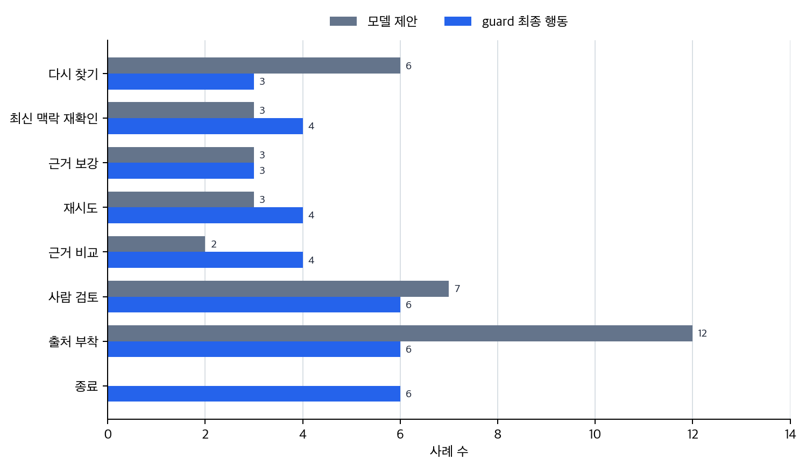

# P6-14.1 에이전트는 언제 다음 행동을 다시 고르는 목표 흐름이 되는가

> Section ID: `P6-14.1`
> Version: `v2026.07.21`

P6-13.2에서는 함수 호출(function calling)이 도구 사용을 구조화된 형식으로 표현하는 방식이라는 점을 보았습니다. 이제 질문은 도구 호출이 한 번으로 끝나지 않고, 여러 단계 작업을 이어 가야 할 때 무엇이라고 보아야 하는가로 커집니다.

에이전트(agent)는 목표를 받고, 필요한 하위 작업을 이어 가며, 도구 사용과 관찰을 반복해 결과를 만드는 작업 구조다.

## 한 번의 호출에서 목표 흐름으로

에이전트를 이해할 때 닫아야 할 문제는 `목표를 여러 단계로 이어 가는 실행 구조`와 단일 도구 호출을 구분하는 것입니다. 앞 장의 tool use가 `무엇을 한 번 조회하거나 실행할까`를 다뤘다면, agent는 여러 도구 호출과 문서 읽기 결과를 어떤 순서로 이어 붙이고 언제 멈추거나 다시 시도할지를 다룹니다.

따라서 agent를 넓은 제품 이름으로 잡기보다 세 질문으로 읽는 편이 안전합니다. 무엇을 먼저 읽고 무엇을 나중에 실행할지 순서를 정해야 하는가, 중간 결과를 보고 다음 행동이 바뀌는가, 그 흐름을 연결 규칙과 하네스 층위에서 어떻게 관리하게 되는가입니다.

이 Section에서는 첫 번째와 두 번째 질문에 집중합니다. P6-13.2의 function calling이 한 번의 실행 요청을 검증 가능한 구조로 넘기는 문제였다면, agent는 여러 호출과 읽기를 어떤 순서로 이어 갈지와 상태 관리를 다룹니다. 루프가 실제로 어떻게 계획, 행동, 관찰로 움직이는지는 P6-14.2에서 더 자세히 보고, 연결 형식과 실행 기록은 P6-15의 MCP와 하네스에서 다시 다룹니다.

여기서 남겨야 할 기록은 단계 계획, 중간 관찰 메모, 다음 단계, 종료 이유입니다. 이 기록이 있어야 다음 행동이 왜 바뀌었는지, 흐름 단위 실패가 어디서 생겼는지, 사람 검토나 재시도로 넘긴 이유가 무엇인지 나중에 다시 읽을 수 있습니다.

## 여기서 남겨야 할 구분

- 에이전트를 입문 수준에서 설명할 수 있습니다.
- 프롬프트, RAG, tool use와 agent의 차이를 말할 수 있습니다.
- 에이전트가 왜 여러 단계와 상태(state)를 다루는 구조인지 설명할 수 있습니다.
- agent 흐름이 계획, 행동, 관찰 루프로 구체화된다는 점을 말할 수 있습니다.

여기서 고정할 구분은 agent를 새로운 제품 이름처럼 외우는 일이 아니라, 어떤 장면에서 `도구를 여러 개 썼다`와 `중간 결과를 보고 다음 행동이 바뀐다`를 갈라 읽는 일입니다.

| 먼저 보인 장면 | agent로 먼저 읽어야 하는가 | 왜 이렇게 갈라지는가 |
| --- | --- | --- |
| 조회나 실행 한 번으로 답이 거의 닫힘 | 보통 아니다 | 한 번의 tool use나 RAG로도 충분할 수 있기 때문입니다. |
| 중간 결과를 보고 검색어, 도구, 다음 단계가 바뀜 | 그렇다 | 다음 행동 선택 자체가 문제로 떠오르기 때문입니다. |
| 실패 뒤에 재시도, 멈춤, handoff 기준까지 같이 정해야 함 | 그렇다 | 답 한 번보다 목표 흐름과 상태 관리가 더 중요해지기 때문입니다. |

이 표를 잡고 아래의 agent 설명, 상태(state), 사례를 읽으면, agent를 `도구를 많이 쓰는 것`보다 `다음 단계 선택이 계속 바뀌는 목표 흐름`으로 더 쉽게 붙잡을 수 있습니다.

## 에이전트는 무엇을 더하나

- 프롬프트는 입력 설계입니다.
- RAG는 외부 문서를 찾아 붙이는 구조입니다.
- tool use는 외부 기능을 호출하는 구조입니다.

에이전트에서 새로 중요해지는 것은 여러 단계의 연결입니다. 한 번의 도구 호출과 달리 중간 결과를 보고 다음 행동을 바꾸며, 중심도 한 번의 답변에서 목표 중심 워크플로우로 이동합니다.

그러면 agent는 무엇을 더할까요?

핵심은 `여러 단계를 이어 가는 것`입니다.

예를 들어 어떤 목표가:

- 정보를 찾고
- 필요한 도구를 고르고
- 중간 결과를 읽고
- 다음 행동을 바꾸고
- 실패하면 다시 시도하고
- 최종 결과를 정리하는

흐름으로 이어진다면, 이것은 단순 단발 요청보다 agent 구조에 가깝습니다.

즉, 에이전트는 `한 번의 응답`보다 `목표를 향한 작업 흐름`에 중심이 있습니다.

서비스 구조 관점으로 보면, 프롬프트는 `어떻게 물을까`, RAG는 `무엇을 읽을까`, tool use는 `무엇을 실행할까`를 다룹니다. agent는 여기에 `어떤 순서로 이어 갈까`를 더합니다.

## 왜 단순 챗봇과 같은 말이 아닌가

종종 agent를 `더 똑똑한 챗봇` 정도로 이해합니다. 하지만 더 안전한 설명은 다음과 같습니다.

`에이전트는 대화형 인터페이스를 가질 수 있지만, 핵심은 대화 자체가 아니라 목표를 위해 작업 단계를 이어 가는 실행 구조에 있다.`

예를 들어 에이전트는 다음을 할 수 있습니다.

- 질문을 다시 분해하기
- 문서를 검색하기
- 파일을 읽기
- 테스트를 실행하기
- 실패 원인을 보고 다시 시도하기

이런 흐름은 단순한 한 번의 답변보다 `작업 조율 구조`에 더 가깝습니다.

## 프롬프트, RAG, tool use와 어떻게 다른가

| 구조 | 중심 역할 |
| --- | --- |
| 프롬프트(prompt) | 입력을 설계한다 |
| RAG | 관련 문서를 찾아 답변 근거로 붙인다 |
| tool use | 외부 기능을 호출한다 |
| agent | 여러 단계 작업을 목표 중심으로 이어 간다 |

즉, agent는 앞선 구조들을 포함할 수 있습니다. 프롬프트도 쓰고, RAG도 쓰고, 도구도 쓸 수 있습니다. 하지만 그 자체로는 각각과 다른 `상위 작업 구조`입니다.

같은 차이를 `한 번의 요청`과 `계속 이어지는 목표`로 다시 압축하면 다음과 같습니다.

| 구조 | 주로 닫히는 단위 | 다음 판단이 필요한가 |
| --- | --- | --- |
| RAG | 한 번의 근거 붙은 답변 | 보통 아니다 |
| tool use | 한 번의 조회/계산/실행 | 경우에 따라 아니다 |
| agent | 여러 단계가 이어지는 목표 | 그렇다 |

- 프롬프트는 입력 단위
- RAG와 tool use는 기능 단위
- agent는 흐름 단위

같은 차이를 `무엇을 읽고`, `무엇을 실행하고`, `무엇을 결정하나`로 다시 보면 다음처럼 더 짧게 잡을 수 있습니다.

| 구조 | 먼저 다루는 대상 | 바로 필요한 판단 | 결과가 닫히는 방식 |
| --- | --- | --- | --- |
| RAG | 문서와 근거 | 어떤 문서를 붙일까 | 근거가 붙은 답변 |
| tool use | 외부 기능 | 어떤 기능을 호출할까 | 조회값, 계산값, 실행 결과 |
| agent | 여러 단계 상태 | 다음에 무엇을 하고 언제 멈출까 | 목표를 향해 이어지는 작업 흐름 |

이 표의 핵심은 agent가 단순히 도구를 더 많이 붙인 버전이 아니라, `다음 단계 선택` 자체를 중심 문제로 바꾼다는 점입니다. 그래서 agent 설명은 기능 목록을 늘리는 일이 아니라, 앞의 읽기와 실행을 `목표 기준 순서 결정`으로 다시 묶는 일입니다.

바로 앞 장과 연결한 최소 경계는 다음 표처럼 다시 잡을 수 있습니다.

| 지금까지 본 구조 | 핵심 역할 | agent가 여기서 더하는 것 |
| --- | --- | --- |
| RAG | 읽을 근거 문서를 붙인다 | 어떤 문서를 언제 다시 찾을지 순서를 바꾼다 |
| tool use | 계산, 조회, 실행 기능을 부른다 | 어떤 도구를 언제 다시 쓰거나 멈출지 결정한다 |
| function calling | 도구 호출을 구조화한다 | 여러 호출을 목표 기준으로 이어 붙인다 |

즉, agent는 앞 절들을 대체하는 새 기능명이 아니라, 앞 절의 읽기와 실행 구조를 `다음 단계 선택`까지 포함하는 흐름으로 묶는 상위 작업 구조입니다.

Chapter 12~14의 최소 차이는 아래 표처럼 다시 고정할 수 있습니다.

| 현재 층위 | 핵심 질문 | 이어지는 중심 |
| --- | --- | --- |
| tool use | 무엇을 실제로 조회하거나 실행할까? | 실행 요청을 어떤 이름과 인자 구조로 넘길까 |
| function calling | 그 실행 요청을 어떻게 검증 가능한 구조로 만들까? | 여러 호출을 어떤 목표 순서로 이어 갈까 |
| agent | 여러 읽기와 실행을 어떤 목표 흐름으로 이어 갈까? | 그 흐름을 어떤 공통 연결 형식과 실행 기록 안에 둘까 |
| MCP / harness | 연결을 어떤 형식으로 드러내고 실행을 어떤 기록으로 남길까? | 남긴 기록을 어떤 평가와 운영 판단으로 읽을까 |

## 왜 상태(state)가 중요해지나

여러 단계 작업을 이어 가려면 시스템은 중간 상태를 알아야 합니다.

예를 들어:

- 이미 어떤 문서를 읽었는가
- 어떤 도구 호출이 성공했는가
- 어떤 오류가 발생했는가
- 다음에 무엇을 해야 하는가

이런 정보가 없으면 에이전트는 매 단계마다 맥락을 잃고 같은 실수를 반복할 수 있습니다.

따라서 agent는 단순한 출력 생성보다 `상태를 가진 실행`에 더 가깝습니다.

이 점 때문에 agent 설명에서는 `왜?`라는 질문에 답하기 위해 현재 단계, 이전 결과, 남은 목표를 함께 봐야 합니다.

## 왜 실무에서 중요해졌나

구분해야 할 점은 `설명을 한 번 돌려주는 일`과 `여러 단계 작업을 끝까지 이어 가는 일`이 같은 문제가 아니라는 것입니다. 그래서 agent가 필요한 장면은 보통 다음처럼 `중간 결과를 보고 다음 행동을 다시 골라야 하는가`로 드러납니다.

- 단순 설명을 넘어서
- 실제 자료를 모으고
- 도구를 사용하고
- 결과를 다시 정리하고
- 끝까지 처리해 주는 흐름

즉, 요청이 한 번의 답변으로 닫히지 않고 `읽기 -> 실행 -> 확인 -> 다음 행동 선택`으로 이어지기 시작하면, 그 장면은 단일 응답보다 agent 구조로 읽는 편이 더 정확합니다.

예를 들어:

- 개발 보조
- 리서치 보조
- 문서 처리 자동화
- 고객 대응 워크플로우

같은 곳에서 agent 구조가 두드러집니다.

## 에이전트도 만능은 아니다

이 점도 반드시 같이 넣어야 합니다.

에이전트가 있다고 해서:

- 항상 올바른 계획을 세우는 것
- 무한 반복을 피하는 것
- 잘못된 도구 호출을 모두 막는 것
- 비용과 지연 시간을 자동으로 최적화하는 것

을 자동으로 해결하는 것은 아닙니다. 그래서 계속 확인해야 할 결과는 `여러 단계를 이어 갈 수 있는가`만이 아니라, `어디서 멈추고 다시 계획하며 사람에게 넘겨야 하는가`까지 구조 안에 드러나는가입니다.

오히려 단계가 늘어나면:

- 실패 지점이 늘고
- 로그가 더 필요하며
- 승인과 권한 관리가 중요해지고
- 평가와 재현성이 더 어려워질 수 있습니다

즉, agent는 능력을 넓히는 동시에 운영 복잡도도 크게 키웁니다.

## 아주 단순하게 그리면

```mermaid
--8<-- "assets/part-06/chapter-14/p6-c14-s01-agent-flow-ko.mmd"
```

이 도식의 핵심은 agent가 `질문 -> 답변` 한 번으로 끝나는 구조가 아니라, `목표 -> 단계 선택 -> 실행 -> 관찰`의 반복 구조라는 점입니다.

## 사례 및 예시

### 사례 1. 코딩 에이전트

사용자가 `로그인 오류를 고쳐 달라`고 요청하면, 사람은 `원인 설명 한 번`이나 `수정 코드 한 조각`을 기대하기 쉽습니다. 하지만 실제 코딩 에이전트는 관련 파일을 찾고 오류 지점을 읽은 뒤 패치를 적용하고 테스트를 다시 실행합니다.

예를 들어 첫 수정 후 테스트가 다른 인증 예외를 새로 드러내면, 거기서 멈추지 않고 다음 수정으로 이어 가야 합니다. 사람이 중간 결과를 확인해 보듯이, 에이전트도 테스트 실패나 새 오류 메시지를 보고 다음 행동을 바꿉니다. 이 관찰을 무시하면 원래 오류 하나는 줄여도 다른 회귀를 남긴 채 끝날 수 있습니다.

여기서 바뀌는 기준은 `수정 코드 한 번을 내놓는가`에서 `테스트 결과를 보고 다음 행동을 바꾸는 흐름이 있는가`로 이동합니다. 이런 구조는 `답변 한 번`이 아니라 `읽기-수정-실행-재확인`이 이어지는 작업 흐름이므로 agent라고 부릅니다. 이 사례에서 확인해야 할 결과는 수정 코드 한 번으로 끝나는 것이 아니라, 테스트 결과를 보고 다음 행동이 실제로 바뀌는가입니다.

| 단계 | 중간 관찰 | 다음에 실제로 바뀌어야 하는 것 |
| --- | --- | --- |
| 파일 읽기 | 인증 로직 위치 확인 | 어디를 먼저 수정할지 |
| 패치 적용 | 코드 변경 완료 | 어떤 테스트를 돌릴지 |
| 테스트 실행 | 새 오류, 회귀, 실패 로그 | 다음 패치 방향과 재검증 순서 |

### 사례 2. 문서 조사 에이전트

사용자가 `최신 환불 정책을 근거와 함께 정리해 달라`고 요청하면, 검색 한 번으로 바로 답이 끝날 것처럼 느끼기 쉽습니다. 하지만 문서 조사 에이전트는 관련 공지와 규정 문서를 찾고, 사람이 수작업으로 조사할 때처럼 문서 날짜와 근거 수준을 확인한 뒤 부족하면 검색어를 바꾸거나 다른 출처를 더 읽습니다.

검색 첫 결과가 작년 공지라면 거기서 바로 요약하지 않고 최신 개정 문서를 다시 찾아야 합니다. 반대로 최신 공지는 찾았지만 세부 조건이 별도 규정 PDF에 있으면, 공지 하나만으로 끝내지 않고 그 PDF까지 다시 열어 근거를 보강해야 할 수 있습니다. 그렇지 않으면 겉보기에는 출처가 붙어 있어도 실제로는 오래된 근거를 붙이거나 핵심 조건을 빠뜨린 답이 됩니다.

여기서 바뀌는 기준은 `검색 결과 하나가 나왔는가`에서 `날짜와 근거 수준을 확인하며 재탐색하는가`로 이동합니다. 검색, 읽기, 요약, 출처 정리, 재탐색이 한 목표 아래에서 이어지기 때문에 단순 검색기보다 에이전트에 가깝습니다. 이 사례에서 확인해야 할 결과는 첫 검색 결과를 바로 요약하는 대신, 날짜와 근거 수준을 다시 확인하며 최신 문서를 끝까지 찾는가입니다.

| 단계 | 중간 관찰 | 다음에 실제로 바뀌어야 하는 것 |
| --- | --- | --- |
| 첫 검색 | 작년 공지, 불충분한 출처 | 검색어와 날짜 필터 |
| 문서 읽기 | 세부 조건 누락 | 추가 PDF나 규정 원문 열람 |
| 요약 직전 점검 | 출처는 있으나 최신성 불확실 | 재탐색 여부와 인용 근거 보강 |

### 사례 3. 업무 자동화 에이전트

사용자가 `오늘 접수된 긴급 문의를 찾아 담당자 캘린더까지 확인해 달라`고 요청할 수 있습니다. 사람은 이 요청을 문장 하나로 말하더라도, 실제 시스템에서는 메일함 조회, 긴급 여부 분류, 담당자 검색, 캘린더 확인, 결과 기록을 차례로 이어 가야 합니다.

긴급 문의로 분류된 항목이 세 개라면 담당자마다 다른 캘린더를 다시 조회하고, 일정이 겹치면 우선순위까지 다시 정해야 할 수 있습니다. 각 단계는 개별 도구 호출이지만, 핵심은 그 호출들을 하나의 업무 목표로 연결하고 중간 결과에 따라 다음 순서를 바꾸는 데 있습니다.

중간 결과를 보지 않고 처음 순서만 밀어붙이면, 긴급도가 낮은 건을 먼저 처리하거나 담당자 일정 충돌을 놓칠 수 있습니다. 여기서 바뀌는 기준은 `도구를 차례로 호출하는가`에서 `중간 결과에 따라 실제 순서와 우선순위가 바뀌는가`로 이동합니다. 이 사례에서 확인해야 할 결과는 도구 호출 목록을 나열하는 데 그치지 않고, 중간 결과에 따라 실제 작업 순서와 우선순위가 바뀌는가입니다.

사례를 작업 구조로 다시 펴 보면 다음처럼 읽을 수 있습니다.

| 상황 | 시작 목표 | 중간에 바뀌는 것 | agent로 읽어야 하는 이유 |
| --- | --- | --- | --- |
| 코딩 보조 | 오류 수정 | 테스트 로그에 따라 다음 패치 방향 | 한 번의 코드 제안이 아니라 재시도 루프가 필요해서 |
| 문서 조사 | 최신 근거 정리 | 검색어, 날짜 필터, 읽기 우선순위 | 첫 검색 결과로 바로 끝내면 오래된 근거가 남을 수 있어서 |
| 업무 자동화 | 긴급 문의 처리 | 우선순위, 담당자, 일정 충돌 처리 | 여러 시스템 결과를 보고 순서를 계속 바꿔야 해서 |

세 사례를 관찰-행동 연결 기준으로 다시 묶으면 다음과 같습니다.

| 상황 | 다음 행동을 바꾸는 관찰 신호 | 그 신호 뒤에 실제로 바뀌어야 하는 것 |
| --- | --- | --- |
| 코딩 보조 | 테스트 실패, 새 오류 로그 | 다음 패치 방향과 검증 순서 |
| 문서 조사 | 오래된 문서, 근거 부족 | 검색어, 날짜 필터, 읽기 우선순위 |
| 업무 자동화 | 일정 충돌, 긴급도 재분류 | 처리 순서와 담당자 선택 |

## 다음 행동이 바뀌는 장면

에이전트를 처음 읽을 때 가장 자주 놓치는 것은 `도구를 여러 개 쓴다`는 사실만 보고도 곧바로 agent라고 부르는 점입니다. 하지만 핵심은 도구 개수가 아니라 `중간 결과를 보고 다음 행동이 실제로 바뀌는가`에 있습니다.

| 이런 장면이 보이면 | 먼저 확인할 것 | 왜 그것이 agent 판단의 핵심인가 |
| --- | --- | --- |
| 검색하고 끝내는 한 번의 답변처럼 보임 | 중간 결과 뒤에 다음 선택이 실제로 생기는가 | 한 번의 읽기나 실행으로 닫히면 agent보다 단일 호출 구조에 가깝기 때문입니다. |
| 도구는 여러 개 쓰지만 순서가 항상 고정돼 있음 | 관찰 결과에 따라 순서나 다음 단계가 바뀌는가 | 단순 파이프라인과 목표 흐름 구조를 가르는 기준이기 때문입니다. |
| 실패가 났을 때 다시 시도하거나 사람에게 넘겨야 함 | 멈춤, 재시도, handoff 기준이 드러나는가 | agent는 진행만이 아니라 언제 멈출지도 구조 안에 포함해야 하기 때문입니다. |

같은 기준을 더 짧은 실무 질문으로 바꾸면 다음처럼 읽을 수 있습니다.

| 이런 의심이 들면 | 먼저 던질 질문 |
| --- | --- |
| `도구를 여러 개 쓰니까 agent 아닌가?` | 다음 행동이 중간 관찰 때문에 실제로 달라지는가? |
| `흐름은 길지만 그냥 순서 실행 같은데?` | 상태를 보고 재계획하는 단계가 있는가? |
| `끝까지 돌리면 위험할 수도 있겠다` | 어디서 멈추고 사람 검토로 넘길지 기준이 있는가? |

먼저 익혀야 하는 기준은 단순합니다. agent는 `도구가 많은 시스템`이 아니라, `중간 관찰`, `다음 행동 선택`, `멈춤과 handoff`를 포함해 목표를 끝까지 이어 가는 작업 흐름 구조입니다.

같은 내용을 작업 흐름 구조로 다시 보면 다음처럼 읽을 수 있습니다.

```mermaid
--8<-- "assets/part-06/chapter-14/p6-c14-s01-agent-state-loop-ko.mmd"
```

핵심은 `답변 한 번`이 아니라 `상태를 갱신하며 다음 행동을 다시 고르는 반복`입니다.

## 연습 및 예제

예제의 목표는 실제 에이전트 프레임워크 전체를 구현하는 것이 아니라, 하나의 목표가 들어왔을 때 `검색`, `읽기`, `요약`, `출처 부착` 같은 여러 작업 단계와 상태로 풀리고, 그 상태에 따라 다음 계획이 실제로 다시 짜이는 장면을 눈으로 확인하는 것입니다.

사용자는 최신 환불 정책을 요약하고 출처까지 붙인 답을 원합니다. 이 목표는 한 문장 생성만으로 끝나지 않고 여러 단계를 거쳐야 하며, 각 단계가 끝날 때마다 상태가 누적되어 다음 단계 선택에 쓰여야 합니다. 따라서 한 번의 계획으로 끝나는 것이 아니라 `계획 -> 실행 -> 관찰 -> 재계획`이 반복되어야 합니다.

아래 예제는 하나의 목표와 현재 상태 객체를 사용합니다. 출력에서는 단계별 실행 계획, 단계가 끝날 때마다 갱신되는 상태, 각 라운드 뒤 다음 계획이 어떻게 바뀌는지 보여 주는 점검값을 확인합니다.

먼저 이 예제에서 같이 볼 항목은 다음과 같습니다.

| 점검 항목 | 왜 필요한가 |
| --- | --- |
| `current_plan` | 지금 상태에서 무엇을 해야 하는지 확인 |
| `documents_found_count` | 검색 결과가 다음 단계로 이어질 만큼 확보됐는지 확인 |
| `summary_ready` | 읽기 이후 요약 단계로 넘어갈 수 있는지 확인 |
| `sources_attached` | 최종 답까지 도달했는지 확인 |

코드에서 확인할 핵심은 에이전트 실행은 정답 생성뿐 아니라 현재 상태가 다음 단계로 넘어갈 준비가 되었는지 계속 점검하는 과정이라는 점입니다.

```python
# 최신 환불 정책 답변 목표를 agent state와 plan step으로 나누고 각 단계 완료에 따라 다음 행동이 바뀌는지 확인하는 예제입니다.
goal = "최신 환불 정책을 찾아 요약하고 출처를 붙여 답변한다."

state = {
    "goal": goal,
    "documents_found": [],
    "read_complete": False,
    "summary_ready": False,
    "sources_attached": False,
}

def build_plan(state):
    steps = []
    if not state["documents_found"]:
        steps.append("search_policy_docs")
    elif not state["read_complete"]:
        steps.append("read_top_documents")
    elif not state["summary_ready"]:
        steps.append("summarize_changes")
    elif not state["sources_attached"]:
        steps.append("attach_sources")
    return steps

def simulate_step(step, state):
    if step == "search_policy_docs":
        state["documents_found"] = [
            "policy_notice_2026_06_29",
            "refund_rules_appendix",
        ]
    elif step == "read_top_documents":
        state["read_complete"] = True
    elif step == "summarize_changes":
        state["summary_ready"] = True
        state["draft_summary"] = "환불 요청 처리 기한이 7일에서 14일로 늘어났습니다."
    elif step == "attach_sources":
        state["sources_attached"] = True
        state["final_answer"] = (
            "환불 요청 처리 기한이 7일에서 14일로 늘어났습니다. "
            "출처: policy_notice_2026_06_29, refund_rules_appendix"
        )
    return state

round_reports = []
while True:
    current_plan = build_plan(state)
    if not current_plan:
        break

    step = current_plan[0]
    state = simulate_step(step, state)
    next_plan = build_plan(state)
    round_reports.append(
        {
            "step": step,
            "state_snapshot": {
                "documents_found_count": len(state["documents_found"]),
                "read_complete": state["read_complete"],
                "summary_ready": state["summary_ready"],
                "sources_attached": state["sources_attached"],
            },
            "next_plan": next_plan,
        }
    )

inspection = {
    "round_count": len(round_reports),
    "final_documents_found_count": len(state["documents_found"]),
    "final_summary_ready": state["summary_ready"],
    "final_sources_attached": state["sources_attached"],
    "finished": state["sources_attached"] and "final_answer" in state,
    "completion_ratio": round(
        sum(
            [
                bool(state["documents_found"]),
                state["read_complete"],
                state["summary_ready"],
                state["sources_attached"],
            ]
        ) / 4,
        2,
    ),
}

print("[goal]")
print(goal)
for idx, report in enumerate(round_reports, start=1):
    print(f"[round {idx}]")
    print(report)
print("[final state]")
print(state)
print("[inspection]")
print(inspection)
```

실행 결과 예시는 다음처럼 읽을 수 있습니다.

```text
[goal]
최신 환불 정책을 찾아 요약하고 출처를 붙여 답변한다.
[round 1]
{'step': 'search_policy_docs', 'state_snapshot': {'documents_found_count': 2, 'read_complete': False, 'summary_ready': False, 'sources_attached': False}, 'next_plan': ['read_top_documents']}
[round 2]
{'step': 'read_top_documents', 'state_snapshot': {'documents_found_count': 2, 'read_complete': True, 'summary_ready': False, 'sources_attached': False}, 'next_plan': ['summarize_changes']}
[round 3]
{'step': 'summarize_changes', 'state_snapshot': {'documents_found_count': 2, 'read_complete': True, 'summary_ready': True, 'sources_attached': False}, 'next_plan': ['attach_sources']}
[round 4]
{'step': 'attach_sources', 'state_snapshot': {'documents_found_count': 2, 'read_complete': True, 'summary_ready': True, 'sources_attached': True}, 'next_plan': []}
[final state]
{'goal': '최신 환불 정책을 찾아 요약하고 출처를 붙여 답변한다.', 'documents_found': ['policy_notice_2026_06_29', 'refund_rules_appendix'], 'read_complete': True, 'summary_ready': True, 'sources_attached': True, 'draft_summary': '환불 요청 처리 기한이 7일에서 14일로 늘어났습니다.', 'final_answer': '환불 요청 처리 기한이 7일에서 14일로 늘어났습니다. 출처: policy_notice_2026_06_29, refund_rules_appendix'}
[inspection]
{'round_count': 4, 'final_documents_found_count': 2, 'final_summary_ready': True, 'final_sources_attached': True, 'finished': True, 'completion_ratio': 1.0}
```

이 결과에서 먼저 봐야 할 것은 `round_count`가 4이고, 각 라운드마다 `next_plan`이 달라진다는 점입니다. 즉, 에이전트는 처음부터 전체 답을 한 번에 내놓는 구조가 아니라, 현재 상태를 보고 `지금은 검색`, `다음은 읽기`, `그다음은 요약`, `마지막은 출처 부착`처럼 단계별로 재계획합니다. 이 구조가 있어야 중간 결과를 보고 다음 행동을 바꾸는 실행 흐름이라고 말할 수 있습니다.



이 차트는 예제의 `completion_ratio`가 마지막에만 갑자기 생기는 값이 아니라, 검색, 읽기, 요약, 출처 부착 상태가 라운드마다 하나씩 채워지며 다음 계획을 바꾸는 흐름임을 보여 줍니다.

그래서 이 예제에서 확인해야 할 결과는 두 가지입니다.

- 답변 한 문장이 아니라, 목표를 이루기 위한 여러 단계 흐름과 누적 상태가 먼저 명시되고 그 상태에 따라 다음 단계가 다시 정해진다.
- 에이전트의 핵심은 도구를 많이 쓰는 것이 아니라, `현재 상태를 보고 다음 행동을 다시 고르는 반복 구조`에 있다.

이 예제에서 독자가 직접 해 볼 수 있는 조정은 다음과 같습니다.

- `documents_found`를 비운 채 시작하도록 바꿔 검색 단계가 어떻게 다시 등장하는지 보기
- `simulate_step`에 실패 상태를 넣어 `next_plan`이 재탐색이나 재시도로 어떻게 바뀌는지 보기
- `attach_sources`를 마지막이 아니라 중간 단계로 옮기면 왜 흐름이 어색해지는지 생각해 보기
- `read_complete`를 여러 문서 단위로 쪼개 상태가 더 복잡해질 때 계획이 어떻게 달라지는지 상상해 보기

이 지점에서 한 번 더 분리해 두면, agent가 직접 해결하는 문제와 별도 층위로 남겨야 하는 문제가 더 분명해집니다.

| 상황 | agent가 직접 해결하려는 것 | agent만으로는 아직 남는 것 |
| --- | --- | --- |
| 요청이 여러 단계로 이어짐 | 다음 단계 선택과 순서 재조정 | 각 호출을 어떤 형식으로 표현할지의 세부 구조 |
| 중간 결과를 보고 계획이 바뀜 | 상태를 보고 재계획하는 흐름 | 호출 형식 검증, 권한 경계, 공통 연결 규칙 |
| 여러 도구를 하나의 목표로 묶어야 함 | 읽기, 실행, 확인을 목표 단위로 연결 | 그 연결을 어떤 공통 인터페이스와 실행 기록으로 관리할지 |
| 실패 뒤 다시 시도해야 함 | 재시도와 중간 종료를 목표 흐름에 포함 | trace, replay, approval 같은 운영 기록 체계 |

이 표가 중요한 이유는 `agent = 도구를 많이 쓰는 것`으로 축소되지 않게 해 주기 때문입니다. agent의 중심은 도구 개수가 아니라 `다음 단계 선택`이며, 호출 형식 검증은 P6-13.2, 공통 연결 규칙은 P6-15.1, 실행 기록과 재현은 P6-15.2에서 더 구체화됩니다.

## 이 예제를 작업 흐름 관점으로 다시 보면

앞의 예제는 agent 전체를 구현하는 코드가 아니라, `목표 하나를 바로 문장 하나로 닫는 구조`가 아니라 `목표를 여러 단계 흐름으로 풀어야 하는 구조`라는 점을 가장 짧게 보여 주는 장면입니다. 여기서 읽어야 할 핵심은 단계 수를 세는 일이 아니라, 같은 목표라도 검색, 읽기, 요약, 출처 부착처럼 서로 다른 행동이 이어져야 한다는 점입니다.

이 예제에서 여기서 읽어야 할 핵심은 다음입니다.

- 목표는 하나지만
- 단계는 여러 개일 수 있고
- 각 단계의 결과가 다음 단계 선택에 영향을 준다는 점입니다

## 여기까지를 한 줄로 묶으면

에이전트의 핵심은 도구를 많이 쓰는 데 있지 않고, 목표를 여러 단계로 나누고 현재 상태를 보며 다음 행동을 계속 다시 고르는 실행 흐름을 만드는 데 있습니다.

더 중요하게 붙잡아야 할 점은 `답을 한 번 잘하는가`와 `중간 결과를 보며 일을 계속 이어 가는가`가 같은 문제가 아니라는 것입니다. 그래서 agent는 도구를 더 붙인 버전이 아니라, 여러 단계 상태를 보며 다음 행동을 다시 고르는 실행 흐름으로 읽는 편이 좋습니다.

이 실행 흐름이 중요한 이유는 다음과 같습니다.

- 바로 앞의 P6-13.1 도구 사용과 P6-13.2 함수 호출을 `한 번의 호출`이 아니라 `여러 단계를 잇는 실행 구조` 안에 다시 놓게 하고
- 계획, 행동, 관찰 루프를 이해하게 하며
- 뒤의 P6-15.1 MCP, P6-15.2 하네스, P6-16.1 평가를 왜 함께 봐야 하는지 준비시키기 때문입니다

## 체크리스트
- 에이전트를 `더 똑똑한 챗봇`이 아니라 `여러 읽기와 실행을 목표 흐름으로 이어 가는 작업 구조`로 설명할 수 있어야 합니다.
- RAG, tool use, function calling이 각각 읽기·실행·구조화라면, agent는 `다음 단계 선택`을 중심에 두는 상위 흐름이라는 점을 말할 수 있어야 합니다.
- agent 흐름은 다시 계획, 행동, 관찰의 반복 루프로 더 구체화된다는 점을 잡고 있어야 합니다.

## 출처와 참고 자료

- Shunyu Yao et al., [ReAct: Synergizing Reasoning and Acting in Language Models](https://arxiv.org/abs/2210.03629){: target="_blank" rel="noopener noreferrer" }, arXiv, 2022, 확인 날짜: 2026-07-19.
- OpenAI, [Agents SDK](https://developers.openai.com/api/docs/guides/agents){: target="_blank" rel="noopener noreferrer" }, OpenAI API Docs, 확인 날짜: 2026-07-19.
- OpenAI, [Using tools](https://developers.openai.com/api/docs/guides/tools){: target="_blank" rel="noopener noreferrer" }, OpenAI API Docs, 확인 날짜: 2026-07-19.
