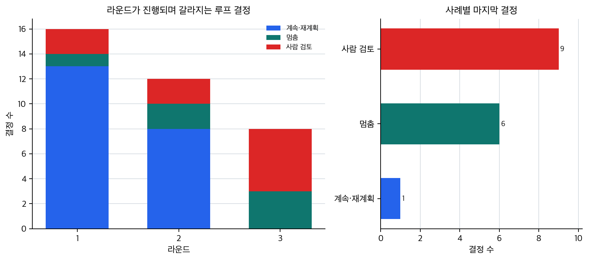

# P6-15.2 계속·멈춤·사람 검토로 갈라지는 AI 에이전트 루프

> Section ID: `P6-15.2`
> Version: `v2026.07.31`

루프 기록은 `plan`, `action`, `observation`, `continue_reason`, `stop_condition`, `human_review_reason`을 따로 둡니다. 그러면 계속 진행할지, 멈출지, 사람 검토로 넘길지가 모델의 기분이 아니라 관찰 결과와 종료 조건에 연결됩니다.

P6-15.1에서는 AI 에이전트(AI agent)를 중간 결과에 따라 다음 작업을 바꾸는 실행 구조로 보았습니다. 이제는 그 흐름이 실제로 어떤 기준으로 계속되고, 어디서 멈추며, 언제 사람 검토로 넘어가는지 더 구체적으로 봐야 합니다.

에이전트는 목표를 기준으로 다음 단계를 계획하고, 실제 행동을 실행하고, 그 결과를 관찰한 뒤 다음 결정을 고르는 반복 구조를 가진다. 이때 중요한 것은 루프가 돈다는 사실 자체가 아니라, 관찰 결과가 `계속`, `멈춤`, `사람 검토` 중 어느 방향으로 분기시키는가입니다.

## 반복 루프가 맡는 일

이 장면에서 닫아야 할 문제는 단일 AI 에이전트 루프의 기본 구조를 `계획-행동-관찰 반복`으로 읽고, 어디서 계속 진행하고 어디서 멈추는지 구분하는 것입니다.

도구 연결 규칙과 실행 환경은 루프가 어떤 도구와 자원을 쓰고, 그 실행을 어떤 기록 환경에 남기는지의 문제입니다. 계획-행동-관찰 루프는 먼저 관찰 결과가 다음 분기와 종료 판단을 어떻게 바꾸는지에 집중합니다.

에이전트는 추상적인 개념으로만 두지 않고, `계획(plan)`, `행동(action)`, `관찰(observation)`이 반복되는 루프(loop)로 읽어야 합니다. P6-15.1이 여러 읽기와 실행을 어떤 목표 흐름으로 이어 갈지 봤다면, 여기서는 그 흐름이 중간 관찰에 따라 어떻게 계속, 종료, 사람 검토로 갈라지는지 봅니다.

핵심은 `여러 단계를 이어 갈까`에서 `그 단계들이 어떤 관찰과 결정 루프로 반복될까`로 관점이 바뀌는 데 있습니다.

이 단계에서 먼저 남겨야 할 기록은 어느 단계에서 판단이 바뀌었는지를 보여 주는 계획, 행동, 관찰 기록과, 언제 멈췄고 왜 사람에게 넘겼는지를 보여 주는 종료 이유와 다음 단계입니다. 이 기록이 있어야 루프 실패와 재시도 이유를 다시 좁힐 수 있습니다.

## 계획, 행동, 관찰, 종료 조건의 구분

계획, 행동, 관찰, 종료 조건을 따로 보는 이유는 용어를 외우기 위해서가 아닙니다. 같은 실패처럼 보여도 어느 지점이 흔들렸는지에 따라 다음 결정이 달라지기 때문입니다.

| 관찰 결과 | 이어지는 결정 | 왜 이렇게 갈라지는가 |
| --- | --- | --- |
| 근거가 아직 부족함 | 계속 진행 또는 재계획 | 같은 행동 반복이 아니라 검색어, 도구, 순서를 다시 바꿔야 하기 때문입니다. |
| 근거가 충분하고 충돌이 작음 | 종료 | 더 돌릴수록 품질보다 비용과 시간만 늘 수 있기 때문입니다. |
| 문서 충돌, 권한 부족, 상태 불확실성이 큼 | 사람 검토 전환 또는 handoff | 자동으로 끝내면 위험한 장면을 별도 경계로 남겨야 하기 때문입니다. |

이 표를 먼저 잡고 아래의 `계획`, `행동`, `관찰`, `종료 조건`을 읽으면, AI agent loop를 `계속 도는 구조`가 아니라 `관찰에 따라 다음 행동이 바뀌는 구조`로 더 쉽게 붙잡을 수 있습니다. 이어서 볼 정의들은 이 분기표를 읽기 위한 최소 부품입니다.

## 계획(plan)은 무엇인가

계획은 `지금 무엇을 해야 하는가`를 정하는 단계입니다.

예를 들어 목표가:

`최신 환불 정책을 찾아 요약하라`

라면 계획 단계는 다음과 비슷할 수 있습니다.

- 먼저 정책 문서를 검색한다
- 최신 공지를 우선 확인한다
- 변경된 부분만 추려 낸다

즉, 계획은 목표를 더 작은 하위 단계로 나누는 일입니다.

## 행동(action)은 무엇인가

행동은 실제로 무언가를 수행하는 단계입니다.

예를 들어:

- 검색 도구 호출
- 파일 읽기
- 계산 실행
- API 요청

같은 것이 행동에 들어갑니다.

중요한 점은 행동은 `말로만 다음 단계를 제안하는 것`이 아니라, 외부 세계에 실제 영향을 주거나 실제 결과를 가져오는 단계라는 점입니다.

## 관찰(observation)은 무엇인가

관찰은 행동의 결과를 읽는 단계입니다.

예를 들어:

- 검색 결과가 너무 적었다
- 파일이 없었다
- 계산 결과가 예상과 달랐다
- API 호출이 실패했다

같은 것이 관찰에 들어갑니다.

관찰이 없으면 에이전트는 같은 행동을 계속 반복하거나, 실패한 줄도 모르고 다음 단계로 넘어갈 수 있습니다.

## 계획·행동·관찰을 나누는 이유

독자는 이 흐름을 한 덩어리로 보기 쉽습니다. 하지만 나눠 보면 문제가 훨씬 잘 보입니다.

예를 들어:

- 계획이 틀린 것인가?
- 도구 행동이 실패한 것인가?
- 결과를 잘못 읽은 것인가?

이렇게 구분해야 디버깅과 평가가 가능해집니다.

즉, 계획/행동/관찰 분리는 단순 이론 구분이 아니라, 실제 운영과 평가를 위한 구분입니다.

## 반복을 멈추는 종료 조건(stop condition)

에이전트는 반복 구조이기 때문에, 어느 시점에서 충분한 근거를 얻었다고 보고 멈출지와 어느 경우 사람 검토로 넘길지를 먼저 정해야 합니다.

멈추는 기준이 없으면:

- 같은 검색을 계속 반복하거나
- 이미 충분한 답이 있는데도 추가 행동을 하거나
- 비용과 시간이 불필요하게 늘어날 수 있습니다

종료 조건은 보통 다음과 연결됩니다.

- 목표 달성
- 충분한 근거 확보
- 재시도 한도 초과
- 권한/오류 때문에 중단

즉, stop condition은 에이전트의 품질뿐 아니라 비용과 안전성에도 직접 연결됩니다.

## 계획 오류·실행 실패·관찰 오독

AI 에이전트 루프는 강력하지만 실패 지점도 많습니다.

- 계획이 비현실적일 수 있음
- 잘못된 도구를 선택할 수 있음
- 관찰 결과를 오독할 수 있음
- 멈춰야 할 때 계속할 수 있음

따라서 agent 설계는 보통 `더 많은 자유`와 `더 많은 통제 필요`가 함께 따라옵니다.

## 관찰 뒤에 다시 갈라지는 루프

```mermaid
--8<-- "assets/part-06/chapter-14/p6-c14-s02-plan-action-loop-ko.mmd"
```

이 도식의 핵심은 agent가 일직선 파이프라인이 아니라, 관찰 뒤에 다시 다음 계획으로 돌아가거나, 충분하면 멈추거나, 사람 검토로 넘길 수 있는 루프 구조라는 점입니다.

## 계속·멈춤·사람 검토로 갈라지는 AI 에이전트 루프: 확인할 판단 기준

이 사례에서는 AI agent loop가 계속 탐색, 멈춤, 사람 검토로 갈라지는 기준을 보여 주는지 확인한다.

### 사례 1. 문서 조사 에이전트

사용자가 `지난달 환불 정책 변경점을 요약해 달라`고 요청했는데 첫 검색 결과가 오래된 공지만 보여 줄 수 있습니다. 이런 경우 첫 검색이 끝났으니 바로 요약부터 시도해도 된다고 느끼기 쉽습니다. 하지만 사람은 보통 첫 결과가 마음에 안 들면 검색어를 바꾸거나 날짜를 다시 제한합니다. 이때 에이전트도 `결과가 부족하다`는 관찰을 바탕으로 검색어를 바꾸거나 날짜 필터를 다시 적용해야 합니다. 예를 들어 첫 검색이 `환불 정책`으로는 너무 넓게 잡혔다면, 다음 단계에서는 월 범위를 넣거나 `공지`, `개정` 같은 단어를 더 붙여 다시 찾게 됩니다.

그대로 오래된 문서만 요약하면 답변은 매끄러워도 사용자에게 지난달이 아닌 예전 기준을 안내하게 됩니다. 문서가 충분히 모이면 그때만 요약 단계로 넘어가므로, 다음 계획은 항상 직전 관찰 결과에 의해 바뀝니다. 여기서 넘어가야 할 오해는 `검색이 한 번 됐으면 다음은 요약 차례`라는 자동 진행 감각입니다. 그래서 이 사례에서 확인해야 할 결과는 첫 검색 실패 뒤에 검색어와 날짜 조건이 실제로 다시 조정되고, 그 후에만 요약 단계가 열리는가, 그리고 재계획 근거가 loop 기록에 남는가입니다.

### 사례 2. 코딩 에이전트

사용자가 버그 수정을 요청하면 에이전트는 먼저 관련 파일을 고치고 테스트를 실행합니다. 첫 패치가 실패해도 `원래 계획은 맞았으니 조금 더 밀어붙이면 되지 않을까`라고 생각하기 쉽습니다. 하지만 사람도 수동 디버깅에서는 테스트가 실패하면 그 로그를 읽고 다음 수정 방향을 바꿉니다. 예를 들어 첫 수정 뒤에 기존 오류는 사라졌지만 다른 인증 테스트가 깨졌다면, 다음 행동은 원래 코드 설명을 반복하는 것이 아니라 새 실패를 기준으로 패치를 조정하는 쪽이 됩니다. 이 로그를 무시하고 처음 계획만 계속 밀어붙이면, 한 버그를 고치고 다른 회귀를 만드는 식으로 결과가 더 나빠질 수 있습니다.

여기서 바뀌는 점은 `처음 계획이 맞았는가`만 붙잡는 기준에서 `방금 나온 테스트 로그가 다음 행동을 바꾸는가`를 보는 기준으로 이동한다는 것입니다. 에이전트에서도 실패 로그가 곧 새로운 관찰 결과가 되어 다음 패치 방향을 바꾸게 됩니다. 즉, `수정한다 -> 실행한다 -> 실패를 읽는다 -> 다시 수정한다`는 반복이 계획-행동-관찰 루프의 전형적인 실무 사례입니다. 그래서 이 사례에서 확인해야 할 결과는 첫 패치가 실패했을 때 같은 설명을 반복하는 대신, 새 테스트 로그를 기준으로 다음 수정 내용이 실제로 바뀌는가, 그리고 그 변경 이유가 loop 기록에 남는가입니다.

### 사례 3. 예약 보조 에이전트

사용자가 `내일 오후에 30분 회의 잡아 줘`라고 요청했는데, 캘린더를 조회해 보니 빈 시간이 하나도 없을 수 있습니다. 이 경우 `요청을 수행할 수 없으니 그냥 실패를 알려 주면 끝 아닌가`라고 생각하기 쉽습니다. 하지만 사람은 그냥 실패라고 끝내기보다 다른 시간대를 찾거나, 참석자 범위를 줄일지 다시 묻습니다. 에이전트도 그대로 예약을 시도하는 대신 다른 시간대를 제안하거나, 참석자 범위를 줄일지 사용자에게 다시 물어야 합니다. 빈 시간이 없는데도 그대로 예약을 밀어 넣으려 하면 이중 예약이나 실패 응답만 남길 수 있습니다.

여기서 바뀌는 점은 `처음 목표를 바로 실행하는가`에서 `관찰 결과에 따라 목표를 다시 풀어 묻거나 대안을 제안하는가`로 기준이 이동한다는 것입니다. 관찰 결과 하나가 다음 행동을 바꾸는 점에서, 이 작업은 고정 파이프라인보다 루프 구조로 이해하는 편이 맞습니다. 그래서 이 사례에서 확인해야 할 결과는 빈 시간이 없다는 관찰 뒤에 실패로 끝내지 않고, 대체 시간 제안이나 추가 질문으로 실제 다음 행동이 열리는가, 그리고 이 전환이 stop condition이나 사람 확인 조건과도 연결되는가입니다.

세 사례를 loop 전환 기준으로 다시 묶으면 다음과 같습니다. 이 표는 새 분류를 추가하는 것이 아니라, 앞의 이야기를 `어떤 관찰이 다음 결정을 바꾸는가`로 압축한 것입니다.

| 상황 | loop를 계속 돌게 만드는 관찰 | loop를 멈추거나 바꾸게 만드는 관찰 |
| --- | --- | --- |
| 문서 조사 AI 에이전트 | 더 최신 문서를 찾을 여지가 있음 | 최신 근거가 충분하거나 충돌 문서가 발견됨 |
| 코딩 AI 에이전트 | 새 테스트 실패가 남아 있음 | 테스트가 통과하거나 사람 검토가 필요함 |
| 예약 보조 AI 에이전트 | 대체 시간대를 더 찾을 수 있음 | 빈 시간이 없어서 사용자에게 다시 물어야 함 |

## 루프 분기 판단이 필요한 장면

계획-행동-관찰 루프를 처음 읽을 때 가장 자주 놓치는 것은 `루프가 돈다`는 말만 기억하고, 실제로 무엇이 `계속 진행`, `종료`, `사람 검토 전환`을 가르는지까지는 바로 연결하지 못하는 점입니다. 하지만 실무에서는 바로 그 분기 기준이 있어야 무한 반복과 성급한 종료를 함께 피할 수 있습니다.

| 이런 장면이 보이면 | 먼저 확인할 것 | 왜 그 기준이 먼저 필요한가 |
| --- | --- | --- |
| 첫 시도가 실패했는데 같은 행동을 계속 반복함 | 새 관찰 결과가 다음 계획을 실제로 바꾸는가 | 관찰이 계획을 못 바꾸면 루프가 아니라 반복 오류가 되기 때문입니다. |
| 근거가 충분한데도 계속 검색하거나 실행함 | 종료 조건이 분명하게 잡혀 있는가 | 멈춤 기준이 없으면 비용과 시간만 늘고 품질은 오히려 흐려질 수 있기 때문입니다. |
| 근거가 충돌하거나 권한 문제가 생겼는데도 억지로 답을 만들려 함 | 사람 검토나 handoff 기준이 드러나는가 | 모든 루프가 자동 종료로 닫히는 것은 아니므로 안전한 중단 조건이 필요하기 때문입니다. |

먼저 익혀야 하는 기준은 단순합니다. AI agent loop는 `계속 도는 구조`가 아니라, `관찰에 따라 다음 계획이 바뀌고`, `충분하면 멈추고`, `위험하면 사람에게 넘기는` 분기 구조까지 포함해야 제대로 읽힙니다.

같은 내용을 loop 분기 구조로 다시 보면 다음처럼 읽을 수 있습니다.

```mermaid
--8<-- "assets/part-06/chapter-14/p6-c14-s02-loop-decision-flow-ko.mmd"
```

핵심은 `행동` 다음에 바로 끝나는 것이 아니라, `관찰과 결정`을 거쳐 다음 루프로 되돌아가거나 멈춘다는 점입니다.

## 연습 및 예제

예제의 목표는 실제 agent framework 전체를 구현하는 것이 아닙니다. 여기서 확인할 것은 계획(plan), 행동(action), 관찰(observation), 결정(decision)이 여러 라운드 기록으로 남을 때, 어떤 관찰이 계속 탐색을 만들고 어떤 관찰이 멈춤이나 사람 검토로 이어지는가입니다.

아래 예제는 관찰 로그 CSV [p6-14-2-agent-loop-observations.csv](../../../assets/part-06/chapter-14/p6-14-2-agent-loop-observations.csv){ .csv-preview }를 사용합니다. 한 행은 한 목표의 한 라운드에서 에이전트가 남긴 기록입니다. `has_current_context`, `evidence_sufficient`, `conflict_found`, `approval_needed`, `action_failed`, `retry_count`, `retry_limit` 열이 다음 결정을 바꾸는 신호입니다. 이 값들을 바꾸면 같은 목표라도 `continue_refine`, `stop_ready`, `human_review` 중 마지막 결정이 달라집니다.

코드에서는 Ollama 모델이 관찰 로그를 읽고 다음 계획 후보를 먼저 제안합니다. 실행 전에 `ollama pull qwen2.5:1.5b`를 실행하고 Ollama가 켜진 상태여야 합니다. 다른 모델을 쓰려면 `AIBOOK_OLLAMA_MODEL=모델명`처럼 환경 변수를 바꿉니다. 모델에 넘기는 프롬프트는 영어로 둡니다. 출력에서 확인할 핵심은 모델 제안이 있어도 최종 결정은 CSV의 관찰 신호와 종료 조건을 확인하는 guard가 다시 확정한다는 점입니다.

```python
import csv
import json
import os
import urllib.request
from collections import Counter, defaultdict
from pathlib import Path

CSV_PATH = Path("docs/assets/part-06/chapter-14/p6-14-2-agent-loop-observations.csv")
OLLAMA_URL = os.environ.get("OLLAMA_URL", "http://localhost:11434/api/chat")
OLLAMA_MODEL = os.environ.get("AIBOOK_OLLAMA_MODEL", "qwen2.5:1.5b")

NEXT_PLANS = [
    "refine_or_retry_search",
    "collect_more_evidence",
    "summarize_and_stop",
    "ask_human_review",
    "retry_with_changed_step",
]

def as_bool(value):
    return value.strip().lower() == "true"

def guard_decision(row):
    retry_count = int(row["retry_count"])
    retry_limit = int(row["retry_limit"])

    # 최종 결정은 모델 제안이 아니라 관찰 신호와 종료 조건으로 다시 확정합니다.
    if as_bool(row["approval_needed"]) or as_bool(row["conflict_found"]):
        return "human_review"
    if as_bool(row["action_failed"]) and retry_count >= retry_limit:
        return "human_review"
    if as_bool(row["evidence_sufficient"]) and not as_bool(row["action_failed"]):
        return "stop_ready"
    return "continue_refine"

def plan_to_decision(plan):
    if plan == "ask_human_review":
        return "human_review"
    if plan == "summarize_and_stop":
        return "stop_ready"
    return "continue_refine"

def build_prompt(row):
    labels = "\n".join(f"- {label}" for label in NEXT_PLANS)
    return f"""
You are proposing the next plan for a small LLM AI agent loop.
Return exactly one label and no explanation.

Allowed labels:
{labels}

Goal: {row["goal"]}
Current planned step: {row["planned_step"]}
Observation: {row["observation_signal"]}
Signals:
- has_current_context: {row["has_current_context"]}
- evidence_sufficient: {row["evidence_sufficient"]}
- conflict_found: {row["conflict_found"]}
- approval_needed: {row["approval_needed"]}
- action_failed: {row["action_failed"]}
- retry_count: {row["retry_count"]}
- retry_limit: {row["retry_limit"]}
""".strip()

def ask_model_for_plan(row):
    payload = {
        "model": OLLAMA_MODEL,
        "stream": False,
        "messages": [{"role": "user", "content": build_prompt(row)}],
        "options": {"temperature": 0},
    }
    data = json.dumps(payload).encode("utf-8")
    request = urllib.request.Request(
        OLLAMA_URL,
        data=data,
        headers={"Content-Type": "application/json"},
        method="POST",
    )
    try:
        with urllib.request.urlopen(request, timeout=60) as response:
            result = json.loads(response.read().decode("utf-8"))
    except Exception as error:
        return {"model_plan": None, "model_raw": error.__class__.__name__}

    raw = result["message"]["content"].strip()
    plan = next((label for label in NEXT_PLANS if label in raw), None)
    return {"model_plan": plan, "model_raw": raw[:80]}

rows = []
with CSV_PATH.open(encoding="utf-8", newline="") as file:
    for row in csv.DictReader(file):
        row["round"] = int(row["round"])
        row["guard_decision"] = guard_decision(row)
        model_hint = ask_model_for_plan(row)
        row["model_plan"] = model_hint["model_plan"]
        row["model_raw"] = model_hint["model_raw"]
        row["model_plan_decision"] = (
            plan_to_decision(row["model_plan"])
            if row["model_plan"]
            else "model_unavailable"
        )
        row["guard_changed_model_plan"] = row["model_plan_decision"] != row["guard_decision"]
        rows.append(row)

by_case = defaultdict(list)
for row in rows:
    by_case[row["case_id"]].append(row)

final_rows = []
decision_changes = []
for case_id, case_rows in by_case.items():
    ordered = sorted(case_rows, key=lambda item: item["round"])
    final_rows.append(ordered[-1])
    for before, after in zip(ordered, ordered[1:]):
        if before["guard_decision"] != after["guard_decision"]:
            decision_changes.append(
                {
                    "case_id": case_id,
                    "from_round": before["round"],
                    "to_round": after["round"],
                    "from": before["guard_decision"],
                    "to": after["guard_decision"],
                    "signal": after["observation_signal"],
                    "model_plan": after["model_plan"],
                }
            )

round_summary = {
    round_number: dict(Counter(row["guard_decision"] for row in rows if row["round"] == round_number))
    for round_number in sorted({row["round"] for row in rows})
}
final_summary = Counter(row["guard_decision"] for row in final_rows)
model_plan_summary = Counter(row["model_plan"] or "model_unavailable" for row in rows)

print("[model]")
print(
    {
        "model": OLLAMA_MODEL,
        "model_hint_count": sum(row["model_plan"] is not None for row in rows),
        "guard_changed_model_plan_count": sum(row["guard_changed_model_plan"] for row in rows),
    }
)
print("[round summary]")
print(round_summary)
print("[final decisions]")
print(dict(final_summary))
print("[model plan counts]")
print(dict(model_plan_summary))
print("[decision changes]")
for item in decision_changes[:8]:
    print(item)
print("[sample guard checks]")
for row in rows[:8]:
    print(
        {
            "case_id": row["case_id"],
            "round": row["round"],
            "signal": row["observation_signal"],
            "model_plan": row["model_plan"],
            "guard_decision": row["guard_decision"],
            "changed": row["guard_changed_model_plan"],
        }
    )
```

실행 결과 예시는 다음처럼 읽을 수 있습니다.

```text
[model]
{'model': 'qwen2.5:1.5b', 'model_hint_count': 36, 'guard_changed_model_plan_count': 15}
[round summary]
{1: {'continue_refine': 13, 'human_review': 2, 'stop_ready': 1}, 2: {'continue_refine': 8, 'human_review': 2, 'stop_ready': 2}, 3: {'stop_ready': 3, 'human_review': 5}}
[final decisions]
{'stop_ready': 6, 'human_review': 9, 'continue_refine': 1}
[model plan counts]
{'refine_or_retry_search': 24, 'summarize_and_stop': 12}
[decision changes]
{'case_id': 'policy-01', 'from_round': 2, 'to_round': 3, 'from': 'continue_refine', 'to': 'stop_ready', 'signal': 'sufficient current evidence', 'model_plan': 'summarize_and_stop'}
{'case_id': 'policy-02', 'from_round': 1, 'to_round': 2, 'from': 'continue_refine', 'to': 'human_review', 'signal': 'conflicting effective dates', 'model_plan': 'refine_or_retry_search'}
{'case_id': 'policy-03', 'from_round': 2, 'to_round': 3, 'from': 'continue_refine', 'to': 'human_review', 'signal': 'no current source after retry', 'model_plan': 'refine_or_retry_search'}
{'case_id': 'policy-04', 'from_round': 2, 'to_round': 3, 'from': 'continue_refine', 'to': 'stop_ready', 'signal': 'sufficient current evidence', 'model_plan': 'summarize_and_stop'}
{'case_id': 'code-01', 'from_round': 1, 'to_round': 2, 'from': 'continue_refine', 'to': 'stop_ready', 'signal': 'tests pass with notes', 'model_plan': 'summarize_and_stop'}
{'case_id': 'code-02', 'from_round': 2, 'to_round': 3, 'from': 'continue_refine', 'to': 'human_review', 'signal': 'permission-sensitive change', 'model_plan': 'refine_or_retry_search'}
{'case_id': 'code-04', 'from_round': 2, 'to_round': 3, 'from': 'continue_refine', 'to': 'human_review', 'signal': 'retry limit reached', 'model_plan': 'refine_or_retry_search'}
{'case_id': 'schedule-01', 'from_round': 2, 'to_round': 3, 'from': 'continue_refine', 'to': 'human_review', 'signal': 'user confirmation needed', 'model_plan': 'refine_or_retry_search'}
[sample guard checks]
{'case_id': 'policy-01', 'round': 1, 'signal': 'old notice only', 'model_plan': 'refine_or_retry_search', 'guard_decision': 'continue_refine', 'changed': False}
{'case_id': 'policy-01', 'round': 2, 'signal': 'current notice found', 'model_plan': 'summarize_and_stop', 'guard_decision': 'continue_refine', 'changed': True}
{'case_id': 'policy-01', 'round': 3, 'signal': 'sufficient current evidence', 'model_plan': 'summarize_and_stop', 'guard_decision': 'stop_ready', 'changed': False}
{'case_id': 'policy-02', 'round': 1, 'signal': 'current notice found', 'model_plan': 'summarize_and_stop', 'guard_decision': 'continue_refine', 'changed': True}
{'case_id': 'policy-02', 'round': 2, 'signal': 'conflicting effective dates', 'model_plan': 'refine_or_retry_search', 'guard_decision': 'human_review', 'changed': True}
{'case_id': 'policy-03', 'round': 1, 'signal': 'old notice only', 'model_plan': 'refine_or_retry_search', 'guard_decision': 'continue_refine', 'changed': False}
{'case_id': 'policy-03', 'round': 2, 'signal': 'still no current notice', 'model_plan': 'refine_or_retry_search', 'guard_decision': 'continue_refine', 'changed': False}
{'case_id': 'policy-03', 'round': 3, 'signal': 'no current source after retry', 'model_plan': 'refine_or_retry_search', 'guard_decision': 'human_review', 'changed': True}
```

이 결과에서 먼저 봐야 할 것은 모델 제안이 36개 관찰 로그 모두에서 나왔는데도, guard가 15건에서 그 제안을 그대로 최종 결정으로 쓰지 않았다는 점입니다. 즉, P6-15.2의 핵심은 모델이 다음 계획 후보를 말할 수 있다는 사실이 아니라, 여러 라운드의 관찰 신호와 종료 조건이 그 후보를 다시 `continue_refine`, `stop_ready`, `human_review`로 분기시킨다는 점입니다. 예를 들어 `policy-01` 2라운드에서는 모델이 `summarize_and_stop`을 제안했지만, CSV에는 아직 `evidence_sufficient`가 `false`이므로 guard는 `continue_refine`으로 남깁니다. 반대로 `policy-02` 2라운드에서는 모델이 계속 탐색을 제안해도 `conflict_found`가 `true`이므로 guard는 `human_review`로 넘깁니다.

다음으로 볼 것은 최종 결정이 균등하게 맞춰져 있지 않다는 점입니다. 16개 목표 중 6개는 충분한 근거가 모여 `stop_ready`로 닫히고, 9개는 충돌, 승인, 재시도 한도 때문에 `human_review`로 넘어가며, 1개는 아직 계속 탐색 상태로 남습니다. 실제 AI agent loop도 이렇게 항상 세 방향이 보기 좋게 나뉘지 않습니다. 중요한 것은 모델 제안과 guard 최종 결정이 어떤 관찰 신호에서 갈라졌는지 기록으로 따라갈 수 있는가입니다.



이 차트는 라운드가 진행되면서 결정이 어떻게 이동하는지 보여 줍니다. 1라운드에는 대부분 `continue_refine`입니다. 그러나 2~3라운드로 가면 일부는 충분한 근거를 얻어 멈추고, 일부는 충돌이나 승인 경계 때문에 사람 검토로 넘어갑니다. 따라서 차트에서 볼 것은 결정의 균형이 아니라, 관찰 로그가 누적될수록 계속 진행만 남지 않고 멈춤과 사람 검토가 실제로 갈라진다는 점입니다.

이 예제에서 확인해야 할 결과는 AI agent loop를 마법처럼 보지 않고, `무엇을 하기로 했고`, `무엇을 했고`, `무엇을 봤고`, `그래서 다음에 무엇을 할지`, `어디서 멈추거나 사람에게 넘길지`를 실제로 분리해 기록할 수 있는가입니다.

출력은 아래 조건식에서 만들어집니다. 독자가 CSV에서 직접 바꿔 볼 값도 이 열들입니다.

| CSV 열 또는 조건 | 최종 결정에 미치는 영향 | 바꿔 볼 때 볼 변화 |
| --- | --- | --- |
| `approval_needed == true` | 자동 진행보다 `human_review`가 먼저 선택됩니다. | 승인 경계가 켜진 목표가 마지막 결정에서 사람 검토로 이동하는지 봅니다. |
| `conflict_found == true` | 근거가 있더라도 `human_review`가 선택됩니다. | 충돌 문서가 있으면 충분한 근거만으로 닫히지 않는지 봅니다. |
| `action_failed == true`이고 `retry_count >= retry_limit` | 재시도 한도 초과로 `human_review`가 선택됩니다. | `retry_limit`를 늘리면 같은 실패가 계속 탐색으로 남는지 봅니다. |
| `evidence_sufficient == true`이고 실행 실패가 없음 | `stop_ready`가 선택됩니다. | 근거 충분 신호가 켜진 라운드에서 불필요한 추가 탐색이 줄어드는지 봅니다. |
| 위 조건에 모두 걸리지 않음 | `continue_refine`으로 남습니다. | 관찰이 부족하면 같은 결론을 강제로 내지 않고 다음 라운드로 넘어가는지 봅니다. |
| `model_plan` | 다음 계획 후보로 기록되지만 최종 결정을 대신하지 않습니다. | 모델이 멈춤을 제안해도 guard가 계속 탐색이나 사람 검토로 바꾸는 사례를 봅니다. |

이 조건표를 기준으로 보면, plan-action-observation 루프가 직접 해결하는 문제와 별도 층위로 넘겨야 하는 문제가 더 선명해집니다.

| 상황 | plan-action-observation 루프가 직접 다루는 것 | 후속 Section으로 넘겨야 하는 것 |
| --- | --- | --- |
| 목표가 한 번에 닫히지 않음 | 계속할지, 멈출지, 사람에게 넘길지 분기 | 어떤 도구와 자원을 어떤 공통 형식으로 노출할지 |
| 같은 행동을 반복함 | 종료 조건과 재시도 조건 설정 | trace 저장, replay, 승인 이력 관리 |

이 표의 핵심은 루프가 `다음 판단의 구조`를 다루는 층이라는 점입니다. MCP는 이 루프가 쓰는 도구와 자원을 어떤 공통 형식으로 드러낼지 정리하고, 하네스는 같은 루프를 어떤 trace와 replay로 남길지 정리합니다.

## 관찰 로그가 다음 결정을 바꾸는 지점

이 예제는 AI 에이전트가 무조건 끝까지 가는 자동 실행기가 아니라, 관찰 결과에 따라 `계속`, `종료`, `사람 검토`를 갈라야 하는 분기 구조라는 점을 보여 줍니다. 그래서 좋은 AI agent loop는 많이 움직이는 루프가 아니라, 관찰 신호가 바뀌었을 때 다음 결정도 함께 바뀌는 루프입니다.

이 예제에서 독자가 직접 해 볼 수 있는 조정은 다음과 같습니다.

- CSV에서 `retry_limit`를 2에서 3으로 바꾸어 재시도 한도 때문에 사람 검토로 넘어가던 사례가 계속 탐색으로 남는지 보기
- `conflict_found`를 `true`로 바꾸어 충분한 근거가 있어도 충돌이 있으면 사람 검토가 먼저 선택되는지 보기
- `evidence_sufficient`를 `true`로 바꾸어 추가 탐색이 멈춤으로 바뀌는지 보기
- `approval_needed`를 `true`로 바꾸어 자동 진행보다 사람 확인이 먼저 선택되는지 보기
- 프롬프트의 allowed labels나 `AIBOOK_OLLAMA_MODEL`을 바꾸어 모델 계획 후보와 guard 최종 결정의 차이가 어떻게 달라지는지 보기

더 중요하게 붙잡아야 할 점은 `한 번 답을 내는가`와 `관찰 결과에 따라 다음 행동을 다시 고르는가`가 같은 문제가 아니라는 것입니다. 그래서 계획, 행동, 관찰은 agent를 설명하는 부가 용어가 아니라, 반복 실행 구조를 어디서 계속하고 어디서 멈출지 판단하게 만드는 기본 루프로 읽는 편이 좋습니다.

## 체크리스트
- 계획, 행동, 관찰을 각각 `다음 단계 결정`, `실제 실행`, `결과 읽기`로 구분해 설명할 수 있어야 합니다.
- 루프 품질은 단순 실행 성공이 아니라 `언제 계속하고 언제 멈추며 언제 사람에게 넘길지`까지 포함한다는 점을 말할 수 있어야 합니다.
- 루프 설명은 다시 연결 규칙과 실행 환경의 문제로 이어진다는 점을 잡고 있어야 합니다.

## 출처와 참고 자료

- Shunyu Yao et al., [ReAct: Synergizing Reasoning and Acting in Language Models](https://arxiv.org/abs/2210.03629){: target="_blank" rel="noopener noreferrer" }, arXiv, 2022, 확인 날짜: 2026-07-19.
- OpenAI, [Agents SDK](https://developers.openai.com/api/docs/guides/agents){: target="_blank" rel="noopener noreferrer" }, OpenAI API Docs, 확인 날짜: 2026-07-19.
- OpenAI, [Integrations and observability](https://developers.openai.com/api/docs/guides/agents/integrations-observability){: target="_blank" rel="noopener noreferrer" }, OpenAI API Docs, 확인 날짜: 2026-07-19.
