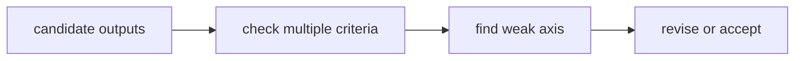
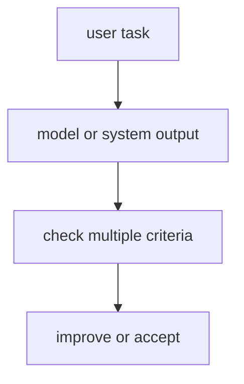

# P6-15.1 LLM 평가(evaluation)

> Section ID: `P6-15.1`
> Version: `v2026.07.07`

P6-14.2에서는 하네스(harness)가 에이전트 실행을 감싸고 기록하고 평가하는 운영 장치에 가깝다는 점을 보았습니다. 이 절에서는 LLM 기반 시스템의 품질을 실제로 무엇으로 점검해야 하는지 다룹니다.

Part 6에서 `평가(evaluation)`, `모델 평가와 시스템 평가의 구분`, `정확성·유용성·안전성·근거성을 함께 보는 기준`에 대한 첫 상세 설명은 이 절에서 잡습니다. 뒤 절에서는 현재 맥락에 필요한 최소 설명만 남기고, LLM 평가 축의 기본 뜻은 이 절과 개념사전을 기준으로 다시 연결합니다.

LLM 평가(evaluation)는 답변이 그럴듯한지만 보는 일이 아니라, 정확성, 유용성, 안전성, 근거성, 실행 결과를 기준에 따라 점검하는 일입니다. 즉, 답이 좋아 보이는지 묻는 일이 아니라 무엇이 좋고 무엇이 아직 위험한지를 항목별로 확인하는 일에 가깝습니다.

## 이 절의 범위

이 절은 다음 질문에 답합니다.

- LLM 평가는 왜 어려운가?
- 무엇을 평가해야 하는가?
- 모델 평가와 시스템 평가를 왜 구분해야 하는가?

이 절에서는 다음 내용을 깊게 다루지 않습니다.

- 벤치마크 점수 상세 비교
- 통계적 유의성 검정 세부
- 대규모 평가 플랫폼 구현

평가 축의 큰 그림은 여기서 잡고, 자동 평가와 사람 평가의 역할 분담은 바로 다음 P6-15.2에서 다시 회수합니다. 운영 제약 안에서 평가를 어떻게 읽을지는 P6-16.1 서비스 운영 제약과 P6-16.2 운영 중 실패 대응에서 다시 이어집니다. 반면 벤치마크 점수 상세 비교, 통계적 유의성 검정 세부, 대규모 평가 플랫폼 구현은 현재 본편 범위 밖에 두고, 먼저 `무엇을 나눠 평가해야 하는가`라는 기준을 세우는 데 집중합니다.

이 절에서는 평가를 `정답률 하나 보는 일`로 줄이지 않고, 생성형 AI와 에이전트 구조에 맞는 다층 평가 문제로 설명합니다.

지금 읽는 층위는 다음과 같습니다.

| 단계 | 지금 붙잡을 질문 | 바로 이어지는 위치 |
| --- | --- | --- |
| 하네스 실행 기록 | 어떤 실행 흔적을 남겼는가? | P6-14.1, P6-14.2 |
| LLM 평가 품질 판정 | 그 흔적과 답을 어떤 품질 기준으로 가를 것인가? | P6-15.1 |
| 운영 연결 | 그 판정을 자동/사람 분담과 서비스 제약으로 어떻게 넘길 것인가? | P6-15.2, P6-16 |

즉, 지금 장의 핵심은 `기록을 남겼는가`에서 `그 기록과 답을 어떤 기준으로 판정할까`로 관점이 바뀌는 데 있습니다.

즉, 여기서는 더 이상 `모델이 무엇을 할 수 있는가`를 늘리지 않습니다. 앞 절까지 만든 생성, 검색, 실행 구조를 두고 `무엇을 기준으로 괜찮다고 판단할 것인가`를 읽는 단계입니다. 이 기준이 잡혀야 뒤의 운영 절도 `문제 나열`이 아니라 `어떤 축에서 실패했는가`를 다시 추적하는 절로 읽힙니다.

이 절은 Part 6에서 평가(evaluation)를 대표로 설명하는 Section입니다. 이후 자동 평가와 사람 평가의 분업, 운영 제약, 실패 대응도 모두 여기서 세운 평가 축을 기준으로 다시 읽습니다.

특히 바로 앞 P6-14.2에서 남긴 trace, tool call log, replay 정보는 여기서 곧바로 평가 입력으로 다시 읽어야 합니다. 답변 문장만 보면 놓치는 실패도 실행 기록을 함께 보면 `검색이 약했는가`, `도구 호출이 과했는가`, `승인 경로가 비었는가`처럼 다른 평가 축으로 분리할 수 있기 때문입니다.

이 경계를 더 또렷하게 보려면 같은 실행 기록을 세 층위에서 나란히 읽어 보는 편이 좋습니다.

| 같은 기록 | P6-14 하네스에서 읽는 질문 | P6-15 평가에서 읽는 질문 | P6-16 운영에서 다시 읽는 질문 |
| --- | --- | --- | --- |
| 검색 문서와 근거 문단 | 무엇을 읽고 답했는가? | 답이 실제 근거와 맞는가? | 검색 범위와 문서 선택 비용이 감당 가능한가? |
| tool call log | 어떤 순서로 무엇을 호출했는가? | 필요한 호출이었는가, 과도한 호출이었는가? | 지연 시간과 실패 지점을 어디서 줄일 것인가? |
| approval, replay 기록 | 같은 실행을 다시 설명할 수 있는가? | 자동 통과, 사람 검토, 재수정 중 어디로 보낼 것인가? | 실제 서비스에서 stop, fallback, 재시도를 어디에 둘 것인가? |

즉, 같은 trace라도 하네스에서는 `남겼는가`, 평가에서는 `통과 기준을 만족하는가`, 운영에서는 `계속 감당 가능한가`로 질문이 바뀝니다.

여기서 먼저 남겨야 할 것은 어떤 축에서 통과했고 어떤 축에서 탈락했는지를 보여 주는 축별 점수와 수정 메모, 그리고 무엇을 먼저 고쳐야 하는지를 보여 주는 검토 요약과 우선 수정 항목입니다.

## 이 절의 목표

- LLM 평가를 입문 수준에서 설명할 수 있습니다.
- 정확성, 유용성, 안전성, 근거성 같은 평가 축을 구분할 수 있습니다.
- 모델 평가와 시스템 평가의 차이를 말할 수 있습니다.
- 다음 절의 자동 평가와 사람 평가 비교로 자연스럽게 넘어갈 수 있습니다.

## 이 절을 읽는 순서

이 절은 다음 순서로 읽으면 이해가 덜 흩어집니다.

1. 먼저 왜 LLM 평가가 한 점수로 끝나기 어려운지 읽습니다.
2. 그다음 평가 축과 모델 평가, 시스템 평가의 차이를 구분합니다.
3. 사례와 Python 예제에서는 `같은 답변 후보라도 어떤 축에서 탈락하고 어떤 수정이 필요한가`를 확인합니다.

## 왜 LLM 평가는 어려운가

전통적인 분류 문제에서는 정답 레이블이 분명한 경우가 많습니다. 하지만 생성형 AI에서는 다음과 같은 어려움이 생깁니다.

| 질문 | 짧은 답 |
| --- | --- |
| 왜 평가가 어려운가? | 답이 하나만 있는 문제가 아니기 때문 |
| 무엇이 더 복잡해졌는가? | 자연스러움, 사실성, 형식, 근거를 함께 봐야 함 |
| 그래서 어떻게 읽어야 하는가? | 한 점수보다 여러 평가 축으로 읽어야 함 |

- 답이 하나만 있는 것이 아닐 수 있음
- 문장은 자연스러운데 사실은 틀릴 수 있음
- 내용은 맞지만 형식이 부적절할 수 있음
- 답변은 좋아 보여도 근거가 약할 수 있음

즉, LLM 평가는 `맞다/틀리다` 한 줄로 끝나지 않는 경우가 많습니다.

이 점은 전통적인 머신러닝 평가와의 중요한 차이입니다. 분류 문제에서는 `맞았는가`가 중심이었다면, 생성형 AI에서는 `어떻게 맞았는가`, `무엇은 맞고 무엇은 부족한가`까지 같이 봐야 합니다.

## 무엇을 평가해야 하나

이 절에서는 먼저 다음 평가 축을 구분해 두어야 합니다.

| 평가 축 | 중심 질문 |
| --- | --- |
| 정확성(accuracy / correctness) | 사실과 계산이 맞는가? |
| 유용성(helpfulness) | 사용자의 일을 실제로 돕는가? |
| 안전성(safety) | 해로운 결과를 줄이는가? |
| 근거성(groundedness) | 답이 주어진 문서나 근거와 연결되는가? |
| 형식 적합성(format compliance) | 요청한 형식과 제약을 따르는가? |

이 축을 나눠 보지 않으면, 유창한 답변을 곧바로 정확하고 안전한 답변으로 오해하기 쉽습니다.

이 표를 다음 한 줄로 다시 기억해도 좋습니다.

- 정확성은 `맞는가`
- 유용성은 `도움이 되는가`
- 안전성은 `위험을 줄이는가`
- 근거성은 `어디에서 왔는가`
- 형식 적합성은 `요청한 방식대로 나왔는가`

## 모델 평가와 시스템 평가는 왜 다른가

이 구분을 먼저 잡아야 답변 실패를 볼 때, 모델이 문장을 못 만든 문제인지 검색과 근거 반영이 무너진 시스템 문제인지 나눠 볼 수 있습니다.

LLM 기반 시스템은 보통 모델만으로 이루어지지 않습니다. 예를 들어 RAG 시스템에서는:

- 검색이 잘 됐는지
- 검색 문서를 잘 읽었는지
- 답변이 근거를 잘 반영했는지

를 따로 봐야 합니다.

에이전트 시스템에서는 여기에 더해:

- 적절한 도구를 골랐는지
- 호출 인자가 맞았는지
- 실행 결과를 잘 읽었는지

도 봐야 합니다.

즉:

- 모델 평가는 `문장 생성 능력`에 더 가깝고
- 시스템 평가는 `검색, 도구, 실행, 출력까지 포함한 전체 흐름`에 가깝습니다

이 구분을 먼저 잡아야 LLM 서비스 문제를 볼 때, 문장 생성 자체의 한계인지 검색 품질, 도구 호출, 후처리 오류 같은 시스템 경로 문제인지 나눠 진단할 수 있습니다.

같은 흐름으로 다시 정리하면 다음과 같습니다.

| 평가 대상 | 주로 보는 것 |
| --- | --- |
| 모델 | 문장 생성, 형식, 추론 결과 |
| 시스템 | 검색, 도구, 실행, 응답 전체 경로 |

## 왜 한 점수로 끝내기 어렵나

여기서 바로 나오는 질문은 `그럼 점수 하나로 정리하면 안 되는가?`입니다. 하지만 실제로는 한 점수에 여러 문제가 숨습니다.

예를 들어:

- 유용성은 높지만 사실성이 낮을 수 있고
- 안전성은 높지만 지나치게 보수적일 수 있으며
- 검색은 좋지만 최종 요약이 틀릴 수 있습니다

따라서 LLM 평가는 `하나의 절대 점수`로 덮기보다, 정확성·안전성·근거성·형식 적합성 중 어느 축에서 흔들렸는지 나눠 읽는 편이 더 안전합니다.

## 왜 운영 관점에서도 중요하나

평가는 학술 벤치마크만을 위한 일이 아닙니다. 서비스 운영에서는 다음 질문과 직접 연결됩니다.

- 이 배포 버전이 이전보다 나아졌는가?
- 어떤 유형의 질문에서 실패가 늘었는가?
- 검색 품질이 떨어졌는가, 생성 품질이 떨어졌는가?
- 비용을 줄였더니 품질이 얼마나 흔들렸는가?

즉, 평가는 모델 자랑용 수치가 아니라 `변경과 운영을 통제하는 기준`입니다.

이 절을 서비스 구조 흐름 안에 놓으면 다음처럼 이어집니다.

- 프롬프트, RAG, 도구, 에이전트를 설계하고
- 실제 출력을 만들고
- 그 결과를 어떤 기준으로 유지·비교할지 정하는 단계가 evaluation입니다

이를 한 번 더 단순화하면 다음과 같습니다.



이 그림의 핵심은 evaluation이 `좋다/나쁘다`를 한 번 말하고 끝나는 단계가 아니라, 어떤 축이 약한지 찾아 다음 수정을 결정하는 단계라는 점입니다.

## 아주 단순하게 그리면



이 도식의 핵심은 출력이 나온 뒤 `무엇을 기준으로 괜찮다고 볼지`가 반드시 필요하다는 점입니다.

## 사례로 보기

이 사례들의 초점은 `결과가 좋아 보이는가`보다 `어느 평가 축에서 먼저 탈락하는가`입니다.

### 사례 1. 문서 요약 평가

회의록 요약이 문장만 매끄럽게 정리되어 있다고 해 봅시다. 사람은 첫눈에 보면 읽기 편하고 형식도 단정하니 좋은 결과라고 먼저 판단하기 쉽습니다. 하지만 실제로는 `다음 주 배포 연기`, `법무 검토 필요`, `담당자 변경` 같은 핵심 결론이 빠졌다면 이 요약은 실무에서 바로 쓸 수 없습니다. 즉, 보기 좋은 문장과 중요한 정보 보존은 다른 평가 축입니다. 예를 들어 말투는 자연스러워도 연기 사유가 빠지면, 보고용 요약으로는 실패에 가깝습니다. 이런 상태로 보고가 올라가면 읽는 사람은 일정 변경 사실만 알고 왜 연기됐는지는 다시 원문을 찾아야 할 수 있습니다. 여기서 바뀌는 점은 `문장이 자연스럽고 읽기 좋은가`를 보던 기준에서 `핵심 결론과 결정 사항이 남아 있는가`를 보는 기준으로 이동한다는 것입니다. 그래서 평가에서는 `자연스러운가`만 보지 않고 `핵심 정보가 남았는가`를 따로 확인해야 합니다. 그래서 이 사례에서 확인해야 할 결과는 문장 매끄러움과 별개로 배포 연기, 법무 검토, 담당자 변경 같은 핵심 항목이 실제로 남아 있는가입니다.

### 사례 2. RAG 기반 질의응답

RAG 답변이 매우 유창하게 나왔는데, 실제 검색 문서에는 없는 숫자나 조건을 덧붙였다고 해 봅시다. 사람은 문장이 매끄러우면 일단 신뢰하기 쉬워서, 근거 문서와 한 줄씩 대조하지 않으면 이런 차이를 놓칠 수 있습니다. 예를 들어 문서에는 `기본 14일`만 있는데 답변이 `개봉 제품도 30일 가능`처럼 없는 조건을 붙이면, 말은 자연스러워도 근거성은 무너집니다. 인용 링크가 있어도 실제 인용 문단이 그 조건을 말하지 않는다면, 형식은 맞아 보여도 groundedness는 실패입니다. 이런 답이 그대로 고객 안내에 쓰이면 문체는 매끄러워도 정책 위반 답변이 될 수 있습니다. 여기서 바뀌는 점은 `답변이 유창하고 그럴듯한가`를 보던 기준에서 `답변의 각 조건이 실제 근거 문서와 맞물리는가`를 보는 기준으로 이동한다는 것입니다. 하지만 RAG에서 중요한 것은 `그럴듯함`보다 `붙인 근거와 실제로 맞는가`입니다. 그래서 이 경우 평가는 답변 문장 자체보다 검색 문서와의 일치 여부, 근거 인용의 정확성을 따로 확인해야 합니다. 그래서 이 사례에서 확인해야 할 결과는 답변의 숫자와 조건이 인용 문서에 실제로 존재하는가입니다.

### 사례 3. 에이전트 실행 평가

에이전트가 최종적으로 보고서를 잘 만들어 냈다고 해 봅시다. 사람은 결과물만 보면 우선 성공처럼 느끼기 쉽습니다. 하지만 중간에 같은 문서를 여러 번 읽고, 실패한 검색을 반복하고, 필요 없는 도구 호출을 계속했다면 실제 운영 비용과 지연 시간은 크게 나빠질 수 있습니다. 최종 산출물만 보면 이런 실행 비효율은 거의 보이지 않습니다. 예를 들어 한 번의 검색으로 충분했던 작업을 다섯 번 반복했다면, 결과는 맞아도 실서비스 운영성은 나쁘다고 봐야 합니다. 이 비효율이 누적되면 한 건은 성공해도 여러 요청이 몰릴 때 전체 시스템이 느려질 수 있습니다. 여기서 바뀌는 점은 `최종 결과물만 맞게 나왔는가`를 보던 기준에서 `그 결과에 도달하는 실행 경로가 효율적이고 안정적인가`를 보는 기준으로 이동한다는 것입니다. 그래서 평가에서는 `결과가 맞는가`와 함께 `어떤 경로로 그 결과에 도달했는가`를 따로 봐야 합니다. 그래서 이 사례에서 확인해야 할 결과는 최종 보고서 품질과 별개로 도구 호출 횟수, 실패 재시도, 우회 경로가 과도하지 않은가입니다.

세 사례를 한 줄로 묶으면 다음과 같습니다.

| 상황 | 평가에서 특히 봐야 하는 것 |
| --- | --- |
| 요약 | 핵심 정보 보존 여부 |
| RAG 질의응답 | 문서 근거와 답변 일치 여부 |
| 에이전트 실행 | 최종 결과뿐 아니라 실행 경로와 비용 |

세 사례를 평가 축 관점으로 다시 묶으면 다음과 같습니다.

| 상황 | 겉으로 좋아 보여도 놓치기 쉬운 것 | 따로 점검해야 하는 평가 축 |
| --- | --- | --- |
| 문서 요약 | 문장이 매끄러워도 핵심 결정이 빠질 수 있음 | 핵심 정보 보존, 누락 여부 |
| RAG 질의응답 | 출처가 있어 보여도 문서 바깥 조건을 덧붙일 수 있음 | groundedness, 인용 정확성 |
| 에이전트 실행 | 결과는 맞아도 경로가 비효율적일 수 있음 | 호출 횟수, 재시도, 실행 비용 |

## 실행 가능한 Python 예제로 보기

이번 예제의 목표는 LLM 평가가 한 항목이 아니라 여러 축이라는 점을 실제 판정값으로 보고, 그 결과로 `어떤 후보를 채택할지`와 `무엇을 먼저 고칠지`를 읽는 것입니다. 하나의 답변만 보면 `맞았다` 또는 `틀렸다`로 쉽게 끝나 버리므로, 이번에는 같은 질문에 대한 여러 후보 답변을 나란히 두고 어떤 축에서 갈라지는지 보겠습니다.

문제 상황:

- 고객 지원 시스템이 같은 환불 정책 질문에 대해 여러 답변 후보를 만듦
- 어떤 답은 숫자는 맞지만 형식이 불완전하고, 어떤 답은 문장은 자연스럽지만 문서에 없는 조건을 덧붙임
- 최종 선택 전에 어떤 답이 어느 축에서 흔들리는지 나눠 봐야 함

입력:

- 여러 개의 출력 후보
- 비교할 근거 문서 문장
- 형식 요구 조건과 필수 포함 정보

출력:

- 답변 후보별 평가 보고서
- 어떤 후보가 정확성, 근거성, 형식 적합성, 유용성에서 각각 흔들리는지에 대한 요약값
- 어떤 후보를 우선 채택할지와 각 후보의 다음 수정 방향

먼저 이 예제에서 함께 볼 평가 기준은 다음과 같습니다.

| 점검 항목 | 왜 필요한가 |
| --- | --- |
| `correctness` | 숫자나 조건이 실제 정책과 맞는지 확인해야 해서 |
| `groundedness` | 답변의 조건이 근거 문서 안에 실제로 있는지 봐야 해서 |
| `format_compliance` | 요청한 형식과 마무리 문장을 지켰는지 확인해야 해서 |
| `helpfulness` | 사용자가 바로 쓸 수 있게 핵심 행동 지침이 들어 있는지 봐야 해서 |
| `next_fix` | 탈락한 후보를 어떤 축부터 고쳐야 하는지 정해야 해서 |

문제 상황:

- 자동 평가는 정답 여부만 보지 않고 근거성, 형식 준수, 도움됨까지 여러 축으로 답안을 읽어야 한다

입력(input):

위에 정리한 source text, required phrase, 후보 답변 목록을 사용합니다.

확인할 개념:

- 자동 평가는 정답 여부만이 아니라 근거성, 형식 준수, 도움됨 같은 여러 축을 함께 점수화해야 한다

```python
from pprint import pprint


source_text = "2026-06-29 정책 공지: 환불 요청 처리 기한이 7일에서 14일로 변경됨"
required_phrase = "환불 요청 처리 기한"
answers = [
    {
        "name": "answer_a",
        "text": "환불 요청 처리 기한은 14일로 변경되었습니다. 최신 정책 기준으로 접수해 주세요.",
    },
    {
        "name": "answer_b",
        "text": "환불 요청 처리 기한은 30일입니다. 최신 정책 기준으로 접수해 주세요.",
    },
    {
        "name": "answer_c",
        "text": "환불은 빨라졌습니다",
    },
    {
        "name": "answer_d",
        "text": "환불 요청 처리 기한은 14일로 변경되었고 개봉 제품도 30일 환불 가능합니다.",
    },
]


def evaluate_answer(answer_text, source_text, required_phrase):
    mentions_14_days = "14일" in answer_text
    mentions_30_days = "30일" in answer_text
    source_mentions_14_days = "14일" in source_text

    correctness = mentions_14_days and source_mentions_14_days and not mentions_30_days
    groundedness = required_phrase in answer_text and "개봉 제품" not in answer_text
    format_compliance = answer_text.endswith(".") and "최신 정책 기준" in answer_text
    helpfulness = "접수" in answer_text or "문의" in answer_text

    if not correctness:
        next_fix = "fix_fact_or_numeric_condition"
    elif not groundedness:
        next_fix = "remove_claim_not_supported_by_source"
    elif not format_compliance:
        next_fix = "rewrite_to_required_format"
    elif not helpfulness:
        next_fix = "add_actionable_guidance"
    else:
        next_fix = "accept_candidate"

    return {
        "correctness": correctness,
        "groundedness": groundedness,
        "format_compliance": format_compliance,
        "helpfulness": helpfulness,
        "passes_all": correctness and groundedness and format_compliance and helpfulness,
        "axis_score": sum([correctness, groundedness, format_compliance, helpfulness]),
        "next_fix": next_fix,
    }


reports = []
for answer in answers:
    evaluation = evaluate_answer(answer["text"], source_text, required_phrase)
    reports.append({"name": answer["name"], "text": answer["text"], "evaluation": evaluation})

best_candidate = max(reports, key=lambda report: report["evaluation"]["axis_score"])

summary = {
    "all_pass_count": sum(report["evaluation"]["passes_all"] for report in reports),
    "correct_count": sum(report["evaluation"]["correctness"] for report in reports),
    "grounded_count": sum(report["evaluation"]["groundedness"] for report in reports),
    "format_ok_count": sum(report["evaluation"]["format_compliance"] for report in reports),
    "helpful_count": sum(report["evaluation"]["helpfulness"] for report in reports),
    "average_axis_score": round(
        sum(report["evaluation"]["axis_score"] for report in reports) / len(reports), 2
    ),
    "best_candidate": best_candidate["name"],
}

print("[summary]")
pprint(summary)
print("[source_text]")
print(source_text)
print()

for report in reports:
    print("=" * 80)
    print("[answer]")
    print(report["name"])
    print(report["text"])
    print("[evaluation]")
    pprint(report["evaluation"])
```

실행 결과 예시는 다음처럼 읽을 수 있습니다.

```text
[summary]
{'all_pass_count': 1,
 'average_axis_score': 2.0,
 'best_candidate': 'answer_a',
 'correct_count': 1,
 'format_ok_count': 2,
 'grounded_count': 2,
 'helpful_count': 2}
[source_text]
2026-06-29 정책 공지: 환불 요청 처리 기한이 7일에서 14일로 변경됨
================================================================================
[answer]
answer_a
환불 요청 처리 기한은 14일로 변경되었습니다. 최신 정책 기준으로 접수해 주세요.
[evaluation]
{'axis_score': 4,
 'correctness': True,
 'format_compliance': True,
 'groundedness': True,
 'helpfulness': True,
 'next_fix': 'accept_candidate',
 'passes_all': True}
================================================================================
[answer]
answer_b
환불 요청 처리 기한은 30일입니다. 최신 정책 기준으로 접수해 주세요.
[evaluation]
{'axis_score': 3,
 'correctness': False,
 'format_compliance': True,
 'groundedness': True,
 'helpfulness': True,
 'next_fix': 'fix_fact_or_numeric_condition',
 'passes_all': False}
================================================================================
[answer]
answer_c
환불은 빨라졌습니다
[evaluation]
{'axis_score': 0,
 'correctness': False,
 'format_compliance': False,
 'groundedness': False,
 'helpfulness': False,
 'next_fix': 'fix_fact_or_numeric_condition',
 'passes_all': False}
================================================================================
[answer]
answer_d
환불 요청 처리 기한은 14일로 변경되었고 개봉 제품도 30일 환불 가능합니다.
[evaluation]
{'axis_score': 0,
 'correctness': False,
 'format_compliance': False,
 'groundedness': False,
 'helpfulness': False,
 'next_fix': 'fix_fact_or_numeric_condition',
 'passes_all': False}
```

이 예제에서 먼저 봐야 할 것은 `correct_count`와 `grounded_count`, `format_ok_count`, `helpful_count`가 서로 다르게 나오고, `best_candidate`와 `next_fix`가 그 차이를 운영 판단으로 바꿔 준다는 점입니다. 즉, 같은 질문에 대한 답이라도 어떤 후보는 형식과 유용성은 괜찮지만 숫자가 틀리고, 어떤 후보는 숫자와 조건을 함께 틀리며, 어떤 후보는 문장이 짧아 형식과 유용성까지 한꺼번에 무너집니다. 평가가 단일 점수 하나였다면 이런 차이는 바로 묻히기 쉽습니다.

그래서 이 예제에서 확인해야 할 결과는 하나의 질문에 대한 답변 후보들도 정확성, 근거성, 형식성, 유용성 같은 여러 축에서 따로 판정할 수 있으며, 평가가 단일 점수 하나로 끝나지 않는다는 점입니다.

이 예제에서 독자가 직접 해 볼 수 있는 조정은 다음과 같습니다.

- `answer_b`의 숫자를 `14일`로 바꿔 정확성만 회복되는지 보기
- `answer_d`에서 `개봉 제품도 30일` 문구를 지워 근거성이 어떻게 달라지는지 보기
- `format_compliance` 조건에서 `최신 정책 기준` 요구를 빼면 형식 점검이 얼마나 느슨해지는지 확인하기

## 이 예제를 평가 관점으로 다시 보면

앞의 예제는 점수표를 만드는 코드가 아니라, `같은 질문에 대한 여러 출력 후보도 축마다 전혀 다르게 읽혀야 한다`는 점을 가장 작게 보여 주는 장면입니다. 여기서 중요한 것은 새 사례를 추가하는 것이 아니라, 평가를 단일 점수 대신 여러 점검 축과 배치 비교로 읽는 습관을 만드는 데 있습니다.

이 예제에서 읽어야 할 핵심은 다음입니다.

- 출력 문장은 하나여도
- 검토 질문은 여러 개일 수 있고
- 따라서 평가도 한 줄 결론보다 항목별 점검표에 가깝다는 점입니다

여기까지를 한 줄로 묶으면, LLM evaluation은 `점수 한 개를 매기는 일`이 아니라 `어느 후보를 채택하고 어느 축부터 고쳐야 하는지 결정하는 비교 기준`입니다.

서비스로 이어지는 단계에서는 `말을 잘하는가`보다 `믿고 운영할 수 있는가`를 더 직접적으로 가려야 합니다. 그래서 evaluation은 출력 감상이 아니라, 어떤 후보를 채택하고 어느 축부터 다시 고칠지 정하는 운영 기준으로 읽는 편이 좋습니다.

커리큘럼 관점에서 이 절이 중요한 이유는 다음과 같습니다.

- 바로 앞의 P6-14.1, P6-14.2에서 도구 연결과 실행 구조를 봤다면, 이제 그 구조가 실제로 `좋은 답을 만들고 있는가`를 운영 기준으로 점검하게 하고
- 평가를 모델 성능 자랑이 아니라 운영 기준으로 읽게 하고
- 다음 절의 자동 평가와 사람 평가 비교를 준비시키며
- 이후 결과를 검증하는 기준을 미리 만들어 주기 때문입니다

## 다음 절과의 연결

여기까지 오면 다음 질문이 남습니다.

- 이런 평가를 자동으로 할 수 있는가?
- 결국 사람의 검토가 왜 여전히 필요한가?

이 질문은 P6-15.2 자동 평가와 사람 평가로 이어집니다.

## 언제 평가 관점을 먼저 떠올려야 하는가

| 상황 | 먼저 떠올릴 관점 | 왜 중요한가 |
| --- | --- | --- |
| 결과가 그럴듯해 보이는데도 실제 품질이 의심될 때 | 한 점수보다 여러 평가 축을 나눠 봐야 한다는 점 | 자연스러운 문장과 정확성, 근거성, 안전성은 서로 다른 축이라 따로 확인해야 합니다. |
| 답변 실패 원인이 모델 문제인지 시스템 문제인지 헷갈릴 때 | 모델 평가와 시스템 평가를 구분해야 한다는 점 | 검색, 도구 호출, 후처리 실패를 모델 탓으로만 보면 수정 방향이 어긋납니다. |
| 하네스 기록을 남겼는데 그것을 어떻게 읽어야 할지 감이 오지 않을 때 | 기록을 품질 판정 기준으로 바꾸는 단계라는 점 | trace와 tool log는 남겼다는 사실로 끝나지 않고, 어떤 축에서 통과·탈락했는지 읽어야 실제 개선으로 이어집니다. |

## 이 절에서 기억할 관점

- LLM 평가는 문장이 자연스러운가만 보는 일이 아니라, 정확성, 유용성, 안전성, 근거성이 실제로 함께 만족되는지 나눠 점검하는 일입니다.
- 같은 답변 실패라도 모델 자체 문제인지, 검색·도구·후처리까지 포함한 시스템 문제인지 구분해서 봐야 합니다.
- 하나의 절대 점수보다 여러 평가 축을 함께 보는 편이 더 안전합니다.
- 평가는 서비스 운영과 개선의 직접 기준입니다.

## 짧은 점검

- 평가를 `정답률 하나 확인하는 일`이 아니라 `여러 품질 축으로 통과와 탈락을 가르는 일`로 설명할 수 있어야 합니다.
- 모델 평가와 시스템 평가를 나눠 봐야 같은 실패의 원인을 더 정확히 좁힐 수 있다는 점을 말할 수 있어야 합니다.
- 다음 절은 평가를 반복 설명하는 절이 아니라, 이 평가 축을 자동 검사와 사람 검토로 어떻게 분업할지로 질문이 이동한다는 점을 잡고 있어야 합니다.

## 언제 이 관점을 먼저 떠올려야 하는가

- LLM 평가를 입문 수준에서 설명할 수 있는가?
- 어떤 평가 축이 필요한지 말할 수 있는가?
- 모델 평가와 시스템 평가의 차이를 설명할 수 있는가?
- 왜 다음 절에서 자동 평가와 사람 평가를 나눠 봐야 하는지 말할 수 있는가?

## 출처와 참고 자료

- OpenAI, [Working with evals](https://developers.openai.com/api/docs/guides/evals){: target="_blank" rel="noopener noreferrer" }, OpenAI API Docs, 확인 날짜: 2026-07-05.
- OpenAI, [Evaluate agent workflows](https://developers.openai.com/api/docs/guides/agent-evals){: target="_blank" rel="noopener noreferrer" }, OpenAI API Docs, 확인 날짜: 2026-07-05.
- Yuzheng Chang et al., [A Survey on Evaluation of Large Language Models](https://arxiv.org/abs/2307.03109){: target="_blank" rel="noopener noreferrer" }, arXiv, 2023, 확인 날짜: 2026-07-05.
