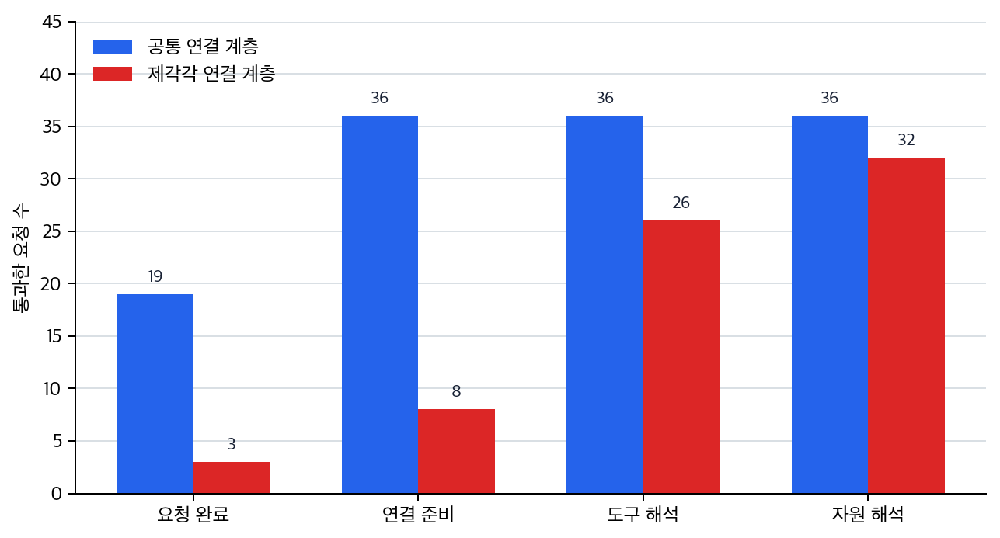

# P6-15.1 도구와 자원을 공통 형식으로 연결하는 MCP

> Section ID: `P6-15.1`
> Version: `v2026.07.23`

P6-14.2에서는 에이전트(agent)가 계획, 행동, 관찰의 반복 구조를 가진다는 점을 보았습니다. 이제는 이런 도구와 상태를 여러 시스템 사이에서 더 일관되게 연결하려면 무엇이 필요한지 봐야 합니다.

MCP(Model Context Protocol)는 모델, 에이전트, 애플리케이션이 외부 도구와 데이터에 더 일관되게 연결되도록 돕는 인터페이스 관점입니다. 즉, 여러 도구와 데이터를 제각각 붙이지 말고 더 일정한 방식으로 연결하자는 약속에 가깝습니다.

## 도구와 자원을 잇는 공통 연결 형식

핵심 질문은 다음과 같습니다.

- 왜 도구 연결에 표준화된 인터페이스 관점이 필요한가?
- MCP를 어떤 역할로 이해하면 좋은가?
- MCP는 모델 자체가 아니라 어떤 연결 문제를 다루는가?

먼저 닫을 문제는 `도구와 자원을 어떤 공통 형식으로 연결할 것인가`입니다. 실행을 감싸는 운영 장치는 연결을 쓴 실행을 어떻게 기록하고 재현할지의 문제이고, 인증과 권한이 실제 실패 대응과 만나는 지점은 운영 통제의 문제로 남습니다.

여기서는 MCP를 `도구 연결을 덜 제각각으로 만들려는 표준화 관점`으로 읽습니다.

에이전트 루프가 `여러 읽기와 실행을 어떤 반복 구조로 이어 갈까`를 다뤘다면, MCP 관점은 그 루프가 쓰는 도구와 자원을 어떤 공통 형식으로 드러내야 다음 실행과 기록이 덜 흔들리는지 다룹니다. 여기서는 `모델 컨텍스트 프로토콜(Model Context Protocol, MCP)`을 `모델 능력`과 `도구 연결 형식`을 섞지 않게 하는 공통 연결 인터페이스로 읽는 기준을 잡습니다. 실행 기록과 재현 환경은 P6-15.2의 하네스에서 따로 봅니다.

여기서 먼저 못 박을 것은 어떤 도구와 자원을 어떤 공통 형식으로 노출할지와 연결 인터페이스를 일정하게 만드는 일입니다.

| MCP에서 먼저 정리할 기록 | 왜 필요한가 | 이후 다시 읽는 기록 |
| --- | --- | --- |
| 도구 설명과 자원 설명 | 어떤 도구와 자원이 어떤 이름·입력 형식으로 연결되는지 남겨야 호출 실패와 연결 불일치를 줄일 수 있어서 | P6-15.2의 trace/replay와 도구 연결 메모로 이어집니다 |
| 권한 경계와 승인 조건 | 어떤 호출이 바로 실행 가능하고 어떤 호출이 승인을 거쳐야 하는지 남겨야 운영 실패를 줄일 수 있어서 | P6-15.2의 승인 기록, P6-17.2의 실패 대응으로 이어집니다 |

`공통 형식`이라는 말이 아직 추상적으로 느껴질 수 있습니다. 이때는 프로토콜 이름을 먼저 외우기보다, 같은 목표를 처리할 때 도구마다 입력 형식이 제각각이면 어디서 먼저 흔들리는지를 떠올리는 편이 더 안전합니다.

예를 들어 한 에이전트가 아래 세 가지를 같이 써야 한다고 해 봅시다.

- 검색 도구: `query`, `top_k`
- 파일 읽기 도구: `path`
- 일정 조회 도구: `date`, `room_id`

이 셋이 서로 전혀 다른 규칙으로만 붙어 있으면, 에이전트는 `무슨 정보를 넘길까`보다 `이번 도구는 어떤 모양으로 불러야 하지`를 먼저 신경 써야 합니다. 검색 결과를 읽기 단계로 넘길 때는 경로가 필요하고, 일정 조회로 넘어갈 때는 다시 날짜와 방 ID 형식이 필요하므로, 중간 변환과 예외 처리가 빠르게 늘어납니다.

반대로 공통 연결 관점이 있으면, 에이전트는 먼저 `검색 가능한 도구`, `읽을 수 있는 자원`, `조회 가능한 도구`가 어떤 이름과 입력 형식으로 노출되는지 일정한 방식으로 확인할 수 있습니다. 즉, MCP는 개별 도구의 목적을 바꾸는 것이 아니라 `다음 단계에 무엇을 넘길 수 있는가`를 더 예측 가능하게 만드는 층으로 읽는 편이 맞습니다.

같은 장면을 아주 짧게 줄이면 다음과 같습니다.

| 같은 목표 흐름에서 먼저 흔들리는 것 | 공통 연결 관점이 약할 때 | 공통 연결 관점이 있을 때 |
| --- | --- | --- |
| 어떤 도구를 고를지 | 도구마다 설명 위치와 이름 체계가 달라 선택부터 헷갈리기 쉽습니다. | 어떤 도구와 자원이 노출되는지 한 방식으로 확인하기 쉬워집니다. |
| 다음 단계에 무엇을 넘길지 | 검색 결과, 경로, 조회 인자를 매번 다른 형식으로 바꿔야 합니다. | 다음 단계가 기대하는 입력 형식을 더 예측 가능하게 맞추기 쉬워집니다. |
| 실패 원인을 어디서 찾을지 | 모델 판단 문제인지 연결 형식 문제인지 섞여 보이기 쉽습니다. | 연결 규칙과 실행 판단을 더 분리해 다시 보기 쉬워집니다. |

## 모델 능력과 도구 연결 규칙의 구분

- MCP를 입문 수준에서 설명할 수 있습니다.
- 모델 능력과 연결 인터페이스를 구분할 수 있습니다.
- 왜 agent와 tool use가 커질수록 연결 표준이 중요해지는지 말할 수 있습니다.
- 연결된 실행을 하네스(harness) 기록 환경으로 남겨야 하는 이유를 말할 수 있습니다.

이 연결 계층이 중요한 이유는 다음과 같습니다.

- 바로 앞의 P6-13.1, P6-13.2 도구 사용 구조와 P6-14.1, P6-14.2 에이전트 실행 구조를 `연결 계층` 관점에서 다시 읽게 하고
- agent와 tool use를 시스템 연결 문제까지 확장해 읽게 하며
- 하네스와 운영 실패 대응으로 이어질 준비를 시키기 때문입니다

먼저 가를 장면은 아래처럼 정리할 수 있습니다.

| 먼저 보인 막힘 | 먼저 떠올릴 질문 | 왜 이 질문이 먼저 필요한가 |
| --- | --- | --- |
| 같은 목표를 처리하는데 도구마다 이름과 입력 형식이 너무 달라 호출 전부터 흔들린다 | 어떤 도구와 자원이 어떤 이름과 입력 형식으로 노출되는가? | 연결 형식이 제각각이면 모델 판단보다 형식 변환과 예외 처리부터 먼저 늘어나기 때문입니다. |
| 호출은 성공했는데 반환값 모양이 달라 다음 단계가 자꾸 끊긴다 | 응답 형식도 공통 규칙으로 읽히는가? | 입력만 맞춰도 출력 구조가 제각각이면 다음 단계 연결이 다시 불안정해지기 때문입니다. |
| 도구는 늘었는데 어떤 것을 먼저 써야 하는지 설명이 제각각이다 | 도구 설명과 자원 설명을 한 방식으로 확인할 수 있는가? | 선택 기준이 흩어져 있으면 같은 목표 흐름도 도구 선택부터 흔들리기 때문입니다. |
| 권한이 필요한 호출과 바로 실행 가능한 호출이 섞여 있다 | 권한 경계와 승인 조건이 연결 설명 안에서 같이 보이는가? | 승인 문제를 뒤늦게 알면 연결 성공과 운영 실패를 같은 오류처럼 뭉개기 쉽기 때문입니다. |

이 표를 기준으로 아래 내용을 읽으면, MCP를 `프로토콜 이름`보다 `도구와 자원을 덜 제각각으로 연결하게 만드는 공통 형식`으로 더 직접 읽을 수 있습니다.

## 왜 표준 연결이 필요해지나

도구 사용이 한두 개일 때는 개별 연결을 직접 만들어도 됩니다. 하지만 에이전트 구조가 커지면 도구 수가 늘고, 연결 방식이 제각각이 되기 쉽습니다. MCP 같은 연결 관점은 도구 설명, 요청 형식, 응답 형식을 일정하게 맞추어 모델보다 주변 연결 환경이 덜 혼란스럽게 만들려는 시도입니다.

- 어떤 도구는 파일을 읽고
- 어떤 도구는 검색을 하고
- 어떤 도구는 데이터베이스를 조회하고
- 어떤 도구는 API를 호출하고

이런 연결이 모두 제각각이면, 시스템은 점점 다루기 어려워집니다.

다음처럼 이해하면 좋습니다.

`도구가 늘어날수록, 모델이 무엇을 쓸 수 있고 어떤 형식으로 써야 하는지를 일정하게 맞추지 않으면 연결 방식마다 실패 원인이 달라진다.`

서비스 구조 관점으로 다시 말하면, tool use는 `도구를 부른다`에 가깝고, MCP는 `그 도구들을 어떤 공통 형식으로 드러낼까`를 다루는 단계입니다.

이 차이를 한 번 더 단순화하면 다음과 같습니다.

```mermaid
--8<-- "assets/part-06/chapter-15/p6-c15-s01-mcp-task-tool-flow-ko.mmd"
```

이 그림에서 핵심은 에이전트가 매번 도구마다 다른 사적 규칙을 외우는 대신, 공통 연결 규칙을 통해 도구와 자원을 본다는 점입니다.

## MCP는 무엇을 표준화하려 하나

MCP를 기술 세부보다 먼저 역할 기준으로 이해하면 연결 문제를 더 쉽게 구분할 수 있습니다.

MCP가 다루는 핵심은 다음과 같습니다.

- 어떤 도구가 있는가
- 어떤 데이터나 리소스를 읽을 수 있는가
- 어떤 형식으로 요청하고 응답할 것인가

즉, MCP는 보통 `모델이 더 똑똑해지는 방법`이 아니라, `모델과 외부 시스템이 덜 혼란스럽게 연결되는 방법`으로 읽는 편이 정확합니다.

여기서 `모델이 스스로 더 잘하게 되는 변화`와 `외부 도구 연결 방식이 정리되는 변화`를 분리해서 봐야, 성능 문제와 연결 문제를 같은 층위로 섞지 않게 됩니다.

## 왜 모델 자체와 구분해야 하나

이 구분을 먼저 잡아야 모델 자체 한계인지, 도구 노출 방식과 연결 설계 문제인지 원인을 나눠 볼 수 있습니다.

모델은:

- 텍스트를 이해하고 생성하는 능력

을 중심으로 합니다.

반면 MCP 같은 연결 관점은:

- 외부 도구와 데이터에 접근하는 방법
- 그 접근 형식의 일관성

을 중심으로 합니다.

따라서 MCP는 `모델 내부 능력`이 아니라 `주변 실행 환경의 연결 문제`에 가깝습니다.

## 왜 여러 도구 흐름에서 중요해지나

단일 프롬프트 기반 사용에서는 연결 문제가 비교적 단순했습니다. 하지만 agent 구조가 등장하면 다음이 같이 필요해집니다.

- 파일 읽기
- 검색
- 코드 실행
- 데이터 조회
- 상태 전달

이처럼 여러 도구가 한 작업 흐름 안에서 엮일수록, 도구 설명 방식과 호출 방식이 일정해야 시스템이 커지기 쉽습니다.

즉, MCP는 `여러 도구와 자원을 한 흐름 안에서 함께 다뤄야 하는 장면`에서 더 직접적으로 필요해지는 관점입니다.

## MCP가 있으면 무엇이 쉬워지나

먼저 다음 세 가지를 붙잡아 두면 됩니다.

- 도구 목록을 일정한 방식으로 드러내기 쉬워짐
- 요청/응답 구조를 더 일관되게 유지하기 쉬워짐
- 여러 시스템을 바꿔도 연결 관점을 재사용하기 쉬워짐

즉, MCP는 `새 능력 생성기`라기보다 `연결 정리 도구`에 가깝습니다.

같은 요청 흐름으로 다시 정리하면 다음과 같습니다.

- 프롬프트: 요청을 적는다
- RAG: 읽을 문서를 붙인다
- 도구 사용: 실행할 기능을 부른다
- 에이전트: 여러 단계를 이어 간다
- MCP: 그 연결들을 더 일정한 형식으로 다루게 돕는다

## MCP도 만능은 아니다

MCP가 있다고 해서:

- 도구 품질이 자동으로 좋아지거나
- 권한 문제가 사라지거나
- 잘못된 호출이 모두 없어지거나
- 평가가 자동 해결되는 것

은 아닙니다.

즉, 연결 형식이 정리되는 것과, 실제 운영 품질이 좋아지는 것은 다른 문제입니다.

## 아주 단순하게 그리면

```mermaid
--8<-- "assets/part-06/chapter-15/p6-c15-s01-mcp-connection-layer-ko.mmd"
```

이 도식의 핵심은 MCP를 `모델과 도구 사이의 연결 계층`으로 읽는 데 있습니다.

같은 내용을 연결 혼잡도 관점으로 다시 비교하면 다음과 같습니다.

| 상태 | 모델이나 에이전트가 알아야 하는 것 | 흔한 운영 문제 |
| --- | --- | --- |
| MCP 같은 공통 연결 관점이 약할 때 | 도구마다 다른 이름, 인자 형식, 반환 형식 | 형식 불일치, 예외 처리 증가, 새 도구 추가 비용 증가 |
| MCP 같은 공통 연결 관점이 있을 때 | 공통 방식으로 노출된 도구 목록과 리소스 정보 | 연결 자체보다 권한, 품질, 평가 문제를 더 분리해 다루기 쉬워짐 |

## 사례 및 예시

이 사례들의 초점은 `도구가 무엇인가`보다 `어디에서 연결 규칙이 먼저 흔들리는가`입니다.

### 사례 1. 문서 읽기와 검색을 함께 쓰는 에이전트

사내 정책 문서를 찾아 답하는 에이전트를 생각해 볼 수 있습니다. 사람은 파일 읽기와 문서 검색이 둘 다 `문서를 보는 일`이니 비슷하게 붙이면 된다고 생각하기 쉽습니다. 하지만 이 에이전트는 어떤 경우에는 파일을 직접 열어야 하고, 어떤 경우에는 검색으로 관련 문서를 먼저 찾아야 합니다. 예를 들어 정확한 파일 경로를 이미 아는 경우와, 키워드만 알고 있어 후보 문서를 먼저 찾아야 하는 경우는 접근 방식이 다릅니다.

그런데 파일 읽기 도구와 검색 도구가 서로 다른 호출 규칙과 결과 형식을 쓰면, 에이전트는 답을 만들기 전에 `어떤 방식으로 접근해야 하는가`부터 따로 배워야 합니다. 이 연결이 뒤섞이면 답변 전 준비 단계에서 잘못된 도구를 골라 검색해야 할 문서를 직접 읽으려 하거나, 반대로 경로가 있는 파일을 괜히 검색으로 돌릴 수 있습니다.

여기서 바뀌는 점은 `둘 다 문서를 보는 일인가`를 보던 기준에서 `읽을 자원과 검색할 자원을 같은 형식으로 구분해 다룰 수 있는가`를 보는 기준으로 이동한다는 것입니다. MCP 같은 연결 계층은 이런 자원을 더 일정한 형식으로 드러내어 `읽을 수 있는 것`, `검색할 수 있는 것`을 같은 방식으로 다루기 쉽게 만듭니다. 그래서 이 사례에서 확인해야 할 결과는 경로가 있는 문서는 바로 읽고, 경로가 없는 질문은 먼저 검색하는 식으로 도구 선택이 실제로 더 일관되게 갈라지는가입니다.

| 시작 상태 | 먼저 써야 하는 것 | 연결 규칙이 흔들리면 생기는 문제 |
| --- | --- | --- |
| 정확한 파일 경로를 알고 있음 | 읽기 자원 호출 | 괜히 검색부터 돌아 응답이 길어지거나 엉뚱한 후보를 탐색함 |
| 경로는 모르고 주제만 앎 | 검색 자원 호출 | 읽기 도구에 잘못된 경로를 넣고 바로 실패함 |
| 검색 결과에서 후보를 골라야 함 | 검색 결과와 읽기 자원 연결 | 검색 결과를 다음 읽기 단계로 넘기는 형식이 제각각이어서 흐름이 끊김 |

### 사례 2. 코딩 에이전트

코딩 에이전트가 코드베이스를 검색하고, 파일을 읽고, 테스트를 실행하고, 패치를 적용한다고 해 봅시다. 사람은 보통 `검색 도구 하나, 실행 도구 하나`씩 따로 붙이면 될 것처럼 생각하기 쉽습니다. 하지만 직접 스크립트를 붙이면 각 도구의 입력 형식과 반환 형식이 제각각이라 한 단계씩 별도 예외 처리가 늘어나기 쉽습니다. 예를 들어 검색 결과는 파일 목록인데 테스트 실행기는 디렉터리 경로를 기대하고, 패치 도구는 또 다른 형식을 요구할 수 있습니다.

이렇게 되면 실제 코드를 고치는 일보다 `도구를 서로 이어 붙이는 일`이 더 큰 부담이 될 수 있습니다. 이 연결이 불안정하면 패치 자체는 맞아도 테스트 실행 단계에서 형식 불일치로 멈춰, 결과적으로 수정 검증이 끝나지 않을 수 있습니다. 여기서 바뀌는 점은 `도구를 각각 붙였는가`를 보던 기준에서 `도구 사이 입력과 반환 형식이 예측 가능하게 이어지는가`를 보는 기준으로 이동한다는 것입니다. 연결 표준 관점이 들어오면 에이전트는 `검색 가능 도구`, `읽기 가능 자원`, `실행 가능 도구`를 더 예측 가능한 방식으로 다룰 수 있습니다. 그래서 이 사례에서 확인해야 할 결과는 패치 내용보다 먼저 입력 형식 불일치로 멈추던 단계가 줄고, 검색 결과에서 테스트 실행까지의 연결이 실제로 더 안정되는가입니다.

| 단계 연결 | 각 도구가 따로는 성공해도 생길 수 있는 문제 | 공통 연결 관점이 주는 이점 |
| --- | --- | --- |
| 검색 결과 -> 파일 읽기 | 파일 후보 목록을 읽기 자원이 바로 못 받아 추가 변환이 필요함 | 어떤 항목이 읽을 수 있는 자원인지 더 예측 가능하게 드러남 |
| 파일 읽기 -> 패치 적용 | 위치 정보와 패치 대상 형식이 달라 중간 가공이 늘어남 | 패치 대상으로 넘길 최소 정보 구조를 더 일정하게 맞추기 쉬움 |
| 패치 적용 -> 테스트 실행 | 파일 기준 결과를 디렉터리/명령 기준 실행기가 바로 못 씀 | 실행 가능 도구를 공통 방식으로 호출해 다음 단계 연결이 덜 흔들림 |

### 사례 3. 조직 내부 시스템 연결

조직 내부에서 문서 저장소, 업무 DB, 캘린더 API를 함께 쓰는 비서를 떠올려 볼 수 있습니다. 사람은 필요한 데이터만 있으면 연결 자체는 큰 문제가 아니라고 생각하기 쉽습니다. 하지만 실제로 손으로 붙이면 문서는 검색 쿼리, DB는 SQL 비슷한 질의, 캘린더는 별도 API 인자처럼 접근 방식이 모두 달라집니다. 예를 들어 같은 `오늘 일정 확인` 요청도, 사람 정보는 DB에서 찾고 일정은 캘린더 API에서 조회하며 관련 안내는 문서 저장소에서 다시 읽어야 할 수 있습니다.

이때 문제는 `데이터가 없다`가 아니라 `데이터마다 접근 규칙이 너무 다르다`는 데 생깁니다. 접근 규칙이 제각각이면 한 시스템에서 얻은 값을 다음 시스템 호출에 넘기는 과정에서 형식 오류나 누락이 쉽게 생길 수 있습니다. 여기서 바뀌는 점은 `필요한 데이터가 있나`를 보던 기준에서 `서로 다른 시스템 접근 규칙을 일정한 형식으로 다룰 수 있는가`를 보는 기준으로 이동한다는 것입니다. MCP 같은 연결 계층은 이런 시스템을 모델 친화적으로 드러내어, 에이전트가 어떤 자원에 접근 가능한지와 어떤 형식으로 써야 하는지를 더 일정하게 만듭니다. 그래서 이 사례에서 확인해야 할 결과는 사람 정보 조회, 일정 조회, 안내 문서 읽기가 서로 다른 규칙 때문에 자주 끊기지 않고 하나의 작업 흐름으로 더 안정적으로 이어지는가입니다.

세 사례를 연결 안정성 관점으로 다시 묶으면 다음과 같습니다.

| 상황 | 공통 연결 관점이 없을 때 먼저 흔들리는 것 | 공통 연결 관점이 있을 때 먼저 안정되는 것 |
| --- | --- | --- |
| 문서 읽기 + 검색 | 읽기 자원과 검색 자원 선택 규칙 | 어떤 자원은 읽고 어떤 자원은 검색하는 구분 |
| 코딩 에이전트 | 도구별 입력·반환 형식 연결 | 검색에서 실행까지의 형식 예측 가능성 |
| 내부 시스템 연결 | 시스템마다 다른 접근 규칙 | 사람 정보, 일정, 문서 조회의 연결 흐름 |

## 연결 규칙을 먼저 봐야 하는 장면

MCP를 처음 읽을 때 자주 생기는 오해는 `도구가 잘 안 붙는다`는 문제를 곧바로 모델 성능 부족으로 읽는 점입니다. 하지만 먼저 봐야 하는 것은 모델이 똑똑하냐보다 `도구와 자원이 어떤 공통 형식으로 노출되어 있는가`입니다.

| 이런 장면이 보이면 | 먼저 확인할 것 | 왜 그 확인이 먼저 필요한가 |
| --- | --- | --- |
| 같은 작업인데 도구마다 이름과 인자 방식이 매번 다름 | 공통 연결 규칙이 있는가 | 형식이 제각각이면 모델 품질과 무관하게 연결 단계에서 먼저 흔들리기 때문입니다. |
| 검색 결과를 읽기 단계로 넘길 때 자꾸 중간 변환이 필요함 | 자원과 도구가 예측 가능한 방식으로 드러나는가 | 다음 단계가 받아야 할 입력 형식이 일정해야 흐름이 덜 끊기기 때문입니다. |
| 호출 자체는 성공했는데 반환값 모양이 제각각이라 다음 단계가 자꾸 멈춤 | 요청뿐 아니라 응답 형식도 공통 규칙으로 읽히는가 | 호출 성공과 다음 단계 연결 성공은 다른 문제라, 반환 형식이 흔들리면 실행 흐름이 중간에서 자주 끊기기 때문입니다. |
| 새 도구를 붙일 때마다 예외 처리와 연결 코드가 크게 늘어남 | 연결 인터페이스가 재사용 가능한가 | 공통 연결 관점이 약하면 도구를 추가할수록 운영 복잡도가 빠르게 커지기 때문입니다. |

같은 기준을 더 짧은 실무 질문으로 바꾸면 다음처럼 읽을 수 있습니다.

| 이런 의심이 들면 | 먼저 던질 질문 |
| --- | --- |
| `도구는 있는데 왜 자꾸 연결이 흔들리지?` | 도구 설명과 요청 형식이 공통 규칙으로 노출돼 있는가? |
| `검색 다음 읽기 단계에서 자꾸 끊긴다` | 읽을 자원과 검색 결과를 같은 연결 관점으로 넘길 수 있는가? |
| `호출은 됐는데 다음 단계가 또 따로 가공을 요구한다` | 반환값도 다음 단계가 바로 읽을 수 있는 공통 형식인가? |
| `도구 추가가 왜 이렇게 비싸지?` | 새 도구를 같은 인터페이스 안에 넣기 쉬운가? |

먼저 익혀야 하는 기준은 단순합니다. MCP는 `모델을 더 똑똑하게 만드는 기능`이 아니라, `도구 설명`, `자원 접근`, `요청/응답 형식`을 덜 제각각으로 만들어 연결 불안정을 줄이는 공통 인터페이스 관점입니다.

## 연습 및 예제

예제의 목표는 실제 프로토콜 세부를 구현하는 것이 아니라, 에이전트가 여러 요청을 처리할 때 `공통 연결 계층이 있으면 어떤 요청은 끝까지 진행되고`, `형식이 제각각이면 어디에서 멈추는가`를 눈으로 확인하는 것입니다. 단순히 목록 모양만 검사하면 연결 계층의 의미가 잘 드러나지 않으므로, 여러 사용자 요청을 실제로 흘려 보내 봅니다.

아래 예제는 공통 연결 계층에 등록된 도구·자원 목록과, 형식이 제각각인 연결 목록을 나란히 비교합니다. 같은 네 개의 사용자 요청을 두 연결 계층에 흘려 보내면서 어떤 도구와 리소스가 실제로 선택되는지, 어디에서 형식 불일치가 실행을 멈추는지 확인합니다.

출력에서는 요청별 실행 결과와 run report, 공통 연결 계층이 있을 때와 없을 때의 성공률 요약값을 함께 봅니다. 코드에서 확인할 핵심은 MCP 연결 문제를 모델 답변 품질 하나로 뭉개지 않고, 도구 해석, 자원 해석, 입력 형식, 권한 확장 가능성 같은 연결 단계로 나눠 볼 수 있다는 점입니다.

먼저 이 예제에서 함께 볼 비교 기준은 다음과 같습니다.

| 점검 항목 | 왜 필요한가 |
| --- | --- |
| `request_success` | 사용자 요청이 실제로 끝까지 진행되는지 봐야 해서 |
| `tool_resolved` | 필요한 도구를 공통 형식으로 찾을 수 있어야 해서 |
| `resource_resolved` | 읽을 자원을 일정한 방식으로 식별할 수 있어야 해서 |
| `failure_reason` | 어떤 연결 결함이 먼저 실행을 멈추는지 구분해야 해서 |

```python
# MCP식 도구 연결 계층에서 tool schema와 resource metadata가 일관될 때 요청 실행 성공률이 어떻게 달라지는지 비교하는 예제입니다.
from pprint import pprint

connection_layers = [
    {
        "name": "consistent_layer",
        "tools": [
            {"name": "search_docs", "input_schema": ["query"], "returns": "document_hits"},
            {"name": "read_file", "input_schema": ["path"], "returns": "file_text"},
            {"name": "run_tests", "input_schema": ["target"], "returns": "test_report"},
            {"name": "query_employee_db", "input_schema": ["employee_id"], "returns": "employee_record"},
        ],
        "resources": [
            {"name": "policy_repository", "type": "document_store"},
            {"name": "codebase_files", "type": "filesystem"},
            {"name": "employee_directory", "type": "database"},
        ],
    },
    {
        "name": "inconsistent_layer",
        "tools": [
            {"tool_name": "search_docs", "returns": "document_hits"},
            {"name": "read_file", "input_schema": ["path"]},
            {"name": "run_tests", "returns": "test_report"},
            {"name": "query_employee_db", "schema": ["employee_id"], "returns": "employee_record"},
        ],
        "resources": [
            {"resource": "policy_repository"},
            {"name": "codebase_files", "kind": "filesystem"},
            {"name": "employee_directory"},
        ],
    },
]

requests = [
    {
        "request_id": "req-01",
        "goal": "사내 환불 정책을 찾아 요약한다",
        "tool_needed": "search_docs",
        "resource_needed": "policy_repository",
        "payload": {"query": "환불 정책 최신 버전"},
    },
    {
        "request_id": "req-02",
        "goal": "특정 경로의 파일을 읽는다",
        "tool_needed": "read_file",
        "resource_needed": "codebase_files",
        "payload": {"path": "docs/parts/part-06/index.md"},
    },
    {
        "request_id": "req-03",
        "goal": "직원 ID로 조직 정보를 조회한다",
        "tool_needed": "query_employee_db",
        "resource_needed": "employee_directory",
        "payload": {"employee_id": "E-102"},
    },
    {
        "request_id": "req-04",
        "goal": "변경 후 테스트를 실행한다",
        "tool_needed": "run_tests",
        "resource_needed": "codebase_files",
        "payload": {"target": "tests/test_login.py"},
    },
]

def find_tool(layer, tool_name):
    for tool in layer["tools"]:
        if tool.get("name") == tool_name:
            return tool
    return None

def find_resource(layer, resource_name):
    for resource in layer["resources"]:
        if resource.get("name") == resource_name:
            return resource
    return None

def run_request(layer, request):
    tool = find_tool(layer, request["tool_needed"])
    resource = find_resource(layer, request["resource_needed"])

    if tool is None:
        return {
            "request_id": request["request_id"],
            "goal": request["goal"],
            "tool_resolved": False,
            "resource_resolved": resource is not None,
            "request_success": False,
            "failure_reason": "tool_name_not_exposed_in_common_shape",
        }

    if "input_schema" not in tool:
        return {
            "request_id": request["request_id"],
            "goal": request["goal"],
            "tool_resolved": True,
            "resource_resolved": resource is not None,
            "request_success": False,
            "failure_reason": "tool_schema_missing",
        }

    if resource is None:
        return {
            "request_id": request["request_id"],
            "goal": request["goal"],
            "tool_resolved": True,
            "resource_resolved": False,
            "request_success": False,
            "failure_reason": "resource_name_not_exposed",
        }

    if "type" not in resource:
        return {
            "request_id": request["request_id"],
            "goal": request["goal"],
            "tool_resolved": True,
            "resource_resolved": True,
            "request_success": False,
            "failure_reason": "resource_type_missing",
        }

    missing_inputs = [
        field for field in tool["input_schema"] if field not in request["payload"]
    ]
    if missing_inputs:
        return {
            "request_id": request["request_id"],
            "goal": request["goal"],
            "tool_resolved": True,
            "resource_resolved": True,
            "request_success": False,
            "failure_reason": f"missing_inputs:{missing_inputs}",
        }

    return {
        "request_id": request["request_id"],
        "goal": request["goal"],
        "tool_resolved": True,
        "resource_resolved": True,
        "request_success": True,
        "tool_name": tool["name"],
        "resource_name": resource["name"],
        "resource_type": resource["type"],
        "used_payload": request["payload"],
        "failure_reason": None,
    }

layer_reports = []
for layer in connection_layers:
    run_reports = [run_request(layer, request) for request in requests]
    summary = {
        "request_count": len(run_reports),
        "success_count": sum(report["request_success"] for report in run_reports),
        "tool_resolution_success_count": sum(report["tool_resolved"] for report in run_reports),
        "resource_resolution_success_count": sum(report["resource_resolved"] for report in run_reports),
        "failure_reasons": [report["failure_reason"] for report in run_reports if report["failure_reason"]],
    }
    layer_reports.append(
        {
            "layer_name": layer["name"],
            "summary": summary,
            "run_reports": run_reports,
        }
    )

overall = {
    "layers_tested": len(layer_reports),
    "fully_successful_layers": sum(
        report["summary"]["success_count"] == len(requests)
        for report in layer_reports
    ),
}

print("[overall]")
pprint(overall)
print()

for report in layer_reports:
    print("=" * 80)
    print(f"[layer] {report['layer_name']}")
    print("[summary]")
    pprint(report["summary"])
    print("[run_reports]")
    for run_report in report["run_reports"]:
        pprint(run_report)
    print()
```

실행 결과 예시는 다음처럼 읽을 수 있습니다.

```text
[overall]
{'fully_successful_layers': 1, 'layers_tested': 2}

================================================================================
[layer] consistent_layer
[summary]
{'failure_reasons': [],
 'request_count': 4,
 'resource_resolution_success_count': 4,
 'success_count': 4,
 'tool_resolution_success_count': 4}
[run_reports]
{'failure_reason': None,
 'goal': '사내 환불 정책을 찾아 요약한다',
 'request_id': 'req-01',
 'request_success': True,
 'resource_name': 'policy_repository',
 'resource_resolved': True,
 'resource_type': 'document_store',
 'tool_name': 'search_docs',
 'tool_resolved': True,
 'used_payload': {'query': '환불 정책 최신 버전'}}
{'failure_reason': None,
 'goal': '특정 경로의 파일을 읽는다',
 'request_id': 'req-02',
 'request_success': True,
 'resource_name': 'codebase_files',
 'resource_resolved': True,
 'resource_type': 'filesystem',
 'tool_name': 'read_file',
 'tool_resolved': True,
 'used_payload': {'path': 'docs/parts/part-06/index.md'}}
{'failure_reason': None,
 'goal': '직원 ID로 조직 정보를 조회한다',
 'request_id': 'req-03',
 'request_success': True,
 'resource_name': 'employee_directory',
 'resource_resolved': True,
 'resource_type': 'database',
 'tool_name': 'query_employee_db',
 'tool_resolved': True,
 'used_payload': {'employee_id': 'E-102'}}
{'failure_reason': None,
 'goal': '변경 후 테스트를 실행한다',
 'request_id': 'req-04',
 'request_success': True,
 'resource_name': 'codebase_files',
 'resource_resolved': True,
 'resource_type': 'filesystem',
 'tool_name': 'run_tests',
 'tool_resolved': True,
 'used_payload': {'target': 'tests/test_login.py'}}
================================================================================
[layer] inconsistent_layer
[summary]
{'failure_reasons': ['tool_name_not_exposed_in_common_shape',
                     'resource_type_missing',
                     'tool_schema_missing',
                     'tool_schema_missing'],
 'request_count': 4,
 'resource_resolution_success_count': 3,
 'success_count': 0,
 'tool_resolution_success_count': 3}
[run_reports]
{'failure_reason': 'tool_name_not_exposed_in_common_shape',
 'goal': '사내 환불 정책을 찾아 요약한다',
 'request_id': 'req-01',
 'request_success': False,
 'resource_resolved': False,
 'tool_resolved': False}
{'failure_reason': 'resource_type_missing',
 'goal': '특정 경로의 파일을 읽는다',
 'request_id': 'req-02',
 'request_success': False,
 'resource_resolved': True,
 'tool_resolved': True}
{'failure_reason': 'tool_schema_missing',
 'goal': '직원 ID로 조직 정보를 조회한다',
 'request_id': 'req-03',
 'request_success': False,
 'resource_resolved': True,
 'tool_resolved': True}
{'failure_reason': 'tool_schema_missing',
 'goal': '변경 후 테스트를 실행한다',
 'request_id': 'req-04',
 'request_success': False,
 'resource_resolved': True,
 'tool_resolved': True}
```

이 예제에서 먼저 봐야 할 것은 `consistent_layer`에서는 네 요청이 모두 성공하지만, `inconsistent_layer`에서는 도구 이름, 입력 형식, 자원 타입이 제각각이라 네 요청이 모두 중간에서 멈춘다는 점입니다. 즉, 같은 도구 수를 갖고 있어도 `name`, `input_schema`, `type` 같은 최소 공통 형식이 맞지 않으면 에이전트는 실제 업무 흐름을 끝까지 밀고 가지 못합니다.



이 차트는 도구와 자원을 어느 정도 찾을 수 있어도, 공통 형식이 빠지면 `request_success`가 0으로 떨어진다는 점을 예제의 요약값으로 다시 보여 줍니다.

이 예제에서 확인해야 할 결과는 모델이나 에이전트가 외부 시스템을 제각각 직접 다루는 것이 아니라, 도구와 리소스를 공통 인터페이스로 드러내는 연결 계층을 통해 접근한다는 점입니다.

이 예제에서 독자가 직접 해 볼 수 있는 조정은 다음과 같습니다.

- 새 도구 `query_database`를 두 레이어에 각각 추가해 같은 방식으로 노출되는지 보기
- `inconsistent_layer`의 도구 하나에만 `input_schema`를 추가해도 전체 일관성이 왜 아직 깨지는지 확인하기
- 리소스에 `permissions` 같은 필드를 넣어 권한 관점까지 확장해 보기

여기서 한 단계 더 가면, MCP가 직접 정리하는 문제와 아직 하네스나 운영으로 넘겨야 하는 문제를 분리해 두는 편이 좋습니다.

| 상황 | MCP가 직접 정리하는 것 | MCP만으로는 아직 남는 것 |
| --- | --- | --- |
| 도구마다 이름과 입력 형식이 제각각임 | 공통 이름, 입력 형식, 자원 타입 노출 | 실행 trace 저장, replay, 평가 기록 |
| 자원 접근 방식이 시스템마다 다름 | 읽기 가능한 자원과 실행 가능한 도구를 같은 연결 층에서 드러냄 | 어떤 실행이 실제로 안전했는지의 판정 |
| 새 도구를 추가할 때 연결이 자주 깨짐 | 연결 형식을 일정하게 유지해 추가 비용을 낮춤 | 승인 게이트, 실패 복구, 비용 통제 |
| 모델 성능 문제인지 연결 문제인지 헷갈림 | 연결 해석 실패를 모델 내부 성능 문제와 분리 | 연결이 된 뒤 품질과 운영을 어떻게 관리할지 |

이 표의 핵심은 MCP가 `연결을 일정하게 만드는 층`이지, 실행을 기록하거나 품질을 판정하는 층이 아니라는 점입니다. 하네스는 같은 연결을 실제 실행 trace와 replay로 남기고, 평가와 운영은 그 기록을 품질 판단과 통제 조치로 읽습니다.

이 예제에서 읽어야 할 핵심은 다음입니다.

- 모델이 직접 모든 시스템을 제각각 아는 것이 아니라
- 중간 연결 계층을 통해
- 도구와 리소스를 일정한 형식으로 본다는 점입니다

## 연결 계층에서 갈리는 실행 성공률

이 축약된 연결 구조는 도구가 많아지는 시대에 중요한 것이 `도구 개수`보다 `어떻게 같은 방식으로 연결하느냐`라는 점을 보여 줍니다. 그래서 MCP를 읽을 때도 개별 도구 기능보다, 모델과 외부 시스템 사이의 연결 형식을 통일해 주는 계층이라는 역할을 먼저 잡는 것이 좋습니다.

여기까지를 한 줄로 묶으면, MCP 관점은 `도구를 더 많이 붙이는 기술`이 아니라 `붙인 도구들을 같은 방식으로 읽고 호출하게 만드는 연결 규칙`입니다.

더 중요하게 붙잡아야 할 점은 `모델이 무엇을 말하는가`와 `그 모델이 어떤 시스템과 어떤 형식으로 연결되는가`가 같은 문제가 아니라는 것입니다. 그래서 MCP는 도구를 더 붙이는 기술이 아니라, agent와 tool use가 늘어날수록 연결 방식을 덜 제각각으로 만들기 위한 공통 인터페이스 관점으로 읽는 편이 좋습니다.

## 체크리스트
- MCP를 `새 모델 능력`이 아니라 `도구와 자원을 공통 형식으로 드러내는 연결 인터페이스 관점`으로 설명할 수 있어야 합니다.
- 모델 문제와 연결 문제를 다른 층위로 나눠 봐야 한다는 점을 말할 수 있어야 합니다.
- 연결된 실행은 다시 어떤 기록과 재현 환경 안에서 관리할지의 문제로 이어진다는 점을 잡고 있어야 합니다.

## 출처와 참고 자료

- Model Context Protocol, [What is the Model Context Protocol (MCP)?](https://modelcontextprotocol.io/docs/getting-started/intro){: target="_blank" rel="noopener noreferrer" }, 확인 날짜: 2026-07-19.
- OpenAI, [MCP and Connectors](https://developers.openai.com/api/docs/guides/tools-connectors-mcp){: target="_blank" rel="noopener noreferrer" }, OpenAI API Docs, 확인 날짜: 2026-07-19.
- OpenAI, [Using tools](https://developers.openai.com/api/docs/guides/tools){: target="_blank" rel="noopener noreferrer" }, OpenAI API Docs, 확인 날짜: 2026-07-19.
