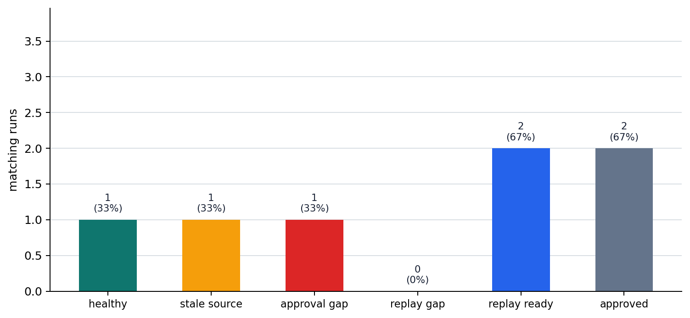

# P6-15.2 Harnesses That Wrap Execution Records and Reproducible Environments

> Section ID: `P6-15.2`
> Version: `v2026.07.23`

In P6-15.1, we saw that MCP is an interface viewpoint that makes connections between models, external tools, and data more consistent. But even if the connection format is organized, it is hard to explain the cause of failure or the effect of improvement again unless the execution flow remains as a record. Now we need to look at the structure that wraps agent execution, leaves logs and evaluation inputs, and manages the flow so it can be repeated.

A harness is close to an execution environment or operational device that wraps an agent or model run and manages inputs, tool calls, results, logs, evaluation inputs, and reproduction information.

## A structure that wraps execution records

The first issue to close is what form should preserve `trace`, `replay information`, and `approval records`. Quality checking is the problem of reading the remaining records as pass criteria, and operational constraints and failure handling are the problem of moving that judgment into real service control.

Here, we read a harness not as the name of a single product, but as `a wrapping structure that controls, records, and evaluates execution`.

If the previous sections were about creating connection and execution structures, a harness explains why the `trace`, `log`, `replay information`, and `approval record` left by that execution become inputs to evaluation criteria. A good execution record is not an operational appendix. It is an input that supports the question `by what standard should we judge this as acceptable`.

A harness fixes three axes. First, what should remain as a trace and replay information? Second, why does this record become evaluation input? Third, what do MCP and harnesses each handle among connection and execution management? The core viewpoint changes from `was the connection done well` to `can we explain and compare the execution that used that connection again`.

The minimum difference among MCP, harnesses, evaluation, and operations can be fixed like this.

| Current level | Core question | What it leads to next |
| --- | --- | --- |
| MCP | What should be connected, and in what shared format? | What trace and replay information should be left for the execution that used the connection? |
| Harness | How should execution be wrapped and recorded? | By what quality criteria should the remaining record be read? |
| Evaluation | Which executions should pass as acceptable? | How should passed executions be operated through cost, latency, and failure control? |
| Operations | Which failures should stop where, and how should they recover? | How should that judgment remain in request flow and run records? |

## Distinguishing execution output from reproducible records

Rather than memorizing harness as a tool name, it is safer to ask which failure cannot be narrowed down again if a certain record is missing. Once this viewpoint is set, a harness can be read not as a simple log store, but as an operational device that makes tool executions connected by MCP explainable again through records such as trace, log, eval, and replay.

| First visible blockage | Record to keep first | Why this record is needed first |
| --- | --- | --- |
| Failure is visible, but the starting point of the error cannot be explained | Trace | Without the execution path, knowledge problems and execution problems cannot be separated. |
| The answer is wrong, but it is unclear whether the issue is search or approval | Read documents, tool calls, approval records | Different operational failures should not be blurred into the same quality problem. |
| It is impossible to compare whether a fix really improved the flow | Replay information and execution settings | Improvement cannot be trusted until the same flow can be run again. |

If we hold this table first while reading the harness role, the difference from MCP, and the cases below, it becomes easier to hold a harness as `a record structure that makes failures explainable again`, not merely `a device that leaves logs`.

## An execution environment that wraps inputs and tool calls

A harness can be scoped more clearly as a bundle of roles.

A harness usually manages:

- what input was used for execution
- which tools were called
- what result came back
- what intermediate failure occurred
- whether the flow can be reproduced

In other words, a harness does not only look at `what the model said`. It handles `how the whole execution should be wrapped and managed`.

```mermaid
--8<-- "assets/part-06/chapter-15/p6-c15-s02-harness-trace-flow-en.mmd"
```

The key point in this figure is that a harness does not leave only the result sentence. It leaves the execution and checking steps that led to that result.

## Execution causes that disappear when only the final answer remains

In a single question-and-answer setting, one log line may be enough. But an agent:

- creates several steps of planning
- calls tools
- encounters intermediate failures
- tries again
- produces the final result

In this structure, looking only at the `final answer` makes it hard to know what went well and what went wrong.

So the following become important.

- Trace: in what order did the flow move?
- Log: what inputs and results were exchanged?
- Evaluation record: was the result acceptable?
- Replay information: can the same flow be reproduced again?

The structure that wraps these requirements is close to a harness.

## The difference between connection format and execution record

This difference must also be separated.

| Structure | Central role |
| --- | --- |
| MCP | Organizes tool and data connection interfaces |
| Harness | Wraps execution, records it, and leaves evaluation input |

In other words:

- MCP is close to `what should be connected and how`.
- A harness is close to `how should the flow that used that connection be managed and explained again`.

They can be used together, but they are not concepts at the same level.

## Misunderstandings caused by narrowing harness to one DevOps tool

If a harness is understood as one specific product or tool, its scope becomes too narrow. A safer explanation is this.

`A harness is closer to a viewpoint of an operational pattern or environment around execution.`

That means a harness can be:

- a test runner
- an evaluation environment
- a trace-collection structure
- an execution wrapper that includes approval and permission checks

The core is the role of `wrapping execution`, not a specific brand.

## Records that bind evaluation and reproducibility

Even if an agent system seems to run well once, it can behave differently next time. So in operation, the following questions become important.

- On what input did it fail?
- Which tool call caused the issue?
- Under what settings is it reproduced?
- Did the fix actually improve it?

These questions are hard to handle without a harness.

In other words, a harness is not just a record. It is the basis for debugging and improvement.

## A flow wrapped by execution and reviewed again by people

```mermaid
--8<-- "assets/part-06/chapter-15/p6-c15-s02-harness-replay-flow-en.mmd"
```

The key point of this diagram is that a harness wraps execution to create `observability` and `improvability`, and when needed, moves the flow to human review or policy blocking.

## Cases and examples

The focus of these cases is not `did it fail`, but `how much must be recorded so the same failure can be explained again`.

### Case 1. Coding agent

Suppose a coding agent changed several files and then tests failed. If we look only at the result, we know the fact that `it failed`, but the path quickly disappears: which file was read first, which patch was inserted, and which test first showed the problem. A person could trace it manually, but as repeated experiments increase, the process starts depending on memory and reconstruction. For example, the last failure may appear in a login test, but the real cause may be one line changed earlier in a shared utility function.

If this path is not left behind, more time can be spent rerunning the same experiment than tracking the cause. With a harness, read files, applied changes, executed tests, and results remain as a trace, making the problem point easier to track again. The criterion changes from looking only at `whether the final result succeeded or failed` to checking `can we retrace which execution path led to the failure`. The result to check in this case is whether the record leaves not only one final failure line, but also which test first broke after which file change.

This is a practical scene because coding-agent output usually passes through several files, several commands, and several verification steps, not one file. Even when people edit manually, finding `which commit broke it` can take time. If an agent applies several patches in a short time, reconstructing the path from memory becomes even harder. So the value of a harness is closer to `making failure explainable again` than to `preventing failure`. A single test failure line tells us that something broke, but not which reading step or which edit created the failure.

The judgment an operator can make changes greatly depending on the record level, even for the same failure.

| Remaining record | How it looks from outside | What can actually be judged again |
| --- | --- | --- |
| One final test failure line | Failure is confirmed | Almost impossible to track which change created the regression |
| Changed file list + final failure | Change scope is visible | The file order and first problematic test remain unclear |
| Read files + patch order + test trace | May look complex | First regression point, unnecessary edits, and missing verification can be separated |

The important criterion in this table is not `more logs are annoying`, but `without logs, the same failure must be experimented with again`. In a coding agent, a harness is not magic that replaces debugging. It is the minimum recording device that makes debugging possible.

### Case 2. Document-research agent

Suppose a document-research agent produced a policy-change summary, but the content was wrong. If a person looks only at the final sentence, it is hard to tell whether the agent summarized incorrectly or searched for the wrong document in the first place. Real improvement can start only after separating those two, but without execution records both remain guesses. For example, accurately summarizing last year's notice and incorrectly summarizing the latest notice are completely different failures.

If this distinction is missing, the decision about whether to fix search logic or summarization prompts also shakes. A harness leaves which documents were searched, which paragraphs were read, and what summarization steps were taken, so the problem can be separated step by step. The criterion changes from asking only `was the answer wrong` to asking `can we distinguish whether the search stage or the summarization stage was wrong`. The result to check in this case is whether a wrong answer actually separates into different causes such as `search failure` and `summary failure`.

This scene also appears often in real operation. A research agent usually handles `finding documents` and `organizing found documents` in one flow. But if only the final summary remains, people easily mix the two. The result `the answer is wrong` does not distinguish whether the search stage selected an old document or whether the latest document was read but interpreted incorrectly. This difference changes the improvement direction completely. The former is a search-priority or freshness-filter problem, and the latter is a summarization-rule or citation-structure problem.

Even for the same wrong answer, the records left by a harness play different roles.

| Wrong-answer scene | Interpretation left without a harness | Cause separated with a harness |
| --- | --- | --- |
| It read last year's notice and summarized it accurately | Blurred as `it failed to summarize` | Search failure, latest-document selection failure |
| It read the latest notice but missed a key clause | Only a guess remains: `did it find the wrong document?` | Summarization failure, failure to preserve key information |
| It read several documents but mixed old and new versions | Only `the conclusion is strange` remains | Document-selection issue and conflict-organization failure can be separated |

The misunderstanding this case corrects is the feeling that `all wrong answers are the same kind of failure`. A harness is needed not to create wrong answers faster, but to split the causes of wrong answers into search level and interpretation level so the next fix priority can be set.

### Case 3. Customer-support agent

Suppose a customer-support agent sent a no-refund answer, but the actual latest policy allowed refunds. The first things a person should check are the flow: `did it read an old policy document`, `did it read correctly but apply the response rule incorrectly`, or `was it sent immediately without an approval step`. But without execution records, only one wrong answer remains, and it is hard to explain organizationally where the error occurred. For example, if the policy interpretation was right but the approval step was skipped and the answer was sent immediately, the problem may be operational-control failure, not model knowledge.

If this difference is invisible, it is hard to design controls to prevent the same answer error again. A harness leaves the read policy, used tool, approval status, and evaluation status together, making audit and reproduction possible. The criterion changes from asking only `was the answer wrong` to asking `in which operational stage did the error occur`. The result to check in this case is whether, when an answer error occurs, the system can explain again which stage was the problem: old document reference, rule-application error, or missing approval.

The three cases can be grouped from an operational viewpoint like this.

| Situation | What the harness must reveal first | Failure that can be separated with that record |
| --- | --- | --- |
| Coding agent | Which files and tests were passed through | Patch problem and missing verification |
| Document-research agent | Which documents were read and which paragraphs were used as evidence | Search failure and interpretation failure |
| Customer-support agent | Which policy and approval path were used | Knowledge error and operational-control error |

## Scenes where execution records should be checked first

A common misunderstanding when first reading harnesses is remembering only that `many logs are left`, without connecting that the logs must actually lead to `reproduction`, `cause separation`, and `operational action`. But the core of a harness is not the quantity of records. It is leaving enough execution detail to explain the same failure again and decide the next action. This criterion can be converted into practical questions like this.

| If you suspect this | First question to ask |
| --- | --- |
| `I know it failed, but I cannot narrow down the cause.` | Which step trace remains? |
| `Is this a model mistake or an operational mistake?` | Are evidence documents, approval, and tool-call records separated? |
| `It was fixed, but did it really improve?` | Can the same run be replayed to compare before and after? |

The criterion to learn first is simple. A harness is not `a device that leaves logs`. It is an operational device that uses `trace`, `approval`, and `replay` to make execution explainable again and pass it to evaluation and operational action.

The core is not `running more executions`. What matters more is that records must remain so we can separate `by what standard should this be acceptable` and `which failure should be treated as a search problem versus an approval problem`.

The shortest version of this connection is:

| What the harness leaves | Following evaluation question | Following operational action |
| --- | --- | --- |
| Search documents and trace | What evidence did the answer come from? | Correct search quality, replace evidence documents |
| Tool-call log and approval status | Was the execution path safe and appropriate? | Add approval gates, adjust call limits |
| Replay ID and execution settings | Can the same failure be reproduced and compared? | Compare before and after fixes, check regressions |

In P6-16, we will read the harness as `evaluation input`, and in P6-17, we will read the same record again as `input for operational control and failure handling`.

## Practice and example

The goal of the example is not to build a whole production harness. It is to see what record artifacts should remain from a local-model execution flow. If only the final answer is stored, we can see that the answer changed, but it is hard to explain again what evidence the model chose, what action it intended to take, and where it stopped. By contrast, if execution input, model decision, tool contracts, tool output, approval gate, and replay criteria remain together, the same request can be compared again later.

The example below uses the OpenAI Agents SDK's `Agent`, `function_tool`, `trace`, and `Runner` together with a local Ollama model. To run it, you need the `openai-agents` package and the `qwen2.5:1.5b` model pulled in Ollama. Before running, the Ollama app or server must be running, and the model name should appear when you run `ollama list` in a terminal. The default path does not use an API key. The prompt for model judgment is written in English according to the Python example guidelines. The local model sees document candidates and produces a policy version, answer draft, and send intent. Then the policy lookup tool is executed locally, and the approval-required send tool is recorded as stopped at the gate. Each execution is stored as a JSON file under `.tmp/p6-15-2-harness-runs/`, and the replay comparison reads the stored run record again.

First, the harness-check criteria to read together in this example are:

| Check item | Why it is needed |
| --- | --- |
| `tool_contracts` | We need to know which tools are exposed with which input format and approval condition. |
| `model_decision` | We need to record which evidence the model chose and what action it intended. |
| `observations` | Input, model output, tool output, and gate status must remain in execution order. |
| `run_artifact` | Observations and the execution summary must remain as a file to be read again later. |
| `replay_id` | The same execution must be reloadable later for comparison. |
| `comparison` | Before and after changes must be read by the same criteria. |

```python
import asyncio
import hashlib
import json
import os
from pathlib import Path
from pprint import pprint
import urllib.error
import urllib.request

from agents import Agent, Runner, function_tool, trace

REQUEST = "Please tell me whether a refund is available after a service outage."
TRACE_WORKFLOW = "refund-support-harness"
ARTIFACT_DIR = Path(".tmp/p6-15-2-harness-runs")
OLLAMA_MODEL = os.environ.get("OLLAMA_MODEL", "qwen2.5:1.5b")
OLLAMA_URL = os.environ.get("OLLAMA_URL", "http://127.0.0.1:11434/api/generate")

POLICY_STORE = {
    "2025_12_01": {
        "document_id": "refund_policy_2025_12_01",
        "refund_allowed_after_outage": False,
        "text": "Refund is not allowed after a service outage.",
    },
    "2026_06_29": {
        "document_id": "refund_policy_2026_06_29",
        "refund_allowed_after_outage": True,
        "text": "Refund is allowed after a service outage.",
    },
}


def read_policy_document_local(policy_version: str) -> dict:
    policy = POLICY_STORE[policy_version]
    return {"policy_version": policy_version, **policy}


def retrieved_policy_docs(order: str) -> list[dict]:
    versions_by_order = {
        "old_first": ["2025_12_01", "2026_06_29"],
        "current_first": ["2026_06_29", "2025_12_01"],
    }
    return [read_policy_document_local(version) for version in versions_by_order[order]]


@function_tool
def read_policy_document(policy_version: str) -> dict:
    """Return the refund policy document selected by version."""
    return read_policy_document_local(policy_version)


@function_tool(needs_approval=True)
def send_refund_reply(customer_id: str, answer: str) -> str:
    """Send a refund reply after human approval."""
    return f"queued reply to {customer_id}: {answer}"


refund_agent = Agent(
    name="Refund support agent",
    instructions=(
        "Answer in English. Read the refund policy document before drafting. "
        "If the answer will be sent to a customer, use the approval-required tool."
    ),
    tools=[read_policy_document, send_refund_reply],
)


def inspect_tool_contract(tool):
    return {
        "name": tool.name,
        "required_inputs": tool.params_json_schema.get("required", []),
        "needs_approval": bool(tool.needs_approval),
    }


def build_model_prompt(request: str, policy_docs: list[dict]) -> str:
    policy_lines = "\n".join(
        "- {policy_version}: {text}".format(**doc)
        for doc in policy_docs
    )
    return f"""Return only compact JSON with these keys:
policy_version, answer_en, send_reply_intent.
Use true or false for send_reply_intent.

User request:
{request}

Retrieved policy documents are ordered by search rank:
{policy_lines}

Use the top-ranked document unless the document itself clearly says it is obsolete.
Choose the policy version you used and draft a short English answer.
"""


def call_local_model(prompt: str) -> str:
    payload = {
        "model": OLLAMA_MODEL,
        "prompt": prompt,
        "stream": False,
        "format": "json",
        "options": {"temperature": 0},
    }
    request = urllib.request.Request(
        OLLAMA_URL,
        data=json.dumps(payload).encode("utf-8"),
        headers={"Content-Type": "application/json"},
    )
    try:
        with urllib.request.urlopen(request, timeout=90) as response:
            data = json.loads(response.read().decode("utf-8"))
    except (urllib.error.URLError, TimeoutError) as error:
        raise RuntimeError(
            "Ollama is not reachable. Start Ollama and check `ollama list` "
            f"for model `{OLLAMA_MODEL}`."
        ) from error
    return data["response"]


def parse_model_json(raw_text: str) -> dict:
    cleaned = raw_text.strip()
    if cleaned.startswith("`"):
        cleaned = cleaned.strip("`")
        cleaned = cleaned.removeprefix("json").strip()
    return json.loads(cleaned)


def normalize_model_decision(raw_text: str) -> dict:
    try:
        decision = parse_model_json(raw_text)
        return {
            "parse_ok": True,
            "policy_version": decision.get("policy_version"),
            "answer_en": decision.get("answer_en"),
            "send_reply_intent": normalize_boolean(decision.get("send_reply_intent")),
            "raw_text": raw_text,
        }
    except json.JSONDecodeError as error:
        return {
            "parse_ok": False,
            "policy_version": None,
            "answer_en": "",
            "send_reply_intent": False,
            "parse_error": str(error),
            "raw_text": raw_text,
        }


def normalize_boolean(value) -> bool:
    if isinstance(value, bool):
        return value
    if isinstance(value, str):
        return value.strip().lower() in {"true", "yes", "y", "1"}
    if isinstance(value, (int, float)):
        return value == 1
    return False


def input_hash(request):
    return hashlib.sha256(request.encode("utf-8")).hexdigest()[:12]


def select_policy(model_decision: dict, policy_docs: list[dict]) -> tuple[dict, bool]:
    selected_version = model_decision["policy_version"]
    if selected_version in POLICY_STORE:
        return read_policy_document_local(selected_version), False
    return policy_docs[0], True


def build_run_record(agent, request, retrieval_order, run_id):
    tool_contracts = [inspect_tool_contract(tool) for tool in agent.tools]
    policy_docs = retrieved_policy_docs(retrieval_order)
    prompt = build_model_prompt(request, policy_docs)
    raw_model_output = call_local_model(prompt)
    model_decision = normalize_model_decision(raw_model_output)

    observations = [
        {"event": "input", "value": request},
        {"event": "retrieved_documents", "order": retrieval_order, "value": policy_docs},
        {"event": "model_prompt", "language": "en", "value": prompt},
        {"event": "model_output", "model": OLLAMA_MODEL, "value": raw_model_output},
        {"event": "model_decision", "value": model_decision},
        {"event": "tool_contracts", "value": tool_contracts},
    ]

    policy, unknown_policy_version = select_policy(model_decision, policy_docs)
    observations.append({"event": "tool_output", "tool": "read_policy_document", "value": policy})

    approval_tool = next(tool for tool in tool_contracts if tool["name"] == "send_refund_reply")
    if model_decision["send_reply_intent"] and approval_tool["needs_approval"]:
        gate_status = "blocked_for_human_approval"
        send_status = "not_sent"
    elif model_decision["send_reply_intent"]:
        gate_status = "not_required"
        send_status = "sent"
    else:
        gate_status = "not_requested"
        send_status = "not_sent"

    observations.append(
        {
            "event": "approval_gate",
            "tool": "send_refund_reply",
            "status": gate_status,
        }
    )

    latest_policy_version = "2026_06_29"
    exception_flags = {
        "model_output_parse_error": not model_decision["parse_ok"],
        "unknown_policy_version": unknown_policy_version,
        "stale_policy_selected": policy["policy_version"] != latest_policy_version,
        "send_intent_blocked_by_gate": gate_status == "blocked_for_human_approval",
    }
    artifact_path = ARTIFACT_DIR / f"{run_id}.json"
    run_report = {
        "agent": agent.name,
        "model": OLLAMA_MODEL,
        "answer": model_decision["answer_en"],
        "retrieval_order": retrieval_order,
        "policy_version": policy["policy_version"],
        "document_id": policy["document_id"],
        "send_status": send_status,
        "gate_status": gate_status,
        "exception_flags": exception_flags,
        "trace": {"workflow": TRACE_WORKFLOW, "group_id": run_id},
        "observation_count": len(observations),
        "artifact_path": str(artifact_path),
        "replay_id": run_id,
    }
    return {
        "schema_version": "p6-15-2-local-run-v1",
        "run_id": run_id,
        "input_hash": input_hash(request),
        "observations": observations,
        "run_report": run_report,
    }


def save_run_record(record):
    ARTIFACT_DIR.mkdir(parents=True, exist_ok=True)
    path = ARTIFACT_DIR / f"{record['run_id']}.json"
    path.write_text(json.dumps(record, ensure_ascii=False, indent=2), encoding="utf-8")
    return path


def load_run_record(run_id):
    path = ARTIFACT_DIR / f"{run_id}.json"
    return json.loads(path.read_text(encoding="utf-8"))


def run_and_record(agent, request, retrieval_order, run_id):
    record = build_run_record(agent, request, retrieval_order, run_id)
    save_run_record(record)
    return record


def compare_saved_runs(before_run_id, after_run_id):
    before = load_run_record(before_run_id)
    after = load_run_record(after_run_id)
    before_report = before["run_report"]
    after_report = after["run_report"]
    return {
        "same_input": before["input_hash"] == after["input_hash"],
        "changed_retrieval_order": before_report["retrieval_order"] != after_report["retrieval_order"],
        "changed_policy_version": before_report["policy_version"] != after_report["policy_version"],
        "changed_answer": before_report["answer"] != after_report["answer"],
        "gate_kept": before_report["gate_status"] == after_report["gate_status"],
        "stale_policy_fixed": (
            before_report["exception_flags"]["stale_policy_selected"]
            and not after_report["exception_flags"]["stale_policy_selected"]
        ),
        "before": before_report,
        "after": after_report,
    }


async def run_live_agent(agent, request, replay_id):
    with trace(TRACE_WORKFLOW, group_id=replay_id):
        result = await Runner.run(
            agent,
            (
                "Customer ID: C-1042\n"
                f"User request: {request}\n"
                "Use policy version 2026_06_29."
            ),
            max_turns=6,
        )
    return {
        "final_output": result.final_output,
        "replay_id": replay_id,
    }


first_run = run_and_record(refund_agent, REQUEST, "old_first", "refund-support-run-001")
second_run = run_and_record(refund_agent, REQUEST, "current_first", "refund-support-run-002")
replayed_first_run = load_run_record("refund-support-run-001")
important_events = {"model_decision", "tool_output", "approval_gate"}
important_observations = []
for event in replayed_first_run["observations"]:
    if event["event"] not in important_events:
        continue
    if event["event"] == "model_decision":
        event = {**event, "value": {k: v for k, v in event["value"].items() if k != "raw_text"}}
    important_observations.append(event)

print("[first run report]")
pprint(first_run["run_report"])
print()

print("[important observations]")
pprint(important_observations)
print()

print("[replay comparison]")
pprint(compare_saved_runs(first_run["run_id"], second_run["run_id"]))

if os.environ.get("RUN_LIVE_AGENT") == "1" and os.environ.get("OPENAI_API_KEY"):
    print("\n[live sdk run]")
    pprint(asyncio.run(run_live_agent(refund_agent, REQUEST, "refund-support-live-001")))
else:
    print("\n[live sdk run skipped]")
    print("Set RUN_LIVE_AGENT=1 and OPENAI_API_KEY to call Runner.run().")
```

Without an API key, the result looks like this. This output includes the policy choice and answer draft actually created by the local model. From the harness viewpoint, the important part is not the answer sentence itself, but how the run that chose the stale policy and the run that chose the current policy are recorded and compared.

```text
[first run report]
{'agent': 'Refund support agent',
 'answer': 'Refund is not available after a service outage.',
 'artifact_path': '.tmp/p6-15-2-harness-runs/refund-support-run-001.json',
 'document_id': 'refund_policy_2025_12_01',
 'exception_flags': {'model_output_parse_error': False,
                     'send_intent_blocked_by_gate': True,
                     'stale_policy_selected': True,
                     'unknown_policy_version': False},
 'gate_status': 'blocked_for_human_approval',
 'model': 'qwen2.5:1.5b',
 'observation_count': 8,
 'policy_version': '2025_12_01',
 'replay_id': 'refund-support-run-001',
 'retrieval_order': 'old_first',
 'send_status': 'not_sent',
 'trace': {'group_id': 'refund-support-run-001',
           'workflow': 'refund-support-harness'}}

[important observations]
[{'event': 'model_decision',
  'value': {'answer_en': 'Refund is not available after a service outage.',
            'parse_ok': True,
            'policy_version': '2025_12_01',
            'send_reply_intent': True}},
 {'event': 'tool_output',
  'tool': 'read_policy_document',
  'value': {'document_id': 'refund_policy_2025_12_01',
            'policy_version': '2025_12_01',
            'refund_allowed_after_outage': False,
            'text': 'Refund is not allowed after a service outage.'}},
 {'event': 'approval_gate',
  'status': 'blocked_for_human_approval',
  'tool': 'send_refund_reply'}]

[replay comparison]
{'after': {'agent': 'Refund support agent',
           'answer': 'A refund is available.',
           'artifact_path': '.tmp/p6-15-2-harness-runs/refund-support-run-002.json',
           'document_id': 'refund_policy_2026_06_29',
           'exception_flags': {'model_output_parse_error': False,
                               'send_intent_blocked_by_gate': True,
                               'stale_policy_selected': False,
                               'unknown_policy_version': False},
           'gate_status': 'blocked_for_human_approval',
           'model': 'qwen2.5:1.5b',
           'observation_count': 8,
           'policy_version': '2026_06_29',
           'replay_id': 'refund-support-run-002',
           'retrieval_order': 'current_first',
           'send_status': 'not_sent',
           'trace': {'group_id': 'refund-support-run-002',
                     'workflow': 'refund-support-harness'}},
 'before': {'agent': 'Refund support agent',
            'answer': 'Refund is not available after a service outage.',
            'artifact_path': '.tmp/p6-15-2-harness-runs/refund-support-run-001.json',
            'document_id': 'refund_policy_2025_12_01',
            'exception_flags': {'model_output_parse_error': False,
                                'send_intent_blocked_by_gate': True,
                                'stale_policy_selected': True,
                                'unknown_policy_version': False},
            'gate_status': 'blocked_for_human_approval',
            'model': 'qwen2.5:1.5b',
            'observation_count': 8,
            'policy_version': '2025_12_01',
            'replay_id': 'refund-support-run-001',
            'retrieval_order': 'old_first',
            'send_status': 'not_sent',
            'trace': {'group_id': 'refund-support-run-001',
                      'workflow': 'refund-support-harness'}},
 'changed_answer': True,
 'changed_policy_version': True,
 'changed_retrieval_order': True,
 'gate_kept': True,
 'same_input': True,
 'stale_policy_fixed': True}

[live sdk run skipped]
Set RUN_LIVE_AGENT=1 and OPENAI_API_KEY to call Runner.run().
```

The first thing to notice in this example is the record frame surrounding the execution, not the `Runner.run()` call itself. The first run is a situation where an old policy appears first in search ranking, and the local model follows that top document and chooses the `2025_12_01` policy. The second run is a situation where the current policy appears first, and the replay comparison leaves `changed_retrieval_order`, `changed_policy_version`, and `stale_policy_fixed` together. Because `send_refund_reply` is a send tool marked with `needs_approval=True`, both executions do not send anything and stop as `blocked_for_human_approval`. This difference must remain in the report so that evaluation or operations can separate search-candidate issues, model-judgment issues, and approval-gate issues.



This chart compares a run that stores only the final answer with a run that leaves the local-model execution as a record artifact. The core is not the number of items. Model judgment, tool contracts, actual tool output, approval gate, trace group, saved run artifact, and replay comparison must remain together so that when the same request is run again, we can explain what stayed the same and what changed.

The same execution can be grouped by the three harness axes like this.

| Axis | What the code leaves | Why it is needed for reproducibility |
| --- | --- | --- |
| Observation | `observations` | Input, retrieved candidates, model judgment, tool contracts, tool output, and gate status must be reviewable in the same order. |
| Report | `run_report` | The execution result and execution boundaries must be readable as a human-comparable summary. |
| Reproduction | `save_run_record()`, `load_run_record()`, `compare_saved_runs()` | Stored run records must be reloadable to compare a previous run with a new run. |
| Gate | `needs_approval=True` | Tools that must not run without approval need to be separated at the execution boundary. |

So the result to check in this example is not whether a specific refund answer is correct. The more important result is that even for the same request, the policy and answer chosen by the model can change when the order of search candidates changes, and the harness record leaves that difference as a replay comparison. At the same time, even when there is send intent, the approval gate remains in place and blocks actual sending.

Readers can try these adjustments in the example.

- Change the document order between `old_first` and `current_first` and see how the selected policy and `stale_policy_selected` change.
- Change `OLLAMA_MODEL` to `llama3.2:latest` and see how model output quality and the possibility of `model_output_parse_error` change.
- Change `policy_version` to an arbitrary value in `normalize_model_decision()` and see whether `unknown_policy_version` is recorded and the flow falls back to the top document.
- Remove `needs_approval=True` from `send_refund_reply` and see how the approval gate disappears from the report and how `send_status` changes.
- Remove the `save_run_record()` call and see why previous and new executions become hard to compare even if observations exist.
- Set `RUN_LIVE_AGENT=1` and `OPENAI_API_KEY` and see whether the actual `Runner.run()` result is grouped under the same `trace.group_id`.

One more step separates what a harness directly fixes from what evaluation or operations must judge again based on harness records.

| First visible signal | What the harness must leave | Judgment the harness does not make for us |
| --- | --- | --- |
| Only the final answer remains | Input, tool-call trace, replay ID | The standard for comparing old and new executions |
| Before-and-after comparison is needed | Replay ID, execution settings, trace storage status | Re-evaluating under the same conditions whether regressions decreased |
| Execution went out without approval | Approval status and actual send path | Adding approval gates and strengthening automatic blocking policy |
| A specific failure cannot be reproduced again | Input, tool calls, intermediate-state records | Deciding whether non-reproducibility itself is an operational risk |

The key point of this table is that a harness is neither `the level that judges good or bad` nor the level that automatically fixes operational problems. A harness is the record layer that makes judgment and action possible. The evaluation chapter reads this record as quality criteria, and the operations chapter reads the same record as control and recovery action.

## Execution records that become evaluation input

The previous example is not code that implements a whole commercial operation harness. It is a scene that checks the minimum observations and reproduction criteria needed when wrapping an SDK run. The important point is not listing many record items. It is that if only one result sentence remains, execution conditions and intermediate observations disappear, making replay comparison impossible.

The harness viewpoint is not `a device that stores answer results`, but `an execution-record structure that makes the same execution explainable and comparable again`. If we look only at the answer sentence, it is easy to say only `acceptable` or `strange`. But when the observation report, approval record, and replay information remain together, evaluation axes can be separated into questions such as `was it the same request`, `was it the same tool result`, and `was it the same approval path`.

At this point, the execution record moves into the next chapter as evaluation input. In P6-16, we will read not one result sentence, but the trace, evidence documents, approval state, and replayability left by the harness as quality criteria. In P6-17, we will read the same records again as operational controls such as cost, latency, failure blocking, and human review.

## Checklist

- You should be able to explain a harness not as `one tool`, but as `an operational device that wraps execution, records it, and leaves evaluation input`.
- You should be able to say that MCP handles connection, while a harness handles execution management and reproduction criteria.
- You should know that evaluation is not an abstract judgment floating separately from the harness, but a stage that reads execution records through quality criteria.

## Sources and Further Reading

- OpenAI, [Integrations and observability](https://developers.openai.com/api/docs/guides/agents/integrations-observability){: target="_blank" rel="noopener noreferrer" }, OpenAI API Docs, accessed 2026-07-19.
- OpenAI, [Evaluate agent workflows](https://developers.openai.com/api/docs/guides/agent-evals){: target="_blank" rel="noopener noreferrer" }, OpenAI API Docs, accessed 2026-07-19.
- OpenAI, [Agents SDK](https://developers.openai.com/api/docs/guides/agents){: target="_blank" rel="noopener noreferrer" }, OpenAI API Docs, accessed 2026-07-19.
