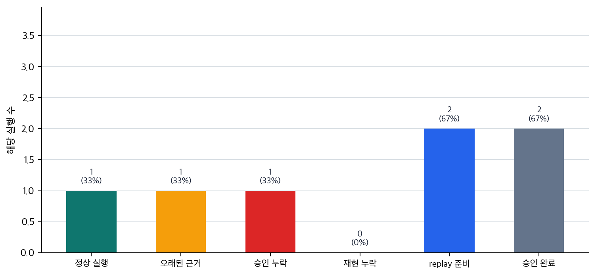

# P6-16.2 실행 기록과 재현 환경을 감싸는 하네스

> Section ID: `P6-16.2`
> Version: `v2026.07.31`

하네스 기록은 `input_snapshot`, `tool_call_log`, `environment_state`, `approval_state`, `output_snapshot`, `replay_note`로 나누어 남깁니다. 그래야 최종 답변만 보는 대신, 같은 실행이 왜 그렇게 흘렀는지 다시 확인할 수 있습니다.

P6-16.1에서는 MCP가 모델과 외부 도구, 데이터 사이의 연결을 더 일관되게 만드는 인터페이스 관점이라는 점을 보았습니다. 하지만 연결 형식이 정리되어도 실행이 어떻게 진행되었는지 남지 않으면, 실패 원인과 개선 효과를 다시 설명하기 어렵습니다. 이제는 AI 에이전트 실행을 감싸고, 로그와 평가 입력을 남기며, 반복 가능하게 관리하는 구조를 봐야 합니다.

하네스(harness)는 에이전트나 모델 실행을 감싸서 입력, 도구 호출, 결과, 로그, 평가 입력, 재현 정보를 관리하는 실행 환경 또는 운영 장치에 가깝습니다.

## 실행 기록을 감싸는 구조

먼저 닫을 문제는 `실행 추적(trace)`, `재현 실행 정보(replay)`, `승인 기록(approval)`을 어떤 형태로 남길 것인가입니다. 품질 점검은 남은 기록을 통과 기준으로 읽는 문제이고, 운영 제약과 실패 대응은 그 판단을 실제 서비스 통제로 옮기는 문제입니다.

여기서는 harness를 단일 제품명처럼 보지 않고, `실행을 통제하고 기록하고 평가하는 감싸는 구조`로 읽습니다.

앞 절까지가 연결과 실행 구조를 만드는 쪽이었다면, harness는 그 실행에서 남긴 `실행 추적(trace)`, `로그(log)`, `재현 실행 정보(replay)`, `승인 기록(approval)`이 왜 평가 기준의 입력이 되는지 다룹니다. 좋은 실행 기록은 운영 부록이 아니라 `무엇을 기준으로 괜찮다고 판정할까`를 떠받치는 입력입니다.

하네스가 고정하는 축은 세 가지입니다. 첫째, 무엇을 어떤 실행 추적(trace)과 재현 실행 정보(replay)로 남겨야 하는가. 둘째, 이 기록이 왜 평가 입력이 되는가. 셋째, MCP와 하네스가 각각 연결과 실행 관리 중 무엇을 맡는가입니다. 핵심은 `연결을 잘했는가`에서 `그 연결을 쓴 실행을 다시 설명하고 비교할 수 있는가`로 관점이 바뀌는 데 있습니다.

MCP, 하네스, 평가, 운영의 최소 차이는 아래 표처럼 고정할 수 있습니다.

| 현재 층위 | 핵심 질문 | 이어지는 중심 |
| --- | --- | --- |
| MCP | 무엇과 어떤 공통 형식으로 연결할까? | 그 연결을 쓴 실행을 어떤 실행 추적(trace)과 재현 실행 정보(replay)로 남길까 |
| harness | 실행을 어떻게 감싸고 기록할까? | 남긴 기록을 어떤 품질 기준으로 읽을까 |
| evaluation | 어떤 실행을 괜찮다고 통과시킬까? | 통과한 실행을 비용, 지연 시간, 실패 통제로 어떻게 운영할까 |
| operations | 어떤 실패를 어디서 멈추고 복구할까? | 그 판단을 요청 흐름과 요청 실행 기록으로 어떻게 남길까 |

## 실행 결과와 재현 가능한 기록의 구분

하네스를 도구 이름처럼 외우기보다, 어떤 기록이 없으면 어떤 실패를 다시 못 좁히는지 기준으로 삼는 편이 더 안전합니다. 이 관점이 잡히면 하네스를 단순 로그 저장소가 아니라, MCP가 연결한 도구 실행을 trace, log, eval, replay 같은 기록으로 다시 설명하게 만드는 운영 장치로 읽을 수 있습니다.

| 먼저 보인 막힘 | 가장 먼저 남겨야 할 기록 | 왜 이 기록이 먼저 필요한가 |
| --- | --- | --- |
| 실패는 보이는데 어디서부터 틀렸는지 설명이 안 됨 | 실행 추적(trace) | 실행 경로가 안 남으면 지식 문제와 실행 문제를 분리할 수 없기 때문입니다. |
| 답이 틀렸는데 검색 문제인지 승인 문제인지 헷갈림 | 읽은 문서, tool call, 승인 기록(approval) | 서로 다른 운영 실패를 같은 품질 문제로 뭉개지 않으려면 기록 층을 나눠 봐야 하기 때문입니다. |
| 수정 후 정말 나아졌는지 비교가 안 됨 | 재현 실행 정보(replay)와 실행 설정 | 같은 흐름을 다시 돌려 보기 전에는 개선 여부를 신뢰하기 어렵기 때문입니다. |

이 표를 먼저 잡고 아래의 하네스 역할, MCP와의 차이, 사례를 읽으면, 하네스를 `로그를 남기는 장치`보다 `어떤 실패를 다시 설명하게 만드는 기록 구조인가`로 더 쉽게 붙잡을 수 있습니다.

## 입력과 도구 호출까지 감싸는 실행 환경

하네스는 다음 역할 묶음으로 보면 범위를 더 분명하게 잡을 수 있습니다.

하네스는 보통:

- 어떤 입력으로 실행했는지
- 어떤 도구를 호출했는지
- 어떤 결과가 나왔는지
- 중간에 어떤 실패가 있었는지
- 다시 재현할 수 있는지

를 관리하는 역할을 합니다.

즉, 하네스는 `모델이 무엇을 말했는가`만 보는 것이 아니라, `그 실행 전체를 어떻게 감싸고 관리할 것인가`를 다룹니다.

```mermaid
--8<-- "assets/part-06/chapter-15/p6-c15-s02-harness-trace-flow-ko.mmd"
```

이 그림의 핵심은 하네스가 결과 문장만 남기는 것이 아니라, 그 결과에 이르기까지의 실행과 점검 단계를 함께 남긴다는 점입니다.

## 최종 답만 보면 사라지는 실행 원인

단일 질의응답에서는 로그 한 줄로 끝날 수 있습니다. 하지만 에이전트는:

- 여러 단계 계획을 만들고
- 도구를 호출하고
- 중간 실패를 겪고
- 다시 시도하고
- 최종 결과를 냅니다

이 구조에서는 `최종 답변`만 보면 무엇이 잘됐고 무엇이 틀렸는지 알기 어렵습니다.

그래서 다음이 중요해집니다.

- 실행 추적(trace): 어떤 순서로 움직였는가
- 로그(log): 어떤 입력과 결과가 오갔는가
- 평가 기록(eval): 결과가 괜찮았는가
- 재현 실행 정보(replay): 같은 흐름을 다시 재현할 수 있는가

이 요구를 감싸는 구조가 바로 harness에 가깝습니다.

## 연결 형식과 실행 기록의 차이

이 차이도 분리해야 합니다.

| 구조 | 중심 역할 |
| --- | --- |
| MCP | 도구와 데이터 연결 인터페이스를 정리한다 |
| harness | 실행을 감싸고 기록하고 평가 입력을 남긴다 |

즉:

- MCP는 `무엇과 어떻게 연결할까`에 가깝고
- harness는 `그 연결을 써서 실행한 흐름을 어떻게 관리하고 다시 설명할까`에 가깝습니다

둘은 함께 쓰일 수 있지만 같은 층위의 개념은 아닙니다.

## 단일 DevOps 도구로 좁히면 생기는 오해

하네스를 단일 제품이나 특정 도구 하나로 이해하면 범위가 너무 좁아집니다. 더 안전한 설명은 다음입니다.

`하네스는 실행을 둘러싼 운영 패턴 또는 환경이라는 관점이 더 가깝다.`

즉, harness는:

- 테스트 러너일 수도 있고
- 평가 환경일 수도 있고
- trace 수집 구조일 수도 있고
- 승인과 권한 체크를 포함한 실행 래퍼일 수도 있습니다

핵심은 특정 브랜드보다 `실행을 감싸는 역할`입니다.

## 평가와 재현성을 함께 묶는 기록

agent 시스템은 한 번 잘 돌아가는 것처럼 보여도, 다음 번에는 다른 행동을 할 수 있습니다. 따라서 운영에서는 다음이 중요해집니다.

- 어떤 입력에서 실패했는가
- 어떤 도구 호출이 원인이었는가
- 어떤 설정에서 재현되는가
- 수정 후 실제로 나아졌는가

이 질문들은 harness 없이는 다루기 어렵습니다.

즉, harness는 단순 기록이 아니라 `디버깅과 개선의 기반`입니다.

## 실행을 감싼 뒤 사람이 다시 보는 흐름

```mermaid
--8<-- "assets/part-06/chapter-15/p6-c15-s02-harness-replay-flow-ko.mmd"
```

이 도식의 핵심은 harness가 실행을 둘러싸서 `관찰 가능성`과 `개선 가능성`을 만들고, 필요하면 사람 검토나 정책 차단으로 넘기는 구조라는 점입니다.

## 실패 원인을 다시 설명하게 하는 사례

이 사례들의 초점은 `실패했는가`보다 `어디까지 기록되어 있어야 같은 실패를 다시 설명할 수 있는가`입니다.

### 사례 1. 코딩 에이전트

코딩 에이전트가 여러 파일을 고친 뒤 테스트가 실패했다고 해 봅시다. 결과만 보면 `실패했다`는 사실은 알 수 있지만, 어떤 파일을 먼저 읽었고 어떤 패치를 넣었으며 어느 테스트에서 처음 문제가 났는지는 금방 사라집니다. 사람이 수동으로 되짚으면 가능한 일이지만, 반복 실험이 많아질수록 기억과 복기에 의존하게 됩니다. 예를 들어 마지막 실패는 로그인 테스트에서 보였지만, 실제 원인은 그 전에 바꾼 공용 유틸 함수 한 줄일 수 있습니다.

이 경로가 남지 않으면 원인 추적보다 같은 실험을 다시 하는 시간이 더 길어질 수 있습니다. harness가 있으면 읽은 파일, 적용한 변경, 실행한 테스트와 결과가 trace로 남아 문제 지점을 다시 추적하기 쉬워집니다. 여기서 바뀌는 점은 `최종 결과가 성공인가 실패인가`만 보던 기준에서 `어떤 실행 경로를 거쳐 실패했는가`를 다시 추적할 수 있는가를 보는 기준으로 이동한다는 것입니다. 그래서 이 사례에서 확인해야 할 결과는 최종 실패 한 줄만 남는 것이 아니라, 어떤 파일 변경 뒤 어떤 테스트가 처음 깨졌는지가 실제로 다시 추적되는가입니다.

이 사례가 실무 장면인 이유는 코딩 에이전트의 출력이 대개 한 파일이 아니라 여러 파일, 여러 명령, 여러 검증 단계를 거치기 때문입니다. 사람이 직접 수정할 때도 `어느 커밋에서 망가졌는가`를 찾는 일이 오래 걸리는데, 에이전트가 짧은 시간에 여러 패치를 연속으로 넣으면 경로를 기억만으로 복기하기 더 어려워집니다. 그래서 하네스의 가치는 `실패를 막아 준다`보다 `실패를 다시 설명하게 해 준다`에 가깝습니다. 테스트 실패 한 줄만 있으면 고장 사실은 알 수 있지만, 어떤 읽기와 어떤 수정이 그 실패를 만들었는지는 남지 않습니다.

같은 실패라도 기록 수준에 따라 운영자가 할 수 있는 판단은 크게 달라집니다.

| 남은 기록 | 겉으로는 어떻게 보이나 | 실제로 다시 판단할 수 있는 것 |
| --- | --- | --- |
| 최종 테스트 실패 한 줄 | 실패는 확인됨 | 어느 변경이 회귀를 만들었는지 거의 추적 불가 |
| 수정 파일 목록 + 최종 실패 | 수정 범위는 보임 | 어떤 파일 순서와 어떤 테스트가 처음 문제였는지는 불분명 |
| 읽은 파일 + 패치 순서 + 테스트 trace | 복잡해 보일 수 있음 | 최초 회귀 지점, 불필요한 수정, 검증 누락을 분리 가능 |

이 표에서 중요한 기준은 `로그가 많으면 번거롭다`가 아니라 `로그가 없으면 같은 실패를 다시 실험해야 한다`는 점입니다. 코딩 에이전트에서 하네스는 디버깅을 대신하는 마법이 아니라, 디버깅을 가능한 상태로 만드는 최소 기록 장치입니다.

### 사례 2. 문서 조사 에이전트

문서 조사 에이전트가 정책 변경 요약을 냈는데 내용이 틀렸다고 해 봅시다. 사람이 최종 문장만 보면 에이전트가 잘못 요약했는지, 애초에 엉뚱한 문서를 검색했는지 구분하기 어렵습니다. 실제 개선은 이 둘을 나누어 봐야 시작할 수 있는데, 실행 기록이 없으면 둘 다 추측으로만 남습니다. 예를 들어 작년 공지를 읽고 정확히 요약한 것과, 최신 공지를 읽고도 잘못 요약한 것은 완전히 다른 실패입니다.

이 구분이 안 되면 검색 로직을 고쳐야 할지 요약 프롬프트를 고쳐야 할지 판단도 흔들립니다. harness는 어떤 문서를 검색했는지, 어떤 문단을 읽었는지, 어떤 요약 단계를 거쳤는지를 함께 남겨 문제를 단계별로 나눠 보게 합니다. 여기서 바뀌는 점은 `답이 틀렸는가`만 보던 기준에서 `검색 단계와 요약 단계 중 어디서 틀렸는가`를 구분할 수 있는가를 보는 기준으로 이동한다는 것입니다. 그래서 이 사례에서 확인해야 할 결과는 틀린 답이 나왔을 때 `검색 실패`와 `요약 실패`가 실제로 서로 다른 원인으로 분리되어 보이는가입니다.

이 장면도 실제 운영에서 자주 생깁니다. 조사 에이전트는 보통 `문서를 찾는 일`과 `찾은 문서를 정리하는 일`을 한 흐름 안에서 처리합니다. 그런데 최종 요약만 남기면 사람은 둘을 쉽게 섞어 봅니다. `답이 틀렸다`는 결과만으로는 검색 단계가 오래된 문서를 골랐는지, 최신 문서를 읽고도 해석을 잘못했는지 구분되지 않기 때문입니다. 이 차이는 개선 방향을 완전히 바꿉니다. 전자는 검색 우선순위나 최신성 필터 문제이고, 후자는 요약 규칙이나 인용 구조 문제입니다.

같은 오답이라도 하네스가 남겨 주는 기록은 다음처럼 역할이 다릅니다.

| 오답 장면 | 하네스가 없으면 남는 해석 | 하네스가 있으면 분리되는 원인 |
| --- | --- | --- |
| 작년 공지를 읽고 정확히 요약함 | `요약을 못했다`로 뭉뚱그려짐 | 검색 실패, 최신 문서 선택 실패 |
| 최신 공지를 읽고 핵심 조항을 빠뜨림 | `문서를 잘못 찾았나?`로 추측만 남음 | 요약 실패, 핵심 정보 보존 실패 |
| 여러 문서를 읽었지만 구버전과 신버전을 섞음 | `결론이 이상하다`만 남음 | 문서 선택 문제와 충돌 정리 실패를 분리 가능 |

이 사례가 바로잡는 오해는 `틀린 답은 다 같은 종류의 실패`라는 감각입니다. 하네스가 필요한 이유는 오답을 더 빨리 만드는 것이 아니라, 오답의 원인을 검색 층과 해석 층으로 갈라서 다음 수정 우선순위를 정하게 만드는 데 있습니다.

### 사례 3. 고객 지원 에이전트

고객 지원 에이전트가 환불 불가 답변을 냈는데 실제 최신 정책은 환불 가능이었다고 해 봅시다. 이때 사람이 먼저 확인해야 할 것은 `정책 문서를 오래된 것으로 읽었는가`, `읽은 내용은 맞았지만 응답 규칙이 잘못 적용되었는가`, `승인 단계 없이 바로 전송되었는가` 같은 흐름입니다. 하지만 실행 기록이 없으면 잘못된 답 하나만 남고, 어디서 틀렸는지 조직적으로 설명하기가 어려워집니다. 예를 들어 정책 해석은 맞았지만 승인 단계를 건너뛰어 바로 발송했다면, 문제는 모델 지식이 아니라 운영 통제 실패일 수 있습니다.

이런 차이가 보이지 않으면 같은 답변 오류를 다시 막기 위한 통제도 설계하기 어렵습니다. harness는 읽은 정책, 사용한 도구, 승인 여부, 평가 상태를 함께 남겨 감사와 재현을 가능하게 합니다. 여기서 바뀌는 점은 `답변이 틀렸는가`만 보던 기준에서 `오류가 어떤 운영 단계에서 발생했는가`를 보는 기준으로 이동한다는 것입니다. 그래서 이 사례에서 확인해야 할 결과는 답변 오류가 났을 때 오래된 문서 참조, 규칙 적용 오류, 승인 누락 중 어느 단계에서 문제가 났는지가 실제로 다시 설명되는가입니다.

세 사례를 운영 관점으로 묶으면 다음과 같습니다.

| 상황 | 하네스가 먼저 드러내야 하는 것 | 그 기록으로 분리해 볼 수 있는 실패 |
| --- | --- | --- |
| 코딩 AI 에이전트 | 어느 파일과 테스트를 거쳤는가 | 패치 문제와 검증 누락 |
| 문서 조사 AI 에이전트 | 어떤 문서를 읽고 어떤 문단을 근거로 삼았는가 | 검색 실패와 해석 실패 |
| 고객 지원 AI 에이전트 | 어떤 정책과 승인 경로를 거쳤는가 | 지식 오류와 운영 통제 오류 |

## 실행 기록을 먼저 봐야 하는 장면

하네스를 처음 읽을 때 자주 생기는 오해는 `로그를 많이 남긴다`는 사실만 기억하고, 그 로그가 실제로 `재현`, `원인 분리`, `운영 조치`로 이어질 수 있어야 한다는 점까지는 바로 연결하지 못하는 점입니다. 하지만 하네스의 핵심은 기록의 양이 아니라, 같은 실패를 다시 설명하고 다음 조치를 결정할 수 있을 정도로 실행을 남기는 데 있습니다. 이 기준을 실무 질문으로 바꾸면 다음처럼 읽을 수 있습니다.

| 이런 의심이 들면 | 먼저 던질 질문 |
| --- | --- |
| `실패는 알겠는데 원인을 못 좁히겠다` | 어느 단계 trace가 남아 있는가? |
| `이건 모델 실수인가 운영 실수인가?` | 근거 문서, 승인, tool call 기록이 분리되어 있는가? |
| `고쳤다는데 정말 나아졌나?` | 같은 run을 replay해 수정 전후를 비교할 수 있는가? |

먼저 익혀야 하는 기준은 단순합니다. harness는 `로그를 남기는 장치`가 아니라, `trace`, `approval`, `replay`를 통해 실행을 다시 설명하고 평가·운영 조치로 넘길 수 있게 만드는 운영 장치입니다.

핵심은 `실행을 더 많이 시킨다`가 아닙니다. 실행 기록을 남겨야만 `무엇을 기준으로 괜찮다고 볼 것인가`, `어느 실패를 검색 문제로 보고 어느 실패를 승인 문제로 볼 것인가`를 나눠 읽을 수 있다는 점이 더 중요합니다.

이 연결을 가장 짧게 잡으면 다음과 같습니다.

| 하네스에서 남기는 것 | 이어지는 평가 질문 | 이어지는 운영 조치 |
| --- | --- | --- |
| 검색 문서와 trace | 답이 어떤 근거 위에서 나왔는가 | 검색 품질 보정, 근거 문서 교체 |
| tool call log와 승인 상태 | 실행 경로가 안전하고 적절했는가 | 승인 게이트 추가, 호출 제한 조정 |
| replay ID와 실행 설정 | 같은 실패를 다시 재현해 비교할 수 있는가 | 수정 전후 비교, 회귀 점검 |

즉, P6-16에서는 하네스를 `평가 입력`으로 읽고, P6-17에서는 같은 기록을 `운영 통제와 실패 대응 입력`으로 다시 읽습니다.

## 하네스 기록을 직접 남겨 보기

예제의 목표는 실제 서비스 하네스 전체를 만드는 것이 아니라, 로컬 모델이 만든 실행 흐름을 어떤 기록 산출물로 남겨야 하는지 보는 것입니다. 최종 답만 저장하면 답이 바뀐 사실은 알 수 있어도, 모델이 어떤 근거를 골랐고 어떤 행동을 하려 했으며 어디서 멈췄는지는 다시 설명하기 어렵습니다. 반대로 실행 입력, 모델 판단, 도구 계약, 도구 출력, 승인 gate, replay 기준이 함께 남으면 같은 요청을 나중에 다시 놓고 비교할 수 있습니다.

아래 예제는 OpenAI Agents SDK의 `Agent`, `function_tool`, `trace`, `Runner`와 로컬 Ollama 모델을 함께 사용합니다. 실행하려면 `openai-agents` 패키지와 Ollama에 내려받은 `qwen2.5:1.5b` 모델이 필요합니다. 실행 전에는 Ollama 앱이나 서버가 켜져 있어야 하고, 터미널에서 `ollama list`로 모델 이름이 보이는지 확인해야 합니다. 기본 경로는 API 키를 쓰지 않습니다. 모델 판단용 프롬프트는 Python 예제 가이드라인에 맞춰 영어로 작성하고, 사용자 요청만 한국어 원문으로 둡니다. 로컬 모델은 문서 후보를 보고 정책 버전과 답변 초안, 전송 의도를 냅니다. 그 다음 정책 조회 도구를 실제로 실행하고, 승인 필요한 전송 도구는 gate에서 멈춘 것으로 기록합니다. 각 실행은 `.tmp/p6-15-2-harness-runs/` 아래 JSON 파일로 저장되고, replay 비교는 저장된 실행 기록을 다시 읽어서 수행합니다.

먼저 이 예제에서 함께 볼 하네스 점검 기준은 다음과 같습니다.

| 점검 항목 | 왜 필요한가 |
| --- | --- |
| `tool_contracts` | 어떤 도구가 어떤 입력 형식과 승인 조건으로 노출되는지 알아야 해서 |
| `model_decision` | 모델이 어떤 근거를 골랐고 어떤 행동을 하려 했는지 남겨야 해서 |
| `observations` | 입력, 모델 출력, 도구 출력, gate 상태를 실행 순서대로 남겨야 해서 |
| `run_artifact` | 관측값과 실행 요약을 파일로 남겨 나중에 다시 읽어야 해서 |
| `replay_id` | 같은 실행을 나중에 다시 불러 비교해야 해서 |
| `comparison` | 수정 전후에 무엇이 달라졌는지 같은 기준으로 봐야 해서 |

```python
import asyncio
import hashlib
import json
import os
from pathlib import Path
from pprint import pprint
import urllib.error
import urllib.request

from agents import Agent, Runner, function_tool, trace

REQUEST = "서비스 장애 뒤 환불 가능 여부를 알려 주세요."
TRACE_WORKFLOW = "refund-support-harness"
ARTIFACT_DIR = Path(".tmp/p6-15-2-harness-runs")
OLLAMA_MODEL = os.environ.get("OLLAMA_MODEL", "qwen2.5:1.5b")
OLLAMA_URL = os.environ.get("OLLAMA_URL", "http://127.0.0.1:11434/api/generate")

POLICY_STORE = {
    "2025_12_01": {
        "document_id": "refund_policy_2025_12_01",
        "refund_allowed_after_outage": False,
        "text": "Refund is not allowed after a service outage.",
    },
    "2026_06_29": {
        "document_id": "refund_policy_2026_06_29",
        "refund_allowed_after_outage": True,
        "text": "Refund is allowed after a service outage.",
    },
}


def read_policy_document_local(policy_version: str) -> dict:
    policy = POLICY_STORE[policy_version]
    return {"policy_version": policy_version, **policy}


def retrieved_policy_docs(order: str) -> list[dict]:
    versions_by_order = {
        "old_first": ["2025_12_01", "2026_06_29"],
        "current_first": ["2026_06_29", "2025_12_01"],
    }
    return [read_policy_document_local(version) for version in versions_by_order[order]]


@function_tool
def read_policy_document(policy_version: str) -> dict:
    """Return the refund policy document selected by version."""
    return read_policy_document_local(policy_version)


@function_tool(needs_approval=True)
def send_refund_reply(customer_id: str, answer: str) -> str:
    """Send a refund reply after human approval."""
    return f"queued reply to {customer_id}: {answer}"


refund_agent = Agent(
    name="Refund support agent",
    instructions=(
        "Answer in Korean. Read the refund policy document before drafting. "
        "If the answer will be sent to a customer, use the approval-required tool."
    ),
    tools=[read_policy_document, send_refund_reply],
)


def inspect_tool_contract(tool):
    return {
        "name": tool.name,
        "required_inputs": tool.params_json_schema.get("required", []),
        "needs_approval": bool(tool.needs_approval),
    }


def build_model_prompt(request: str, policy_docs: list[dict]) -> str:
    policy_lines = "\n".join(
        "- {policy_version}: {text}".format(**doc)
        for doc in policy_docs
    )
    return f"""Return only compact JSON with these keys:
policy_version, answer_ko, send_reply_intent.
Use true or false for send_reply_intent.

User request in Korean:
{request}

Retrieved policy documents are ordered by search rank:
{policy_lines}

Use the top-ranked document unless the document itself clearly says it is obsolete.
Choose the policy version you used and draft a short Korean answer.
"""


def call_local_model(prompt: str) -> str:
    payload = {
        "model": OLLAMA_MODEL,
        "prompt": prompt,
        "stream": False,
        "format": "json",
        "options": {"temperature": 0},
    }
    request = urllib.request.Request(
        OLLAMA_URL,
        data=json.dumps(payload).encode("utf-8"),
        headers={"Content-Type": "application/json"},
    )
    try:
        with urllib.request.urlopen(request, timeout=90) as response:
            data = json.loads(response.read().decode("utf-8"))
    except (urllib.error.URLError, TimeoutError) as error:
        raise RuntimeError(
            "Ollama is not reachable. Start Ollama and check `ollama list` "
            f"for model `{OLLAMA_MODEL}`."
        ) from error
    return data["response"]


def parse_model_json(raw_text: str) -> dict:
    cleaned = raw_text.strip()
    if cleaned.startswith("`"):
        cleaned = cleaned.strip("`")
        cleaned = cleaned.removeprefix("json").strip()
    return json.loads(cleaned)


def normalize_model_decision(raw_text: str) -> dict:
    try:
        decision = parse_model_json(raw_text)
        return {
            "parse_ok": True,
            "policy_version": decision.get("policy_version"),
            "answer_ko": decision.get("answer_ko"),
            "send_reply_intent": normalize_boolean(decision.get("send_reply_intent")),
            "raw_text": raw_text,
        }
    except json.JSONDecodeError as error:
        return {
            "parse_ok": False,
            "policy_version": None,
            "answer_ko": "",
            "send_reply_intent": False,
            "parse_error": str(error),
            "raw_text": raw_text,
        }


def normalize_boolean(value) -> bool:
    if isinstance(value, bool):
        return value
    if isinstance(value, str):
        return value.strip().lower() in {"true", "yes", "y", "1"}
    if isinstance(value, (int, float)):
        return value == 1
    return False


def input_hash(request):
    return hashlib.sha256(request.encode("utf-8")).hexdigest()[:12]


def select_policy(model_decision: dict, policy_docs: list[dict]) -> tuple[dict, bool]:
    selected_version = model_decision["policy_version"]
    if selected_version in POLICY_STORE:
        return read_policy_document_local(selected_version), False
    return policy_docs[0], True


def build_run_record(agent, request, retrieval_order, run_id):
    tool_contracts = [inspect_tool_contract(tool) for tool in agent.tools]
    policy_docs = retrieved_policy_docs(retrieval_order)
    prompt = build_model_prompt(request, policy_docs)
    raw_model_output = call_local_model(prompt)
    model_decision = normalize_model_decision(raw_model_output)

    observations = [
        {"event": "input", "value": request},
        {"event": "retrieved_documents", "order": retrieval_order, "value": policy_docs},
        {"event": "model_prompt", "language": "en", "value": prompt},
        {"event": "model_output", "model": OLLAMA_MODEL, "value": raw_model_output},
        {"event": "model_decision", "value": model_decision},
        {"event": "tool_contracts", "value": tool_contracts},
    ]

    policy, unknown_policy_version = select_policy(model_decision, policy_docs)
    observations.append({"event": "tool_output", "tool": "read_policy_document", "value": policy})

    approval_tool = next(tool for tool in tool_contracts if tool["name"] == "send_refund_reply")
    if model_decision["send_reply_intent"] and approval_tool["needs_approval"]:
        gate_status = "blocked_for_human_approval"
        send_status = "not_sent"
    elif model_decision["send_reply_intent"]:
        gate_status = "not_required"
        send_status = "sent"
    else:
        gate_status = "not_requested"
        send_status = "not_sent"

    observations.append(
        {
            "event": "approval_gate",
            "tool": "send_refund_reply",
            "status": gate_status,
        }
    )

    latest_policy_version = "2026_06_29"
    exception_flags = {
        "model_output_parse_error": not model_decision["parse_ok"],
        "unknown_policy_version": unknown_policy_version,
        "stale_policy_selected": policy["policy_version"] != latest_policy_version,
        "send_intent_blocked_by_gate": gate_status == "blocked_for_human_approval",
    }
    artifact_path = ARTIFACT_DIR / f"{run_id}.json"
    run_report = {
        "agent": agent.name,
        "model": OLLAMA_MODEL,
        "answer": model_decision["answer_ko"],
        "retrieval_order": retrieval_order,
        "policy_version": policy["policy_version"],
        "document_id": policy["document_id"],
        "send_status": send_status,
        "gate_status": gate_status,
        "exception_flags": exception_flags,
        "trace": {"workflow": TRACE_WORKFLOW, "group_id": run_id},
        "observation_count": len(observations),
        "artifact_path": str(artifact_path),
        "replay_id": run_id,
    }
    return {
        "schema_version": "p6-15-2-local-run-v1",
        "run_id": run_id,
        "input_hash": input_hash(request),
        "observations": observations,
        "run_report": run_report,
    }


def save_run_record(record):
    ARTIFACT_DIR.mkdir(parents=True, exist_ok=True)
    path = ARTIFACT_DIR / f"{record['run_id']}.json"
    path.write_text(json.dumps(record, ensure_ascii=False, indent=2), encoding="utf-8")
    return path


def load_run_record(run_id):
    path = ARTIFACT_DIR / f"{run_id}.json"
    return json.loads(path.read_text(encoding="utf-8"))


def run_and_record(agent, request, retrieval_order, run_id):
    record = build_run_record(agent, request, retrieval_order, run_id)
    save_run_record(record)
    return record


def compare_saved_runs(before_run_id, after_run_id):
    before = load_run_record(before_run_id)
    after = load_run_record(after_run_id)
    before_report = before["run_report"]
    after_report = after["run_report"]
    return {
        "same_input": before["input_hash"] == after["input_hash"],
        "changed_retrieval_order": before_report["retrieval_order"] != after_report["retrieval_order"],
        "changed_policy_version": before_report["policy_version"] != after_report["policy_version"],
        "changed_answer": before_report["answer"] != after_report["answer"],
        "gate_kept": before_report["gate_status"] == after_report["gate_status"],
        "stale_policy_fixed": (
            before_report["exception_flags"]["stale_policy_selected"]
            and not after_report["exception_flags"]["stale_policy_selected"]
        ),
        "before": before_report,
        "after": after_report,
    }


async def run_live_agent(agent, request, replay_id):
    with trace(TRACE_WORKFLOW, group_id=replay_id):
        result = await Runner.run(
            agent,
            (
                "Customer ID: C-1042\n"
                f"User request: {request}\n"
                "Use policy version 2026_06_29."
            ),
            max_turns=6,
        )
    return {
        "final_output": result.final_output,
        "replay_id": replay_id,
    }


first_run = run_and_record(refund_agent, REQUEST, "old_first", "refund-support-run-001")
second_run = run_and_record(refund_agent, REQUEST, "current_first", "refund-support-run-002")
replayed_first_run = load_run_record("refund-support-run-001")
important_events = {"model_decision", "tool_output", "approval_gate"}
important_observations = []
for event in replayed_first_run["observations"]:
    if event["event"] not in important_events:
        continue
    if event["event"] == "model_decision":
        event = {**event, "value": {k: v for k, v in event["value"].items() if k != "raw_text"}}
    important_observations.append(event)

print("[first run report]")
pprint(first_run["run_report"])
print()

print("[important observations]")
pprint(important_observations)
print()

print("[replay comparison]")
pprint(compare_saved_runs(first_run["run_id"], second_run["run_id"]))

if os.environ.get("RUN_LIVE_AGENT") == "1" and os.environ.get("OPENAI_API_KEY"):
    print("\n[live sdk run]")
    pprint(asyncio.run(run_live_agent(refund_agent, REQUEST, "refund-support-live-001")))
else:
    print("\n[live sdk run skipped]")
    print("Set RUN_LIVE_AGENT=1 and OPENAI_API_KEY to call Runner.run().")
```

API 키 없이 실행하면 결과는 다음처럼 나옵니다. 이 출력은 로컬 모델이 실제로 만든 정책 선택과 답변 초안을 포함합니다. 하네스 관점에서 봐야 할 부분은 답변 문장 자체보다, 모델이 오래된 정책을 고른 실행과 최신 정책을 고른 실행이 어떻게 기록되고 비교되는가입니다.

```text
[first run report]
{'agent': 'Refund support agent',
 'answer': '서비스 장애 후 환불이 불가능합니다.',
 'artifact_path': '.tmp/p6-15-2-harness-runs/refund-support-run-001.json',
 'document_id': 'refund_policy_2025_12_01',
 'exception_flags': {'model_output_parse_error': False,
                     'send_intent_blocked_by_gate': True,
                     'stale_policy_selected': True,
                     'unknown_policy_version': False},
 'gate_status': 'blocked_for_human_approval',
 'model': 'qwen2.5:1.5b',
 'observation_count': 8,
 'policy_version': '2025_12_01',
 'replay_id': 'refund-support-run-001',
 'retrieval_order': 'old_first',
 'send_status': 'not_sent',
 'trace': {'group_id': 'refund-support-run-001',
           'workflow': 'refund-support-harness'}}

[important observations]
[{'event': 'model_decision',
  'value': {'answer_ko': '서비스 장애 후 환불이 불가능합니다.',
            'parse_ok': True,
            'policy_version': '2025_12_01',
            'send_reply_intent': True}},
 {'event': 'tool_output',
  'tool': 'read_policy_document',
  'value': {'document_id': 'refund_policy_2025_12_01',
            'policy_version': '2025_12_01',
            'refund_allowed_after_outage': False,
            'text': 'Refund is not allowed after a service outage.'}},
 {'event': 'approval_gate',
  'status': 'blocked_for_human_approval',
  'tool': 'send_refund_reply'}]

[replay comparison]
{'after': {'agent': 'Refund support agent',
           'answer': '환불이 가능합니다.',
           'artifact_path': '.tmp/p6-15-2-harness-runs/refund-support-run-002.json',
           'document_id': 'refund_policy_2026_06_29',
           'exception_flags': {'model_output_parse_error': False,
                               'send_intent_blocked_by_gate': True,
                               'stale_policy_selected': False,
                               'unknown_policy_version': False},
           'gate_status': 'blocked_for_human_approval',
           'model': 'qwen2.5:1.5b',
           'observation_count': 8,
           'policy_version': '2026_06_29',
           'replay_id': 'refund-support-run-002',
           'retrieval_order': 'current_first',
           'send_status': 'not_sent',
           'trace': {'group_id': 'refund-support-run-002',
                     'workflow': 'refund-support-harness'}},
 'before': {'agent': 'Refund support agent',
            'answer': '서비스 장애 후 환불이 불가능합니다.',
            'artifact_path': '.tmp/p6-15-2-harness-runs/refund-support-run-001.json',
            'document_id': 'refund_policy_2025_12_01',
            'exception_flags': {'model_output_parse_error': False,
                                'send_intent_blocked_by_gate': True,
                                'stale_policy_selected': True,
                                'unknown_policy_version': False},
            'gate_status': 'blocked_for_human_approval',
            'model': 'qwen2.5:1.5b',
            'observation_count': 8,
            'policy_version': '2025_12_01',
            'replay_id': 'refund-support-run-001',
            'retrieval_order': 'old_first',
            'send_status': 'not_sent',
            'trace': {'group_id': 'refund-support-run-001',
                      'workflow': 'refund-support-harness'}},
 'changed_answer': True,
 'changed_policy_version': True,
 'changed_retrieval_order': True,
 'gate_kept': True,
 'same_input': True,
 'stale_policy_fixed': True}

[live sdk run skipped]
Set RUN_LIVE_AGENT=1 and OPENAI_API_KEY to call Runner.run().
```

이 예제에서 먼저 봐야 할 것은 `Runner.run()` 호출 자체보다 그 실행을 둘러싼 기록의 틀입니다. 첫 실행은 검색 순위에서 오래된 정책이 먼저 올라온 상황이고, 로컬 모델은 그 상위 문서를 따라 `2025_12_01` 정책을 골랐습니다. 두 번째 실행은 최신 정책이 먼저 올라오도록 바뀐 상황이고, replay 비교에는 `changed_retrieval_order`, `changed_policy_version`, `stale_policy_fixed`가 함께 남습니다. `send_refund_reply`는 `needs_approval=True`가 붙은 전송 도구이므로 두 실행 모두 실제 전송하지 않고 `blocked_for_human_approval`로 멈춥니다. 이 차이가 리포트에 남아야 평가나 운영 단계에서 검색 후보 문제, 모델 판단 문제, 승인 gate 문제를 분리할 수 있습니다.



이 차트는 최종 답만 남기는 실행과 로컬 모델 실행을 기록 산출물로 남기는 경우의 기록 항목을 비교합니다. 핵심은 항목 수 자체가 아니라, 모델 판단, 도구 계약, 실제 도구 출력, approval gate, trace group, 저장된 run artifact, replay 비교가 함께 남아야 같은 요청을 다시 실행했을 때 무엇이 같고 무엇이 달라졌는지 설명할 수 있다는 점입니다.

같은 실행을 하네스의 세 축으로 묶으면 다음처럼 읽을 수 있습니다.

| 축 | 코드에서 남기는 것 | 왜 재현성에 필요한가 |
| --- | --- | --- |
| 관측 | `observations` | 입력, 검색 후보, 모델 판단, 도구 계약, 도구 출력, gate 상태를 같은 순서로 다시 볼 수 있어야 해서 |
| 리포트 | `run_report` | 실행 결과와 실행 경계를 사람이 비교 가능한 요약으로 읽어야 해서 |
| 재현 | `save_run_record()`, `load_run_record()`, `compare_saved_runs()` | 저장된 실행 기록을 다시 읽어 이전 실행과 새 실행을 비교해야 해서 |
| 게이트 | `needs_approval=True` | 승인 없이 나가면 안 되는 도구를 실행 경계에서 분리해야 해서 |

그래서 이 예제에서 확인해야 할 결과는 특정 환불 답변이 맞았는지가 아닙니다. 더 중요한 결과는 같은 요청이라도 검색 후보 순서가 달라지면 모델이 선택한 정책과 답변이 달라질 수 있고, 하네스 기록이 그 차이를 replay 비교로 남긴다는 점입니다. 동시에 전송 의도가 있어도 승인 gate는 계속 유지되어 실제 전송을 막는다는 점도 함께 볼 수 있습니다.

이 예제에서 독자가 직접 해 볼 수 있는 조정은 다음과 같습니다.

- `old_first`와 `current_first`의 문서 순서를 바꿔 모델이 고르는 정책과 `stale_policy_selected`가 어떻게 달라지는지 보기
- `OLLAMA_MODEL`을 `llama3.2:latest`로 바꿔 모델 출력 품질과 `model_output_parse_error` 가능성이 어떻게 달라지는지 보기
- `normalize_model_decision()`에서 `policy_version`을 임의 값으로 바꿔 `unknown_policy_version`이 기록되고 상위 문서로 fallback되는지 보기
- `send_refund_reply`에서 `needs_approval=True`를 제거해 리포트에서 approval gate가 사라지고 `send_status`가 어떻게 바뀌는지 보기
- `save_run_record()` 호출을 제거해 관측값이 있어도 이전 실행과 새 실행을 비교하기 어려워지는지 보기
- `RUN_LIVE_AGENT=1`과 `OPENAI_API_KEY`를 설정해 실제 `Runner.run()` 결과가 같은 `trace.group_id` 아래에 묶이는지 보기

여기서 한 단계 더 나가면, 하네스가 직접 고치는 것과 하네스 기록을 바탕으로 평가나 운영에서 다시 판단해야 하는 것을 분리해 읽는 편이 좋습니다.

| 먼저 보인 신호 | 하네스가 남겨야 하는 것 | 하네스가 대신 해결하지 않는 판단 |
| --- | --- | --- |
| 최종 답만 남아 있음 | 입력, tool call trace, replay ID | 이전 실행과 새 실행을 비교할 기준 |
| 수정 전후를 비교해야 함 | replay ID, 실행 설정, trace 저장 여부 | 회귀가 줄었는지 같은 조건에서 재평가 |
| 승인 없이 실행이 나감 | approval 상태와 실제 전송 경로 | 승인 게이트 추가, 자동 차단 정책 보강 |
| 특정 실패가 다시 재현되지 않음 | 입력, 도구 호출, 중간 상태 기록 | 재현 불가 상태를 운영 리스크로 볼지 판단 |

이 표의 핵심은 하네스가 `좋다/나쁘다를 판정하는 층`도, 운영 문제를 자동으로 고치는 층도 아니라는 점입니다. 하네스는 판정과 조치를 가능하게 만드는 기록 층입니다. 평가 장은 이 기록을 품질 기준으로 읽고, 운영 장은 같은 기록을 통제와 복구 조치로 읽습니다.

## 평가 입력으로 바뀌는 실행 기록

앞의 예제는 상용 운영 하네스 전체를 구현하는 코드가 아니라, SDK 실행을 감쌀 때 최소한 어떤 관측과 재현 기준이 필요해지는지 확인하는 장면입니다. 중요한 것은 기록 항목을 많이 나열하는 일이 아니라, 결과 문장 하나만 남기면 실행 조건과 중간 관측값이 사라져 재현 비교가 불가능해진다는 점입니다.

하네스 관점은 `답변 결과를 저장하는 장치`가 아니라 `같은 실행을 다시 설명하고 비교하게 만드는 실행 기록 구조`입니다. 답변 문장만 보면 `괜찮다/이상하다` 정도만 말하기 쉽지만, 관측 리포트와 approval 기록, replay 정보까지 함께 보면 `같은 요청이었는가`, `같은 도구 결과였는가`, `같은 승인 경로였는가`처럼 평가 축을 나눌 수 있습니다.

이 지점에서 실행 기록은 다음 장의 평가 입력으로 넘어갑니다. P6-16에서는 결과 문장 하나가 아니라, 하네스가 남긴 trace, 근거 문서, 승인 상태, replay 가능성을 품질 기준으로 읽습니다. P6-17에서는 같은 기록을 비용, 지연 시간, 실패 차단, 사람 검토 같은 운영 통제로 다시 읽습니다.

## 체크리스트
- 하네스를 `도구 하나`가 아니라 `실행을 감싸고 기록하고 평가 입력을 남기는 운영 장치`로 설명할 수 있어야 합니다.
- MCP가 연결을 다루고 하네스가 실행 관리와 재현 기준을 다룬다는 차이를 말할 수 있어야 합니다.
- 평가는 하네스와 별개로 떠 있는 추상 판단이 아니라, 실행 기록을 품질 기준으로 읽는 단계라는 점을 잡고 있어야 합니다.

## 출처와 참고 자료

- OpenAI, [Integrations and observability](https://developers.openai.com/api/docs/guides/agents/integrations-observability){: target="_blank" rel="noopener noreferrer" }, OpenAI API Docs, 확인 날짜: 2026-07-19.
- OpenAI, [Evaluate agent workflows](https://developers.openai.com/api/docs/guides/agent-evals){: target="_blank" rel="noopener noreferrer" }, OpenAI API Docs, 확인 날짜: 2026-07-19.
- OpenAI, [Agents SDK](https://developers.openai.com/api/docs/guides/agents){: target="_blank" rel="noopener noreferrer" }, OpenAI API Docs, 확인 날짜: 2026-07-19.
